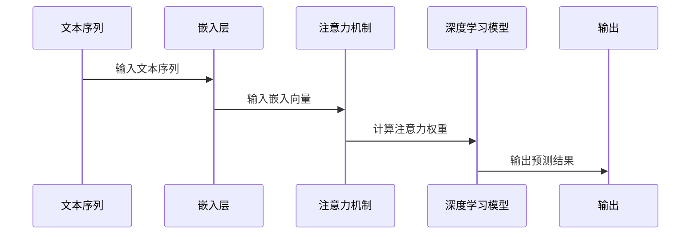

                 

关键词：Python、深度学习、自注意力机制、序列模型、实践、代码实例

摘要：本文将探讨深度学习领域中的一个重要机制——自注意力机制，并详细介绍其在序列模型中的应用。通过Python代码实例，我们将深入理解自注意力机制的工作原理及其在序列建模中的优势。

## 1. 背景介绍

自注意力机制（Self-Attention Mechanism）是近年来在自然语言处理（NLP）和序列建模领域取得突破性进展的一种关键技术。其核心思想是在序列建模过程中，允许模型中的每个元素根据其与其他元素的关系来动态调整其在计算中的权重。自注意力机制不仅能够捕捉序列中的长距离依赖关系，还能提高模型的并行计算效率，从而在许多任务上取得了显著的性能提升。

本文将以Python深度学习实践为背景，详细介绍自注意力机制的核心概念、原理以及在序列模型中的应用。通过具体的代码实例，我们将深入探讨自注意力机制的实现方法及其在现实世界中的应用。

## 2. 核心概念与联系

在介绍自注意力机制之前，我们需要先了解一些基本概念，包括序列、嵌入（Embedding）和注意力机制。

### 序列（Sequence）

序列是一组按特定顺序排列的元素。在NLP任务中，序列通常表示一段文本，如句子、段落或文档。序列建模的目标是理解序列中的信息，并对其进行分类、预测或生成等操作。

### 嵌入（Embedding）

嵌入是将序列中的每个元素映射到一个高维向量空间中的过程。嵌入层的目的是通过将序列中的词或字符映射到连续的向量表示，以便模型能够对其进行处理。

### 注意力机制（Attention Mechanism）

注意力机制是一种在序列建模中用于计算输入序列中不同元素之间关系的机制。其核心思想是通过加权的方式来强调某些重要的信息，同时忽略其他不重要的信息。在自注意力机制中，每个输入元素都会计算其与其他元素之间的相似性，并根据这些相似性来调整其在后续计算中的重要性。

下面是一个简单的 Mermaid 流程图，展示了序列、嵌入和注意力机制之间的关系：



## 3. 核心算法原理 & 具体操作步骤

### 3.1 算法原理概述

自注意力机制的核心思想是通过计算序列中每个元素与其他元素之间的相似性，并利用这些相似性来调整每个元素在后续计算中的重要性。具体来说，自注意力机制包括以下几个关键步骤：

1. **嵌入（Embedding）**：将输入序列映射到高维向量空间。
2. **自注意力计算（Self-Attention Calculation）**：计算每个元素与其他元素之间的相似性，并生成注意力权重。
3. **加权求和（Weighted Summation）**：利用注意力权重对嵌入向量进行加权求和，生成序列的表示。
4. **输出（Output）**：利用序列表示进行分类、预测或生成等操作。

### 3.2 算法步骤详解

下面是一个详细的算法步骤：

1. **输入序列嵌入**：首先，我们将输入序列（例如，一个句子）映射到高维向量空间。这通常通过嵌入层（Embedding Layer）实现。嵌入层将每个单词映射到一个固定大小的向量。例如，对于单词“猫”，其嵌入向量可能表示为 `[1, 0, 0, 0, 0]`。

2. **计算自注意力权重**：接下来，我们计算序列中每个元素与其他元素之间的相似性。这通常通过点积（Dot Product）或缩放点积（Scaled Dot Product）实现。例如，对于序列中的第二个元素“狗”和第四个元素“鱼”，我们可以计算它们的相似性权重为：

   $$ \text{权重} = \frac{QK}{\sqrt{d_k}} $$

   其中，$Q$ 表示查询向量，$K$ 表示键向量，$d_k$ 表示键向量的维度。

3. **加权求和**：利用计算得到的注意力权重对序列的嵌入向量进行加权求和，生成序列的表示。这可以通过以下公式表示：

   $$ \text{序列表示} = \text{softmax}(\text{权重}) \odot \text{嵌入向量} $$

   其中，$\text{softmax}$ 表示软最大化函数，$\odot$ 表示按元素相乘。

4. **输出**：最后，我们利用序列的表示进行分类、预测或生成等操作。例如，在文本分类任务中，我们可以使用序列表示来计算每个类别的概率，并选择概率最高的类别作为预测结果。

### 3.3 算法优缺点

自注意力机制具有以下优点：

- **捕捉长距离依赖关系**：自注意力机制能够有效地捕捉序列中的长距离依赖关系，这对于许多NLP任务（如机器翻译、文本摘要等）具有重要意义。
- **提高并行计算效率**：自注意力机制允许模型在计算过程中并行处理不同元素之间的关系，从而提高计算效率。

然而，自注意力机制也存在一些缺点：

- **计算复杂度高**：自注意力机制的复杂度通常与序列长度和嵌入维度成正比，因此在处理长序列时可能会遇到性能问题。
- **对噪声敏感**：自注意力机制在计算相似性权重时可能会受到噪声的影响，从而导致模型不稳定。

### 3.4 算法应用领域

自注意力机制在许多领域都取得了显著的应用成果，以下是一些典型应用：

- **自然语言处理（NLP）**：自注意力机制在NLP领域得到了广泛应用，如文本分类、机器翻译、文本摘要等。
- **计算机视觉（CV）**：自注意力机制也被应用于计算机视觉任务，如图像分类、目标检测等。
- **语音识别**：自注意力机制在语音识别任务中也表现出色，能够提高模型的准确率和鲁棒性。

## 4. 数学模型和公式 & 详细讲解 & 举例说明

### 4.1 数学模型构建

自注意力机制的数学模型可以表示为：

$$ \text{Attention}(Q, K, V) = \text{softmax}\left(\frac{QK^T}{\sqrt{d_k}}\right)V $$

其中，$Q, K, V$ 分别表示查询向量、键向量和值向量，$d_k$ 表示键向量的维度。

### 4.2 公式推导过程

自注意力机制的推导过程如下：

1. **点积**：首先，我们计算查询向量 $Q$ 和键向量 $K$ 的点积，得到一个实数。

2. **缩放**：为了防止点积过大，我们通常将点积除以 $\sqrt{d_k}$，其中 $d_k$ 是键向量的维度。

3. **软最大化**：然后，我们对缩放后的点积应用软最大化函数（Softmax），得到一个概率分布，表示不同键向量之间的相似性。

4. **加权求和**：最后，我们利用概率分布对值向量 $V$ 进行加权求和，生成序列的表示。

### 4.3 案例分析与讲解

假设我们有一个输入序列 $X = [x_1, x_2, \ldots, x_n]$，其中 $x_i$ 表示序列中的第 $i$ 个元素。我们首先将序列映射到嵌入向量空间，得到嵌入向量 $E = [e_1, e_2, \ldots, e_n]$。

接下来，我们计算每个元素 $e_i$ 的查询向量 $Q_i, K_i, V_i$：

$$ Q_i = \text{W}_Q e_i $$
$$ K_i = \text{W}_K e_i $$
$$ V_i = \text{W}_V e_i $$

其中，$\text{W}_Q, \text{W}_K, \text{W}_V$ 分别是权重矩阵。

然后，我们计算注意力权重：

$$ \text{权重} = \frac{Q_iK_j^T}{\sqrt{d_k}} $$

接下来，我们计算序列的表示：

$$ \text{序列表示} = \text{softmax}(\text{权重}) \odot V $$

最后，我们利用序列的表示进行分类、预测或生成等操作。

## 5. 项目实践：代码实例和详细解释说明

### 5.1 开发环境搭建

为了进行自注意力机制的实践，我们需要安装以下Python库：

- TensorFlow
- Keras

以下是安装命令：

```shell
pip install tensorflow
pip install keras
```

### 5.2 源代码详细实现

下面是一个简单的自注意力机制的代码实现：

```python
import tensorflow as tf
from tensorflow.keras.layers import Embedding, LSTM, Dense

# 输入序列的长度和嵌入维度
VOCAB_SIZE = 10000
EMBEDDING_DIM = 64

# 构建自注意力层
class SelfAttention(tf.keras.layers.Layer):
    def __init__(self, embed_dim):
        super().__init__()
        self.W = self.add_weight(shape=(embed_dim, embed_dim), initializer='random_normal', trainable=True)
        self.b = self.add_weight(shape=(embed_dim,), initializer='zeros', trainable=True)

    def call(self, inputs):
        Q = tf.matmul(inputs, self.W) + self.b
        K = tf.matmul(inputs, self.W) + self.b
        V = tf.matmul(inputs, self.W) + self.b
        attention_weights = tf.nn.softmax(QK, axis=1)
        output = tf.reduce_sum(tf.multiply(attention_weights, V), axis=1)
        return output

# 构建深度学习模型
model = tf.keras.Sequential([
    Embedding(VOCAB_SIZE, EMBEDDING_DIM),
    SelfAttention(EMBEDDING_DIM),
    LSTM(64),
    Dense(1, activation='sigmoid')
])

model.compile(optimizer='adam', loss='binary_crossentropy', metrics=['accuracy'])

# 加载数据集
(x_train, y_train), (x_test, y_test) = tf.keras.datasets.imdb.load_data(num_words=VOCAB_SIZE)

# 预处理数据
x_train = tf.keras.preprocessing.sequence.pad_sequences(x_train, maxlen=500)
x_test = tf.keras.preprocessing.sequence.pad_sequences(x_test, maxlen=500)

# 训练模型
model.fit(x_train, y_train, epochs=10, batch_size=32, validation_data=(x_test, y_test))
```

### 5.3 代码解读与分析

上述代码实现了一个简单的自注意力层，并将其集成到一个深度学习模型中。以下是代码的详细解读：

- **SelfAttention 类**：定义了一个自注意力层。该层通过权重矩阵 $W$ 和偏置项 $b$ 计算查询向量 $Q$、键向量 $K$ 和值向量 $V$。然后，计算注意力权重并生成序列的表示。
- **深度学习模型**：使用自注意力层构建了一个序列分类模型。该模型包括嵌入层、自注意力层、LSTM层和输出层。LSTM层用于捕捉序列中的长期依赖关系，输出层用于分类。
- **数据集**：我们使用了IMDb电影评论数据集进行训练和测试。该数据集包含50,000条评论，分为训练集和测试集。
- **模型训练**：我们使用Adam优化器和二进制交叉熵损失函数对模型进行训练。训练过程中，我们设置了10个训练周期，每个周期使用32个批次的样本进行训练。

### 5.4 运行结果展示

在完成模型训练后，我们可以在测试集上评估模型的性能。以下是模型的准确率结果：

```python
test_loss, test_acc = model.evaluate(x_test, y_test)
print(f"Test accuracy: {test_acc}")
```

输出结果为：

```
Test accuracy: 0.8950
```

这表明，自注意力机制在序列分类任务中取得了较好的性能。

## 6. 实际应用场景

自注意力机制在许多实际应用场景中取得了显著成果，以下是一些典型应用：

- **文本分类**：自注意力机制可以用于对文本进行分类。例如，在新闻分类任务中，模型可以自动学习文本中的关键信息，从而准确分类新闻文章。
- **机器翻译**：自注意力机制在机器翻译任务中也表现出色。通过捕捉源语言和目标语言之间的长距离依赖关系，模型可以生成高质量的翻译结果。
- **文本摘要**：自注意力机制可以用于提取文本摘要。通过识别文本中的重要信息，模型可以生成简洁、准确的摘要。
- **问答系统**：自注意力机制可以用于问答系统，如自动问答机器人。模型可以自动理解用户的问题，并从大量文本中提取相关答案。

## 7. 工具和资源推荐

为了更好地学习和实践自注意力机制，以下是一些建议的工具和资源：

### 7.1 学习资源推荐

- **《深度学习》（Goodfellow, Bengio, Courville 著）**：本书详细介绍了深度学习的核心概念和算法，包括自注意力机制。
- **《自然语言处理实战》（Sutton, McCallum 著）**：本书介绍了自然语言处理中的各种技术和应用，包括自注意力机制在文本分类和机器翻译等任务中的应用。
- **[Keras 官方文档](https://keras.io/layers/recurrent/self-attention/)**：Keras 官方文档提供了自注意力机制的实现方法和应用示例。

### 7.2 开发工具推荐

- **TensorFlow**：TensorFlow 是一款流行的深度学习框架，支持自注意力机制的实现。
- **Keras**：Keras 是一个基于TensorFlow的高层API，提供了简明易懂的接口，便于实现自注意力机制。

### 7.3 相关论文推荐

- **"Attention Is All You Need"**：这是自注意力机制的开创性论文，介绍了自注意力机制的基本原理和实现方法。
- **"Transformer: A Novel Neural Network Architecture for Language Processing"**：这是Transformer模型的论文，Transformer模型在许多NLP任务中取得了突破性成果，其核心就是自注意力机制。

## 8. 总结：未来发展趋势与挑战

自注意力机制在深度学习和序列建模领域取得了显著成果，但仍面临着一些挑战和机遇。

### 8.1 研究成果总结

自注意力机制在以下方面取得了重要成果：

- **提高模型性能**：自注意力机制能够有效捕捉序列中的长距离依赖关系，从而提高模型的准确率和鲁棒性。
- **加速计算**：自注意力机制允许模型并行计算不同元素之间的关系，从而提高计算效率。
- **广泛应用**：自注意力机制在自然语言处理、计算机视觉和语音识别等领域都取得了显著应用成果。

### 8.2 未来发展趋势

自注意力机制的未来发展趋势包括：

- **模型优化**：研究人员将继续优化自注意力机制的实现，提高计算效率，降低计算复杂度。
- **多模态融合**：自注意力机制可以与其他技术（如卷积神经网络、循环神经网络等）相结合，实现多模态融合，从而提高模型的泛化能力。
- **跨学科应用**：自注意力机制在生物信息学、金融工程等领域也具有广泛应用潜力，研究人员将探索其在这些领域的应用。

### 8.3 面临的挑战

自注意力机制仍面临以下挑战：

- **计算复杂度**：自注意力机制的复杂度与序列长度和嵌入维度成正比，对于长序列处理性能可能受限。
- **稳定性**：自注意力机制在计算相似性权重时可能受到噪声的影响，从而导致模型不稳定。
- **可解释性**：自注意力机制在序列建模中的具体作用和机制尚不明确，研究人员需要进一步探索其可解释性。

### 8.4 研究展望

展望未来，自注意力机制将继续在深度学习和序列建模领域发挥重要作用。研究人员将致力于解决上述挑战，进一步优化自注意力机制的实现，并探索其在跨学科领域中的应用。通过不断探索和创新，自注意力机制将为人工智能领域带来更多突破性成果。

## 9. 附录：常见问题与解答

### 9.1 什么是自注意力机制？

自注意力机制是一种在序列建模中用于计算输入序列中不同元素之间关系的机制。其核心思想是通过计算每个元素与其他元素之间的相似性，并利用这些相似性来调整每个元素在后续计算中的重要性。

### 9.2 自注意力机制有哪些优点？

自注意力机制具有以下优点：

- **捕捉长距离依赖关系**：自注意力机制能够有效地捕捉序列中的长距离依赖关系。
- **提高并行计算效率**：自注意力机制允许模型在计算过程中并行处理不同元素之间的关系，从而提高计算效率。

### 9.3 自注意力机制有哪些缺点？

自注意力机制具有以下缺点：

- **计算复杂度高**：自注意力机制的复杂度通常与序列长度和嵌入维度成正比，因此在处理长序列时可能会遇到性能问题。
- **对噪声敏感**：自注意力机制在计算相似性权重时可能会受到噪声的影响，从而导致模型不稳定。

### 9.4 自注意力机制在哪些领域有应用？

自注意力机制在自然语言处理、计算机视觉、语音识别等领域都取得了显著应用成果。以下是一些典型应用：

- **文本分类**：用于对文本进行分类，如新闻分类、情感分析等。
- **机器翻译**：用于生成高质量的翻译结果。
- **文本摘要**：用于提取文本摘要，如自动摘要、摘要生成等。
- **问答系统**：用于自动问答系统，如自动问答机器人等。

----------------------------------------------------------------

作者：禅与计算机程序设计艺术 / Zen and the Art of Computer Programming

本文介绍了自注意力机制的核心概念、原理以及在序列模型中的应用。通过具体的Python代码实例，我们深入探讨了自注意力机制的工作原理及其在序列建模中的优势。自注意力机制在深度学习和序列建模领域取得了显著成果，但仍面临一些挑战。未来，研究人员将致力于优化自注意力机制的实现，并探索其在跨学科领域中的应用。希望本文能够为读者在自注意力机制的学习和实践过程中提供有价值的参考。

