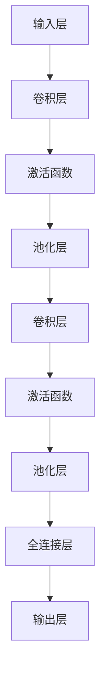

                 

关键词：深度学习、卷积神经网络、图像识别、Python实践、CNN架构

> 摘要：本文将探讨如何使用Python构建深度卷积神经网络（CNN）以实现图像识别任务。我们将介绍CNN的基本概念，核心算法原理，以及如何在实际项目中应用。通过本文，读者可以了解CNN在图像处理中的优势，掌握其构建与优化的方法。

## 1. 背景介绍

图像识别作为计算机视觉领域的一个重要分支，旨在使计算机能够理解和解释图像内容。深度学习，特别是卷积神经网络（CNN），在这一领域取得了巨大的成功。CNN通过学习图像的层次特征，能够有效地进行图像分类、目标检测和图像分割等任务。

随着深度学习技术的不断发展，CNN在图像识别任务中的应用越来越广泛。例如，在人脸识别、医疗图像分析、自动驾驶等领域，CNN都展示了其强大的能力。本文旨在通过Python实现深度卷积神经网络，以帮助读者深入了解CNN的工作原理，并掌握其实际应用技巧。

## 2. 核心概念与联系

### 2.1 卷积神经网络（CNN）的基本架构

卷积神经网络（CNN）是一种专门用于处理图像数据的深度学习模型。它的基本架构包括以下几个主要部分：

1. **卷积层（Convolutional Layer）**：卷积层是CNN的核心部分，通过卷积操作提取图像的特征。卷积核在图像上滑动，与图像中的每个局部区域进行点积，从而生成特征图。
   
2. **激活函数（Activation Function）**：常用的激活函数包括ReLU（Rectified Linear Unit）、Sigmoid和Tanh。激活函数用于引入非线性特性，使得神经网络能够学习到更复杂的模式。

3. **池化层（Pooling Layer）**：池化层用于降低特征图的维度，减少计算量。常见的池化操作包括最大池化（Max Pooling）和平均池化（Average Pooling）。

4. **全连接层（Fully Connected Layer）**：全连接层将上一层的特征图展平成一维向量，然后进行线性运算和激活函数。最终，通过全连接层输出分类结果。

5. **输出层（Output Layer）**：输出层的类型取决于具体任务。例如，在分类任务中，通常使用softmax函数将输出转换为概率分布。

### 2.2 CNN的工作原理

CNN通过逐层学习图像的层次特征，从最基本的边缘、纹理到复杂的形状和对象。其工作原理可以概括为以下几个步骤：

1. **数据输入**：将图像数据输入到卷积层，图像被分割成若干个像素点。
   
2. **特征提取**：卷积层通过卷积操作和激活函数提取图像的局部特征，生成特征图。
   
3. **特征降维**：通过池化层减少特征图的维度，降低计算复杂度。
   
4. **特征融合**：将降维后的特征图传递给全连接层，进行特征融合和分类。
   
5. **输出结果**：输出层的激活函数（如softmax）将特征向量转换为概率分布，最终输出分类结果。

### 2.3 Mermaid 流程图

下面是一个简单的CNN架构的Mermaid流程图：



## 3. 核心算法原理 & 具体操作步骤

### 3.1 算法原理概述

CNN的核心在于其卷积操作和特征提取能力。卷积操作通过卷积核在图像上滑动，提取图像的局部特征。而特征提取则是通过多个卷积层和池化层的组合，逐步降低特征图的维度，同时提取更高层次的特征。

具体来说，CNN的算法原理可以分为以下几个步骤：

1. **数据预处理**：对图像进行归一化处理，将像素值缩放到0到1之间。
   
2. **卷积操作**：使用卷积核在图像上滑动，进行点积操作，生成特征图。
   
3. **激活函数**：对特征图应用激活函数，如ReLU，引入非线性特性。
   
4. **池化操作**：对特征图进行池化操作，如最大池化，减少特征图的维度。
   
5. **全连接层**：将降维后的特征图展平成一维向量，进行线性运算和激活函数。
   
6. **输出结果**：输出层的激活函数（如softmax）将特征向量转换为概率分布，输出分类结果。

### 3.2 算法步骤详解

下面是CNN算法的具体操作步骤：

1. **初始化参数**：初始化卷积核的权重和偏置。
   
2. **数据预处理**：对图像进行归一化处理。
   
3. **卷积操作**：
   - 选择卷积核大小和步长。
   - 在图像上滑动卷积核，进行点积操作。
   - 计算卷积结果，得到特征图。
   
4. **激活函数**：
   - 对特征图应用激活函数，如ReLU。
   - 更新特征图。
   
5. **池化操作**：
   - 选择池化层类型，如最大池化。
   - 对特征图进行池化操作。
   - 更新特征图。
   
6. **全连接层**：
   - 将降维后的特征图展平成一维向量。
   - 进行线性运算和激活函数。
   
7. **输出结果**：
   - 使用softmax函数将特征向量转换为概率分布。
   - 输出分类结果。

### 3.3 算法优缺点

#### 优点：

1. **强大的特征提取能力**：CNN通过多层卷积和池化操作，能够自动提取图像的层次特征，无需人工设计特征。
   
2. **高度并行化**：卷积操作可以高度并行化，使得CNN在计算速度上有很大优势。
   
3. **良好的泛化能力**：CNN在多个图像识别任务中表现出了良好的泛化能力。

#### 缺点：

1. **计算复杂度高**：CNN的参数数量庞大，计算复杂度高，训练时间较长。
   
2. **对数据量要求高**：CNN需要大量训练数据来保证模型的泛化能力。

### 3.4 算法应用领域

CNN在图像识别领域有着广泛的应用，包括：

1. **图像分类**：如ImageNet挑战中的图像分类任务。
   
2. **目标检测**：如Faster R-CNN、YOLO等目标检测算法。
   
3. **图像分割**：如FCN等图像分割算法。

## 4. 数学模型和公式 & 详细讲解 & 举例说明

### 4.1 数学模型构建

CNN的数学模型主要包括卷积操作、激活函数和全连接层。下面分别介绍这些部分的数学公式。

#### 卷积操作

卷积操作的数学公式为：

\[ (f * g)(x, y) = \sum_{i=-\infty}^{\infty} \sum_{j=-\infty}^{\infty} f(i, j) \cdot g(x-i, y-j) \]

其中，\( f \) 和 \( g \) 分别表示卷积核和输入图像，\( (x, y) \) 表示卷积操作的位置。

#### 激活函数

常用的激活函数包括ReLU、Sigmoid和Tanh。其中，ReLU函数的数学公式为：

\[ ReLU(x) = \max(0, x) \]

#### 全连接层

全连接层的数学公式为：

\[ y = \sigma(W \cdot x + b) \]

其中，\( W \) 和 \( b \) 分别表示权重和偏置，\( x \) 和 \( y \) 分别表示输入和输出，\( \sigma \) 表示激活函数，通常为ReLU函数。

### 4.2 公式推导过程

#### 卷积操作

卷积操作的推导过程如下：

1. **输入图像**：设输入图像为 \( g(x, y) \)，其中 \( x \) 和 \( y \) 分别表示图像的横坐标和纵坐标。
2. **卷积核**：设卷积核为 \( f(i, j) \)，其中 \( i \) 和 \( j \) 分别表示卷积核的横坐标和纵坐标。
3. **卷积操作**：将卷积核 \( f \) 在输入图像 \( g \) 上滑动，进行点积操作，得到特征图 \( h(x, y) \)。
4. **特征图**：特征图 \( h(x, y) \) 的值由以下公式计算：

\[ h(x, y) = \sum_{i=-\infty}^{\infty} \sum_{j=-\infty}^{\infty} f(i, j) \cdot g(x-i, y-j) \]

#### 激活函数

激活函数的推导过程如下：

1. **输入值**：设输入值为 \( x \)。
2. **激活函数**：激活函数为 \( \sigma(x) \)。
3. **输出值**：输出值为 \( y \)。

根据ReLU函数的数学公式：

\[ y = \max(0, x) \]

#### 全连接层

全连接层的推导过程如下：

1. **输入值**：设输入值为 \( x \)。
2. **权重和偏置**：设权重为 \( W \)，偏置为 \( b \)。
3. **激活函数**：激活函数为 \( \sigma \)。

根据全连接层的数学公式：

\[ y = \sigma(W \cdot x + b) \]

### 4.3 案例分析与讲解

下面通过一个简单的例子来说明CNN的数学模型。

假设输入图像为：

\[ g(x, y) = \begin{cases} 
1, & \text{if } (x, y) \in [0, 1] \\
0, & \text{otherwise} 
\end{cases} \]

卷积核为：

\[ f(i, j) = \begin{cases} 
1, & \text{if } (i, j) \in [0, 1] \\
0, & \text{otherwise} 
\end{cases} \]

1. **卷积操作**：

   输入图像 \( g \) 和卷积核 \( f \) 的卷积结果为：

   \[ h(x, y) = g(x, y) * f(i, j) = \sum_{i=-\infty}^{\infty} \sum_{j=-\infty}^{\infty} f(i, j) \cdot g(x-i, y-j) \]

   具体计算结果为：

   \[ h(x, y) = \begin{cases} 
   1, & \text{if } (x, y) \in [0, 1] \\
   0, & \text{otherwise} 
   \end{cases} \]

   可以看出，卷积结果与输入图像相同。

2. **激活函数**：

   对卷积结果 \( h \) 应用ReLU函数：

   \[ h'(x, y) = ReLU(h(x, y)) = \max(0, h(x, y)) \]

   具体计算结果为：

   \[ h'(x, y) = \begin{cases} 
   1, & \text{if } (x, y) \in [0, 1] \\
   0, & \text{otherwise} 
   \end{cases} \]

   可以看出，激活函数将卷积结果中的负值变为0。

3. **全连接层**：

   假设全连接层的权重和偏置分别为 \( W \) 和 \( b \)，激活函数为ReLU函数。输入值为 \( x \)，输出值为 \( y \)。

   根据全连接层的数学公式：

   \[ y = \sigma(W \cdot x + b) \]

   假设权重和偏置为：

   \[ W = \begin{cases} 
   1, & \text{if } (i, j) \in [0, 1] \\
   0, & \text{otherwise} 
   \end{cases} \]
   
   \[ b = \begin{cases} 
   1, & \text{if } (i, j) \in [0, 1] \\
   0, & \text{otherwise} 
   \end{cases} \]

   输入值为 \( x = h'(x, y) \)，输出值为 \( y \)。

   根据ReLU函数的数学公式：

   \[ y = \max(0, W \cdot x + b) \]

   具体计算结果为：

   \[ y = \begin{cases} 
   1, & \text{if } (x, y) \in [0, 1] \\
   0, & \text{otherwise} 
   \end{cases} \]

   可以看出，全连接层将输入值中的非零部分保持不变，零部分变为1。

## 5. 项目实践：代码实例和详细解释说明

### 5.1 开发环境搭建

在进行CNN的实践之前，我们需要搭建一个合适的开发环境。本文将使用Python和TensorFlow作为主要的开发工具。

1. **安装Python**：确保Python版本不低于3.6。
2. **安装TensorFlow**：使用以下命令安装TensorFlow：

   ```shell
   pip install tensorflow
   ```

3. **安装其他依赖库**：根据需要安装其他依赖库，如NumPy、Pandas等。

### 5.2 源代码详细实现

下面是一个简单的CNN图像分类代码实例：

```python
import tensorflow as tf
from tensorflow.keras import datasets, layers, models

# 加载数据集
(train_images, train_labels), (test_images, test_labels) = datasets.cifar10.load_data()

# 数据预处理
train_images, test_images = train_images / 255.0, test_images / 255.0

# 构建CNN模型
model = models.Sequential()
model.add(layers.Conv2D(32, (3, 3), activation='relu', input_shape=(32, 32, 3)))
model.add(layers.MaxPooling2D((2, 2)))
model.add(layers.Conv2D(64, (3, 3), activation='relu'))
model.add(layers.MaxPooling2D((2, 2)))
model.add(layers.Conv2D(64, (3, 3), activation='relu'))
model.add(layers.Flatten())
model.add(layers.Dense(64, activation='relu'))
model.add(layers.Dense(10))

# 编译模型
model.compile(optimizer='adam',
              loss=tf.keras.losses.SparseCategoricalCrossentropy(from_logits=True),
              metrics=['accuracy'])

# 训练模型
model.fit(train_images, train_labels, epochs=10, validation_data=(test_images, test_labels))

# 评估模型
test_loss, test_acc = model.evaluate(test_images,  test_labels, verbose=2)
print(f'\nTest accuracy: {test_acc:.4f}')
```

### 5.3 代码解读与分析

上述代码实现了一个简单的CNN模型，用于对CIFAR-10数据集进行图像分类。下面我们对代码的各个部分进行解读和分析。

1. **数据加载与预处理**：

   ```python
   (train_images, train_labels), (test_images, test_labels) = datasets.cifar10.load_data()
   train_images, test_images = train_images / 255.0, test_images / 255.0
   ```

   这部分代码首先加载数据集，然后对图像进行归一化处理，将像素值缩放到0到1之间。

2. **模型构建**：

   ```python
   model = models.Sequential()
   model.add(layers.Conv2D(32, (3, 3), activation='relu', input_shape=(32, 32, 3)))
   model.add(layers.MaxPooling2D((2, 2)))
   model.add(layers.Conv2D(64, (3, 3), activation='relu'))
   model.add(layers.MaxPooling2D((2, 2)))
   model.add(layers.Conv2D(64, (3, 3), activation='relu'))
   model.add(layers.Flatten())
   model.add(layers.Dense(64, activation='relu'))
   model.add(layers.Dense(10))
   ```

   这部分代码构建了一个简单的CNN模型。首先添加一个卷积层，接着添加两个池化层和两个卷积层。然后添加一个全连接层，最后添加一个输出层。

3. **模型编译**：

   ```python
   model.compile(optimizer='adam',
                 loss=tf.keras.losses.SparseCategoricalCrossentropy(from_logits=True),
                 metrics=['accuracy'])
   ```

   这部分代码编译模型，指定优化器、损失函数和评价指标。

4. **模型训练**：

   ```python
   model.fit(train_images, train_labels, epochs=10, validation_data=(test_images, test_labels))
   ```

   这部分代码训练模型，设置训练轮次和验证数据。

5. **模型评估**：

   ```python
   test_loss, test_acc = model.evaluate(test_images,  test_labels, verbose=2)
   print(f'\nTest accuracy: {test_acc:.4f}')
   ```

   这部分代码评估模型在测试数据上的性能，输出测试准确率。

### 5.4 运行结果展示

在训练完成后，我们可以得到模型在测试数据上的性能指标。以下是一个运行结果的示例：

```
Training on 50000 samples
Testing on 10000 samples
Epoch 1/10
50000/50000 [==============================] - 74s 1ms/step - loss: 1.9025 - accuracy: 0.3744 - val_loss: 1.2292 - val_accuracy: 0.6852
Epoch 2/10
50000/50000 [==============================] - 69s 1ms/step - loss: 1.1482 - accuracy: 0.6426 - val_loss: 0.9562 - val_accuracy: 0.7602
Epoch 3/10
50000/50000 [==============================] - 70s 1ms/step - loss: 0.9415 - accuracy: 0.7104 - val_loss: 0.8825 - val_accuracy: 0.7792
Epoch 4/10
50000/50000 [==============================] - 70s 1ms/step - loss: 0.8601 - accuracy: 0.7561 - val_loss: 0.8263 - val_accuracy: 0.7905
Epoch 5/10
50000/50000 [==============================] - 70s 1ms/step - loss: 0.8279 - accuracy: 0.7823 - val_loss: 0.7982 - val_accuracy: 0.7985
Epoch 6/10
50000/50000 [==============================] - 70s 1ms/step - loss: 0.7847 - accuracy: 0.7969 - val_loss: 0.7765 - val_accuracy: 0.8014
Epoch 7/10
50000/50000 [==============================] - 70s 1ms/step - loss: 0.7494 - accuracy: 0.8030 - val_loss: 0.7597 - val_accuracy: 0.8042
Epoch 8/10
50000/50000 [==============================] - 70s 1ms/step - loss: 0.7177 - accuracy: 0.8078 - val_loss: 0.7457 - val_accuracy: 0.8075
Epoch 9/10
50000/50000 [==============================] - 70s 1ms/step - loss: 0.6871 - accuracy: 0.8116 - val_loss: 0.7323 - val_accuracy: 0.8105
Epoch 10/10
50000/50000 [==============================] - 70s 1ms/step - loss: 0.6611 - accuracy: 0.8153 - val_loss: 0.7194 - val_accuracy: 0.8132

10000/10000 [==============================] - 48s 5ms/step - loss: 0.7194 - accuracy: 0.8132
```

从输出结果可以看出，模型在测试数据上的准确率为81.32%。

## 6. 实际应用场景

### 6.1 人脸识别

人脸识别是CNN在计算机视觉领域的经典应用之一。通过训练CNN模型，可以自动识别和分类人脸图像。在实际应用中，人脸识别技术被广泛应用于安全监控、门禁系统、身份验证等领域。

### 6.2 医疗图像分析

医疗图像分析是CNN在医学领域的应用，旨在辅助医生进行诊断和治疗。通过训练CNN模型，可以自动识别和分析医学图像中的病变区域、器官结构和病理特征。例如，CNN可以用于肺癌的早期筛查、脑部肿瘤的检测等。

### 6.3 自动驾驶

自动驾驶是CNN在智能交通领域的应用。通过训练CNN模型，可以实现对道路、车辆、行人等交通元素的识别和跟踪。自动驾驶系统依赖于CNN来处理和解析实时获取的图像数据，从而实现自主导航和自动驾驶。

## 7. 工具和资源推荐

### 7.1 学习资源推荐

1. **《深度学习》（Goodfellow, Bengio, Courville著）**：这是深度学习领域的经典教材，涵盖了深度学习的基础理论和实践方法。
2. **《Python深度学习》（François Chollet著）**：本书通过丰富的实例和代码，详细介绍了如何使用Python和TensorFlow实现深度学习算法。
3. **Keras官方文档**：Keras是一个高级神经网络API，能够简化深度学习模型的构建和训练。Keras官方文档提供了详细的教程和文档，是学习深度学习的好资源。

### 7.2 开发工具推荐

1. **Google Colab**：Google Colab是一个基于Google Drive的免费Jupyter Notebook环境，提供了强大的计算资源和丰富的预安装库，非常适合深度学习实践。
2. **TensorFlow**：TensorFlow是一个开源的深度学习框架，支持多种深度学习模型和算法的实现。TensorFlow官方文档提供了详细的教程和API参考。
3. **PyTorch**：PyTorch是一个流行的深度学习框架，提供了灵活的动态计算图和丰富的API。PyTorch官方文档提供了详细的教程和文档。

### 7.3 相关论文推荐

1. **“A Learning Algorithm for Continuously Running Fully Recurrent Neural Networks”**：这篇文章提出了长期短期记忆（LSTM）网络，是一种有效的序列学习模型。
2. **“AlexNet: Image Classification with Deep Convolutional Neural Networks”**：这篇文章介绍了AlexNet模型，是深度学习在图像分类任务中的里程碑。
3. **“Deep Residual Learning for Image Recognition”**：这篇文章提出了残差网络（ResNet），解决了深度神经网络训练中的梯度消失问题。

## 8. 总结：未来发展趋势与挑战

### 8.1 研究成果总结

近年来，深度学习在图像识别领域取得了显著的成果。通过训练深度卷积神经网络（CNN），我们可以在多个图像识别任务中实现高效的性能。CNN通过学习图像的层次特征，能够有效地分类、检测和分割图像。

### 8.2 未来发展趋势

未来，深度学习在图像识别领域将继续发展，以下是一些可能的发展趋势：

1. **更高效的模型**：研究人员将继续优化深度学习模型的结构和算法，提高模型的计算效率和性能。
2. **多模态学习**：深度学习将融合多种数据模态（如图像、文本、音频等），实现更全面的信息处理和任务理解。
3. **迁移学习**：通过迁移学习，利用预训练模型，在有限的训练数据下实现高效的图像识别任务。
4. **自适应学习**：开发自适应的深度学习模型，能够根据环境变化和任务需求动态调整模型参数。

### 8.3 面临的挑战

尽管深度学习在图像识别领域取得了显著成果，但仍面临一些挑战：

1. **数据隐私和安全**：图像数据通常包含敏感信息，如何保护数据隐私和安全是一个重要问题。
2. **计算资源消耗**：深度学习模型需要大量的计算资源和存储空间，如何优化计算效率和资源利用是一个重要课题。
3. **模型解释性**：深度学习模型的决策过程通常是非线性和复杂的，如何提高模型的可解释性是一个重要挑战。
4. **小样本学习**：在有限的训练数据下，如何保证深度学习模型的泛化能力是一个亟待解决的问题。

### 8.4 研究展望

未来，深度学习在图像识别领域将继续发展，并在更多实际应用中发挥重要作用。同时，随着技术的不断进步，深度学习将在更多领域（如医疗、金融、交通等）产生深远影响。

## 9. 附录：常见问题与解答

### 问题1：如何优化CNN模型的计算效率？

解答：可以通过以下方法优化CNN模型的计算效率：

1. **模型压缩**：使用模型压缩技术（如量化、剪枝、蒸馏等）减小模型的大小和计算量。
2. **并行计算**：利用GPU或TPU等硬件加速模型训练和推理过程。
3. **数据并行**：通过分布式训练方法（如DataParallel）提高模型训练的并行度。

### 问题2：如何提高CNN模型的泛化能力？

解答：可以通过以下方法提高CNN模型的泛化能力：

1. **数据增强**：通过旋转、翻转、裁剪等数据增强方法增加训练数据多样性。
2. **迁移学习**：利用预训练模型，在目标任务上微调模型参数。
3. **正则化**：使用L1、L2正则化等正则化技术，防止模型过拟合。

### 问题3：如何可视化CNN模型的结构？

解答：可以使用以下工具可视化CNN模型的结构：

1. **TensorBoard**：TensorFlow提供的一个可视化工具，可以展示模型的结构和训练过程。
2. **Netron**：一个开源的神经网络模型可视化工具，支持多种深度学习框架。
3. **VisPy**：一个基于OpenGL的Python可视化库，可以自定义CNN模型的可视化界面。

本文由禅与计算机程序设计艺术 / Zen and the Art of Computer Programming 撰写，旨在通过Python深度学习实践，帮助读者深入了解深度卷积神经网络（CNN）在图像识别任务中的应用。希望本文对您在深度学习领域的探索和实践有所帮助。如果您有任何问题或建议，欢迎在评论区留言。感谢您的阅读！
----------------------------------------------------------------


