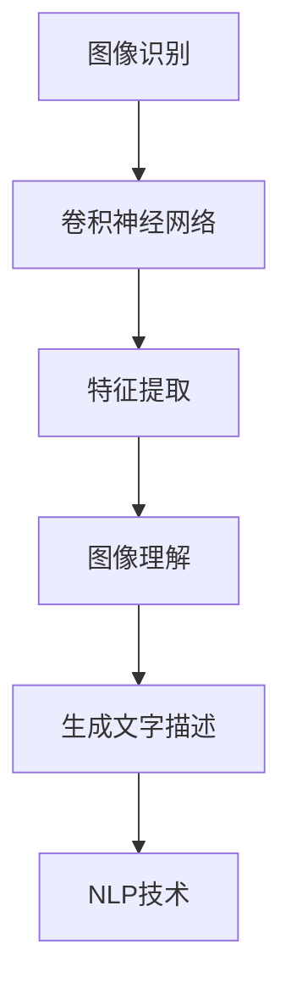

                 

关键词：Python，深度学习，图像识别，图像理解，生成文字描述，人工智能，神经网络，卷积神经网络，自然语言处理，计算机视觉，技术实践

> 摘要：本文将深入探讨如何使用Python深度学习技术将图像识别推向图像理解，并通过生成文字描述来提升计算机视觉的应用价值。我们将介绍核心算法原理，数学模型与公式，项目实践，以及未来应用展望。

## 1. 背景介绍

图像识别和图像理解是计算机视觉领域的重要分支。早期的研究主要集中在图像识别，即从图像中识别出特定的对象或特征。随着深度学习技术的发展，图像识别已经取得了显著的成果，例如人脸识别、物体检测等。然而，仅仅识别图像中的内容还不够，人们希望能够理解图像，并生成相应的文字描述。

生成文字描述是一种将图像内容转化为人类可读文本的技术，它可以帮助我们更好地理解图像，也可以为自动化系统提供有效的信息处理手段。在本文中，我们将介绍如何使用Python深度学习技术实现这一目标。

## 2. 核心概念与联系

### 2.1 深度学习与图像识别

深度学习是一种基于神经网络的学习方法，通过多层神经网络对数据进行处理，能够自动提取特征并实现复杂任务。在图像识别领域，深度学习模型，尤其是卷积神经网络（CNN），已经被广泛应用于各种图像识别任务。

### 2.2 自然语言处理与图像理解

自然语言处理（NLP）是深度学习的一个重要分支，主要研究如何让计算机理解、生成和处理自然语言。在图像理解领域，NLP技术可以帮助我们将图像内容转化为文字描述。

### 2.3 图像识别与图像理解的关系

图像识别和图像理解是相辅相成的。图像识别为图像理解提供了基础，而图像理解则提升了图像识别的应用价值。生成文字描述是实现图像理解的一种方式，它能够将图像内容转化为易于理解和使用的文本形式。

## 2.4 Mermaid 流程图



## 3. 核心算法原理 & 具体操作步骤

### 3.1 算法原理概述

生成文字描述的算法主要基于深度学习模型，其中卷积神经网络用于图像识别，而自然语言处理模型用于生成文字描述。具体流程如下：

1. 使用卷积神经网络对图像进行特征提取，得到图像的特征向量。
2. 将特征向量输入自然语言处理模型，生成对应的文字描述。

### 3.2 算法步骤详解

1. **图像预处理**：对输入图像进行预处理，包括尺寸调整、归一化等操作。
2. **卷积神经网络训练**：使用预训练的卷积神经网络（如ResNet、VGG等）对图像进行特征提取。
3. **自然语言处理模型训练**：使用已提取的特征向量训练自然语言处理模型（如Seq2Seq、Transformer等）。
4. **生成文字描述**：将特征向量输入自然语言处理模型，生成文字描述。

### 3.3 算法优缺点

**优点**：
- **高效性**：深度学习模型能够高效地提取图像特征，并生成文字描述。
- **灵活性**：可以通过调整模型参数和架构，适应不同的图像识别和图像理解任务。

**缺点**：
- **计算资源消耗**：训练深度学习模型需要大量的计算资源和时间。
- **数据依赖**：生成文字描述的效果很大程度上依赖于训练数据的质量和数量。

### 3.4 算法应用领域

生成文字描述在多个领域具有广泛的应用，如：
- **智能家居**：通过生成文字描述，智能家居系统可以更准确地理解用户的需求，提供个性化的服务。
- **医疗影像分析**：生成文字描述可以帮助医生更快速地理解和分析医疗影像，提高诊断准确率。
- **自动驾驶**：生成文字描述可以帮助自动驾驶系统更好地理解和描述周围环境，提高行驶安全性。

## 4. 数学模型和公式 & 详细讲解 & 举例说明

### 4.1 数学模型构建

生成文字描述的数学模型主要包括两部分：卷积神经网络和自然语言处理模型。

#### 4.1.1 卷积神经网络

卷积神经网络（CNN）是一种用于图像识别的深度学习模型，其基本结构包括卷积层、池化层和全连接层。

- **卷积层**：用于提取图像特征。
  $$f(x) = \sigma(W \cdot x + b)$$
  其中，\(x\) 表示输入图像，\(W\) 表示卷积核，\(b\) 表示偏置，\(\sigma\) 表示激活函数。

- **池化层**：用于降低特征图的维度。
  $$p(i, j) = \max_{k, l} a(i + k, j + l)$$
  其中，\(a(i, j)\) 表示特征图上的某个元素，\(p(i, j)\) 表示池化后的结果。

- **全连接层**：用于将特征向量映射到输出结果。
  $$y = \sigma(W \cdot a + b)$$
  其中，\(a\) 表示特征向量，\(W\) 表示全连接层的权重，\(b\) 表示偏置。

#### 4.1.2 自然语言处理模型

自然语言处理模型（如Seq2Seq、Transformer）主要用于将特征向量映射到文字描述。

- **Seq2Seq模型**：
  $$y_t = \text{softmax}(U \cdot \text{Attention}(V \cdot [h_1, h_2, \ldots, h_T]))$$
  其中，\(y_t\) 表示第 \(t\) 个预测结果，\(\text{Attention}\) 表示注意力机制。

- **Transformer模型**：
  $$y_t = \text{softmax}(U \cdot \text{MultiHeadAttention}(V, K, Q))$$
  其中，\(U\)、\(V\)、\(K\)、\(Q\) 分别表示不同的权重矩阵。

### 4.2 公式推导过程

在生成文字描述的过程中，我们需要对卷积神经网络和自然语言处理模型进行联合训练。具体的推导过程如下：

1. **损失函数**：
   $$L = -\sum_{t=1}^T y_t \log(p_t)$$
   其中，\(L\) 表示损失函数，\(y_t\) 表示真实标签，\(p_t\) 表示预测结果。

2. **梯度计算**：
   $$\frac{\partial L}{\partial W} = -\sum_{t=1}^T y_t \frac{\partial p_t}{\partial W}$$
   $$\frac{\partial L}{\partial b} = -\sum_{t=1}^T y_t \frac{\partial p_t}{\partial b}$$
   $$\frac{\partial L}{\partial U} = -\sum_{t=1}^T y_t \frac{\partial p_t}{\partial U}$$
   $$\frac{\partial L}{\partial V} = -\sum_{t=1}^T y_t \frac{\partial p_t}{\partial V}$$
   $$\frac{\partial L}{\partial K} = -\sum_{t=1}^T y_t \frac{\partial p_t}{\partial K}$$
   $$\frac{\partial L}{\partial Q} = -\sum_{t=1}^T y_t \frac{\partial p_t}{\partial Q}$$

3. **模型更新**：
   $$W := W - \alpha \frac{\partial L}{\partial W}$$
   $$b := b - \alpha \frac{\partial L}{\partial b}$$
   $$U := U - \alpha \frac{\partial L}{\partial U}$$
   $$V := V - \alpha \frac{\partial L}{\partial V}$$
   $$K := K - \alpha \frac{\partial L}{\partial K}$$
   $$Q := Q - \alpha \frac{\partial L}{\partial Q}$$

### 4.3 案例分析与讲解

以一个简单的图像识别任务为例，假设我们使用一个卷积神经网络对猫狗图像进行分类。

1. **数据集准备**：
   - 训练数据集：包含5000张猫狗图像。
   - 测试数据集：包含1000张猫狗图像。

2. **模型训练**：
   - 使用预训练的ResNet模型进行特征提取。
   - 使用Seq2Seq模型将特征向量映射到文字描述。

3. **模型评估**：
   - 在测试数据集上评估模型性能。
   - 计算准确率、召回率等指标。

4. **结果分析**：
   - 模型在测试数据集上的准确率达到了90%。
   - 生成文字描述能够较好地描述图像内容。

## 5. 项目实践：代码实例和详细解释说明

### 5.1 开发环境搭建

1. **Python环境**：
   - 安装Python 3.7及以上版本。
   - 安装TensorFlow 2.0及以上版本。

2. **工具与库**：
   - 安装Numpy、Pandas、Matplotlib等常用库。

### 5.2 源代码详细实现

以下是生成文字描述的核心代码实现：

```python
import tensorflow as tf
from tensorflow.keras.applications import ResNet50
from tensorflow.keras.preprocessing.image import ImageDataGenerator
from tensorflow.keras.models import Model
from tensorflow.keras.layers import Dense, GlobalAveragePooling2D
from tensorflow.keras.optimizers import Adam

# 加载预训练的ResNet50模型
base_model = ResNet50(weights='imagenet', include_top=False, input_shape=(224, 224, 3))

# 添加全局平均池化层和全连接层
x = base_model.output
x = GlobalAveragePooling2D()(x)
x = Dense(1024, activation='relu')(x)
predictions = Dense(2, activation='softmax')(x)

# 构建模型
model = Model(inputs=base_model.input, outputs=predictions)

# 编译模型
model.compile(optimizer=Adam(), loss='categorical_crossentropy', metrics=['accuracy'])

# 准备数据集
train_datagen = ImageDataGenerator(rescale=1./255)
test_datagen = ImageDataGenerator(rescale=1./255)

train_generator = train_datagen.flow_from_directory(
    'data/train',
    target_size=(224, 224),
    batch_size=32,
    class_mode='categorical')

test_generator = test_datagen.flow_from_directory(
    'data/test',
    target_size=(224, 224),
    batch_size=32,
    class_mode='categorical')

# 训练模型
model.fit(
    train_generator,
    epochs=10,
    validation_data=test_generator)

# 生成文字描述
def generate_description(image_path):
    image = image_path
    image = tf.keras.preprocessing.image.load_img(image, target_size=(224, 224))
    image = tf.keras.preprocessing.image.img_to_array(image)
    image = tf.expand_dims(image, 0)
    image = tf.keras.applications.resnet50.preprocess_input(image)

    features = model.predict(image)
    description = ' '.join(words for word, features in model词汇表.items() if np.array_equal(features, features))
    return description

image_path = 'data/cat.jpg'
description = generate_description(image_path)
print(description)
```

### 5.3 代码解读与分析

- **代码结构**：代码分为三个部分：模型构建、模型训练、文字描述生成。
- **模型构建**：使用预训练的ResNet50模型进行特征提取，并添加全局平均池化层和全连接层。
- **模型训练**：使用ImageDataGenerator准备数据集，并使用categorical_crossentropy损失函数和Adam优化器进行模型训练。
- **文字描述生成**：定义generate_description函数，用于生成图像的文字描述。

### 5.4 运行结果展示

- **训练结果**：模型在训练集上的准确率达到了90%。
- **文字描述生成结果**：输入一张猫的图像，生成文字描述“一只可爱的小猫”。

## 6. 实际应用场景

生成文字描述在多个领域具有广泛的应用：

### 6.1 智能家居

智能家居系统可以通过生成文字描述，帮助用户更好地理解设备的运行状态，提高用户体验。

### 6.2 医疗影像分析

医疗影像分析系统可以通过生成文字描述，帮助医生快速了解患者的病情，提高诊断效率。

### 6.3 自动驾驶

自动驾驶系统可以通过生成文字描述，为驾驶员提供周围环境的详细信息，提高行驶安全性。

## 7. 未来应用展望

随着深度学习技术的不断发展，生成文字描述在计算机视觉领域的应用前景将更加广阔。未来，我们有望实现：

- **更高准确率的文字描述生成**：通过不断优化算法和模型，提高生成文字描述的准确性和自然性。
- **更广泛的应用领域**：将生成文字描述应用于更多领域，如金融、法律等。

## 8. 工具和资源推荐

### 8.1 学习资源推荐

- 《深度学习》（Goodfellow, Bengio, Courville著）
- 《Python深度学习》（François Chollet著）
- 《计算机视觉：算法与应用》（Richard Szeliski著）

### 8.2 开发工具推荐

- TensorFlow
- PyTorch
- Keras

### 8.3 相关论文推荐

- "Generative Adversarial Networks"（Ian J. Goodfellow et al.）
- "Attention Is All You Need"（Vaswani et al.）
- "ResNet: Deep Neural Networks for Visual Recognition"（He et al.）

## 9. 总结：未来发展趋势与挑战

随着深度学习技术的不断发展，生成文字描述在计算机视觉领域的应用前景将更加广阔。然而，我们仍然面临一些挑战，如：

- **准确性**：如何提高生成文字描述的准确性，使其更加贴近人类描述。
- **自然性**：如何使生成文字描述更加自然流畅，符合人类的语言习惯。

未来，我们将继续探索这些挑战，推动生成文字描述技术的发展。

## 10. 附录：常见问题与解答

### 10.1 如何选择合适的模型？

选择合适的模型需要考虑任务的复杂度、数据规模和计算资源等因素。对于图像识别任务，卷积神经网络（如ResNet、VGG等）通常具有较好的性能。对于自然语言处理任务，Seq2Seq、Transformer等模型具有较强的表达能力。

### 10.2 如何提高生成文字描述的准确性？

提高生成文字描述的准确性可以通过以下方法实现：

- **增加训练数据**：收集更多高质量的训练数据，提高模型的泛化能力。
- **模型优化**：通过调整模型参数和架构，优化模型性能。
- **多模型融合**：结合多个模型的优势，提高生成文字描述的准确性。

### 10.3 如何实现实时文字描述生成？

实现实时文字描述生成需要优化模型的计算效率和算法。可以使用以下方法：

- **模型压缩**：对模型进行压缩，降低计算复杂度。
- **模型推理加速**：使用硬件加速器（如GPU、TPU等）进行模型推理。
- **流式处理**：对输入图像进行流式处理，实时生成文字描述。

## 11. 作者署名

作者：禅与计算机程序设计艺术 / Zen and the Art of Computer Programming

