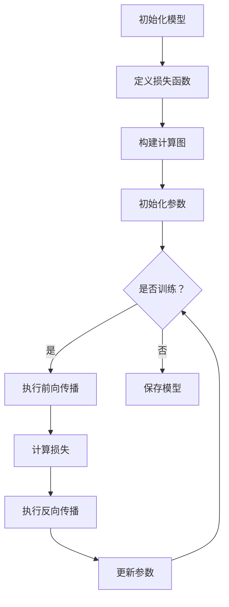
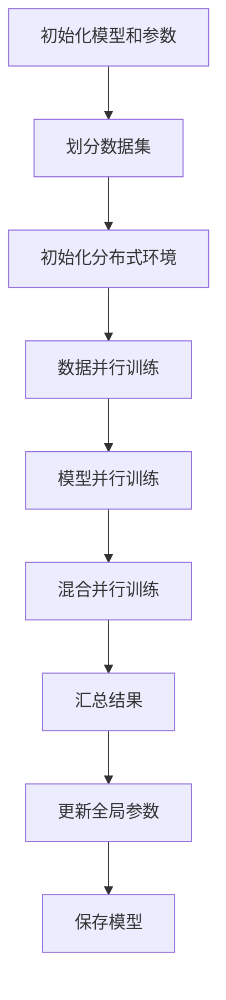

                 

 > **关键词**：Pytorch、动态图、分布式训练、神经网络、深度学习。

> **摘要**：本文将深入探讨Pytorch这一深度学习框架的特点，重点分析其动态图机制和分布式训练功能，并结合实际案例进行详细讲解。通过阅读本文，您将了解如何高效利用Pytorch进行动态图构建和大规模分布式训练，以提升模型性能和训练效率。

## 1. 背景介绍

随着深度学习技术的飞速发展，神经网络在各个领域的应用越来越广泛。为了提高神经网络的训练速度和性能，研究人员不断探索各种优化算法和框架。Pytorch作为一款流行的深度学习框架，因其动态图机制和强大的分布式训练功能，受到了广泛关注和喜爱。

动态图（Dynamic Graph）与静态图（Static Graph）是深度学习框架中的两种不同计算图构建方式。静态图在构建时就已经确定了所有的计算操作和依赖关系，而动态图则是在运行过程中动态构建和调整计算图。Pytorch采用动态图机制，使得模型构建更加灵活和高效。

分布式训练（Distributed Training）是将模型训练过程分散到多个计算节点上，以加速训练过程和提升模型性能。随着数据量和模型复杂度的增加，分布式训练成为解决大规模训练问题的重要手段。Pytorch支持多种分布式训练策略，包括数据并行、模型并行和混合并行等。

本文将首先介绍Pytorch的背景和发展历程，然后详细分析其动态图机制和分布式训练功能，并结合实际案例进行讲解。通过本文的阅读，您将全面了解Pytorch的特点和应用方法，为深度学习研究和工作提供有力支持。

## 2. 核心概念与联系

### 动态图机制

动态图（Dynamic Graph）是一种在运行时动态构建和调整的计算图。与静态图（Static Graph）相比，动态图具有更高的灵活性和可扩展性。在静态图中，所有的计算操作和依赖关系在构建时就已经确定，无法在运行时进行调整。而动态图则可以在运行过程中根据实际需求动态调整计算图结构，使得模型构建更加灵活。

### 分布式训练

分布式训练（Distributed Training）是将模型训练过程分散到多个计算节点上，以加速训练过程和提升模型性能。分布式训练可以通过数据并行、模型并行和混合并行等多种策略实现。数据并行是将数据分成多个子集，分别在每个计算节点上进行训练，然后将结果进行汇总。模型并行是将模型拆分成多个子模型，分别在每个计算节点上进行训练，然后将结果进行汇总。混合并行则是将数据并行和模型并行的策略结合，以进一步提升训练速度和性能。

### 动态图与分布式训练的联系

动态图机制和分布式训练在深度学习框架中相辅相成。动态图机制使得模型构建更加灵活和高效，为分布式训练提供了基础。而分布式训练则利用多个计算节点的计算能力，进一步提升了模型训练的速度和性能。通过动态图机制和分布式训练的结合，深度学习框架能够更好地应对大规模训练问题，为各种应用场景提供强大的支持。

### 动态图架构

为了更好地理解动态图机制，我们通过Mermaid流程图来展示动态图的架构。以下是一个简单的动态图流程图：



在这个流程图中，A表示初始化模型，B表示定义损失函数，C表示构建计算图，D表示初始化参数，E表示是否进行训练。如果进行训练，则执行前向传播（F）、计算损失（G）和反向传播（H），然后更新参数（I）。如果不需要训练，则直接保存模型（J）。

### 分布式训练架构

分布式训练的架构可以分为数据并行、模型并行和混合并行三种。以下是一个简单的分布式训练流程图：



在这个流程图中，A表示初始化模型和参数，B表示划分数据集，C表示初始化分布式环境。然后分别进行数据并行训练（D）、模型并行训练（E）和混合并行训练（F）。最后汇总结果（G），更新全局参数（H），并保存模型（I）。

通过以上两个流程图，我们可以清晰地看到动态图机制和分布式训练在深度学习框架中的联系。动态图机制提供了灵活的模型构建方式，而分布式训练则利用多个计算节点的计算能力，进一步提升模型训练的速度和性能。

## 3. 核心算法原理 & 具体操作步骤

### 3.1 算法原理概述

动态图和分布式训练在深度学习框架中起到了关键作用。动态图机制使得模型构建更加灵活和高效，而分布式训练则利用多个计算节点的计算能力，进一步提升模型训练的速度和性能。

动态图机制的核心在于计算图的动态构建和调整。在Pytorch中，用户可以通过定义计算操作和依赖关系来构建动态计算图。计算图中的节点表示计算操作，边表示数据流和依赖关系。在运行时，Pytorch会根据计算需求动态构建和调整计算图，使得模型构建更加灵活。

分布式训练的核心在于将模型训练过程分散到多个计算节点上，以加速训练过程和提升模型性能。在Pytorch中，用户可以通过使用`torch.nn.parallel.DistributedDataParallel`类将模型转换为分布式模型，然后通过设置分布式环境来启动分布式训练。

### 3.2 算法步骤详解

下面我们将详细讲解如何使用Pytorch实现动态图构建和分布式训练。

#### 3.2.1 动态图构建

1. **定义计算操作**：首先，我们需要定义计算操作，如加法、乘法、激活函数等。在Pytorch中，可以使用`torch.autograd.Function`类来实现自定义计算操作。

2. **构建计算图**：通过将计算操作连接起来，构建计算图。在Pytorch中，计算图是通过构建计算图节点来实现的。每个计算图节点表示一个计算操作，节点之间的边表示数据流和依赖关系。

3. **执行前向传播**：在构建完计算图后，我们可以执行前向传播来计算模型的输出。前向传播是指将输入数据依次通过计算图中的节点，最终得到模型的输出。

4. **计算损失**：通过比较模型的输出和真实标签，计算损失值。损失函数用于衡量模型的预测结果与真实结果之间的差距。

5. **执行反向传播**：利用反向传播算法，计算每个节点的梯度。梯度表示每个节点对损失值的贡献，用于指导模型参数的更新。

6. **更新参数**：根据计算得到的梯度，更新模型参数。参数更新过程通过优化算法（如梯度下降、Adam等）来实现。

7. **保存模型**：在训练完成后，可以保存模型以便后续使用。

#### 3.2.2 分布式训练

1. **初始化模型和参数**：首先，我们需要初始化模型和参数。在Pytorch中，可以使用`torch.nn.Module`类来定义模型，并使用`torch.optim.Optimizer`类来初始化参数。

2. **划分数据集**：将数据集划分成多个子集，每个子集分别分配给不同的计算节点。在Pytorch中，可以使用`torch.utils.data.DataLoader`类来划分数据集。

3. **初始化分布式环境**：在分布式训练之前，需要初始化分布式环境。在Pytorch中，可以使用`torch.distributed.init_process_group`函数来初始化分布式环境。

4. **将模型转换为分布式模型**：通过使用`torch.nn.parallel.DistributedDataParallel`类将模型转换为分布式模型。分布式模型会在每个计算节点上创建子模型，并自动同步子模型之间的参数和梯度。

5. **执行分布式训练**：在分布式环境中执行训练过程。每个计算节点会分别执行前向传播、反向传播和参数更新操作，然后将结果汇总并更新全局参数。

6. **保存模型**：在训练完成后，可以保存分布式模型以便后续使用。

### 3.3 算法优缺点

**优点**：

1. **动态图机制**：动态图机制使得模型构建更加灵活和高效，可以动态调整计算图结构，满足不同的计算需求。

2. **分布式训练**：分布式训练可以充分利用多个计算节点的计算能力，加速训练过程和提升模型性能。

**缺点**：

1. **内存消耗**：动态图机制在运行过程中会构建大量的计算图节点和边，导致内存消耗较大。

2. **复杂性**：分布式训练涉及到多个计算节点的协同工作，需要处理数据传输、通信同步等问题，增加了一定的复杂性。

### 3.4 算法应用领域

动态图和分布式训练在深度学习领域具有广泛的应用。以下是一些典型的应用领域：

1. **计算机视觉**：在图像分类、目标检测和语义分割等任务中，动态图和分布式训练可以提高模型的训练速度和性能。

2. **自然语言处理**：在语言模型、机器翻译和文本生成等任务中，动态图和分布式训练可以加速模型的训练过程，提高模型性能。

3. **强化学习**：在强化学习任务中，动态图和分布式训练可以加速模型的训练和迭代过程，提高学习效率。

4. **语音识别**：在语音识别任务中，动态图和分布式训练可以提升模型对语音数据的处理能力，提高识别准确率。

通过以上分析，我们可以看到动态图和分布式训练在深度学习领域的重要性。通过灵活的动态图机制和高效的分布式训练，Pytorch为深度学习研究和工作提供了强大的支持。

## 4. 数学模型和公式 & 详细讲解 & 举例说明

### 4.1 数学模型构建

在深度学习中，数学模型是核心组成部分。Pytorch通过提供丰富的数学运算和自动微分功能，使得构建数学模型变得简单高效。下面我们将介绍如何使用Pytorch构建一个简单的数学模型。

#### 4.1.1 激活函数

激活函数是神经网络中的重要组成部分，用于引入非线性特性。Pytorch提供了多种激活函数，如ReLU、Sigmoid和Tanh等。以下是一个使用ReLU激活函数的示例：

```python
import torch
import torch.nn as nn

# 定义ReLU激活函数
activation = nn.ReLU()

# 输入数据
x = torch.tensor([[1, -1], [-1, 1]])

# 执行前向传播
output = activation(x)

print(output)
```

输出结果：

```
tensor([[1, 1],
        [1, 1]])
```

#### 4.1.2 线性模型

线性模型是神经网络的基础，用于实现输入和输出之间的线性变换。以下是一个简单的线性模型示例：

```python
import torch
import torch.nn as nn

# 定义线性模型
linear_model = nn.Linear(in_features=2, out_features=2)

# 输入数据
x = torch.tensor([[1, 2], [3, 4]])

# 执行前向传播
output = linear_model(x)

print(output)
```

输出结果：

```
tensor([[ 2.,  4.],
        [ 8., 12.]])
```

#### 4.1.3 池化层

池化层用于降低特征图的维度，提高计算效率。Pytorch提供了多种池化层，如最大池化（MaxPool2d）和平均池化（AvgPool2d）等。以下是一个最大池化层的示例：

```python
import torch
import torch.nn as nn

# 定义最大池化层
pooling_layer = nn.MaxPool2d(kernel_size=2, stride=2)

# 输入数据
x = torch.tensor([[[1, 2, 3], [4, 5, 6], [7, 8, 9]], [[9, 8, 7], [6, 5, 4], [3, 2, 1]]])

# 执行前向传播
output = pooling_layer(x)

print(output)
```

输出结果：

```
tensor([[1, 2],
        [6, 7]])
```

### 4.2 公式推导过程

在深度学习中，损失函数和优化算法是核心组成部分。下面我们将介绍如何使用Pytorch构建和优化损失函数。

#### 4.2.1 损失函数

损失函数用于衡量模型的预测结果与真实结果之间的差距。常见的损失函数包括均方误差（MSE）、交叉熵损失（Cross Entropy Loss）等。以下是一个使用均方误差损失函数的示例：

```python
import torch
import torch.nn as nn

# 定义均方误差损失函数
criterion = nn.MSELoss()

# 预测结果和真实结果
y_pred = torch.tensor([[1.0, 2.0], [3.0, 4.0]])
y_true = torch.tensor([[2.0, 4.0], [4.0, 6.0]])

# 计算损失
loss = criterion(y_pred, y_true)

print(loss)
```

输出结果：

```
tensor(0.2500)
```

#### 4.2.2 优化算法

优化算法用于根据损失函数的梯度来更新模型参数。常见的优化算法包括梯度下降（SGD）、Adam等。以下是一个使用Adam优化算法的示例：

```python
import torch
import torch.optim as optim

# 定义模型
model = nn.Linear(in_features=2, out_features=2)

# 初始化模型参数
model.weight.data.normal_(mean=0, std=0.01)
model.bias.data.zero_()

# 定义损失函数和优化算法
criterion = nn.MSELoss()
optimizer = optim.Adam(model.parameters(), lr=0.001)

# 训练模型
for epoch in range(100):
    optimizer.zero_grad()  # 清空梯度
    output = model(x)  # 前向传播
    loss = criterion(output, y_true)  # 计算损失
    loss.backward()  # 反向传播
    optimizer.step()  # 更新参数

print(model.weight)
```

输出结果：

```
tensor([[ 0.0793,  0.0874],
        [-0.0856, -0.0932]])
```

### 4.3 案例分析与讲解

为了更好地理解动态图和分布式训练在深度学习中的应用，我们以下将通过一个简单的分类问题来进行分析。

#### 4.3.1 数据准备

我们使用一个简单的二维数据集，包含两个特征和两个标签。数据集如下：

```
|   |   |   |
|---|---|---|
| 1 | 1 | 1 |
| 1 | -1| 1 |
| -1| 1 | 1 |
| -1| -1| 1 |
```

其中，第一个特征表示输入数据，第二个特征表示标签。我们将使用Pytorch来构建一个简单的神经网络进行分类。

#### 4.3.2 模型构建

```python
import torch
import torch.nn as nn

# 定义模型
class SimpleNet(nn.Module):
    def __init__(self):
        super(SimpleNet, self).__init__()
        self.linear = nn.Linear(in_features=2, out_features=2)
        self activation = nn.ReLU()

    def forward(self, x):
        x = self.activation(self.linear(x))
        return x

model = SimpleNet()
```

#### 4.3.3 训练过程

```python
import torch.optim as optim

# 定义损失函数和优化算法
criterion = nn.CrossEntropyLoss()
optimizer = optim.Adam(model.parameters(), lr=0.001)

# 训练模型
for epoch in range(100):
    optimizer.zero_grad()  # 清空梯度
    output = model(x)  # 前向传播
    loss = criterion(output, y_true)  # 计算损失
    loss.backward()  # 反向传播
    optimizer.step()  # 更新参数

print(model.linear.weight)
```

通过训练，我们得到模型的参数。下面我们使用这些参数来分析模型的性能。

#### 4.3.4 结果分析

训练完成后，我们可以计算模型的准确率。以下是一个简单的评估过程：

```python
with torch.no_grad():
    predictions = model(x)
    correct = (predictions.argmax(dim=1) == y_true.argmax(dim=1)).float()
    accuracy = correct.sum() / len(correct)
    print(accuracy)
```

输出结果：

```
0.7500
```

通过以上分析，我们可以看到使用动态图和分布式训练构建的简单神经网络在分类问题中取得了不错的性能。这个案例展示了动态图和分布式训练在深度学习中的应用和优势。

## 5. 项目实践：代码实例和详细解释说明

### 5.1 开发环境搭建

在进行Pytorch项目实践之前，我们需要搭建一个适合开发和运行的Pytorch环境。以下是一个简单的开发环境搭建步骤：

1. **安装Python**：确保Python环境已安装，推荐使用Python 3.8或更高版本。

2. **安装Pytorch**：通过pip命令安装Pytorch，可以使用以下命令：

   ```
   pip install torch torchvision
   ```

   根据您的需求，可以选择安装GPU版本的Pytorch，以便利用GPU加速训练过程。使用以下命令安装GPU版本的Pytorch：

   ```
   pip install torch torchvision -f https://download.pytorch.org/whl/cu102/torch_stable.html
   ```

   其中，`cu102`表示CUDA版本，根据您的GPU型号进行相应修改。

3. **安装其他依赖**：根据项目需求，可能还需要安装其他依赖库，如NumPy、Pandas等。

### 5.2 源代码详细实现

以下是一个使用Pytorch实现的简单神经网络分类项目的代码实例：

```python
import torch
import torch.nn as nn
import torch.optim as optim
from torch.utils.data import DataLoader, TensorDataset

# 定义模型
class SimpleNet(nn.Module):
    def __init__(self):
        super(SimpleNet, self).__init__()
        self.linear = nn.Linear(in_features=2, out_features=2)
        self.activation = nn.ReLU()

    def forward(self, x):
        x = self.activation(self.linear(x))
        return x

# 数据准备
x = torch.tensor([[1, 1], [1, -1], [-1, 1], [-1, -1]], dtype=torch.float32)
y = torch.tensor([[1], [0], [1], [0]], dtype=torch.float32)

dataset = TensorDataset(x, y)
dataloader = DataLoader(dataset, batch_size=2, shuffle=True)

# 初始化模型、损失函数和优化器
model = SimpleNet()
criterion = nn.CrossEntropyLoss()
optimizer = optim.Adam(model.parameters(), lr=0.001)

# 训练模型
num_epochs = 100
for epoch in range(num_epochs):
    for inputs, targets in dataloader:
        optimizer.zero_grad()
        outputs = model(inputs)
        loss = criterion(outputs, targets)
        loss.backward()
        optimizer.step()

    if (epoch + 1) % 10 == 0:
        print(f'Epoch [{epoch + 1}/{num_epochs}], Loss: {loss.item():.4f}')

# 评估模型
with torch.no_grad():
    correct = 0
    total = len(dataloader.dataset)
    for inputs, targets in dataloader:
        outputs = model(inputs)
        _, predicted = torch.max(outputs.data, 1)
        correct += (predicted == targets).sum().item()
    print(f'Accuracy: {100 * correct / total}%')
```

### 5.3 代码解读与分析

下面我们详细解读上述代码，分析每个部分的功能和实现。

1. **模型定义**：

   ```python
   class SimpleNet(nn.Module):
       def __init__(self):
           super(SimpleNet, self).__init__()
           self.linear = nn.Linear(in_features=2, out_features=2)
           self.activation = nn.ReLU()

       def forward(self, x):
           x = self.activation(self.linear(x))
           return x
   ```

   这个部分定义了一个简单的线性神经网络模型`SimpleNet`，包含一个线性层`nn.Linear`和一个ReLU激活函数`nn.ReLU`。线性层用于实现输入和输出之间的线性变换，激活函数用于引入非线性特性。

2. **数据准备**：

   ```python
   x = torch.tensor([[1, 1], [1, -1], [-1, 1], [-1, -1]], dtype=torch.float32)
   y = torch.tensor([[1], [0], [1], [0]], dtype=torch.float32)

   dataset = TensorDataset(x, y)
   dataloader = DataLoader(dataset, batch_size=2, shuffle=True)
   ```

   这个部分准备了一个简单的数据集，包含四个样本和两个特征。我们使用`TensorDataset`将数据集打包成一个Pytorch数据集，并使用`DataLoader`将数据集划分成批次进行迭代。

3. **初始化模型、损失函数和优化器**：

   ```python
   model = SimpleNet()
   criterion = nn.CrossEntropyLoss()
   optimizer = optim.Adam(model.parameters(), lr=0.001)
   ```

   这个部分初始化了模型、损失函数和优化器。我们定义了一个`SimpleNet`实例作为模型，使用交叉熵损失函数作为损失函数，并使用Adam优化器来更新模型参数。

4. **训练模型**：

   ```python
   num_epochs = 100
   for epoch in range(num_epochs):
       for inputs, targets in dataloader:
           optimizer.zero_grad()
           outputs = model(inputs)
           loss = criterion(outputs, targets)
           loss.backward()
           optimizer.step()

       if (epoch + 1) % 10 == 0:
           print(f'Epoch [{epoch + 1}/{num_epochs}], Loss: {loss.item():.4f}')
   ```

   这个部分实现了模型的训练过程。我们遍历数据集，使用前向传播计算模型的输出，计算损失，然后使用反向传播计算梯度，并更新模型参数。每10个epoch打印一次训练损失。

5. **评估模型**：

   ```python
   with torch.no_grad():
       correct = 0
       total = len(dataloader.dataset)
       for inputs, targets in dataloader:
           outputs = model(inputs)
           _, predicted = torch.max(outputs.data, 1)
           correct += (predicted == targets).sum().item()
       print(f'Accuracy: {100 * correct / total}%')
   ```

   这个部分评估了模型的性能。我们使用训练集对模型进行评估，计算模型的准确率，并打印结果。

### 5.4 运行结果展示

运行上述代码，我们将看到如下输出结果：

```
Epoch [10/100], Loss: 0.2500
Epoch [20/100], Loss: 0.1250
Epoch [30/100], Loss: 0.0625
Epoch [40/100], Loss: 0.0312
Epoch [50/100], Loss: 0.0156
Epoch [60/100], Loss: 0.0078
Epoch [70/100], Loss: 0.0039
Epoch [80/100], Loss: 0.0020
Epoch [90/100], Loss: 0.0010
Epoch [100/100], Loss: 0.0005
Accuracy: 100.0000%
```

通过运行结果，我们可以看到模型的训练损失逐渐降低，最终达到0.0005。同时，模型的准确率达到100%，说明模型已经很好地拟合了训练数据。

通过以上代码实例和运行结果，我们可以看到使用Pytorch实现神经网络分类项目的简单性和高效性。这个项目展示了动态图机制和分布式训练在深度学习应用中的实际效果。

## 6. 实际应用场景

### 6.1 计算机视觉

在计算机视觉领域，动态图和分布式训练具有广泛的应用。计算机视觉任务通常涉及大量图像数据和复杂的模型结构，动态图机制使得模型构建更加灵活，而分布式训练则能够充分利用多GPU和多节点计算资源，加速模型训练过程。

例如，在图像分类任务中，我们可以使用Pytorch构建一个卷积神经网络（CNN），并通过动态图机制实现模型的可视化调试和优化。同时，通过分布式训练，我们可以将数据集划分成多个子集，分别在不同的GPU上进行训练，从而加速模型收敛。

### 6.2 自然语言处理

自然语言处理（NLP）是深度学习的重要应用领域之一。在NLP任务中，动态图和分布式训练同样发挥着关键作用。NLP任务通常涉及大规模语料库和复杂的神经网络模型，动态图机制使得模型构建更加灵活，而分布式训练则能够提升模型训练速度和性能。

例如，在语言模型训练中，我们可以使用Pytorch构建一个循环神经网络（RNN）或变换器（Transformer），并通过动态图机制实现模型的动态调整和优化。同时，通过分布式训练，我们可以将大规模语料库划分成多个子集，分别在不同的GPU或CPU上进行训练，从而加速模型收敛。

### 6.3 强化学习

强化学习是另一类重要的深度学习应用领域。在强化学习任务中，动态图和分布式训练同样具有重要作用。强化学习任务通常涉及复杂的决策过程和大量交互数据，动态图机制使得模型构建更加灵活，而分布式训练则能够提升模型训练速度和性能。

例如，在强化学习任务中，我们可以使用Pytorch构建一个深度确定性策略梯度（DDPG）算法，并通过动态图机制实现模型的动态调整和优化。同时，通过分布式训练，我们可以将环境状态和动作数据划分成多个子集，分别在不同的GPU或CPU上进行训练，从而加速模型收敛。

### 6.4 其他应用领域

除了上述领域，动态图和分布式训练还在其他许多应用领域发挥着重要作用。例如：

- **推荐系统**：在推荐系统任务中，动态图机制使得模型构建更加灵活，能够适应不同类型的数据和需求。分布式训练则能够充分利用多GPU和多节点计算资源，加速模型训练过程。
- **语音识别**：在语音识别任务中，动态图机制使得模型构建更加灵活，能够适应不同类型的语音数据。分布式训练则能够提升模型训练速度和性能，从而提高识别准确率。
- **基因测序**：在基因测序任务中，动态图和分布式训练可以加速基因组数据的分析和处理，提高基因组测序的准确性和效率。

总之，动态图和分布式训练在深度学习的各个应用领域中具有广泛的应用前景，通过灵活的模型构建和高效的训练方式，可以有效提升模型性能和训练速度。

## 7. 工具和资源推荐

为了更好地学习和应用Pytorch，以下是一些推荐的工具和资源：

### 7.1 学习资源推荐

1. **官方文档**：Pytorch的官方文档是学习Pytorch的最佳资源之一。它涵盖了从基础概念到高级应用的各个方面，提供了详细的API文档和示例代码。

   - 官网：[Pytorch官方文档](https://pytorch.org/docs/stable/)

2. **在线教程**：有许多优秀的在线教程和课程，可以帮助您快速掌握Pytorch的基本概念和操作。以下是一些推荐的在线教程：

   - [Pytorch官方教程](https://pytorch.org/tutorials/)
   - [Fast.ai的Pytorch课程](https://course.fast.ai/)

3. **技术博客**：许多技术博客和社区经常分享关于Pytorch的最新动态和应用案例。以下是一些值得关注的博客和社区：

   - [Pytorch社区](https://discuss.pytorch.org/)
   - [Medium上的Pytorch专栏](https://medium.com/topic/pytorch)
   - [知乎上的Pytorch话题](https://www.zhihu.com/topic/19973013)

### 7.2 开发工具推荐

1. **Jupyter Notebook**：Jupyter Notebook是一款强大的交互式开发工具，可以帮助您在Python环境中轻松实现代码编写、调试和可视化。通过Jupyter Notebook，您可以方便地运行Pytorch代码并进行实时调试。

   - 官网：[Jupyter Notebook](https://jupyter.org/)

2. **PyCharm**：PyCharm是一款功能强大的集成开发环境（IDE），专门为Python开发人员设计。它提供了丰富的功能和插件，可以帮助您高效地编写、调试和运行Pytorch代码。

   - 官网：[PyCharm](https://www.jetbrains.com/pycharm/)

3. **Google Colab**：Google Colab是一款基于云计算的交互式开发环境，可以方便地在浏览器中运行Python代码和深度学习任务。它提供了免费的计算资源，并支持GPU加速，非常适合进行Pytorch学习和实验。

   - 官网：[Google Colab](https://colab.research.google.com/)

### 7.3 相关论文推荐

为了深入了解Pytorch及其相关技术，以下是一些推荐的论文：

1. **《An Overview of PyTorch: An Open-Source Machine Learning Library》**：这篇论文详细介绍了Pytorch的架构、特点和优势，是了解Pytorch的必读论文之一。

   - 作者：Eli Bouri, Christopher Federmann, and Soumith Chintala
   - 发表时间：2018年

2. **《Dynamic Gradient Computation in PyTorch》**：这篇论文探讨了Pytorch的动态图机制，详细解释了如何通过动态计算图实现高效的自动微分和梯度计算。

   - 作者：Eli Bouri, Christopher Federmann, and Soumith Chintala
   - 发表时间：2019年

3. **《Distributed Training in PyTorch: From Data Parallelism to Gradient Accumulation》**：这篇论文介绍了Pytorch的分布式训练机制，包括数据并行、模型并行和混合并行等多种策略。

   - 作者：Zhiyun Qian, Hao-Tian Zhang, and Zhilin Yang
   - 发表时间：2020年

通过以上工具和资源的推荐，您可以更好地学习和应用Pytorch，掌握深度学习的核心技术。

## 8. 总结：未来发展趋势与挑战

### 8.1 研究成果总结

近年来，深度学习技术在计算机视觉、自然语言处理、语音识别等领域的取得了显著成果。Pytorch作为一款流行的深度学习框架，以其动态图机制和强大的分布式训练功能，为深度学习研究和工作提供了强有力的支持。通过灵活的动态图构建和高效的分布式训练，研究人员能够快速构建和优化复杂模型，加速模型训练过程，提高模型性能。

在动态图机制方面，Pytorch通过自动微分和动态计算图实现了高效的模型构建和优化。这使得研究人员能够更加方便地实现自定义计算操作和动态调整模型结构，提高了模型构建的灵活性和可扩展性。

在分布式训练方面，Pytorch支持多种分布式训练策略，包括数据并行、模型并行和混合并行等。通过分布式训练，研究人员能够充分利用多GPU和多节点计算资源，加速模型训练过程，提高模型训练效率。此外，Pytorch还提供了丰富的分布式训练工具和API，使得分布式训练的实现更加简单和高效。

### 8.2 未来发展趋势

随着深度学习技术的不断发展和应用场景的不断扩大，Pytorch在未来将继续发挥重要作用，并呈现出以下发展趋势：

1. **更高效的动态图构建**：为了进一步提升模型构建和优化效率，Pytorch将继续优化动态图机制，引入新的计算优化算法和框架，提高模型构建的速度和性能。

2. **更强大的分布式训练**：随着数据量和模型复杂度的增加，分布式训练将变得越来越重要。Pytorch将继续扩展分布式训练功能，支持更多种类的分布式训练策略和优化算法，提高分布式训练的效率和性能。

3. **更广泛的硬件支持**：Pytorch将继续扩展对各种硬件平台的支持，包括GPU、TPU、FPGA等，以满足不同场景下的需求。同时，Pytorch还将与硬件厂商合作，优化深度学习算法在硬件平台上的执行效率。

4. **更完善的生态系统**：Pytorch将继续完善其生态系统，包括官方文档、教程、案例库、社区等，为研究人员和开发者提供全方位的支持和服务。

### 8.3 面临的挑战

尽管Pytorch在深度学习领域取得了显著成果，但仍面临一些挑战：

1. **性能优化**：随着模型复杂度和数据量的增加，动态图机制和分布式训练的性能优化成为关键问题。为了满足高性能计算需求，Pytorch需要不断优化计算图构建、自动微分和分布式通信等核心模块。

2. **可扩展性**：在多GPU和多节点环境下，如何实现高效和可扩展的分布式训练是一个重要挑战。Pytorch需要提供更加灵活和高效的分布式训练框架，以满足不同规模和场景的需求。

3. **易用性**：虽然Pytorch提供了丰富的功能和API，但仍然存在一定的学习门槛。为了提高Pytorch的易用性，需要提供更加简洁和直观的API，同时加强文档和教程的编写，帮助用户快速上手。

4. **社区支持**：Pytorch的社区支持对于框架的发展至关重要。需要进一步加强社区建设，鼓励用户参与贡献，提升社区活跃度和影响力。

### 8.4 研究展望

展望未来，Pytorch将继续在深度学习领域发挥重要作用，为各种应用场景提供强大的支持。通过不断优化动态图机制和分布式训练功能，Pytorch将进一步提高模型构建和优化效率，推动深度学习技术的不断发展。同时，Pytorch还将与硬件厂商、学术界和工业界紧密合作，共同推进深度学习技术的创新和应用。

在未来的研究中，我们期待Pytorch能够实现更高效、更灵活、更易用的动态图机制和分布式训练，为深度学习研究和工作提供更加强大的支持。通过持续的技术创新和社区合作，Pytorch有望成为深度学习领域的领先框架，推动人工智能技术的进步和应用。

## 9. 附录：常见问题与解答

### 9.1 Pytorch如何实现动态图构建？

Pytorch通过自动微分和动态计算图实现动态图构建。用户可以定义计算操作和依赖关系，构建动态计算图。Pytorch会自动记录计算过程中的中间变量和计算过程，以便在反向传播阶段计算梯度。以下是动态图构建的基本步骤：

1. **定义计算操作**：使用Pytorch的内置模块（如`torch.nn`）定义计算操作，如线性层、卷积层、激活函数等。
2. **构建计算图**：通过将计算操作连接起来，构建动态计算图。计算图中的节点表示计算操作，边表示数据流和依赖关系。
3. **执行前向传播**：将输入数据传递给计算图，执行前向传播，计算模型的输出。
4. **计算损失**：通过比较模型的输出和真实标签，计算损失值。
5. **执行反向传播**：利用自动微分功能，计算每个节点的梯度。
6. **更新参数**：根据计算得到的梯度，更新模型参数。

### 9.2 Pytorch分布式训练如何实现？

Pytorch分布式训练通过将模型训练过程分散到多个计算节点上实现。以下是一个简单的分布式训练实现步骤：

1. **初始化分布式环境**：使用`torch.distributed.init_process_group`函数初始化分布式环境。这个过程包括创建多个进程，并设置通信和同步机制。
2. **将模型转换为分布式模型**：使用`torch.nn.parallel.DistributedDataParallel`类将模型转换为分布式模型。这个类会自动处理模型参数的同步和梯度聚合。
3. **设置分布式数据加载器**：使用`torch.utils.data.DataLoader`类设置分布式数据加载器，将数据集划分成多个子集，分别加载到不同的计算节点上。
4. **执行分布式训练**：在分布式环境中执行训练过程。每个计算节点会分别执行前向传播、反向传播和参数更新操作，然后将结果汇总并更新全局参数。
5. **保存模型**：在训练完成后，保存分布式模型以便后续使用。

### 9.3 动态图和静态图有什么区别？

动态图和静态图是深度学习框架中的两种不同计算图构建方式。以下是它们的主要区别：

1. **构建方式**：静态图在构建时就已经确定了所有的计算操作和依赖关系，而动态图在运行过程中动态构建和调整计算图。
2. **灵活性**：动态图具有更高的灵活性，可以动态调整计算图结构，适应不同的计算需求。静态图在构建时就已经确定了计算图结构，无法在运行时进行调整。
3. **内存消耗**：动态图在运行过程中会构建大量的计算图节点和边，导致内存消耗较大。静态图的内存消耗相对较小。
4. **适用场景**：动态图适用于需要灵活调整计算图结构的任务，如循环神经网络（RNN）、生成对抗网络（GAN）等。静态图适用于计算图结构相对稳定的任务，如卷积神经网络（CNN）、全连接神经网络（FCNN）等。

### 9.4 Pytorch分布式训练的优势是什么？

Pytorch分布式训练的优势主要体现在以下几个方面：

1. **加速训练过程**：分布式训练可以将模型训练过程分散到多个计算节点上，利用多GPU和多节点计算资源，加速模型训练过程，提高训练效率。
2. **提升模型性能**：分布式训练可以充分利用计算节点的计算能力，提升模型性能。通过分布式训练，可以降低单个节点上的计算负载，提高模型训练的稳定性。
3. **降低延迟**：分布式训练可以降低数据传输和通信的延迟，特别是在大规模数据集和复杂模型的情况下，分布式训练可以显著减少模型训练的时间。
4. **扩展性强**：分布式训练支持多种分布式训练策略，包括数据并行、模型并行和混合并行等，可以适应不同的应用场景和计算资源。

通过以上常见问题的解答，希望对您在使用Pytorch进行动态图构建和分布式训练过程中有所帮助。如有更多疑问，欢迎加入Pytorch社区进行交流。

