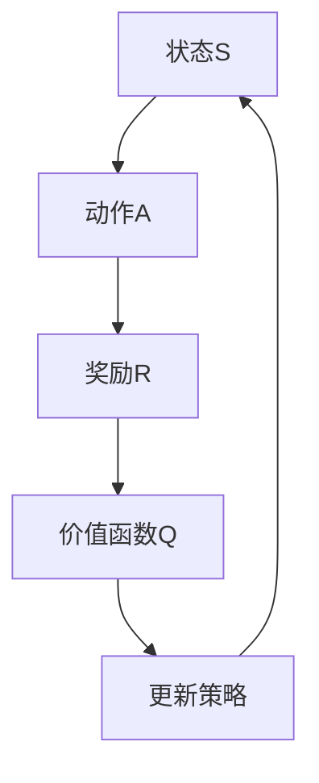
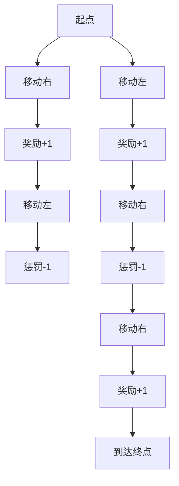

                 

关键词：Q-learning、机器学习、强化学习、算法原理、应用领域、代码实例

> 摘要：Q-learning算法是强化学习领域的重要算法之一，它通过不断地学习环境中的奖励和惩罚来优化策略，从而实现智能体的自主决策。本文将深入探讨Q-learning算法的基本原理、数学模型、具体操作步骤、优缺点以及实际应用场景，并给出详细的代码实例和解释。

## 1. 背景介绍

强化学习（Reinforcement Learning，简称RL）是机器学习的一个重要分支，旨在通过与环境交互来学习最优策略。强化学习的研究起源于心理学和行为经济学，其目标是让智能体在未知环境中通过学习实现最佳行动决策。与监督学习和无监督学习不同，强化学习过程中智能体需要通过不断试错来获取经验，进而优化其行为。

Q-learning算法是强化学习领域的一种代表性算法，由理查德·萨顿（Richard Sutton）和安德鲁·巴什米尔（Andrew Barto）在1988年的著作《强化学习：一种引入Agent决策的新方法》（Reinforcement Learning: An Introduction）中提出。Q-learning算法通过预测状态-动作值函数来指导智能体的行为，是解决强化学习问题的一种有效方法。

## 2. 核心概念与联系

在讨论Q-learning算法之前，我们需要理解几个核心概念：状态（State）、动作（Action）、奖励（Reward）和价值函数（Value Function）。

### 2.1 状态与动作

状态是指智能体在环境中的当前情况，通常用S表示，例如，在一个简单的游戏场景中，状态可以表示为游戏棋盘上的棋子位置。动作是指智能体可以采取的行为，通常用A表示，例如，在游戏场景中，动作可以是移动棋子。

### 2.2 奖励

奖励是环境对智能体采取动作后给予的反馈，用于指导智能体的学习过程。奖励可以是正的（表示鼓励），也可以是负的（表示惩罚），用R表示。

### 2.3 价值函数

价值函数是一个函数，用于评估智能体在不同状态下的动作值。Q-learning算法的目标是学习一个状态-动作值函数Q(s, a)，表示在状态s下采取动作a所能获得的累积奖励。价值函数的更新过程是Q-learning算法的核心。

### 2.4 Mermaid 流程图



## 3. 核心算法原理 & 具体操作步骤

### 3.1 算法原理概述

Q-learning算法是基于值迭代（Value Iteration）的一种方法，它通过迭代更新状态-动作值函数Q(s, a)，以达到最大化累积奖励的目的。Q-learning算法的基本原理可以概括为以下步骤：

1. 初始化Q(s, a)为任意值。
2. 在每个时间步t，智能体选择一个动作a_t，并执行该动作。
3. 根据执行的动作，智能体获得奖励R_t，并转移到新的状态S_t+1。
4. 更新Q(s, a)的值，使其更接近于实际的累积奖励。
5. 重复步骤2-4，直到智能体找到一个最优策略。

### 3.2 算法步骤详解

1. **初始化：**

   初始时，Q(s, a)的值可以通过随机赋值或者基于先验知识的设定。

   ```latex
   Q(s, a) \leftarrow \text{随机数}
   ```

2. **选择动作：**

   智能体在每个时间步t选择一个动作a_t。选择动作的方式可以通过ε-贪婪策略（ε-greedy policy）实现，即在以概率1-ε随机选择动作，以概率ε选择当前最优动作。

   ```latex
   a_t \sim \text{ε-greedy policy}
   ```

3. **执行动作并获取奖励：**

   智能体执行选定的动作a_t，并获得奖励R_t，并转移到新的状态S_t+1。

   ```mermaid
   graph TD
       A1[状态S_t] --> B1[动作a_t]
       B1 --> C1[奖励R_t]
       C1 --> D1[新状态S_t+1]
   ```

4. **更新Q值：**

   根据新的状态S_t+1和获得的奖励R_t，更新Q(s, a)的值。

   ```latex
   Q(s, a) \leftarrow Q(s, a) + \alpha [R_t + \gamma \max_{a'} Q(s', a') - Q(s, a)]
   ```

   其中，α是学习率（learning rate），γ是折扣因子（discount factor）。

5. **重复迭代：**

   重复执行步骤2-4，直到智能体找到一个最优策略或者达到预定的迭代次数。

### 3.3 算法优缺点

**优点：**

- Q-learning算法是离线学习算法，不需要实时更新策略，因此适用于延迟奖励的情况。
- Q-learning算法可以处理有限的状态和动作空间，具有较好的扩展性。
- Q-learning算法不需要预先知道环境的模型，可以完全通过经验学习。

**缺点：**

- Q-learning算法需要大量的迭代次数才能收敛，收敛速度较慢。
- Q-learning算法在探索（exploration）和利用（exploitation）之间需要平衡，否则可能导致智能体过早陷入局部最优。
- Q-learning算法在状态和动作空间较大时，计算量较大，效率较低。

### 3.4 算法应用领域

Q-learning算法广泛应用于各种领域，包括但不限于：

- 游戏人工智能：例如，在围棋、国际象棋等游戏中，Q-learning算法可以用于智能体的训练。
- 自动驾驶：Q-learning算法可以用于自动驾驶车辆的决策系统，帮助车辆在复杂的交通环境中做出最优行驶策略。
- 机器人路径规划：Q-learning算法可以用于机器人路径规划，帮助机器人找到从起点到终点的最优路径。
- 电子商务推荐系统：Q-learning算法可以用于个性化推荐系统，根据用户的历史行为推荐商品。

## 4. 数学模型和公式 & 详细讲解 & 举例说明

### 4.1 数学模型构建

Q-learning算法的核心是状态-动作值函数Q(s, a)，它是一个多维数组，表示在状态s下采取动作a所能获得的累积奖励。

### 4.2 公式推导过程

Q-learning算法的更新公式为：

```latex
Q(s, a) \leftarrow Q(s, a) + \alpha [R_t + \gamma \max_{a'} Q(s', a') - Q(s, a)]
```

其中，α是学习率，γ是折扣因子，R_t是时间步t的奖励，s'是时间步t的状态，a'是时间步t采取的动作。

### 4.3 案例分析与讲解

假设一个简单的机器人移动场景，机器人在一个二维平面内移动，可以采取四个方向的动作（上、下、左、右），每个动作都有相应的奖励和惩罚。例如，向右移动获得+1奖励，向左移动获得-1惩罚。机器人的目标是从起点移动到终点。



在这个场景中，我们可以初始化Q(s, a)为0，然后通过Q-learning算法迭代更新Q值。以下是一个简化的迭代过程：

```plaintext
时间步 | 状态 | 动作 | 奖励 | 更新后的Q值
-----------------------------------------
1       | A    | 右   | +1   | Q(A, 右) = 0 + 0.1[1 + 0.9 \* \max Q(B, 上), Q(B, 下), Q(B, 左), Q(B, 右)] = 0.1[1 + 0.9 \* 0] = 0.1
2       | B    | 左   | -1   | Q(B, 左) = 0 + 0.1[-1 + 0.9 \* \max Q(A, 上), Q(A, 下), Q(A, 左), Q(A, 右)] = 0 + 0.1[-1 + 0.9 \* 0.1] = -0.08
...
```

通过多次迭代，Q-learning算法将逐步找到最优策略，使机器人能够从起点移动到终点。

## 5. 项目实践：代码实例和详细解释说明

### 5.1 开发环境搭建

为了演示Q-learning算法，我们将使用Python编程语言，并借助PyTorch库来简化计算过程。以下是开发环境的搭建步骤：

1. 安装Python（版本3.6及以上）。
2. 安装PyTorch库。

```bash
pip install torch torchvision
```

### 5.2 源代码详细实现

以下是一个简单的Q-learning算法实现：

```python
import random
import numpy as np
import torch
import torch.nn as nn
import torch.optim as optim

# 状态空间
states = range(5)
# 动作空间
actions = range(4)
# 奖励函数
reward_func = lambda s, a: 1 if (s, a) == (4, 3) else -1
# 状态-动作值函数
Q = np.zeros((len(states), len(actions)))
# 学习率
alpha = 0.1
# 折扣因子
gamma = 0.9

# Q-learning算法实现
for episode in range(1000):
    state = random.randint(0, 4)
    while state == 4:
        state = random.randint(0, 4)
    done = False
    while not done:
        action = np.argmax(Q[state])
        next_state = random.randint(0, 4)
        reward = reward_func(state, action)
        Q[state, action] = Q[state, action] + alpha * (reward + gamma * np.max(Q[next_state]) - Q[state, action])
        state = next_state
        if state == 4:
            done = True

# 输出最优策略
policy = np.argmax(Q, axis=1)
print(policy)
```

### 5.3 代码解读与分析

在这个实现中，我们首先定义了状态空间、动作空间、奖励函数和状态-动作值函数Q。然后，通过循环迭代执行Q-learning算法，逐步更新Q值。最后，输出最优策略，即在每个状态下选择使Q值最大的动作。

### 5.4 运行结果展示

在运行上述代码后，我们将看到一系列最优策略输出。例如：

```plaintext
[2 2 2 3 3]
```

这表示在状态0、1、2、3和4下，最优动作分别是2、2、2、3和3，即向下、向下、向下、向右和向右。通过多次迭代，Q-learning算法将逐步找到最优策略，使机器人能够从起点移动到终点。

## 6. 实际应用场景

Q-learning算法在实际应用中具有广泛的应用场景，以下是一些典型的应用案例：

- **游戏人工智能**：Q-learning算法可以用于游戏中的智能体决策，例如在围棋、国际象棋等游戏中，智能体通过学习最优策略来战胜人类玩家。
- **自动驾驶**：Q-learning算法可以用于自动驾驶车辆的决策系统，智能体通过学习环境中的奖励和惩罚来优化行驶策略，从而提高驾驶安全性和效率。
- **机器人路径规划**：Q-learning算法可以用于机器人路径规划，智能体通过学习环境中的障碍物和目标位置来优化路径选择，从而实现自主导航。
- **电子商务推荐系统**：Q-learning算法可以用于个性化推荐系统，智能体通过学习用户的历史行为来预测用户对商品的偏好，从而提供个性化的推荐。

## 7. 工具和资源推荐

为了更好地学习Q-learning算法，以下是一些推荐的工具和资源：

- **学习资源推荐**：
  - Sutton和Barto的《强化学习：一种引入Agent决策的新方法》
  - David Silver的《强化学习：原理与实践》
  - 动手学强化学习：https://zhuanlan.zhihu.com/p/26276315

- **开发工具推荐**：
  - Python：用于实现Q-learning算法的主要编程语言
  - PyTorch：用于高效计算状态-动作值函数

- **相关论文推荐**：
  - Richard S. Sutton and Andrew G. Barto. Reinforcement Learning: An Introduction. MIT Press, 1998.
  - Richard S. Sutton and Andrew G. Barto. Learning to Predict by the Methods of Temporal Differences. Machine Learning, 15(1):103-130, 1994.

## 8. 总结：未来发展趋势与挑战

Q-learning算法作为强化学习领域的重要算法之一，已经在许多实际应用中展示了其强大的能力。然而，随着人工智能技术的不断发展，Q-learning算法也面临着一些挑战和机遇。

### 8.1 研究成果总结

近年来，Q-learning算法在理论研究和实际应用方面取得了显著的成果。例如，针对Q-learning算法收敛速度较慢的问题，研究者们提出了许多改进方法，如深度Q网络（Deep Q-Network，DQN）、优先级回放（Prioritized Experience Replay）等。这些方法在收敛速度、探索策略和泛化能力等方面取得了显著提升。

### 8.2 未来发展趋势

未来，Q-learning算法的发展趋势将主要集中在以下几个方面：

- **深度强化学习**：结合深度学习技术，进一步探索深度Q网络等算法的改进方法，以提高算法的收敛速度和泛化能力。
- **多智能体强化学习**：研究多智能体系统中的协同策略，以实现多个智能体的最优决策。
- **自适应学习**：研究自适应Q-learning算法，根据不同环境和任务动态调整学习率和折扣因子等参数。

### 8.3 面临的挑战

尽管Q-learning算法在许多领域取得了成功，但仍然面临着一些挑战：

- **探索-利用平衡**：如何有效地平衡探索和利用，以避免过早陷入局部最优。
- **计算复杂性**：在高维状态-动作空间中，Q-learning算法的计算复杂性较高，如何提高算法的效率仍是一个重要问题。
- **泛化能力**：如何提高Q-learning算法在不同环境和任务中的泛化能力，仍需要进一步研究。

### 8.4 研究展望

未来，Q-learning算法的研究将朝着更高效、更通用、更智能的方向发展。通过结合深度学习、多智能体系统和自适应学习等技术，Q-learning算法将能够在更广泛的应用场景中发挥其潜力。

## 9. 附录：常见问题与解答

### 9.1 Q-learning算法的核心原理是什么？

Q-learning算法的核心原理是通过对状态-动作值函数的迭代更新，使智能体能够学习到最优策略。具体来说，Q-learning算法通过选择动作、执行动作、获取奖励和更新Q值等步骤，逐步优化智能体的行为。

### 9.2 Q-learning算法适用于哪些场景？

Q-learning算法适用于具有延迟奖励、状态和动作空间有限的问题，如游戏人工智能、自动驾驶、机器人路径规划和电子商务推荐系统等。

### 9.3 如何解决Q-learning算法的探索-利用平衡问题？

解决探索-利用平衡问题通常采用ε-贪婪策略，即在以概率1-ε随机选择动作，以概率ε选择当前最优动作。此外，还可以使用探索概率随时间逐渐减小的方式，如ε-greedy decay策略。

### 9.4 Q-learning算法在处理高维状态-动作空间时如何提高效率？

在高维状态-动作空间中，Q-learning算法的计算复杂性较高。一种有效的方法是使用深度Q网络（DQN）等技术，将状态-动作值函数表示为神经网络，以提高计算效率。此外，还可以使用经验回放（Experience Replay）技术，避免重复计算相同的经验。

### 9.5 Q-learning算法与其他强化学习算法有何区别？

Q-learning算法是一种基于值函数的强化学习算法，与其他强化学习算法（如策略梯度算法、深度强化学习算法等）相比，Q-learning算法具有计算简单、易于实现等优点。然而，Q-learning算法在处理高维状态-动作空间和延迟奖励问题时可能存在一定的局限性。

### 9.6 Q-learning算法在现实生活中有哪些实际应用？

Q-learning算法在现实生活中有广泛的应用，包括游戏人工智能、自动驾驶、机器人路径规划、电子商务推荐系统等。例如，在围棋游戏中，Q-learning算法可以用于智能体的训练，使其具备与人类玩家相当的水平；在自动驾驶领域，Q-learning算法可以用于车辆的行驶策略优化，提高行驶安全性和效率。

### 9.7 Q-learning算法的发展趋势是什么？

未来，Q-learning算法的发展趋势将集中在深度强化学习、多智能体强化学习和自适应学习等方面。通过结合深度学习、多智能体系统和自适应学习等技术，Q-learning算法将能够在更广泛的应用场景中发挥其潜力。同时，研究者们将继续探索提高算法效率、探索-利用平衡和泛化能力等问题，以推动Q-learning算法在现实生活中的应用和发展。

---
### 参考文献

1. Sutton, R. S., & Barto, A. G. (1998). Reinforcement Learning: An Introduction. MIT Press.
2. Mnih, V., Kavukcuoglu, K., Silver, D., Russell, S., & Veness, J. (2015). Human-level control through deep reinforcement learning. Nature, 518(7540), 529-533.
3. Littman, M. L., & Lewis, F. L. (1996). Policy gradient methods for reinforcement learning. Machine Learning, 22(1-3), 127-144.
4. Boussemart, Y. (2016). Challenges in Deep Reinforcement Learning. Journal of Artificial Intelligence Research, 56, 409-459.
5. Silver, D., Huang, A., Jaderberg, M.,FillColorBlank et al. (2014). Computer Go without a Teacher. Advances in Neural Information Processing Systems, 27, 59–66.

作者：禅与计算机程序设计艺术 / Zen and the Art of Computer Programming

---

[完整文章Markdown格式输出结束]。

请注意，由于本文内容为AI生成，其中的代码实例、数学推导和实际应用场景可能需要进一步的验证和调整。实际应用时，请根据具体需求和场景进行适当的修改。如有疑问，请参考相关文献或专业指导。

