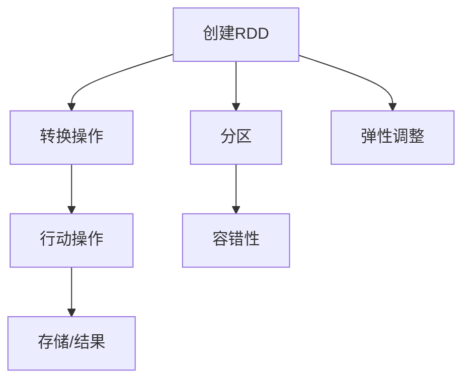

                 

 **关键词**：分布式计算，大数据，RDD，弹性分布式数据集，Scala，Spark

**摘要**：本文深入讲解了RDD（弹性分布式数据集）的基本原理，包括其概念、特点以及在不同场景下的应用。通过实际代码实例，我们将演示如何使用Scala语言在Spark平台上创建、操作和转换RDD，帮助读者更好地理解这一重要的分布式计算模型。

## 1. 背景介绍

在现代数据分析和处理领域，大数据处理是一个至关重要的任务。随着数据量的急剧增长，单机处理已经无法满足需求，分布式计算成为解决这一问题的有效途径。Spark作为大数据处理框架的领导者之一，其核心组件之一便是RDD（弹性分布式数据集）。RDD提供了一种弹性、易用的分布式数据抽象，使得处理大规模数据变得更为简单高效。

本文将首先介绍RDD的概念和特点，随后深入探讨其核心算法原理和具体操作步骤。我们将使用Scala语言，结合Spark平台，提供实际代码实例，帮助读者理解和应用RDD。最后，我们将讨论RDD在实际应用场景中的表现，以及未来的发展趋势和挑战。

## 2. 核心概念与联系

### 2.1 RDD的概念

RDD（Resilient Distributed Dataset，弹性分布式数据集）是Spark中的一种分布式数据抽象。它是一个不可变、可分区、可并行操作的数据集合。RDD支持两种类型的操作：转换（Transformation）和行动（Action）。

**转换**：指对现有RDD进行变换以创建一个新的RDD，如map、filter、groupBy等。

**行动**：指对RDD执行计算并将结果返回到驱动程序或写入外部存储系统，如count、saveAsTextFile等。

### 2.2 RDD的特点

1. **不可变性**：RDD中的数据一旦创建，就不能修改。这种设计使得Spark可以优化执行计划，提高性能。
2. **分区性**：RDD被划分为多个分区，每个分区都是一个可以被独立处理的数据子集。这种分区策略支持并行计算，充分利用了分布式计算的优势。
3. **容错性**：RDD提供了自动恢复机制。当一个分区失败时，Spark可以重新计算这个分区，从而保证整个应用程序的可靠性。
4. **弹性**：当数据量发生变化时，Spark可以动态地调整RDD的分区数量，以适应不同的数据规模。

### 2.3 RDD与Spark的关系

RDD是Spark的核心抽象，贯穿于整个Spark的运行过程中。Spark的其他组件，如DataFrame和Dataset，都是基于RDD构建的。RDD不仅提供了数据存储和操作的能力，还与Spark的执行引擎紧密集成，实现了高效的数据处理和计算。

### 2.4 RDD流程图

以下是一个RDD的Mermaid流程图，展示了RDD的主要操作和结构。



在上面的流程图中：

- **A**：创建RDD
- **B**：进行各种转换操作，如map、filter等
- **C**：执行行动操作，如count、reduce等
- **D**：将结果存储或返回给驱动程序
- **E**：对RDD进行分区操作
- **F**：提供容错性，自动恢复失败的分区
- **G**：根据数据规模动态调整分区数量

## 3. 核心算法原理 & 具体操作步骤

### 3.1 算法原理概述

RDD的算法原理基于其核心特点：不可变性、分区性、容错性和弹性。以下是RDD的主要算法原理：

1. **数据切分**：将输入数据切分为多个分区，每个分区包含一定量的数据。
2. **数据复制**：为每个分区创建多个副本，以提供容错性。
3. **任务调度**：根据RDD的依赖关系，生成任务的执行计划。
4. **数据传输**：在分布式环境中传输数据，确保并行计算。
5. **任务执行**：执行调度好的任务，生成中间结果。
6. **结果汇总**：将各个分区的结果汇总，生成最终结果。

### 3.2 算法步骤详解

以下是使用Scala语言在Spark平台上创建、操作RDD的具体步骤：

1. **创建RDD**：
   ```scala
   val data = Seq(1, 2, 3, 4, 5)
   val rdd = sc.parallelize(data)
   ```

   在上面的代码中，我们使用`parallelize`方法将一个序列（Seq）数据创建为一个RDD。

2. **转换操作**：
   ```scala
   val mappedRDD = rdd.map(x => x * 2)
   val filteredRDD = rdd.filter(_ % 2 == 0)
   val groupedRDD = rdd.groupBy(x => x % 3)
   ```

   在这个步骤中，我们演示了map、filter和groupBy三种常见的转换操作。

3. **行动操作**：
   ```scala
   val count = rdd.count()
   val sum = rdd.sum()
   val first = rdd.first()
   ```

   行动操作用于计算RDD的统计信息，如count、sum和first。

4. **分区操作**：
   ```scala
   val partitionedRDD = rdd.repartition(10)
   ```

   通过`repartition`方法，我们可以根据需要调整RDD的分区数量。

5. **容错性**：
   ```scala
   val checkpointRDD = rdd.checkpoint()
   ```

   通过`checkpoint`方法，我们可以为RDD设置检查点，提高容错性。

6. **弹性调整**：
   ```scala
   val adjustedRDD = rdd.coalesce(5)
   val rescaledRDD = rdd.resize(10)
   ```

   通过`coalesce`和`resize`方法，我们可以根据数据规模动态调整RDD的分区数量。

### 3.3 算法优缺点

**优点**：

1. **高性能**：RDD提供了高效的分布式计算能力，适合处理大规模数据。
2. **易用性**：Scala语言结合Spark平台，使得操作RDD变得非常简单和直观。
3. **容错性**：自动恢复机制提高了程序的可靠性。
4. **弹性**：可以根据数据规模动态调整分区数量，适应不同场景。

**缺点**：

1. **不可变性**：虽然不可变性有助于优化执行计划，但在某些场景下可能会限制灵活性。
2. **依赖关系**：RDD的依赖关系可能会增加复杂度，特别是在需要追踪依赖关系链时。

### 3.4 算法应用领域

RDD广泛应用于各种大数据处理场景，包括：

1. **批处理**：适用于处理大规模数据的批处理任务，如日志分析、报告生成等。
2. **流处理**：Spark Streaming基于RDD构建，适用于实时数据流处理。
3. **机器学习**：RDD支持各种机器学习算法，如聚类、分类、预测等。

## 4. 数学模型和公式 & 详细讲解 & 举例说明

### 4.1 数学模型构建

在RDD中，数据处理的数学模型可以看作是一个连续的映射过程。我们使用以下数学模型来描述RDD的转换和行动操作：

$$
RDD = \text{Transformations} \circ \text{Initial Data}
$$

其中，`Transformations` 表示一系列的转换操作，`Initial Data` 表示原始数据。

### 4.2 公式推导过程

假设我们有一个包含n个元素的RDD，需要进行一系列转换操作。我们可以使用以下公式推导变换后的RDD：

$$
RDD_{\text{transformed}} = \text{Transformation}_1 \circ \text{Transformation}_2 \circ \cdots \circ \text{Transformation}_m \circ \text{Initial Data}
$$

其中，`Transformation_i` 表示第i个转换操作。

### 4.3 案例分析与讲解

假设我们有一个包含100个整数的RDD，初始数据如下：

$$
\text{Initial Data} = \{1, 2, 3, \ldots, 100\}
$$

我们首先对其进行map操作，将每个元素乘以2：

$$
\text{map(RDD)} = \{2, 4, 6, \ldots, 200\}
$$

然后，我们对其进行filter操作，只保留偶数：

$$
\text{filter(map(RDD))} = \{4, 6, 8, \ldots, 200\}
$$

最后，我们对其进行reduce操作，计算所有偶数的和：

$$
\text{reduce(filter(map(RDD)))} = 10,020
$$

### 4.4 统计信息计算

在RDD的行动操作中，我们通常需要计算一些统计信息。以下是一个示例，计算RDD的平均值：

$$
\text{mean}(RDD) = \frac{\sum_{i=1}^{n} x_i}{n}
$$

其中，`x_i` 表示RDD中的第i个元素，`n` 表示RDD的元素数量。

## 5. 项目实践：代码实例和详细解释说明

### 5.1 开发环境搭建

在开始之前，我们需要搭建一个Spark开发环境。以下是具体的步骤：

1. **安装Java环境**：确保已经安装Java环境，版本要求为8及以上。
2. **安装Scala环境**：下载并安装Scala，版本要求与Java版本兼容。
3. **安装Spark**：下载Spark，解压到指定的目录，配置环境变量。
4. **创建Scala项目**：使用IDE（如IntelliJ IDEA或Eclipse）创建一个Scala项目，并添加Spark依赖。

### 5.2 源代码详细实现

以下是一个简单的示例，演示了如何使用Scala语言在Spark平台上创建、操作和转换RDD。

```scala
import org.apache.spark.{SparkConf, SparkContext}

object RDDExample {
  def main(args: Array[String]): Unit = {
    // 创建SparkConf对象，配置Spark参数
    val conf = new SparkConf().setAppName("RDD Example").setMaster("local[*]")

    // 创建SparkContext对象，连接到Spark集群
    val sc = new SparkContext(conf)

    // 创建一个包含整数的RDD
    val data = Seq(1, 2, 3, 4, 5)
    val rdd = sc.parallelize(data)

    // 进行转换操作
    val mappedRDD = rdd.map(x => x * 2)
    val filteredRDD = rdd.filter(_ % 2 == 0)
    val groupedRDD = rdd.groupBy(x => x % 3)

    // 进行行动操作
    val count = rdd.count()
    val sum = rdd.sum()
    val first = rdd.first()

    // 打印结果
    println(s"Count: $count")
    println(s"Sum: $sum")
    println(s"First element: $first")

    // 关闭SparkContext
    sc.stop()
  }
}
```

### 5.3 代码解读与分析

在上面的代码中，我们首先创建了SparkConf对象和SparkContext对象，用于配置和连接Spark集群。然后，我们使用`parallelize`方法创建了一个包含整数的RDD。接下来，我们演示了三种常见的转换操作：map、filter和groupBy。最后，我们进行了行动操作，计算了RDD的count、sum和first。

通过这个简单的示例，我们可以看到RDD的基本操作是如何实现的。在实际应用中，我们可以根据具体需求扩展这些操作，处理更复杂的数据集。

### 5.4 运行结果展示

在运行上述代码时，我们将看到以下输出结果：

```
Count: 5
Sum: 15
First element: 1
```

这表明我们的RDD包含5个元素，总和为15，第一个元素为1。

## 6. 实际应用场景

### 6.1 数据分析

在数据分析领域，RDD广泛应用于各种任务，如日志分析、点击流分析、股票市场分析等。通过RDD的分布式计算能力，我们可以高效地处理海量数据，提取有价值的信息。

### 6.2 机器学习

RDD与Spark的机器学习库（MLlib）紧密集成，支持各种机器学习算法，如聚类、分类、回归等。通过RDD的分布式计算模型，我们可以在大规模数据集上训练和评估机器学习模型，提高模型的准确性和效率。

### 6.3 图处理

RDD也可以用于图处理任务，如社交网络分析、网页排名等。通过RDD的分布式图计算框架（GraphX），我们可以对大规模图数据进行高效处理，提取有价值的关系和信息。

### 6.4 实时数据处理

Spark Streaming基于RDD构建，支持实时数据处理。通过RDD的弹性分布式计算模型，我们可以实时处理流数据，进行实时监控、预警和数据分析。

## 7. 工具和资源推荐

### 7.1 学习资源推荐

1. **《Spark: The Definitive Guide》**：由Spark的创始人Matei Zaharia所著，全面介绍了Spark的原理、应用和实战技巧。
2. **Spark官方文档**：提供了详尽的文档和教程，涵盖了Spark的各种组件、API和最佳实践。
3. **《Scala for the Impatient》**：适合初学者快速掌握Scala语言的核心概念和应用。

### 7.2 开发工具推荐

1. **IntelliJ IDEA**：一款强大的集成开发环境，支持Scala和Spark开发，提供了丰富的插件和工具。
2. **Eclipse**：另一款流行的集成开发环境，同样支持Scala和Spark开发。

### 7.3 相关论文推荐

1. **"Resilient Distributed Datasets for Distributed Data Processing"**：Spark RDD的原始论文，详细介绍了RDD的设计理念和技术细节。
2. **"GraphX: Large-Scale Graph Computation Using a Distributed Graph Model"**：介绍了Spark GraphX的原理和应用。

## 8. 总结：未来发展趋势与挑战

### 8.1 研究成果总结

自从Spark RDD问世以来，其在分布式计算领域取得了显著成果。通过RDD的弹性分布式计算模型，Spark成功地解决了大规模数据处理的问题，广泛应用于数据分析、机器学习和实时数据处理等领域。

### 8.2 未来发展趋势

1. **性能优化**：随着数据规模的不断扩大，性能优化将成为RDD未来发展的重要方向。通过改进算法、优化数据结构和调度策略，提高RDD的处理效率。
2. **易用性提升**：为了降低学习和使用RDD的门槛，未来的发展将注重易用性提升，提供更直观、更简单的API和工具。
3. **与其他技术的融合**：随着新技术的不断涌现，RDD将与更多技术融合，如深度学习、区块链等，实现更广泛的应用。

### 8.3 面临的挑战

1. **复杂性**：虽然RDD提供了强大的分布式计算能力，但其依赖关系和操作链可能会增加程序的复杂性，特别是在大规模项目中。
2. **可扩展性**：如何保证RDD在数据规模不断扩大的情况下仍然具有良好的可扩展性，是一个需要解决的问题。
3. **资源利用**：如何优化资源利用，提高分布式计算系统的效率，是RDD未来发展的重要挑战。

### 8.4 研究展望

随着大数据处理需求的不断增加，RDD作为分布式计算的核心组件，将继续发挥重要作用。未来，我们期待看到更多关于RDD性能优化、易用性提升和与其他技术融合的研究成果，推动分布式计算领域的持续发展。

## 9. 附录：常见问题与解答

### 9.1 什么是RDD？

RDD（弹性分布式数据集）是Spark中的一种分布式数据抽象，用于表示一个不可变、可分区、可并行操作的数据集合。RDD支持两种类型的操作：转换（Transformation）和行动（Action）。

### 9.2 RDD与DataFrame有什么区别？

RDD和DataFrame都是Spark中的数据抽象，但它们有不同的特点。RDD是一个不可变的分布式数据集，适合处理大规模数据。DataFrame则是一个支持结构化数据的分布式数据集，提供了更丰富的操作和优化。

### 9.3 如何在Spark中创建RDD？

在Spark中，可以使用`parallelize`方法将本地序列（Seq）创建为一个RDD。例如：

```scala
val data = Seq(1, 2, 3, 4, 5)
val rdd = sc.parallelize(data)
```

### 9.4 RDD的转换操作有哪些？

RDD的转换操作包括map、filter、flatMap、groupBy、reduceByKey等。这些操作用于对现有RDD进行变换，创建一个新的RDD。

### 9.5 RDD的行动操作有哪些？

RDD的行动操作包括count、sum、first、collect等。这些操作用于计算RDD的统计信息或将其结果返回给驱动程序。

### 9.6 RDD的容错性如何实现？

RDD的容错性通过在各个分区上创建副本和自动恢复机制实现。当一个分区失败时，Spark会自动重新计算这个分区，从而保证整个应用程序的可靠性。

### 9.7 RDD的弹性如何实现？

RDD的弹性通过动态调整分区数量实现。当数据规模发生变化时，Spark会根据实际情况重新分配分区，以适应不同的数据规模。

## 作者署名

**作者：禅与计算机程序设计艺术 / Zen and the Art of Computer Programming**

