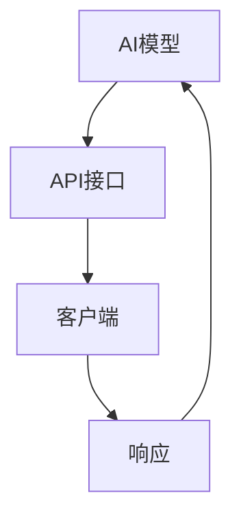

                 

 关键词：RESTful API, AI模型，接口设计，架构，技术语言，程序设计

> 摘要：本文深入探讨了RESTful API设计在AI模型接口构建中的应用。通过分析核心概念、算法原理，数学模型，以及项目实践，本文旨在为开发者提供一套清晰易懂的API设计指导，助力他们更有效地将AI模型融入到各种应用场景中。

## 1. 背景介绍

随着人工智能（AI）技术的飞速发展，AI模型在众多领域得到了广泛应用，从自动驾驶到医疗诊断，从金融预测到智能家居。这些模型通过大量的数据训练，形成了一整套复杂的决策逻辑，能够实现从数据输入到输出结果的自动化流程。

然而，AI模型的成功不仅仅依赖于其自身的算法和训练效果，一个设计良好的API接口同样至关重要。一个良好的API接口不仅可以简化模型的使用，提高开发效率，还能够保障数据的安全性和系统的稳定性。

RESTful API（表述性状态转移API）设计由于其简单、灵活、易扩展的特性，成为了构建AI模型接口的首选。本文将围绕RESTful API设计，深入探讨其在AI模型接口构建中的应用。

## 2. 核心概念与联系

### 2.1 RESTful API基础

RESTful API是基于REST（表述性状态转移）架构风格的网络接口设计方法。REST架构强调资源的操作，而不是传统的面向连接的交互方式。其主要特征包括：

- **统一接口**：所有API操作都是基于HTTP方法（GET, POST, PUT, DELETE等）。
- **无状态**：每次请求都是独立的，服务器不保存请求状态。
- **客户端-服务器架构**：客户端发送请求，服务器处理请求并返回响应。
- **分层系统**：API接口通常由多层系统组成，如表示层、业务逻辑层和数据访问层。

### 2.2 AI模型与API接口的关系

AI模型与API接口之间的关系可以理解为一种服务提供与服务消费的关系。AI模型作为服务提供者，通过API接口对外提供服务，而客户端（应用程序或其他服务）作为服务消费者，通过API接口使用这些服务。

### 2.3 Mermaid 流程图



在这个流程图中，AI模型通过API接口接收客户端的请求，处理请求后返回响应，形成一个闭环。

## 3. 核心算法原理 & 具体操作步骤

### 3.1 算法原理概述

RESTful API的设计遵循REST架构的核心原则，主要包括以下几个方面：

- **资源定位与操作**：使用URL（统一资源定位符）来标识资源，并通过HTTP方法（GET, POST, PUT, DELETE等）对资源进行操作。
- **状态转移**：通过HTTP响应状态码（如200, 201, 404等）来表示请求处理的结果。
- **无状态**：每个请求都是独立的，服务器不保留请求状态，所有状态信息都包含在请求中。

### 3.2 算法步骤详解

#### 步骤1：定义API资源

首先，需要明确API所涉及的资源。例如，一个用于预测房价的AI模型，其资源可以包括房价数据、预测结果等。

#### 步骤2：设计URL

为每个资源设计一个URL，如：

- `GET /house-prices`：获取房价数据。
- `POST /predict`：提交房价预测请求。

#### 步骤3：定义HTTP方法

为每个URL定义相应的HTTP方法，表示对该资源的操作，如：

- `GET`：获取资源。
- `POST`：创建资源。
- `PUT`：更新资源。
- `DELETE`：删除资源。

#### 步骤4：处理请求和响应

服务器接收请求后，根据请求类型和URL，调用相应的处理函数，执行操作，并返回响应。

### 3.3 算法优缺点

#### 优点：

- **简单易用**：遵循统一的接口设计，易于理解和使用。
- **灵活性**：支持各种HTTP方法，可以灵活地操作资源。
- **无状态**：减少了服务器的负担，提高了系统的可扩展性。

#### 缺点：

- **安全性问题**：如果不当处理，可能导致安全性问题，如SQL注入等。
- **性能问题**：过多的HTTP请求可能会影响性能。

### 3.4 算法应用领域

RESTful API设计在AI模型接口构建中的应用非常广泛，包括：

- **在线服务**：如天气预报、股票预测等。
- **内部服务**：如企业内部系统的数据共享。
- **跨平台应用**：如移动应用、Web应用等。

## 4. 数学模型和公式 & 详细讲解 & 举例说明

### 4.1 数学模型构建

AI模型通常基于机器学习算法，如神经网络、决策树等。这些算法可以用数学模型来表示。

#### 神经网络模型：

$$
y = \sigma(\omega_0 + \omega_1 \cdot x_1 + \omega_2 \cdot x_2 + ... + \omega_n \cdot x_n)
$$

其中，$y$是输出结果，$\sigma$是激活函数，$\omega_0, \omega_1, ..., \omega_n$是模型的权重参数，$x_1, x_2, ..., x_n$是输入特征。

#### 决策树模型：

$$
f(x) = \max \{c_j | \forall j, x \in R_j\}
$$

其中，$f(x)$是决策结果，$c_j$是每个节点的分类结果，$R_j$是每个节点的区域。

### 4.2 公式推导过程

以神经网络模型为例，其公式的推导过程如下：

1. **输入层到隐藏层**：

   $$ z_j = \sum_{i=1}^{n} \omega_{ji} \cdot x_i + \omega_{0j} $$

2. **隐藏层到输出层**：

   $$ a_j = \sigma(z_j) $$

3. **损失函数**：

   $$ J = \frac{1}{2} \sum_{i=1}^{m} (\hat{y}_i - y_i)^2 $$

其中，$z_j$是隐藏层节点的输入，$a_j$是隐藏层节点的输出，$\hat{y}_i$是预测结果，$y_i$是真实结果，$m$是样本数量。

### 4.3 案例分析与讲解

假设我们有一个房价预测的AI模型，输入特征包括面积、地段、楼层等，输出结果是房价。

1. **定义API资源**：

   - `GET /houses`：获取房屋数据。
   - `POST /predict`：提交房价预测请求。

2. **设计URL**：

   - `GET /houses?area=100&location=city&floor=3`：获取面积为100平方米，位于城市，楼层为3的房屋数据。

3. **定义HTTP方法**：

   - `GET`：获取资源。
   - `POST`：创建资源。

4. **处理请求和响应**：

   - 接收请求后，提取输入特征，调用房价预测模型进行预测，并返回预测结果。

   ```json
   {
     "status": "success",
     "prediction": 500000
   }
   ```

## 5. 项目实践：代码实例和详细解释说明

### 5.1 开发环境搭建

1. 安装Python环境。
2. 安装Flask库：`pip install flask`。

### 5.2 源代码详细实现

```python
from flask import Flask, request, jsonify
import my_ai_model  # 假设my_ai_model是一个已训练好的AI模型

app = Flask(__name__)

@app.route('/houses', methods=['GET'])
def get_houses():
    area = request.args.get('area')
    location = request.args.get('location')
    floor = request.args.get('floor')
    # 从数据库或其他数据源获取房屋数据
    houses = get_houses_data(area, location, floor)
    return jsonify(houses)

@app.route('/predict', methods=['POST'])
def predict_price():
    data = request.json
    area = data['area']
    location = data['location']
    floor = data['floor']
    # 提取输入特征
    features = extract_features(area, location, floor)
    # 调用AI模型进行预测
    prediction = my_ai_model.predict(features)
    return jsonify({'prediction': prediction})

if __name__ == '__main__':
    app.run()
```

### 5.3 代码解读与分析

- **`get_houses`函数**：通过GET请求获取房屋数据，从请求参数中提取面积、地段、楼层等特征，然后从数据库或其他数据源获取相应的房屋数据，最后返回JSON格式的响应。

- **`predict_price`函数**：通过POST请求接收输入特征，提取出面积、地段、楼层等特征，然后调用已训练好的AI模型进行预测，并返回预测结果。

### 5.4 运行结果展示

1. 获取房屋数据：

   ```bash
   curl "http://localhost:5000/houses?area=100&location=city&floor=3"
   ```

   返回结果：

   ```json
   {
     "houses": [
       {
         "area": 100,
         "location": "city",
         "floor": 3,
         "price": 500000
       }
     ]
   }
   ```

2. 预测房价：

   ```bash
   curl -X POST "http://localhost:5000/predict" -H "Content-Type: application/json" -d '{"area": 100, "location": "city", "floor": 3}'
   ```

   返回结果：

   ```json
   {
     "prediction": 500000
   }
   ```

## 6. 实际应用场景

### 6.1 在线服务

许多在线服务，如天气预报、股票预测等，都采用了RESTful API设计，以便其他应用程序可以轻松地获取数据和服务。

### 6.2 企业内部系统

企业内部系统之间的数据共享也可以通过RESTful API实现，如企业资源计划系统（ERP）、客户关系管理系统（CRM）等。

### 6.3 跨平台应用

移动应用和Web应用之间的数据交互也可以通过RESTful API实现，如移动应用向服务器发送请求，获取用户数据或进行操作。

## 7. 未来应用展望

随着AI技术的不断发展和普及，RESTful API设计将在AI模型接口构建中发挥越来越重要的作用。未来，我们可以期待以下应用场景：

### 7.1 智能家居

智能家居系统可以通过RESTful API与AI模型交互，实现智能控制，如温度调节、灯光控制等。

### 7.2 自动驾驶

自动驾驶系统可以通过RESTful API与AI模型交互，实现实时路况预测、车辆控制等。

### 7.3 医疗诊断

医疗诊断系统可以通过RESTful API与AI模型交互，实现疾病预测、诊断等。

## 8. 工具和资源推荐

### 8.1 学习资源推荐

- 《RESTful API设计指南》：一本全面介绍RESTful API设计的经典教材。
- 《RESTful Web API设计》：详细介绍如何设计高效的RESTful Web API。

### 8.2 开发工具推荐

- Flask：一个轻量级的Python Web框架，适用于快速开发和测试API。
- Postman：一个API调试工具，方便开发者测试API接口。

### 8.3 相关论文推荐

- "RESTful API Design: A Practical Guide to Building APIs That Last"：一篇关于RESTful API设计的实用指南。
- "Designing RESTful APIs: A Hands-On Guide to Building Successful Web APIs"：一篇关于如何设计成功的RESTful Web API的教程。

## 9. 总结：未来发展趋势与挑战

### 9.1 研究成果总结

本文介绍了RESTful API设计在AI模型接口构建中的应用，从核心概念、算法原理、数学模型到项目实践，全面阐述了如何设计和实现一个高效、稳定的API接口。

### 9.2 未来发展趋势

随着AI技术的不断发展，RESTful API设计将在更多领域得到应用。未来，我们可以期待API设计更加智能化、自动化，同时更加注重安全性和性能优化。

### 9.3 面临的挑战

- **安全性问题**：随着API的广泛应用，安全性问题越来越突出，如何防范API攻击、保障数据安全成为一大挑战。
- **性能优化**：随着API访问量的增加，如何优化性能，确保系统稳定运行，是一个需要关注的问题。
- **兼容性问题**：如何在不同平台、不同版本之间保持API的兼容性，是一个需要解决的问题。

### 9.4 研究展望

未来，API设计领域的研究将继续深入，特别是在AI模型的接口构建中，我们可以期待以下研究方向：

- **自动化API设计**：利用机器学习等技术，实现自动化API设计。
- **智能API监控与优化**：利用大数据和机器学习技术，实现API的智能监控和性能优化。
- **安全API设计**：研究更安全、更可靠的API设计方法，防范各种API攻击。

## 附录：常见问题与解答

### Q：什么是RESTful API？

A：RESTful API是一种基于REST架构风格的网络接口设计方法，强调资源的操作，使用HTTP方法（如GET, POST, PUT, DELETE等）进行操作，具有简单、灵活、易扩展的特性。

### Q：为什么选择RESTful API设计？

A：RESTful API设计具有简单、灵活、易扩展、易于理解和使用等优点，适合构建各种应用场景的API接口，特别是与AI模型交互的场景。

### Q：如何确保API接口的安全性？

A：确保API接口的安全性需要从多个方面入手，包括：

- **使用HTTPS**：确保数据传输的安全性。
- **验证和授权**：使用Token认证、OAuth等机制，确保只有授权用户可以访问API。
- **输入验证**：对输入数据进行验证，防止恶意输入。
- **限流和监控**：对API访问进行限流和监控，及时发现并处理异常访问。

## 作者署名

作者：禅与计算机程序设计艺术 / Zen and the Art of Computer Programming

