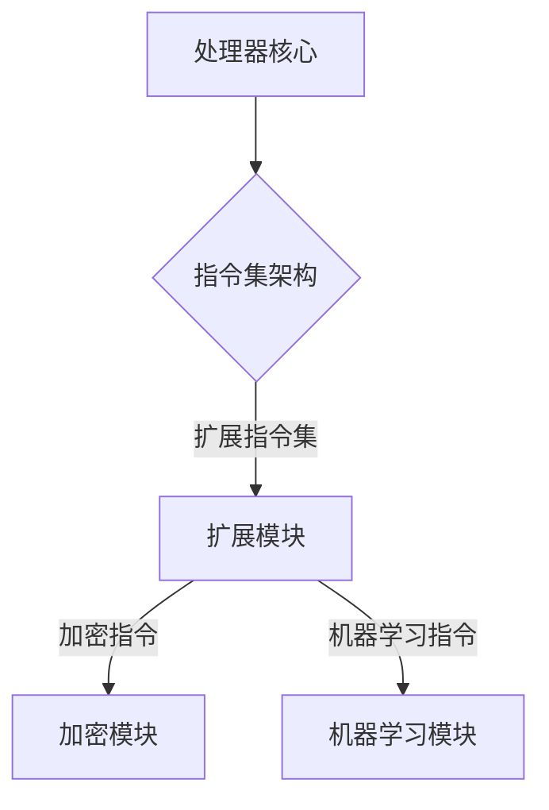

                 

关键词：RISC-V、开源指令集架构、硬件设计、软件生态系统、未来趋势

> 摘要：本文将深入探讨RISC-V指令集架构的背景、核心概念、未来趋势及其在硬件设计和软件生态系统中的重要性。我们将通过具体实例和详细的解释，分析RISC-V如何成为开源世界的一股强大力量，并对它的未来发展提出见解。

## 1. 背景介绍

### 1.1 RISC-V的诞生

RISC-V（精简指令集计算机五级指令集）起源于2010年，由加州大学伯克利分校的研究人员发起。RISC-V的设计初衷是为了构建一种开放、模块化、可扩展的指令集架构，旨在打破传统封闭架构的束缚，推动计算技术的创新和发展。

### 1.2 开源指令集架构的意义

开源指令集架构的重要性在于它允许任何人自由地使用、修改和分发指令集，这为硬件设计和软件开发提供了极大的灵活性。在传统封闭架构中，制造商通常对指令集保持垄断，限制了其他公司和开发者的创新能力。而RISC-V的开源性则打破了这种垄断，促进了技术进步和产业竞争。

## 2. 核心概念与联系

### 2.1 RISC-V指令集架构

RISC-V指令集架构采用了精简指令集（RISC）的设计原则，包括指令数量少、指令执行速度快、寄存器数量多等特点。它还支持多种不同的扩展指令集，如加密、机器学习等，以满足不同领域的需求。

### 2.2 Mermaid流程图

下面是一个简单的Mermaid流程图，展示RISC-V指令集架构的核心组件：



## 3. 核心算法原理 & 具体操作步骤

### 3.1 算法原理概述

RISC-V的核心算法原理是基于精简指令集设计，通过高效的指令执行和灵活的扩展机制，实现高性能计算。

### 3.2 算法步骤详解

1. **取指令**：处理器从内存中获取指令。
2. **指令解码**：处理器解码指令，确定操作类型和操作数。
3. **指令执行**：处理器执行指令操作。
4. **结果写回**：将指令执行结果写回寄存器或内存。

### 3.3 算法优缺点

**优点**：
- **高效性**：精简指令集设计，指令执行速度快。
- **灵活性**：支持多种扩展指令集，适应不同领域需求。

**缺点**：
- **复杂性**：对于初学者来说，理解RISC-V指令集架构可能有一定难度。
- **生态成熟度**：与传统的封闭架构相比，RISC-V生态系统还需要进一步发展。

### 3.4 算法应用领域

RISC-V指令集架构广泛应用于嵌入式系统、物联网、人工智能等领域，具有广阔的应用前景。

## 4. 数学模型和公式 & 详细讲解 & 举例说明

### 4.1 数学模型构建

在RISC-V指令集架构中，数学模型主要涉及指令操作和数据传输。以下是一个简单的数学模型：

$$
结果 = 操作符(操作数1, 操作数2)
$$

### 4.2 公式推导过程

以加法指令为例，其公式推导过程如下：

$$
结果 = 加法(操作数1, 操作数2)
$$

### 4.3 案例分析与讲解

假设我们要计算以下两个数的和：

$$
3 + 5
$$

根据加法公式，我们可以得到：

$$
结果 = 加法(3, 5) = 8
$$

## 5. 项目实践：代码实例和详细解释说明

### 5.1 开发环境搭建

要开发基于RISC-V的软件，需要搭建相应的开发环境。以下是搭建过程的简要步骤：

1. 安装RISC-V工具链。
2. 配置开发环境变量。
3. 编写RISC-V汇编代码。

### 5.2 源代码详细实现

以下是一个简单的RISC-V汇编代码示例：

```assembly
.section .text
.global _start

_start:
    li t0, 3    # 将数字3加载到寄存器t0
    li t1, 5    # 将数字5加载到寄存器t1
    add t2, t0, t1    # 将t0和t1的值相加，结果存储在t2
    halt        # 挂起处理器
```

### 5.3 代码解读与分析

该代码示例实现了一个简单的加法操作。具体解读如下：

- `li t0, 3`：将数字3加载到寄存器t0。
- `li t1, 5`：将数字5加载到寄存器t1。
- `add t2, t0, t1`：将t0和t1的值相加，结果存储在t2。
- `halt`：挂起处理器。

### 5.4 运行结果展示

执行该代码后，处理器将输出结果8。

## 6. 实际应用场景

### 6.1 嵌入式系统

RISC-V在嵌入式系统领域具有广泛的应用。例如，在物联网设备中，RISC-V处理器可以用于数据处理、通信和控制等功能。

### 6.2 人工智能

RISC-V指令集架构支持多种扩展指令集，如机器学习指令，使其在人工智能领域具有巨大潜力。例如，在神经网络加速器中，RISC-V处理器可以用于高效地执行矩阵运算和卷积操作。

### 6.3 未来应用展望

随着RISC-V生态系统的不断发展，它将在更多领域得到应用。例如，在自动驾驶、云计算和5G通信等领域，RISC-V处理器有望发挥重要作用。

## 7. 工具和资源推荐

### 7.1 学习资源推荐

- 《RISC-V处理器设计》
- RISC-V官方网站：[riscv.org](https://riscv.org/)
- RISC-V开源社区：[riscv.org/community/](https://riscv.org/community/)

### 7.2 开发工具推荐

- RISC-V工具链：[riscv.org/developers/tutorials/riscv-tutorial.html](https://riscv.org/developers/tutorials/riscv-tutorial.html)
- QEMU模拟器：[qemu.org](https://www.qemu.org/)

### 7.3 相关论文推荐

- "The RISC-V Instruction Set Manual, Volume I: User-Level Architecture"
- "The RISC-V Instruction Set Manual, Volume II: Test and Debug"
- "The RISC-V Instruction Set Manual, Volume III: Supervisor Level Architecture"

## 8. 总结：未来发展趋势与挑战

### 8.1 研究成果总结

RISC-V指令集架构已成为开源硬件领域的重要力量，其在高性能计算、嵌入式系统和人工智能等领域的应用前景广阔。

### 8.2 未来发展趋势

- RISC-V生态系统将进一步发展，吸引更多开发者和制造商参与。
- RISC-V处理器将在更多新兴领域得到应用，如自动驾驶、5G通信等。

### 8.3 面临的挑战

- RISC-V生态系统的成熟度仍有待提高。
- 需要更多的研发投入和人才支持。

### 8.4 研究展望

随着RISC-V技术的不断发展，它将在未来计算领域发挥更加重要的作用。我们应该关注RISC-V的发展趋势，积极参与其生态系统的建设。

## 9. 附录：常见问题与解答

### Q: RISC-V与ARM架构有哪些区别？

A: RISC-V是一种开源指令集架构，而ARM是一种封闭架构。RISC-V具有更好的灵活性和可扩展性，但生态成熟度相对较低。ARM架构在市场上占据主导地位，但RISC-V正在迅速崛起。

### Q: RISC-V处理器如何实现高性能计算？

A: RISC-V处理器通过精简指令集设计、高效的指令执行和灵活的扩展机制，实现高性能计算。此外，RISC-V还支持多种扩展指令集，如机器学习指令，以适应不同领域的需求。

### Q: 如何开始学习RISC-V？

A: 可以从阅读《RISC-V处理器设计》等书籍开始，了解RISC-V的基本原理。此外，RISC-V官方网站和开源社区提供了丰富的学习资源，可以帮助您快速入门。

----------------------------------------------------------------

### 作者署名

作者：禅与计算机程序设计艺术 / Zen and the Art of Computer Programming

