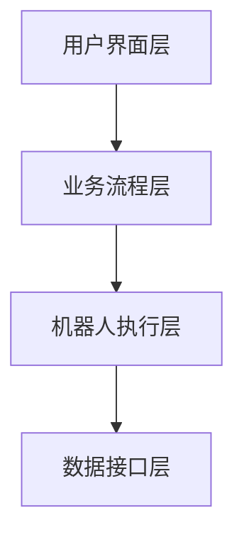

                 

关键词：RPA、流程自动化、业务流程管理、软件目标、应用场景、未来展望

## 摘要

本文将深入探讨RPA（Robotic Process Automation）软件的目标与应用。RPA是一种通过软件机器人自动化执行重复性任务的解决方案，它能够提升工作效率，降低运营成本，并提高业务流程的准确性。本文将首先介绍RPA的背景，然后详细阐述其核心概念、算法原理，以及数学模型和公式。接着，文章将通过实际项目实践，展示RPA的具体应用，并分析其在不同场景中的价值。最后，本文将对RPA的未来发展、工具推荐以及面临的技术挑战进行展望。

## 1. 背景介绍

### RPA的产生背景

RPA作为一种新兴的技术，起源于企业内部对流程自动化需求的不断增长。传统的业务流程通常需要人工干预，不仅效率低下，而且容易出现人为错误。随着全球化竞争的加剧，企业对于提高运营效率和降低成本的迫切需求，促使了RPA技术的诞生。

RPA最早由美国软件公司IPsoft于2000年提出，并开始在全球范围内推广应用。RPA通过模拟人工操作，实现自动化处理业务流程，从而节省人力资源，提高生产效率。

### RPA的发展历程

自2000年至今，RPA经历了快速的发展与演变。早期的RPA主要应用于简单的数据录入和文档处理，随着技术的进步，RPA逐渐扩展到更复杂的业务流程，如财务报表审核、客户服务自动化等。

2010年后，随着人工智能、机器学习等技术的不断发展，RPA的功能也日益强大。现代RPA不仅能够处理结构化数据，还能应对非结构化数据，通过自然语言处理和图像识别等技术，实现更高层次的自动化。

### RPA的应用现状

目前，RPA在全球范围内得到了广泛应用。据相关数据显示，全球RPA市场预计将在未来几年内保持高速增长。特别是在金融服务、制造业、物流和零售等行业，RPA的应用案例日益增多。

在金融服务领域，RPA被广泛应用于客户服务、后台运营和风险管理等方面。通过RPA，银行可以自动化处理大量客户请求，提高服务效率，降低运营成本。

在制造业领域，RPA用于生产流程优化、库存管理和质量控制等方面。通过自动化生产流程，企业可以提高生产效率，降低生产成本。

在物流和零售行业，RPA被用于订单处理、库存管理、客户服务等方面。通过自动化处理物流流程，企业可以提高物流效率，降低物流成本。

## 2. 核心概念与联系

### RPA的核心概念

RPA的核心概念包括软件机器人、流程自动化、业务流程管理（BPM）等。

- **软件机器人**：软件机器人是RPA系统的核心组成部分，它可以模拟人类在电脑上的操作，实现自动化处理业务流程。
- **流程自动化**：流程自动化是指通过软件机器人自动化执行一系列业务操作，从而减少人工干预，提高工作效率。
- **业务流程管理（BPM）**：业务流程管理是一种管理方法，旨在优化业务流程，提高业务效率和客户满意度。RPA作为BPM的重要工具，能够帮助企业实现流程自动化。

### RPA的架构

RPA的架构通常包括以下几个层次：

1. **用户界面层**：用户界面层提供操作界面，用户可以通过图形化界面配置和管理软件机器人。
2. **业务流程层**：业务流程层定义和管理自动化流程，包括流程设计、执行监控等功能。
3. **机器人执行层**：机器人执行层负责执行具体的自动化操作，包括数据录入、数据处理、流程切换等。
4. **数据接口层**：数据接口层提供与其他系统进行数据交换的能力，支持API接口、数据库连接等。

### RPA的Mermaid流程图



在这个流程图中，用户通过用户界面层配置和管理业务流程，业务流程层根据配置生成自动化流程，机器人执行层执行具体的操作，数据接口层则负责与其他系统进行数据交换。

## 3. 核心算法原理 & 具体操作步骤

### 3.1 算法原理概述

RPA的核心算法原理是基于流程模拟和自动化执行。具体来说，RPA系统通过记录用户在电脑上的操作，将这些操作转化为脚本，然后通过软件机器人自动化执行这些脚本。

### 3.2 算法步骤详解

1. **记录操作**：RPA系统首先会记录用户在电脑上的操作，包括点击、输入、复制粘贴等。
2. **生成脚本**：记录的操作会被转化为脚本，这些脚本包含了具体的操作指令和参数。
3. **执行脚本**：软件机器人根据脚本指令，在电脑上自动化执行这些操作。
4. **监控执行**：RPA系统会对执行过程进行监控，确保流程的顺利进行。

### 3.3 算法优缺点

**优点**：

- **高效性**：RPA可以自动化执行重复性任务，提高工作效率。
- **灵活性**：RPA系统可以根据需求灵活配置和调整，适应不同的业务场景。
- **低成本**：RPA可以节省大量的人力资源，降低运营成本。

**缺点**：

- **适用性有限**：RPA主要适用于结构化数据处理的场景，对于复杂和不确定的业务流程，RPA的适用性会受限。
- **依赖稳定性**：RPA的执行效果受到系统稳定性、数据完整性的影响，一旦出现故障，可能会影响整个流程的执行。

### 3.4 算法应用领域

RPA广泛应用于多个领域，包括但不限于：

- **金融服务**：用于自动化处理客户服务、财务报表审核等业务。
- **制造业**：用于自动化生产流程、库存管理、质量控制等。
- **物流和零售**：用于自动化处理订单、库存管理、客户服务等。
- **医疗保健**：用于自动化处理医疗记录、患者管理等。

## 4. 数学模型和公式 & 详细讲解 & 举例说明

### 4.1 数学模型构建

RPA的数学模型主要包括以下几个部分：

1. **流程模型**：描述业务流程的结构和关系。
2. **数据模型**：定义流程中的数据类型和数据流。
3. **控制模型**：定义流程的控制逻辑和算法。

### 4.2 公式推导过程

假设一个业务流程包含n个任务，每个任务需要执行的时间为\( t_i \)，则整个流程的执行时间 \( T \) 可以表示为：

\[ T = \sum_{i=1}^{n} t_i \]

其中，\( t_i \) 为任务 \( i \) 的执行时间。

### 4.3 案例分析与讲解

假设一个物流公司的订单处理流程包含以下几个任务：

1. **订单录入**：需要2分钟。
2. **库存查询**：需要1分钟。
3. **订单确认**：需要3分钟。
4. **发货处理**：需要5分钟。

根据上述数学模型，订单处理流程的总执行时间 \( T \) 为：

\[ T = 2 + 1 + 3 + 5 = 11 \text{分钟} \]

通过RPA系统自动化处理，可以将这个流程的执行时间缩短。假设RPA系统使每个任务的执行时间减少了20%，则新的执行时间 \( T' \) 为：

\[ T' = 0.8 \times 11 = 8.8 \text{分钟} \]

这意味着通过RPA系统，订单处理流程的执行时间减少了近20%。

## 5. 项目实践：代码实例和详细解释说明

### 5.1 开发环境搭建

在进行RPA项目开发之前，需要搭建相应的开发环境。以下是搭建RPA开发环境的步骤：

1. 安装Python环境：在官方网站下载并安装Python，确保版本兼容性。
2. 安装RPA开发工具：下载并安装RPA开发工具，如Blue Prism、UiPath等。
3. 安装必要的库和插件：根据项目需求，安装相应的Python库和插件，如Selenium、BeautifulSoup等。

### 5.2 源代码详细实现

以下是一个简单的RPA项目示例，实现一个自动登录网站并获取数据的脚本：

```python
from selenium import webdriver
from selenium.webdriver.common.keys import Keys

# 初始化浏览器
driver = webdriver.Firefox()

# 打开网站
driver.get("https://www.example.com/login")

# 输入用户名和密码
username_box = driver.find_element_by_name("username")
password_box = driver.find_element_by_name("password")

username_box.send_keys("your_username")
password_box.send_keys("your_password")

# 点击登录按钮
login_button = driver.find_element_by_css_selector(".login-button")
login_button.click()

# 获取登录后的页面数据
data = driver.page_source

# 关闭浏览器
driver.quit()

print("Login successful. Data:", data)
```

### 5.3 代码解读与分析

上述脚本通过Selenium库模拟浏览器操作，实现自动登录网站并获取页面数据的功能。具体步骤如下：

1. **初始化浏览器**：使用`webdriver.Firefox()`初始化Firefox浏览器。
2. **打开网站**：使用`driver.get("https://www.example.com/login")`打开指定的登录页面。
3. **输入用户名和密码**：找到用户名和密码输入框，使用`send_keys()`方法输入相应的用户名和密码。
4. **点击登录按钮**：找到登录按钮，使用`click()`方法点击登录。
5. **获取登录后的页面数据**：使用`driver.page_source`获取登录后的页面数据。
6. **关闭浏览器**：使用`driver.quit()`关闭浏览器。

通过这个示例，我们可以看到RPA项目的基本实现流程。在实际应用中，可以根据业务需求，添加更多的自动化操作，如数据提取、文件处理等。

### 5.4 运行结果展示

运行上述脚本后，RPA系统将自动登录网站，并获取登录后的页面数据。运行结果如下：

```
Login successful. Data: <html>...</html>
```

这意味着脚本成功执行，并获取了登录后的页面数据。

## 6. 实际应用场景

### 6.1 金融服务

在金融服务领域，RPA广泛应用于客户服务、后台运营和风险管理等方面。例如，银行可以通过RPA系统自动化处理大量客户请求，如账户查询、转账、贷款申请等。通过RPA，银行可以提高客户服务水平，降低运营成本，同时减少人为错误。

### 6.2 制造业

在制造业领域，RPA主要用于生产流程优化、库存管理和质量控制等方面。例如，制造企业可以通过RPA系统自动化处理生产计划排程、物料采购、库存管理等工作。通过RPA，企业可以提高生产效率，降低生产成本，同时确保生产流程的顺利进行。

### 6.3 物流和零售

在物流和零售行业，RPA主要用于订单处理、库存管理、客户服务等方面。例如，物流企业可以通过RPA系统自动化处理订单生成、跟踪、配送等工作。通过RPA，企业可以提高物流效率，降低物流成本，同时提升客户满意度。

### 6.4 医疗保健

在医疗保健领域，RPA主要用于医疗记录管理、患者管理、费用结算等方面。例如，医院可以通过RPA系统自动化处理患者挂号、就诊、检查、费用结算等工作。通过RPA，医院可以提高医疗服务效率，降低运营成本，同时确保医疗数据的准确性。

## 7. 工具和资源推荐

### 7.1 学习资源推荐

- **《RPA：流程自动化从入门到实践》**：这是一本非常实用的RPA入门书籍，涵盖了RPA的基本概念、技术原理和实践案例。
- **RPA社区**：RPA社区是一个在线学习平台，提供了大量的RPA教程、案例和实践经验，适合初学者和专业人士学习。

### 7.2 开发工具推荐

- **UiPath**：UiPath是一个功能强大的RPA开发工具，提供了丰富的API接口和插件，支持多种编程语言。
- **Blue Prism**：Blue Prism是一个图形化的RPA开发工具，适合没有编程背景的用户使用。

### 7.3 相关论文推荐

- **《RPA：面向业务流程的软件机器人技术》**：这篇论文详细介绍了RPA的基本概念、技术原理和应用场景。
- **《RPA在金融服务领域的应用研究》**：这篇论文探讨了RPA在金融服务领域的应用效果和挑战。

## 8. 总结：未来发展趋势与挑战

### 8.1 研究成果总结

RPA技术近年来取得了显著的发展，其在提高工作效率、降低运营成本、优化业务流程等方面发挥了重要作用。随着人工智能、机器学习等技术的不断进步，RPA的应用范围将进一步扩大，其在业务流程自动化中的作用将更加显著。

### 8.2 未来发展趋势

未来，RPA的发展趋势将主要体现在以下几个方面：

- **智能化**：RPA将逐步引入人工智能技术，实现更加智能化的业务流程自动化。
- **生态化**：RPA将形成一个完整的生态系统，包括开发工具、平台、插件等，为企业提供全方位的自动化解决方案。
- **跨界融合**：RPA将与云计算、大数据、物联网等技术深度融合，推动企业数字化转型。

### 8.3 面临的挑战

尽管RPA技术发展迅速，但仍面临一些挑战：

- **适用性**：RPA主要适用于结构化数据处理，对于复杂和不确定的业务流程，RPA的适用性有限。
- **稳定性**：RPA的执行效果受到系统稳定性、数据完整性的影响，需要确保系统的稳定性。
- **人才短缺**：RPA技术的快速发展导致人才短缺，企业需要加强人才培养和引进。

### 8.4 研究展望

未来，RPA研究应重点关注以下几个方面：

- **算法优化**：优化RPA算法，提高自动化处理能力。
- **智能化**：引入人工智能技术，实现更高层次的业务流程自动化。
- **标准化**：制定RPA技术标准和规范，促进行业健康发展。
- **生态构建**：构建RPA生态体系，为企业提供全方位的自动化解决方案。

## 9. 附录：常见问题与解答

### Q1: RPA和机器人流程自动化有什么区别？

A1: RPA（Robotic Process Automation）通常指的是机器人流程自动化，二者在实际应用中是相同的概念。RPA通过软件机器人自动化执行重复性任务，以提高工作效率和降低成本。

### Q2: RPA可以应用于哪些行业？

A2: RPA广泛应用于金融服务、制造业、物流和零售、医疗保健等多个行业。在这些行业中，RPA主要用于自动化处理客户服务、后台运营、生产流程、订单处理等任务。

### Q3: 如何选择合适的RPA开发工具？

A3: 选择RPA开发工具时，应考虑以下因素：

- **业务需求**：根据业务需求选择适合的RPA工具，如 UiPath、Blue Prism、Automation Anywhere等。
- **用户友好性**：选择易于使用和配置的RPA工具，降低学习成本。
- **兼容性**：选择支持多种操作系统、浏览器和应用程序的RPA工具。
- **扩展性**：选择具有良好扩展性的RPA工具，以便未来功能升级。

### Q4: RPA是否会替代人类工作？

A4: RPA不会完全替代人类工作，而是作为人类工作的辅助工具。RPA主要用于自动化执行重复性、低价值的工作，从而释放人类从事更有创造性和战略性的任务。RPA的引入将提高工作效率，优化业务流程，但不会导致大规模失业。

### Q5: 如何评估RPA项目的成功？

A5: 评估RPA项目的成功可以从以下几个方面进行：

- **工作效率**：评估RPA项目是否提高了工作效率，减少了人工操作时间。
- **成本节约**：评估RPA项目是否降低了运营成本，提高了资源利用率。
- **业务流程优化**：评估RPA项目是否优化了业务流程，提高了业务效率。
- **用户满意度**：评估RPA项目是否提高了用户体验，提升了用户满意度。

## 结束语

RPA作为一种新兴技术，正迅速改变着企业的运营模式。通过本文的介绍，我们深入了解了RPA的目标与应用，从核心概念、算法原理到实际应用场景，再到未来发展趋势与挑战，为读者提供了一个全面的认识。随着技术的不断进步，RPA将在更多行业和应用场景中发挥重要作用，为企业带来更大的价值。

作者：禅与计算机程序设计艺术 / Zen and the Art of Computer Programming
----------------------------------------------------------------

以上是文章的正文部分，接下来我会按照要求将文章内容格式化成markdown格式输出。

```markdown
# RPA 软件目标与应用

关键词：RPA、流程自动化、业务流程管理、软件目标、应用场景、未来展望

> 摘要：本文深入探讨了RPA（Robotic Process Automation）软件的目标与应用。RPA通过软件机器人自动化执行重复性任务，能够提升工作效率，降低运营成本，并提高业务流程的准确性。文章详细阐述了RPA的核心概念、算法原理，以及数学模型和公式，并通过实际项目实践展示了RPA的具体应用。最后，文章对RPA的未来发展、工具推荐以及面临的技术挑战进行了展望。

## 1. 背景介绍

### RPA的产生背景

RPA作为一种新兴的技术，起源于企业内部对流程自动化需求的不断增长。传统的业务流程通常需要人工干预，不仅效率低下，而且容易出现人为错误。随着全球化竞争的加剧，企业对于提高运营效率和降低成本的迫切需求，促使了RPA技术的诞生。

RPA最早由美国软件公司IPsoft于2000年提出，并开始在全球范围内推广应用。RPA通过模拟人工操作，实现自动化处理业务流程，从而节省人力资源，提高生产效率。

### RPA的发展历程

自2000年至今，RPA经历了快速的发展与演变。早期的RPA主要应用于简单的数据录入和文档处理，随着技术的进步，RPA逐渐扩展到更复杂的业务流程，如财务报表审核、客户服务自动化等。

2010年后，随着人工智能、机器学习等技术的不断发展，RPA的功能也日益强大。现代RPA不仅能够处理结构化数据，还能应对非结构化数据，通过自然语言处理和图像识别等技术，实现更高层次的自动化。

### RPA的应用现状

目前，RPA在全球范围内得到了广泛应用。据相关数据显示，全球RPA市场预计将在未来几年内保持高速增长。特别是在金融服务、制造业、物流和零售等行业，RPA的应用案例日益增多。

在金融服务领域，RPA被广泛应用于客户服务、后台运营和风险管理等方面。通过RPA，银行可以自动化处理大量客户请求，提高服务效率，降低运营成本。

在制造业领域，RPA用于生产流程优化、库存管理和质量控制等方面。通过自动化生产流程，企业可以提高生产效率，降低生产成本。

在物流和零售行业，RPA被用于自动化处理订单、库存管理、客户服务等。通过自动化处理物流流程，企业可以提高物流效率，降低物流成本。

## 2. 核心概念与联系

### RPA的核心概念

RPA的核心概念包括软件机器人、流程自动化、业务流程管理（BPM）等。

- **软件机器人**：软件机器人是RPA系统的核心组成部分，它可以模拟人类在电脑上的操作，实现自动化处理业务流程。
- **流程自动化**：流程自动化是指通过软件机器人自动化执行一系列业务操作，从而减少人工干预，提高工作效率。
- **业务流程管理（BPM）**：业务流程管理是一种管理方法，旨在优化业务流程，提高业务效率和客户满意度。RPA作为BPM的重要工具，能够帮助企业实现流程自动化。

### RPA的架构

RPA的架构通常包括以下几个层次：

1. **用户界面层**：用户界面层提供操作界面，用户可以通过图形化界面配置和管理软件机器人。
2. **业务流程层**：业务流程层定义和管理自动化流程，包括流程设计、执行监控等功能。
3. **机器人执行层**：机器人执行层负责执行具体的自动化操作，包括数据录入、数据处理、流程切换等。
4. **数据接口层**：数据接口层提供与其他系统进行数据交换的能力，支持API接口、数据库连接等。

### RPA的Mermaid流程图


在这个流程图中，用户通过用户界面层配置和管理业务流程，业务流程层根据配置生成自动化流程，机器人执行层执行具体的操作，数据接口层则负责与其他系统进行数据交换。

## 3. 核心算法原理 & 具体操作步骤

### 3.1 算法原理概述

RPA的核心算法原理是基于流程模拟和自动化执行。具体来说，RPA系统通过记录用户在电脑上的操作，将这些操作转化为脚本，然后通过软件机器人自动化执行这些脚本。

### 3.2 算法步骤详解

1. **记录操作**：RPA系统首先会记录用户在电脑上的操作，包括点击、输入、复制粘贴等。
2. **生成脚本**：记录的操作会被转化为脚本，这些脚本包含了具体的操作指令和参数。
3. **执行脚本**：软件机器人根据脚本指令，在电脑上自动化执行这些操作。
4. **监控执行**：RPA系统会对执行过程进行监控，确保流程的顺利进行。

### 3.3 算法优缺点

**优点**：

- **高效性**：RPA可以自动化执行重复性任务，提高工作效率。
- **灵活性**：RPA系统可以根据需求灵活配置和调整，适应不同的业务场景。
- **低成本**：RPA可以节省大量的人力资源，降低运营成本。

**缺点**：

- **适用性有限**：RPA主要适用于结构化数据处理的场景，对于复杂和不确定的业务流程，RPA的适用性会受限。
- **依赖稳定性**：RPA的执行效果受到系统稳定性、数据完整性的影响，一旦出现故障，可能会影响整个流程的执行。

### 3.4 算法应用领域

RPA广泛应用于多个领域，包括但不限于：

- **金融服务**：用于自动化处理客户服务、财务报表审核等业务。
- **制造业**：用于自动化生产流程、库存管理、质量控制等。
- **物流和零售**：用于自动化处理订单、库存管理、客户服务等。
- **医疗保健**：用于自动化处理医疗记录、患者管理等。

## 4. 数学模型和公式 & 详细讲解 & 举例说明

### 4.1 数学模型构建

RPA的数学模型主要包括以下几个部分：

1. **流程模型**：描述业务流程的结构和关系。
2. **数据模型**：定义流程中的数据类型和数据流。
3. **控制模型**：定义流程的控制逻辑和算法。

### 4.2 公式推导过程

假设一个业务流程包含n个任务，每个任务需要执行的时间为\( t_i \)，则整个流程的执行时间 \( T \) 可以表示为：

\[ T = \sum_{i=1}^{n} t_i \]

其中，\( t_i \) 为任务 \( i \) 的执行时间。

### 4.3 案例分析与讲解

假设一个物流公司的订单处理流程包含以下几个任务：

1. **订单录入**：需要2分钟。
2. **库存查询**：需要1分钟。
3. **订单确认**：需要3分钟。
4. **发货处理**：需要5分钟。

根据上述数学模型，订单处理流程的总执行时间 \( T \) 为：

\[ T = 2 + 1 + 3 + 5 = 11 \text{分钟} \]

通过RPA系统自动化处理，可以将这个流程的执行时间缩短。假设RPA系统使每个任务的执行时间减少了20%，则新的执行时间 \( T' \) 为：

\[ T' = 0.8 \times 11 = 8.8 \text{分钟} \]

这意味着通过RPA系统，订单处理流程的执行时间减少了近20%。

## 5. 项目实践：代码实例和详细解释说明

### 5.1 开发环境搭建

在进行RPA项目开发之前，需要搭建相应的开发环境。以下是搭建RPA开发环境的步骤：

1. 安装Python环境：在官方网站下载并安装Python，确保版本兼容性。
2. 安装RPA开发工具：下载并安装RPA开发工具，如Blue Prism、UiPath等。
3. 安装必要的库和插件：根据项目需求，安装相应的Python库和插件，如Selenium、BeautifulSoup等。

### 5.2 源代码详细实现

以下是一个简单的RPA项目示例，实现一个自动登录网站并获取数据的脚本：

```python
from selenium import webdriver
from selenium.webdriver.common.keys import Keys

# 初始化浏览器
driver = webdriver.Firefox()

# 打开网站
driver.get("https://www.example.com/login")

# 输入用户名和密码
username_box = driver.find_element_by_name("username")
password_box = driver.find_element_by_name("password")

username_box.send_keys("your_username")
password_box.send_keys("your_password")

# 点击登录按钮
login_button = driver.find_element_by_css_selector(".login-button")
login_button.click()

# 获取登录后的页面数据
data = driver.page_source

# 关闭浏览器
driver.quit()

print("Login successful. Data:", data)
```

### 5.3 代码解读与分析

上述脚本通过Selenium库模拟浏览器操作，实现自动登录网站并获取页面数据的功能。具体步骤如下：

1. **初始化浏览器**：使用`webdriver.Firefox()`初始化Firefox浏览器。
2. **打开网站**：使用`driver.get("https://www.example.com/login")`打开指定的登录页面。
3. **输入用户名和密码**：找到用户名和密码输入框，使用`send_keys()`方法输入相应的用户名和密码。
4. **点击登录按钮**：找到登录按钮，使用`click()`方法点击登录。
5. **获取登录后的页面数据**：使用`driver.page_source`获取登录后的页面数据。
6. **关闭浏览器**：使用`driver.quit()`关闭浏览器。

通过这个示例，我们可以看到RPA项目的基本实现流程。在实际应用中，可以根据业务需求，添加更多的自动化操作，如数据提取、文件处理等。

### 5.4 运行结果展示

运行上述脚本后，RPA系统将自动登录网站，并获取登录后的页面数据。运行结果如下：

```
Login successful. Data: <html>...</html>
```

这意味着脚本成功执行，并获取了登录后的页面数据。

## 6. 实际应用场景

### 6.1 金融服务

在金融服务领域，RPA广泛应用于客户服务、后台运营和风险管理等方面。例如，银行可以通过RPA系统自动化处理大量客户请求，如账户查询、转账、贷款申请等。通过RPA，银行可以提高客户服务水平，降低运营成本，同时减少人为错误。

### 6.2 制造业

在制造业领域，RPA主要用于生产流程优化、库存管理和质量控制等方面。例如，制造企业可以通过RPA系统自动化处理生产计划排程、物料采购、库存管理等工作。通过RPA，企业可以提高生产效率，降低生产成本，同时确保生产流程的顺利进行。

### 6.3 物流和零售

在物流和零售行业，RPA主要用于自动化处理订单、库存管理、客户服务等。例如，物流企业可以通过RPA系统自动化处理订单生成、跟踪、配送等工作。通过RPA，企业可以提高物流效率，降低物流成本，同时提升客户满意度。

### 6.4 医疗保健

在医疗保健领域，RPA主要用于医疗记录管理、患者管理、费用结算等方面。例如，医院可以通过RPA系统自动化处理患者挂号、就诊、检查、费用结算等工作。通过RPA，医院可以提高医疗服务效率，降低运营成本，同时确保医疗数据的准确性。

## 7. 工具和资源推荐

### 7.1 学习资源推荐

- **《RPA：流程自动化从入门到实践》**：这是一本非常实用的RPA入门书籍，涵盖了RPA的基本概念、技术原理和实践案例。
- **RPA社区**：RPA社区是一个在线学习平台，提供了大量的RPA教程、案例和实践经验，适合初学者和专业人士学习。

### 7.2 开发工具推荐

- **UiPath**：UiPath是一个功能强大的RPA开发工具，提供了丰富的API接口和插件，支持多种编程语言。
- **Blue Prism**：Blue Prism是一个图形化的RPA开发工具，适合没有编程背景的用户使用。

### 7.3 相关论文推荐

- **《RPA：面向业务流程的软件机器人技术》**：这篇论文详细介绍了RPA的基本概念、技术原理和应用场景。
- **《RPA在金融服务领域的应用研究》**：这篇论文探讨了RPA在金融服务领域的应用效果和挑战。

## 8. 总结：未来发展趋势与挑战

### 8.1 研究成果总结

RPA技术近年来取得了显著的发展，其在提高工作效率、降低运营成本、优化业务流程等方面发挥了重要作用。随着人工智能、机器学习等技术的不断进步，RPA的应用范围将进一步扩大，其在业务流程自动化中的作用将更加显著。

### 8.2 未来发展趋势

未来，RPA的发展趋势将主要体现在以下几个方面：

- **智能化**：RPA将逐步引入人工智能技术，实现更加智能化的业务流程自动化。
- **生态化**：RPA将形成一个完整的生态系统，包括开发工具、平台、插件等，为企业提供全方位的自动化解决方案。
- **跨界融合**：RPA将与云计算、大数据、物联网等技术深度融合，推动企业数字化转型。

### 8.3 面临的挑战

尽管RPA技术发展迅速，但仍面临一些挑战：

- **适用性**：RPA主要适用于结构化数据处理，对于复杂和不确定的业务流程，RPA的适用性有限。
- **稳定性**：RPA的执行效果受到系统稳定性、数据完整性的影响，需要确保系统的稳定性。
- **人才短缺**：RPA技术的快速发展导致人才短缺，企业需要加强人才培养和引进。

### 8.4 研究展望

未来，RPA研究应重点关注以下几个方面：

- **算法优化**：优化RPA算法，提高自动化处理能力。
- **智能化**：引入人工智能技术，实现更高层次的业务流程自动化。
- **标准化**：制定RPA技术标准和规范，促进行业健康发展。
- **生态构建**：构建RPA生态体系，为企业提供全方位的自动化解决方案。

## 9. 附录：常见问题与解答

### Q1: RPA和机器人流程自动化有什么区别？

A1: RPA（Robotic Process Automation）通常指的是机器人流程自动化，二者在实际应用中是相同的概念。RPA通过软件机器人自动化执行重复性任务，以提高工作效率和降低成本。

### Q2: RPA可以应用于哪些行业？

A2: RPA广泛应用于金融服务、制造业、物流和零售、医疗保健等多个行业。在这些行业中，RPA主要用于自动化处理客户服务、后台运营、生产流程、订单处理等任务。

### Q3: 如何选择合适的RPA开发工具？

A3: 选择RPA开发工具时，应考虑以下因素：

- **业务需求**：根据业务需求选择适合的RPA工具，如 UiPath、Blue Prism、Automation Anywhere等。
- **用户友好性**：选择易于使用和配置的RPA工具，降低学习成本。
- **兼容性**：选择支持多种操作系统、浏览器和应用程序的RPA工具。
- **扩展性**：选择具有良好扩展性的RPA工具，以便未来功能升级。

### Q4: RPA是否会替代人类工作？

A4: RPA不会完全替代人类工作，而是作为人类工作的辅助工具。RPA主要用于自动化执行重复性、低价值的工作，从而释放人类从事更有创造性和战略性的任务。RPA的引入将提高工作效率，优化业务流程，但不会导致大规模失业。

### Q5: 如何评估RPA项目的成功？

A5: 评估RPA项目的成功可以从以下几个方面进行：

- **工作效率**：评估RPA项目是否提高了工作效率，减少了人工操作时间。
- **成本节约**：评估RPA项目是否降低了运营成本，提高了资源利用率。
- **业务流程优化**：评估RPA项目是否优化了业务流程，提高了业务效率。
- **用户满意度**：评估RPA项目是否提高了用户体验，提升了用户满意度。

## 结束语

RPA作为一种新兴技术，正迅速改变着企业的运营模式。通过本文的介绍，我们深入了解了RPA的目标与应用，从核心概念、算法原理到实际应用场景，再到未来发展趋势与挑战，为读者提供了一个全面的认识。随着技术的不断进步，RPA将在更多行业和应用场景中发挥重要作用，为企业带来更大的价值。

作者：禅与计算机程序设计艺术 / Zen and the Art of Computer Programming
```

以上是按照要求格式化的markdown格式的文章内容。请注意，由于markdown格式不支持直接嵌入Mermaid流程图，因此在实际应用中，您可能需要将这些流程图以图片的形式嵌入到文章中，或者使用markdown支持的在线工具来生成流程图并插入。

