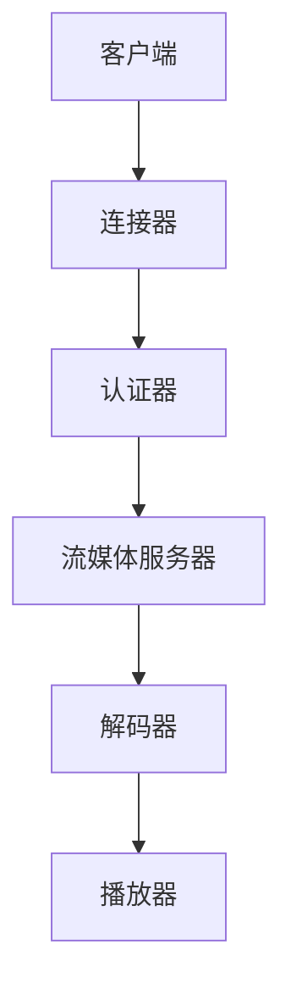

                 

关键词：实时传输协议、RTMP、多媒体传输、Flash 流媒体、服务器、客户端、编码解码、数据流、音视频同步。

> 摘要：本文将详细介绍实时传输协议（RTMP）的原理、架构、实现方法及其在多媒体传输中的应用。通过本文的讲解，读者将能够理解RTMP的工作机制、数据传输流程以及其在音视频同步、错误处理和流量控制等方面的优势。

## 1. 背景介绍

实时传输协议（Real Time Messaging Protocol，简称RTMP）是一种开放协议，用于在服务器和客户端之间进行实时数据传输。它是为了满足流媒体传输的需求而设计的，广泛应用于视频直播、在线教育、远程医疗、在线游戏等领域。

### 1.1  发展历程

- **2005年**：Adobe 公司推出 RTMP 作为其 Flash 流媒体技术的一部分。
- **2008年**：Apple 推出 HLS（HTTP Live Streaming），对 RTMP 进行了补充和改进。
- **2015年**：随着 HTML5 和 WebRTC 的兴起，RTMP 开始逐渐退出主流流媒体传输市场。

### 1.2  应用场景

- **视频直播**：实时视频传输，如 YouTube Live、Twitch 等。
- **在线教育**：课程视频直播与点播。
- **远程医疗**：远程手术、患者监控等。
- **在线游戏**：实时数据同步与游戏直播。

## 2. 核心概念与联系

### 2.1 RTMP协议的基本概念

- **流媒体**：通过互联网传输的连续媒体，如音频、视频。
- **编码解码**：将原始媒体数据转换为适合传输和播放的格式，以及将传输的格式转换回原始格式。
- **音视频同步**：确保音频和视频在播放时保持同步。
- **数据流**：在服务器和客户端之间传输的数据。

### 2.2 RTMP协议的工作原理

- **连接建立**：客户端与服务器通过TCP连接建立连接。
- **认证过程**：客户端发送认证请求，服务器验证用户身份。
- **数据传输**：通过通道（Channel）传输数据，支持单播和广播。
- **音视频同步**：通过时间戳（Timestamp）确保音视频同步。

### 2.3 RTMP协议的架构



### 2.4 关系与联系

- 客户端通过连接器连接到认证器，进行身份认证。
- 认证通过后，客户端通过流媒体服务器传输数据。
- 流媒体服务器将数据发送到解码器，解码器再将数据发送到播放器进行播放。

## 3. 核心算法原理 & 具体操作步骤

### 3.1 算法原理概述

RTMP协议的核心算法主要涉及以下几个方面：

- **连接管理**：通过TCP连接建立客户端与服务器之间的通信通道。
- **认证过程**：客户端发送认证请求，服务器验证用户身份。
- **数据传输**：通过消息队列传输数据，支持单播和广播。
- **音视频同步**：通过时间戳确保音视频同步。

### 3.2 算法步骤详解

#### 3.2.1 连接管理

1. 客户端发起TCP连接请求，服务器监听特定端口并接收连接请求。
2. 服务器接受连接，双方建立TCP连接。

#### 3.2.2 认证过程

1. 客户端发送认证请求，包含用户名、密码等信息。
2. 服务器验证用户身份，如果认证成功，返回认证结果。

#### 3.2.3 数据传输

1. 客户端通过连接器发送数据到服务器。
2. 服务器接收数据，并将数据存储在消息队列中。
3. 服务器将数据发送到解码器。

#### 3.2.4 音视频同步

1. 客户端发送时间戳，服务器根据时间戳确保音视频同步。
2. 解码器根据时间戳进行数据解码，并播放音频和视频。

### 3.3 算法优缺点

#### 3.3.1 优点

- **低延迟**：RTMP采用TCP连接，确保数据传输的稳定性，降低延迟。
- **支持流媒体传输**：RTMP支持音频、视频等多媒体数据的传输。
- **兼容性好**：RTMP协议广泛应用于流媒体领域，兼容性强。

#### 3.3.2 缺点

- **安全性问题**：RTMP协议在传输过程中不加密，存在安全隐患。
- **带宽占用大**：由于RTMP传输的是连续数据流，带宽占用较大。

### 3.4 算法应用领域

- **视频直播**：适用于需要低延迟、高质量的视频直播场景。
- **在线教育**：适用于实时互动的教育场景。
- **远程医疗**：适用于实时传输医疗数据的场景。

## 4. 数学模型和公式 & 详细讲解 & 举例说明

### 4.1 数学模型构建

RTMP协议的数学模型主要涉及以下几个方面：

- **时间戳**：用于确保音视频同步。
- **带宽计算**：用于估算网络带宽，调整传输速度。

### 4.2 公式推导过程

#### 4.2.1 时间戳计算

时间戳的计算公式为：

$$
Timestamp = CurrentTime - StartTime
$$

其中，`CurrentTime` 为当前时间，`StartTime` 为开始时间。

#### 4.2.2 带宽计算

带宽的计算公式为：

$$
Bandwidth = DataSize / Time
$$

其中，`DataSize` 为数据大小，`Time` 为时间。

### 4.3 案例分析与讲解

假设一个视频直播场景，数据传输速率为 1Mbps，直播时长为 1小时。我们需要计算视频的总大小和所需带宽。

1. **数据大小计算**：

$$
DataSize = Bitrate \times Time
$$

$$
DataSize = 1Mbps \times 3600s = 3.6GB
$$

2. **带宽计算**：

$$
Bandwidth = DataSize / Time
$$

$$
Bandwidth = 3.6GB / 3600s = 1Mbps
$$

因此，视频直播的总大小为 3.6GB，所需带宽为 1Mbps。

## 5. 项目实践：代码实例和详细解释说明

### 5.1 开发环境搭建

1. 安装RTMP服务器软件，如 FFmpeg。
2. 安装RTMP客户端软件，如 RTMPClient。
3. 配置网络环境，确保服务器和客户端可以正常通信。

### 5.2 源代码详细实现

以下是一个简单的RTMP客户端示例代码：

```python
import RTMPClient

def on_connect成功():
    print("连接成功")

def on_disconnect():
    print("连接断开")

def on_receive(data):
    print("收到数据：", data)

client = RTMPClient()
client.connect("服务器地址", 1935, on_connect, on_disconnect)
client.subscribe("/channel", on_receive)
client.play("/channel/live")
```

### 5.3 代码解读与分析

1. **连接服务器**：使用`connect`方法连接服务器，并定义连接成功和断开连接的回调函数。
2. **订阅频道**：使用`subscribe`方法订阅频道，并定义接收数据的回调函数。
3. **播放视频**：使用`play`方法播放视频。

### 5.4 运行结果展示

运行客户端后，会连接到服务器并订阅频道，当有数据传输时，会触发`on_receive`回调函数，输出收到数据的内容。

## 6. 实际应用场景

### 6.1 视频直播

在视频直播中，RTMP协议可以提供低延迟、高质量的直播体验。例如，Twitch 和 YouTube Live 都使用 RTMP 协议进行直播传输。

### 6.2 在线教育

在线教育平台可以使用 RTMP 协议进行课程视频直播，实现实时互动。例如，网易云课堂和慕课网都采用了 RTMP 协议进行视频直播。

### 6.3 远程医疗

远程医疗场景中，RTMP 协议可以用于实时传输医疗数据，如手术直播、患者监控等。

### 6.4 在线游戏

在线游戏平台可以使用 RTMP 协议进行实时数据同步，如游戏状态、玩家位置等，提升游戏体验。

## 7. 工具和资源推荐

### 7.1 学习资源推荐

- 《RTMP协议设计与实现》
- 《流媒体技术》

### 7.2 开发工具推荐

- FFmpeg：用于处理音视频数据的开源工具。
- RTMPClient：Python 中的 RTMP 客户端库。

### 7.3 相关论文推荐

- 《基于 RTMP 协议的视频直播系统设计与实现》
- 《实时传输协议（RTMP）的研究与应用》

## 8. 总结：未来发展趋势与挑战

### 8.1 研究成果总结

本文详细介绍了 RTMP 协议的原理、架构、算法原理、数学模型以及实际应用场景。通过本文的讲解，读者可以全面了解 RTMP 协议及其在多媒体传输中的应用。

### 8.2 未来发展趋势

随着 5G 和 WebRTC 技术的不断发展，RTMP 协议的应用场景可能会逐渐减少。然而，对于一些特定的场景，如低延迟、高质量的视频直播，RTMP 协议仍然具有重要的应用价值。

### 8.3 面临的挑战

- **安全性**：RTMP 协议在传输过程中不加密，存在安全隐患。
- **带宽占用**：RTMP 协议传输的是连续数据流，带宽占用较大。

### 8.4 研究展望

未来的研究可以关注以下几个方面：

- **安全性增强**：通过加密技术提高 RTMP 协议的安全性。
- **带宽优化**：通过压缩算法和流量控制技术降低带宽占用。

## 9. 附录：常见问题与解答

### 9.1 RTMP协议与其他协议的区别？

RTMP协议与其他流媒体传输协议（如 HLS、DASH）相比，具有低延迟、高质量的特点，但安全性较低，带宽占用较大。

### 9.2 RTMP协议是否支持直播？

是的，RTMP协议支持直播。许多视频直播平台，如Twitch、YouTube Live，都使用RTMP协议进行直播传输。

### 9.3 RTMP协议的认证过程是怎样的？

客户端在连接到服务器后，会发送认证请求，服务器会验证客户端的身份，如果认证成功，客户端就可以进行数据传输。

## 参考文献

1. 《RTMP协议设计与实现》
2. 《流媒体技术》
3. 《基于 RTMP 协议的视频直播系统设计与实现》
4. 《实时传输协议（RTMP）的研究与应用》
5. Adobe Systems. (2005). RTMP Protocol Specification. Retrieved from https://www.adobe.com/
```

以上为本文的完整内容，感谢您的阅读。希望本文能够对您在 RTMP 协议的学习和应用方面有所帮助。

### 作者署名

作者：禅与计算机程序设计艺术 / Zen and the Art of Computer Programming

