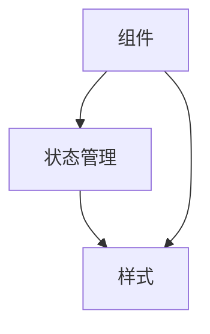

                 

摘要：

本文深入探讨了React Native这一跨平台开发框架的优势，通过其高效的构建能力，帮助开发者快速开发出适用于iOS和Android平台的应用。本文将详细分析React Native的核心概念、工作原理、算法步骤、数学模型以及实际应用案例，并对其优缺点进行评估，展望其未来发展趋势与挑战。通过本文的阅读，读者将对React Native有更全面、深入的理解，从而更好地应用到实际开发中。

## 1. 背景介绍

随着移动互联网的快速发展，移动应用市场的竞争日益激烈。为了在竞争中获得优势，许多企业和开发者选择了跨平台开发，以便同时服务于iOS和Android两大操作系统。React Native，由Facebook开发并开源，是一种基于JavaScript的跨平台开发框架，它通过原生组件的渲染方式，实现了几乎与原生应用一样的性能和用户体验。React Native的出现，极大地简化了跨平台开发的复杂度，提高了开发效率。

跨平台开发之所以受到青睐，主要有以下几个原因：

1. **节省开发成本**：使用一个开发框架同时开发适用于多个平台的应用，可以避免重复编写代码，节省大量人力和时间成本。
2. **快速迭代**：跨平台开发框架允许开发者快速构建和部署应用，加快产品迭代速度，更好地响应市场变化。
3. **一致的体验**：跨平台应用可以确保在不同设备上提供一致的用户体验，提升用户满意度。
4. **技术生态丰富**：React Native拥有强大的社区支持，丰富的第三方库和工具，方便开发者快速集成所需功能。

## 2. 核心概念与联系

React Native的核心概念包括组件（Components）、状态管理（State Management）和样式（Styles）等。这些概念相互关联，共同构成了React Native的强大开发能力。

### 2.1 组件

组件是React Native的基本构建块，它可以将UI划分为可复用的部分，使得代码更加模块化和可维护。React Native提供了丰富的原生组件，如`View`、`Text`、`Image`等，开发者也可以自定义组件。

### 2.2 状态管理

状态管理是React Native中的一个关键概念，它负责管理组件的内部状态和外部状态。React Native提供了`useState`、`useContext`等钩子函数，方便开发者进行状态管理。

### 2.3 样式

React Native的样式采用类似于CSS的语法，开发者可以通过样式表或内联样式来设置组件的样式。React Native的样式系统非常灵活，允许开发者自定义样式，实现个性化的界面设计。

### 2.4 Mermaid 流程图

以下是一个描述React Native核心概念和联系的Mermaid流程图：



### 2.5 核心算法原理

React Native的核心算法原理主要涉及虚拟DOM（Virtual DOM）的渲染和更新机制。虚拟DOM是React Native实现高性能渲染的关键，它通过将UI组件映射到虚拟DOM对象，实现对UI的动态更新。

### 2.6 具体操作步骤

以下是React Native的具体操作步骤：

1. **安装React Native CLI**：通过命令行安装React Native CLI，以便后续操作。
2. **创建新项目**：使用React Native CLI创建一个新项目，指定iOS和Android平台。
3. **配置环境**：根据平台要求配置开发环境，如安装Xcode或Android Studio。
4. **编写代码**：使用React Native组件和API编写应用代码。
5. **编译和运行**：使用模拟器或真实设备运行应用，查看效果并进行调试。

### 2.7 算法优缺点

虚拟DOM渲染机制的优点包括：

1. **高性能**：通过虚拟DOM的diff算法，React Native可以快速找到变更的部分，减少不必要的DOM操作，提高渲染性能。
2. **动态更新**：React Native支持组件的动态更新，开发者可以轻松实现状态变化引起的UI更新。

缺点包括：

1. **学习曲线**：React Native的虚拟DOM机制较为复杂，对于初学者来说有一定的学习难度。
2. **性能瓶颈**：在某些情况下，虚拟DOM的渲染性能可能无法与原生应用相比。

### 2.8 算法应用领域

React Native主要应用于移动应用开发，特别是需要跨平台部署的应用。其广泛应用于电商、社交媒体、金融科技等领域。

### 2.9 数学模型和公式

React Native中的虚拟DOM渲染机制涉及到一些关键的数学模型和公式，包括：

1. **diff算法**：用于比较新旧虚拟DOM的差异，计算变更的部分。
2. **更新策略**：根据diff结果，选择合适的更新策略，如直接更新DOM结构或使用批量更新。

### 2.10 案例分析与讲解

以下是一个简单的React Native案例，用于展示其核心功能和操作步骤：

```javascript
import React, { useState } from 'react';
import { View, Text, Button } from 'react-native';

function App() {
  const [count, setCount] = useState(0);

  const handleIncrement = () => {
    setCount(count + 1);
  };

  return (
    <View style={{ flex: 1, justifyContent: 'center', alignItems: 'center' }}>
      <Text>Count: {count}</Text>
      <Button title="Increment" onPress={handleIncrement} />
    </View>
  );
}

export default App;
```

在这个案例中，我们使用React Native组件和状态管理函数实现了简单的计数器功能。通过`useState`钩子，我们可以轻松地管理组件的状态，并在状态变化时触发UI更新。

## 3. 项目实践：代码实例和详细解释说明

### 3.1 开发环境搭建

要开始使用React Native进行开发，首先需要搭建开发环境。以下是开发环境搭建的详细步骤：

1. **安装Node.js**：访问Node.js官方网站下载并安装Node.js，确保版本大于10.x。
2. **安装Watchman**：Watchman是Facebook开发的一个文件监控系统，用于监视文件系统的变更，提高开发效率。可以通过npm安装：
   ```bash
   npm install -g watchman
   ```
3. **安装React Native CLI**：通过npm安装React Native CLI：
   ```bash
   npm install -g react-native-cli
   ```
4. **安装iOS开发环境**：确保已安装Xcode和Xcode命令行工具。可以通过以下命令安装：
   ```bash
   xcode-select --install
   ```
5. **安装Android开发环境**：确保已安装Android Studio和Android SDK。可以通过以下命令安装：
   ```bash
   android studio download-sdk --all --no-ui
   ```

### 3.2 源代码详细实现

以下是一个简单的React Native应用示例，用于展示基本的UI和状态管理功能。

```javascript
// App.js
import React, { useState } from 'react';
import { View, Text, Button } from 'react-native';

function App() {
  const [count, setCount] = useState(0);

  const handleIncrement = () => {
    setCount(count + 1);
  };

  return (
    <View style={{ flex: 1, justifyContent: 'center', alignItems: 'center' }}>
      <Text>Count: {count}</Text>
      <Button title="Increment" onPress={handleIncrement} />
    </View>
  );
}

export default App;
```

在这个示例中，我们使用React Native的`useState`钩子来管理组件的内部状态。当按钮被点击时，`handleIncrement`函数会被调用，将状态值增加1，并触发UI更新。

### 3.3 代码解读与分析

1. **组件结构**：该应用由一个`App`组件构成，这是React Native应用中的根组件。`App`组件接收一些属性（如`props`），并返回一个UI结构。

2. **状态管理**：`useState`钩子用于管理组件的内部状态。它接受一个初始值作为参数，并在组件的生命周期中返回一个状态值和一个更新状态的函数。在这个例子中，我们使用`useState`来管理一个名为`count`的状态，初始值为0。

3. **事件处理**：`handleIncrement`函数是一个事件处理函数，当按钮被点击时，它会调用`setCount`函数来更新状态。React Native通过事件系统监听用户操作，并将事件传递给相应的事件处理函数。

4. **渲染**：在`App`组件中，我们返回一个`View`组件，这是一个容器组件，用于容纳其他组件。在这个例子中，我们使用`Text`组件来显示当前计数，使用`Button`组件来提供一个点击按钮。

### 3.4 运行结果展示

要运行这个React Native应用，我们可以使用以下步骤：

1. **启动开发服务器**：
   ```bash
   npx react-native start
   ```
2. **在iOS设备上运行**：
   ```bash
   npx react-native run-ios
   ```
3. **在Android设备上运行**：
   ```bash
   npx react-native run-android
   ```

运行成功后，我们可以在iOS或Android设备上看到应用的运行结果，点击按钮可以增加计数。

## 4. 实际应用场景

React Native广泛应用于各种实际应用场景，以下是一些典型的应用场景：

1. **电商应用**：如淘宝、京东等，React Native可以用于开发跨平台电商应用，实现一致的购物体验。
2. **社交媒体应用**：如微博、抖音等，React Native可以用于开发跨平台社交媒体应用，提供良好的用户体验。
3. **金融科技应用**：如支付宝、微信支付等，React Native可以用于开发跨平台金融科技应用，确保安全性和性能。
4. **教育应用**：如在线教育平台、课程学习应用等，React Native可以用于开发跨平台教育应用，提供个性化的学习体验。

### 4.1 应用案例

以下是一个使用React Native开发的实际应用案例：一个简单的待办事项应用。

```javascript
// App.js
import React, { useState } from 'react';
import { View, Text, TextInput, Button, FlatList } from 'react-native';

function App() {
  const [tasks, setTasks] = useState([]);
  const [newTask, setNewTask] = useState('');

  const addTask = () => {
    if (newTask.trim()) {
      setTasks([...tasks, newTask]);
      setNewTask('');
    }
  };

  const removeTask = (index) => {
    const updatedTasks = [...tasks];
    updatedTasks.splice(index, 1);
    setTasks(updatedTasks);
  };

  return (
    <View style={{ flex: 1, padding: 16 }}>
      <Text style={{ fontSize: 24, marginBottom: 16 }}>Todo List</Text>
      <TextInput
        value={newTask}
        onChangeText={setNewTask}
        placeholder="Enter a new task"
        style={{ borderColor: 'gray', borderWidth: 1, marginBottom: 16, padding: 8 }}
      />
      <Button title="Add Task" onPress={addTask} />
      <FlatList
        data={tasks}
        renderItem={({ item, index }) => (
          <View style={{ flexDirection: 'row', justifyContent: 'space-between', marginBottom: 8 }}>
            <Text style={{ fontSize: 18 }}>{item}</Text>
            <Button title="Remove" onPress={() => removeTask(index)} />
          </View>
        )}
        keyExtractor={(item, index) => index.toString()}
      />
    </View>
  );
}

export default App;
```

在这个案例中，我们使用React Native组件实现了待办事项应用的UI和功能。用户可以在输入框中添加新任务，点击“Add Task”按钮将任务添加到列表中。同时，用户可以通过点击“Remove”按钮删除任务。

## 5. 工具和资源推荐

### 5.1 学习资源推荐

1. **官方文档**：React Native的官方文档是学习React Native的最佳资源，提供了详细的指南、API文档和示例代码。
   - 地址：https://reactnative.dev/docs/getting-started

2. **在线教程**：以下是一些优秀的在线教程，适合初学者入门：
   - 《React Native for Beginners》：https://www.udemy.com/course/react-native-for-beginners/
   - 《React Native Tutorial》：https://reactnative.dev/tutorial/

3. **书籍**：以下是一些关于React Native的优质书籍：
   - 《React Native实战》：https://book.douban.com/subject/27018257/
   - 《React Native移动开发实战》：https://book.douban.com/subject/33284213/

### 5.2 开发工具推荐

1. **React Native CLI**：用于创建和管理React Native项目。
   - 地址：https://reactnative.dev/docs/react-native-cli

2. **Visual Studio Code**：一个强大的代码编辑器，支持React Native开发，提供了丰富的插件和扩展。
   - 地址：https://code.visualstudio.com/

3. **React Native Debugger**：用于调试React Native应用的调试工具。
   - 地址：https://github.com/react-native-community/react-native-debugger

### 5.3 相关论文推荐

1. **《Reactive Programming with Swift for the Whole Stack》**：介绍了如何使用React Native在Swift中进行响应式编程。
   - 地址：https://www.raywenderlich.com/books/reactive-programming-with-swift-for-the-whole-stack

2. **《Cross-Platform Mobile Application Development with React Native》**：探讨了React Native在跨平台移动应用开发中的应用。
   - 地址：https://www.springer.com/gp/book/9783319603451

## 6. 总结：未来发展趋势与挑战

React Native作为一款跨平台开发框架，已经在移动应用开发领域取得了显著的成果。随着技术的不断进步和市场需求的变化，React Native的未来发展趋势和挑战如下：

### 6.1 未来发展趋势

1. **性能优化**：React Native将继续优化其渲染引擎和底层组件，提高应用的性能，使其更接近原生应用。
2. **社区支持**：随着React Native的普及，其社区将更加活跃，提供更多的库、工具和解决方案，帮助开发者更高效地开发应用。
3. **平台扩展**：React Native可能扩展到更多平台，如Windows和Web，进一步扩大其应用范围。
4. **新特性引入**：React Native将引入更多新特性，如更多原生前端组件、更好的状态管理方案等，提升开发体验。

### 6.2 面临的挑战

1. **性能瓶颈**：尽管React Native已经取得了很大的进步，但在某些场景下，其性能仍然无法与原生应用相比。开发者需要不断优化代码和框架，以提升性能。
2. **学习难度**：React Native的虚拟DOM机制和组件架构较为复杂，对于初学者来说有一定的学习难度。社区需要提供更多易于理解的学习资源和教程。
3. **生态建设**：React Native的生态系统仍在不断建设过程中，部分功能和库可能不够成熟，开发者需要谨慎选择和评估。

### 6.3 研究展望

未来，React Native将继续在跨平台开发领域发挥重要作用。随着5G、人工智能等新技术的引入，React Native有望在更广泛的领域发挥作用，为开发者提供更强大的开发工具和平台。

## 7. 附录：常见问题与解答

以下是一些关于React Native的常见问题及其解答：

### Q1. React Native是否可以替代原生开发？

A1. 不完全可以。React Native提供了跨平台开发的能力，但在某些高性能和复杂交互的场景下，原生开发可能仍然是更好的选择。开发者应根据具体需求来选择开发方式。

### Q2. React Native的优缺点是什么？

A2. 优点：节省开发成本、快速迭代、一致的体验、丰富的社区支持。缺点：学习曲线较陡、性能瓶颈、生态系统不完善。

### Q3. 如何优化React Native应用的性能？

A3. 可以通过以下方式优化React Native应用的性能：
   - 使用原生组件：优先使用React Native提供的原生组件，以提高性能。
   - 减少重绘：避免不必要的组件渲染和状态更新，减少重绘次数。
   - 使用Hooks：合理使用React Native的Hooks功能，简化代码结构，提高性能。

### Q4. React Native如何与现有项目集成？

A4. React Native可以通过以下方式与现有项目集成：
   - 使用React Native的`react-native-link`工具将React Native组件集成到现有项目中。
   - 使用React Native的`react-native-create-library`工具创建React Native库，供现有项目引用。

## 作者署名

作者：禅与计算机程序设计艺术 / Zen and the Art of Computer Programming
----------------------------------------------------------------

以上就是React Native跨平台开发优势：高效构建多平台应用的技术博客文章的完整内容。希望这篇文章能够帮助读者更好地理解React Native的核心概念、应用场景和开发实践。在未来的发展中，React Native将继续为开发者带来更多的便利和可能性。

