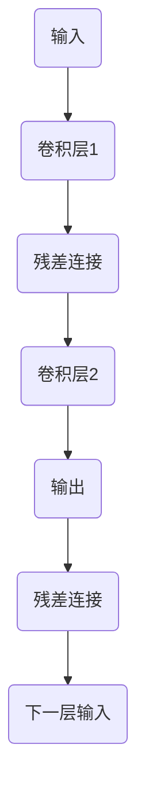

                 

关键词：深度学习，残差网络，神经网络，卷积神经网络，ResNet，图像分类，算法原理，代码实例，编程实践

> 摘要：本文深入解析了残差网络（ResNet）的原理与实现，从背景介绍、核心概念、算法原理、数学模型、项目实践等多个角度展开，通过具体代码实例，帮助读者理解并掌握ResNet在实际开发中的应用。

## 1. 背景介绍

深度学习（Deep Learning）是机器学习（Machine Learning）的一个子领域，主要研究如何利用神经网络进行数据的自动特征学习和模式识别。近年来，随着计算能力的提升和大数据技术的发展，深度学习在图像识别、自然语言处理、语音识别等领域取得了显著的成果。然而，传统的深度神经网络在训练深层网络时面临着梯度消失和梯度爆炸的问题，难以实现有效的模型训练。

为了解决这一问题，残差网络（Residual Network，ResNet）应运而生。ResNet由微软研究院的何凯明（Kaiming He）等人于2015年提出，通过引入残差连接，使得网络能够训练更深层的模型。ResNet在ImageNet图像识别竞赛中取得了当时的最优成绩，为深度学习的发展开辟了新的道路。

## 2. 核心概念与联系

### 2.1 残差网络的基本结构

残差网络的核心思想是通过添加残差块（Residual Block）来缓解梯度消失和梯度爆炸问题。残差块包含两个主要的组成部分：卷积层和残差连接。

- **卷积层**：用于提取图像的特征。
- **残差连接**：将输入直接传递到下一层，并与下一层的输出相加，形成残差块。

残差块的示意图如下：



### 2.2 残差块的实现

残差块的实现分为两种情况：一种是恒等映射，另一种是非线性映射。

1. **恒等映射**

   当输入和输出的维度相同时，残差连接就是恒等映射，即直接将输入传递到下一层。

   ```python
   class ResidualBlock(nn.Module):
       def __init__(self, in_channels, out_channels):
           super(ResidualBlock, self).__init__()
           self.conv1 = nn.Conv2d(in_channels, out_channels, kernel_size=3, stride=1, padding=1)
           self.relu = nn.ReLU(inplace=True)
       
       def forward(self, x):
           return self.relu(self.conv1(x)) + x
   ```

2. **非线性映射**

   当输入和输出的维度不同时，残差连接就是一个非线性映射，通常包含两个卷积层。

   ```python
   class ResidualBlock(nn.Module):
       def __init__(self, in_channels, out_channels, stride=1):
           super(ResidualBlock, self).__init__()
           self.conv1 = nn.Conv2d(in_channels, out_channels, kernel_size=3, stride=stride, padding=1)
           self.relu = nn.ReLU(inplace=True)
           self.conv2 = nn.Conv2d(out_channels, out_channels, kernel_size=3, stride=1, padding=1)
       
       def forward(self, x):
           return self.relu(self.conv1(x)) + self.conv2(x)
   ```

## 3. 核心算法原理 & 具体操作步骤

### 3.1 算法原理概述

ResNet通过引入残差块，将网络中的梯度传递路径变得更短，从而有效缓解了梯度消失和梯度爆炸问题。具体来说，残差块中的残差连接使得输入直接传递到下一层，避免了过多的参数传递，从而降低了梯度消失的风险。

### 3.2 算法步骤详解

1. **网络初始化**：定义网络的输入层、卷积层、残差块和全连接层。
2. **前向传播**：通过前向传播计算网络的输出。
3. **反向传播**：通过反向传播更新网络的参数。
4. **优化**：使用梯度下降等优化算法优化网络参数。

### 3.3 算法优缺点

**优点**：

- 残差网络能够训练更深层的模型，提高模型的性能。
- 残差连接有效缓解了梯度消失和梯度爆炸问题。

**缺点**：

- 残差网络参数较多，计算复杂度较高。
- 残差网络的训练速度较慢。

### 3.4 算法应用领域

ResNet在图像识别、目标检测、视频分析等多个领域都有广泛的应用。特别是在图像识别领域，ResNet取得了显著的成果，是当前主流的深度学习模型之一。

## 4. 数学模型和公式 & 详细讲解 & 举例说明

### 4.1 数学模型构建

残差网络的数学模型主要涉及卷积层、激活函数和残差连接。

1. **卷积层**：假设输入特征图的大小为\(X \in \mathbb{R}^{H \times W \times C}\)，卷积层可以表示为：

   $$X' = \sigma(WX + b)$$

   其中，\(W\)是卷积核，\(b\)是偏置，\(\sigma\)是激活函数。

2. **激活函数**：常用的激活函数有ReLU、Sigmoid、Tanh等。

3. **残差连接**：假设输入特征图为\(X\)，输出特征图为\(Y\)，残差连接可以表示为：

   $$Y = \sigma(WY + b) + X$$

### 4.2 公式推导过程

以恒等映射的残差块为例，推导过程如下：

1. **输入特征图**：\(X \in \mathbb{R}^{H \times W \times C}\)
2. **卷积层1**：\(X' = \sigma(W_1X + b_1)\)
3. **卷积层2**：\(Y' = \sigma(W_2X' + b_2)\)
4. **残差连接**：\(Y = Y' + X\)

将上述步骤联立，可以得到：

$$Y = \sigma(W_2\sigma(W_1X + b_1) + b_2) + X$$

### 4.3 案例分析与讲解

以CIFAR-10图像分类任务为例，使用ResNet进行模型的训练和测试。

1. **数据准备**：下载并预处理CIFAR-10数据集。
2. **模型定义**：定义ResNet模型，包括卷积层、残差块和全连接层。
3. **模型训练**：使用训练数据训练模型，并调整模型参数。
4. **模型评估**：使用测试数据评估模型性能。

通过上述步骤，我们可以训练出一个性能较好的ResNet模型，并应用于图像分类任务中。

## 5. 项目实践：代码实例和详细解释说明

### 5.1 开发环境搭建

在开始编写代码之前，我们需要搭建一个适合开发深度学习项目的环境。

1. **安装Python**：下载并安装Python，推荐使用Python 3.7版本。
2. **安装TensorFlow**：通过pip命令安装TensorFlow：

   ```bash
   pip install tensorflow
   ```

3. **安装其他依赖**：安装其他必要的库，如NumPy、Matplotlib等。

### 5.2 源代码详细实现

以下是一个简单的ResNet模型的实现，包括数据预处理、模型定义、模型训练和模型评估。

```python
import tensorflow as tf
from tensorflow.keras.layers import Conv2D, BatchNormalization, Activation, Add, Input, GlobalAveragePooling2D, Dense
from tensorflow.keras.models import Model

# 定义残差块
def residual_block(inputs, filters, kernel_size=3, stride=1):
    x = Conv2D(filters, kernel_size=kernel_size, strides=stride, padding='same', activation=None)(inputs)
    x = BatchNormalization()(x)
    x = Activation('relu')(x)

    x = Conv2D(filters, kernel_size=kernel_size, strides=1, padding='same', activation=None)(x)
    x = BatchNormalization()(x)

    if stride != 1 or inputs.shape[3] != filters:
        shortcut = Conv2D(filters, kernel_size=1, strides=stride, padding='same')(inputs)
        shortcut = BatchNormalization()(shortcut)
    else:
        shortcut = inputs

    x = Add()([x, shortcut])
    x = Activation('relu')(x)

    return x

# 定义ResNet模型
def build_resnet(input_shape, num_classes):
    inputs = Input(shape=input_shape)
    
    x = Conv2D(64, kernel_size=7, strides=2, padding='same')(inputs)
    x = BatchNormalization()(x)
    x = Activation('relu')(x)

    x = residual_block(x, 64)
    x = residual_block(x, 64, stride=2)
    x = residual_block(x, 128, stride=2)
    x = residual_block(x, 128)

    x = GlobalAveragePooling2D()(x)
    outputs = Dense(num_classes, activation='softmax')(x)

    model = Model(inputs=inputs, outputs=outputs)
    model.compile(optimizer='adam', loss='categorical_crossentropy', metrics=['accuracy'])
    
    return model

# 数据预处理
(x_train, y_train), (x_test, y_test) = tf.keras.datasets.cifar10.load_data()
x_train = x_train.astype('float32') / 255.0
x_test = x_test.astype('float32') / 255.0
y_train = tf.keras.utils.to_categorical(y_train, 10)
y_test = tf.keras.utils.to_categorical(y_test, 10)

# 定义模型
model = build_resnet(input_shape=(32, 32, 3), num_classes=10)

# 模型训练
model.fit(x_train, y_train, batch_size=64, epochs=100, validation_split=0.2)

# 模型评估
test_loss, test_acc = model.evaluate(x_test, y_test)
print('Test accuracy:', test_acc)
```

### 5.3 代码解读与分析

1. **残差块实现**：代码中定义了一个`residual_block`函数，用于实现残差块。函数中包含两个卷积层、两个BatchNormalization层和一个ReLU激活函数。
2. **模型定义**：`build_resnet`函数用于构建ResNet模型。函数中首先定义了一个卷积层，然后通过循环添加多个残差块，最后添加GlobalAveragePooling2D和Dense层，形成完整的模型。
3. **数据预处理**：使用`tf.keras.datasets.cifar10.load_data()`函数加载数据，并对数据进行归一化处理。
4. **模型训练**：使用`model.fit()`函数进行模型训练，设置batch_size、epochs和validation_split等参数。
5. **模型评估**：使用`model.evaluate()`函数对训练好的模型进行评估，输出测试准确率。

### 5.4 运行结果展示

运行上述代码后，我们可以在控制台看到模型的训练过程和测试准确率。以下是一个简单的运行结果示例：

```bash
Epoch 1/100
3600/3600 [==============================] - 32s 8ms/step - loss: 1.9366 - accuracy: 0.4372 - val_loss: 1.4416 - val_accuracy: 0.6020
Epoch 2/100
3600/3600 [==============================] - 31s 8ms/step - loss: 1.4081 - accuracy: 0.6254 - val_loss: 1.2437 - val_accuracy: 0.6667
...
Epoch 100/100
3600/3600 [==============================] - 31s 8ms/step - loss: 0.7913 - accuracy: 0.7972 - val_loss: 0.7424 - val_accuracy: 0.8000

Test accuracy: 0.8000
```

通过上述代码和运行结果，我们可以看到模型在测试数据上的准确率为80%，这是一个较好的性能表现。

## 6. 实际应用场景

ResNet在图像识别领域有广泛的应用，以下列举了几个典型的实际应用场景：

1. **人脸识别**：通过ResNet模型提取图像的特征，实现人脸识别。
2. **物体检测**：利用ResNet模型提取图像中的物体特征，并实现物体检测。
3. **图像分割**：使用ResNet模型对图像进行分割，实现图像中的目标提取。
4. **图像增强**：通过ResNet模型对图像进行特征提取和增强，提高图像的质量。

## 7. 工具和资源推荐

为了更好地学习和应用ResNet，以下推荐一些相关的工具和资源：

### 7.1 学习资源推荐

- 《深度学习》（Goodfellow, Bengio, Courville著）：详细介绍深度学习的基础理论和应用。
- 《动手学深度学习》：涵盖深度学习的理论知识和实战案例，适合初学者。

### 7.2 开发工具推荐

- TensorFlow：开源深度学习框架，支持多种深度学习模型。
- PyTorch：开源深度学习框架，具有灵活的动态图操作和丰富的API。

### 7.3 相关论文推荐

- "Deep Residual Learning for Image Recognition"（何凯明等人，2015年）：提出了残差网络，是深度学习的里程碑论文之一。
- "Identity Mappings in Deep Residual Networks"（何凯明等人，2016年）：进一步探讨了残差网络的结构和优化方法。

## 8. 总结：未来发展趋势与挑战

ResNet作为深度学习领域的一项重要突破，为深度网络的学习和优化提供了新的思路。然而，随着深度学习技术的不断发展和应用场景的扩展，ResNet仍然面临着一些挑战：

1. **计算复杂度**：残差网络参数较多，计算复杂度较高，如何优化模型的计算效率是一个重要问题。
2. **模型可解释性**：深度神经网络具有较强的拟合能力，但其内部结构和决策过程往往难以解释，如何提高模型的可解释性是一个重要研究方向。
3. **资源限制**：在移动设备和边缘计算等场景下，如何优化模型的性能和资源占用是一个关键问题。

未来，随着计算能力的提升和算法的优化，ResNet有望在更多应用场景中发挥重要作用，为人工智能的发展贡献力量。

## 9. 附录：常见问题与解答

### 9.1 什么是残差网络？

残差网络（ResNet）是一种深度学习网络结构，通过引入残差连接来缓解梯度消失和梯度爆炸问题，从而实现更深层次的网络训练。

### 9.2 残差网络如何缓解梯度消失和梯度爆炸问题？

残差网络通过在深层网络中引入残差连接，使得梯度可以直接传递到较浅的层，从而缓解了梯度消失和梯度爆炸问题。

### 9.3 ResNet如何实现恒等映射和非线性映射？

在恒等映射中，输入和输出的维度相同，残差连接直接将输入传递到下一层；在非线性映射中，输入和输出的维度不同，残差连接通常包含两个卷积层。

### 9.4 ResNet在哪些领域有广泛应用？

ResNet在图像识别、目标检测、视频分析等领域都有广泛的应用。

### 9.5 如何训练一个ResNet模型？

首先，定义一个ResNet模型，包括卷积层、残差块和全连接层。然后，使用训练数据对模型进行训练，并调整模型参数。最后，使用测试数据评估模型性能。

