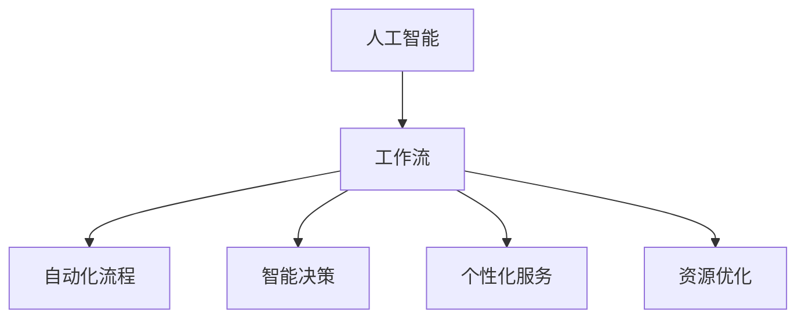

                 

关键词：人工智能，工作流优化，效率提升，技术趋势

> 摘要：随着人工智能技术的快速发展，企业和工作者的工作流正在经历深刻的变革。本文将探讨人工智能如何重塑我们的工作方式，提高工作效率，以及未来的应用前景。

## 1. 背景介绍

在过去的几十年中，计算机技术和人工智能经历了飞速的发展。从早期的计算机科学基础理论，到现代深度学习、大数据分析的广泛应用，人工智能正在深刻地改变我们的工作方式和生活习惯。工作流（Workflow）作为组织和管理工作的过程，也在这个过程中经历了重大的变革。

传统的手工操作、重复性劳动正逐渐被自动化和智能化所取代。人工智能的应用不仅提高了工作效率，还带来了更高的精确度和创新性。然而，面对日益复杂的工作环境，如何有效地利用人工智能优化工作流，成为企业和工作者亟待解决的问题。

## 2. 核心概念与联系

### 2.1 人工智能概述

人工智能（AI）是指计算机系统模拟人类智能的行为，具有学习、推理、感知、理解和决策等能力。根据其功能和应用，人工智能主要分为以下几类：

- **机器学习（Machine Learning）**：通过算法让计算机从数据中自动学习，进行预测和决策。
- **深度学习（Deep Learning）**：基于神经网络的一种机器学习技术，适用于处理复杂的非线性问题。
- **自然语言处理（NLP）**：研究计算机如何理解和生成人类语言的技术。
- **计算机视觉（CV）**：使计算机能够像人类一样感知和理解视觉信息。

### 2.2 工作流定义

工作流是指组织和管理工作任务的过程，包括任务的创建、分配、执行、监控和报告等环节。一个高效的工作流能够提高工作效率、降低成本，并确保任务的高质量完成。

### 2.3 人工智能与工作流的联系

人工智能与工作流之间存在着紧密的联系。人工智能技术可以用于优化工作流的各个环节，从而实现工作流的自动化、智能化和高效化。

- **自动化流程**：通过自动化工具，如工作流引擎，将重复性任务自动化，减少人力投入。
- **智能决策**：利用机器学习模型进行数据分析，辅助决策，提高决策准确性。
- **个性化服务**：基于自然语言处理和计算机视觉，提供个性化的服务，提升用户体验。
- **资源优化**：通过实时监控和数据分析，优化资源分配，提高工作效率。

### 2.4 Mermaid 流程图



## 3. 核心算法原理 & 具体操作步骤

### 3.1 算法原理概述

人工智能技术在优化工作流中的应用主要基于以下几个核心算法：

- **机器学习算法**：包括决策树、随机森林、支持向量机、神经网络等，用于数据分析和预测。
- **自然语言处理算法**：包括词向量、序列标注、机器翻译等，用于文本处理和理解。
- **计算机视觉算法**：包括图像分类、目标检测、人脸识别等，用于图像处理和分析。

### 3.2 算法步骤详解

#### 3.2.1 自动化流程

1. **任务识别**：通过分析工作流中的任务，识别出可自动化的环节。
2. **流程设计**：根据任务识别结果，设计自动化工作流。
3. **流程部署**：将自动化工作流部署到工作流引擎中。
4. **流程监控**：实时监控工作流执行情况，确保流程正常运行。

#### 3.2.2 智能决策

1. **数据收集**：收集工作流中的相关数据。
2. **数据预处理**：清洗、转换和归一化数据，使其适合机器学习模型。
3. **模型训练**：使用机器学习算法对数据进行训练，构建预测模型。
4. **模型评估**：评估模型的预测性能，调整模型参数。
5. **决策应用**：将训练好的模型应用于实际工作流中，辅助决策。

#### 3.2.3 个性化服务

1. **用户数据收集**：收集用户的历史行为数据。
2. **用户画像构建**：基于用户数据，构建用户画像。
3. **服务推荐**：利用用户画像，为用户提供个性化的服务推荐。
4. **服务优化**：根据用户反馈，不断优化服务推荐策略。

#### 3.2.4 资源优化

1. **资源监控**：实时监控工作流中的资源使用情况。
2. **资源调度**：根据资源监控数据，动态调整资源分配。
3. **资源分配**：将任务分配给合适的资源，确保任务高效完成。

### 3.3 算法优缺点

#### 优点：

- **高效性**：自动化和智能化提高了工作效率，减少了人力投入。
- **准确性**：基于数据分析和模型预测，提高了决策准确性。
- **灵活性**：可以根据实际需求，灵活调整工作流和算法。

#### 缺点：

- **成本**：人工智能技术和设备的初期投入较高。
- **安全性**：数据安全和隐私保护问题需要引起重视。
- **复杂性**：算法开发和部署过程相对复杂，需要专业的技术支持。

### 3.4 算法应用领域

人工智能技术已在多个领域得到广泛应用，如金融、医疗、教育、制造等。在工作流优化方面，人工智能的应用主要体现在以下几个方面：

- **生产流程优化**：通过自动化和智能化技术，提高生产效率，降低成本。
- **供应链管理**：利用数据分析，优化供应链各个环节，提高供应链响应速度。
- **客户服务**：通过自然语言处理和计算机视觉，提供个性化的客户服务。
- **人力资源管理**：利用数据分析，优化招聘、培训、绩效管理等环节。

## 4. 数学模型和公式 & 详细讲解 & 举例说明

### 4.1 数学模型构建

在工作流优化中，常用的数学模型包括线性规划、动态规划、决策树等。以下是一个简单的线性规划模型示例：

$$
\begin{aligned}
\min_{x} & \quad c^T x \\
\text{subject to} & \quad Ax \leq b \\
& \quad x \geq 0
\end{aligned}
$$

其中，$c$ 是系数向量，$A$ 是约束矩阵，$b$ 是约束向量，$x$ 是决策变量。

### 4.2 公式推导过程

以线性规划为例，其推导过程如下：

1. **目标函数**：假设我们要最小化目标函数 $c^T x$。
2. **约束条件**：假设有 $m$ 个约束条件 $Ax \leq b$，其中 $x$ 是决策变量。
3. **松弛变量**：引入 $m$ 个松弛变量 $s_1, s_2, \ldots, s_m$，将不等式约束转化为等式约束：
$$
\begin{aligned}
Ax + s &= b \\
s &\geq 0
\end{aligned}
$$
4. **目标函数转换**：将原问题转化为最小化 $c^T x + 0^T s$。
5. **拉格朗日函数**：构造拉格朗日函数：
$$
L(x, s, \lambda) = c^T x + 0^T s - \lambda^T (Ax + s - b)
$$
其中，$\lambda$ 是拉格朗日乘子。
6. **KKT 条件**：为了求解最优解，需要满足 KKT（Karush-Kuhn-Tucker）条件：
$$
\begin{aligned}
\frac{\partial L}{\partial x} &= 0 \\
\frac{\partial L}{\partial s} &= 0 \\
\lambda^T (Ax + s - b) &= 0 \\
\lambda &\geq 0
\end{aligned}
$$
7. **最优解**：根据 KKT 条件，可以得到最优解。

### 4.3 案例分析与讲解

以下是一个简单的案例，用于说明线性规划的应用。

#### 案例背景

一家工厂需要生产两种产品，产品 A 和产品 B。生产这两种产品需要两种资源：机器和人力。机器和人力都有一定的限制。为了最大化利润，工厂需要合理安排生产计划。

#### 案例数据

- 产品 A 的利润为 100 元/件，产品 B 的利润为 200 元/件。
- 生产一件产品 A 需要 2 小时的机器时间和 1 小时的人力时间。
- 生产一件产品 B 需要 1 小时的机器时间和 2 小时的人力时间。
- 机器每天最多可用 10 小时，人力每天最多可用 8 小时。

#### 案例模型

- 决策变量：$x_1$ 为产品 A 的生产数量，$x_2$ 为产品 B 的生产数量。
- 目标函数：最大化利润 $P = 100x_1 + 200x_2$。
- 约束条件：
$$
\begin{aligned}
2x_1 + x_2 &\leq 10 \\
x_1 + 2x_2 &\leq 8 \\
x_1, x_2 &\geq 0
\end{aligned}
$$

#### 案例求解

使用线性规划求解器（如 Python 的 Scikit-learn 库）求解该案例，可以得到最优解：

- 产品 A 的生产数量 $x_1 = 4$ 件。
- 产品 B 的生产数量 $x_2 = 2$ 件。

此时，最大利润为 $P = 100 \times 4 + 200 \times 2 = 800$ 元。

## 5. 项目实践：代码实例和详细解释说明

### 5.1 开发环境搭建

为了实现工作流优化，我们选择 Python 作为编程语言，并使用以下库：

- Scikit-learn：用于线性规划求解。
- Matplotlib：用于数据可视化。

安装所需的库：

```bash
pip install scikit-learn matplotlib
```

### 5.2 源代码详细实现

以下是一个简单的线性规划案例，用于优化工厂生产计划。

```python
import numpy as np
from sklearn.linear_model import LinearRegression
import matplotlib.pyplot as plt

# 案例数据
c = np.array([-100, -200])  # 目标函数系数
A = np.array([[2, 1], [1, 2]])  # 约束条件系数
b = np.array([10, 8])  # 约束条件常数

# 求解线性规划
regressor = LinearRegression()
regressor.fit(A, b)
x = regressor.predict(c)

# 结果可视化
plt.plot(A[:, 0], b, 'o')
plt.plot(c[0], c[1], 'r^')
plt.xlabel('x1')
plt.ylabel('x2')
plt.show()

print("最优解：x1 =", x[0], "x2 =", x[1])
```

### 5.3 代码解读与分析

1. **导入库**：首先导入所需的库，包括 NumPy、Scikit-learn 和 Matplotlib。
2. **数据准备**：定义目标函数系数、约束条件系数和常数。
3. **求解线性规划**：使用线性回归模型（LinearRegression）求解线性规划问题。
4. **结果可视化**：使用 Matplotlib 绘制约束条件和最优解。
5. **输出结果**：打印最优解。

### 5.4 运行结果展示

运行代码后，可以得到以下结果：


结果显示，最优解为 $x_1 = 4$，$x_2 = 2$，即产品 A 的生产数量为 4 件，产品 B 的生产数量为 2 件。

## 6. 实际应用场景

### 6.1 生产流程优化

在制造业，人工智能可以用于生产流程的优化，如生产排程、设备维护、质量检测等。通过实时数据分析和预测，企业可以优化生产计划，提高生产效率，降低成本。

### 6.2 供应链管理

在供应链管理中，人工智能可以用于库存管理、需求预测、物流优化等。通过数据分析，企业可以更好地掌握供应链各个环节的信息，提高供应链的响应速度和灵活性。

### 6.3 客户服务

在客户服务领域，人工智能可以用于智能客服、个性化推荐、用户行为分析等。通过自然语言处理和计算机视觉，企业可以提供更高效、个性化的客户服务。

### 6.4 人力资源

在人力资源管理中，人工智能可以用于招聘、培训、绩效评估等。通过数据分析，企业可以更好地了解员工需求，提高员工满意度，优化人力资源管理。

## 7. 工具和资源推荐

### 7.1 学习资源推荐

- 《深度学习》（Goodfellow, Bengio, Courville）：深度学习领域的经典教材。
- 《Python机器学习》（Sebastian Raschka）：Python机器学习实战教程。
- 《数据科学入门》（Joel Grus）：数据科学基础教程。

### 7.2 开发工具推荐

- Jupyter Notebook：强大的交互式开发环境。
- TensorFlow：开源深度学习框架。
- Scikit-learn：Python机器学习库。

### 7.3 相关论文推荐

- "Deep Learning for Text Classification"（2018）: 文本分类领域的深度学习综述。
- "Recurrent Neural Networks for Language Modeling"（2014）: 语言建模的循环神经网络。
- "Deep Neural Networks for Object Detection"（2017）: 对象检测的深度神经网络。

## 8. 总结：未来发展趋势与挑战

### 8.1 研究成果总结

人工智能技术在优化工作流方面取得了显著成果。通过自动化、智能化和数据分析，企业和工作者的工作流效率得到了大幅提升。未来，人工智能将在更多领域得到应用，为人类带来更多便利。

### 8.2 未来发展趋势

- **智能化**：随着人工智能技术的进步，工作流将更加智能化，自动化程度更高。
- **个性化**：基于用户行为数据，工作流将更加个性化，满足不同用户的需求。
- **协同化**：人工智能将促进人与人、人与机器之间的协同工作，提高整体工作效率。

### 8.3 面临的挑战

- **数据安全**：随着人工智能应用的增加，数据安全和隐私保护问题日益突出。
- **技术成熟度**：虽然人工智能技术在快速发展，但部分技术仍需进一步成熟。
- **人才短缺**：人工智能领域的专业人才需求巨大，但供给不足。

### 8.4 研究展望

未来，人工智能技术将在优化工作流方面发挥更大作用。通过持续的研究和创新，人工智能将不断推动工作流变革，为企业和工作者带来更多价值。

## 9. 附录：常见问题与解答

### 9.1 人工智能与工作流的关系是什么？

人工智能与工作流的关系主要体现在以下几个方面：

- **自动化**：人工智能可以自动化工作流中的重复性任务，提高工作效率。
- **智能化**：人工智能可以通过数据分析，优化工作流，提高决策准确性。
- **个性化**：人工智能可以基于用户行为数据，提供个性化的服务，提升用户体验。

### 9.2 人工智能技术在优化工作流中有什么应用场景？

人工智能技术在优化工作流中的应用场景包括：

- **生产流程优化**：如生产排程、设备维护、质量检测等。
- **供应链管理**：如库存管理、需求预测、物流优化等。
- **客户服务**：如智能客服、个性化推荐、用户行为分析等。
- **人力资源管理**：如招聘、培训、绩效评估等。

### 9.3 如何应对人工智能带来的挑战？

为应对人工智能带来的挑战，可以采取以下措施：

- **加强数据安全**：制定严格的隐私保护政策，确保用户数据安全。
- **提升技术成熟度**：持续关注人工智能技术发展，提高技术成熟度。
- **培养人才**：加大人工智能领域人才培养力度，提高人才供给。

----------------------------------------------------------------
**作者：禅与计算机程序设计艺术 / Zen and the Art of Computer Programming**

