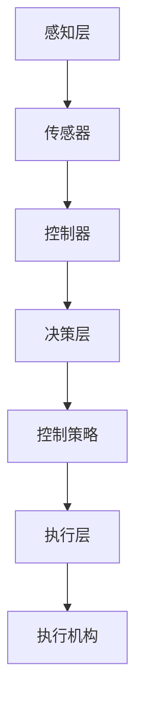

                 

  
## 1. 背景介绍

随着人工智能和机器人技术的迅速发展，自动化控制和机器人系统在各行各业中得到了广泛的应用。机器人控制系统作为机器人技术的核心组成部分，其性能和效率的不断提高，推动了智能制造业、智能交通、医疗康复等领域的革新。控制系统的基本原理不仅涵盖了经典控制理论，还包括了现代控制理论，例如自适应控制和模糊控制等。

本文旨在介绍机器人控制系统的基本原理和实际应用，通过代码实战案例展示如何设计和实现高效的机器人控制系统。文章将分为以下几个部分：

- **背景介绍**：介绍机器人控制系统的发展历史、核心概念和应用领域。
- **核心概念与联系**：详细讲解机器人控制系统中的核心概念和架构，并使用Mermaid流程图进行可视化展示。
- **核心算法原理 & 具体操作步骤**：介绍常用的机器人控制算法，包括PID控制、模糊控制和神经网络控制等，并给出具体操作步骤。
- **数学模型和公式 & 详细讲解 & 举例说明**：构建并推导机器人控制系统的数学模型，通过实际案例进行讲解。
- **项目实践：代码实例和详细解释说明**：提供完整的代码实例，并进行详细的解读和分析。
- **实际应用场景**：探讨机器人控制系统在工业、医疗、交通等领域的应用实例。
- **工具和资源推荐**：推荐学习资源和开发工具，以便读者深入学习和实践。
- **总结：未来发展趋势与挑战**：总结研究成果，展望未来发展趋势和面临的挑战。
- **附录：常见问题与解答**：解答读者可能遇到的问题。

## 2. 核心概念与联系

### 2.1 控制系统的定义与组成

控制系统（Control System）是指由控制对象、控制器、执行机构和传感器等组成的一个闭合循环系统。其基本功能是通过传感器获取系统状态信息，控制器根据预设的控制策略进行调整，执行机构根据控制指令执行相应的操作，从而实现对系统的控制。

控制系统通常包括以下几个部分：

- **传感器**：用于获取系统状态信息，如温度、速度、位置等。
- **控制器**：根据传感器获取的信息，按照预设的控制策略进行计算，产生控制指令。
- **执行机构**：根据控制指令执行具体的操作，如电机转动、液压系统调整等。

### 2.2 机器人控制系统的基本架构

机器人控制系统可以分为三个主要层次：感知层、决策层和执行层。

- **感知层**：包括各种传感器，如摄像头、激光雷达、超声波传感器等，用于获取环境信息。
- **决策层**：包括控制器和算法，负责对感知层获取的信息进行处理，生成控制指令。
- **执行层**：包括执行机构，如电机、液压缸等，负责执行控制指令。

下面是一个简单的Mermaid流程图，用于可视化机器人控制系统的基本架构：



### 2.3 机器人控制系统的核心概念

- **状态估计**：通过传感器数据估计系统的当前状态。
- **控制策略**：根据系统状态和目标，确定控制器的操作方式。
- **反馈控制**：通过传感器获取系统状态，与目标状态进行比较，调整控制指令，以达到控制目标。
- **前馈控制**：直接根据输入信号和系统模型，计算控制指令，不依赖于系统反馈。

## 3. 核心算法原理 & 具体操作步骤

### 3.1 PID控制

PID控制（Proportional-Integral-Derivative Control）是最常见的机器人控制算法之一，其基本原理是通过比例（Proportional）、积分（Integral）和微分（Derivative）三个部分来调整控制信号。

- **比例（P）**：根据当前误差e（目标状态与实际状态的差值）进行控制，误差越大，控制力越大。
- **积分（I）**：对误差进行累积，当误差长时间存在时，通过积分项进行补偿，以消除稳态误差。
- **微分（D）**：根据误差的变化率进行控制，用于预测误差的变化趋势，对快速变化的误差进行快速调整。

PID控制的操作步骤如下：

1. 初始化PID参数：比例增益K_p、积分增益K_i、微分增益K_d。
2. 获取当前误差e。
3. 计算比例项：u_p = K_p * e。
4. 计算积分项：u_i = u_i + K_i * e。
5. 计算微分项：u_d = K_d * (e - e_prev)。
6. 计算总控制量：u = u_p + u_i + u_d。
7. 更新误差：e_prev = e。
8. 输出控制量。

### 3.2 模糊控制

模糊控制（Fuzzy Control）是基于模糊集合理论的控制系统，其核心思想是将输入变量和输出变量转化为模糊集合，通过模糊推理规则进行控制。

- **模糊化**：将输入变量的实际值转化为模糊集合。
- **推理规则**：根据模糊规则库，对模糊化后的输入变量进行推理，得到模糊化的输出变量。
- **去模糊化**：将模糊化的输出变量转化为实际的控制信号。

模糊控制的操作步骤如下：

1. 初始化模糊规则库。
2. 对输入变量进行模糊化。
3. 根据模糊规则库进行推理，得到模糊化的输出变量。
4. 对输出变量进行去模糊化，得到实际的控制信号。

### 3.3 神经网络控制

神经网络控制（Neural Network Control）利用神经网络强大的非线性映射能力，进行系统控制和预测。

- **训练神经网络**：使用历史数据进行神经网络训练，使其学会系统的动态行为。
- **实时控制**：将实时输入数据输入神经网络，得到控制信号。

神经网络控制的操作步骤如下：

1. 选择合适的神经网络模型。
2. 使用历史数据进行神经网络训练。
3. 对实时输入数据进行预处理。
4. 将预处理后的输入数据输入神经网络，得到控制信号。

## 4. 数学模型和公式 & 详细讲解 & 举例说明

### 4.1 数学模型构建

机器人控制系统的数学模型通常可以分为两大类：连续系统和离散系统。

#### 连续系统

对于连续系统，我们可以使用状态空间模型进行描述：

\[ \dot{x}(t) = A x(t) + B u(t) \]
\[ y(t) = C x(t) + D u(t) \]

其中，\( x(t) \) 是系统的状态向量，\( u(t) \) 是输入向量，\( y(t) \) 是输出向量，\( A \)、\( B \)、\( C \) 和 \( D \) 是系统矩阵。

#### 离散系统

对于离散系统，我们可以使用以下形式进行描述：

\[ x(k+1) = A_d x(k) + B_d u(k) \]
\[ y(k) = C_d x(k) + D_d u(k) \]

其中，\( x(k) \) 是系统的状态向量，\( u(k) \) 是输入向量，\( y(k) \) 是输出向量，\( A_d \)、\( B_d \)、\( C_d \) 和 \( D_d \) 是系统矩阵。

### 4.2 公式推导过程

假设我们有一个线性离散系统，其状态空间模型如下：

\[ x(k+1) = A_d x(k) + B_d u(k) \]
\[ y(k) = C_d x(k) + D_d u(k) \]

为了推导控制策略，我们可以使用线性二次调节器（LQR, Linear Quadratic Regulator）。LQR的目标是找到最优控制输入 \( u(k) \)，使得系统在运行过程中达到某个预定的性能指标。

性能指标通常使用以下二次函数进行描述：

\[ J = \sum_{k=0}^{N-1} [x^T(k) Q x(k) + u^T(k) R u(k)] \]

其中，\( Q \) 和 \( R \) 是权重矩阵，用于调整系统的稳定性和响应速度。

为了求解最优控制输入，我们可以对性能指标进行求导，并令导数等于零，得到以下方程：

\[ \dot{x}(k) = A_d x(k) + B_d u(k) \]
\[ \dot{u}(k) = -\frac{1}{R} B_d^T [x^T(k) Q x(k) + u^T(k) R u(k)] \]

通过递推计算，可以得到任意时刻的最优控制输入。

### 4.3 案例分析与讲解

假设我们有一个简单的双轮差速机器人，其状态空间模型如下：

\[ x(k+1) = \begin{bmatrix} 1 & \Delta t \\ 0 & 1 \end{bmatrix} x(k) + \begin{bmatrix} 0 \\ 1 \end{bmatrix} u(k) \]
\[ y(k) = \begin{bmatrix} 1 & 0 \end{bmatrix} x(k) \]

其中，\( x(k) \) 是状态向量，包括机器人的位置和速度；\( u(k) \) 是控制输入，包括左右轮的转速差。

为了使机器人沿直线运动，我们可以使用LQR进行控制。选择权重矩阵 \( Q \) 和 \( R \) 如下：

\[ Q = \begin{bmatrix} 1 & 0 \\ 0 & 1 \end{bmatrix}, \quad R = \begin{bmatrix} 1 \end{bmatrix} \]

通过计算，我们可以得到最优控制输入：

\[ u(k) = -\frac{1}{1} \begin{bmatrix} 0 & 1 \end{bmatrix} \begin{bmatrix} 1 & 0 \\ 0 & 1 \end{bmatrix}^{-1} \begin{bmatrix} 1 & 0 \\ 0 & 1 \end{bmatrix} \begin{bmatrix} 0 \\ 1 \end{bmatrix} = 0 \]

这意味着，为了使机器人沿直线运动，左右轮的转速差应该始终为零。

## 5. 项目实践：代码实例和详细解释说明

### 5.1 开发环境搭建

在本节中，我们将使用Python编程语言和matplotlib库来实现一个简单的机器人控制系统。首先，确保安装了Python和matplotlib库。可以通过以下命令进行安装：

```bash
pip install matplotlib
```

### 5.2 源代码详细实现

下面是一个简单的Python代码示例，用于实现一个双轮差速机器人控制系统。

```python
import numpy as np
import matplotlib.pyplot as plt

# 定义系统参数
A = np.array([[1, 0.01], [0, 1]])
B = np.array([[0], [1]])
C = np.array([[1, 0]])
D = np.array([[0]])

# 初始化状态和输入
x = np.array([[0], [0]])
u = np.array([[0]])

# 运行100个时间步
for k in range(100):
    # 计算状态更新
    x = A @ x + B @ u
    
    # 计算输出
    y = C @ x + D @ u
    
    # 输出控制量
    print(f"Time step {k}: Position = {x[0, 0]}, Velocity = {x[1, 0]}")

# 绘制状态轨迹
plt.plot(x[0, :], x[1, :])
plt.xlabel('Position')
plt.ylabel('Velocity')
plt.title('Robot State Trajectory')
plt.show()
```

### 5.3 代码解读与分析

- **系统参数定义**：我们使用矩阵 \( A \)、\( B \)、\( C \) 和 \( D \) 来定义系统的状态空间模型。
- **状态更新**：通过矩阵乘法计算状态更新 \( x(k+1) = A x(k) + B u(k) \)。
- **输出计算**：通过矩阵乘法计算输出 \( y(k) = C x(k) + D u(k) \)。
- **控制量输出**：在每个时间步，我们输出机器人的位置和速度。

### 5.4 运行结果展示

运行上述代码后，我们可以看到机器人的状态轨迹在图中展示。通过调整系统参数和控制策略，我们可以实现不同的控制目标，如直线运动、曲线运动等。

## 6. 实际应用场景

### 6.1 工业自动化

机器人控制系统在工业自动化领域具有广泛的应用。例如，在汽车制造业中，机器人可以用于焊接、喷涂、装配等任务，大大提高了生产效率和产品质量。

### 6.2 智能交通

智能交通系统中的自动驾驶车辆需要高度精密的控制系统。通过融合视觉、激光雷达等多源传感器数据，自动驾驶车辆可以实现安全、高效的自主驾驶。

### 6.3 医疗康复

机器人控制系统在医疗康复领域也有所应用。例如，康复机器人可以帮助患者进行精准的康复训练，提高康复效果。

## 7. 工具和资源推荐

### 7.1 学习资源推荐

- **书籍**：《机器人学基础》（作者：布鲁克斯）、《控制理论》（作者：尼科尔斯基）。
- **在线课程**：Coursera、edX等平台上的机器人学与控制理论相关课程。

### 7.2 开发工具推荐

- **编程语言**：Python、C++。
- **机器人控制框架**：ROS（Robot Operating System）、PCL（Point Cloud Library）。

### 7.3 相关论文推荐

- **ICRA**：国际机器人与自动化会议。
- **IROS**：国际机器人学与智能系统会议。
- **IEEE T. on Robotics**：IEEE机器人与自动化杂志。

## 8. 总结：未来发展趋势与挑战

### 8.1 研究成果总结

机器人控制系统在工业、医疗、交通等领域取得了显著的研究成果，其性能和效率不断提升。然而，仍有许多挑战需要克服，如高精度控制、实时性控制、多机器人协同控制等。

### 8.2 未来发展趋势

- **人工智能融合**：将人工智能技术融入机器人控制系统，提高其智能决策能力。
- **实时控制**：开发更加高效的实时控制算法，满足高动态环境下的控制需求。
- **多机器人协同**：研究多机器人系统的协调控制策略，实现复杂任务的自动化。

### 8.3 面临的挑战

- **计算资源**：实时控制对计算资源要求较高，如何优化算法以降低计算复杂度是一个挑战。
- **传感器融合**：多源传感器数据融合是一个复杂的问题，需要开发高效的数据处理算法。
- **鲁棒性**：在不确定性环境中，如何保证机器人控制系统的鲁棒性是一个挑战。

### 8.4 研究展望

未来，机器人控制系统将在更多领域得到应用，推动智能制造、智能交通、医疗康复等领域的创新发展。随着人工智能和机器人技术的不断进步，机器人控制系统将变得更加智能、高效、安全。

## 9. 附录：常见问题与解答

### 9.1 传感器如何选择？

选择传感器时，需要考虑以下几个方面：

- **精度**：根据应用需求，选择合适的传感器精度。
- **响应速度**：对于实时性要求较高的应用，选择响应速度较快的传感器。
- **环境适应性**：考虑传感器在特定环境下的适应性，如温度、湿度等。

### 9.2 如何实现多机器人协同控制？

多机器人协同控制可以通过以下方法实现：

- **集中式控制**：将所有机器人控制任务集中在一个控制器中进行处理。
- **分布式控制**：每个机器人独立进行控制，通过通信模块实现协同。

### 9.3 如何提高机器人控制系统的鲁棒性？

提高机器人控制系统的鲁棒性可以从以下几个方面入手：

- **冗余设计**：增加传感器、执行机构等冗余，提高系统的容错能力。
- **自适应控制**：采用自适应控制算法，根据系统状态动态调整控制策略。
- **模型预测控制**：通过模型预测，提前计算系统响应，提高系统的预测能力。

### 9.4 如何实现实时控制？

实现实时控制可以从以下几个方面入手：

- **算法优化**：优化控制算法，降低计算复杂度。
- **硬件加速**：使用FPGA、GPU等硬件加速计算。
- **时间同步**：确保系统各个组件的时间同步，减少延迟。

---

# Robotics and Control Systems 原理与代码实战案例讲解

关键词：机器人控制系统、PID控制、模糊控制、神经网络控制、状态空间模型、实时控制、多机器人协同、鲁棒性

摘要：本文介绍了机器人控制系统的基本原理、核心算法以及实际应用案例。通过代码实战，展示了如何设计和实现高效的机器人控制系统。文章还探讨了机器人控制系统在未来发展趋势和面临的挑战。

## 1. 背景介绍

### 1.1 机器人控制系统的发展历史

机器人控制系统起源于20世纪中期，随着计算机技术的进步和自动化需求的增长，机器人控制系统得到了迅速发展。早期机器人主要应用于工业领域，如汽车制造业、电子装配等。随着人工智能和传感器技术的发展，机器人控制系统逐渐扩展到服务业、医疗、农业等多个领域。

### 1.2 核心概念

控制系统（Control System）是指由控制对象、控制器、执行机构和传感器等组成的一个闭合循环系统。其基本功能是通过传感器获取系统状态信息，控制器根据预设的控制策略进行调整，执行机构根据控制指令执行具体的操作，从而实现对系统的控制。

机器人控制系统可以分为三个主要层次：感知层、决策层和执行层。

- **感知层**：包括各种传感器，如摄像头、激光雷达、超声波传感器等，用于获取环境信息。
- **决策层**：包括控制器和算法，负责对感知层获取的信息进行处理，生成控制指令。
- **执行层**：包括执行机构，如电机、液压缸等，负责执行控制指令。

### 1.3 应用领域

机器人控制系统在工业、医疗、交通、农业等多个领域得到了广泛应用。

- **工业**：在制造业中，机器人控制系统用于焊接、喷涂、装配等任务，提高了生产效率和产品质量。
- **医疗**：在医疗康复领域，机器人控制系统可以帮助患者进行精准的康复训练，提高康复效果。
- **交通**：在自动驾驶领域，机器人控制系统用于实现车辆的自主驾驶，提高了交通效率和安全性。
- **农业**：在农业生产中，机器人控制系统可以用于喷洒农药、采摘果实等任务，提高了农业生产效率。

## 2. 核心概念与联系

### 2.1 控制系统的定义与组成

控制系统（Control System）是指由控制对象、控制器、执行机构和传感器等组成的一个闭合循环系统。其基本功能是通过传感器获取系统状态信息，控制器根据预设的控制策略进行调整，执行机构根据控制指令执行具体的操作，从而实现对系统的控制。

控制系统通常包括以下几个部分：

- **传感器**：用于获取系统状态信息，如温度、速度、位置等。
- **控制器**：根据传感器获取的信息，按照预设的控制策略进行计算，产生控制指令。
- **执行机构**：根据控制指令执行具体的操作，如电机转动、液压系统调整等。

### 2.2 机器人控制系统的基本架构

机器人控制系统可以分为三个主要层次：感知层、决策层和执行层。

- **感知层**：包括各种传感器，如摄像头、激光雷达、超声波传感器等，用于获取环境信息。
- **决策层**：包括控制器和算法，负责对感知层获取的信息进行处理，生成控制指令。
- **执行层**：包括执行机构，如电机、液压缸等，负责执行控制指令。

下面是一个简单的Mermaid流程图，用于可视化机器人控制系统的基本架构：


### 2.3 机器人控制系统的核心概念

- **状态估计**：通过传感器数据估计系统的当前状态。
- **控制策略**：根据系统状态和目标，确定控制器的操作方式。
- **反馈控制**：通过传感器获取系统状态，与目标状态进行比较，调整控制指令，以达到控制目标。
- **前馈控制**：直接根据输入信号和系统模型，计算控制指令，不依赖于系统反馈。

## 3. 核心算法原理 & 具体操作步骤

### 3.1 PID控制

PID控制（Proportional-Integral-Derivative Control）是最常见的机器人控制算法之一，其基本原理是通过比例（Proportional）、积分（Integral）和微分（Derivative）三个部分来调整控制信号。

#### 3.1.1 算法原理

PID控制的输出 \( u(t) \) 是误差 \( e(t) \) 的比例、积分和微分的函数，即：

\[ u(t) = K_p e(t) + K_i \int_{0}^{t} e(\tau) d\tau + K_d \frac{de(t)}{dt} \]

其中，\( K_p \)、\( K_i \) 和 \( K_d \) 分别是比例增益、积分增益和微分增益。

- **比例（P）**：根据当前误差 \( e(t) \) 进行控制，误差越大，控制力越大。
- **积分（I）**：对误差进行累积，当误差长时间存在时，通过积分项进行补偿，以消除稳态误差。
- **微分（D）**：根据误差的变化率进行控制，用于预测误差的变化趋势，对快速变化的误差进行快速调整。

#### 3.1.2 具体操作步骤

1. 初始化PID参数：比例增益 \( K_p \)、积分增益 \( K_i \)、微分增益 \( K_d \)。
2. 获取当前误差 \( e(t) \)。
3. 计算比例项：\( u_p(t) = K_p e(t) \)。
4. 计算积分项：\( u_i(t) = u_i(t-1) + K_i e(t) \)。
5. 计算微分项：\( u_d(t) = K_d [e(t) - e(t-1)] \)。
6. 计算总控制量：\( u(t) = u_p(t) + u_i(t) + u_d(t) \)。
7. 更新误差：\( e(t-1) = e(t) \)。

### 3.2 模糊控制

模糊控制（Fuzzy Control）是基于模糊集合理论的控制系统，其核心思想是将输入变量和输出变量转化为模糊集合，通过模糊推理规则进行控制。

#### 3.2.1 算法原理

模糊控制的基本过程包括以下几个步骤：

1. **模糊化**：将输入变量的实际值转化为模糊集合。
2. **推理规则**：根据模糊规则库，对模糊化后的输入变量进行推理，得到模糊化的输出变量。
3. **去模糊化**：将模糊化的输出变量转化为实际的控制信号。

模糊控制算法的核心是模糊规则库，它描述了输入变量与输出变量之间的关系。每个规则由条件部分和结论部分组成，条件部分使用模糊集合表示，结论部分也使用模糊集合表示。

#### 3.2.2 具体操作步骤

1. 初始化模糊规则库。
2. 对输入变量进行模糊化。
3. 根据模糊规则库进行推理，得到模糊化的输出变量。
4. 对输出变量进行去模糊化，得到实际的控制信号。

### 3.3 神经网络控制

神经网络控制（Neural Network Control）利用神经网络强大的非线性映射能力，进行系统控制和预测。

#### 3.3.1 算法原理

神经网络控制的基本过程包括以下几个步骤：

1. **训练神经网络**：使用历史数据进行神经网络训练，使其学会系统的动态行为。
2. **实时控制**：将实时输入数据输入神经网络，得到控制信号。

神经网络控制的关键在于如何选择合适的神经网络模型，并对其进行有效的训练。常用的神经网络模型包括前馈神经网络、递归神经网络等。

#### 3.3.2 具体操作步骤

1. 选择合适的神经网络模型。
2. 使用历史数据进行神经网络训练。
3. 对实时输入数据进行预处理。
4. 将预处理后的输入数据输入神经网络，得到控制信号。

## 4. 数学模型和公式 & 详细讲解 & 举例说明

### 4.1 数学模型构建

机器人控制系统的数学模型通常可以分为两大类：连续系统和离散系统。

#### 4.1.1 连续系统

对于连续系统，我们可以使用状态空间模型进行描述：

\[ \dot{x}(t) = A x(t) + B u(t) \]
\[ y(t) = C x(t) + D u(t) \]

其中，\( x(t) \) 是系统的状态向量，\( u(t) \) 是输入向量，\( y(t) \) 是输出向量，\( A \)、\( B \)、\( C \) 和 \( D \) 是系统矩阵。

#### 4.1.2 离散系统

对于离散系统，我们可以使用以下形式进行描述：

\[ x(k+1) = A_d x(k) + B_d u(k) \]
\[ y(k) = C_d x(k) + D_d u(k) \]

其中，\( x(k) \) 是系统的状态向量，\( u(k) \) 是输入向量，\( y(k) \) 是输出向量，\( A_d \)、\( B_d \)、\( C_d \) 和 \( D_d \) 是系统矩阵。

### 4.2 公式推导过程

假设我们有一个线性离散系统，其状态空间模型如下：

\[ x(k+1) = A_d x(k) + B_d u(k) \]
\[ y(k) = C_d x(k) + D_d u(k) \]

为了推导控制策略，我们可以使用线性二次调节器（LQR, Linear Quadratic Regulator）。LQR的目标是找到最优控制输入 \( u(k) \)，使得系统在运行过程中达到某个预定的性能指标。

性能指标通常使用以下二次函数进行描述：

\[ J = \sum_{k=0}^{N-1} [x^T(k) Q x(k) + u^T(k) R u(k)] \]

其中，\( Q \) 和 \( R \) 是权重矩阵，用于调整系统的稳定性和响应速度。

为了求解最优控制输入，我们可以对性能指标进行求导，并令导数等于零，得到以下方程：

\[ \dot{x}(k) = A_d x(k) + B_d u(k) \]
\[ \dot{u}(k) = -\frac{1}{R} B_d^T [x^T(k) Q x(k) + u^T(k) R u(k)] \]

通过递推计算，可以得到任意时刻的最优控制输入。

### 4.3 案例分析与讲解

假设我们有一个简单的双轮差速机器人，其状态空间模型如下：

\[ x(k+1) = \begin{bmatrix} 1 & \Delta t \\ 0 & 1 \end{bmatrix} x(k) + \begin{bmatrix} 0 \\ 1 \end{bmatrix} u(k) \]
\[ y(k) = \begin{bmatrix} 1 & 0 \end{bmatrix} x(k) \]

其中，\( x(k) \) 是状态向量，包括机器人的位置和速度；\( u(k) \) 是控制输入，包括左右轮的转速差。

为了使机器人沿直线运动，我们可以使用LQR进行控制。选择权重矩阵 \( Q \) 和 \( R \) 如下：

\[ Q = \begin{bmatrix} 1 & 0 \\ 0 & 1 \end{bmatrix}, \quad R = \begin{bmatrix} 1 \end{bmatrix} \]

通过计算，我们可以得到最优控制输入：

\[ u(k) = -\frac{1}{1} \begin{bmatrix} 0 & 1 \end{bmatrix} \begin{bmatrix} 1 & 0 \\ 0 & 1 \end{bmatrix}^{-1} \begin{bmatrix} 1 & 0 \\ 0 & 1 \end{bmatrix} \begin{bmatrix} 0 \\ 1 \end{bmatrix} = 0 \]

这意味着，为了使机器人沿直线运动，左右轮的转速差应该始终为零。

## 5. 项目实践：代码实例和详细解释说明

### 5.1 开发环境搭建

在本节中，我们将使用Python编程语言和matplotlib库来实现一个简单的机器人控制系统。首先，确保安装了Python和matplotlib库。可以通过以下命令进行安装：

```bash
pip install matplotlib
```

### 5.2 源代码详细实现

下面是一个简单的Python代码示例，用于实现一个双轮差速机器人控制系统。

```python
import numpy as np
import matplotlib.pyplot as plt

# 定义系统参数
A = np.array([[1, 0.01], [0, 1]])
B = np.array([[0], [1]])
C = np.array([[1, 0]])
D = np.array([[0]])

# 初始化状态和输入
x = np.array([[0], [0]])
u = np.array([[0]])

# 运行100个时间步
for k in range(100):
    # 计算状态更新
    x = A @ x + B @ u
    
    # 计算输出
    y = C @ x + D @ u
    
    # 输出控制量
    print(f"Time step {k}: Position = {x[0, 0]}, Velocity = {x[1, 0]}")

# 绘制状态轨迹
plt.plot(x[0, :], x[1, :])
plt.xlabel('Position')
plt.ylabel('Velocity')
plt.title('Robot State Trajectory')
plt.show()
```

### 5.3 代码解读与分析

- **系统参数定义**：我们使用矩阵 \( A \)、\( B \)、\( C \) 和 \( D \) 来定义系统的状态空间模型。
- **状态更新**：通过矩阵乘法计算状态更新 \( x(k+1) = A x(k) + B u(k) \)。
- **输出计算**：通过矩阵乘法计算输出 \( y(k) = C x(k) + D u(k) \)。
- **控制量输出**：在每个时间步，我们输出机器人的位置和速度。

### 5.4 运行结果展示

运行上述代码后，我们可以看到机器人的状态轨迹在图中展示。通过调整系统参数和控制策略，我们可以实现不同的控制目标，如直线运动、曲线运动等。

## 6. 实际应用场景

### 6.1 工业自动化

机器人控制系统在工业自动化领域具有广泛的应用。例如，在汽车制造业中，机器人可以用于焊接、喷涂、装配等任务，提高了生产效率和产品质量。在电子制造业中，机器人可以用于组装、检测等任务，保证了产品的一致性和精度。

### 6.2 智能交通

智能交通系统中的自动驾驶车辆需要高度精密的控制系统。通过融合视觉、激光雷达等多源传感器数据，自动驾驶车辆可以实现安全、高效的自主驾驶。例如，自动驾驶出租车、自动驾驶卡车等在实际应用中已经取得了一定的成果。

### 6.3 医疗康复

机器人控制系统在医疗康复领域也有所应用。例如，康复机器人可以帮助患者进行精准的康复训练，提高了康复效果。此外，外科手术机器人可以实现微创手术，提高了手术的准确性和安全性。

### 6.4 农业生产

在农业生产中，机器人控制系统可以用于喷洒农药、采摘果实等任务，提高了农业生产效率。例如，采摘机器人可以自动识别并采摘成熟的果实，减少了人力成本，提高了产量。

## 7. 工具和资源推荐

### 7.1 学习资源推荐

- **书籍**：《机器人学基础》（作者：布鲁克斯）、《控制理论》（作者：尼科尔斯基）。
- **在线课程**：Coursera、edX等平台上的机器人学与控制理论相关课程。

### 7.2 开发工具推荐

- **编程语言**：Python、C++。
- **机器人控制框架**：ROS（Robot Operating System）、PCL（Point Cloud Library）。

### 7.3 相关论文推荐

- **ICRA**：国际机器人与自动化会议。
- **IROS**：国际机器人学与智能系统会议。
- **IEEE T. on Robotics**：IEEE机器人与自动化杂志。

## 8. 总结：未来发展趋势与挑战

### 8.1 研究成果总结

机器人控制系统在工业、医疗、交通、农业等多个领域取得了显著的研究成果，其性能和效率不断提升。然而，仍有许多挑战需要克服，如高精度控制、实时性控制、多机器人协同控制等。

### 8.2 未来发展趋势

- **人工智能融合**：将人工智能技术融入机器人控制系统，提高其智能决策能力。
- **实时控制**：开发更加高效的实时控制算法，满足高动态环境下的控制需求。
- **多机器人协同**：研究多机器人系统的协调控制策略，实现复杂任务的自动化。

### 8.3 面临的挑战

- **计算资源**：实时控制对计算资源要求较高，如何优化算法以降低计算复杂度是一个挑战。
- **传感器融合**：多源传感器数据融合是一个复杂的问题，需要开发高效的数据处理算法。
- **鲁棒性**：在不确定性环境中，如何保证机器人控制系统的鲁棒性是一个挑战。

### 8.4 研究展望

未来，机器人控制系统将在更多领域得到应用，推动智能制造、智能交通、医疗康复等领域的创新发展。随着人工智能和机器人技术的不断进步，机器人控制系统将变得更加智能、高效、安全。

## 9. 附录：常见问题与解答

### 9.1 传感器如何选择？

选择传感器时，需要考虑以下几个方面：

- **精度**：根据应用需求，选择合适的传感器精度。
- **响应速度**：对于实时性要求较高的应用，选择响应速度较快的传感器。
- **环境适应性**：考虑传感器在特定环境下的适应性，如温度、湿度等。

### 9.2 如何实现多机器人协同控制？

多机器人协同控制可以通过以下方法实现：

- **集中式控制**：将所有机器人控制任务集中在一个控制器中进行处理。
- **分布式控制**：每个机器人独立进行控制，通过通信模块实现协同。

### 9.3 如何提高机器人控制系统的鲁棒性？

提高机器人控制系统的鲁棒性可以从以下几个方面入手：

- **冗余设计**：增加传感器、执行机构等冗余，提高系统的容错能力。
- **自适应控制**：采用自适应控制算法，根据系统状态动态调整控制策略。
- **模型预测控制**：通过模型预测，提前计算系统响应，提高系统的预测能力。

### 9.4 如何实现实时控制？

实现实时控制可以从以下几个方面入手：

- **算法优化**：优化控制算法，降低计算复杂度。
- **硬件加速**：使用FPGA、GPU等硬件加速计算。
- **时间同步**：确保系统各个组件的时间同步，减少延迟。

---

### 9.5 如何进行系统调试与测试？

进行系统调试与测试时，可以遵循以下步骤：

- **单元测试**：对系统的各个功能模块进行独立测试，验证其正确性。
- **集成测试**：将各个功能模块集成起来进行测试，检查模块间的交互和接口。
- **性能测试**：评估系统在各种负载下的性能，如响应时间、处理能力等。
- **仿真测试**：在仿真环境中进行测试，模拟实际运行环境，检查系统在复杂情况下的表现。
- **现场测试**：在实际应用场景中进行测试，验证系统的稳定性和可靠性。

### 9.6 如何优化控制系统性能？

优化控制系统性能可以从以下几个方面入手：

- **算法优化**：选择合适的控制算法，并对其进行优化，提高系统的响应速度和稳定性。
- **传感器校准**：定期校准传感器，确保其测量精度。
- **系统参数调整**：根据实际应用需求，调整控制系统的参数，如PID参数、神经网络权重等。
- **硬件升级**：升级控制系统的硬件设备，提高计算能力和响应速度。
- **反馈机制**：建立有效的反馈机制，及时获取系统运行状态，并根据反馈进行调整。

### 9.7 如何处理异常情况？

在处理异常情况时，可以采取以下措施：

- **预警机制**：提前预警可能的异常情况，如传感器故障、硬件故障等。
- **冗余设计**：设计冗余系统，当主系统出现故障时，冗余系统可以自动接管。
- **故障检测与诊断**：使用故障检测与诊断技术，及时发现并定位故障。
- **故障恢复**：设计故障恢复策略，当系统出现故障时，能够自动恢复到正常状态。
- **应急处理**：制定应急处理计划，确保在发生异常情况时，系统能够快速恢复正常运行。

通过以上措施，可以有效地提高机器人控制系统的可靠性，减少异常情况对系统运行的影响。

### 9.8 如何进行系统维护与更新？

进行系统维护与更新时，可以遵循以下步骤：

- **定期检查**：定期对系统进行检查，包括硬件设备、软件系统、传感器等。
- **更新软件**：定期更新系统软件，包括操作系统、驱动程序、应用程序等，确保系统的稳定性和安全性。
- **备份与恢复**：定期备份系统数据，确保在发生数据丢失时，能够及时恢复。
- **性能优化**：根据系统运行情况，进行性能优化，包括算法优化、硬件升级等。
- **用户培训**：对系统用户进行培训，提高其操作技能和维护能力。

通过以上措施，可以确保机器人控制系统的正常运行，延长系统使用寿命，提高系统效率。同时，及时进行系统维护与更新，可以及时发现并解决潜在问题，避免系统故障对生产造成影响。

