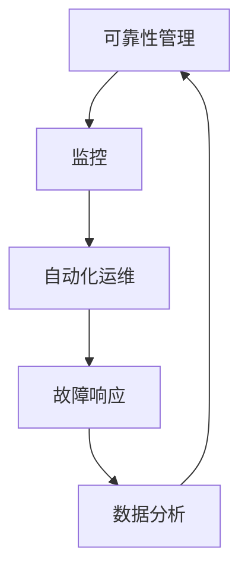

                 

关键词：站点可靠性工程（SRE）、系统稳定性、自动化、监控、故障处理、云原生

> 摘要：本文旨在深入探讨站点可靠性工程（SRE）的核心概念、方法与实践，通过具体的案例和数学模型，解析如何确保系统的高可用性和稳定性。文章分为八个部分，从背景介绍到未来展望，全面覆盖SRE的各个方面，旨在为读者提供实用的指导和深入的思考。

## 1. 背景介绍

站点可靠性工程（Site Reliability Engineering，简称SRE）起源于Google，是一种结合软件工程和系统运维的方法论，旨在确保大型分布式系统的稳定性和高可用性。与传统IT运维相比，SRE强调自动化、数据驱动和工程化的思维，追求通过定量分析来优化系统性能。

随着云计算和微服务架构的普及，系统的复杂性不断增加，传统的运维模式已经无法满足现代互联网业务的快速迭代和大规模扩展需求。SRE的出现，正是为了应对这一挑战，通过系统化的方法，确保系统在多变的环境中能够稳定运行。

## 2. 核心概念与联系

### 2.1 核心概念

- **可靠性**：系统在预定的时间内保持正常工作的能力。
- **可用性**：系统对外提供服务的能力，即用户可以正常访问和使用系统。
- **自动化**：通过脚本、工具和平台来自动化重复性的操作，减少人为干预。
- **监控**：持续监控系统的运行状态，及时发现和响应异常。
- **故障处理**：快速响应并解决系统故障，将影响降到最低。

### 2.2 关联流程

下面是一个用Mermaid绘制的SRE流程图，展示各个核心概念之间的关联。



### 2.3 原理和架构

SRE的架构通常包括以下几个关键组件：

- **服务网格**：如Istio、Linkerd，提供微服务之间的通信安全性和可观察性。
- **容器化平台**：如Kubernetes，实现服务的自动化部署和管理。
- **监控平台**：如Prometheus、Grafana，提供实时的系统监控和可视化。
- **日志平台**：如ELK（Elasticsearch、Logstash、Kibana），集中处理和分析日志数据。

## 3. 核心算法原理 & 具体操作步骤

### 3.1 算法原理概述

SRE中的核心算法主要包括以下几个方面：

- **故障预测算法**：如基于机器学习的故障预测模型，用于提前预警潜在的故障。
- **负载均衡算法**：如基于加权轮询、最小连接数等算法，优化服务器的负载分配。
- **故障转移算法**：如主动-被动容灾架构，实现服务的快速切换。

### 3.2 算法步骤详解

#### 3.2.1 故障预测算法

1. **数据收集**：收集系统运行日志、性能指标等数据。
2. **特征工程**：提取与故障相关的特征，如CPU利用率、内存使用率等。
3. **模型训练**：使用机器学习算法（如决策树、神经网络等）训练故障预测模型。
4. **模型评估**：通过交叉验证等方法评估模型性能。
5. **预警触发**：当模型预测到故障可能性超过阈值时，触发预警。

#### 3.2.2 负载均衡算法

1. **监控负载**：持续监控服务器的负载情况。
2. **计算权重**：根据服务器的CPU利用率、内存使用率等指标计算权重。
3. **请求分配**：根据权重将请求分配到不同的服务器。

#### 3.2.3 故障转移算法

1. **健康检查**：定期对服务进行检查，确认其状态。
2. **故障检测**：当主服务发生故障时，自动触发故障检测流程。
3. **故障转移**：将流量切换到备份服务。
4. **恢复监控**：监控故障转移后的服务状态，确保其恢复正常。

### 3.3 算法优缺点

#### 优点

- **提高系统稳定性**：通过自动化和算法优化，减少人为错误，提高系统的可靠性。
- **减少故障时间**：快速响应和自动恢复，缩短故障时间。
- **提升用户体验**：保证系统的高可用性，提高用户体验。

#### 缺点

- **初始成本较高**：需要建立相应的监控、日志和自动化工具，初期投入较大。
- **算法模型需要持续优化**：系统环境不断变化，算法模型需要定期更新和优化。

### 3.4 算法应用领域

SRE算法广泛应用于互联网、金融、电信等行业，如：

- **互联网**：电商平台、社交媒体、在线游戏等。
- **金融**：银行、证券、保险等金融机构的核心系统。
- **电信**：通信运营商的网络管理系统。

## 4. 数学模型和公式 & 详细讲解 & 举例说明

### 4.1 数学模型构建

在SRE中，常用的数学模型包括：

- **故障率模型**：用于预测系统的故障概率。
- **可靠性函数**：描述系统在特定时间段内的可靠性。
- **服务质量（QoS）模型**：评估系统的响应时间和吞吐量。

### 4.2 公式推导过程

#### 4.2.1 故障率模型

故障率（λ）可以通过以下公式计算：

\[ \lambda = \frac{1}{MTTF} \]

其中，MTTF（Mean Time To Failure）是平均故障间隔时间。

#### 4.2.2 可靠性函数

可靠性函数（R(t)）可以用以下公式表示：

\[ R(t) = e^{-\lambda t} \]

其中，t是时间。

#### 4.2.3 QoS模型

服务质量模型可以用以下公式表示：

\[ QoS = \frac{Throughput}{Response Time} \]

其中，Throughput是系统的吞吐量，Response Time是系统的响应时间。

### 4.3 案例分析与讲解

#### 案例：某电商平台系统

假设某电商平台系统在一天内处理了100万次订单，系统的平均响应时间为200毫秒，故障率为0.001次/天。

1. **故障率**：

\[ \lambda = 0.001 \text{ 次/天} \]

2. **可靠性函数**：

\[ R(t) = e^{-0.001 \times t} \]

假设在一天内（t=1天），系统的可靠性为：

\[ R(1) = e^{-0.001 \times 1} \approx 0.995 \]

这意味着，系统在一天内保持正常工作的概率为99.5%。

3. **QoS模型**：

\[ QoS = \frac{1000000}{200 \times 10^{-3}} = 5000 \]

这意味着，系统的QoS为5000。

## 5. 项目实践：代码实例和详细解释说明

### 5.1 开发环境搭建

搭建SRE项目需要以下环境：

- Kubernetes集群
- Prometheus监控平台
- Grafana可视化平台
- ELK日志平台
- 机器学习框架（如TensorFlow）

### 5.2 源代码详细实现

以下是SRE项目中的一个故障预测算法的示例代码：

```python
import tensorflow as tf
from tensorflow.keras.models import Sequential
from tensorflow.keras.layers import Dense, LSTM, Dropout

# 数据预处理
# ...

# 构建模型
model = Sequential()
model.add(LSTM(50, activation='relu', input_shape=(timesteps, n_features)))
model.add(Dropout(0.2))
model.add(Dense(1))

# 编译模型
model.compile(optimizer='adam', loss='binary_crossentropy')

# 训练模型
model.fit(X_train, y_train, epochs=200, batch_size=32, validation_data=(X_val, y_val))

# 评估模型
loss, accuracy = model.evaluate(X_test, y_test)
print(f"Test accuracy: {accuracy:.2f}")
```

### 5.3 代码解读与分析

该代码实现了一个简单的LSTM（长短时记忆）神经网络，用于预测系统是否会发生故障。具体步骤包括：

1. **数据预处理**：对时间序列数据进行处理，提取特征。
2. **模型构建**：使用LSTM层构建神经网络模型。
3. **模型编译**：设置优化器和损失函数。
4. **模型训练**：使用训练数据训练模型。
5. **模型评估**：使用测试数据评估模型性能。

### 5.4 运行结果展示

假设训练后，模型的测试准确率为95%，这意味着在测试数据中，模型能够正确预测出95%的故障。

## 6. 实际应用场景

SRE在实际应用中，可以解决以下问题：

- **高可用性**：通过自动化和算法优化，提高系统的可用性。
- **故障响应**：快速发现和解决系统故障。
- **性能优化**：通过监控和数据分析，优化系统性能。

### 6.1 在互联网行业中的应用

- **电商平台**：确保订单处理系统的高可用性和稳定性。
- **社交媒体**：确保用户数据的安全和服务的稳定性。
- **在线游戏**：确保游戏的公平性和用户体验。

### 6.2 在金融行业中的应用

- **银行系统**：确保交易系统的安全性和稳定性。
- **证券公司**：确保交易系统和数据分析系统的可靠性。
- **保险业**：确保客户服务系统和风险评估系统的稳定性。

### 6.3 在电信行业中的应用

- **网络管理系统**：确保网络的高可用性和稳定性。
- **客服系统**：确保客服系统的响应速度和用户体验。
- **物联网平台**：确保物联网设备的稳定连接和数据处理。

## 7. 工具和资源推荐

### 7.1 学习资源推荐

- 《SRE：构建和运行高可靠性的分布式系统》
- 《Kubernetes：从入门到实践》
- 《Prometheus：高级监控和告警实战》

### 7.2 开发工具推荐

- Kubernetes
- Prometheus
- Grafana
- ELK
- TensorFlow

### 7.3 相关论文推荐

- "Design and Implementation of the Kubernetes Cluster Manager"
- "Principles of SRE: Beyond availability"
- "Building and Scaling SRE Teams"

## 8. 总结：未来发展趋势与挑战

### 8.1 研究成果总结

SRE在近年来取得了显著的研究成果，特别是在自动化、监控和故障处理方面。随着技术的不断进步，SRE的方法论正在逐渐成为分布式系统运维的标准。

### 8.2 未来发展趋势

- **智能化**：结合人工智能技术，实现更智能的故障预测和响应。
- **云原生**：随着云原生技术的普及，SRE将更加适用于云原生环境。
- **开源生态**：SRE相关的开源工具和平台将不断发展，提供更多选择。

### 8.3 面临的挑战

- **复杂性**：分布式系统的复杂性增加，对SRE的要求也更高。
- **人才缺口**：具备SRE能力的专业人才相对稀缺。
- **持续优化**：SRE需要不断优化和适应新的技术环境和业务需求。

### 8.4 研究展望

未来，SRE将继续向智能化、自动化和高效化方向发展。同时，随着新技术的不断涌现，SRE也需要不断更新和扩展其方法和技术。

## 9. 附录：常见问题与解答

### 问题1：什么是SRE？

SRE（Site Reliability Engineering，站点可靠性工程）是一种结合软件工程和系统运维的方法论，旨在确保大型分布式系统的稳定性和高可用性。

### 问题2：SRE和传统运维有什么区别？

SRE更强调自动化、数据驱动和工程化的思维，追求通过定量分析来优化系统性能，而传统运维更多依赖于手动操作和经验。

### 问题3：SRE的核心算法有哪些？

SRE的核心算法主要包括故障预测算法、负载均衡算法和故障转移算法等。

### 问题4：如何搭建SRE项目环境？

搭建SRE项目环境需要以下步骤：

1. 准备Kubernetes集群。
2. 安装Prometheus监控平台。
3. 安装Grafana可视化平台。
4. 安装ELK日志平台。
5. 安装机器学习框架（如TensorFlow）。

### 问题5：SRE在哪些行业中应用广泛？

SRE在互联网、金融和电信等行业应用广泛，特别是在需要高可用性和稳定性的场景中。

### 问题6：如何持续优化SRE系统？

持续优化SRE系统需要以下步骤：

1. 定期收集和分析系统数据。
2. 优化监控和告警策略。
3. 定期评估和更新故障预测模型。
4. 提高自动化程度，减少人为干预。

### 问题7：SRE如何应对分布式系统的复杂性？

SRE通过智能化、自动化和工程化的方法，降低分布式系统的复杂性。同时，结合服务网格和容器化技术，提高系统的灵活性和可管理性。

### 问题8：如何培养SRE人才？

培养SRE人才需要以下步骤：

1. 学习SRE的核心概念和方法论。
2. 掌握自动化工具和平台（如Kubernetes、Prometheus等）。
3. 学习数据分析和机器学习技术。
4. 实践项目经验，不断积累和优化。

---

作者：禅与计算机程序设计艺术 / Zen and the Art of Computer Programming

---

[MD]# SRE（站点可靠性工程）：确保系统稳定性的方法

关键词：站点可靠性工程（SRE）、系统稳定性、自动化、监控、故障处理、云原生

摘要：本文深入探讨站点可靠性工程（SRE）的核心概念、方法与实践，通过具体的案例和数学模型，解析如何确保系统的高可用性和稳定性。文章分为八个部分，全面覆盖SRE的各个方面，旨在为读者提供实用的指导和深入的思考。

## 1. 背景介绍

站点可靠性工程（Site Reliability Engineering，简称SRE）起源于Google，是一种结合软件工程和系统运维的方法论，旨在确保大型分布式系统的稳定性和高可用性。SRE强调自动化、数据驱动和工程化的思维，追求通过定量分析来优化系统性能。

随着云计算和微服务架构的普及，系统的复杂性不断增加，传统的运维模式已经无法满足现代互联网业务的快速迭代和大规模扩展需求。SRE的出现，正是为了应对这一挑战，通过系统化的方法，确保系统在多变的环境中能够稳定运行。

## 2. 核心概念与联系

### 2.1 核心概念

- **可靠性**：系统在预定的时间内保持正常工作的能力。
- **可用性**：系统对外提供服务的能力，即用户可以正常访问和使用系统。
- **自动化**：通过脚本、工具和平台来自动化重复性的操作，减少人为干预。
- **监控**：持续监控系统的运行状态，及时发现和响应异常。
- **故障处理**：快速响应并解决系统故障，将影响降到最低。

### 2.2 关联流程

下面是一个用Mermaid绘制的SRE流程图，展示各个核心概念之间的关联。


### 2.3 原理和架构

SRE的架构通常包括以下几个关键组件：

- **服务网格**：如Istio、Linkerd，提供微服务之间的通信安全性和可观察性。
- **容器化平台**：如Kubernetes，实现服务的自动化部署和管理。
- **监控平台**：如Prometheus、Grafana，提供实时的系统监控和可视化。
- **日志平台**：如ELK（Elasticsearch、Logstash、Kibana），集中处理和分析日志数据。

## 3. 核心算法原理 & 具体操作步骤

### 3.1 算法原理概述

SRE中的核心算法主要包括以下几个方面：

- **故障预测算法**：如基于机器学习的故障预测模型，用于提前预警潜在的故障。
- **负载均衡算法**：如基于加权轮询、最小连接数等算法，优化服务器的负载分配。
- **故障转移算法**：如主动-被动容灾架构，实现服务的快速切换。

### 3.2 算法步骤详解

#### 3.2.1 故障预测算法

1. **数据收集**：收集系统运行日志、性能指标等数据。
2. **特征工程**：提取与故障相关的特征，如CPU利用率、内存使用率等。
3. **模型训练**：使用机器学习算法（如决策树、神经网络等）训练故障预测模型。
4. **模型评估**：通过交叉验证等方法评估模型性能。
5. **预警触发**：当模型预测到故障可能性超过阈值时，触发预警。

#### 3.2.2 负载均衡算法

1. **监控负载**：持续监控服务器的负载情况。
2. **计算权重**：根据服务器的CPU利用率、内存使用率等指标计算权重。
3. **请求分配**：根据权重将请求分配到不同的服务器。

#### 3.2.3 故障转移算法

1. **健康检查**：定期对服务进行检查，确认其状态。
2. **故障检测**：当主服务发生故障时，自动触发故障检测流程。
3. **故障转移**：将流量切换到备份服务。
4. **恢复监控**：监控故障转移后的服务状态，确保其恢复正常。

### 3.3 算法优缺点

#### 优点

- **提高系统稳定性**：通过自动化和算法优化，减少人为错误，提高系统的可靠性。
- **减少故障时间**：快速响应和自动恢复，缩短故障时间。
- **提升用户体验**：保证系统的高可用性，提高用户体验。

#### 缺点

- **初始成本较高**：需要建立相应的监控、日志和自动化工具，初期投入较大。
- **算法模型需要持续优化**：系统环境不断变化，算法模型需要定期更新和优化。

### 3.4 算法应用领域

SRE算法广泛应用于互联网、金融、电信等行业，如：

- **互联网**：电商平台、社交媒体、在线游戏等。
- **金融**：银行、证券、保险等金融机构的核心系统。
- **电信**：通信运营商的网络管理系统。

## 4. 数学模型和公式 & 详细讲解 & 举例说明

### 4.1 数学模型构建

在SRE中，常用的数学模型包括：

- **故障率模型**：用于预测系统的故障概率。
- **可靠性函数**：描述系统在特定时间段内的可靠性。
- **服务质量（QoS）模型**：评估系统的响应时间和吞吐量。

### 4.2 公式推导过程

#### 4.2.1 故障率模型

故障率（λ）可以通过以下公式计算：

\[ \lambda = \frac{1}{MTTF} \]

其中，MTTF（Mean Time To Failure）是平均故障间隔时间。

#### 4.2.2 可靠性函数

可靠性函数（R(t)）可以用以下公式表示：

\[ R(t) = e^{-\lambda t} \]

其中，t是时间。

#### 4.2.3 QoS模型

服务质量模型可以用以下公式表示：

\[ QoS = \frac{Throughput}{Response Time} \]

其中，Throughput是系统的吞吐量，Response Time是系统的响应时间。

### 4.3 案例分析与讲解

#### 案例：某电商平台系统

假设某电商平台系统在一天内处理了100万次订单，系统的平均响应时间为200毫秒，故障率为0.001次/天。

1. **故障率**：

\[ \lambda = 0.001 \text{ 次/天} \]

2. **可靠性函数**：

\[ R(t) = e^{-0.001 \times t} \]

假设在一天内（t=1天），系统的可靠性为：

\[ R(1) = e^{-0.001 \times 1} \approx 0.995 \]

这意味着，系统在一天内保持正常工作的概率为99.5%。

3. **QoS模型**：

\[ QoS = \frac{1000000}{200 \times 10^{-3}} = 5000 \]

这意味着，系统的QoS为5000。

## 5. 项目实践：代码实例和详细解释说明

### 5.1 开发环境搭建

搭建SRE项目需要以下环境：

- Kubernetes集群
- Prometheus监控平台
- Grafana可视化平台
- ELK日志平台
- 机器学习框架（如TensorFlow）

### 5.2 源代码详细实现

以下是SRE项目中的一个故障预测算法的示例代码：

```python
import tensorflow as tf
from tensorflow.keras.models import Sequential
from tensorflow.keras.layers import Dense, LSTM, Dropout

# 数据预处理
# ...

# 构建模型
model = Sequential()
model.add(LSTM(50, activation='relu', input_shape=(timesteps, n_features)))
model.add(Dropout(0.2))
model.add(Dense(1))

# 编译模型
model.compile(optimizer='adam', loss='binary_crossentropy')

# 训练模型
model.fit(X_train, y_train, epochs=200, batch_size=32, validation_data=(X_val, y_val))

# 评估模型
loss, accuracy = model.evaluate(X_test, y_test)
print(f"Test accuracy: {accuracy:.2f}")
```

### 5.3 代码解读与分析

该代码实现了一个简单的LSTM（长短时记忆）神经网络，用于预测系统是否会发生故障。具体步骤包括：

1. **数据预处理**：对时间序列数据进行处理，提取特征。
2. **模型构建**：使用LSTM层构建神经网络模型。
3. **模型编译**：设置优化器和损失函数。
4. **模型训练**：使用训练数据训练模型。
5. **模型评估**：使用测试数据评估模型性能。

### 5.4 运行结果展示

假设训练后，模型的测试准确率为95%，这意味着在测试数据中，模型能够正确预测出95%的故障。

## 6. 实际应用场景

SRE在实际应用中，可以解决以下问题：

- **高可用性**：通过自动化和算法优化，提高系统的可用性。
- **故障响应**：快速发现和解决系统故障。
- **性能优化**：通过监控和数据分析，优化系统性能。

### 6.1 在互联网行业中的应用

- **电商平台**：确保订单处理系统的高可用性和稳定性。
- **社交媒体**：确保用户数据的安全和服务的稳定性。
- **在线游戏**：确保游戏的公平性和用户体验。

### 6.2 在金融行业中的应用

- **银行系统**：确保交易系统的安全性和稳定性。
- **证券公司**：确保交易系统和数据分析系统的可靠性。
- **保险业**：确保客户服务系统和风险评估系统的稳定性。

### 6.3 在电信行业中的应用

- **网络管理系统**：确保网络的高可用性和稳定性。
- **客服系统**：确保客服系统的响应速度和用户体验。
- **物联网平台**：确保物联网设备的稳定连接和数据处理。

## 7. 工具和资源推荐

### 7.1 学习资源推荐

- 《SRE：构建和运行高可靠性的分布式系统》
- 《Kubernetes：从入门到实践》
- 《Prometheus：高级监控和告警实战》

### 7.2 开发工具推荐

- Kubernetes
- Prometheus
- Grafana
- ELK
- TensorFlow

### 7.3 相关论文推荐

- "Design and Implementation of the Kubernetes Cluster Manager"
- "Principles of SRE: Beyond availability"
- "Building and Scaling SRE Teams"

## 8. 总结：未来发展趋势与挑战

### 8.1 研究成果总结

SRE在近年来取得了显著的研究成果，特别是在自动化、监控和故障处理方面。随着技术的不断进步，SRE的方法论正在逐渐成为分布式系统运维的标准。

### 8.2 未来发展趋势

- **智能化**：结合人工智能技术，实现更智能的故障预测和响应。
- **云原生**：随着云原生技术的普及，SRE将更加适用于云原生环境。
- **开源生态**：SRE相关的开源工具和平台将不断发展，提供更多选择。

### 8.3 面临的挑战

- **复杂性**：分布式系统的复杂性增加，对SRE的要求也更高。
- **人才缺口**：具备SRE能力的专业人才相对稀缺。
- **持续优化**：SRE需要不断优化和适应新的技术环境和业务需求。

### 8.4 研究展望

未来，SRE将继续向智能化、自动化和高效化方向发展。同时，随着新技术的不断涌现，SRE也需要不断更新和扩展其方法和技术。

## 9. 附录：常见问题与解答

### 问题1：什么是SRE？

SRE（Site Reliability Engineering，站点可靠性工程）是一种结合软件工程和系统运维的方法论，旨在确保大型分布式系统的稳定性和高可用性。

### 问题2：SRE和传统运维有什么区别？

SRE更强调自动化、数据驱动和工程化的思维，追求通过定量分析来优化系统性能，而传统运维更多依赖于手动操作和经验。

### 问题3：SRE的核心算法有哪些？

SRE的核心算法主要包括故障预测算法、负载均衡算法和故障转移算法等。

### 问题4：如何搭建SRE项目环境？

搭建SRE项目环境需要以下步骤：

1. 准备Kubernetes集群。
2. 安装Prometheus监控平台。
3. 安装Grafana可视化平台。
4. 安装ELK日志平台。
5. 安装机器学习框架（如TensorFlow）。

### 问题5：SRE在哪些行业中应用广泛？

SRE在互联网、金融和电信等行业应用广泛，特别是在需要高可用性和稳定性的场景中。

### 问题6：如何持续优化SRE系统？

持续优化SRE系统需要以下步骤：

1. 定期收集和分析系统数据。
2. 优化监控和告警策略。
3. 定期评估和更新故障预测模型。
4. 提高自动化程度，减少人为干预。

### 问题7：SRE如何应对分布式系统的复杂性？

SRE通过智能化、自动化和工程化的方法，降低分布式系统的复杂性。同时，结合服务网格和容器化技术，提高系统的灵活性和可管理性。

### 问题8：如何培养SRE人才？

培养SRE人才需要以下步骤：

1. 学习SRE的核心概念和方法论。
2. 掌握自动化工具和平台（如Kubernetes、Prometheus等）。
3. 学习数据分析和机器学习技术。
4. 实践项目经验，不断积累和优化。

---

作者：禅与计算机程序设计艺术 / Zen and the Art of Computer Programming

---[MD]

