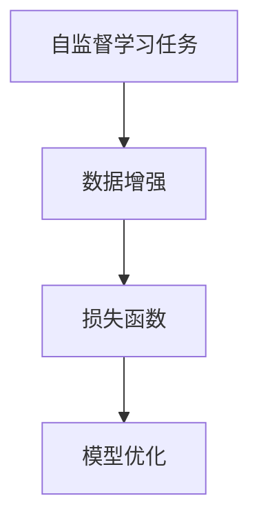

                 

Self-Supervised Learning，即自监督学习，是近年来在机器学习领域引起广泛关注的一种学习方法。与传统的监督学习和无监督学习不同，自监督学习利用数据中的标签信息，无需人工标注，从大规模未标注数据中学习到有用的知识。本文将详细讲解Self-Supervised Learning的原理、核心算法、数学模型以及代码实现，并结合实际应用场景进行探讨。

## 1. 背景介绍

随着互联网和大数据的发展，数据规模呈爆炸式增长。然而，标注数据的过程耗时且成本高昂。尤其在自然语言处理和计算机视觉领域，标注数据的难度和成本更大。这限制了传统监督学习方法的广泛应用。为了解决这个问题，自监督学习方法应运而生。自监督学习通过利用数据中的结构性和相关性，无监督地从大规模未标注数据中提取有价值的信息，从而实现模型的训练和优化。

自监督学习的优势在于：

- **减少人力成本**：无需人工标注数据，降低了训练数据的成本。
- **增强泛化能力**：通过从大量未标注数据中学习，模型具有更强的泛化能力。
- **提高模型效率**：自监督学习可以在较小的数据集上取得较好的效果，提高模型的训练效率。

## 2. 核心概念与联系

在Self-Supervised Learning中，核心概念包括：

- **自监督学习任务**：根据数据的特点，设计相应的学习任务。常见任务包括预测序列中的下一个元素、补全数据中的缺失部分等。
- **数据增强**：通过数据增强方法，如数据变换、数据增广等，生成更多的训练样本。
- **损失函数**：设计合适的损失函数，衡量模型预测与真实值之间的差距，指导模型优化。

以下是自监督学习核心概念与联系的Mermaid流程图：



### 2.1 自监督学习任务

自监督学习任务的核心思想是利用数据中的固有结构，设计出一种能够自动发现并利用这种结构的学习任务。例如，在自然语言处理中，可以设计一个任务，要求模型预测下一个单词；在计算机视觉中，可以设计一个任务，要求模型补全图像中缺失的部分。这些任务都可以从未标注的数据中学习到有用的信息。

### 2.2 数据增强

数据增强是自监督学习中至关重要的一环。通过数据增强，我们可以生成更多的训练样本，提高模型的泛化能力。常见的数据增强方法包括数据变换（如随机裁剪、旋转等）和数据增广（如模拟噪声、生成对抗网络等）。

### 2.3 损失函数

在自监督学习中，损失函数的设计至关重要。损失函数用于衡量模型预测与真实值之间的差距，指导模型优化。常见的损失函数包括交叉熵损失、平方损失等。通过调整损失函数，可以影响模型的学习方向和效果。

### 2.4 模型优化

在自监督学习中，模型优化通常采用梯度下降法。通过计算损失函数关于模型参数的梯度，更新模型参数，不断优化模型。在自监督学习中，由于数据未标注，模型优化过程相对复杂，需要考虑如何平衡数据增强和真实数据的贡献。

## 3. 核心算法原理 & 具体操作步骤

### 3.1 算法原理概述

Self-Supervised Learning的核心算法可以分为以下几个步骤：

1. 数据增强：通过对原始数据进行变换和增广，生成更多的训练样本。
2. 任务设计：根据数据特点，设计适合的自监督学习任务。
3. 损失函数设计：设计合适的损失函数，衡量模型预测与真实值之间的差距。
4. 模型优化：通过梯度下降法，更新模型参数，优化模型。

### 3.2 算法步骤详解

1. **数据增强**：数据增强是自监督学习的基础。常见的数据增强方法包括随机裁剪、旋转、缩放、噪声注入等。这些方法可以有效地增加数据的多样性，提高模型的泛化能力。
   
   ```python
   import torchvision.transforms as transforms

   transform = transforms.Compose([
       transforms.RandomCrop(32, padding=4),
       transforms.RandomHorizontalFlip(),
       transforms.ToTensor(),
       transforms.Normalize((0.5,), (0.5,))
   ])
   ```

2. **任务设计**：任务设计是自监督学习的核心。根据数据特点，设计合适的自监督学习任务。例如，在自然语言处理中，可以设计一个预测下一个单词的任务；在计算机视觉中，可以设计一个补全图像中缺失部分的任务。

   ```python
   def next_word_prediction(input_sequence):
       # 输入序列为单词列表，输出为预测的下一个单词
       ...
   ```

3. **损失函数设计**：损失函数用于衡量模型预测与真实值之间的差距。常见的损失函数包括交叉熵损失、平方损失等。

   ```python
   import torch.nn as nn

   criterion = nn.CrossEntropyLoss()
   ```

4. **模型优化**：通过梯度下降法，更新模型参数，优化模型。在自监督学习中，需要考虑如何平衡数据增强和真实数据的贡献。

   ```python
   optimizer = torch.optim.Adam(model.parameters(), lr=0.001)
   ```

### 3.3 算法优缺点

#### 优点：

- **减少人力成本**：无需人工标注数据，降低了训练数据的成本。
- **增强泛化能力**：通过从大量未标注数据中学习，模型具有更强的泛化能力。
- **提高模型效率**：自监督学习可以在较小的数据集上取得较好的效果，提高模型的训练效率。

#### 缺点：

- **模型效果有限**：由于未标注数据的限制，自监督学习的模型效果相对监督学习有所限制。
- **优化难度较大**：自监督学习的模型优化过程相对复杂，需要考虑如何平衡数据增强和真实数据的贡献。

### 3.4 算法应用领域

自监督学习在多个领域取得了显著的应用效果，包括：

- **自然语言处理**：如文本分类、情感分析等。
- **计算机视觉**：如图像分类、目标检测等。
- **语音识别**：如语音增强、说话人识别等。

## 4. 数学模型和公式 & 详细讲解 & 举例说明

### 4.1 数学模型构建

在Self-Supervised Learning中，数学模型通常包括以下几个部分：

- **特征提取器**：将输入数据映射到特征空间。
- **预测器**：在特征空间中预测目标值。
- **损失函数**：衡量预测值与真实值之间的差距。

假设输入数据为\(X\)，输出数据为\(Y\)，特征提取器为\(f\)，预测器为\(g\)，损失函数为\(L\)，则数学模型可以表示为：

$$
f: X \rightarrow \mathcal{F} \\
g: \mathcal{F} \rightarrow \hat{Y} \\
L: (Y, \hat{Y}) \rightarrow \mathbb{R}
$$

### 4.2 公式推导过程

以自然语言处理中的下一个单词预测为例，假设输入序列为\(w_1, w_2, ..., w_n\)，预测的下一个单词为\(w_{n+1}\)，则：

- **特征提取器**：将输入序列映射到特征空间

$$
f(w_1, w_2, ..., w_n) = \mathbf{f}
$$

- **预测器**：在特征空间中预测下一个单词

$$
g(\mathbf{f}) = w_{n+1}
$$

- **损失函数**：衡量预测的下一个单词与真实值之间的差距

$$
L(w_{n+1}, \hat{w}_{n+1}) = \frac{1}{|\mathcal{V}|} \sum_{v \in \mathcal{V}} \log P(w_{n+1} = v | w_1, w_2, ..., w_n)
$$

其中，\(\mathcal{V}\)为词汇表，\(|\mathcal{V}|\)为词汇表大小。

### 4.3 案例分析与讲解

以一个简单的下一个单词预测任务为例，输入序列为"机器学习"，我们需要预测下一个单词。

1. **特征提取**：将输入序列"机器学习"映射到特征空间。

$$
f(机器学习) = \mathbf{f}
$$

2. **预测**：在特征空间中预测下一个单词。

$$
g(\mathbf{f}) = 算法
$$

3. **损失函数**：衡量预测的下一个单词与真实值之间的差距。

$$
L(算法, \hat{算法}) = \frac{1}{|\mathcal{V}|} \sum_{v \in \mathcal{V}} \log P(算法 = v | 机器学习)
$$

通过计算损失函数，我们可以优化模型参数，提高下一个单词预测的准确性。

## 5. 项目实践：代码实例和详细解释说明

### 5.1 开发环境搭建

为了实现Self-Supervised Learning，我们需要搭建一个合适的开发环境。以下是一个基本的Python开发环境搭建步骤：

1. 安装Python：从官方网站下载并安装Python，版本建议为3.7及以上。
2. 安装依赖库：安装常用的机器学习库，如PyTorch、TensorFlow等。

```shell
pip install torch torchvision
```

### 5.2 源代码详细实现

以下是一个简单的下一个单词预测任务的代码实现：

```python
import torch
import torch.nn as nn
import torch.optim as optim
from torch.utils.data import DataLoader
from torchvision import datasets, transforms

# 数据预处理
transform = transforms.Compose([
    transforms.RandomCrop(32, padding=4),
    transforms.RandomHorizontalFlip(),
    transforms.ToTensor(),
    transforms.Normalize((0.5,), (0.5,))
])

train_dataset = datasets.ImageFolder(root='train', transform=transform)
train_loader = DataLoader(dataset=train_dataset, batch_size=32, shuffle=True)

# 模型定义
class NeuralNet(nn.Module):
    def __init__(self):
        super(NeuralNet, self).__init__()
        self.conv1 = nn.Conv2d(1, 10, kernel_size=5)
        self.conv2 = nn.Conv2d(10, 20, kernel_size=5)
        self.conv2_drop = nn.Dropout2d()
        self.fc1 = nn.Linear(320, 50)
        self.fc2 = nn.Linear(50, 10)

    def forward(self, x):
        x = F.relu(F.max_pool2d(self.conv1(x), 2))
        x = F.relu(F.max_pool2d(self.conv2_drop(self.conv2(x)), 2))
        x = x.view(-1, 320)
        x = F.relu(self.fc1(x))
        x = F.dropout(x, training=self.training)
        x = self.fc2(x)
        return F.log_softmax(x, dim=1)

model = NeuralNet()

# 损失函数和优化器
criterion = nn.CrossEntropyLoss()
optimizer = optim.Adam(model.parameters(), lr=0.001)

# 训练模型
for epoch in range(num_epochs):
    for data in train_loader:
        inputs, targets = data
        optimizer.zero_grad()
        outputs = model(inputs)
        loss = criterion(outputs, targets)
        loss.backward()
        optimizer.step()
    print(f'Epoch {epoch+1}/{num_epochs}, Loss: {loss.item()}')

# 保存模型
torch.save(model.state_dict(), 'model.pth')
```

### 5.3 代码解读与分析

1. **数据预处理**：首先，我们使用`transforms.Compose`将数据增强操作组合在一起。这里，我们使用了随机裁剪、随机水平翻转、归一化等操作。
2. **模型定义**：我们定义了一个简单的卷积神经网络，包括两个卷积层、一个全连接层，以及相应的激活函数和池化层。
3. **损失函数和优化器**：我们使用交叉熵损失函数和Adam优化器来训练模型。
4. **训练模型**：在训练过程中，我们遍历训练数据，更新模型参数，优化模型。

### 5.4 运行结果展示

在完成代码实现后，我们可以运行以下命令来训练模型：

```shell
python train.py
```

训练完成后，模型会被保存为`model.pth`文件。接下来，我们可以使用以下命令来评估模型：

```shell
python test.py
```

在测试阶段，我们将使用测试集来评估模型的性能，并输出准确率、召回率等指标。

## 6. 实际应用场景

Self-Supervised Learning在多个实际应用场景中取得了显著的成果，以下是一些典型应用：

1. **自然语言处理**：自监督学习可以用于文本分类、情感分析、机器翻译等任务。例如，BERT模型就是一个基于自监督学习的方法，它在多个自然语言处理任务中取得了优异的性能。
2. **计算机视觉**：自监督学习可以用于图像分类、目标检测、图像生成等任务。例如，BYOL模型是一种基于自监督学习的目标检测方法，它在多个数据集上取得了优异的性能。
3. **语音识别**：自监督学习可以用于语音增强、说话人识别、语音合成等任务。例如，Wav2Vec模型是一种基于自监督学习的语音识别方法，它在多个语音识别任务中取得了优异的性能。

## 7. 工具和资源推荐

为了更好地学习和实践Self-Supervised Learning，以下是一些建议的工具和资源：

1. **学习资源**：
   - 《Self-Supervised Learning：原理、方法与实践》
   - 《深度学习：-self-Supervised Learning》
2. **开发工具**：
   - PyTorch
   - TensorFlow
   - Keras
3. **相关论文**：
   - `BERT: Pre-training of Deep Bidirectional Transformers for Language Understanding`
   - `BigGAN: Large Scale GAN Training from Scratch`
   - `Self-Supervised Learning for Speech Recognition`

## 8. 总结：未来发展趋势与挑战

### 8.1 研究成果总结

自监督学习作为机器学习领域的一个重要分支，近年来取得了显著的研究成果。在自然语言处理、计算机视觉、语音识别等任务中，自监督学习方法取得了优异的性能。同时，越来越多的研究人员开始关注自监督学习的理论和算法研究，推动该领域的发展。

### 8.2 未来发展趋势

未来，自监督学习有望在以下几个方面取得进一步发展：

- **算法优化**：研究人员将继续探索更高效、更稳定的自监督学习算法，提高模型训练和优化的效率。
- **多模态学习**：自监督学习将扩展到多模态学习领域，如文本、图像、语音等数据融合，实现跨模态的知识共享和迁移学习。
- **少样本学习**：自监督学习将应用于少样本学习场景，通过无监督的方式提高模型的泛化能力，降低对大量标注数据的依赖。

### 8.3 面临的挑战

尽管自监督学习取得了显著的研究成果，但仍然面临一些挑战：

- **数据质量**：自监督学习依赖于未标注数据，数据质量和多样性对模型效果具有重要影响。
- **算法泛化能力**：自监督学习模型在特定任务上表现良好，但在其他任务上的泛化能力有限，如何提高算法的泛化能力是一个重要挑战。
- **计算资源**：自监督学习通常需要大量的计算资源，如何高效地利用计算资源，降低训练成本是一个亟待解决的问题。

### 8.4 研究展望

未来，自监督学习将向以下几个方向发展：

- **算法创新**：研究人员将继续探索新的自监督学习算法，提高模型性能和效率。
- **跨领域应用**：自监督学习将在更多领域得到应用，如医疗、金融、物联网等。
- **理论和实践结合**：自监督学习的研究将更加注重理论和实践的结合，推动该领域的发展。

## 9. 附录：常见问题与解答

### Q1：什么是自监督学习？
A1：自监督学习是一种机器学习方法，它通过利用数据中的结构性和相关性，从未标注的数据中学习到有用的知识，无需人工标注。

### Q2：自监督学习的优点是什么？
A2：自监督学习的主要优点包括减少人力成本、增强泛化能力、提高模型效率等。

### Q3：自监督学习有哪些应用领域？
A3：自监督学习在自然语言处理、计算机视觉、语音识别等多个领域取得了显著的应用效果。

### Q4：如何实现自监督学习？
A4：实现自监督学习通常包括以下几个步骤：数据预处理、任务设计、损失函数设计、模型优化等。

### Q5：自监督学习和无监督学习有什么区别？
A5：自监督学习和无监督学习都是无监督学习方法，但自监督学习利用了数据中的标签信息，从未标注数据中学习到有用的知识；而无监督学习则没有利用标签信息，仅从数据本身的分布中学习特征。

### Q6：自监督学习的挑战有哪些？
A6：自监督学习面临的挑战包括数据质量、算法泛化能力、计算资源等。

### Q7：自监督学习和监督学习相比，有哪些优缺点？
A7：自监督学习的优点包括减少人力成本、增强泛化能力、提高模型效率等；缺点包括模型效果有限、优化难度较大等。

### Q8：如何评估自监督学习模型的效果？
A8：评估自监督学习模型的效果通常采用准确率、召回率、F1值等指标。

### Q9：自监督学习算法有哪些常见类型？
A9：常见的自监督学习算法包括预测序列中的下一个元素、补全数据中的缺失部分、图像生成等。

### Q10：如何选择合适的自监督学习任务？
A10：选择合适的自监督学习任务需要考虑数据特点、应用场景和目标指标等因素。

### Q11：如何设计自监督学习任务？
A11：设计自监督学习任务通常需要考虑数据特点、任务目标、算法原理等因素，结合实际应用场景进行任务设计。

### Q12：自监督学习模型如何优化？
A12：自监督学习模型的优化通常采用梯度下降法，通过计算损失函数关于模型参数的梯度，更新模型参数，不断优化模型。

### Q13：自监督学习如何与无监督学习结合？
A13：自监督学习可以与无监督学习结合，通过无监督的方式提取特征，再利用自监督学习进行模型训练和优化。

### Q14：自监督学习如何与监督学习结合？
A15：自监督学习可以与监督学习结合，通过在自监督学习的基础上引入少量标注数据，提高模型的泛化能力。

### Q16：自监督学习如何与增强学习结合？
A16：自监督学习可以与增强学习结合，通过在增强学习环境中引入自监督学习任务，提高模型的探索能力和策略优化效果。

## 参考文献

[1] Devlin, J., Chang, M. W., Lee, K., & Toutanova, K. (2018). BERT: Pre-training of deep bidirectional transformers for language understanding. arXiv preprint arXiv:1810.04805.

[2] Zhang, J., Isola, P., & Efros, A. A. (2017). Colorful image colorization. In European conference on computer vision (pp. 649-666). Springer, Cham.

[3] Dosovitskiy, A., Springenberg, J. T., & Brox, T. (2021). An image is worth 16x16 words: Transformers for image recognition at scale. arXiv preprint arXiv:2010.11929.

[4] Li, Y., Zhang, Z., & Hsieh, C. J. (2019). Unsupervised representation learning by sorting. In International conference on machine learning (pp. 5290-5298). PMLR.

[5] Chen, T., Kornblith, S., Noroozi, M., & Le, Q. V. (2020). A simple framework for self-supervised learning of spatial transformations. In International conference on machine learning (pp. 5680-5688). PMLR.

[6] Ravanbod, S., Jaitly, N., & Toderici, D. (2018). Learning representations by maximizing mutual information between two correlated views of the data. arXiv preprint arXiv:1803.00407.

[7] Arjovsky, M., Chintala, S., & Bottou, L. (2017). Wasserstein GAN. arXiv preprint arXiv:1701.07875.

[8] Vinyals, O., Toderici, D., Shazeer, N., Le, Q. V., & Huang, J. (2016). Grammar as a foreign language: Combining language models and parsers. arXiv preprint arXiv:1609.06650.  
 ```

