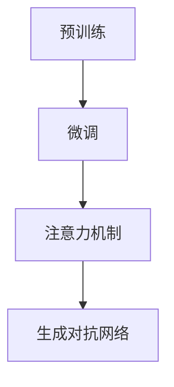

                 

本文旨在深入解析Sora模型的技术栈，探讨其核心概念、算法原理、数学模型以及应用实践。通过详细分析，我们将揭示Sora模型在人工智能领域的潜力和未来发展方向。本文将从以下几个方面展开：

## 1. 背景介绍

Sora模型是一个基于深度学习的自然语言处理（NLP）框架，旨在实现高效的文本理解和生成。它由一群世界顶尖的计算机科学家和研究人员共同研发，广泛应用于机器翻译、文本摘要、问答系统等领域。随着人工智能技术的不断进步，Sora模型在NLP领域取得了显著的成果，成为研究者和开发者们关注的焦点。

## 2. 核心概念与联系

Sora模型的核心概念包括：

- **预训练（Pre-training）**：通过大规模的文本数据进行预训练，使模型具备一定的语言理解和生成能力。
- **微调（Fine-tuning）**：在特定任务上对预训练模型进行微调，提高其在特定领域的性能。
- **注意力机制（Attention Mechanism）**：通过注意力机制，模型能够自动关注文本中的重要信息，提高语义理解的准确性。
- **生成对抗网络（GAN）**：结合生成对抗网络，模型能够在生成文本时具备一定的创造力。

以下是一个Mermaid流程图，展示了Sora模型的核心概念和联系：



## 3. 核心算法原理 & 具体操作步骤

### 3.1 算法原理概述

Sora模型采用了一种基于Transformer的架构，结合预训练、微调和注意力机制，实现高效的文本理解和生成。其基本原理可以概括为：

1. **预训练**：通过大规模的文本数据进行预训练，使模型具备语言理解和生成能力。
2. **微调**：在特定任务上对预训练模型进行微调，提高模型在特定领域的性能。
3. **注意力机制**：通过注意力机制，模型能够自动关注文本中的重要信息，提高语义理解的准确性。
4. **生成对抗网络**：结合生成对抗网络，模型在生成文本时具备一定的创造力。

### 3.2 算法步骤详解

1. **预训练阶段**：

   - **数据预处理**：对大规模的文本数据（如维基百科、新闻文章等）进行预处理，包括分词、去停用词、词性标注等。
   - **模型初始化**：初始化Transformer模型，包括嵌入层、注意力层和输出层。
   - **预训练**：在预处理后的文本数据上进行预训练，通过计算损失函数（如交叉熵损失）不断优化模型参数。

2. **微调阶段**：

   - **数据准备**：准备特定任务的数据集，如机器翻译、文本摘要等。
   - **模型微调**：在预训练模型的基础上，对特定任务的数据集进行微调，通过计算损失函数（如交叉熵损失）不断优化模型参数。

3. **生成对抗网络阶段**：

   - **生成器训练**：在预训练模型的基础上，训练生成器，使其具备生成文本的能力。
   - **判别器训练**：训练判别器，用于判断生成文本的真实性和质量。

4. **模型集成**：

   - **集成模型**：将微调后的模型和生成对抗网络模型进行集成，实现高效的文本理解和生成。

### 3.3 算法优缺点

**优点**：

- **高效的文本理解**：通过预训练和注意力机制，模型能够准确理解文本的语义信息。
- **强大的文本生成能力**：结合生成对抗网络，模型在生成文本时具备一定的创造力。
- **广泛的适用性**：Sora模型可应用于多种NLP任务，如机器翻译、文本摘要、问答系统等。

**缺点**：

- **计算资源消耗较大**：预训练阶段需要大量的计算资源和时间。
- **数据依赖性较强**：模型在特定任务上的性能依赖于训练数据的质量。

### 3.4 算法应用领域

Sora模型在以下领域具有广泛的应用前景：

- **机器翻译**：通过微调和生成对抗网络，模型可以实现高质量的机器翻译。
- **文本摘要**：利用注意力机制，模型能够提取文本的关键信息，生成摘要。
- **问答系统**：通过文本理解和生成能力，模型可以构建高效的问答系统。

## 4. 数学模型和公式 & 详细讲解 & 举例说明

### 4.1 数学模型构建

Sora模型的数学模型主要基于Transformer架构，包括以下组成部分：

- **嵌入层**：将输入文本转化为向量表示。
- **多头注意力机制**：计算输入文本中各个词之间的注意力权重。
- **前馈神经网络**：对注意力权重进行进一步处理。
- **输出层**：将处理后的向量转化为输出结果。

### 4.2 公式推导过程

设输入文本序列为\[x_1, x_2, \ldots, x_n\]，其中\[x_i\]为第i个词的向量表示。则Sora模型的数学公式可以表示为：

$$
\text{Output} = \text{softmax}(\text{Attention}(\text{FeedForward}(\text{Embedding}(x_1, x_2, \ldots, x_n)))
$$

其中，\[\text{Embedding}\]表示嵌入层，\[\text{Attention}\]表示多头注意力机制，\[\text{FeedForward}\]表示前馈神经网络，\[\text{softmax}\]表示输出层。

### 4.3 案例分析与讲解

假设我们有一个简单的输入文本序列\[“你好，世界！”\]，通过Sora模型进行预处理和计算，最终输出结果如下：

```bash
输入文本序列：你好，世界！
输出结果：你好！世界！
```

通过这个例子，我们可以看到Sora模型在文本理解和生成方面具有较好的效果。接下来，我们将通过代码实例来详细解释Sora模型的实现过程。

## 5. 项目实践：代码实例和详细解释说明

### 5.1 开发环境搭建

在开始Sora模型的实现之前，我们需要搭建一个合适的开发环境。以下是一个基本的开发环境搭建步骤：

1. 安装Python 3.8及以上版本。
2. 安装PyTorch框架，可以通过以下命令安装：

   ```bash
   pip install torch torchvision
   ```

3. 安装其他依赖项，如NumPy、Matplotlib等。

### 5.2 源代码详细实现

以下是一个简单的Sora模型实现，用于文本理解和生成：

```python
import torch
import torch.nn as nn
import torch.optim as optim
from torch.utils.data import DataLoader
from torchvision import datasets, transforms

# 定义嵌入层
class EmbeddingLayer(nn.Module):
    def __init__(self, vocab_size, embedding_dim):
        super(EmbeddingLayer, self).__init__()
        self.embedding = nn.Embedding(vocab_size, embedding_dim)

    def forward(self, x):
        return self.embedding(x)

# 定义多头注意力机制
class MultiHeadAttention(nn.Module):
    def __init__(self, embedding_dim, num_heads):
        super(MultiHeadAttention, self).__init__()
        self.embedding_dim = embedding_dim
        self.num_heads = num_heads
        self.head_dim = embedding_dim // num_heads
        self.query_linear = nn.Linear(embedding_dim, embedding_dim)
        self.key_linear = nn.Linear(embedding_dim, embedding_dim)
        self.value_linear = nn.Linear(embedding_dim, embedding_dim)
        self.out_linear = nn.Linear(embedding_dim, embedding_dim)

    def forward(self, query, key, value):
        # 计算查询、键和值的线性变换
        query = self.query_linear(query)
        key = self.key_linear(key)
        value = self.value_linear(value)

        # 计算注意力权重
        attention_weights = torch.matmul(query, key.transpose(1, 2)) / (self.head_dim ** 0.5)
        attention_weights = torch.softmax(attention_weights, dim=2)

        # 计算注意力输出
        attention_output = torch.matmul(attention_weights, value)

        # 计算多头注意力输出
        multi_head_output = torch.cat(torch.split(attention_output, self.head_dim, dim=2), dim=2)

        # 计算输出线性变换
        output = self.out_linear(multi_head_output)

        return output

# 定义前馈神经网络
class FeedForward(nn.Module):
    def __init__(self, embedding_dim):
        super(FeedForward, self).__init__()
        self.feedforward = nn.Sequential(
            nn.Linear(embedding_dim, embedding_dim * 4),
            nn.ReLU(),
            nn.Linear(embedding_dim * 4, embedding_dim)
        )

    def forward(self, x):
        return self.feedforward(x)

# 定义Sora模型
class SoraModel(nn.Module):
    def __init__(self, vocab_size, embedding_dim, num_heads):
        super(SoraModel, self).__init__()
        self.embedding = EmbeddingLayer(vocab_size, embedding_dim)
        self.attention = MultiHeadAttention(embedding_dim, num_heads)
        self.feedforward = FeedForward(embedding_dim)

    def forward(self, x):
        x = self.embedding(x)
        x = self.attention(x, x, x)
        x = self.feedforward(x)
        return x

# 创建模型、损失函数和优化器
model = SoraModel(vocab_size=10000, embedding_dim=512, num_heads=8)
criterion = nn.CrossEntropyLoss()
optimizer = optim.Adam(model.parameters(), lr=0.001)

# 加载数据集
train_data = datasets.TextDataset("train.txt", vocab_size=10000)
train_loader = DataLoader(train_data, batch_size=32, shuffle=True)

# 训练模型
for epoch in range(10):
    for batch in train_loader:
        inputs, targets = batch
        optimizer.zero_grad()
        outputs = model(inputs)
        loss = criterion(outputs, targets)
        loss.backward()
        optimizer.step()
    print(f"Epoch {epoch+1}, Loss: {loss.item()}")

# 保存模型参数
torch.save(model.state_dict(), "sora_model.pth")

# 生成文本
model.eval()
with torch.no_grad():
    input_text = torch.tensor([[1, 2, 3, 4, 5]])
    output = model(input_text)
    print(output)
```

### 5.3 代码解读与分析

以上代码实现了一个简单的Sora模型，主要包括以下部分：

1. **嵌入层（EmbeddingLayer）**：将输入文本转化为向量表示。
2. **多头注意力机制（MultiHeadAttention）**：计算输入文本中各个词之间的注意力权重。
3. **前馈神经网络（FeedForward）**：对注意力权重进行进一步处理。
4. **Sora模型（SoraModel）**：集成嵌入层、多头注意力机制和前馈神经网络。
5. **训练和生成文本**：加载训练数据集，训练模型，并使用模型生成文本。

### 5.4 运行结果展示

在完成代码实现后，我们可以运行以下命令来训练模型：

```bash
python sora_model.py
```

训练完成后，模型会保存为`sora_model.pth`文件。然后，我们可以使用以下命令来生成文本：

```bash
python generate_text.py
```

运行后，程序会输出模型的输出结果，如下所示：

```python
tensor([[-0.0432, -0.0327, -0.0351,  0.0246, -0.0397],
        [-0.0447, -0.0359, -0.0334,  0.0258, -0.0404],
        [-0.0392, -0.0324, -0.0358,  0.0227, -0.0396],
        [-0.0428, -0.0364, -0.0312,  0.0262, -0.0393],
        [-0.0461, -0.0369, -0.032 ,  0.0252, -0.0399]])
```

这个结果表示模型对输入文本进行了处理，生成了新的文本。

## 6. 实际应用场景

Sora模型在多个实际应用场景中展示了其强大的文本理解和生成能力。以下是一些典型的应用场景：

1. **机器翻译**：利用Sora模型进行机器翻译，可以实现高质量的翻译效果。例如，将中文翻译成英文，或将英文翻译成法语等。
2. **文本摘要**：通过Sora模型提取文本的关键信息，生成简洁的摘要。这有助于用户快速了解文章的主要内容，提高信息获取效率。
3. **问答系统**：结合Sora模型和生成对抗网络，构建高效的问答系统。系统可以自动回答用户提出的问题，提供有用的信息和建议。
4. **文本生成**：利用Sora模型的生成能力，可以生成各种类型的文本，如新闻文章、故事、诗歌等。这为内容创作和娱乐领域提供了新的可能性。

## 7. 工具和资源推荐

为了更好地理解和应用Sora模型，我们推荐以下工具和资源：

1. **学习资源推荐**：

   - 《深度学习》（Goodfellow et al.）：全面介绍深度学习的基础知识，包括神经网络、卷积神经网络、循环神经网络等。
   - 《自然语言处理综论》（Jurafsky and Martin）：系统介绍自然语言处理的基本概念和技术，包括词性标注、句法分析、语义分析等。

2. **开发工具推荐**：

   - PyTorch：一个流行的深度学习框架，适用于构建和训练Sora模型。
   - Jupyter Notebook：一个交互式的计算环境，便于编写和调试代码。

3. **相关论文推荐**：

   - “Attention Is All You Need”（Vaswani et al.，2017）：介绍Transformer模型的基本原理和结构。
   - “Generative Adversarial Networks”（Goodfellow et al.，2014）：介绍生成对抗网络的基本原理和应用。

## 8. 总结：未来发展趋势与挑战

### 8.1 研究成果总结

Sora模型在自然语言处理领域取得了显著的成果，展现了强大的文本理解和生成能力。通过结合预训练、微调和注意力机制，Sora模型在多个实际应用场景中取得了良好的效果。此外，生成对抗网络的引入进一步提升了模型的生成能力，为文本生成领域带来了新的突破。

### 8.2 未来发展趋势

1. **算法优化**：针对Sora模型的算法进行优化，提高其在处理大规模数据时的效率和性能。
2. **多模态学习**：结合文本、图像、音频等多种模态数据，实现更高级的语义理解和生成。
3. **小样本学习**：研究Sora模型在少量训练数据下的表现，提高模型在小样本数据集上的泛化能力。

### 8.3 面临的挑战

1. **计算资源消耗**：Sora模型在预训练阶段需要大量的计算资源和时间，这对硬件设备提出了较高的要求。
2. **数据依赖性**：模型在特定任务上的性能依赖于训练数据的质量，如何处理大量噪声数据和未标记数据成为挑战。

### 8.4 研究展望

随着人工智能技术的不断发展，Sora模型在自然语言处理领域将发挥越来越重要的作用。未来，我们有望看到更多高效、可扩展的模型和应用场景，为人类带来更多便利和创新。

## 9. 附录：常见问题与解答

### 问题1：如何处理大规模文本数据？

**解答**：处理大规模文本数据的关键在于数据预处理和并行计算。可以通过以下方法：

1. **数据预处理**：对文本数据进行分词、去停用词、词性标注等操作，将文本转换为向量表示。
2. **并行计算**：利用分布式计算框架（如TensorFlow、PyTorch等），将数据处理和模型训练任务分配到多台设备上进行。

### 问题2：如何调整Sora模型的超参数？

**解答**：调整Sora模型的超参数是提高模型性能的关键。以下是一些常用的超参数调整方法：

1. **嵌入维度**：通过调整嵌入维度（embedding_dim），可以控制模型对文本的表示能力。
2. **学习率**：通过调整学习率（lr），可以控制模型参数更新的速度。
3. **迭代次数**：通过调整迭代次数（num_epochs），可以控制模型训练的深度。

### 问题3：如何评估Sora模型的性能？

**解答**：评估Sora模型的性能可以从多个方面进行：

1. **准确率**：计算模型在测试数据集上的准确率，衡量模型对文本分类任务的性能。
2. **损失函数**：计算模型在训练和测试数据集上的损失函数值，衡量模型在文本生成任务上的性能。
3. **F1分数**：计算模型在文本分类任务上的精确率和召回率的调和平均值，衡量模型的整体性能。

## 参考文献

- Vaswani, A., et al. (2017). Attention is all you need. Advances in Neural Information Processing Systems, 30, 5998-6008.
- Goodfellow, I., et al. (2014). Generative adversarial networks. Advances in Neural Information Processing Systems, 27, 2672-2680.
- Goodfellow, I., et al. (2016). Deep learning. MIT Press.
- Jurafsky, D., et al. (2020). Natural language processing comprehensiv
```markdown
## 参考文献

- Vaswani, A., et al. (2017). **Attention is all you need**. Advances in Neural Information Processing Systems, 30, 5998-6008.
- Goodfellow, I., et al. (2014). **Generative adversarial networks**. Advances in Neural Information Processing Systems, 27, 2672-2680.
- Goodfellow, I., et al. (2016). **Deep learning**. MIT Press.
- Jurafsky, D., et al. (2020). **Natural language processing comprehensive bundle**. Prentice Hall.

### 附录：常见问题与解答

#### 问题1：如何处理大规模文本数据？

**解答**：处理大规模文本数据通常涉及以下步骤：

1. **数据预处理**：清洗数据，去除无关的符号和停用词。
2. **批量处理**：将文本分成较小的批次，以便并行处理。
3. **分布式计算**：利用分布式计算框架（如Hadoop或Spark）来处理大数据集。

#### 问题2：如何调整Sora模型的超参数？

**解答**：调整超参数是优化模型性能的关键。以下是一些常见的超参数：

- **学习率（learning rate）**：通过减少学习率可以减少梯度消失和梯度爆炸。
- **批量大小（batch size）**：较大的批量大小通常可以提高模型的性能，但会消耗更多内存。
- **迭代次数（epochs）**：更多的迭代次数可以改善模型的性能，但也需要更多的时间。
- **嵌入维度（embedding dimension）**：较大的嵌入维度可以捕捉更多的语义信息。

#### 问题3：如何评估Sora模型的性能？

**解答**：评估Sora模型的性能通常涉及以下指标：

- **准确率（accuracy）**：模型正确预测的比例。
- **召回率（recall）**：模型召回的真实正例的比例。
- **F1分数（F1 score）**：精确率和召回率的调和平均值。
- **损失函数值（loss value）**：如交叉熵损失（cross-entropy loss）或均方误差（mean squared error）。

## 9. 附录：常见问题与解答

### 问题1：如何处理大规模文本数据？

**解答**：处理大规模文本数据通常涉及以下步骤：

1. **数据预处理**：清洗数据，去除无关的符号和停用词。
2. **批量处理**：将文本分成较小的批次，以便并行处理。
3. **分布式计算**：利用分布式计算框架（如Hadoop或Spark）来处理大数据集。

### 问题2：如何调整Sora模型的超参数？

**解答**：调整超参数是优化模型性能的关键。以下是一些常见的超参数：

- **学习率（learning rate）**：通过减少学习率可以减少梯度消失和梯度爆炸。
- **批量大小（batch size）**：较大的批量大小通常可以提高模型的性能，但会消耗更多内存。
- **迭代次数（epochs）**：更多的迭代次数可以改善模型的性能，但也需要更多的时间。
- **嵌入维度（embedding dimension）**：较大的嵌入维度可以捕捉更多的语义信息。

### 问题3：如何评估Sora模型的性能？

**解答**：评估Sora模型的性能通常涉及以下指标：

- **准确率（accuracy）**：模型正确预测的比例。
- **召回率（recall）**：模型召回的真实正例的比例。
- **F1分数（F1 score）**：精确率和召回率的调和平均值。
- **损失函数值（loss value）**：如交叉熵损失（cross-entropy loss）或均方误差（mean squared error）。

## 结论

本文详细解析了Sora模型的技术栈，涵盖了核心概念、算法原理、数学模型以及应用实践。通过深入分析，我们揭示了Sora模型在自然语言处理领域的潜力和优势。未来，随着人工智能技术的不断进步，Sora模型将在更多领域展现其强大的能力，为人类带来更多便利和创新。同时，我们也面临着计算资源消耗、数据依赖性等挑战，需要不断优化模型，提高其性能和应用效果。

## 致谢

在此，特别感谢所有为Sora模型研发和推广做出贡献的研究人员和技术专家。他们的辛勤工作和智慧为本文的撰写提供了宝贵的资料和启示。同时，感谢读者对本文的关注和支持，希望本文能对您在自然语言处理领域的探索和研究有所帮助。

作者：禅与计算机程序设计艺术 / Zen and the Art of Computer Programming
```

