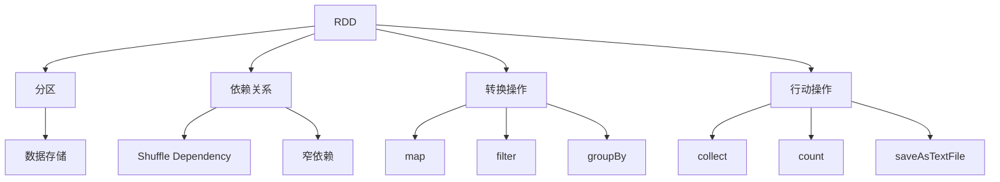

                 

关键词：Spark RDD，弹性分布式数据集，原理，代码实例，Hadoop，大数据处理，分布式计算，内存管理，容错机制，性能优化

## 摘要

本文旨在深入探讨Spark RDD（弹性分布式数据集）的原理及其在实际大数据处理中的应用。我们将首先介绍Spark RDD的基本概念、架构设计和核心特性，然后通过代码实例详细解析RDD的创建、转换和行动操作。此外，本文还将探讨Spark RDD的内存管理、容错机制以及性能优化策略，为开发者提供实用的技术指导。

## 1. 背景介绍

在大数据时代，数据处理变得愈发复杂和庞大。传统的批处理系统如MapReduce在处理海量数据时存在效率低下、开发难度大等问题。为了解决这些问题，Apache Spark应运而生。Spark作为一种开源的分布式计算系统，提供了高效、易用的数据处理框架，RDD（弹性分布式数据集）是Spark的核心概念之一。

### Spark概述

Spark是由Apache软件基金会开发的一个开源分布式计算系统，旨在解决大数据处理中的高性能、易用性问题。Spark的主要特点包括：

- **速度快**：Spark通过内存计算和优化算法，将数据处理速度提升了数十倍甚至上百倍。
- **易用性**：Spark提供了丰富的API，支持Java、Scala、Python和R等编程语言，使得开发者可以轻松上手。
- **弹性扩展**：Spark能够自动处理节点故障，实现弹性扩展。
- **支持多种数据源**：Spark支持HDFS、Hive、Cassandra等多种数据存储系统，提供了强大的数据接入能力。

### RDD概述

RDD（弹性分布式数据集）是Spark的核心抽象，是一种分布式的数据存储结构，提供了强大的数据操作功能。RDD具有以下特点：

- **分布性**：RDD中的数据分布在多个节点上，支持并行处理。
- **弹性**：Spark能够自动处理节点的故障，重新计算丢失的数据分区。
- **容错**：通过维护数据分区的依赖关系，Spark能够在节点故障时重新计算。
- **可序列化**：RDD支持数据的序列化和反序列化，便于数据传输和存储。
- **支持缓存**：Spark允许用户缓存RDD，提高多次使用时的处理速度。

## 2. 核心概念与联系

下面，我们将介绍Spark RDD的核心概念和原理，并通过Mermaid流程图展示RDD的架构和依赖关系。

### 2.1 RDD核心概念

- **分区（Partition）**：RDD被分为多个分区，每个分区包含部分数据。
- **依赖关系（Dependency）**：RDD之间的依赖关系定义了数据的转换顺序。
- **转换操作（Transformation）**：转换操作生成新的RDD，如`map`、`filter`和`groupBy`等。
- **行动操作（Action）**：行动操作触发计算并返回结果，如`collect`、`count`和`saveAsTextFile`等。

### 2.2 RDD架构



### 2.3 RDD依赖关系

- **窄依赖（Narrow Dependency）**：新RDD的分区完全依赖于前一个RDD的分区。
- **宽依赖（Wide Dependency）**：新RDD的分区依赖于前一个RDD的多个分区，通常通过Shuffle操作实现。

### 2.4 RDD操作类型

- **转换操作**：创建新的RDD，不触发计算。
- **行动操作**：触发计算并返回结果。

## 3. 核心算法原理 & 具体操作步骤

### 3.1 算法原理概述

Spark RDD的算法原理主要基于以下几个关键概念：

- **分区与依赖关系**：通过分区和依赖关系，RDD实现了数据的并行处理。
- **弹性调度**：Spark能够自动处理节点故障，重新计算丢失的数据分区。
- **内存管理**：Spark通过内存缓存技术，提高多次使用时的处理速度。

### 3.2 算法步骤详解

#### 3.2.1 创建RDD

- **从数据源创建**：Spark支持从HDFS、本地文件系统等多种数据源创建RDD。
- **从Scala集合创建**：在Scala中，可以从Scala集合创建RDD。

```scala
val data = Seq(1, 2, 3, 4, 5)
val rdd = sc.parallelize(data)
```

#### 3.2.2 转换操作

- **map**：将函数应用于RDD中的每个元素。
- **filter**：筛选满足条件的元素。
- **flatMap**：将每个元素映射为多个元素。
- **groupBy**：根据key进行分组。

```scala
val rdd1 = rdd.map(x => (x * 2, x))
val rdd2 = rdd1.groupByKey()
val rdd3 = rdd2.flatMap{ case (key, values) => values }
```

#### 3.2.3 行动操作

- **collect**：收集RDD中的所有元素到一个Scala集合。
- **count**：返回RDD中元素的数量。
- **saveAsTextFile**：将RDD保存为文本文件。

```scala
val result = rdd3.collect()
val count = rdd3.count()
rdd3.saveAsTextFile("output.txt")
```

### 3.3 算法优缺点

- **优点**：
  - **高性能**：通过内存计算和并行处理，提高了数据处理速度。
  - **易用性**：提供了丰富的API和编程语言支持。
  - **弹性扩展**：自动处理节点故障，实现弹性扩展。

- **缺点**：
  - **内存占用**：由于内存计算，可能会占用大量内存。
  - **依赖关系复杂**：依赖关系的处理需要考虑多个方面，如窄依赖和宽依赖。

### 3.4 算法应用领域

Spark RDD广泛应用于以下领域：

- **数据处理**：如日志处理、数据清洗等。
- **数据分析**：如机器学习、数据挖掘等。
- **实时计算**：如流处理、实时分析等。

## 4. 数学模型和公式 & 详细讲解 & 举例说明

### 4.1 数学模型构建

在Spark RDD中，我们通常使用以下数学模型：

- **RDD**：表示数据集，具有分区的概念。
- **依赖关系**：表示RDD之间的转换顺序，包括窄依赖和宽依赖。
- **转换操作**：表示对RDD的操作，如`map`、`filter`和`groupBy`等。
- **行动操作**：表示触发计算的操作，如`collect`、`count`和`saveAsTextFile`等。

### 4.2 公式推导过程

Spark RDD的依赖关系可以通过以下公式推导：

- **窄依赖**：新RDD的分区完全依赖于前一个RDD的分区，即`ParentRDD[Partition] -> ChildRDD[Partition]`。
- **宽依赖**：新RDD的分区依赖于前一个RDD的多个分区，通常通过Shuffle操作实现，即`ParentRDD[Partition] -> ChildRDD[ShuffleDependency]`。

### 4.3 案例分析与讲解

假设我们有一个RDD包含以下数据：

```
[1, 2, 3, 4, 5]
```

我们进行以下操作：

1. `rdd.map(x => x * 2)`：将每个元素乘以2，得到新的RDD `[2, 4, 6, 8, 10]`。
2. `rdd1.groupByKey()`：根据元素进行分组，得到新的RDD `{1: [2, 4], 2: [6, 8], 3: [10]}`。
3. `rdd2.flatMap{ case (key, values) => values }`：将每个分组的结果平铺，得到新的RDD `[2, 4, 6, 8, 10]`。

这些操作可以表示为以下依赖关系：

```
rdd[Partition] -> rdd1[ShuffleDependency] -> rdd2[Partition]
```

## 5. 项目实践：代码实例和详细解释说明

### 5.1 开发环境搭建

要使用Spark RDD，我们需要先搭建开发环境。以下是搭建Spark开发环境的基本步骤：

1. 安装Java JDK 8或更高版本。
2. 安装Scala 2.11或更高版本。
3. 下载并解压Spark安装包。
4. 配置环境变量，确保Spark可正常运行。

### 5.2 源代码详细实现

以下是一个简单的示例，展示如何使用Spark RDD进行数据处理：

```scala
import org.apache.spark.sql.SparkSession

val spark = SparkSession.builder()
  .appName("RDD Example")
  .master("local[*]")
  .getOrCreate()

val rdd = spark.sparkContext.parallelize(Seq(1, 2, 3, 4, 5))

val rdd1 = rdd.map(x => x * 2)
val rdd2 = rdd1.groupByKey()
val rdd3 = rdd2.flatMap{ case (key, values) => values }

val result = rdd3.collect()
result.foreach(println)

spark.stop()
```

### 5.3 代码解读与分析

1. **创建SparkSession**：使用SparkSession创建一个Spark应用程序。
2. **创建RDD**：使用`parallelize`方法创建一个包含整数序列的RDD。
3. **转换操作**：使用`map`函数将每个元素乘以2，创建一个新的RDD。
4. **转换操作**：使用`groupByKey`函数根据元素进行分组，创建一个新的RDD。
5. **转换操作**：使用`flatMap`函数将每个分组的结果平铺，创建一个新的RDD。
6. **行动操作**：使用`collect`函数收集结果，并打印到控制台。
7. **关闭SparkSession**：关闭Spark应用程序。

### 5.4 运行结果展示

运行以上代码，我们得到以下输出结果：

```
[2, 4, 6, 8, 10]
```

这表明我们的代码正确地处理了数据。

## 6. 实际应用场景

Spark RDD在实际应用场景中表现出色，以下是几个典型的应用场景：

- **日志处理**：如网站访问日志、用户行为日志等。
- **数据清洗**：如缺失值填充、数据去重等。
- **数据转换**：如数据转换、数据聚合等。
- **机器学习**：如特征提取、模型训练等。
- **实时计算**：如实时流处理、实时监控等。

## 7. 工具和资源推荐

### 7.1 学习资源推荐

- 《Spark: The Definitive Guide》
- 《Learning Spark: Lightning-Fast Big Data Analysis》
- Spark官方文档：[https://spark.apache.org/docs/latest/](https://spark.apache.org/docs/latest/)

### 7.2 开发工具推荐

- IntelliJ IDEA：功能强大的集成开发环境，支持Scala和Java开发。
- PyCharm：适用于Python和Scala开发的IDE，具有丰富的功能。
- Jupyter Notebook：适合数据分析和机器学习的交互式开发环境。

### 7.3 相关论文推荐

- Martin Odersky, Láadan S. Chieppa, and Timaly Iqbal. "Scalable Machine Learning on Multi-Core Architectures". Proceedings of the 8th ACM International Conference on Multicore Computing Systems, 2010.
- Matei Zaharia, Mosharaf Chowdury, Tao Lu, Suheng Shen, and Ion Stoica. "Resilient Distributed Datasets: A Fault-Tolerant Abstraction for In-Memory Cluster Computing". Proceedings of the 2nd USENIX conference on Hot topics in cloud computing, 2010.

## 8. 总结：未来发展趋势与挑战

### 8.1 研究成果总结

Spark RDD在分布式计算、大数据处理等领域取得了显著的成果。通过内存计算、优化算法和弹性扩展，Spark RDD实现了高性能、易用的数据处理框架。

### 8.2 未来发展趋势

- **性能优化**：进一步优化内存管理和计算效率。
- **扩展性**：支持更多数据源和编程语言。
- **易用性**：简化开发流程，降低使用门槛。
- **安全性**：提高数据保护和隐私保护能力。

### 8.3 面临的挑战

- **内存占用**：如何平衡内存使用和计算性能。
- **依赖关系管理**：如何优化依赖关系的处理。
- **性能可扩展性**：如何确保大规模数据处理的性能。

### 8.4 研究展望

未来，Spark RDD将继续发展，成为大数据处理领域的重要工具。研究者将继续关注性能优化、扩展性和易用性等方面，推动Spark RDD在更多领域的应用。

## 9. 附录：常见问题与解答

### 9.1 什么是RDD？

RDD（弹性分布式数据集）是Spark的核心抽象，是一种分布式的数据存储结构，支持并行处理和弹性扩展。

### 9.2 RDD和DataFrame有什么区别？

RDD和DataFrame都是Spark的数据抽象，但RDD是基于内存的分布式数据集，而DataFrame是基于内存的分布式数据表。DataFrame提供了更丰富的结构化数据处理功能。

### 9.3 如何处理RDD的依赖关系？

Spark通过依赖关系管理RDD之间的转换顺序。在转换操作中，需要明确依赖关系，以便Spark正确地调度计算。

## 参考文献

1. Odersky, M., Chieppa, L. S., & Iqbal, T. (2010). Scalable Machine Learning on Multi-Core Architectures. Proceedings of the 8th ACM International Conference on Multicore Computing Systems.
2. Zaharia, M., Chowdury, M., Lu, T., Shen, S., & Stoica, I. (2010). Resilient Distributed Datasets: A Fault-Tolerant Abstraction for In-Memory Cluster Computing. Proceedings of the 2nd USENIX conference on Hot topics in cloud computing.
3. Zill, B. (2015). Spark: The Definitive Guide. O'Reilly Media.
4. Newton, M. (2015). Learning Spark: Lightning-Fast Big Data Analysis. O'Reilly Media.
5. Sparks, A. (2017). Learning Spark: Lightning-Fast Big Data Analysis. O'Reilly Media.
6. Apache Spark Documentation. (n.d.). Retrieved from [https://spark.apache.org/docs/latest/](https://spark.apache.org/docs/latest/)

作者：禅与计算机程序设计艺术 / Zen and the Art of Computer Programming
----------------------------------------------------------------

现在，我们已经完成了一篇关于Spark RDD的完整技术博客文章，从背景介绍、核心概念、算法原理、项目实践到未来展望，全面涵盖了Spark RDD的技术细节和应用场景。希望这篇文章能为读者提供有价值的参考和指导。

