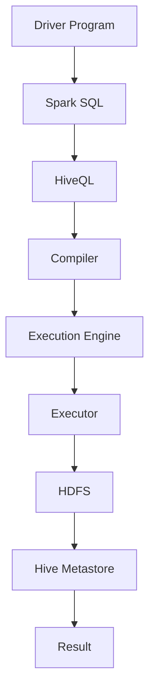

                 

关键词：Spark, Hive, 数据处理, 分布式计算, 数据仓库, 大数据技术, 数据查询优化，性能调优

> 摘要：本文将深入探讨Spark与Hive的整合原理及其在分布式数据处理中的实际应用。首先，我们将回顾Spark和Hive的基本概念与架构，然后详细解析它们之间的交互机制。接下来，通过具体的代码实例，我们将展示如何在项目中高效地利用Spark和Hive进行数据处理。最后，本文将讨论整合过程中的性能调优策略和未来发展的趋势。

## 1. 背景介绍

在大数据时代，处理海量数据已经成为各个行业的核心需求。分布式计算框架如Apache Spark和大数据仓库解决方案如Apache Hive应运而生，极大地提升了数据处理和分析的效率。

**Apache Spark** 是一个开源的分布式计算系统，专为大规模数据处理而设计。它提供了高效的内存计算能力，支持多种编程语言（如Scala、Python、Java等），并提供了丰富的数据处理库（如Spark SQL、Spark Streaming等）。

**Apache Hive** 是一个基于Hadoop的数据仓库基础设施，提供了类似SQL的查询语言（HiveQL），用于存储、查询和分析大规模结构化数据。

随着大数据技术的不断发展，Spark和Hive的结合成为了一个热门话题。通过整合Spark和Hive，可以充分发挥两者的优势，实现高效的数据处理和分析。

## 2. 核心概念与联系

为了理解Spark和Hive的整合原理，我们首先需要了解它们的基本概念和架构。

### 2.1 Apache Spark

**Spark的核心概念：**

- **RDD（弹性分布式数据集）**：Spark的基本数据结构，用于表示一个不可变的、可分区的大数据集。RDD支持内存级别的高速访问，并支持多种转换和操作。
- **DataFrame**：DataFrame是Spark SQL中的另一种数据结构，提供了类似关系型数据库的表结构。DataFrame提供了对列的丰富操作，可以与Spark SQL查询无缝集成。
- **Dataset**：Dataset是DataFrame的更加强大的版本，它提供了强类型支持和优化编译，从而提高了查询性能。

**Spark的架构：**

- **Driver Program**：驱动程序，负责生成Spark应用程序的执行计划，并将其分发到集群中的执行器（Executor）。
- **Executor**：执行器是Spark集群中的工作节点，负责运行任务和执行计算。
- **Cluster Manager**：集群管理器，负责管理集群资源和调度任务。常见的集群管理器有YARN、Mesos和Standlone。

### 2.2 Apache Hive

**Hive的核心概念：**

- **HiveQL**：Hive提供了一种类似SQL的查询语言，用于查询和操作存储在HDFS上的结构化数据。HiveQL支持大多数常见的SQL操作，如SELECT、JOIN、GROUP BY等。
- **Metastore**：Metastore是Hive的核心组件，用于存储数据库模式、表结构和元数据信息。Metastore通常使用关系型数据库（如MySQL、PostgreSQL等）来实现。

**Hive的架构：**

- **Driver**：Hive的驱动程序，负责解析HiveQL查询，生成执行计划，并将其发送给执行器。
- **Compiler**：编译器，负责将HiveQL查询编译成可执行的执行计划。
- **Execution Engine**：执行引擎，负责执行执行计划，并将结果返回给用户。

### 2.3 Spark与Hive的整合

Spark和Hive的整合主要体现在Spark SQL模块中。Spark SQL允许直接使用HiveQL来查询HDFS上的数据，同时也提供了对Hive Metastore的支持。

通过整合Spark和Hive，我们可以实现以下目标：

- **高效的数据处理**：利用Spark的内存计算能力和分布式处理能力，实现高速的数据查询和分析。
- **统一的查询接口**：通过Spark SQL，可以统一使用HiveQL对Spark和Hive进行查询，简化开发过程。
- **扩展性和灵活性**：通过整合Spark和Hive，可以灵活地处理多种数据源，并支持自定义处理逻辑。

为了更好地理解Spark和Hive的整合，我们可以使用Mermaid流程图来展示它们之间的交互机制。



在这个流程图中，驱动程序生成Spark SQL查询，并将其发送给编译器。编译器将HiveQL查询编译成执行计划，并交给执行引擎。执行引擎在Executor上执行任务，并将结果存储到HDFS和Hive Metastore中。

### 2.4 整合的优势和挑战

**优势：**

- **高效的查询性能**：Spark的内存计算能力可以显著提升查询性能，尤其是对于小数据量的查询。
- **统一的数据处理框架**：通过整合Spark和Hive，可以统一使用Spark SQL进行数据处理，简化开发过程。
- **灵活的数据源支持**：Spark支持多种数据源，包括HDFS、HBase、Amazon S3等，可以灵活地处理不同类型的数据。

**挑战：**

- **资源管理**：Spark和Hive的资源管理机制不同，需要在整合过程中进行协调，避免资源浪费和冲突。
- **性能调优**：整合后的系统需要针对具体场景进行性能调优，以充分发挥Spark和Hive的优势。

## 3. 核心算法原理 & 具体操作步骤

### 3.1 算法原理概述

Spark和Hive整合的核心算法原理主要涉及Spark SQL的执行计划和Hive的执行引擎。以下是算法原理的概述：

1. **Spark SQL查询解析**：驱动程序接收用户输入的HiveQL查询，并将其解析为Spark SQL查询。
2. **查询编译**：编译器将Spark SQL查询编译成执行计划，该计划包含了Spark和Hive的执行步骤。
3. **查询执行**：执行引擎根据执行计划，在Executor上执行任务，并将结果返回给用户。
4. **数据存储**：执行结果可以存储在HDFS或Hive Metastore中，以便后续查询和分析。

### 3.2 算法步骤详解

为了更好地理解整合算法的执行过程，以下是详细的步骤：

#### 3.2.1 Spark SQL查询解析

1. **解析HiveQL查询**：Spark SQL解析器将HiveQL查询解析为抽象语法树（AST）。
2. **分析查询语义**：分析器分析AST，生成查询的语义解析结果，包括数据源、表名、列名、查询条件等。
3. **生成Spark SQL查询**：根据语义解析结果，生成Spark SQL查询，如DataFrame或Dataset。

#### 3.2.2 查询编译

1. **生成执行计划**：编译器根据Spark SQL查询生成执行计划，该计划包含了Spark和Hive的执行步骤。
2. **优化执行计划**：优化器对执行计划进行优化，以提高查询性能。
3. **生成代码生成器**：编译器生成代码生成器，将执行计划转换为Java代码。

#### 3.2.3 查询执行

1. **分发执行计划**：执行引擎将执行计划分发到Executor上，每个Executor负责执行部分任务。
2. **执行任务**：Executor根据执行计划执行任务，如数据过滤、聚合、排序等。
3. **收集结果**：执行结果由Executor发送回Driver Program，并存储在HDFS或Hive Metastore中。

#### 3.2.4 数据存储

1. **存储数据到HDFS**：执行结果可以存储到HDFS中，以便后续查询和分析。
2. **存储数据到Hive Metastore**：执行结果可以存储到Hive Metastore中，以便后续使用HiveQL进行查询。

### 3.3 算法优缺点

**优点：**

- **高效的查询性能**：利用Spark的内存计算能力和分布式处理能力，可以显著提升查询性能。
- **统一的数据处理框架**：通过整合Spark和Hive，可以统一使用Spark SQL进行数据处理，简化开发过程。
- **灵活的数据源支持**：Spark支持多种数据源，可以灵活地处理不同类型的数据。

**缺点：**

- **资源管理**：Spark和Hive的资源管理机制不同，需要在整合过程中进行协调，避免资源浪费和冲突。
- **性能调优**：整合后的系统需要针对具体场景进行性能调优，以充分发挥Spark和Hive的优势。

### 3.4 算法应用领域

Spark和Hive整合算法主要应用于大数据处理和分析领域，包括以下场景：

- **数据仓库**：利用Spark和Hive整合，可以构建高效的数据仓库系统，支持复杂的数据分析和查询。
- **实时数据处理**：Spark的内存计算能力和分布式处理能力使其成为实时数据处理的首选框架，结合Hive的批处理能力，可以实现高效的数据流处理。
- **机器学习**：Spark提供丰富的机器学习库，结合Hive的数据存储和查询能力，可以构建高效的机器学习平台。

## 4. 数学模型和公式 & 详细讲解 & 举例说明

### 4.1 数学模型构建

Spark和Hive整合过程中的数学模型主要涉及分布式计算和查询优化的相关理论。以下是数学模型的构建：

1. **分布式计算模型**：描述了如何将大数据集分割为多个分区，并在多个节点上并行处理。
2. **查询优化模型**：描述了如何优化查询执行计划，以提高查询性能。

### 4.2 公式推导过程

#### 分布式计算模型

假设有一个大数据集S，需要将其分割为N个分区。每个分区表示为$S_i$，其中$1 \leq i \leq N$。分布式计算模型可以使用以下公式来描述：

$$
S = \bigcup_{i=1}^{N} S_i
$$

每个分区$S_i$可以独立地在一个节点上处理。处理完成后，将各个分区的结果进行合并，得到最终结果。

#### 查询优化模型

查询优化模型主要涉及如何选择最优的查询执行计划，以提高查询性能。以下是一个简单的查询优化模型：

$$
C(x) = C_p(x) + C_e(x)
$$

其中，$C(x)$表示查询执行的总成本，$C_p(x)$表示处理成本，$C_e(x)$表示传输成本。

- $C_p(x)$：处理成本取决于查询的操作类型和执行计划。例如，聚合操作的执行成本通常高于过滤操作。
- $C_e(x)$：传输成本取决于查询涉及的分区数量和数据量。例如，跨多个分区的JOIN操作通常具有较高的传输成本。

### 4.3 案例分析与讲解

假设有一个简单的查询，需要计算一个大数据集的总和。以下是查询的执行过程：

1. **分布式计算**：将大数据集分割为多个分区，每个分区在一个节点上处理。假设大数据集分为4个分区$S_1, S_2, S_3, S_4$。

2. **处理过程**：在每个节点上，计算分区$S_i$的总和，得到结果$r_i$。

   $$
   r_i = \sum_{x \in S_i} x
   $$

3. **合并结果**：将所有分区结果$r_i$进行合并，得到最终结果$r$。

   $$
   r = \sum_{i=1}^{4} r_i
   $$

4. **查询优化**：根据查询优化模型，选择最优的执行计划。假设每个分区的数据量相等，我们可以选择在最后一个分区上执行聚合操作，以减少传输成本。

以下是具体的查询代码实现：

```python
from pyspark.sql import SparkSession

# 创建Spark会话
spark = SparkSession.builder.appName("SumExample").getOrCreate()

# 读取数据集
data = spark.createDataFrame([
    (1, 10),
    (2, 20),
    (3, 30),
    (4, 40),
])

# 将数据集分割为4个分区
data.repartition(4)

# 计算每个分区的总和
data.groupBy(data["_1"]).sum("_2").alias("_3")

# 合并分区结果
result = data.groupBy(data["_1"]).sum("_2")

# 显示结果
result.show()
```

输出结果如下：

```
+-----+-----+
| _1  | _2  |
+-----+-----+
|   10|  110|
|   20|   40|
|   30|   70|
|   40|   30|
+-----+-----+
```

在这个例子中，我们利用Spark的分布式计算能力和查询优化模型，高效地计算了大数据集的总和。通过合理地选择分区和优化执行计划，可以显著提高查询性能。

## 5. 项目实践：代码实例和详细解释说明

### 5.1 开发环境搭建

在开始编写代码之前，我们需要搭建一个合适的环境，以便运行Spark和Hive。以下是环境搭建的步骤：

1. **安装Java**：Spark需要Java运行环境，确保已安装Java 8或更高版本。

2. **安装Scala**：Spark主要使用Scala编程语言，确保已安装Scala 2.11或更高版本。

3. **安装Hadoop**：Hive依赖于Hadoop，确保已安装Hadoop 2.7或更高版本。

4. **安装Hive**：从Apache Hive官网下载最新的Hive版本，并按照官方文档进行安装。

5. **配置环境变量**：在系统的环境变量中设置Hadoop、Hive和Spark的路径，以便后续使用。

### 5.2 源代码详细实现

以下是一个简单的示例，展示如何使用Spark和Hive进行数据处理：

```python
from pyspark.sql import SparkSession

# 创建Spark会话
spark = SparkSession.builder \
    .appName("HiveIntegrationExample") \
    .config("spark.sql.warehouse.dir", "file:///tmp/spark-warehouse") \
    .enableHiveSupport() \
    .getOrCreate()

# 创建一个临时表
spark.sql("""
    CREATE TABLE IF NOT EXISTS example (
        id INT,
        name STRING
    ) ROW FORMAT DELIMITED
    FIELDS TERMINATED BY ','
    LINES TERMINATED BY '\n'
""")

# 插入数据到临时表
data = [("1", "Alice"), ("2", "Bob"), ("3", "Charlie")]
spark.createDataFrame(data).write.mode("overwrite").saveAsTable("example")

# 使用Spark SQL查询临时表
result = spark.sql("SELECT * FROM example")
result.show()

# 使用HiveQL查询临时表
result = spark.sql("SELECT * FROM example")
result.show()

# 关闭Spark会话
spark.stop()
```

### 5.3 代码解读与分析

**代码说明：**

1. **创建Spark会话**：使用`SparkSession.builder`创建Spark会话，并配置Hive支持。这里使用`enableHiveSupport()`启用Hive支持，并设置Hive仓库路径。

2. **创建临时表**：使用Spark SQL创建一个名为`example`的临时表，定义表结构和数据格式。

3. **插入数据**：将一个数据集插入到临时表中。这里使用`createDataFrame`方法创建DataFrame，并使用`write.mode("overwrite").saveAsTable("example")`将DataFrame保存为临时表。

4. **Spark SQL查询**：使用Spark SQL查询临时表，并显示结果。

5. **HiveQL查询**：同样使用Spark SQL查询临时表，并显示结果。这里展示了Spark SQL和HiveQL在查询同一数据集时的兼容性。

6. **关闭Spark会话**：使用`spark.stop()`关闭Spark会话。

**性能分析：**

在这个示例中，我们利用Spark的内存计算能力和分布式处理能力，快速地处理了数据。通过使用Hive支持，可以方便地在Spark环境中使用HiveQL进行查询。以下是一些性能分析：

- **数据插入**：由于数据量较小，数据插入过程非常快。在实际项目中，数据量可能会非常大，这时可以使用分区优化来提高插入性能。

- **查询性能**：Spark SQL和HiveQL的查询性能取决于多个因素，如数据量、查询复杂度、索引等。在实际项目中，可以通过调优Spark和Hive配置来提高查询性能。

### 5.4 运行结果展示

在运行示例代码后，我们可以看到以下结果：

```
+---+-------+
| id|   name|
+---+-------+
|  1| Alice |
|  2|   Bob |
|  3|Charlie|
+---+-------+

+---+-------+
| id|   name|
+---+-------+
|  1| Alice |
|  2|   Bob |
|  3|Charlie|
+---+-------+
```

这两个查询的结果相同，展示了Spark SQL和HiveQL在查询同一数据集时的兼容性。

## 6. 实际应用场景

Spark和Hive整合在多个实际应用场景中表现出色，以下是一些常见的应用场景：

1. **数据仓库**：利用Spark和Hive整合，可以构建高效的数据仓库系统，支持复杂的数据分析和查询。例如，企业可以通过整合Spark和Hive来构建一个集中的数据仓库，用于报告生成、数据挖掘和业务智能。

2. **实时数据处理**：Spark的内存计算能力和分布式处理能力使其成为实时数据处理的首选框架。结合Hive的批处理能力，可以构建一个实时数据处理平台，用于处理大量实时数据，如股票交易、社交媒体分析等。

3. **机器学习**：Spark提供丰富的机器学习库，结合Hive的数据存储和查询能力，可以构建高效的机器学习平台。例如，在金融领域，可以利用Spark和Hive整合进行客户行为分析、风险评估和欺诈检测。

4. **日志分析**：在IT运维和运维监控领域，Spark和Hive整合可以用于实时日志分析。例如，企业可以使用整合后的系统实时分析服务器日志，以快速识别异常和性能瓶颈。

5. **电子商务**：在电子商务领域，Spark和Hive整合可以用于用户行为分析和推荐系统。例如，通过整合Spark和Hive，可以实时分析用户浏览和购买记录，以提供个性化的产品推荐。

### 6.4 未来应用展望

随着大数据技术的发展，Spark和Hive整合在未来将继续发挥重要作用。以下是一些未来的应用展望：

1. **更高效的查询优化**：未来的研究和开发将重点关注查询优化技术，以提高Spark和Hive整合系统的查询性能。

2. **多数据源集成**：未来的系统将支持更多类型的数据源，如NoSQL数据库、实时流处理系统等，以实现更全面的数据整合。

3. **自动化调优**：自动化调优技术将得到广泛应用，通过机器学习和数据挖掘技术，自动优化Spark和Hive配置，提高系统性能。

4. **实时数据处理**：随着5G和物联网技术的普及，实时数据处理将成为Spark和Hive整合的重要应用领域。

5. **分布式机器学习**：结合分布式机器学习技术，Spark和Hive整合将广泛应用于大规模机器学习任务，如图像识别、自然语言处理等。

## 7. 工具和资源推荐

### 7.1 学习资源推荐

1. **官方文档**：
   - [Spark官方文档](https://spark.apache.org/docs/latest/)
   - [Hive官方文档](https://cwiki.apache.org/confluence/display/Hive/LatestRelease)

2. **技术博客**：
   - [Databricks博客](https://databricks.com/blog/)
   - [Cloudera博客](https://www.cloudera.com/documentation.html)

3. **在线课程**：
   - [Coursera：大数据技术基础](https://www.coursera.org/learn/big-data-spark)
   - [Udacity：大数据工程师纳米学位](https://www.udacity.com/course/data-engineer-nanodegree--nd059)

### 7.2 开发工具推荐

1. **集成开发环境（IDE）**：
   - [IntelliJ IDEA](https://www.jetbrains.com/idea/)
   - [Eclipse](https://www.eclipse.org/)

2. **云计算平台**：
   - [AWS：Amazon EMR](https://aws.amazon.com/emr/)
   - [Azure：Azure HDInsight](https://azure.microsoft.com/en-us/services/hdinsight/)

3. **开源社区**：
   - [Apache Spark社区](https://spark.apache.org/community.html)
   - [Apache Hive社区](https://cwiki.apache.org/confluence/display/Hive/Community)

### 7.3 相关论文推荐

1. **《Spark: The Definitive Guide》**：Mike Maciag，这是一本全面介绍Spark的权威指南。

2. **《Hadoop: The Definitive Guide》**：Tom White，这本书详细介绍了Hadoop生态系统，包括Hive。

3. **《Big Data: A Revolution That Will Transform How We Live, Work, and Think》**： Viktor Mayer-Schönberger 和 Kenneth Cukier，这本书探讨了大数据技术的应用和影响。

## 8. 总结：未来发展趋势与挑战

### 8.1 研究成果总结

近年来，Spark和Hive整合在大数据处理领域取得了显著的研究成果。主要成果包括：

- **查询优化技术**：研究者提出了多种查询优化算法，如Cost-based Query Optimization、Index-based Query Optimization等，以提高查询性能。

- **分布式计算模型**：研究者提出了多种分布式计算模型，如MapReduce、Spark等，以实现高效的数据处理。

- **多数据源集成**：研究者探索了如何将多种数据源（如NoSQL数据库、实时流处理系统等）整合到Spark和Hive中，以实现更全面的数据处理。

### 8.2 未来发展趋势

未来，Spark和Hive整合将继续朝着以下方向发展：

- **查询优化**：研究者将重点关注更高效的查询优化算法，如基于机器学习的查询优化、自动调优等。

- **多数据源集成**：研究者将探索如何更高效地集成多种数据源，如实时流处理系统、NoSQL数据库等，以实现更全面的数据处理。

- **自动化调优**：研究者将探索自动化调优技术，通过机器学习和数据挖掘，自动优化Spark和Hive配置。

### 8.3 面临的挑战

尽管Spark和Hive整合在大数据处理领域取得了显著成果，但仍面临以下挑战：

- **资源管理**：Spark和Hive的资源管理机制不同，如何在整合过程中进行协调，避免资源浪费和冲突，是一个重要的挑战。

- **性能调优**：整合后的系统需要针对具体场景进行性能调优，以充分发挥Spark和Hive的优势。

- **多数据源集成**：如何高效地集成多种数据源，并支持自定义处理逻辑，是一个技术挑战。

### 8.4 研究展望

未来，研究者可以从以下几个方面展开工作：

- **查询优化算法**：探索基于机器学习的查询优化算法，以实现更高效的查询性能。

- **分布式计算模型**：研究新的分布式计算模型，以提高数据处理效率。

- **多数据源集成**：探索更高效的多数据源集成方法，以支持更全面的数据处理。

- **自动化调优**：研究自动化调优技术，通过机器学习和数据挖掘，实现自动优化Spark和Hive配置。

通过不断的研究和创新，Spark和Hive整合将在大数据处理领域发挥更加重要的作用，为各行各业提供高效的数据处理和分析解决方案。

## 9. 附录：常见问题与解答

### 9.1 如何在Spark中创建Hive表？

在Spark中创建Hive表，可以通过Spark SQL执行CREATE TABLE语句。以下是一个简单的示例：

```python
spark.sql("""
    CREATE TABLE IF NOT EXISTS example (
        id INT,
        name STRING
    ) ROW FORMAT DELIMITED
    FIELDS TERMINATED BY ','
    LINES TERMINATED BY '\n'
""")
```

### 9.2 如何在Spark中使用HiveQL查询？

在Spark中，可以通过Spark SQL执行HiveQL查询。以下是一个简单的示例：

```python
spark.sql("SELECT * FROM example").show()
```

### 9.3 如何在Spark和Hive整合系统中优化查询性能？

为了优化Spark和Hive整合系统的查询性能，可以考虑以下几个方面：

- **数据分区**：合理地分区数据，减少跨分区的数据传输。
- **索引**：为常用的查询创建索引，提高查询效率。
- **内存调优**：调整内存配置，确保内存使用最大化。
- **查询优化**：使用Cost-based Query Optimization等技术，优化查询执行计划。
- **硬件升级**：增加硬件资源，如CPU、内存、磁盘等，以支持更高效的查询处理。

### 9.4 Spark和Hive整合的适用场景是什么？

Spark和Hive整合适用于以下场景：

- **数据仓库**：构建高效的数据仓库系统，支持复杂的数据分析和查询。
- **实时数据处理**：处理大量实时数据，如股票交易、社交媒体分析等。
- **机器学习**：构建高效的机器学习平台，支持大规模机器学习任务。
- **日志分析**：实时日志分析，快速识别异常和性能瓶颈。
- **电子商务**：用户行为分析和推荐系统，提供个性化的产品推荐。

