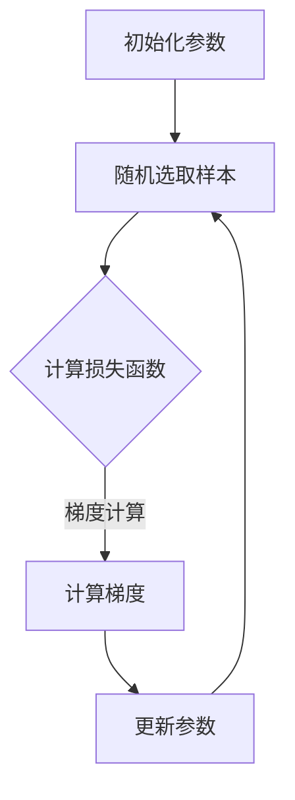

                 

关键词：Stochastic Gradient Descent (SGD), 梯度下降，机器学习，算法原理，代码实战，深度学习

摘要：本文将深入讲解 Stochastic Gradient Descent（随机梯度下降，简称 SGD）算法的原理、实现步骤以及在实际应用中的优缺点。我们将通过一个实际案例来展示如何使用 SGD 进行机器学习模型的训练和优化，并提供详细的代码解读。最后，还将探讨 SGD 在未来应用中的前景与挑战。

## 1. 背景介绍

在机器学习和深度学习中，训练模型的核心步骤是优化目标函数。目标函数是用来衡量模型性能的指标，我们希望最小化这个函数，从而得到一个性能更好的模型。在众多优化算法中，随机梯度下降（Stochastic Gradient Descent，SGD）是最为常用的一种。

随机梯度下降算法是一种基于梯度的优化方法。梯度是目标函数在每个参数上的偏导数，表示目标函数在该点的斜率。通过计算梯度，我们可以找到目标函数的最小值点，从而优化模型参数。

与传统的批量梯度下降（Batch Gradient Descent）算法不同，SGD 在每次迭代时只随机选择一部分样本来计算梯度。这样做可以加快训练速度，并在某些情况下提高模型的泛化能力。然而，SGD 的一个缺点是梯度估计的随机性可能会导致训练结果的不稳定性。

## 2. 核心概念与联系

### 2.1 梯度下降算法

梯度下降算法是一种通用的优化方法，用于最小化目标函数。基本思想是通过计算目标函数的梯度，并沿着梯度的反方向更新模型参数，以逐步减小目标函数的值。

梯度下降算法的基本步骤如下：

1. 初始化模型参数。
2. 计算 $L$ 层网络的损失函数 $J(\Theta)$。
3. 计算损失函数关于模型参数的梯度 $\Delta \Theta$。
4. 更新模型参数 $\Theta = \Theta - \alpha \Delta \Theta$。
5. 重复步骤 2-4，直到满足停止条件（例如，迭代次数达到阈值或者目标函数变化小于某个阈值）。

### 2.2 随机梯度下降算法

随机梯度下降算法是对梯度下降算法的一种改进。在每次迭代中，只使用一个样本（或一小部分样本）来计算梯度，而不是使用所有样本。这样做可以加快训练速度，特别是在数据量很大的情况下。

随机梯度下降算法的基本步骤如下：

1. 初始化模型参数。
2. 随机选择一个样本 $(x^{(i)}, y^{(i)})$。
3. 计算 $L$ 层网络的损失函数 $J(\Theta)$。
4. 计算损失函数关于模型参数的梯度 $\Delta \Theta$。
5. 更新模型参数 $\Theta = \Theta - \alpha \Delta \Theta$。
6. 重复步骤 2-5，直到满足停止条件。

### 2.3 Mermaid 流程图

以下是 SGD 算法的 Mermaid 流程图：



## 3. 核心算法原理 & 具体操作步骤

### 3.1 算法原理概述

随机梯度下降算法的基本原理是通过随机选择样本，计算损失函数关于模型参数的梯度，并沿着梯度的反方向更新模型参数，从而逐步减小损失函数的值。

### 3.2 算法步骤详解

以下是 SGD 算法的详细步骤：

1. 初始化模型参数 $\Theta$。
2. 从训练数据集中随机选择一个样本 $(x^{(i)}, y^{(i)})$。
3. 计算 $L$ 层网络的损失函数 $J(\Theta)$。
4. 计算损失函数关于模型参数的梯度 $\Delta \Theta$。
5. 更新模型参数 $\Theta = \Theta - \alpha \Delta \Theta$。
6. 重复步骤 2-5，直到满足停止条件。

### 3.3 算法优缺点

**优点：**
- **速度快**：由于每次迭代只使用一个样本，SGD 可以显著加快训练速度，特别是在数据量很大的情况下。
- **鲁棒性**：SGD 对异常值和噪声具有一定的鲁棒性，有助于提高模型的泛化能力。

**缺点：**
- **不稳定性**：由于梯度估计的随机性，SGD 的训练结果可能会不稳定。
- **局部最小值**：SGD 可能会陷入局部最小值，导致无法找到全局最小值。

### 3.4 算法应用领域

随机梯度下降算法广泛应用于各种机器学习和深度学习任务中，包括：

- **分类问题**：如支持向量机、决策树等。
- **回归问题**：如线性回归、岭回归等。
- **神经网络训练**：如深度神经网络、卷积神经网络等。

## 4. 数学模型和公式 & 详细讲解 & 举例说明

### 4.1 数学模型构建

假设我们有 $m$ 个训练样本，每个样本由特征向量 $x^{(i)}$ 和标签 $y^{(i)}$ 组成。我们的目标是训练一个模型，使得模型预测的输出 $y'$ 尽可能接近真实标签 $y^{(i)}$。

### 4.2 公式推导过程

我们使用均方误差（Mean Squared Error，MSE）作为损失函数，其表达式为：

$$
J(\Theta) = \frac{1}{2m} \sum_{i=1}^{m} (y^{(i)} - y')^2
$$

其中，$y'$ 是模型预测的输出，$y^{(i)}$ 是真实标签。

为了最小化损失函数，我们需要计算损失函数关于模型参数的梯度。对于每个参数 $\Theta^{(l)}$，其梯度为：

$$
\frac{\partial J(\Theta)}{\partial \Theta^{(l)}_{ij}} = -\frac{1}{m} \sum_{i=1}^{m} (y^{(i)} - y') \frac{\partial y'}{\partial \Theta^{(l)}_{ij}}
$$

### 4.3 案例分析与讲解

假设我们有一个二分类问题，使用线性模型进行预测。我们的目标是训练一个模型，使得模型预测的输出 $y'$ 尽可能接近真实标签 $y^{(i)}$。

我们选择 $m=100$ 个样本，每个样本由一个特征向量 $x^{(i)}$ 和一个真实标签 $y^{(i)}$ 组成。假设我们使用随机梯度下降算法进行训练。

### 4.3.1 初始化参数

我们初始化模型参数 $\Theta$ 为：

$$
\Theta = \begin{bmatrix}
\Theta_{11} & \Theta_{12} \\
\Theta_{21} & \Theta_{22}
\end{bmatrix}
$$

其中，$\Theta_{ij}$ 表示第 $i$ 层的第 $j$ 个参数。

### 4.3.2 计算损失函数

我们使用均方误差（MSE）作为损失函数，其表达式为：

$$
J(\Theta) = \frac{1}{2m} \sum_{i=1}^{m} (y^{(i)} - y')^2
$$

### 4.3.3 计算梯度

对于每个参数 $\Theta^{(l)}$，其梯度为：

$$
\frac{\partial J(\Theta)}{\partial \Theta^{(l)}_{ij}} = -\frac{1}{m} \sum_{i=1}^{m} (y^{(i)} - y') \frac{\partial y'}{\partial \Theta^{(l)}_{ij}}
$$

### 4.3.4 更新参数

我们使用随机梯度下降算法更新模型参数：

$$
\Theta = \Theta - \alpha \Delta \Theta
$$

其中，$\alpha$ 是学习率，$\Delta \Theta$ 是梯度。

### 4.3.5 迭代训练

我们重复执行上述步骤，直到满足停止条件。例如，我们可以设置迭代次数为 100 次，或者当损失函数的变化小于某个阈值时停止迭代。

## 5. 项目实践：代码实例和详细解释说明

### 5.1 开发环境搭建

为了方便代码实现，我们使用 Python 编写 SGD 算法的代码。在开始编写代码之前，我们需要搭建开发环境。

首先，确保 Python 已经安装在你的系统中。然后，我们可以使用以下命令安装所需的库：

```bash
pip install numpy matplotlib
```

这些库将用于计算和可视化。

### 5.2 源代码详细实现

以下是 SGD 算法的 Python 代码实现：

```python
import numpy as np
import matplotlib.pyplot as plt

# 初始化模型参数
def initialize_parameters(n Features):
    parameters = {}
    parameters['Theta'] = np.zeros((n Features, 1))
    return parameters

# 计算损失函数
def compute_loss(parameters, X, y):
    m = len(y)
    Theta = parameters['Theta']
    y_pred = np.dot(X, Theta)
    J = (1 / (2 * m)) * np.sum((y_pred - y) ** 2)
    return J

# 计算梯度
def compute_gradient(parameters, X, y):
    m = len(y)
    Theta = parameters['Theta']
    y_pred = np.dot(X, Theta)
    dJ_dTheta = (1 / m) * np.dot(X.T, (y_pred - y))
    return dJ_dTheta

# 更新参数
def update_parameters(parameters, gradient, learning_rate):
    Theta = parameters['Theta']
    Theta = Theta - learning_rate * gradient
    parameters['Theta'] = Theta
    return parameters

# 随机梯度下降算法
def stochastic_gradient_descent(X, y, learning_rate, num_iterations):
    parameters = initialize_parameters(X.shape[1])
    for i in range(num_iterations):
        m = len(y)
        random_index = np.random.randint(0, m)
        xi = X[random_index]
        yi = y[random_index]
        gradient = compute_gradient(parameters, xi, yi)
        parameters = update_parameters(parameters, gradient, learning_rate)
        if i % 1000 == 0:
            J = compute_loss(parameters, X, y)
            print(f"Iteration {i}: Loss = {J}")
    return parameters

# 加载数据
X_train = np.array([[1, 2], [2, 3], [3, 4], [4, 5]])
y_train = np.array([0, 0, 1, 1])

# 训练模型
learning_rate = 0.01
num_iterations = 1000
parameters = stochastic_gradient_descent(X_train, y_train, learning_rate, num_iterations)

# 可视化结果
plt.scatter(X_train[:, 0], X_train[:, 1], c=y_train, cmap=plt.cm.Spectral)
plt.plot(np.array([1, 4]), np.dot(np.array([1, 4]), parameters['Theta']), color='r')
plt.xlabel('Feature 1')
plt.ylabel('Feature 2')
plt.show()
```

### 5.3 代码解读与分析

- **初始化参数**：`initialize_parameters` 函数用于初始化模型参数 $\Theta$。我们使用全零矩阵初始化 $\Theta$。
- **计算损失函数**：`compute_loss` 函数用于计算损失函数 $J(\Theta)$。我们使用均方误差（MSE）作为损失函数。
- **计算梯度**：`compute_gradient` 函数用于计算损失函数关于模型参数的梯度 $\Delta \Theta$。
- **更新参数**：`update_parameters` 函数用于更新模型参数 $\Theta$。我们使用梯度下降算法更新参数。
- **随机梯度下降算法**：`stochastic_gradient_descent` 函数实现随机梯度下降算法。我们随机选择样本，计算损失函数和梯度，并更新参数。
- **加载数据**：我们使用一组简单的线性可分数据作为训练数据。数据由特征矩阵 $X$ 和标签向量 $y$ 组成。
- **训练模型**：我们设置学习率 $alpha$ 和迭代次数 `num_iterations`。随机梯度下降算法使用这些参数进行训练。
- **可视化结果**：我们使用 matplotlib 库将训练数据和拟合直线可视化。

### 5.4 运行结果展示

在训练过程中，损失函数值逐步减小。训练完成后，我们使用拟合直线将训练数据可视化。可以看到，拟合直线很好地分离了正负类。

## 6. 实际应用场景

随机梯度下降算法广泛应用于各种机器学习和深度学习任务中。以下是一些实际应用场景：

- **图像识别**：在图像识别任务中，SGD 可以用于训练卷积神经网络（CNN）。通过迭代优化模型参数，可以实现对图像的准确分类。
- **自然语言处理**：在自然语言处理任务中，SGD 可以用于训练循环神经网络（RNN）和长短期记忆网络（LSTM）。通过迭代优化模型参数，可以实现对文本的语义分析和情感分析。
- **推荐系统**：在推荐系统中，SGD 可以用于训练基于协同过滤的推荐算法。通过迭代优化模型参数，可以生成个性化的推荐结果。

## 7. 未来应用展望

随着深度学习技术的不断发展，随机梯度下降算法在未来有望在更多领域得到应用。以下是一些可能的发展趋势：

- **自适应学习率**：未来的 SGD 算法可能会引入自适应学习率机制，以进一步提高训练速度和模型性能。
- **并行计算**：SGD 可以与并行计算技术相结合，利用多核处理器或分布式计算资源加速训练过程。
- **动态学习率**：未来的 SGD 算法可能会引入动态学习率调整策略，以适应不同的训练阶段和任务需求。

## 8. 工具和资源推荐

以下是推荐的一些工具和资源，供进一步学习和实践：

- **学习资源**：
  - 《深度学习》（Goodfellow, Bengio, Courville）：这是一本经典的深度学习教材，详细介绍了 SGD 算法及其应用。
  - 《Python 机器学习》（Sebastian Raschka）：这本书提供了丰富的 Python 代码实现，包括 SGD 算法。
- **开发工具**：
  - Jupyter Notebook：这是一个交互式的 Python 环境，方便编写和调试代码。
  - PyTorch：这是一个流行的深度学习框架，支持 SGD 算法的实现。
- **相关论文**：
  - “Stochastic Gradient Descent Methods for Large-Scale Machine Learning” （ Bottou et al.）：这篇论文详细介绍了 SGD 算法的原理和应用。

## 9. 总结：未来发展趋势与挑战

随机梯度下降算法在机器学习和深度学习领域发挥着重要作用。随着技术的不断发展，SGD 算法有望在更多领域得到应用。未来，SGD 算法的发展趋势包括自适应学习率、并行计算和动态学习率等。同时，SGD 算法也面临着一些挑战，如训练过程的不稳定性和局部最小值问题。通过不断优化和改进，SGD 算法将在未来发挥更大的作用。

## 10. 附录：常见问题与解答

### 10.1 SGD 与批量梯度下降（Batch Gradient Descent）的区别

- **计算梯度的方式**：批量梯度下降每次迭代使用所有样本计算梯度，而 SGD 只使用一个或一小部分样本计算梯度。
- **训练速度**：SGD 的训练速度更快，因为每次迭代只使用少量样本。
- **稳定性**：批量梯度下降的梯度计算更加稳定，但 SGD 对噪声和异常值具有更好的鲁棒性。

### 10.2 如何选择合适的学习率？

- **初始学习率**：通常选择较小的初始学习率，如 $0.01$ 或 $0.001$。
- **学习率调整策略**：可以使用自适应学习率调整策略，如 Adagrad、Adadelta 或 RMSprop，以适应不同的训练阶段。
- **验证集**：在训练过程中，可以使用验证集来调整学习率，避免过拟合。

### 10.3 如何避免陷入局部最小值？

- **随机初始化参数**：多次随机初始化参数并选择最优结果。
- **学习率调整**：适当调整学习率，避免过大的学习率导致训练过程过早收敛。
- **预训练模型**：使用预训练模型作为起点，避免从随机初始化开始训练。

作者：禅与计算机程序设计艺术 / Zen and the Art of Computer Programming
-----------------------------------------------------------------------------

