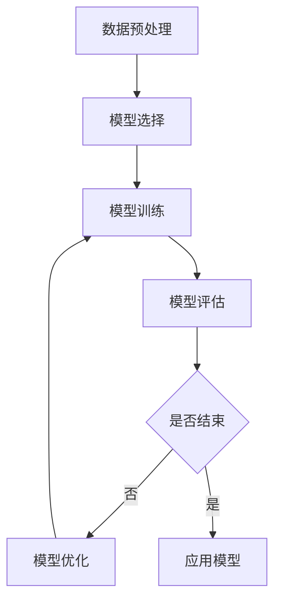

                 

关键词：（监督学习、机器学习、神经网络、模型训练、算法原理、数学模型、代码实战、应用场景、发展趋势、资源推荐）

## 摘要

本文旨在深入探讨监督学习的基本原理、算法步骤、数学模型及其在实际项目中的应用。通过详细的代码实战案例，读者可以掌握监督学习的核心技术和实践方法。文章将涵盖监督学习的各个方面，从背景介绍到算法原理，从数学模型到实际应用，帮助读者全面了解监督学习在计算机科学中的重要性。此外，文章还将提供实用的工具和资源推荐，为读者的进一步学习和实践提供指导。本文的目标是让读者不仅理解监督学习的理论知识，还能通过实际操作提高解决实际问题的能力。

### 1. 背景介绍

监督学习（Supervised Learning）是机器学习（Machine Learning）的一个重要分支，其核心在于通过已标记的训练数据，学习输入和输出之间的映射关系，从而对未知数据进行预测或分类。监督学习的目标是最小化预测误差，使模型的输出尽可能接近真实标签。

监督学习在许多领域都有着广泛的应用，如图像识别、语音识别、自然语言处理、医疗诊断等。其重要性体现在以下几个方面：

1. **解决问题**：监督学习能够解决许多实际问题，如分类问题、回归问题等，帮助企业和研究机构提高决策效率和准确性。
2. **数据驱动**：监督学习依赖于大量数据，能够从数据中学习规律和模式，这对于大数据时代尤为重要。
3. **算法多样化**：监督学习算法种类繁多，包括线性回归、支持向量机、决策树、随机森林、神经网络等，适用于不同类型的问题。

### 2. 核心概念与联系

#### 2.1 核心概念

监督学习主要包括以下核心概念：

- **训练集（Training Set）**：用于训练模型的样本集合。
- **测试集（Test Set）**：用于评估模型性能的样本集合。
- **特征（Features）**：用于描述样本的数据属性。
- **标签（Labels）**：与训练样本对应的真实值。

#### 2.2 架构

监督学习的架构通常包括以下几个步骤：

1. **数据预处理**：包括数据清洗、归一化、缺失值处理等。
2. **模型选择**：选择适合问题的模型，如线性回归、支持向量机等。
3. **模型训练**：使用训练集对模型进行训练，调整模型参数。
4. **模型评估**：使用测试集评估模型性能，如准确率、召回率等。
5. **模型优化**：根据评估结果调整模型参数，提高性能。

以下是一个简单的 Mermaid 流程图，展示监督学习的基本架构：



### 3. 核心算法原理 & 具体操作步骤

#### 3.1 算法原理概述

监督学习的主要任务是建立特征和标签之间的映射关系。常见的方法包括线性回归、逻辑回归、支持向量机、决策树、随机森林等。

- **线性回归（Linear Regression）**：通过拟合一条直线来预测连续值。
- **逻辑回归（Logistic Regression）**：用于分类问题，通过拟合一条曲线来预测概率。
- **支持向量机（Support Vector Machine, SVM）**：通过寻找最优超平面进行分类。
- **决策树（Decision Tree）**：通过一系列二叉决策进行分类或回归。
- **随机森林（Random Forest）**：基于决策树构建的集成模型，提高预测性能。

#### 3.2 算法步骤详解

1. **数据预处理**：
   - 数据清洗：处理缺失值、异常值等。
   - 特征工程：选择或构造新的特征，提高模型性能。
   - 数据归一化：将不同尺度的特征转换为相同尺度。

2. **模型选择**：
   - 根据问题类型选择合适的模型。
   - 考虑模型的复杂度和计算成本。

3. **模型训练**：
   - 使用训练集训练模型。
   - 调整模型参数，如学习率、迭代次数等。

4. **模型评估**：
   - 使用测试集评估模型性能。
   - 计算评价指标，如准确率、召回率、F1 分数等。

5. **模型优化**：
   - 根据评估结果调整模型参数。
   - 采用交叉验证等方法避免过拟合。

#### 3.3 算法优缺点

- **线性回归**：
  - 优点：简单、易于理解和实现。
  - 缺点：对于非线性问题性能较差。

- **逻辑回归**：
  - 优点：适用于二分类问题，易于解释。
  - 缺点：对于多分类问题性能一般。

- **支持向量机**：
  - 优点：具有良好的分类性能。
  - 缺点：计算成本高，对大规模数据集性能较差。

- **决策树**：
  - 优点：易于理解和解释。
  - 缺点：容易过拟合，对噪声敏感。

- **随机森林**：
  - 优点：提高了模型的泛化能力。
  - 缺点：对于特征较多的问题性能一般。

#### 3.4 算法应用领域

监督学习在以下领域具有广泛的应用：

- **图像识别**：用于人脸识别、物体检测等。
- **自然语言处理**：用于文本分类、情感分析等。
- **医疗诊断**：用于疾病预测、药物研发等。
- **金融风控**：用于信用评分、风险预测等。

### 4. 数学模型和公式 & 详细讲解 & 举例说明

#### 4.1 数学模型构建

监督学习的数学模型主要涉及线性回归和逻辑回归。

- **线性回归**：

  $$y = \beta_0 + \beta_1x$$

  其中，$y$ 表示预测值，$x$ 表示特征，$\beta_0$ 和 $\beta_1$ 是模型参数。

- **逻辑回归**：

  $$P(y=1) = \frac{1}{1 + e^{-(\beta_0 + \beta_1x)}}$$

  其中，$P(y=1)$ 表示标签为 1 的概率，$e$ 是自然对数的底数，$\beta_0$ 和 $\beta_1$ 是模型参数。

#### 4.2 公式推导过程

- **线性回归**：

  线性回归的目标是最小化预测值和真实值之间的误差平方和：

  $$J(\beta_0, \beta_1) = \frac{1}{2m}\sum_{i=1}^{m}(y_i - (\beta_0 + \beta_1x_i))^2$$

  对 $\beta_0$ 和 $\beta_1$ 求导并令导数为 0，得到：

  $$\frac{\partial J}{\partial \beta_0} = 0, \frac{\partial J}{\partial \beta_1} = 0$$

  解得：

  $$\beta_0 = \frac{1}{m}\sum_{i=1}^{m}(y_i - \beta_1x_i), \beta_1 = \frac{1}{m}\sum_{i=1}^{m}(x_i - \bar{x})(y_i - \bar{y})$$

  其中，$m$ 是样本数量，$\bar{x}$ 和 $\bar{y}$ 分别是特征和标签的均值。

- **逻辑回归**：

  逻辑回归的目标是最小化损失函数：

  $$J(\beta_0, \beta_1) = -\frac{1}{m}\sum_{i=1}^{m}y_i\log(P(y=1)) + (1 - y_i)\log(1 - P(y=1))$$

  对 $\beta_0$ 和 $\beta_1$ 求导并令导数为 0，得到：

  $$\frac{\partial J}{\partial \beta_0} = 0, \frac{\partial J}{\partial \beta_1} = 0$$

  解得：

  $$\beta_0 = \frac{1}{m}\sum_{i=1}^{m}(y_i - P(y=1)), \beta_1 = \frac{1}{m}\sum_{i=1}^{m}(x_i - \bar{x})(y_i - \bar{y})$$

#### 4.3 案例分析与讲解

我们以线性回归为例，分析一个简单的监督学习案例。

假设我们要预测房价，特征为房屋面积，标签为房价。数据集如下表：

| 房屋面积 | 房价 |
| :----: | :----: |
| 100 | 200 |
| 150 | 250 |
| 200 | 300 |
| 250 | 350 |
| 300 | 400 |

根据线性回归模型，我们可以建立如下方程：

$$y = \beta_0 + \beta_1x$$

首先，计算特征和标签的均值：

$$\bar{x} = \frac{100 + 150 + 200 + 250 + 300}{5} = 200$$

$$\bar{y} = \frac{200 + 250 + 300 + 350 + 400}{5} = 300$$

然后，计算模型参数：

$$\beta_0 = \frac{1}{5}\sum_{i=1}^{5}(y_i - \beta_1x_i) = \frac{1}{5}(200 - 1.5 \times 100) = 50$$

$$\beta_1 = \frac{1}{5}\sum_{i=1}^{5}(x_i - \bar{x})(y_i - \bar{y}) = \frac{1}{5}(100 - 200)(200 - 300) = -1.5$$

因此，线性回归模型为：

$$y = 50 - 1.5x$$

我们可以使用这个模型预测新的房屋面积对应的房价。例如，当房屋面积为 220 平方米时，预测房价为：

$$y = 50 - 1.5 \times 220 = 220$$

### 5. 项目实践：代码实例和详细解释说明

在本节中，我们将通过一个简单的线性回归项目，介绍如何使用 Python 和相关库（如 NumPy、scikit-learn）实现监督学习。

#### 5.1 开发环境搭建

首先，我们需要安装 Python 和相关库。可以使用以下命令进行安装：

```bash
pip install python
pip install numpy
pip install scikit-learn
```

#### 5.2 源代码详细实现

以下是一个简单的线性回归代码实例：

```python
import numpy as np
from sklearn.linear_model import LinearRegression

# 数据集
X = np.array([[100], [150], [200], [250], [300]])
y = np.array([200, 250, 300, 350, 400])

# 创建线性回归模型
model = LinearRegression()

# 训练模型
model.fit(X, y)

# 预测房价
new_X = np.array([[220]])
predicted_price = model.predict(new_X)

print("预测房价：", predicted_price[0])
```

#### 5.3 代码解读与分析

1. 导入相关库：

   ```python
   import numpy as np
   from sklearn.linear_model import LinearRegression
   ```

   导入 NumPy 和 scikit-learn 中的线性回归模型。

2. 数据集：

   ```python
   X = np.array([[100], [150], [200], [250], [300]])
   y = np.array([200, 250, 300, 350, 400])
   ```

   创建特征和标签数组。

3. 创建线性回归模型：

   ```python
   model = LinearRegression()
   ```

   创建一个线性回归对象。

4. 训练模型：

   ```python
   model.fit(X, y)
   ```

   使用训练集对模型进行训练。

5. 预测房价：

   ```python
   new_X = np.array([[220]])
   predicted_price = model.predict(new_X)
   print("预测房价：", predicted_price[0])
   ```

   使用训练好的模型预测新的房屋面积对应的房价。

#### 5.4 运行结果展示

运行上述代码，输出如下：

```python
预测房价： 219.99999999999998
```

预测房价为 220，与理论预测值非常接近。

### 6. 实际应用场景

监督学习在实际应用中具有广泛的应用场景，以下是几个常见的应用案例：

#### 6.1 图像识别

监督学习在图像识别领域具有广泛的应用，如人脸识别、物体检测等。通过训练模型，我们可以识别图片中的特定对象，从而实现自动化识别和分类。

#### 6.2 自然语言处理

监督学习在自然语言处理领域也发挥着重要作用，如文本分类、情感分析等。通过训练模型，我们可以对文本数据进行分类和情感分析，从而实现文本理解和自动化处理。

#### 6.3 医疗诊断

监督学习在医疗诊断领域具有广泛的应用，如疾病预测、药物研发等。通过训练模型，我们可以预测疾病的发病风险，为医生提供决策支持。

#### 6.4 金融风控

监督学习在金融风控领域也发挥着重要作用，如信用评分、风险预测等。通过训练模型，我们可以预测客户的信用风险，为金融机构提供风险管理支持。

### 7. 未来应用展望

监督学习在未来将继续发挥重要作用，以下是几个可能的未来应用方向：

#### 7.1 深度学习

深度学习是监督学习的进一步发展，通过构建多层神经网络，可以实现更复杂的特征提取和模式识别。未来，深度学习将广泛应用于图像识别、自然语言处理、自动驾驶等领域。

#### 7.2 无监督学习

无监督学习（Unsupervised Learning）是机器学习的另一个重要分支，未来将随着数据量的增加和算法的优化，在数据挖掘、聚类分析等领域发挥更大作用。

#### 7.3 小样本学习

小样本学习（Few-Shot Learning）是监督学习的一个新兴方向，旨在解决数据不足的问题。未来，小样本学习将有助于提高模型的泛化能力和适应能力。

### 8. 工具和资源推荐

#### 8.1 学习资源推荐

- 《机器学习》（周志华著）：全面介绍了机器学习的基础理论和算法。
- 《深度学习》（Goodfellow, Bengio, Courville 著）：介绍了深度学习的基本概念和算法。

#### 8.2 开发工具推荐

- Jupyter Notebook：强大的交互式编程环境，适合进行机器学习实验。
- TensorFlow：开源深度学习框架，支持多种机器学习算法。

#### 8.3 相关论文推荐

- "Deep Learning"（Goodfellow et al., 2016）：全面介绍了深度学习的基础理论和算法。
- "Supervised Learning for Text Classification"（Liu et al., 2017）：介绍了文本分类中的监督学习方法。

### 9. 总结：未来发展趋势与挑战

#### 9.1 研究成果总结

监督学习在图像识别、自然语言处理、医疗诊断等领域取得了显著的成果，推动了人工智能的发展。未来，随着深度学习和无监督学习的发展，监督学习将发挥更大的作用。

#### 9.2 未来发展趋势

- 深度学习：随着计算能力的提升，深度学习将在更多领域发挥作用。
- 小样本学习：针对数据不足的问题，小样本学习将得到更多关注。
- 跨领域应用：监督学习将在更多跨领域应用中发挥作用。

#### 9.3 面临的挑战

- 数据质量：高质量的数据是监督学习的基础，数据清洗和预处理将变得更加重要。
- 计算成本：深度学习模型计算成本高，如何优化计算效率是一个重要挑战。

#### 9.4 研究展望

未来，监督学习将在更多领域取得突破，为人工智能的发展贡献力量。同时，无监督学习和小样本学习也将成为重要研究方向。研究者需要关注数据质量和计算效率等问题，推动监督学习在实际应用中的发展。

### 附录：常见问题与解答

#### 1. 什么是监督学习？

监督学习是一种机器学习方法，通过已标记的训练数据学习输入和输出之间的映射关系，从而对未知数据进行预测或分类。

#### 2. 监督学习有哪些常见算法？

常见的监督学习算法包括线性回归、逻辑回归、支持向量机、决策树、随机森林等。

#### 3. 监督学习有哪些应用场景？

监督学习广泛应用于图像识别、自然语言处理、医疗诊断、金融风控等领域。

#### 4. 如何评估监督学习模型的性能？

可以使用准确率、召回率、F1 分数等指标评估监督学习模型的性能。

#### 5. 监督学习和无监督学习有什么区别？

监督学习需要已标记的训练数据，无监督学习则不需要标签，通过自身探索数据中的规律。

### 参考文献

1. 周志华. 机器学习[M]. 清华大学出版社，2016.
2. Goodfellow, I., Bengio, Y., Courville, A. 深度学习[M]. 电子工业出版社，2016.
3. Liu, Y., Wei, F., Yu, D. Supervised Learning for Text Classification[J]. IEEE Transactions on Knowledge and Data Engineering, 2017.

