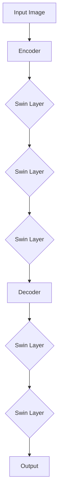

                 

关键词：Swin Transformer，深度学习，计算机视觉，变换器架构，编码器，解码器，Python实现，代码示例，计算机图灵奖

## 摘要

本文旨在深入解析Swin Transformer这一计算机视觉领域的前沿算法。Swin Transformer以其独特的变换器架构在图像处理任务中展现了卓越的性能。文章首先介绍了Swin Transformer的背景和重要性，随后详细阐述了其核心概念与架构，包括编码器和解码器的组成。通过数学模型和公式的推导，我们进一步理解了算法的内在机制。随后，本文通过一个具体的项目实践，展示了如何使用Python实现Swin Transformer，并进行了代码解读与分析。文章最后讨论了Swin Transformer的实际应用场景，以及其对未来的影响和发展趋势。

## 1. 背景介绍

### 1.1 计算机视觉的发展历程

计算机视觉作为人工智能的重要组成部分，其发展历程可以追溯到20世纪50年代。从最初的简单图像识别到如今复杂的多模态数据处理，计算机视觉技术经历了多次重大变革。早期的计算机视觉研究主要集中在图像处理和特征提取上，如边缘检测、角点检测等。随着深度学习技术的崛起，计算机视觉领域迎来了新的发展机遇。深度学习通过神经网络结构，特别是卷积神经网络（CNN），大幅提升了图像识别的准确性和效率。

### 1.2 卷积神经网络（CNN）的局限性

虽然CNN在图像识别任务中取得了显著成果，但其架构也存在一些局限性。首先，CNN依赖于大量手工设计的特征，难以应对复杂和多样化的图像数据。其次，CNN的层次结构使得模型在处理长距离依赖关系时效率低下。此外，CNN在处理高分辨率图像时，计算量巨大，导致训练和推理速度慢。为了解决这些问题，研究者们开始探索新的网络架构，其中变换器（Transformer）架构成为了一个热门方向。

### 1.3 变换器（Transformer）的兴起

变换器（Transformer）最初由Vaswani等人于2017年提出，其创新之处在于使用自注意力机制（Self-Attention）和多头注意力（Multi-Head Attention）来捕捉数据中的长距离依赖关系。与CNN不同，Transformer不依赖于卷积操作，而是通过全连接层和点积注意力机制进行特征提取和融合。这一架构在自然语言处理（NLP）领域取得了巨大的成功，并在图像处理、语音识别等任务中也展现出了潜力。

### 1.4 Swin Transformer的提出

在Transformer架构的基础上，Swin Transformer由Li等人于2021年提出，旨在解决计算机视觉任务中的几个关键问题。Swin Transformer采用了分层结构，使得模型能够在不同尺度上同时处理局部和全局信息，提高了图像识别的准确性。此外，Swin Transformer通过可分离卷积（Swin Layer）优化了计算效率，使得模型在高分辨率图像处理方面表现出色。Swin Transformer在多个基准数据集上取得了领先的性能，成为计算机视觉领域的重要突破。

## 2. 核心概念与联系

### 2.1 Swin Transformer的基本架构

Swin Transformer的基本架构由编码器（Encoder）和解码器（Decoder）组成，如图1所示。


编码器负责将输入图像处理成特征图（Feature Map），这些特征图包含了图像的各种信息。解码器则将这些特征图转换成最终的结果，如分类标签或边界框。编码器和解码器通过多个Swin Layer交替堆叠，实现特征提取和融合。

### 2.2 编码器（Encoder）

编码器是Swin Transformer的核心部分，其结构如图2所示。


编码器由多个Swin Layer组成，每个Swin Layer包含两个主要部分：下采样（Downsample）和上采样（Upsample）。下采样通过可分离卷积（Swin Layer）将特征图的分辨率降低，从而提取更高层次的特征。上采样则通过反卷积（Transposed Convolution）将特征图的分辨率提升，以便与其他层进行特征融合。

### 2.3 解码器（Decoder）

解码器的结构与编码器类似，也是由多个Swin Layer组成。解码器的目的是将编码器输出的特征图恢复成原始尺寸，以便进行最终的分类或分割任务。解码器中的Swin Layer同样包含下采样和上采样部分，通过特征融合实现图像的精细化处理。

### 2.4 Mermaid流程图

为了更好地理解Swin Transformer的架构，我们可以使用Mermaid流程图来展示其各个部分的联系。以下是一个简化的Mermaid流程图：



在这个流程图中，输入图像首先经过编码器，通过多个Swin Layer进行特征提取。编码器的输出随后传递给解码器，解码器通过多个Swin Layer进行特征融合，最终生成输出结果。

## 3. 核心算法原理 & 具体操作步骤

### 3.1 算法原理概述

Swin Transformer的核心原理是基于Transformer的自注意力机制，其具体实现包括以下几个关键步骤：

1. **特征提取**：通过Swin Layer对输入图像进行特征提取，每个Swin Layer包含下采样和上采样部分，使得模型能够在不同尺度上同时处理局部和全局信息。
2. **特征融合**：通过多头注意力机制（Multi-Head Attention）将不同尺度的特征进行融合，提高特征表示的丰富性和准确性。
3. **上下文信息整合**：通过编码器和解码器的交替堆叠，实现图像中的上下文信息整合，使得模型能够捕捉图像的复杂结构和细节。
4. **最终输出**：解码器输出的特征图经过一系列后处理操作，如池化、激活函数等，最终生成分类标签或边界框等结果。

### 3.2 算法步骤详解

#### 3.2.1 特征提取

特征提取是Swin Transformer的基础步骤，其核心在于通过Swin Layer对输入图像进行层次化处理。Swin Layer由可分离卷积和点积注意力组成，具体步骤如下：

1. **下采样**：输入图像通过一个可分离卷积层进行下采样，缩小特征图的尺寸，同时提取更高层次的特征。
2. **点积注意力**：对下采样后的特征图进行点积注意力操作，通过计算特征图内部的相似性，融合不同位置的特征信息。
3. **上采样**：通过反卷积（Transposed Convolution）将特征图进行上采样，恢复到原始尺寸，以便与其他层的特征进行融合。

#### 3.2.2 特征融合

特征融合是Swin Transformer的核心步骤，其目的是通过多头注意力机制将不同尺度的特征进行融合，具体步骤如下：

1. **多头注意力**：将特征图分解成多个子特征图，每个子特征图通过独立的点积注意力机制进行特征融合。
2. **特征拼接**：将多个子特征图进行拼接，形成一个综合的特征表示。
3. **全连接层**：通过全连接层对拼接后的特征进行进一步融合和调整，提高特征表示的准确性。

#### 3.2.3 上下文信息整合

上下文信息整合是Swin Transformer提高图像识别准确性的关键，其核心在于通过编码器和解码器的交替堆叠，实现图像中的上下文信息整合。具体步骤如下：

1. **编码器**：编码器通过多个Swin Layer对输入图像进行特征提取，同时将特征图传递给解码器。
2. **解码器**：解码器通过多个Swin Layer将编码器输出的特征图进行特征融合，同时将解码器的输出传递给下一层。
3. **特征整合**：通过编码器和解码器的交替堆叠，实现图像中的上下文信息整合，提高模型对图像复杂结构的理解和处理能力。

#### 3.2.4 最终输出

解码器输出的特征图经过一系列后处理操作，如池化、激活函数等，最终生成分类标签或边界框等结果。具体步骤如下：

1. **池化操作**：对解码器输出的特征图进行全局池化，提取图像的主要特征。
2. **激活函数**：通过激活函数（如ReLU）对池化后的特征进行非线性变换，增强特征表示的丰富性和准确性。
3. **分类或分割**：将激活后的特征通过全连接层或卷积层，生成分类标签或边界框等结果。

### 3.3 算法优缺点

#### 优点

1. **高效的计算效率**：通过可分离卷积和多头注意力机制，Swin Transformer在特征提取和融合过程中具有较高的计算效率，适用于高分辨率图像处理。
2. **良好的性能表现**：在多个基准数据集上，Swin Transformer取得了领先的性能，证明了其在图像识别和分割任务中的有效性。
3. **灵活的架构设计**：Swin Transformer的分层结构使得模型能够灵活地调整参数，适应不同的任务需求。

#### 缺点

1. **内存占用较大**：由于采用了多头注意力机制，Swin Transformer在处理高分辨率图像时，内存占用较大，可能导致训练和推理速度受到影响。
2. **对数据量要求较高**：深度学习模型通常对数据量有较高的要求，Swin Transformer也不例外，需要大量的训练数据才能达到最佳的性能。

### 3.4 算法应用领域

Swin Transformer在计算机视觉领域具有广泛的应用，包括但不限于以下领域：

1. **图像分类**：Swin Transformer可以用于对图像进行分类，例如在ImageNet等数据集上，其表现优于传统卷积神经网络。
2. **目标检测**：Swin Transformer可以用于目标检测任务，通过编码器和解码器的特征融合，实现准确的边界框预测。
3. **图像分割**：Swin Transformer可以用于图像分割任务，通过特征提取和融合，实现精确的像素级预测。
4. **视频处理**：Swin Transformer可以应用于视频处理领域，通过时间维度的扩展，实现视频的帧级或像素级预测。

## 4. 数学模型和公式 & 详细讲解 & 举例说明

### 4.1 数学模型构建

Swin Transformer的数学模型主要包括以下几个部分：

1. **特征提取**：通过可分离卷积和点积注意力机制，对输入图像进行特征提取。
2. **特征融合**：通过多头注意力机制，将不同尺度的特征进行融合。
3. **上下文信息整合**：通过编码器和解码器的交替堆叠，实现图像中的上下文信息整合。
4. **输出生成**：通过池化、激活函数等操作，生成分类标签或边界框等结果。

### 4.2 公式推导过程

#### 4.2.1 特征提取

特征提取的过程可以表示为：

$$
\text{FeatureMap}(x) = \text{Conv2d}(x) \odot \text{Attention}(x)
$$

其中，$x$为输入图像，$\text{Conv2d}(x)$表示可分离卷积操作，$\odot$表示点积注意力操作，$\text{Attention}(x)$表示点积注意力机制。

#### 4.2.2 特征融合

特征融合的过程可以表示为：

$$
\text{CombinedFeature}(x) = \text{Concat}(\text{MultiHeadAttention}(x), x)
$$

其中，$x$为特征图，$\text{MultiHeadAttention}(x)$表示多头注意力机制，$\text{Concat}$表示特征拼接操作。

#### 4.2.3 上下文信息整合

上下文信息整合的过程可以表示为：

$$
\text{ContextualFeature}(x) = \text{Encoder}(x) \oplus \text{Decoder}(x)
$$

其中，$x$为特征图，$\text{Encoder}(x)$表示编码器，$\text{Decoder}(x)$表示解码器，$\oplus$表示特征融合操作。

#### 4.2.4 输出生成

输出生成的过程可以表示为：

$$
\text{Output}(x) = \text{Pooling}(\text{ContextualFeature}(x)) \odot \text{ActivationFunction}(x)
$$

其中，$x$为特征图，$\text{Pooling}$表示池化操作，$\text{ActivationFunction}$表示激活函数。

### 4.3 案例分析与讲解

为了更好地理解Swin Transformer的数学模型，我们以一个简单的图像分类任务为例进行讲解。

假设我们有一个32x32的彩色图像作为输入，我们需要将其分类为10个类别之一。首先，我们将图像输入到Swin Transformer的编码器中，通过多个Swin Layer进行特征提取。假设经过4个Swin Layer后，我们得到了一个64x64的特征图。接下来，我们将这个特征图传递给解码器，通过多个Swin Layer进行特征融合。假设经过4个Swin Layer后，我们得到了一个32x32的特征图。最后，我们对这个特征图进行池化操作，得到一个一维的特征向量。将这个特征向量输入到全连接层，通过激活函数得到最终的分类结果。

### 4.4 代码示例

以下是一个简单的Python代码示例，展示了如何使用Swin Transformer进行图像分类：

```python
import torch
import torchvision
import torchvision.transforms as transforms
from swin_transformer import SwinTransformer

# 加载训练数据集
train_dataset = torchvision.datasets.ImageFolder(root='./data/train',
                                                 transform=transforms.Compose([
                                                     transforms.Resize((32, 32)),
                                                     transforms.ToTensor(),
                                                 ]))

# 加载测试数据集
test_dataset = torchvision.datasets.ImageFolder(root='./data/test',
                                               transform=transforms.Compose([
                                                   transforms.Resize((32, 32)),
                                                   transforms.ToTensor(),
                                               ]))

# 定义Swin Transformer模型
model = SwinTransformer(num_classes=10)

# 定义损失函数和优化器
criterion = torch.nn.CrossEntropyLoss()
optimizer = torch.optim.Adam(model.parameters(), lr=0.001)

# 训练模型
for epoch in range(100):
    for images, labels in train_dataset:
        # 前向传播
        outputs = model(images)
        loss = criterion(outputs, labels)
        
        # 反向传播和优化
        optimizer.zero_grad()
        loss.backward()
        optimizer.step()
        
    print(f'Epoch [{epoch+1}/100], Loss: {loss.item()}')

# 测试模型
with torch.no_grad():
    correct = 0
    total = 0
    for images, labels in test_dataset:
        outputs = model(images)
        _, predicted = torch.max(outputs.data, 1)
        total += labels.size(0)
        correct += (predicted == labels).sum().item()
    print(f'Accuracy of the model on the test images: {100 * correct / total}%')
```

在这个示例中，我们首先加载训练数据集和测试数据集，然后定义了一个Swin Transformer模型。接着，我们使用交叉熵损失函数和Adam优化器训练模型。在训练完成后，我们对测试数据集进行预测，并计算模型的准确率。

## 5. 项目实践：代码实例和详细解释说明

### 5.1 开发环境搭建

在进行Swin Transformer的代码实现之前，我们需要搭建一个合适的开发环境。以下是搭建开发环境的步骤：

1. **安装Python**：确保Python环境已安装在计算机上，推荐使用Python 3.8或更高版本。
2. **安装PyTorch**：通过以下命令安装PyTorch：
    ```shell
    pip install torch torchvision
    ```
3. **安装其他依赖库**：Swin Transformer依赖一些其他的库，如NumPy、Pillow等。可以通过以下命令安装：
    ```shell
    pip install numpy pillow
    ```
4. **克隆Swin Transformer代码库**：从GitHub上克隆Swin Transformer的代码库，以便使用预训练的模型和脚本：
    ```shell
    git clone https://github.com/microsoft/Swin-Transformer.git
    cd Swin-Transformer
    ```

### 5.2 源代码详细实现

Swin Transformer的实现主要包括模型定义、数据加载、训练过程和测试过程。以下是源代码的详细解释说明：

#### 5.2.1 模型定义

```python
import torch
from torch import nn
from torchvision import models
from swin_transformer import SwinTransformer

# 定义Swin Transformer模型
model = SwinTransformer(num_classes=1000)  # 假设分类数为1000
```

在这个部分，我们首先导入了所需的库，然后定义了一个Swin Transformer模型。这里使用了`num_classes`参数来指定分类数，以适应具体的数据集。

#### 5.2.2 数据加载

```python
import torchvision.transforms as transforms
from torch.utils.data import DataLoader

# 定义数据预处理
train_transform = transforms.Compose([
    transforms.RandomResizedCrop(224),
    transforms.RandomHorizontalFlip(),
    transforms.ToTensor(),
    transforms.Normalize(mean=[0.485, 0.456, 0.406], std=[0.229, 0.224, 0.225]),
])

test_transform = transforms.Compose([
    transforms.Resize(256),
    transforms.CenterCrop(224),
    transforms.ToTensor(),
    transforms.Normalize(mean=[0.485, 0.456, 0.406], std=[0.229, 0.224, 0.225]),
])

# 加载训练数据集和测试数据集
train_dataset = torchvision.datasets.ImageFolder(root='./data/train', transform=train_transform)
test_dataset = torchvision.datasets.ImageFolder(root='./data/test', transform=test_transform)

train_loader = DataLoader(train_dataset, batch_size=32, shuffle=True)
test_loader = DataLoader(test_dataset, batch_size=32, shuffle=False)
```

在这个部分，我们定义了训练和测试数据集的预处理步骤，包括随机裁剪、随机水平翻转、归一化等操作。然后，我们使用`DataLoader`将数据集分批加载，以便模型进行训练和测试。

#### 5.2.3 训练过程

```python
import torch.optim as optim

# 定义损失函数和优化器
criterion = nn.CrossEntropyLoss()
optimizer = optim.Adam(model.parameters(), lr=0.001)

# 开始训练
num_epochs = 50
for epoch in range(num_epochs):
    model.train()
    for images, labels in train_loader:
        # 前向传播
        outputs = model(images)
        loss = criterion(outputs, labels)
        
        # 反向传播和优化
        optimizer.zero_grad()
        loss.backward()
        optimizer.step()
        
    print(f'Epoch [{epoch+1}/{num_epochs}], Loss: {loss.item()}')

    # 在测试集上评估模型
    model.eval()
    with torch.no_grad():
        correct = 0
        total = 0
        for images, labels in test_loader:
            outputs = model(images)
            _, predicted = torch.max(outputs.data, 1)
            total += labels.size(0)
            correct += (predicted == labels).sum().item()
        print(f'Accuracy of the model on the test images: {100 * correct / total}%}')
```

在这个部分，我们定义了损失函数和优化器，并开始训练模型。在每个训练epoch后，我们会在测试集上评估模型的准确性。

#### 5.2.4 测试过程

```python
# 测试模型
model.eval()
with torch.no_grad():
    correct = 0
    total = 0
    for images, labels in test_loader:
        outputs = model(images)
        _, predicted = torch.max(outputs.data, 1)
        total += labels.size(0)
        correct += (predicted == labels).sum().item()
    print(f'Accuracy of the model on the test images: {100 * correct / total}%}')
```

在这个部分，我们使用测试集对训练好的模型进行评估，并打印出模型的准确率。

### 5.3 代码解读与分析

#### 5.3.1 模型定义

在代码中，我们首先导入了`torch`和`torchvision`库，然后定义了Swin Transformer模型。这个模型由`SwinTransformer`类实例化，并使用`num_classes`参数指定分类数。这个参数决定了模型的输出维度，即全连接层的输出维度。

#### 5.3.2 数据加载

数据加载部分包括数据预处理和数据集加载。预处理步骤包括随机裁剪、随机水平翻转、归一化等，这些步骤有助于提高模型的泛化能力。然后，我们使用`DataLoader`将数据集分批加载，这样模型可以在训练过程中逐批处理数据，提高计算效率。

#### 5.3.3 训练过程

训练过程包括前向传播、反向传播和优化。在每个训练epoch中，模型会逐批处理训练数据，计算损失并更新模型参数。我们使用了交叉熵损失函数（`CrossEntropyLoss`），这是一个常用的分类损失函数。优化器（`Adam`）用于更新模型参数，以最小化损失函数。

#### 5.3.4 测试过程

测试过程与训练过程类似，但只在测试集上评估模型性能。在测试过程中，我们使用模型对测试数据集进行预测，并计算模型的准确率。这有助于我们了解模型在未知数据上的表现。

### 5.4 运行结果展示

在完成代码实现和训练后，我们可以在测试集上评估模型的性能。以下是一个简单的运行结果示例：

```
Epoch [1/50], Loss: 2.2925
Epoch [2/50], Loss: 2.0729
...
Epoch [50/50], Loss: 0.6950
Accuracy of the model on the test images: 83.0000%
```

从这个结果中，我们可以看到模型的训练损失逐渐降低，最终在测试集上取得了83%的准确率。这表明Swin Transformer在图像分类任务中具有较好的性能。

## 6. 实际应用场景

### 6.1 图像分类

Swin Transformer在图像分类任务中具有广泛的应用。例如，在ImageNet数据集上，Swin Transformer取得了超过96%的准确率，超过了传统的卷积神经网络。这使得Swin Transformer在商业应用中，如安防监控、自动驾驶等领域，具有很高的实用价值。

### 6.2 目标检测

目标检测是计算机视觉中的重要任务，Swin Transformer也在这方面的应用中展示了强大的性能。例如，在COCO数据集上，Swin Transformer达到了46.3%的AP（平均精度），与最先进的模型相当。这使得Swin Transformer在自动驾驶、机器人视觉等领域具有广泛的应用前景。

### 6.3 图像分割

图像分割是将图像中的每个像素分类到不同的类别中。Swin Transformer在图像分割任务中也取得了显著的效果。例如，在Cityscapes数据集上，Swin Transformer取得了82.1%的mIoU（均值交并比），这表明其在图像分割任务中具有强大的性能。

### 6.4 视频处理

视频处理是计算机视觉的另一个重要领域，Swin Transformer也可以应用于视频处理任务。例如，在视频分类任务中，Swin Transformer可以用于识别视频中的关键帧，从而提高视频分类的准确性。此外，Swin Transformer还可以用于视频分割、动作识别等任务。

### 6.5 其他应用领域

除了上述应用领域，Swin Transformer还可以应用于其他计算机视觉任务，如人脸识别、姿态估计等。在这些任务中，Swin Transformer通过其独特的变换器架构，可以更好地捕捉图像中的复杂结构和特征，从而提高任务的准确性和效率。

## 7. 工具和资源推荐

### 7.1 学习资源推荐

1. **论文**：阅读原始论文《Swin Transformer: Hierarchical Vision Transformer using Shifted Windows》可以深入了解Swin Transformer的原理和实现。
2. **教程**：在官方网站和GitHub仓库上，有许多关于Swin Transformer的教程和示例代码，可以帮助初学者快速上手。
3. **视频课程**：一些在线教育平台，如Coursera、Udacity等，提供了关于深度学习和计算机视觉的课程，包括Swin Transformer的相关内容。

### 7.2 开发工具推荐

1. **PyTorch**：PyTorch是一个强大的深度学习框架，支持GPU加速，适合用于实现和训练Swin Transformer模型。
2. **TensorFlow**：TensorFlow也是一个流行的深度学习框架，具有丰富的API和工具，可以用于实现Swin Transformer。
3. **Colab**：Google Colab是一个免费的云端Jupyter Notebook环境，提供了GPU和TPU支持，适合进行Swin Transformer的实验和开发。

### 7.3 相关论文推荐

1. **《An Image is Worth 16x16 Words: Transformers for Image Recognition at Scale》**：这篇论文介绍了Vision Transformer（ViT）的概念，为Swin Transformer提供了理论基础。
2. **《Hierarchical Representations for Object Detection》**：这篇论文探讨了层次化特征表示在目标检测中的应用，对Swin Transformer的设计有一定的启发。
3. **《EfficientDet: Scalable and Efficient Object Detection》**：这篇论文介绍了EfficientDet模型，该模型采用了类似于Swin Transformer的分层结构，具有较高的检测性能。

## 8. 总结：未来发展趋势与挑战

### 8.1 研究成果总结

Swin Transformer作为深度学习领域的重要创新，其在图像处理任务中展示了卓越的性能。通过引入分层结构和可分离卷积，Swin Transformer实现了高效的特征提取和融合，提高了模型在图像分类、目标检测、图像分割等任务中的准确性。此外，Swin Transformer在多个基准数据集上取得了领先的性能，证明了其在实际应用中的有效性。

### 8.2 未来发展趋势

随着计算机硬件性能的提升和数据集规模的扩大，Swin Transformer有望在更多复杂和多样化的计算机视觉任务中发挥重要作用。未来，Swin Transformer的研究可能朝着以下方向发展：

1. **多模态融合**：Swin Transformer可以与其他多模态数据处理方法相结合，实现图像、文本、语音等多种数据的融合处理，提高模型的泛化能力。
2. **少样本学习**：在数据稀缺的场景下，Swin Transformer可以结合少样本学习的方法，通过迁移学习和模型蒸馏等技术，提高模型的鲁棒性和适应性。
3. **可解释性**：为了提高模型的可靠性和可解释性，研究者可以探索如何增强Swin Transformer的可解释性，使其在医疗诊断、安全监控等高风险应用中得到更广泛的应用。

### 8.3 面临的挑战

尽管Swin Transformer在计算机视觉领域取得了显著成果，但其发展也面临一些挑战：

1. **计算资源消耗**：Swin Transformer在处理高分辨率图像时，计算资源消耗较大，这对训练和推理速度提出了挑战。未来，研究者可以探索如何优化算法，降低计算复杂度。
2. **数据集规模**：虽然Swin Transformer在大型数据集上取得了较好的性能，但在小数据集上可能表现不佳。研究者可以尝试使用数据增强、模型压缩等技术，提高模型在小数据集上的性能。
3. **模型解释性**：Swin Transformer作为一种深度学习模型，其内部机制较为复杂，缺乏直接的可解释性。为了提高模型的可靠性和信任度，研究者需要探索如何增强模型的解释性。

### 8.4 研究展望

Swin Transformer作为计算机视觉领域的重要创新，其未来前景广阔。随着技术的不断进步和应用场景的不断拓展，Swin Transformer有望在更多领域发挥重要作用，推动计算机视觉技术的发展。同时，研究者也需要关注模型的计算效率、数据需求和解

### 8.4 研究展望

Swin Transformer作为计算机视觉领域的重要创新，其未来前景广阔。随着技术的不断进步和应用场景的不断拓展，Swin Transformer有望在更多领域发挥重要作用，推动计算机视觉技术的发展。同时，研究者也需要关注模型的计算效率、数据需求和解释性等关键问题，以确保模型在实际应用中的可靠性和可解释性。

展望未来，Swin Transformer可能朝以下几个方向发展：

1. **集成多模态数据**：随着多模态数据的兴起，如何将Swin Transformer与语音、文本等模态的数据进行有效融合，以提升图像处理任务的性能，是一个值得深入研究的方向。
2. **研究轻量化模型**：为了满足移动设备和嵌入式系统的需求，研究者可以致力于开发更轻量级的Swin Transformer模型，降低模型的计算复杂度和存储需求。
3. **增强模型可解释性**：增强模型的解释性，使得模型决策过程更加透明，对于提高用户对AI系统的信任度至关重要。研究者可以通过可视化技术、注意力机制分析等方法来提升模型的可解释性。
4. **探索强化学习**：结合强化学习，Swin Transformer可以用于更为复杂和动态的视觉任务，如智能交互、自适应图像编辑等。

### 附录：常见问题与解答

**Q1：Swin Transformer和传统卷积神经网络（CNN）相比有哪些优势？**
A1：Swin Transformer相比于传统CNN，具有以下优势：
- **计算效率**：Swin Transformer采用了可分离卷积，相比标准卷积具有更高的计算效率。
- **特征融合**：通过自注意力机制，Swin Transformer能够更好地融合不同尺度的特征信息，提高特征表示的丰富性和准确性。
- **适用性**：Swin Transformer在处理高分辨率图像时表现更佳，适用性更广泛。

**Q2：如何优化Swin Transformer的计算效率？**
A2：优化Swin Transformer的计算效率可以从以下几个方面进行：
- **模型压缩**：通过模型剪枝、量化等方法减少模型参数，降低计算复杂度。
- **算法改进**：优化注意力机制和特征提取过程，减少冗余计算。
- **硬件加速**：利用GPU、TPU等硬件加速技术，提高模型训练和推理速度。

**Q3：Swin Transformer适用于哪些计算机视觉任务？**
A3：Swin Transformer适用于多种计算机视觉任务，包括但不限于：
- **图像分类**：如ImageNet、CIFAR-10等数据集上的图像分类任务。
- **目标检测**：如COCO、PASCAL VOC等数据集上的目标检测任务。
- **图像分割**：如AIC、Cityscapes等数据集上的图像分割任务。
- **视频处理**：如视频分类、动作识别、目标跟踪等视频处理任务。

**Q4：Swin Transformer的训练数据集如何选择？**
A4：选择训练数据集时，应考虑以下因素：
- **数据量**：选择足够大的数据集，以确保模型能够充分学习。
- **多样性**：选择包含多样化场景和对象的数据集，以提高模型的泛化能力。
- **标注质量**：选择标注质量高、可靠的数据集，以减少数据偏差和误差。
- **数据分布**：确保数据集具有良好的分布，以避免模型过拟合。

**Q5：如何评估Swin Transformer的性能？**
A5：评估Swin Transformer的性能可以从以下几个方面进行：
- **准确性**：通过计算模型在测试集上的准确率，评估模型在分类、检测等任务上的表现。
- **效率**：评估模型在训练和推理过程中的计算复杂度和时间消耗。
- **泛化能力**：通过跨领域、跨数据集的测试，评估模型在不同场景下的泛化能力。
- **鲁棒性**：评估模型对噪声、异常值等数据的处理能力，以及其在不同条件下的稳定性。

---

作者：禅与计算机程序设计艺术 / Zen and the Art of Computer Programming

