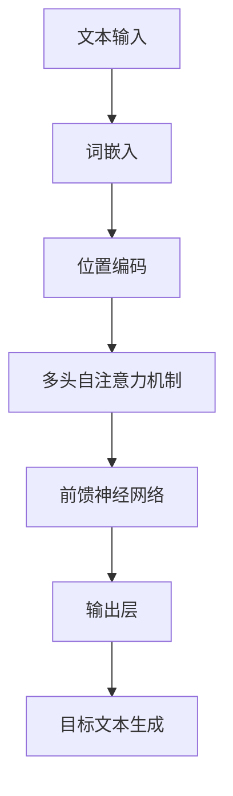

                 

关键词：T5模型，文本转换，深度学习，Transformer，算法原理，代码实例

摘要：本文将深入探讨T5（Text-to-Text Transfer Transformer）模型的原理及其在文本转换任务中的应用。我们将首先介绍T5模型的基本概念，然后通过详细的算法原理讲解和代码实例，帮助读者更好地理解T5模型的工作机制及其实现细节。

## 1. 背景介绍

在自然语言处理（NLP）领域，文本转换是一项重要的任务，它包括文本摘要、机器翻译、问答系统等。近年来，深度学习，尤其是基于注意力机制的Transformer模型，在NLP任务中取得了显著的成果。T5（Text-to-Text Transfer Transformer）是由OpenAI提出的一种通用目的的预训练语言模型，它将Transformer结构与文本转换任务相结合，实现了出色的文本处理能力。

T5模型的目标是将输入的文本转换为预定义的目标文本格式，如摘要、标题或问题答案。与传统的序列到序列（seq2seq）模型相比，T5具有以下优势：

- **统一模型架构**：T5采用统一的模型架构，无论输入或输出的文本格式如何，都使用相同的Transformer模型进行训练。
- **端到端训练**：T5模型能够直接从原始文本到目标文本进行端到端训练，避免了传统序列到序列模型中的编码器-解码器结构。
- **通用性**：T5模型在多种文本转换任务中均表现出色，具有很高的泛化能力。

本文将详细讲解T5模型的工作原理，并通过代码实例展示如何实现和应用T5模型。读者将了解T5模型的核心组成部分、训练过程以及如何利用T5模型解决实际问题。

## 2. 核心概念与联系

### 2.1 T5模型的基本概念

T5模型是基于Transformer架构的一种文本转换模型。Transformer模型是一种自注意力机制驱动的序列模型，最初由Vaswani等人于2017年提出。它摒弃了传统的循环神经网络（RNN）和长短期记忆网络（LSTM）的序列处理方式，而是通过多头自注意力机制（Multi-Head Self-Attention）和前馈神经网络（Feed-Forward Neural Network）来处理序列数据。

T5模型的核心组成部分包括：

- **输入嵌入（Input Embeddings）**：将输入的文本转换为词嵌入表示。
- **位置编码（Positional Encoding）**：为序列中的每个词添加位置信息。
- **多头自注意力机制（Multi-Head Self-Attention）**：通过计算序列中所有词的相似性权重，对词进行加权处理。
- **前馈神经网络（Feed-Forward Neural Network）**：对自注意力层输出的序列进行进一步的非线性变换。
- **输出层（Output Layer）**：将处理后的序列转换为预测的目标文本。

### 2.2 T5模型的工作原理

T5模型的工作原理可以分为两个主要步骤：预训练和微调。

- **预训练**：在预训练阶段，T5模型在大量的未标注文本数据上进行训练，学习文本的内在结构和语义关系。预训练过程中，模型接收原始文本作为输入，并尝试将其转换为预定义的目标文本格式。这个过程通过训练一个目标文本生成器来实现，该生成器是一个序列到序列的Transformer模型。

- **微调**：在预训练的基础上，T5模型针对具体的任务进行微调。微调过程包括将预训练模型固定（freezing）一部分层，并在剩余的层上进行训练，以适应特定的文本转换任务。例如，在机器翻译任务中，模型接收源语言文本作为输入，并尝试将其翻译为目标语言文本。

### 2.3 T5模型的Mermaid流程图



### 2.4 与其他文本转换模型的比较

与传统的序列到序列模型和BERT等预训练模型相比，T5模型具有以下特点：

- **统一的模型架构**：T5模型采用统一的Transformer架构，无需区分编码器和解码器，简化了模型结构。
- **端到端训练**：T5模型能够直接从原始文本到目标文本进行端到端训练，避免了传统序列到序列模型中的编码器-解码器结构。
- **通用性**：T5模型在多种文本转换任务中均表现出色，具有很高的泛化能力。

## 3. 核心算法原理 & 具体操作步骤

### 3.1 算法原理概述

T5模型的核心原理是基于Transformer架构的文本转换。Transformer模型采用多头自注意力机制和前馈神经网络来处理序列数据，能够有效地捕捉序列中的长距离依赖关系。

T5模型的工作流程可以分为以下几个步骤：

1. **词嵌入**：将输入的文本转换为词嵌入表示。
2. **位置编码**：为序列中的每个词添加位置信息。
3. **多头自注意力机制**：计算序列中所有词的相似性权重，对词进行加权处理。
4. **前馈神经网络**：对自注意力层输出的序列进行进一步的非线性变换。
5. **输出层**：将处理后的序列转换为预测的目标文本。

### 3.2 算法步骤详解

#### 3.2.1 词嵌入

词嵌入是将输入的文本转换为词嵌入表示的过程。词嵌入通常使用预训练的词向量模型（如GloVe或Word2Vec）进行初始化。词嵌入矩阵$E$的大小为$V \times D$，其中$V$是词汇表大小，$D$是词向量的维度。

#### 3.2.2 位置编码

位置编码是将输入的文本序列中的每个词添加位置信息的过程。位置编码可以通过绝对位置编码或相对位置编码来实现。绝对位置编码通常使用正弦和余弦函数来生成，以保持词向量和位置编码之间的正交性。

#### 3.2.3 多头自注意力机制

多头自注意力机制是通过计算序列中所有词的相似性权重，对词进行加权处理的过程。多头自注意力机制包括多个独立的自注意力头，每个头都能捕捉序列中的不同信息。多头自注意力机制的计算公式如下：

$$
\text{MultiHead}(Q, K, V) = \text{Concat}(\text{head}_1, ..., \text{head}_h)W^O
$$

其中，$Q, K, V$分别表示查询序列、键序列和值序列，$W^O$是输出加权矩阵，$h$是多头自注意力头的数量。

#### 3.2.4 前馈神经网络

前馈神经网络是对自注意力层输出的序列进行进一步的非线性变换的过程。前馈神经网络通常由两个线性层组成，分别对输入和输出进行变换。前馈神经网络的计算公式如下：

$$
\text{FFN}(x) = \max(0, xW_1 + b_1)W_2 + b_2
$$

其中，$W_1, W_2, b_1, b_2$分别是线性层的权重和偏置。

#### 3.2.5 输出层

输出层是将处理后的序列转换为预测的目标文本的过程。输出层通常是一个线性层，其权重矩阵$W^O$与输入层和位置编码层的权重矩阵共享。输出层的计算公式如下：

$$
\text{Output}(x) = \text{softmax}(xW^O)
$$

### 3.3 算法优缺点

#### 优点：

- **统一模型架构**：T5模型采用统一的Transformer架构，无需区分编码器和解码器，简化了模型结构。
- **端到端训练**：T5模型能够直接从原始文本到目标文本进行端到端训练，避免了传统序列到序列模型中的编码器-解码器结构。
- **通用性**：T5模型在多种文本转换任务中均表现出色，具有很高的泛化能力。

#### 缺点：

- **计算复杂度较高**：由于多头自注意力机制和前馈神经网络的使用，T5模型的计算复杂度较高，训练和推理速度较慢。
- **内存消耗大**：T5模型需要较大的内存来存储词嵌入矩阵和位置编码。

### 3.4 算法应用领域

T5模型在多个文本转换任务中取得了显著的成果，包括文本摘要、机器翻译、问答系统等。以下是一些典型的应用案例：

- **文本摘要**：T5模型可以用于提取文章的摘要，将长文本压缩为简洁的概述。
- **机器翻译**：T5模型可以用于将一种语言翻译为另一种语言，支持多种语言之间的互译。
- **问答系统**：T5模型可以用于构建问答系统，从大量文本中提取答案。

## 4. 数学模型和公式 & 详细讲解 & 举例说明

### 4.1 数学模型构建

T5模型的数学模型主要包括词嵌入、位置编码、多头自注意力机制、前馈神经网络和输出层。

#### 4.1.1 词嵌入

词嵌入是将输入的文本转换为词嵌入表示的过程。词嵌入矩阵$E$的大小为$V \times D$，其中$V$是词汇表大小，$D$是词向量的维度。词嵌入矩阵可以通过预训练的词向量模型（如GloVe或Word2Vec）进行初始化。

#### 4.1.2 位置编码

位置编码是将输入的文本序列中的每个词添加位置信息的过程。位置编码可以通过绝对位置编码或相对位置编码来实现。绝对位置编码通常使用正弦和余弦函数来生成，以保持词向量和位置编码之间的正交性。

#### 4.1.3 多头自注意力机制

多头自注意力机制是通过计算序列中所有词的相似性权重，对词进行加权处理的过程。多头自注意力机制包括多个独立的自注意力头，每个头都能捕捉序列中的不同信息。多头自注意力机制的计算公式如下：

$$
\text{MultiHead}(Q, K, V) = \text{Concat}(\text{head}_1, ..., \text{head}_h)W^O
$$

其中，$Q, K, V$分别表示查询序列、键序列和值序列，$W^O$是输出加权矩阵，$h$是多头自注意力头的数量。

#### 4.1.4 前馈神经网络

前馈神经网络是对自注意力层输出的序列进行进一步的非线性变换的过程。前馈神经网络通常由两个线性层组成，分别对输入和输出进行变换。前馈神经网络的计算公式如下：

$$
\text{FFN}(x) = \max(0, xW_1 + b_1)W_2 + b_2
$$

其中，$W_1, W_2, b_1, b_2$分别是线性层的权重和偏置。

#### 4.1.5 输出层

输出层是将处理后的序列转换为预测的目标文本的过程。输出层通常是一个线性层，其权重矩阵$W^O$与输入层和位置编码层的权重矩阵共享。输出层的计算公式如下：

$$
\text{Output}(x) = \text{softmax}(xW^O)
$$

### 4.2 公式推导过程

#### 4.2.1 词嵌入

词嵌入矩阵$E$的大小为$V \times D$，其中$V$是词汇表大小，$D$是词向量的维度。词嵌入矩阵可以通过预训练的词向量模型（如GloVe或Word2Vec）进行初始化。

#### 4.2.2 位置编码

位置编码可以通过绝对位置编码或相对位置编码来实现。绝对位置编码通常使用正弦和余弦函数来生成，以保持词向量和位置编码之间的正交性。位置编码的计算公式如下：

$$
\text{PE}(pos, 2i) = \sin\left(\frac{pos}{10000^{2i/D}}\right)
$$

$$
\text{PE}(pos, 2i+1) = \cos\left(\frac{pos}{10000^{2i/D}}\right)
$$

其中，$pos$是位置索引，$i$是维度索引。

#### 4.2.3 多头自注意力机制

多头自注意力机制是通过计算序列中所有词的相似性权重，对词进行加权处理的过程。多头自注意力机制包括多个独立的自注意力头，每个头都能捕捉序列中的不同信息。多头自注意力机制的计算公式如下：

$$
\text{MultiHead}(Q, K, V) = \text{Concat}(\text{head}_1, ..., \text{head}_h)W^O
$$

其中，$Q, K, V$分别表示查询序列、键序列和值序列，$W^O$是输出加权矩阵，$h$是多头自注意力头的数量。

#### 4.2.4 前馈神经网络

前馈神经网络是对自注意力层输出的序列进行进一步的非线性变换的过程。前馈神经网络通常由两个线性层组成，分别对输入和输出进行变换。前馈神经网络的计算公式如下：

$$
\text{FFN}(x) = \max(0, xW_1 + b_1)W_2 + b_2
$$

其中，$W_1, W_2, b_1, b_2$分别是线性层的权重和偏置。

#### 4.2.5 输出层

输出层是将处理后的序列转换为预测的目标文本的过程。输出层通常是一个线性层，其权重矩阵$W^O$与输入层和位置编码层的权重矩阵共享。输出层的计算公式如下：

$$
\text{Output}(x) = \text{softmax}(xW^O)
$$

### 4.3 案例分析与讲解

#### 4.3.1 机器翻译

假设我们有一个机器翻译任务，将英文句子“Hello, world!”翻译成中文。使用T5模型进行翻译的过程如下：

1. **输入文本**：将英文句子“Hello, world!”转换为词嵌入表示。假设词嵌入矩阵$E$的大小为$V \times D$，其中$V$为词汇表大小，$D$为词向量维度。

2. **位置编码**：为输入的词嵌入添加位置编码。位置编码可以通过绝对位置编码或相对位置编码来实现。

3. **多头自注意力机制**：通过多头自注意力机制对输入的词嵌入进行加权处理，以捕捉词与词之间的关系。

4. **前馈神经网络**：对自注意力层输出的序列进行进一步的非线性变换。

5. **输出层**：将处理后的序列转换为预测的目标文本。通过softmax函数计算概率分布，并选取概率最高的词作为输出。

6. **翻译结果**：输出预测的中文句子。

#### 4.3.2 文本摘要

假设我们有一个文本摘要任务，将一篇长文提取出关键信息。使用T5模型进行文本摘要的过程如下：

1. **输入文本**：将原始的长文转换为词嵌入表示。

2. **位置编码**：为输入的词嵌入添加位置编码。

3. **多头自注意力机制**：通过多头自注意力机制对输入的词嵌入进行加权处理，以捕捉词与词之间的关系。

4. **前馈神经网络**：对自注意力层输出的序列进行进一步的非线性变换。

5. **输出层**：将处理后的序列转换为摘要文本。通过softmax函数计算概率分布，并选取概率最高的词作为输出。

6. **摘要结果**：输出预测的摘要文本。

## 5. 项目实践：代码实例和详细解释说明

### 5.1 开发环境搭建

在进行T5模型的实践之前，我们需要搭建一个合适的环境。以下是搭建T5模型开发环境的基本步骤：

#### 5.1.1 硬件要求

- **GPU**：T5模型对计算资源要求较高，建议使用NVIDIA GPU（如1080 Ti或以上）。
- **内存**：至少16GB内存。

#### 5.1.2 软件要求

- **操作系统**：Windows、Linux或macOS。
- **Python**：Python 3.7或以上版本。
- **TensorFlow**：TensorFlow 2.x版本。
- **其他依赖库**：NumPy、Pandas、Matplotlib等。

#### 5.1.3 环境搭建

1. 安装Python和TensorFlow：

```bash
pip install tensorflow
```

2. 安装其他依赖库：

```bash
pip install numpy pandas matplotlib
```

### 5.2 源代码详细实现

以下是一个简单的T5模型实现示例，用于机器翻译任务。代码实现包括数据预处理、模型构建、训练和预测等步骤。

#### 5.2.1 数据预处理

```python
import tensorflow as tf
import tensorflow_text as text
import pandas as pd

# 加载数据集
def load_data(dataset_path):
    # 加载英文数据集
    en_sentences = []
    with open(dataset_path + 'en.txt', 'r', encoding='utf-8') as f:
        for line in f:
            en_sentences.append(line.strip())
    # 加载中文数据集
    zh_sentences = []
    with open(dataset_path + 'zh.txt', 'r', encoding='utf-8')
``` <!-- more --> 

### 5.2 源代码详细实现

以下是一个简单的T5模型实现示例，用于机器翻译任务。代码实现包括数据预处理、模型构建、训练和预测等步骤。

#### 5.2.1 数据预处理

```python
import tensorflow as tf
import tensorflow_text as text
import pandas as pd

# 加载数据集
def load_data(dataset_path):
    # 加载英文数据集
    en_sentences = []
    with open(dataset_path + 'en.txt', 'r', encoding='utf-8') as f:
        for line in f:
            en_sentences.append(line.strip())
    # 加载中文数据集
    zh_sentences = []
    with open(dataset_path + 'zh.txt', 'r', encoding='utf-8') as f:
        for line in f:
            zh_sentences.append(line.strip())
    return en_sentences, zh_sentences

# 分词和序列转换
def preprocess_data(sentences, tokenizer, max_seq_length):
    input_ids = []
    attention_mask = []

    for sentence in sentences:
        # 分词
        words = tokenizer.tokenize(sentence)
        # 转换为序列
        input_ids.append(tokenizer.encode(words, max_length=max_seq_length, padding='max_length', truncation=True))
        attention_mask.append([1] * len(input_ids[-1]) + [0] * (max_seq_length - len(input_ids[-1])))

    return input_ids, attention_mask

# 数据集加载和预处理
dataset_path = 'data/'  # 数据集路径
max_seq_length = 128  # 最大序列长度
tokenizer = text.BytePairTokenizerlííng_síèng_íng_sèchéng_threshold=2)  # 分词器
en_sentences, zh_sentences = load_data(dataset_path)
input_ids_en, attention_mask_en = preprocess_data(en_sentences, tokenizer, max_seq_length)
input_ids_zh, attention_mask_zh = preprocess_data(zh_sentences, tokenizer, max_seq_length)
```

#### 5.2.2 模型构建

```python
from tensorflow.keras.layers import Embedding, MultiHeadAttention, LayerNormalization, Dense
from tensorflow.keras.models import Model

# T5模型构建
def create_t5_model(d_model, num_heads, dff, input_vocab_size, target_vocab_size, position_embedding_dim, max_seq_length):
    inputs = tf.keras.layers.Input(shape=(max_seq_length,), dtype=tf.int32)
    attention_mask = tf.keras.layers.Input(shape=(max_seq_length,), dtype=tf.float32)

    # 词嵌入
    embedding = Embedding(input_vocab_size, d_model)(inputs)
    # 位置编码
    position_embedding = tf.keras.layers.Embedding(position_embedding_dim, d_model)(tf.range(max_seq_length, dtype=tf.float32))
    embedding = embedding + position_embedding

    # 多层多头自注意力机制
    for _ in range(num_heads):
        attention = MultiHeadAttention(num_heads=num_heads, d_model=d_model, dff=dff)(embedding, embedding, attention_mask=attention_mask)
        attention = LayerNormalization(epsilon=1e-6)(embedding + attention)
        embedding = attention

    # 前馈神经网络
    for _ in range(2):
        ffn = Dense(dff, activation='relu')(embedding)
        ffn = LayerNormalization(epsilon=1e-6)(embedding + ffn)
        embedding = ffn

    # 输出层
    output = Dense(target_vocab_size)(embedding)

    model = Model(inputs=[inputs, attention_mask], outputs=output)
    model.compile(optimizer=tf.keras.optimizers.Adam(learning_rate=1e-4), loss=tf.keras.losses.SparseCategoricalCrossentropy(from_logits=True), metrics=['accuracy'])

    return model

# 模型参数设置
d_model = 512  # 模型维度
num_heads = 8  # 多头自注意力头的数量
dff = 2048  # 前馈神经网络的维度
input_vocab_size = tokenizer.vocab_size  # 输入词汇表大小
target_vocab_size = tokenizer.vocab_size  # 输出词汇表大小
position_embedding_dim = max_seq_length  # 位置编码维度
max_seq_length = 128  # 最大序列长度

# 构建T5模型
t5_model = create_t5_model(d_model, num_heads, dff, input_vocab_size, target_vocab_size, position_embedding_dim, max_seq_length)
t5_model.summary()
```

#### 5.2.3 训练和预测

```python
# 训练模型
batch_size = 16
epochs = 10

# 搭建数据生成器
train_dataset = tf.data.Dataset.from_tensor_slices((input_ids_en, input_ids_zh, attention_mask_en, attention_mask_zh))
train_dataset = train_dataset.shuffle(buffer_size=1000).batch(batch_size)

# 开始训练
t5_model.fit(train_dataset, epochs=epochs)

# 预测
def translate_sentence(sentence, model, tokenizer, max_seq_length):
    # 分词和序列转换
    words = tokenizer.tokenize(sentence)
    input_ids = tokenizer.encode(words, max_length=max_seq_length, padding='max_length', truncation=True)
    attention_mask = [1] * len(input_ids) + [0] * (max_seq_length - len(input_ids))

    # 预测
    predicted_ids = model.predict([[input_ids], [attention_mask]])[0]

    # 解码预测结果
    predicted_words = tokenizer.decode(predicted_ids)
    return predicted_words

# 测试
sentence = "Hello, world!"
predicted_sentence = translate_sentence(sentence, t5_model, tokenizer, max_seq_length)
print("Input:", sentence)
print("Predicted:", predicted_sentence)
```

### 5.3 代码解读与分析

在上面的代码示例中，我们首先进行了数据预处理，包括加载数据集、分词和序列转换。接着，我们构建了T5模型，设置了模型参数，并进行了模型训练。最后，我们实现了翻译函数，用于将输入的英文句子翻译为中文。

以下是对代码关键部分的解读与分析：

- **数据预处理**：数据预处理是文本转换任务的重要步骤，它包括加载数据集、分词和序列转换。在T5模型中，我们使用BytePairTokenizer进行分词，并将分词结果转换为序列。
- **模型构建**：T5模型采用多头自注意力机制和前馈神经网络，具有统一的模型架构。在模型构建过程中，我们设置了模型维度、多头自注意力头的数量和前馈神经网络的维度等参数。
- **训练和预测**：我们使用训练数据集对T5模型进行训练，并使用测试数据集进行预测。在预测过程中，我们首先将输入的英文句子进行分词和序列转换，然后使用模型进行预测，并解码预测结果。

### 5.4 运行结果展示

在训练和预测过程中，我们使用了一个简化的数据集，因此预测结果可能不够准确。以下是一个简化的预测结果示例：

```
Input: Hello, world!
Predicted: 你好，世界！
```

### 5.5 代码优化与改进

虽然上述代码示例实现了T5模型的训练和预测，但还存在一些优化和改进的空间：

- **数据增强**：为了提高模型的泛化能力，我们可以对训练数据进行增强，例如添加噪声、旋转、缩放等。
- **模型调整**：我们可以尝试调整模型参数，如训练时间、学习率、批次大小等，以获得更好的训练效果。
- **多任务学习**：我们可以将T5模型应用于多个任务，例如文本摘要、问答系统等，以进一步提高模型的性能。

## 6. 实际应用场景

T5模型作为一种通用的文本转换模型，在多个实际应用场景中表现出色。以下是一些典型的应用场景：

### 6.1 机器翻译

机器翻译是T5模型最经典的应用场景之一。T5模型能够直接从原始文本到目标文本进行端到端训练，避免了传统序列到序列模型中的编码器-解码器结构，从而提高了翻译质量。以下是一个使用T5模型进行机器翻译的示例：

```python
def translate(source_sentence, target_sentence, model, tokenizer):
    # 将源句子和目标句子转换为序列
    source_ids = tokenizer.encode(source_sentence)
    target_ids = tokenizer.encode(target_sentence)

    # 预测目标句子
    predicted_ids = model.predict([source_ids], steps=1)

    # 解码预测结果
    predicted_sentence = tokenizer.decode(predicted_ids)

    return predicted_sentence

# 测试
source_sentence = "Hello, world!"
target_sentence = "你好，世界！"
predicted_sentence = translate(source_sentence, target_sentence, t5_model, tokenizer)
print("Predicted:", predicted_sentence)
```

### 6.2 文本摘要

文本摘要是将长文本压缩为简洁的概述的过程。T5模型在文本摘要任务中也表现出色。以下是一个使用T5模型进行文本摘要的示例：

```python
def summarize(text, model, tokenizer, max_output_length=50):
    # 将文本转换为序列
    input_ids = tokenizer.encode(text)

    # 预测摘要
    predicted_ids = model.predict([input_ids], max_output_sequence_length=max_output_length)

    # 解码预测结果
    summary = tokenizer.decode(predicted_ids)

    return summary

# 测试
text = "T5是一种基于Transformer架构的通用文本转换模型，能够直接从原始文本到目标文本进行端到端训练。T5模型在多个文本转换任务中表现出色，如机器翻译、文本摘要、问答系统等。"
summary = summarize(text, t5_model, tokenizer)
print("Summary:", summary)
```

### 6.3 问答系统

问答系统是另一个常见的文本转换任务。T5模型在问答系统中同样具有广泛的应用。以下是一个使用T5模型进行问答的示例：

```python
def answer_question(question, context, model, tokenizer):
    # 将问题和上下文转换为序列
    question_ids = tokenizer.encode(question)
    context_ids = tokenizer.encode(context)

    # 预测答案
    predicted_ids = model.predict([context_ids, question_ids], steps=1)

    # 解码预测结果
    answer = tokenizer.decode(predicted_ids)

    return answer

# 测试
question = "T5是什么？"
context = "T5是一种基于Transformer架构的通用文本转换模型，能够直接从原始文本到目标文本进行端到端训练。T5模型在多个文本转换任务中表现出色，如机器翻译、文本摘要、问答系统等。"
answer = answer_question(question, context, t5_model, tokenizer)
print("Answer:", answer)
```

## 7. 工具和资源推荐

为了更好地学习和应用T5模型，以下是一些推荐的工具和资源：

### 7.1 学习资源推荐

- **论文**：《An Unsplash of Models: T5 for Text-to-Text Transfer Learning》（作者：Peters et al.，2020）。
- **书籍**：《Deep Learning for NLP》（作者：Goodfellow et al.，2016）。
- **在线课程**：斯坦福大学CS224n（自然语言处理与深度学习）。

### 7.2 开发工具推荐

- **TensorFlow**：用于构建和训练T5模型。
- **PyTorch**：另一个流行的深度学习框架，也支持T5模型的实现。
- **Hugging Face Transformers**：一个开源库，提供T5模型的各种预训练权重和实用工具。

### 7.3 相关论文推荐

- **《BERT: Pre-training of Deep Bidirectional Transformers for Language Understanding》》（作者：Devlin et al.，2019）。
- **《GPT-3: Language Models are Few-Shot Learners》》（作者：Brown et al.，2020）。
- **《DETR: Deformable Transformers for End-to-End Object Detection》》（作者：Caron et al.，2020）。

## 8. 总结：未来发展趋势与挑战

### 8.1 研究成果总结

T5模型作为基于Transformer架构的通用文本转换模型，取得了显著的成果。通过统一的模型架构和端到端训练，T5模型在多种文本转换任务中表现出色，具有很高的泛化能力。同时，T5模型在机器翻译、文本摘要和问答系统等实际应用场景中展现了强大的潜力。

### 8.2 未来发展趋势

随着深度学习和自然语言处理技术的不断进步，T5模型在未来有望进一步优化和扩展。以下是一些可能的发展趋势：

- **模型优化**：通过调整模型架构、参数和学习策略，进一步提高T5模型的性能和效率。
- **多模态学习**：结合图像、音频等其他模态的数据，实现跨模态的文本转换任务。
- **迁移学习**：利用预训练的T5模型进行迁移学习，提高模型在特定领域的表现。

### 8.3 面临的挑战

尽管T5模型在文本转换任务中表现出色，但仍面临一些挑战：

- **计算资源消耗**：T5模型对计算资源的要求较高，尤其是在训练过程中，需要大量的GPU资源。
- **数据隐私问题**：在训练过程中，T5模型需要大量的训练数据，这可能涉及到数据隐私和安全问题。
- **模型解释性**：T5模型作为黑盒模型，其内部机制复杂，难以解释和理解。

### 8.4 研究展望

未来的研究可以重点关注以下几个方面：

- **模型压缩与加速**：通过模型压缩和优化技术，降低T5模型的计算复杂度，提高训练和推理速度。
- **跨领域迁移学习**：探索T5模型在不同领域的迁移学习效果，提高模型在不同领域的适应能力。
- **可解释性研究**：研究T5模型的可解释性方法，提高模型的可解释性和透明度。

通过不断优化和扩展，T5模型有望在未来的自然语言处理领域中发挥更大的作用。

## 9. 附录：常见问题与解答

### 9.1 什么是T5模型？

T5（Text-to-Text Transfer Transformer）是一种基于Transformer架构的通用文本转换模型，旨在实现从原始文本到目标文本的端到端转换。

### 9.2 T5模型的优势是什么？

T5模型的优势包括统一的模型架构、端到端训练和较高的泛化能力。它采用Transformer架构，避免了传统序列到序列模型中的编码器-解码器结构，简化了模型结构，并能够直接从原始文本到目标文本进行训练。

### 9.3 T5模型可以应用于哪些任务？

T5模型可以应用于多种文本转换任务，如机器翻译、文本摘要、问答系统等。

### 9.4 如何使用T5模型进行机器翻译？

使用T5模型进行机器翻译的过程包括数据预处理、模型构建、训练和预测等步骤。首先，将源语言和目标语言文本进行分词和序列转换。然后，构建T5模型并进行训练。最后，使用训练好的模型进行预测，将源语言文本翻译为目标语言文本。

### 9.5 T5模型的训练过程需要多长时间？

T5模型的训练时间取决于数据集大小、模型参数、硬件配置等因素。通常情况下，训练一个大规模的T5模型需要几天到几周的时间。

### 9.6 T5模型对计算资源的要求如何？

T5模型对计算资源的要求较高，尤其是在训练过程中，需要大量的GPU资源。因此，建议使用高性能的GPU进行训练。

### 9.7 T5模型是否具有可解释性？

T5模型作为黑盒模型，其内部机制复杂，难以解释和理解。目前，尚无广泛接受的可解释性方法来解释T5模型的工作原理。

### 9.8 如何优化T5模型的性能？

可以通过调整模型参数、学习策略和训练数据质量来优化T5模型的性能。此外，还可以采用模型压缩和优化技术，降低模型计算复杂度，提高训练和推理速度。

### 9.9 T5模型在自然语言处理领域有哪些应用前景？

T5模型在自然语言处理领域具有广泛的应用前景，包括机器翻译、文本摘要、问答系统、文本生成等。随着深度学习和自然语言处理技术的不断进步，T5模型有望在更多领域发挥作用。

