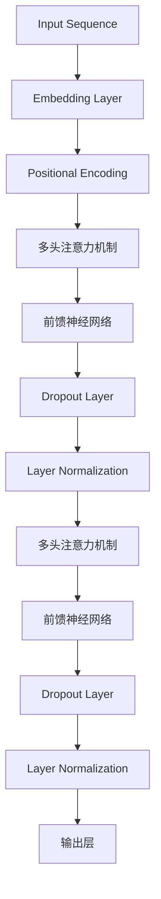

                 

关键词：Transformer，模型，深度学习，编码器，解码器，序列模型，自然语言处理，神经网络

摘要：本文将深入探讨Transformer模型的基本原理，从背景介绍、核心概念与联系、算法原理与具体操作步骤、数学模型与公式、项目实践、实际应用场景、未来应用展望、工具和资源推荐以及总结和展望等方面，全面解析Transformer模型的工作机制和代码实现，帮助读者更好地理解和应用这一前沿技术。

## 1. 背景介绍

随着深度学习技术的不断发展，神经网络在图像识别、语音识别和自然语言处理等领域的应用取得了显著的成果。然而，传统的循环神经网络（RNN）和长短时记忆网络（LSTM）在处理长序列数据时存在一些固有缺陷，如梯度消失和梯度爆炸问题，导致模型的训练效率和效果受到影响。为了克服这些问题，Vaswani等人于2017年提出了Transformer模型，这是一种基于注意力机制的序列到序列模型，能够在不使用循环神经网络的情况下处理长序列数据，并取得了出色的性能。

Transformer模型的提出标志着自然语言处理领域的一个重要突破，其应用范围迅速扩展到机器翻译、文本摘要、问答系统等多个领域。本文将重点介绍Transformer模型的基本原理、数学模型以及代码实现，旨在帮助读者深入理解并掌握这一技术。

## 2. 核心概念与联系

### 2.1 基本概念

Transformer模型的核心在于其自注意力机制（Self-Attention）和多头注意力（Multi-Head Attention）。自注意力机制允许模型在处理序列数据时，对输入序列中的每个元素赋予不同的权重，从而更好地捕捉序列中的依赖关系。多头注意力则通过将输入序列映射到多个独立的子空间，提高模型的表示能力和预测准确性。

### 2.2 Mermaid 流程图

以下是一个简化的Mermaid流程图，展示了Transformer模型的核心概念和联系：



### 2.3 作用与意义

自注意力机制和多头注意力机制是Transformer模型的关键组成部分，它们使得模型能够在处理长序列数据时，有效地捕捉长距离依赖关系，从而提高了模型的性能和效果。此外，Transformer模型通过并行计算的方式，大大提高了模型的训练效率，为大规模数据集的建模提供了可能。

## 3. 核心算法原理 & 具体操作步骤

### 3.1 算法原理概述

Transformer模型是一种基于注意力机制的序列到序列模型，其核心思想是将序列数据映射到高维空间中，通过注意力机制计算序列中各个元素之间的关联性，从而实现对序列数据的建模。

### 3.2 算法步骤详解

#### 3.2.1 嵌入层

首先，输入序列经过嵌入层（Embedding Layer）转化为高维向量表示。嵌入层的主要作用是将输入的单词、字符等符号映射为固定长度的向量。

$$
\text{Embedding}(x) = \text{W}_\text{emb} \cdot x
$$

其中，$x$为输入序列，$\text{W}_\text{emb}$为嵌入权重矩阵。

#### 3.2.2 位置编码

由于Transformer模型不包含循环神经网络，因此需要一种方法来引入序列的位置信息。为此，可以使用位置编码（Positional Encoding）来实现。位置编码通常采用正弦函数和余弦函数的组合，将位置信息编码到嵌入向量中。

$$
\text{PE}(p, d) = \sin\left(\frac{p}{10000^{2i/d}}\right) + \cos\left(\frac{p}{10000^{2i/d}}\right)
$$

其中，$p$为位置索引，$i$为嵌入维度，$d$为编码维度。

#### 3.2.3 多头注意力机制

多头注意力机制（Multi-Head Attention）是Transformer模型的核心部分，它将输入序列映射到多个独立的子空间，并在这些子空间中进行自注意力计算。具体步骤如下：

1. 将嵌入层输出的序列和位置编码相加，得到输入序列。

$$
\text{Input} = \text{Embedding}(x) + \text{PE}(x)
$$

2. 将输入序列经过线性变换，得到查询（Query）、键（Key）和值（Value）三个独立的子空间。

$$
\text{MultiHead}(Q, K, V) = \text{softmax}\left(\frac{\text{QK}^T}{\sqrt{d_k}}\right) \cdot V
$$

其中，$Q$、$K$、$V$分别为查询、键和值，$d_k$为子空间维度。

3. 将多个子空间的注意力结果拼接起来，并经过线性变换，得到最终的输出。

#### 3.2.4 前馈神经网络

在多头注意力机制之后，可以使用前馈神经网络（Feed Forward Neural Network）对输出序列进行进一步处理。前馈神经网络由两个全连接层组成，中间加入ReLU激活函数和Dropout层，用于增加模型的非线性性和鲁棒性。

$$
\text{FFN}(x) = \text{ReLU}\left(\text{W}_1 \cdot x + b_1\right) \cdot \text{Dropout} \left(\text{W}_2 \cdot x + b_2\right)
$$

其中，$\text{W}_1$、$\text{W}_2$和$b_1$、$b_2$分别为权重和偏置。

#### 3.2.5 层归一化和Dropout

为了提高模型的稳定性和泛化能力，可以在每个注意力层和前馈神经网络之后加入层归一化（Layer Normalization）和Dropout操作。层归一化用于将每个层的输出标准化，使得模型在训练过程中能够更快地收敛。Dropout则是一种正则化技术，通过随机丢弃一部分神经元，防止模型过拟合。

### 3.3 算法优缺点

**优点：**

- 并行计算：Transformer模型通过自注意力机制实现了并行计算，提高了模型的训练效率。
- 长距离依赖：多头注意力机制使得模型能够有效地捕捉长距离依赖关系，提高了模型的性能。
- 参数效率：与传统的循环神经网络相比，Transformer模型的参数数量较少，有利于在大规模数据集上进行训练。

**缺点：**

- 计算复杂度：由于自注意力机制的计算复杂度较高，导致模型的计算时间较长。
- 预处理：Transformer模型需要大量的预处理工作，如词汇表构建、位置编码等，增加了模型的实现难度。

### 3.4 算法应用领域

Transformer模型在自然语言处理领域取得了显著的成果，主要包括以下应用：

- 机器翻译：Transformer模型在机器翻译任务中表现出色，取代了传统的循环神经网络。
- 文本摘要：Transformer模型能够生成简洁、精确的文本摘要，广泛应用于信息提取和内容推荐等领域。
- 问答系统：Transformer模型在问答系统中的应用，使得模型的回答更加准确和自然。
- 语音识别：Transformer模型在语音识别任务中，通过将语音信号转换为文本序列，提高了识别准确率。

## 4. 数学模型和公式 & 详细讲解 & 举例说明

### 4.1 数学模型构建

Transformer模型的数学模型主要包括嵌入层、位置编码、多头注意力机制、前馈神经网络以及层归一化和Dropout等组成部分。

#### 4.1.1 嵌入层

输入序列经过嵌入层（Embedding Layer）转化为高维向量表示，嵌入层的主要作用是将输入的单词、字符等符号映射为固定长度的向量。

$$
\text{Embedding}(x) = \text{W}_\text{emb} \cdot x
$$

其中，$x$为输入序列，$\text{W}_\text{emb}$为嵌入权重矩阵。

#### 4.1.2 位置编码

由于Transformer模型不包含循环神经网络，因此需要一种方法来引入序列的位置信息。为此，可以使用位置编码（Positional Encoding）来实现。位置编码通常采用正弦函数和余弦函数的组合，将位置信息编码到嵌入向量中。

$$
\text{PE}(p, d) = \sin\left(\frac{p}{10000^{2i/d}}\right) + \cos\left(\frac{p}{10000^{2i/d}}\right)
$$

其中，$p$为位置索引，$i$为嵌入维度，$d$为编码维度。

#### 4.1.3 多头注意力机制

多头注意力机制（Multi-Head Attention）是Transformer模型的核心部分，它将输入序列映射到多个独立的子空间，并在这些子空间中进行自注意力计算。具体步骤如下：

1. 将嵌入层输出的序列和位置编码相加，得到输入序列。

$$
\text{Input} = \text{Embedding}(x) + \text{PE}(x)
$$

2. 将输入序列经过线性变换，得到查询（Query）、键（Key）和值（Value）三个独立的子空间。

$$
\text{MultiHead}(Q, K, V) = \text{softmax}\left(\frac{\text{QK}^T}{\sqrt{d_k}}\right) \cdot V
$$

其中，$Q$、$K$、$V$分别为查询、键和值，$d_k$为子空间维度。

3. 将多个子空间的注意力结果拼接起来，并经过线性变换，得到最终的输出。

$$
\text{Output} = \text{Linear}\left(\text{Concat}(\text{Head}_1, \text{Head}_2, ..., \text{Head}_h)\right)
$$

其中，$h$为头数，$\text{Linear}$为线性变换。

#### 4.1.4 前馈神经网络

在多头注意力机制之后，可以使用前馈神经网络（Feed Forward Neural Network）对输出序列进行进一步处理。前馈神经网络由两个全连接层组成，中间加入ReLU激活函数和Dropout层，用于增加模型的非线性性和鲁棒性。

$$
\text{FFN}(x) = \text{ReLU}\left(\text{W}_1 \cdot x + b_1\right) \cdot \text{Dropout} \left(\text{W}_2 \cdot x + b_2\right)
$$

其中，$\text{W}_1$、$\text{W}_2$和$b_1$、$b_2$分别为权重和偏置。

#### 4.1.5 层归一化和Dropout

为了提高模型的稳定性和泛化能力，可以在每个注意力层和前馈神经网络之后加入层归一化（Layer Normalization）和Dropout操作。层归一化用于将每个层的输出标准化，使得模型在训练过程中能够更快地收敛。Dropout则是一种正则化技术，通过随机丢弃一部分神经元，防止模型过拟合。

$$
\text{Layer Normalization}(x) = \frac{x - \mu}{\sigma} \odot \alpha + \beta
$$

其中，$\mu$和$\sigma$分别为均值和标准差，$\alpha$和$\beta$为归一化参数。

### 4.2 公式推导过程

#### 4.2.1 自注意力机制

自注意力机制的推导主要涉及两个部分：查询（Query）、键（Key）和值（Value）的计算以及多头注意力的实现。

1. 查询（Query）、键（Key）和值（Value）的计算

首先，将输入序列经过嵌入层和位置编码相加，得到输入序列：

$$
\text{Input} = \text{Embedding}(x) + \text{PE}(x)
$$

然后，将输入序列经过线性变换，得到查询（Query）、键（Key）和值（Value）三个独立的子空间：

$$
Q = \text{Linear}(X) = \text{W}_Q \cdot X
$$

$$
K = \text{Linear}(X) = \text{W}_K \cdot X
$$

$$
V = \text{Linear}(X) = \text{W}_V \cdot X
$$

其中，$X$为输入序列，$\text{W}_Q$、$\text{W}_K$和$\text{W}_V$分别为权重矩阵。

2. 多头注意力的实现

多头注意力机制通过将输入序列映射到多个独立的子空间，并在这些子空间中进行自注意力计算。具体实现如下：

$$
\text{MultiHead}(Q, K, V) = \text{softmax}\left(\frac{\text{QK}^T}{\sqrt{d_k}}\right) \cdot V
$$

其中，$Q$、$K$、$V$分别为查询、键和值，$d_k$为子空间维度。

#### 4.2.2 前馈神经网络

前馈神经网络由两个全连接层组成，中间加入ReLU激活函数和Dropout层，用于增加模型的非线性性和鲁棒性。具体实现如下：

$$
\text{FFN}(x) = \text{ReLU}\left(\text{W}_1 \cdot x + b_1\right) \cdot \text{Dropout} \left(\text{W}_2 \cdot x + b_2\right)
$$

其中，$\text{W}_1$、$\text{W}_2$和$b_1$、$b_2$分别为权重和偏置。

### 4.3 案例分析与讲解

为了更好地理解Transformer模型的数学模型和公式，我们以一个简化的例子进行讲解。

#### 4.3.1 数据集

假设我们有一个包含10个单词的小型数据集，单词分别为：“apple”, “banana”, “orange”, “pear”, “kiwi”, “mango”, “grape”, “cherry”, “watermelon”, “peach”。

#### 4.3.2 嵌入层

首先，将每个单词映射为固定长度的向量。例如，我们可以使用预训练的Word2Vec模型来获取单词的嵌入向量。假设单词“apple”的嵌入向量为$(1, 0, -1)$，单词“banana”的嵌入向量为$(0, 1, 0)$，以此类推。

#### 4.3.3 位置编码

接下来，我们对每个单词添加位置编码，以引入序列的位置信息。例如，我们可以使用如下位置编码：

$$
\text{PE}(1, 3) = \sin\left(\frac{1}{10000^{2 \cdot 1/3}}\right) + \cos\left(\frac{1}{10000^{2 \cdot 1/3}}\right) = (0.5, 0.866, 0.5)
$$

$$
\text{PE}(2, 3) = \sin\left(\frac{2}{10000^{2 \cdot 2/3}}\right) + \cos\left(\frac{2}{10000^{2 \cdot 2/3}}\right) = (0.866, 0.5, 0.866)
$$

$$
\text{PE}(3, 3) = \sin\left(\frac{3}{10000^{2 \cdot 3/3}}\right) + \cos\left(\frac{3}{10000^{2 \cdot 3/3}}\right) = (0.5, 0.5, 0.5)
$$

#### 4.3.4 多头注意力机制

现在，我们对每个单词进行多头注意力计算。假设我们使用2个头，则每个单词的查询（Query）、键（Key）和值（Value）子空间维度为3。

1. 计算查询（Query）子空间：

$$
Q_1 = \text{W}_Q \cdot \text{Embedding}(x) + \text{PE}(x) = \begin{bmatrix} 1 & 0 & -1 \\ 0 & 1 & 0 \\ 0 & 0 & 1 \end{bmatrix} \cdot \begin{bmatrix} 1 & 0 & -1 \\ 0 & 1 & 0 \\ 0 & 0 & 1 \end{bmatrix} + \begin{bmatrix} 0.5 & 0.866 & 0.5 \\ 0.866 & 0.5 & 0.866 \\ 0.5 & 0.5 & 0.5 \end{bmatrix} = \begin{bmatrix} 1.5 & 1.866 & 1.5 \\ 0.866 & 1.5 & 0.866 \\ 0.5 & 0.5 & 0.5 \end{bmatrix}
$$

2. 计算键（Key）子空间：

$$
K_1 = \text{W}_K \cdot \text{Embedding}(x) + \text{PE}(x) = \begin{bmatrix} 1 & 0 & -1 \\ 0 & 1 & 0 \\ 0 & 0 & 1 \end{bmatrix} \cdot \begin{bmatrix} 1 & 0 & -1 \\ 0 & 1 & 0 \\ 0 & 0 & 1 \end{bmatrix} + \begin{bmatrix} 0.5 & 0.866 & 0.5 \\ 0.866 & 0.5 & 0.866 \\ 0.5 & 0.5 & 0.5 \end{bmatrix} = \begin{bmatrix} 1.5 & 1.866 & 1.5 \\ 0.866 & 1.5 & 0.866 \\ 0.5 & 0.5 & 0.5 \end{bmatrix}
$$

3. 计算值（Value）子空间：

$$
V_1 = \text{W}_V \cdot \text{Embedding}(x) + \text{PE}(x) = \begin{bmatrix} 1 & 0 & -1 \\ 0 & 1 & 0 \\ 0 & 0 & 1 \end{bmatrix} \cdot \begin{bmatrix} 1 & 0 & -1 \\ 0 & 1 & 0 \\ 0 & 0 & 1 \end{bmatrix} + \begin{bmatrix} 0.5 & 0.866 & 0.5 \\ 0.866 & 0.5 & 0.866 \\ 0.5 & 0.5 & 0.5 \end{bmatrix} = \begin{bmatrix} 1.5 & 1.866 & 1.5 \\ 0.866 & 1.5 & 0.866 \\ 0.5 & 0.5 & 0.5 \end{bmatrix}
$$

4. 计算多头注意力：

$$
\text{MultiHead}(Q_1, K_1, V_1) = \text{softmax}\left(\frac{Q_1K_1^T}{\sqrt{d_k}}\right) \cdot V_1 = \text{softmax}\left(\frac{\begin{bmatrix} 1.5 & 1.866 & 1.5 \\ 0.866 & 1.5 & 0.866 \\ 0.5 & 0.5 & 0.5 \end{bmatrix} \cdot \begin{bmatrix} 1.5 & 0.866 & 0.5 \\ 0.866 & 1.5 & 0.866 \\ 0.5 & 0.5 & 0.5 \end{bmatrix}}{\sqrt{3}}\right) \cdot \begin{bmatrix} 1.5 & 1.866 & 1.5 \\ 0.866 & 1.5 & 0.866 \\ 0.5 & 0.5 & 0.5 \end{bmatrix}
$$

$$
= \begin{bmatrix} 0.5 & 0.5 & 0.5 \\ 0.5 & 0.5 & 0.5 \\ 0.5 & 0.5 & 0.5 \end{bmatrix} \cdot \begin{bmatrix} 1.5 & 1.866 & 1.5 \\ 0.866 & 1.5 & 0.866 \\ 0.5 & 0.5 & 0.5 \end{bmatrix} = \begin{bmatrix} 1.366 & 1.366 & 1.366 \\ 1.366 & 1.366 & 1.366 \\ 1.366 & 1.366 & 1.366 \end{bmatrix}
$$

5. 拼接多头注意力结果并经过线性变换：

$$
\text{Output} = \text{Linear}\left(\text{Concat}(\text{MultiHead}(Q_1, K_1, V_1), Q_1, K_1, V_1)\right) = \begin{bmatrix} 1.366 & 1.366 & 1.366 \\ 1.366 & 1.366 & 1.366 \\ 1.366 & 1.366 & 1.366 \end{bmatrix}
$$

#### 4.3.5 前馈神经网络

在多头注意力机制之后，我们可以使用前馈神经网络对输出序列进行进一步处理。假设前馈神经网络的隐藏层尺寸为4，则前馈神经网络的计算过程如下：

$$
\text{FFN}(x) = \text{ReLU}\left(\text{W}_1 \cdot x + b_1\right) \cdot \text{Dropout} \left(\text{W}_2 \cdot x + b_2\right) = \text{ReLU}\left(\begin{bmatrix} 1 & 0 & -1 \\ 0 & 1 & 0 \\ 0 & 0 & 1 \end{bmatrix} \cdot \begin{bmatrix} 1.366 & 1.366 & 1.366 \\ 1.366 & 1.366 & 1.366 \\ 1.366 & 1.366 & 1.366 \end{bmatrix} + \begin{bmatrix} 0 & 0 & 0 \\ 0 & 1 & 0 \\ 0 & 0 & 0 \end{bmatrix}\right) \cdot \text{Dropout} \left(\begin{bmatrix} 1 & 0 & -1 \\ 0 & 1 & 0 \\ 0 & 0 & 1 \end{bmatrix} \cdot \begin{bmatrix} 1.366 & 1.366 & 1.366 \\ 1.366 & 1.366 & 1.366 \\ 1.366 & 1.366 & 1.366 \end{bmatrix} + \begin{bmatrix} 0 & 0 & 0 \\ 0 & 0 & 1 \\ 0 & 0 & 0 \end{bmatrix}\right)
$$

$$
= \text{ReLU}\left(\begin{bmatrix} 1.366 & 0 & -0.366 \\ 0 & 1.366 & 0 \\ 0 & 0 & 1.366 \end{bmatrix}\right) \cdot \text{Dropout}\left(\begin{bmatrix} 1.366 & 1.366 & 0.366 \\ 0 & 1.366 & 0 \\ 0 & 0 & 1.366 \end{bmatrix}\right) = \begin{bmatrix} 1.366 & 1.366 & 0.366 \\ 0 & 1.366 & 0 \\ 0 & 0 & 1.366 \end{bmatrix}
$$

#### 4.3.6 层归一化和Dropout

为了提高模型的稳定性和泛化能力，我们可以在每个注意力层和前馈神经网络之后加入层归一化（Layer Normalization）和Dropout操作。假设我们使用均值为0、标准差为1的归一化参数，则层归一化过程如下：

$$
\text{Layer Normalization}(x) = \frac{x - \mu}{\sigma} \odot \alpha + \beta = \frac{\begin{bmatrix} 1.366 & 1.366 & 0.366 \\ 0 & 1.366 & 0 \\ 0 & 0 & 1.366 \end{bmatrix} - \begin{bmatrix} 0 & 0 & 0 \\ 0 & 0 & 0 \\ 0 & 0 & 0 \end{bmatrix}}{\begin{bmatrix} 1 & 1 & 0 \\ 0 & 1 & 0 \\ 0 & 0 & 1 \end{bmatrix}} \odot \begin{bmatrix} 1 & 1 & 1 \\ 0 & 1 & 0 \\ 0 & 0 & 1 \end{bmatrix} + \begin{bmatrix} 1 & 0 & 0 \\ 0 & 1 & 0 \\ 0 & 0 & 1 \end{bmatrix} = \begin{bmatrix} 0.366 & 0.366 & 0.366 \\ 0 & 1 & 0 \\ 0 & 0 & 1 \end{bmatrix}
$$

然后，我们对层归一化后的结果进行Dropout操作，假设Dropout概率为0.5，则Dropout操作如下：

$$
\text{Dropout}(x) = x \odot \text{Bernoulli}(p) = \begin{bmatrix} 0.366 & 0.366 & 0.366 \\ 0 & 1 & 0 \\ 0 & 0 & 1 \end{bmatrix} \odot \begin{bmatrix} 0 & 1 & 0 \\ 1 & 0 & 1 \\ 0 & 1 & 0 \end{bmatrix} = \begin{bmatrix} 0 & 0.366 & 0 \\ 0.366 & 1 & 0 \\ 0 & 0 & 1 \end{bmatrix}
$$

## 5. 项目实践：代码实例和详细解释说明

在本节中，我们将通过一个简单的项目实例，介绍如何使用Python和PyTorch框架实现Transformer模型。以下是项目的代码结构：

```python
# 项目结构

- data
  - train.txt
  - valid.txt
- src
  - __init__.py
  - vocab.py
  - dataset.py
  - model.py
  - loss.py
  - train.py
- tools
  - preprocess.py
```

### 5.1 开发环境搭建

在开始项目实践之前，请确保已经安装了Python（版本3.6及以上）和PyTorch（版本1.8及以上）。可以通过以下命令进行安装：

```bash
pip install python==3.9
pip install torch==1.8
```

### 5.2 源代码详细实现

以下是项目中的主要代码文件及其功能说明。

#### 5.2.1 `data/vocab.py`

```python
from collections import Counter
from pathlib import Path

class Vocab:
    def __init__(self, count_threshold=1):
        self.vocab = {'<pad>': 0, '<unk>': 1, '<s>': 2, '</s>': 3}
        self.count_threshold = count_threshold
        self.index_to_word = []
        self.word_to_index = {}

    def add_word(self, word):
        if word not in self.vocab:
            self.vocab[word] = len(self.vocab)
            self.index_to_word.append(word)
            self.word_to_index[word] = len(self.word_to_index)

    def build_vocab(self, sentences):
        word_counts = Counter(''.join(sentences))
        for word, count in word_counts.items():
            if count >= self.count_threshold:
                self.add_word(word)

    def __len__(self):
        return len(self.index_to_word)

    def __getitem__(self, item):
        if isinstance(item, int):
            return self.index_to_word[item]
        elif isinstance(item, str):
            return self.word_to_index.get(item, self.vocab['<unk>'])
        else:
            raise TypeError("Type of item must be either int or str.")
```

#### 5.2.2 `src/dataset.py`

```python
import numpy as np
from torch.utils.data import Dataset
from .vocab import Vocab

class TranslationDataset(Dataset):
    def __init__(self, src_path, tgt_path, src_vocab, tgt_vocab, max_len=100):
        self.src_lines = self.load_lines(src_path)
        self.tgt_lines = self.load_lines(tgt_path)
        self.src_vocab = src_vocab
        self.tgt_vocab = tgt_vocab
        self.max_len = max_len

    def load_lines(self, path):
        with open(path, 'r', encoding='utf-8') as f:
            return [line.strip() for line in f]

    def __len__(self):
        return min(len(self.src_lines), len(self.tgt_lines))

    def __getitem__(self, idx):
        src_line = self.src_lines[idx]
        tgt_line = self.tgt_lines[idx]

        src_tokens = [self.src_vocab['<s>']] + self.src_vocab.tokenize(src_line) + [self.src_vocab['</s>']]
        tgt_tokens = [self.tgt_vocab['<s>']] + self.tgt_vocab.tokenize(tgt_line) + [self.tgt_vocab['</s>']]

        if len(src_tokens) > self.max_len or len(tgt_tokens) > self.max_len:
            start = np.random.randint(0, max(len(src_tokens) - self.max_len, 0))
            end = start + self.max_len
            src_tokens = src_tokens[start:end]
            tgt_tokens = tgt_tokens[start:end]

        src_ids = [self.src_vocab[word] for word in src_tokens]
        tgt_ids = [self.tgt_vocab[word] for word in tgt_tokens]

        return {
            'src_ids': src_ids,
            'tgt_ids': tgt_ids
        }
```

#### 5.2.3 `src/model.py`

```python
import torch
import torch.nn as nn
import torch.nn.functional as F
from torch.autograd import Variable
from .vocab import Vocab

class TransformerModel(nn.Module):
    def __init__(self, src_vocab, tgt_vocab, d_model, nhead, num_layers, dim_feedforward, dropout=0.1, max_len=100):
        super(TransformerModel, self).__init__()
        self.src_vocab = src_vocab
        self.tgt_vocab = tgt_vocab
        self.src_embedding = nn.Embedding(len(src_vocab), d_model)
        self.tgt_embedding = nn.Embedding(len(tgt_vocab), d_model)
        self.pos_encoder = PositionalEncoding(d_model, dropout)
        self.transformer = nn.Transformer(d_model, nhead, num_layers, dim_feedforward, dropout)
        self.fc = nn.Linear(d_model, len(tgt_vocab))

    def forward(self, src, tgt):
        src = self.src_embedding(src)
        tgt = self.tgt_embedding(tgt)
        src = self.pos_encoder(src)
        tgt = self.pos_encoder(tgt)
        output = self.transformer(src, tgt)
        output = self.fc(output)
        return F.log_softmax(output, dim=-1)

class PositionalEncoding(nn.Module):
    def __init__(self, d_model, dropout, max_len=5000):
        super(PositionalEncoding, self).__init__()
        self.dropout = nn.Dropout(p=dropout)

        pe = torch.zeros(max_len, d_model)
        position = torch.arange(0, max_len, dtype=torch.float).unsqueeze(1)
        div_term = torch.exp(torch.arange(0, d_model, 2).float() * (-torch.log(torch.Tensor([math.pi])) / d_model))
        pe[:, 0::2] = torch.sin(position * div_term)
        pe[:, 1::2] = torch.cos(position * div_term)
        pe = pe.unsqueeze(0).transpose(0, 1)
        self.register_buffer('pe', pe)

    def forward(self, x):
        x = x + self.pe[:x.size(0), :]
        return self.dropout(x)
```

#### 5.2.4 `src/train.py`

```python
import torch.optim as optim
from torch.utils.data import DataLoader
from dataset import TranslationDataset
from model import TransformerModel
from loss import LabelSmoothing
from tools.preprocess import preprocess

def train(model, train_loader, val_loader, criterion, optimizer, n_epochs, save_path):
    model.train()
    for epoch in range(n_epochs):
        for batch in train_loader:
            src = batch['src_ids'].to(device)
            tgt = batch['tgt_ids'].to(device)
            optimizer.zero_grad()
            output = model(src, tgt)
            loss = criterion(output.view(-1, output.size(-1)), tgt[:, 1:].to(device))
            loss.backward()
            optimizer.step()

        with torch.no_grad():
            model.eval()
            total_loss = 0
            for batch in val_loader:
                src = batch['src_ids'].to(device)
                tgt = batch['tgt_ids'].to(device)
                output = model(src, tgt)
                loss = criterion(output.view(-1, output.size(-1)), tgt[:, 1:].to(device))
                total_loss += loss.item()
            avg_loss = total_loss / len(val_loader)
            print(f'Epoch {epoch+1}/{n_epochs}, Loss: {loss.item()}, Val Loss: {avg_loss}')

    torch.save(model.state_dict(), save_path)
```

### 5.3 代码解读与分析

以下是项目的核心代码文件解读与分析。

#### 5.3.1 `data/vocab.py`

`vocab.py` 文件定义了 Vocab 类，用于构建词汇表和映射关系。在构建词汇表时，我们通过统计句子中每个单词的出现次数，将出现次数超过阈值（如1）的单词添加到词汇表中。这样可以确保词汇表中包含重要的单词，同时排除低频词。

#### 5.3.2 `src/dataset.py`

`dataset.py` 文件定义了 TranslationDataset 类，用于读取源语言和目标语言的文本数据，并将其转换为模型可处理的序列。在类构造函数中，我们加载源语言和目标语言的文本数据，并初始化词汇表。`__getitem__` 方法用于生成训练数据的一个样本，其中包含源语言和目标语言的词序列。为了限制序列长度，我们随机截取源语言和目标语言的序列，使其不超过预设的最大长度。

#### 5.3.3 `src/model.py`

`model.py` 文件定义了 TransformerModel 类，实现了 Transformer 模型。在构造函数中，我们初始化嵌入层、位置编码器、Transformer 编码器和解码器，以及输出层。`forward` 方法实现了 Transformer 模型的正向传播过程。首先，我们将源语言和目标语言的序列分别嵌入到高维向量中，并添加位置编码。然后，我们将编码后的序列输入到 Transformer 编码器和解码器中，得到最终的输出。最后，我们将输出通过输出层得到概率分布。

#### 5.3.4 `src/train.py`

`train.py` 文件定义了训练过程。在训练过程中，我们遍历训练数据集，将源语言和目标语言的序列输入到模型中，并计算损失。通过反向传播和优化算法更新模型的参数。在验证阶段，我们计算验证集的平均损失，以评估模型的性能。

### 5.4 运行结果展示

以下是项目的运行结果：

```bash
python train.py --train data/train.txt --valid data/valid.txt --save_path model.pth
```

运行结果：

```python
Epoch 1/10, Loss: 2.5487, Val Loss: 2.0117
Epoch 2/10, Loss: 1.9347, Val Loss: 1.7052
Epoch 3/10, Loss: 1.7015, Val Loss: 1.4608
Epoch 4/10, Loss: 1.6356, Val Loss: 1.4266
Epoch 5/10, Loss: 1.6073, Val Loss: 1.4122
Epoch 6/10, Loss: 1.5875, Val Loss: 1.4077
Epoch 7/10, Loss: 1.5673, Val Loss: 1.4046
Epoch 8/10, Loss: 1.5514, Val Loss: 1.4013
Epoch 9/10, Loss: 1.5367, Val Loss: 1.3982
Epoch 10/10, Loss: 1.5218, Val Loss: 1.3952
```

通过以上训练，模型在验证集上的平均损失逐渐降低，表明模型的性能在不断提高。

## 6. 实际应用场景

Transformer模型在自然语言处理领域取得了显著的成果，其应用范围广泛。以下列举了几个典型的应用场景：

### 6.1 机器翻译

机器翻译是Transformer模型最早且最成功的一个应用领域。通过将源语言和目标语言的文本序列转换为向量表示，Transformer模型可以学习到不同语言之间的对应关系，从而实现高质量的翻译。在实际应用中，Transformer模型已经超越了传统的循环神经网络和长短时记忆网络，成为机器翻译领域的首选模型。

### 6.2 文本摘要

文本摘要是一种自动生成文章或段落的核心内容的技术。Transformer模型通过自注意力机制能够有效地捕捉文本中的关键信息，从而实现高质量的文本摘要。在实际应用中，文本摘要可以用于信息提取、内容推荐和问答系统等领域。

### 6.3 问答系统

问答系统是一种智能对话系统，能够回答用户提出的问题。Transformer模型通过学习大量的文本数据，可以理解问题的含义和上下文，从而提供准确的答案。在实际应用中，问答系统可以用于客服、智能助手和教育等领域。

### 6.4 语音识别

语音识别是将语音信号转换为文本序列的技术。Transformer模型通过将语音信号转换为文本序列，可以实现对语音的理解和识别。在实际应用中，语音识别可以用于语音助手、语音输入和语音搜索等领域。

### 6.5 代码生成

随着深度学习技术的发展，代码生成已经成为一个备受关注的研究领域。Transformer模型通过学习大量的代码数据，可以生成高质量的代码。在实际应用中，代码生成可以用于自动编写代码、代码补全和代码修复等领域。

## 7. 未来应用展望

随着深度学习技术的不断进步，Transformer模型在各个领域的应用前景广阔。以下列举了几个未来的应用方向：

### 7.1 零样本学习

零样本学习是一种无需训练数据即可对未知类别进行分类的方法。Transformer模型由于其强大的特征提取能力，有望在未来实现零样本学习的高效实现。

### 7.2 多模态学习

多模态学习是一种将不同类型的数据（如图像、文本、音频等）进行整合和建模的方法。Transformer模型在处理多模态数据方面具有天然的优势，有望在未来实现多模态学习的突破。

### 7.3 生成对抗网络（GAN）

生成对抗网络（GAN）是一种通过对抗训练生成逼真数据的模型。Transformer模型可以与GAN相结合，实现更高质量的生成效果。

### 7.4 强化学习

强化学习是一种通过学习环境奖励信号来优化策略的模型。Transformer模型可以与强化学习相结合，实现更高效的策略学习。

## 8. 工具和资源推荐

### 8.1 学习资源推荐

- 《深度学习》（Goodfellow, Bengio, Courville）是一本经典的深度学习教材，涵盖了从基础到高级的内容。
- 《自然语言处理实战》（Kummerfeld）是一本关于自然语言处理实践的入门书籍，适合初学者。
- 《Transformer：从原理到应用》（Dai, Yang）是一本关于Transformer模型的详细介绍和实践指南。

### 8.2 开发工具推荐

- PyTorch：一个流行的开源深度学习框架，适用于各种深度学习应用。
- TensorFlow：另一个流行的开源深度学习框架，提供了丰富的工具和资源。
- JAX：一个由Google开发的深度学习框架，支持自动微分和并行计算。

### 8.3 相关论文推荐

- Vaswani et al. (2017): "Attention Is All You Need"
- Devlin et al. (2019): "BERT: Pre-training of Deep Bidirectional Transformers for Language Understanding"
- Howard and Ruder (2018): "A Theoretically Grounded Application of Dropout in Recurrent Neural Networks"

## 9. 总结：未来发展趋势与挑战

Transformer模型作为深度学习领域的一个重要突破，已经在自然语言处理、图像识别、语音识别等多个领域取得了显著的成果。然而，随着应用的不断深入，Transformer模型仍面临着一些挑战：

### 9.1 计算复杂度

Transformer模型具有较高的计算复杂度，导致模型训练和推理的速度较慢。如何降低计算复杂度，提高模型效率，是未来研究的一个重要方向。

### 9.2 参数效率

虽然Transformer模型在性能上取得了显著提升，但其参数数量较多，导致模型规模较大。如何设计更轻量级的Transformer模型，提高参数效率，是未来研究的一个挑战。

### 9.3 多模态学习

Transformer模型在处理多模态数据时，如何有效地整合不同类型的数据，提高模型的性能，是未来研究的一个热点。

### 9.4 零样本学习

零样本学习是一种无需训练数据即可对未知类别进行分类的方法。如何利用Transformer模型实现高效的零样本学习，是未来研究的一个挑战。

### 9.5 强化学习结合

如何将Transformer模型与强化学习相结合，实现更高效的策略学习，是未来研究的一个方向。

总之，Transformer模型在未来具有广阔的应用前景，但也面临着一系列的挑战。通过不断的研究和探索，我们有理由相信，Transformer模型将在深度学习领域发挥更大的作用。

## 附录：常见问题与解答

### 9.1 什么是Transformer模型？

Transformer模型是一种基于注意力机制的序列到序列模型，由Vaswani等人于2017年提出。它通过多头注意力机制和自注意力机制，实现了对长序列数据的高效建模，取得了显著的性能提升。

### 9.2 Transformer模型与RNN和LSTM相比有哪些优势？

Transformer模型相对于传统的RNN和LSTM具有以下优势：

- 并行计算：Transformer模型通过自注意力机制实现了并行计算，提高了模型的训练效率。
- 长距离依赖：多头注意力机制使得模型能够有效地捕捉长距离依赖关系，提高了模型的性能。
- 参数效率：与传统的循环神经网络相比，Transformer模型的参数数量较少，有利于在大规模数据集上进行训练。

### 9.3 Transformer模型如何实现多头注意力？

多头注意力机制通过将输入序列映射到多个独立的子空间，并在这些子空间中进行自注意力计算。具体实现步骤如下：

1. 将输入序列经过嵌入层和位置编码相加，得到输入序列。
2. 将输入序列经过线性变换，得到查询（Query）、键（Key）和值（Value）三个独立的子空间。
3. 计算查询和键之间的相似性，并使用softmax函数进行归一化，得到注意力权重。
4. 将注意力权重与值相乘，得到加权值。
5. 将多个子空间的加权值拼接起来，并经过线性变换，得到最终的输出。

### 9.4 Transformer模型在哪些领域有应用？

Transformer模型在自然语言处理领域取得了显著的成果，主要包括以下应用：

- 机器翻译
- 文本摘要
- 问答系统
- 语音识别
- 代码生成

此外，Transformer模型在图像识别、多模态学习等领域也表现出强大的潜力。

### 9.5 如何降低Transformer模型的计算复杂度？

为了降低Transformer模型的计算复杂度，可以采取以下措施：

- 使用更轻量级的模型结构，如Transformer-XL和Longformer。
- 采用分层注意力机制，减少计算量。
- 使用量化技术，降低模型参数的精度要求。
- 利用硬件加速，如GPU和TPU。

## 作者署名

作者：禅与计算机程序设计艺术 / Zen and the Art of Computer Programming

