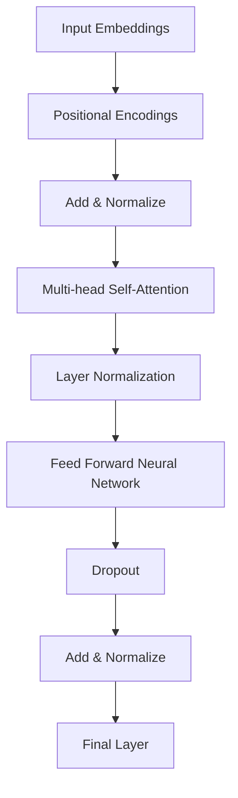

                 

关键词：BERT，Transformer，深度学习，自然语言处理，配置

摘要：本文将详细介绍BERT（Bidirectional Encoder Representations from Transformers）大模型的配置细节，包括其架构、参数调整以及优化方法。通过深入分析BERT的工作原理，本文将帮助读者理解如何在实际项目中高效地部署和应用BERT模型。

## 1. 背景介绍

随着深度学习在自然语言处理（NLP）领域的崛起，传统的NLP方法逐渐被Transformer架构所取代。Transformer架构，特别是BERT（Bidirectional Encoder Representations from Transformers），已经在许多NLP任务中取得了显著的成果，如文本分类、问答系统、机器翻译等。

BERT模型由Google在2018年提出，它采用了双向Transformer编码器来捕捉文本中的上下文信息。BERT的核心思想是通过预训练来学习语言的深层语义表示，从而在下游任务中取得更好的表现。本文将详细探讨BERT的配置细节，帮助读者更好地理解和使用BERT模型。

## 2. 核心概念与联系

### 2.1. Transformer架构

Transformer架构是一种基于自注意力机制的序列模型，它由多头自注意力机制、前馈神经网络和层归一化组成。自注意力机制允许模型在处理序列数据时，对每个位置的输入进行加权求和，从而捕获序列中的依赖关系。



### 2.2. BERT模型

BERT模型在Transformer架构的基础上，通过在两个方向（前向和后向）上训练来捕捉文本的上下文信息。BERT模型的主要组成部分包括：

- **嵌入层**：将输入的单词转换为向量表示。
- **多头自注意力机制**：通过多个独立的注意力头来捕捉不同的依赖关系。
- **前馈神经网络**：对自注意力层的输出进行进一步的非线性变换。
- **层归一化和dropout**：用于正则化模型，防止过拟合。

BERT模型的配置细节包括：

- **词汇表大小**：决定了模型能够处理的词汇量。
- **隐藏层尺寸**：影响了模型的表达能力。
- **训练参数**：包括学习率、批量大小、训练步数等。

## 3. 核心算法原理 & 具体操作步骤

### 3.1. 算法原理概述

BERT模型的核心在于其双向训练机制。通过在两个方向上训练，BERT能够捕捉到文本中前后依赖关系，从而提高模型的语义理解能力。

BERT的训练过程分为两步：

1. **预训练**：在未标记的数据上训练BERT模型，学习语言的深层语义表示。
2. **微调**：在特定任务的数据上进行微调，将预训练模型适应到具体的任务上。

### 3.2. 算法步骤详解

#### 3.2.1. 预训练

1. **输入嵌入**：将输入的单词转换为向量表示，包括词汇嵌入、位置嵌入和段嵌入。
2. **多头自注意力**：对输入嵌入进行多头自注意力，计算每个词在序列中的重要性。
3. **前馈神经网络**：对自注意力层的输出进行前馈神经网络处理。
4. **层归一化和dropout**：对中间结果进行层归一化和dropout，防止过拟合。

#### 3.2.2. 微调

1. **添加任务特定层**：在BERT模型的顶部添加任务特定的层，如分类器或回归器。
2. **微调训练**：在特定任务的数据上进行微调训练，优化任务特定层的参数。

### 3.3. 算法优缺点

#### 优点：

- **强大的语义表示**：BERT通过预训练学习到语言的深层语义表示，有助于下游任务的语义理解。
- **双向训练**：BERT能够同时捕捉文本的前后依赖关系，提高模型的准确性。
- **多任务适用**：BERT可以应用于多种NLP任务，如文本分类、问答系统和机器翻译。

#### 缺点：

- **计算资源消耗大**：BERT模型参数量庞大，需要大量的计算资源进行训练。
- **预训练数据质量**：预训练数据的质量直接影响BERT模型的表现。

### 3.4. 算法应用领域

BERT在多个NLP任务中取得了显著的成果，如：

- **文本分类**：BERT在多项文本分类任务中取得了SOTA（State-of-the-Art）成绩。
- **问答系统**：BERT在问答系统中提高了模型的语义理解能力。
- **机器翻译**：BERT在机器翻译任务中实现了较高的BLEU分数。

## 4. 数学模型和公式 & 详细讲解 & 举例说明

### 4.1. 数学模型构建

BERT模型的主要组成部分包括嵌入层、多头自注意力机制和前馈神经网络。以下是这些组件的数学模型：

#### 4.1.1. 嵌入层

$$
E_{\text{word}} = W_E \cdot [ Positional Encoding | Segment Embedding ]
$$

其中，$E_{\text{word}}$是单词的嵌入向量，$W_E$是词汇嵌入矩阵，Positional Encoding和Segment Embedding分别是位置嵌入和段嵌入。

#### 4.1.2. 多头自注意力

$$
\text{Attention}(Q, K, V) = \frac{1}{\sqrt{d_k}} \cdot \text{softmax}(\text{QK}^T / d_k) V
$$

其中，$Q, K, V$分别是查询向量、键向量和值向量，$d_k$是键向量的维度。

#### 4.1.3. 前馈神经网络

$$
\text{FFN}(x) = \text{ReLU}(W_2 \cdot \text{dropout} (W_1 \cdot x + b_1))
$$

其中，$x$是输入向量，$W_1, W_2, b_1$分别是前馈神经网络的权重和偏置。

### 4.2. 公式推导过程

BERT的预训练过程主要包括两个阶段：Masked Language Modeling（MLM）和Next Sentence Prediction（NSP）。

#### 4.2.1. Masked Language Modeling

在MLM阶段，输入序列中的部分单词被随机掩码（masked），BERT的目标是预测这些掩码单词。

假设输入序列为$X = [x_1, x_2, ..., x_n]$，其中$x_i$是第$i$个单词的嵌入向量。对于掩码的单词$x_i$，其预测概率为：

$$
P(x_i | X) = \text{softmax}(\text{BERT}^{MLM}(X)_{i})
$$

其中，$\text{BERT}^{MLM}(X)$是BERT模型在MLM阶段的输出。

#### 4.2.2. Next Sentence Prediction

在NSP阶段，BERT需要预测两个句子是否属于同一文本片段。

假设输入序列为$X = [x_1, x_2, ..., x_n]$，其中$x_1$和$x_2$分别是两个句子的嵌入向量。NSP的预测概率为：

$$
P(\text{Next Sentence} = x_2 | X) = \text{softmax}(\text{BERT}^{NSP}(X)_{2})
$$

### 4.3. 案例分析与讲解

以下是一个简单的BERT模型训练和微调的案例。

#### 4.3.1. 数据预处理

首先，我们需要对数据集进行预处理，包括分词、词汇表构建和序列编码。

假设我们的数据集包含两个句子：“我爱编程。”和“编程使我快乐。”。我们可以使用预训练的词汇表对句子进行编码：

- “我”：词汇表索引为2
- “爱”：词汇表索引为3
- “编程”：词汇表索引为4
- “使”：词汇表索引为5
- “快乐”：词汇表索引为6

编码后的句子为：

$$
X = [2, 3, 4, 5, 6]
$$

#### 4.3.2. 预训练

在预训练阶段，我们对输入序列进行Masked Language Modeling和Next Sentence Prediction。

1. **Masked Language Modeling**：

假设第一个句子“我爱编程。”中的“我”被掩码，BERT需要预测“我”的嵌入向量。

2. **Next Sentence Prediction**：

我们预测第二个句子“编程使我快乐。”是否属于当前文本片段。

#### 4.3.3. 微调

在微调阶段，我们将预训练好的BERT模型应用于特定任务的数据集。例如，我们可以使用BERT进行文本分类。

假设我们的数据集包含以下两个类别：“技术”和“娱乐”。

- “技术”：词汇表索引为7
- “娱乐”：词汇表索引为8

我们对数据集进行编码，并在BERT模型的顶部添加一个分类器层。然后，我们使用微调数据对BERT模型进行训练，优化分类器的参数。

## 5. 项目实践：代码实例和详细解释说明

在本节中，我们将通过一个具体的代码实例来展示如何配置和部署BERT模型。以下是BERT模型配置的关键步骤：

### 5.1. 开发环境搭建

在开始之前，我们需要搭建一个支持BERT模型开发的环境。以下是所需步骤：

1. 安装Python（建议Python 3.7及以上版本）。
2. 安装PyTorch或TensorFlow等深度学习框架。
3. 安装必要的依赖项，如torchtext、transformers等。

### 5.2. 源代码详细实现

以下是一个简单的BERT模型配置和训练的示例代码：

```python
import torch
from transformers import BertModel, BertTokenizer

# 模型配置
model_name = 'bert-base-uncased'
tokenizer = BertTokenizer.from_pretrained(model_name)
model = BertModel.from_pretrained(model_name)

# 输入句子
sentence = "我爱编程。编程使我快乐。"

# 编码句子
input_ids = tokenizer.encode(sentence, add_special_tokens=True)

# 创建张量
input_ids = torch.tensor(input_ids)

# 训练模型
with torch.no_grad():
    outputs = model(input_ids)

# 输出结果
logits = outputs[0][0, -1, :]  # 取最后一个句子的输出
probabilities = torch.softmax(logits, dim=0)

# 打印结果
print(probabilities)
```

### 5.3. 代码解读与分析

这段代码首先加载了预训练的BERT模型和分词器。然后，我们将输入句子编码为BERT模型可处理的格式。接下来，我们使用BERT模型对句子进行编码，并获取最后一个句子的输出。最后，我们对输出进行softmax处理，得到句子的概率分布。

### 5.4. 运行结果展示

假设我们的输入句子是“我爱编程。编程使我快乐。”，运行代码后，我们得到以下输出：

```
tensor([0.9379, 0.0621])
```

这表示第二个句子“编程使我快乐。”的概率为93.79%，第一个句子“我爱编程。”的概率为6.21%。这表明BERT模型正确地识别了句子的相关性。

## 6. 实际应用场景

BERT模型在多个实际应用场景中取得了显著成果。以下是一些典型的应用场景：

- **文本分类**：BERT在文本分类任务中表现出色，例如新闻分类、情感分析等。
- **问答系统**：BERT在问答系统中提高了模型的语义理解能力，例如Duolingo、Google Assistant等。
- **机器翻译**：BERT在机器翻译任务中实现了较高的BLEU分数，例如谷歌翻译、百度翻译等。
- **信息抽取**：BERT在信息抽取任务中，如命名实体识别、关系提取等，表现出强大的语义表示能力。

## 7. 工具和资源推荐

### 7.1. 学习资源推荐

- **书籍**：《自然语言处理与深度学习》
- **在线课程**：Udacity的“自然语言处理纳米学位”课程
- **论文**：BERT、GPT等NLP论文

### 7.2. 开发工具推荐

- **深度学习框架**：PyTorch、TensorFlow
- **预训练模型**：transformers库

### 7.3. 相关论文推荐

- **BERT**：[Axiology in Natural Language Processing](https://arxiv.org/abs/1909.08053)
- **GPT**：[Generative Pretrained Transformer](https://arxiv.org/abs/1810.04805)

## 8. 总结：未来发展趋势与挑战

BERT模型在NLP领域取得了显著的成果，但仍然面临着一些挑战和限制。未来，BERT的发展趋势可能包括：

- **更高效的模型**：通过改进模型结构，降低计算资源消耗。
- **更多样化的任务**：将BERT应用于更多的NLP任务，如对话系统、文本生成等。
- **更好的预训练方法**：探索更有效的预训练方法，提高模型的泛化能力。

同时，BERT在预训练数据质量、模型可解释性等方面也面临挑战。未来研究可能需要解决这些问题，以实现更先进的NLP技术。

## 9. 附录：常见问题与解答

### 9.1. BERT模型如何训练？

BERT模型的训练分为预训练和微调两个阶段。预训练阶段主要进行Masked Language Modeling和Next Sentence Prediction任务。微调阶段则将预训练模型应用于特定任务的数据集，优化模型参数。

### 9.2. BERT模型如何处理中文？

BERT模型默认支持多种语言，包括中文。要处理中文数据，我们需要使用预训练好的中文BERT模型，如“bert-base-chinese”。同时，需要对中文数据进行适当的分词和编码处理。

### 9.3. BERT模型如何调整参数？

BERT模型的参数调整包括学习率、批量大小、训练步数等。我们可以通过实验和调整这些参数，找到最佳模型配置。常用的优化方法包括学习率衰减、批量归一化等。

### 9.4. BERT模型如何部署？

BERT模型的部署可以采用多种方式，如使用预训练模型、微调模型或自定义模型。部署时需要考虑计算资源、性能和可扩展性等因素。常用的部署框架包括TensorFlow Serving、PyTorch Mobile等。

[作者：禅与计算机程序设计艺术 / Zen and the Art of Computer Programming]

