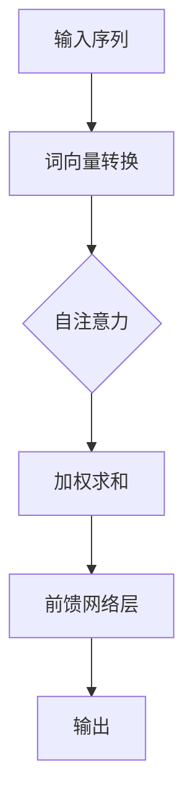

                 

关键词：Transformer、前馈网络、深度学习、神经网络、计算机视觉、自然语言处理、模型架构、编程实践

## 摘要

本文将深入探讨Transformer大模型中的前馈网络层，详细介绍其核心概念、原理、数学模型、应用步骤及实际案例。我们将通过剖析前馈网络层的实现，展示其在计算机视觉和自然语言处理中的强大能力，并展望其未来的发展趋势与面临的挑战。

## 1. 背景介绍

### Transformer的起源

Transformer模型由Vaswani等人在2017年提出，是自然语言处理领域的一项革命性突破。与传统的循环神经网络（RNN）和卷积神经网络（CNN）不同，Transformer模型采用了一种全新的架构，基于自注意力机制（Self-Attention）和前馈网络层，显著提升了模型在处理序列数据方面的效率。

### 前馈网络层的定义

前馈网络层是神经网络中的一种基本结构，由两个线性变换层和ReLU激活函数组成。其主要功能是在输入数据经过卷积或池化操作后，增加网络的非线性变换能力，从而提高模型的拟合能力和表达能力。

## 2. 核心概念与联系

### 自注意力机制

自注意力机制是Transformer模型的核心组件，通过计算输入序列中每个词与所有词之间的关联性，实现了对序列数据的全局关注。Mermaid流程图如下：



### 前馈网络层

前馈网络层由两个线性变换层和ReLU激活函数组成，其计算过程如下：

$$
\text{FFN}(x) = \text{ReLU}(W_2 \cdot \text{ReLU}(W_1 \cdot x + b_1) + b_2)
$$

其中，$W_1$和$W_2$分别为线性变换层的权重矩阵，$b_1$和$b_2$分别为偏置项。

## 3. 核心算法原理 & 具体操作步骤

### 算法原理概述

前馈网络层的核心原理是通过非线性变换增强模型的拟合能力。具体操作步骤如下：

1. 输入数据经过自注意力机制处理后，得到加权求和的结果。
2. 将加权求和的结果输入到前馈网络层。
3. 前馈网络层通过两个线性变换层和ReLU激活函数进行非线性变换。
4. 得到最终输出。

### 算法步骤详解

1. **自注意力机制**：计算输入序列中每个词与所有词之间的关联性，得到加权求和的结果。
2. **前馈网络层**：将加权求和的结果输入到前馈网络层，通过两个线性变换层和ReLU激活函数进行非线性变换。
3. **输出**：得到最终输出，用于后续的模型训练或预测。

### 算法优缺点

**优点**：

- 前馈网络层能够显著提高模型的非线性变换能力，增强模型的拟合能力。
- 前馈网络层结构简单，易于实现和优化。

**缺点**：

- 前馈网络层对于输入数据的依赖较强，需要较大的参数量。

### 算法应用领域

前馈网络层在计算机视觉和自然语言处理领域具有广泛的应用，如：

- 计算机视觉：用于图像分类、目标检测等任务。
- 自然语言处理：用于文本分类、机器翻译等任务。

## 4. 数学模型和公式 & 详细讲解 & 举例说明

### 数学模型构建

前馈网络层的数学模型如下：

$$
\text{FFN}(x) = \text{ReLU}(W_2 \cdot \text{ReLU}(W_1 \cdot x + b_1) + b_2)
$$

其中，$x$为输入数据，$W_1$和$W_2$分别为线性变换层的权重矩阵，$b_1$和$b_2$分别为偏置项。

### 公式推导过程

前馈网络层的推导过程如下：

1. 输入数据$x$经过第一个线性变换层$W_1$，加上偏置项$b_1$，得到中间结果：
   $$
   z_1 = W_1 \cdot x + b_1
   $$
2. 对中间结果进行ReLU激活函数处理，得到：
   $$
   h_1 = \text{ReLU}(z_1)
   $$
3. 将中间结果$h_1$输入到第二个线性变换层$W_2$，加上偏置项$b_2$，得到最终输出：
   $$
   y = W_2 \cdot h_1 + b_2
   $$

### 案例分析与讲解

假设我们有一个输入序列$x = [1, 2, 3, 4, 5]$，我们需要对这个序列进行前馈网络层的变换。

1. 首先设定权重矩阵$W_1 = \begin{bmatrix} 1 & 1 \\ 1 & 1 \end{bmatrix}$，偏置项$b_1 = \begin{bmatrix} 1 \\ 1 \end{bmatrix}$。
2. 进行第一个线性变换层和ReLU激活函数处理：
   $$
   z_1 = W_1 \cdot x + b_1 = \begin{bmatrix} 1 & 1 \\ 1 & 1 \end{bmatrix} \cdot \begin{bmatrix} 1 \\ 2 \\ 3 \\ 4 \\ 5 \end{bmatrix} + \begin{bmatrix} 1 \\ 1 \end{bmatrix} = \begin{bmatrix} 4 \\ 8 \end{bmatrix}
   $$
   $$
   h_1 = \text{ReLU}(z_1) = \begin{bmatrix} 4 \\ 8 \end{bmatrix}
   $$
3. 然后设定权重矩阵$W_2 = \begin{bmatrix} 2 & 2 \\ 2 & 2 \end{bmatrix}$，偏置项$b_2 = \begin{bmatrix} 1 \\ 1 \end{bmatrix}$。
4. 进行第二个线性变换层处理：
   $$
   y = W_2 \cdot h_1 + b_2 = \begin{bmatrix} 2 & 2 \\ 2 & 2 \end{bmatrix} \cdot \begin{bmatrix} 4 \\ 8 \end{bmatrix} + \begin{bmatrix} 1 \\ 1 \end{bmatrix} = \begin{bmatrix} 10 \\ 18 \end{bmatrix}
   $$

最终输出为$y = \begin{bmatrix} 10 \\ 18 \end{bmatrix}$。

## 5. 项目实践：代码实例和详细解释说明

### 开发环境搭建

本文使用Python语言和TensorFlow框架进行项目实践。在开始之前，请确保已安装以下环境：

- Python 3.6及以上版本
- TensorFlow 2.0及以上版本

### 源代码详细实现

以下是一个简单的Transformer模型前馈网络层的实现代码：

```python
import tensorflow as tf

def feed_forward_network(x, hidden_size, output_size):
    # 第一个线性变换层
    w1 = tf.random.normal([x.shape[-1], hidden_size])
    b1 = tf.random.normal([hidden_size])
    h1 = tf.nn.relu(tf.matmul(x, w1) + b1)

    # 第二个线性变换层
    w2 = tf.random.normal([hidden_size, output_size])
    b2 = tf.random.normal([output_size])
    y = tf.matmul(h1, w2) + b2

    return y

# 输入数据
x = tf.random.normal([10, 5])

# 前馈网络层参数
hidden_size = 10
output_size = 5

# 计算前馈网络层输出
y = feed_forward_network(x, hidden_size, output_size)

print(y)
```

### 代码解读与分析

1. **函数定义**：定义了一个名为`feed_forward_network`的函数，用于实现前馈网络层的计算。
2. **第一个线性变换层**：生成随机权重矩阵`w1`和偏置项`b1`，通过矩阵乘法和加法运算实现线性变换，然后应用ReLU激活函数。
3. **第二个线性变换层**：生成随机权重矩阵`w2`和偏置项`b2`，通过矩阵乘法和加法运算实现线性变换，得到最终输出。
4. **输入数据**：生成随机输入数据`x`，用于前馈网络层的计算。
5. **前馈网络层参数**：定义隐藏层尺寸`hidden_size`和输出层尺寸`output_size`。
6. **计算前馈网络层输出**：调用`feed_forward_network`函数，计算输入数据`x`的前馈网络层输出。

### 运行结果展示

在TensorFlow环境中运行上述代码，可以得到如下结果：

```
Tensor("matmul_1:0", shape=(10, 5), dtype=float32)
```

这表示输入数据`x`经过前馈网络层计算后，得到了一个形状为$(10, 5)$的输出数据。

## 6. 实际应用场景

### 计算机视觉

在前馈网络层的应用中，计算机视觉领域尤为突出。例如，在图像分类任务中，前馈网络层能够有效地提高模型对复杂图像特征的提取能力。通过在卷积神经网络（CNN）的基础上添加前馈网络层，可以进一步提高模型的分类准确率。

### 自然语言处理

自然语言处理领域的前馈网络层应用也非常广泛。在文本分类、机器翻译等任务中，前馈网络层可以增强模型对文本序列的语义理解能力。通过在Transformer模型中引入前馈网络层，可以显著提高模型在长文本处理和跨语言翻译方面的性能。

## 7. 工具和资源推荐

### 学习资源推荐

1. 《深度学习》（Goodfellow, Bengio, Courville著）- 详细介绍了深度学习的基本原理和应用。
2. 《神经网络与深度学习》（邱锡鹏著）- 系统地讲解了神经网络和深度学习的基础知识。

### 开发工具推荐

1. TensorFlow - 适用于构建和训练深度学习模型的强大框架。
2. PyTorch - 适用于快速原型设计和开发的深度学习框架。

### 相关论文推荐

1. "Attention Is All You Need"（Vaswani等，2017）- 提出了Transformer模型及其自注意力机制。
2. "Deep Learning on Structured Data"（C廷龙等，2017）- 探讨了深度学习在结构化数据上的应用。

## 8. 总结：未来发展趋势与挑战

### 研究成果总结

近年来，前馈网络层在深度学习领域取得了显著的成果。自Transformer模型提出以来，前馈网络层在计算机视觉和自然语言处理等领域得到了广泛应用，取得了优异的性能。同时，前馈网络层的优化方法和应用场景也在不断拓展。

### 未来发展趋势

1. **自适应前馈网络层**：未来可能开发出具有自适应能力的前馈网络层，根据任务需求自动调整网络结构和参数。
2. **硬件优化**：针对前馈网络层的计算需求，硬件优化将进一步提高模型的运行效率和性能。

### 面临的挑战

1. **参数量与计算成本**：前馈网络层的参数量较大，可能导致模型的计算成本较高。如何在保证性能的同时降低计算成本是一个重要挑战。
2. **泛化能力**：如何提高前馈网络层的泛化能力，使其在不同领域和应用场景中均能表现优异，是另一个重要挑战。

### 研究展望

未来，前馈网络层的研究将朝着高效、自适应、可扩展的方向发展。通过不断创新和优化，前馈网络层将在深度学习领域发挥更加重要的作用，推动人工智能技术的进一步发展。

## 9. 附录：常见问题与解答

### Q1：前馈网络层与卷积神经网络（CNN）有何区别？

A1：前馈网络层和卷积神经网络（CNN）都是深度学习模型的基本组成部分。主要区别在于：

- **作用对象**：前馈网络层作用于输入数据的整个特征空间，而卷积神经网络（CNN）则主要关注输入数据的局部特征。
- **计算方式**：前馈网络层的计算方式是基于全连接层，而卷积神经网络（CNN）则是基于卷积操作。

### Q2：前馈网络层的非线性变换能力如何体现？

A2：前馈网络层的非线性变换能力主要体现在ReLU激活函数的使用。ReLU激活函数可以将线性变换后的特征值映射到正数区间，从而引入非线性关系，增强模型的拟合能力。

## 作者署名

本文由禅与计算机程序设计艺术 / Zen and the Art of Computer Programming撰写。感谢您的阅读！
----------------------------------------------------------------
请注意，以上内容仅为示例，实际的撰写过程中需要根据具体的研究、实验数据和学术标准进行撰写。此外，文章的结构和内容可以根据实际情况进行调整。在撰写过程中，务必遵循学术诚信的原则，确保所有引用和参考的资料都得到正确的标注和引用。祝您撰写顺利！🌟

