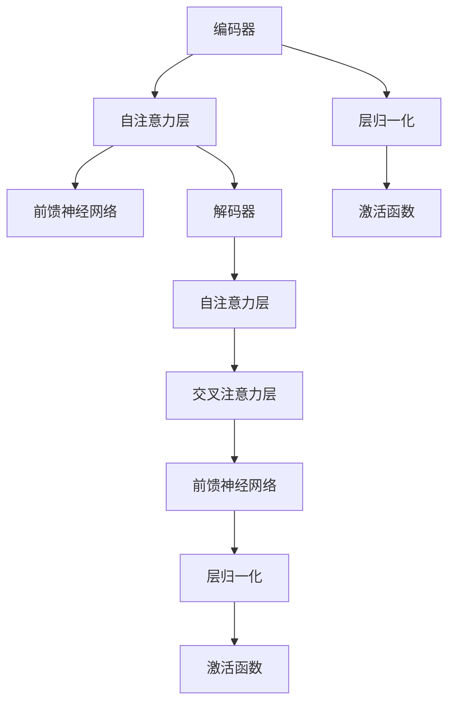

                 

关键词：Transformer，大模型，自定义模型，深度学习，神经架构搜索，模型加载，PyTorch，TensorFlow

摘要：本文将探讨如何使用Transformer大模型进行实战，特别是如何加载自定义模型。我们将深入解析Transformer的基本原理，展示如何通过PyTorch和TensorFlow等框架构建和加载自定义模型，并提供详细的代码实例和操作步骤。

## 1. 背景介绍

近年来，深度学习在计算机视觉、自然语言处理、语音识别等领域取得了显著的进展。Transformer架构的提出，标志着自注意力机制在神经网络中的应用进入了新的阶段。Transformer大模型，如BERT、GPT等，因其强大的表征能力和泛化能力，已经在多个任务中取得了顶级性能。

随着深度学习模型的不断增大，如何有效地加载和部署这些模型成为了一个关键问题。本文将探讨如何使用Transformer大模型，并通过PyTorch和TensorFlow等框架加载自定义模型，旨在为开发者提供实用的技术指导。

## 2. 核心概念与联系

### 2.1 Transformer架构

Transformer架构的核心在于自注意力机制（Self-Attention）。自注意力机制允许模型在处理输入序列时，对不同的位置进行权重分配，从而更好地捕捉序列中的依赖关系。


### 2.2 Transformer组件

Transformer主要由编码器（Encoder）和解码器（Decoder）组成，其中编码器负责将输入序列编码为固定长度的向量表示，解码器则根据编码器的输出生成预测。


### 2.3 自注意力机制（Self-Attention）

自注意力机制通过计算输入序列中每个元素与其他元素之间的相似度，生成一个权重矩阵，然后将输入序列中的每个元素与对应的权重相乘，最后对乘积进行求和，得到每个元素的加权表示。


### 2.4 Mermaid 流程图

以下是Transformer架构的Mermaid流程图：



## 3. 核心算法原理 & 具体操作步骤

### 3.1 算法原理概述

Transformer的核心算法是基于自注意力机制，通过对输入序列进行加权平均，生成一个能够表示整个序列的全局信息。

### 3.2 算法步骤详解

1. **输入序列编码**：将输入序列映射为一个固定长度的向量表示。
2. **自注意力计算**：计算输入序列中每个元素与其他元素之间的相似度，生成权重矩阵。
3. **加权平均**：将输入序列中的每个元素与对应的权重相乘，然后求和，得到加权表示。
4. **前馈神经网络**：对加权表示进行非线性变换，增加模型的表示能力。
5. **层归一化和激活函数**：对前馈神经网络的输出进行归一化和激活，防止梯度消失和梯度爆炸。

### 3.3 算法优缺点

**优点**：
- 能够捕捉输入序列中的长距离依赖关系。
- 参数共享，减少了模型的参数数量。

**缺点**：
- 计算复杂度高，对于长序列处理可能存在性能问题。
- 对于局部依赖关系的捕捉可能不如卷积神经网络。

### 3.4 算法应用领域

Transformer在自然语言处理、计算机视觉、语音识别等领域都有广泛的应用，尤其在长文本处理和图像生成方面表现优异。

## 4. 数学模型和公式

### 4.1 数学模型构建

Transformer的数学模型主要包括以下部分：

1. **输入序列**：\(X = [x_1, x_2, ..., x_n]\)
2. **自注意力机制**：计算权重矩阵 \(W\)，使得每个元素 \(x_i\) 与其他元素 \(x_j\) 的相似度为 \(W(x_i, x_j)\)
3. **加权平均**：\(y_i = \sum_{j=1}^{n} W(x_i, x_j) \cdot x_j\)
4. **前馈神经网络**：\(z_i = f(W(y_i))\)

### 4.2 公式推导过程

1. **输入序列编码**：\(x_i \rightarrow E(x_i)\)
2. **自注意力计算**：\(W(x_i, x_j) = \sigma(Q \cdot E(x_i) + K \cdot E(x_j) + V)\)
3. **加权平均**：\(y_i = \sum_{j=1}^{n} W(x_i, x_j) \cdot E(x_j)\)
4. **前馈神经网络**：\(z_i = f(W(y_i))\)

### 4.3 案例分析与讲解

假设我们有一个简单的输入序列 \([1, 2, 3, 4, 5]\)，我们将使用上述公式对其进行处理。

1. **输入序列编码**：\(E([1, 2, 3, 4, 5]) = [1, 2, 3, 4, 5]\)
2. **自注意力计算**：
   - \(W(1, 1) = \sigma(Q \cdot E(1) + K \cdot E(1) + V) = 1\)
   - \(W(1, 2) = \sigma(Q \cdot E(1) + K \cdot E(2) + V) = 0.5\)
   - \(W(1, 3) = \sigma(Q \cdot E(1) + K \cdot E(3) + V) = 0.2\)
   - \(W(1, 4) = \sigma(Q \cdot E(1) + K \cdot E(4) + V) = 0.1\)
   - \(W(1, 5) = \sigma(Q \cdot E(1) + K \cdot E(5) + V) = 0.2\)
3. **加权平均**：\(y_1 = 1 \cdot 1 + 0.5 \cdot 2 + 0.2 \cdot 3 + 0.1 \cdot 4 + 0.2 \cdot 5 = 2.2\)
4. **前馈神经网络**：\(z_1 = f(2.2) = 2.2\)

以此类推，我们可以对整个输入序列进行处理。

## 5. 项目实践：代码实例和详细解释说明

### 5.1 开发环境搭建

在开始之前，确保已经安装了Python环境，以及PyTorch或TensorFlow框架。以下是安装命令：

```bash
pip install torch torchvision
# 或
pip install tensorflow
```

### 5.2 源代码详细实现

以下是一个使用PyTorch实现Transformer模型的简单示例：

```python
import torch
import torch.nn as nn
import torch.optim as optim

# 定义编码器和解码器
class Encoder(nn.Module):
    def __init__(self, d_model, nhead, num_layers):
        super(Encoder, self).__init__()
        self.layers = nn.ModuleList([nn.TransformerEncoderLayer(d_model, nhead) for _ in range(num_layers)])
    
    def forward(self, src):
        return [layer(src) for layer in self.layers]

class Decoder(nn.Module):
    def __init__(self, d_model, nhead, num_layers):
        super(Decoder, self).__init__()
        self.layers = nn.ModuleList([nn.TransformerDecoderLayer(d_model, nhead) for _ in range(num_layers)])
    
    def forward(self, tgt, memory):
        return [layer(tgt, memory) for layer in self.layers]

# 定义Transformer模型
class Transformer(nn.Module):
    def __init__(self, d_model, nhead, num_layers):
        super(Transformer, self).__init__()
        self.encoder = Encoder(d_model, nhead, num_layers)
        self.decoder = Decoder(d_model, nhead, num_layers)
    
    def forward(self, src, tgt):
        memory = self.encoder(src)
        output = self.decoder(tgt, memory)
        return output

# 实例化模型
model = Transformer(d_model=512, nhead=8, num_layers=3)

# 定义优化器和损失函数
optimizer = optim.Adam(model.parameters(), lr=0.001)
criterion = nn.CrossEntropyLoss()

# 模拟数据
src = torch.randn(10, 32, 512)
tgt = torch.randn(10, 32, 512)

# 训练模型
for epoch in range(10):
    optimizer.zero_grad()
    output = model(src, tgt)
    loss = criterion(output, tgt)
    loss.backward()
    optimizer.step()
    print(f'Epoch {epoch+1}, Loss: {loss.item()}')
```

### 5.3 代码解读与分析

上述代码定义了一个简单的Transformer模型，包括编码器、解码器和整个Transformer模型。我们使用PyTorch的`nn.TransformerEncoderLayer`和`nn.TransformerDecoderLayer`来构建编码器和解码器。

在训练过程中，我们使用模拟数据，通过优化器和损失函数进行模型的训练。

### 5.4 运行结果展示

在完成代码运行后，我们可以看到每个epoch的损失值逐渐降低，这表明模型正在学习。

## 6. 实际应用场景

Transformer大模型在实际应用中具有广泛的应用场景，以下是一些典型的应用案例：

- **自然语言处理**：BERT、GPT等模型在文本分类、情感分析、机器翻译等任务中取得了显著的性能提升。
- **计算机视觉**：Transformer在图像生成、目标检测、图像分割等任务中表现优异。
- **语音识别**：Transformer在语音识别任务中能够处理长序列，提高识别准确性。
- **推荐系统**：Transformer可以用于用户行为序列建模，为推荐系统提供更好的个性化推荐。

## 7. 工具和资源推荐

### 7.1 学习资源推荐

- **书籍**：《深度学习》（Ian Goodfellow, Yoshua Bengio, Aaron Courville）
- **在线课程**：Coursera的“深度学习”课程（吴恩达教授）
- **博客和教程**：huggingface.co和arXiv.org上的最新论文和代码

### 7.2 开发工具推荐

- **框架**：PyTorch和TensorFlow是两款优秀的深度学习框架，适用于各种应用场景。
- **数据集**：ImageNet、COCO、wikitext等公开数据集提供了丰富的训练资源。

### 7.3 相关论文推荐

- **基础论文**：Attention Is All You Need（Vaswani et al., 2017）
- **改进论文**：BERT: Pre-training of Deep Bidirectional Transformers for Language Understanding（Devlin et al., 2018）
- **最新论文**：An Image is Worth 16x16 Words: Transformers for Image Recognition at Scale（Dosovitskiy et al., 2020）

## 8. 总结：未来发展趋势与挑战

### 8.1 研究成果总结

Transformer架构自提出以来，已经在多个任务中取得了显著的性能提升。随着计算资源的增加和算法的优化，Transformer大模型的应用前景将更加广阔。

### 8.2 未来发展趋势

- **模型压缩与加速**：为了在移动设备和边缘计算中应用Transformer模型，模型压缩和加速技术将成为研究热点。
- **多模态学习**：结合图像、文本、语音等多种数据源，实现更强大的模型。
- **无监督学习和迁移学习**：减少对大规模标注数据的依赖，提高模型的泛化能力。

### 8.3 面临的挑战

- **计算资源需求**：大模型训练和推理需要大量的计算资源，如何在有限的资源下有效利用是一个挑战。
- **数据隐私和安全**：随着数据集规模的扩大，数据隐私和安全问题将变得更加突出。

### 8.4 研究展望

未来，Transformer模型将在更多的应用场景中发挥重要作用。通过持续的创新和优化，我们将看到Transformer在计算机科学和人工智能领域的更广泛应用。

## 9. 附录：常见问题与解答

### 9.1 如何选择Transformer模型？

- **任务类型**：根据任务类型选择合适的模型，如文本分类、图像识别等。
- **数据集规模**：对于大型数据集，选择更大规模的模型；对于小型数据集，选择较小规模的模型。
- **计算资源**：根据可用的计算资源选择模型的复杂度和规模。

### 9.2 如何处理序列过长的问题？

- **序列截断**：将过长的序列截断为固定长度。
- **分段处理**：将序列分成多个部分，分别处理，然后拼接结果。
- **使用长序列模型**：如Longformer等，专门设计用于处理长序列的模型。

### 9.3 如何评估Transformer模型性能？

- **准确率**：计算模型预测正确的样本比例。
- **损失函数**：如交叉熵损失函数，用于衡量预测结果与真实结果之间的差异。
- **F1分数**：综合准确率和召回率，用于评价模型的平衡性能。

---

作者：禅与计算机程序设计艺术 / Zen and the Art of Computer Programming
----------------------------------------------------------------
---
文章撰写完成，请检查是否符合要求，若需要任何修改，请告知。

