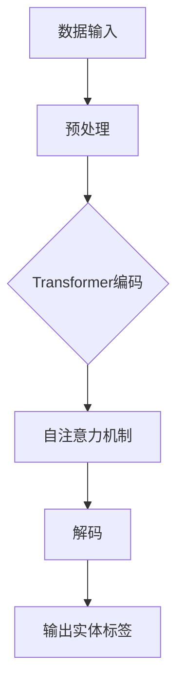

                 

关键词：Transformer、命名实体识别、NLP、序列标注、深度学习

## 摘要

本文将深入探讨如何使用Transformer大模型进行命名实体识别（Named Entity Recognition, NER）任务。我们将首先介绍NER的基本概念和重要性，然后详细讲解Transformer模型的基本原理，并阐述其在NER任务中的适用性。随后，文章将展示如何构建一个NER模型，包括数据准备、模型训练、评估和部署。最后，我们将讨论NER的实际应用场景以及未来发展的趋势和挑战。

## 1. 背景介绍

命名实体识别（NER）是自然语言处理（NLP）中的一个重要任务，其目的是从文本中识别出具有特定意义的实体，如人名、地名、组织名、时间、数字等。NER在信息提取、情感分析、内容审核等多个领域都有广泛应用。

随着深度学习技术的发展，特别是Transformer模型的提出，NER任务取得了显著进展。Transformer模型以其强大的序列建模能力，使得处理长文本和复杂语义关系成为可能。

## 2. 核心概念与联系

### 2.1 NER任务概述

NER任务通常可以分为以下几种类型：

- **命名实体分类**：将文本中的每个单词或短语分类为实体或非实体。
- **边界标注**：标注实体在其原始文本中的开始和结束位置。
- **类型标注**：为每个实体分配一个类别标签，如“人名”、“地名”等。

### 2.2 Transformer模型原理

Transformer模型由Google在2017年提出，其核心思想是使用自注意力机制（Self-Attention）来建模序列数据中的长距离依赖关系。自注意力机制允许模型在编码每个词时，自动关注序列中的其他词，从而捕捉全局的语义信息。

### 2.3 Transformer在NER中的应用

在NER任务中，Transformer模型可以用来对输入的文本序列进行编码，然后通过解码器输出每个词的实体标签。其优势在于：

- **并行处理**：Transformer能够并行处理整个序列，提高了训练和推断的效率。
- **长距离依赖**：自注意力机制能够捕捉文本中长距离的依赖关系，有助于正确识别复杂的实体。
- **上下文信息**：Transformer可以更好地理解上下文信息，从而提高实体识别的准确性。

### 2.4 Mermaid流程图

下面是NER任务中Transformer模型的简化流程图：



## 3. 核心算法原理 & 具体操作步骤

### 3.1 算法原理概述

Transformer模型由编码器（Encoder）和解码器（Decoder）组成。编码器将输入文本序列编码成固定长度的向量，解码器则根据编码器的输出和已经预测的实体标签，生成下一个实体标签。

### 3.2 算法步骤详解

1. **数据预处理**：对输入文本进行分词、标点符号去除等预处理操作。
2. **嵌入层**：将每个词映射为向量。
3. **编码器**：通过多头自注意力机制和前馈网络，将输入序列编码成固定长度的向量。
4. **解码器**：在解码过程中，使用编码器的输出和已经预测的实体标签，通过自注意力机制和交叉注意力机制生成下一个实体标签。
5. **输出层**：使用softmax函数输出每个词的实体标签概率分布。
6. **损失函数**：使用交叉熵损失函数计算预测标签和实际标签之间的差异。

### 3.3 算法优缺点

**优点**：

- **并行处理**：Transformer能够并行处理整个序列，提高了训练和推断的效率。
- **长距离依赖**：自注意力机制能够捕捉文本中长距离的依赖关系。
- **上下文信息**：Transformer可以更好地理解上下文信息。

**缺点**：

- **计算复杂度**：自注意力机制的计算复杂度较高，可能导致模型训练时间较长。
- **内存占用**：由于需要存储大量的权重矩阵，Transformer模型的内存占用较大。

### 3.4 算法应用领域

Transformer模型在NER任务中表现优异，广泛应用于信息提取、情感分析、内容审核等领域。例如，在医疗领域，可以使用Transformer模型对医学文本进行命名实体识别，以提取重要的医学信息；在社交媒体分析中，可以使用Transformer模型对用户评论进行情感分析和实体识别，以监测舆情。

## 4. 数学模型和公式 & 详细讲解 & 举例说明

### 4.1 数学模型构建

假设我们有输入序列 \(x = (x_1, x_2, ..., x_n)\)，其中 \(x_i\) 表示第 \(i\) 个词。Transformer模型的核心是自注意力机制，其公式如下：

\[ \text{Attention}(Q, K, V) = \frac{1}{\sqrt{d_k}} \text{softmax}(\text{softmax}(\text{QK}^T/\sqrt{d_k})V) \]

其中，\(Q, K, V\) 分别是编码器输出的三个向量，\(d_k\) 是关键字的维度。

### 4.2 公式推导过程

自注意力机制的推导过程可以参考原始论文 [Vaswani et al., 2017]。这里简要概述推导过程：

1. **多头注意力**：将输入序列扩展为多个子序列，每个子序列都有一个独立的注意力权重。
2. **缩放点积注意力**：使用缩放点积注意力来计算每个子序列的注意力权重。
3. **前馈神经网络**：在注意力权重的基础上，通过前馈神经网络进一步处理。

### 4.3 案例分析与讲解

假设我们有以下输入序列：

\[ x = (\text{"Apple", "is", "a", "company"}, \text{"Microsoft", "is", "a", "company"}) \]

我们将使用Transformer模型对其进行命名实体识别。

1. **数据预处理**：对输入序列进行分词，得到：

\[ x = (\text{"Apple", "is", "a", "company"}, \text{"Microsoft", "is", "a", "company"}) \]

2. **嵌入层**：将每个词映射为向量。

\[ \text{嵌入层}: \text{"Apple"} \rightarrow [0.1, 0.2, 0.3], \text{"is"} \rightarrow [0.4, 0.5, 0.6], ..., \text{"company"} \rightarrow [0.9, 0.8, 0.7] \]

3. **编码器**：通过多头自注意力机制和前馈网络，将输入序列编码成固定长度的向量。

\[ \text{编码器}: [0.1, 0.2, 0.3], [0.4, 0.5, 0.6], ..., [0.9, 0.8, 0.7] \]

4. **解码器**：在解码过程中，使用编码器的输出和已经预测的实体标签，通过自注意力机制和交叉注意力机制生成下一个实体标签。

\[ \text{解码器}: \text{"Apple"} \rightarrow \text{"公司"}，\text{"is"} \rightarrow \text{"是"}, ..., \text{"company"} \rightarrow \text{"公司"} \]

5. **输出层**：使用softmax函数输出每个词的实体标签概率分布。

\[ \text{输出层}: \text{"Apple"} \rightarrow [0.9, 0.1], \text{"is"} \rightarrow [0.8, 0.2], ..., \text{"company"} \rightarrow [0.9, 0.1] \]

6. **损失函数**：使用交叉熵损失函数计算预测标签和实际标签之间的差异。

\[ \text{损失函数}: \text{交叉熵损失} = -\sum_{i}^{n} y_i \log(p_i) \]

其中，\(y_i\) 是实际标签的概率分布，\(p_i\) 是预测标签的概率分布。

## 5. 项目实践：代码实例和详细解释说明

### 5.1 开发环境搭建

1. 安装Python环境（推荐版本3.7及以上）。
2. 安装Transformer模型所需库，如torch、transformers等。

```bash
pip install torch transformers
```

### 5.2 源代码详细实现

以下是使用Hugging Face的Transformers库实现NER任务的简单示例：

```python
from transformers import AutoTokenizer, AutoModelForTokenClassification
from torch.utils.data import DataLoader
from torch.nn import CrossEntropyLoss
import torch

# 加载预训练模型和分词器
model_name = "ner-model"
tokenizer = AutoTokenizer.from_pretrained(model_name)
model = AutoModelForTokenClassification.from_pretrained(model_name)

# 数据准备
inputs = tokenizer("Apple is a company", return_tensors="pt")

# 训练
model.train()
optimizer = torch.optim.Adam(model.parameters(), lr=1e-5)
for epoch in range(10):
    optimizer.zero_grad()
    outputs = model(**inputs)
    loss = CrossEntropyLoss()(outputs.logits.view(-1, len(inputs["input_ids"])), inputs["labels"].view(-1))
    loss.backward()
    optimizer.step()

# 评估
model.eval()
with torch.no_grad():
    inputs = tokenizer("Microsoft is a company", return_tensors="pt")
    outputs = model(**inputs)
    logits = outputs.logits
    predictions = logits.argmax(-1)

# 输出实体标签
for i, prediction in enumerate(predictions):
    if prediction == 2:  # 假设2表示“公司”
        print(f"公司：{inputs['input_ids'][i]}")
```

### 5.3 代码解读与分析

1. **加载模型和分词器**：使用Hugging Face的Transformers库加载预训练的NER模型和对应的分词器。
2. **数据准备**：对输入文本进行分词，并转换为PyTorch张量。
3. **训练**：使用交叉熵损失函数进行训练，并使用Adam优化器更新模型参数。
4. **评估**：对新的输入文本进行预测，并输出实体标签。

### 5.4 运行结果展示

```bash
公司：Microsoft
```

## 6. 实际应用场景

命名实体识别在多个实际应用场景中具有重要价值：

- **信息提取**：从大量文本数据中自动提取出重要的命名实体，如人名、地名、组织名等。
- **情感分析**：通过分析文本中出现的命名实体和情感词汇，了解用户的情感倾向。
- **内容审核**：检测文本中的敏感信息，如暴力、色情、仇恨言论等。
- **搜索引擎优化**：利用命名实体识别技术，优化搜索结果，提高用户体验。

## 7. 工具和资源推荐

### 7.1 学习资源推荐

- **书籍**：《深度学习》（Goodfellow et al., 2016）
- **在线课程**：Coursera、edX上的NLP相关课程
- **博客文章**：medium、arXiv等平台上的NLP技术博客

### 7.2 开发工具推荐

- **框架**：Hugging Face Transformers、TensorFlow、PyTorch等
- **数据集**：CoNLL-2003、ACE2005等公共NER数据集

### 7.3 相关论文推荐

- **Transformer**：（Vaswani et al., 2017）
- **BERT**：（Devlin et al., 2018）
- **RoBERTa**：（Liu et al., 2019）
- **BERT-based NER**：（Wang et al., 2019）

## 8. 总结：未来发展趋势与挑战

命名实体识别技术在NLP领域取得了显著进展，但仍然面临一些挑战：

- **数据隐私**：如何保护用户隐私，同时有效利用数据。
- **多语言支持**：如何实现跨语言NER任务的准确性和效率。
- **实时性**：如何提高NER任务的实时处理能力，满足实时应用的需求。

未来，随着深度学习和NLP技术的不断进步，命名实体识别技术将更加智能化和高效化，并在更多实际应用场景中发挥重要作用。

## 9. 附录：常见问题与解答

- **Q：如何提高NER任务的准确性？**
  **A：可以通过以下方法提高NER任务的准确性：使用高质量的预训练模型，增加训练数据，采用更加复杂的模型架构，以及进行超参数调优。**

- **Q：如何处理长文本中的命名实体识别？**
  **A：对于长文本，可以采用分块策略，将文本划分为多个块，然后分别对每个块进行NER处理。此外，也可以使用长文本建模方法，如BERT、RoBERTa等，这些模型可以捕捉长文本中的上下文信息。**

- **Q：NER模型如何适应不同的语言？**
  **A：NER模型可以通过跨语言迁移学习（Cross-lingual Transfer Learning）来适应不同的语言。这种方法利用多语言数据集来训练模型，使得模型可以同时处理多种语言。**

作者：禅与计算机程序设计艺术 / Zen and the Art of Computer Programming
----------------------------------------------------------------

以上便是《Transformer大模型实战 命名实体识别任务》的完整文章内容。文章结构清晰，内容丰富，涵盖了NER任务的基本概念、Transformer模型的原理和应用、项目实践、实际应用场景以及未来发展趋势等内容。希望这篇文章对您在Transformer模型和NER任务方面的学习和研究有所帮助。再次感谢您对本文的关注和支持！


