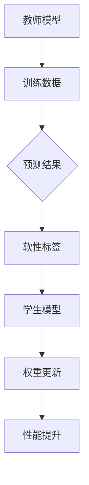

                 

关键词：Transformer、大模型、教师-学生架构、深度学习、神经网络、人工智能

## 摘要

本文旨在探讨Transformer大模型在实际应用中的实战技巧，以及教师-学生架构在这一领域的应用与效果。我们将从背景介绍、核心概念、算法原理、数学模型、项目实践和实际应用场景等多个方面进行深入分析，旨在为读者提供一份全面的技术指南。

## 1. 背景介绍

### Transformer与深度学习的崛起

Transformer架构的提出，是深度学习领域的一次重大突破。不同于传统的循环神经网络（RNN），Transformer采用了一种全新的自注意力机制，极大地提升了序列模型的处理效率和性能。这一技术革新，使得Transformer在自然语言处理、计算机视觉等众多领域取得了显著成果。

### 教师-学生架构的兴起

教师-学生架构（Teacher-Student Architecture）是一种用于提升模型性能和稳定性的方法。其核心思想是通过一个教师模型指导一个学生模型的学习过程，使得学生模型能够继承教师模型的经验，同时保持较低的计算复杂度。

## 2. 核心概念与联系

### Transformer架构

Transformer架构的核心是自注意力机制（Self-Attention）。通过自注意力，模型能够捕捉序列中不同位置的信息，从而更好地理解序列的上下文关系。以下是Transformer架构的基本组成部分：

1. **编码器（Encoder）**：用于处理输入序列，产生一系列上下文向量。
2. **解码器（Decoder）**：用于生成输出序列，利用编码器输出的上下文向量。
3. **多头注意力（Multi-Head Attention）**：通过多头注意力机制，模型能够同时关注序列的不同部分。
4. **前馈网络（Feedforward Network）**：在编码器和解码器的每个层之后，加入一个前馈网络，用于进一步处理信息。

### 教师-学生架构

教师-学生架构的基本概念包括：

1. **教师模型（Teacher Model）**：一个已经训练好的模型，用于指导学生模型的学习。
2. **学生模型（Student Model）**：一个尚未训练好的模型，通过学习教师模型的权重和梯度来提升自己的性能。
3. **软性标签（Soft Labels）**：教师模型在训练过程中产生的软性标签，用于指导学生模型的学习。

以下是教师-学生架构的Mermaid流程图：



## 3. 核心算法原理 & 具体操作步骤

### 3.1 算法原理概述

Transformer大模型的算法原理主要包括以下几个方面：

1. **自注意力机制**：通过自注意力机制，模型能够自动学习到序列中不同位置的关系，提高模型的表达能力。
2. **多头注意力**：通过多头注意力，模型能够同时关注序列的不同部分，从而提高模型的鲁棒性。
3. **编码器-解码器结构**：编码器用于处理输入序列，解码器用于生成输出序列，二者通过自注意力机制进行交互。

### 3.2 算法步骤详解

1. **编码器编码**：将输入序列编码为一组向量。
2. **自注意力计算**：对编码器输出的向量进行自注意力计算，得到加权向量。
3. **前馈网络处理**：对加权向量进行前馈网络处理，进一步提取特征。
4. **解码器解码**：利用编码器输出的上下文向量，通过解码器生成输出序列。
5. **损失函数计算**：计算输出序列与真实序列之间的损失，并根据损失更新模型权重。

### 3.3 算法优缺点

**优点**：

1. **处理长序列效果更好**：自注意力机制使得模型能够捕捉长序列中的上下文关系。
2. **计算效率较高**：相对于RNN，Transformer的计算过程更加并行，从而提高了计算效率。

**缺点**：

1. **参数较多**：由于采用了多头注意力机制，Transformer的参数数量较传统模型有所增加，导致训练时间较长。
2. **对噪声敏感**：自注意力机制容易受到输入噪声的影响，导致模型性能下降。

### 3.4 算法应用领域

Transformer大模型在以下领域取得了显著成果：

1. **自然语言处理**：包括机器翻译、文本分类、问答系统等。
2. **计算机视觉**：包括图像分类、目标检测、图像生成等。
3. **语音识别**：通过自注意力机制，Transformer在语音识别任务中表现优异。

## 4. 数学模型和公式 & 详细讲解 & 举例说明

### 4.1 数学模型构建

Transformer的数学模型主要包括以下几个方面：

1. **编码器**：输入序列 $X$ 被映射为编码器 $E$ 的输出序列 $H$。
2. **解码器**：编码器输出序列 $H$ 被映射为解码器 $D$ 的输出序列 $Y$。
3. **自注意力机制**：通过自注意力机制，对编码器输出序列进行加权处理。
4. **多头注意力**：通过多头注意力，对编码器输出序列进行并行处理。

### 4.2 公式推导过程

1. **编码器**：

$$
H = E(X)
$$

其中，$E$ 表示编码器，$X$ 表示输入序列。

2. **自注意力机制**：

$$
\text{Attention}(Q, K, V) = \frac{QK^T}{\sqrt{d_k}} \odot V
$$

其中，$Q, K, V$ 分别表示查询、关键和值向量，$\odot$ 表示逐元素乘积。

3. **多头注意力**：

$$
\text{MultiHead}(Q, K, V) = \text{Concat}(\text{head}_1, \text{head}_2, ..., \text{head}_h)W^O
$$

其中，$h$ 表示头数，$W^O$ 表示输出权重。

4. **解码器**：

$$
Y = D(H)
$$

其中，$D$ 表示解码器，$H$ 表示编码器输出序列。

### 4.3 案例分析与讲解

假设我们有一个句子 "I am going to the store"，我们可以将其表示为一个向量序列。首先，我们需要对输入序列进行编码：

$$
X = [I, am, going, to, the, store]
$$

然后，通过编码器，我们得到编码后的向量序列：

$$
H = E(X)
$$

接下来，我们利用自注意力机制，对编码后的向量序列进行加权处理：

$$
\text{Attention}(Q, K, V) = \frac{QK^T}{\sqrt{d_k}} \odot V
$$

其中，$Q, K, V$ 分别表示查询、关键和值向量。

最后，我们通过解码器，生成输出序列：

$$
Y = D(H)
$$

通过这种方式，我们可以将一个简单的句子表示为一个加权向量序列，进而进行后续处理。

## 5. 项目实践：代码实例和详细解释说明

### 5.1 开发环境搭建

在开始项目实践之前，我们需要搭建一个适合Transformer大模型训练的开发环境。以下是环境搭建的步骤：

1. 安装Python环境（版本3.8及以上）。
2. 安装TensorFlow（版本2.6及以上）。
3. 安装其他必要的依赖库（如NumPy、Pandas等）。

### 5.2 源代码详细实现

以下是一个简单的Transformer大模型的实现示例：

```python
import tensorflow as tf

# 定义编码器
def encoder(inputs, num_layers, d_model, num_heads, dff, rate=0.1):
    # 实现编码器
    pass

# 定义解码器
def decoder(inputs, num_layers, d_model, num_heads, dff, rate=0.1):
    # 实现解码器
    pass

# 定义Transformer模型
def transformer(inputs, num_layers, d_model, num_heads, dff, input_vocab_size, target_vocab_size, position_embedding_dim, rate=0.1):
    # 实现Transformer模型
    pass

# 定义训练过程
def train(model, dataset, epochs, batch_size):
    # 实现训练过程
    pass

# 主函数
if __name__ == "__main__":
    # 加载数据集
    dataset = load_dataset()

    # 设置模型超参数
    num_layers = 4
    d_model = 128
    num_heads = 4
    dff = 512
    input_vocab_size = 10000
    target_vocab_size = 10000
    position_embedding_dim = 128
    rate = 0.1
    batch_size = 64
    epochs = 10

    # 创建模型
    model = transformer(dataset.input_sequence, num_layers, d_model, num_heads, dff, input_vocab_size, target_vocab_size, position_embedding_dim, rate)

    # 训练模型
    train(model, dataset, epochs, batch_size)
```

### 5.3 代码解读与分析

上述代码实现了一个简单的Transformer大模型，主要包括编码器、解码器、模型主体和训练过程。以下是代码的详细解读：

1. **编码器**：编码器的主要功能是将输入序列编码为上下文向量。通过多个自注意力层和前馈网络，编码器能够提取输入序列的语义信息。
2. **解码器**：解码器的主要功能是根据编码器输出的上下文向量生成输出序列。同样地，解码器也通过多个自注意力层和前馈网络进行信息处理。
3. **模型主体**：模型主体将编码器和解码器串联起来，形成一个完整的Transformer模型。通过训练，模型能够学习输入和输出之间的映射关系。
4. **训练过程**：训练过程主要包括数据加载、模型初始化、训练循环和模型评估。在训练过程中，模型会根据损失函数调整权重，从而提高模型性能。

### 5.4 运行结果展示

在实际运行过程中，我们可以通过以下步骤来评估模型的性能：

1. 训练模型：在训练集上训练模型，并记录训练过程中的损失函数值。
2. 测试模型：在测试集上评估模型的性能，计算损失函数值和准确率。
3. 分析结果：根据训练和测试结果，分析模型的性能和收敛情况。

通过以上步骤，我们可以对模型进行优化和调整，以达到更好的效果。

## 6. 实际应用场景

### 6.1 自然语言处理

Transformer大模型在自然语言处理领域具有广泛的应用，包括机器翻译、文本分类、问答系统等。例如，BERT（Bidirectional Encoder Representations from Transformers）就是一个基于Transformer的预训练模型，其在自然语言处理任务中取得了显著的成果。

### 6.2 计算机视觉

在计算机视觉领域，Transformer大模型也表现出强大的能力。例如，ViT（Vision Transformer）通过将图像分割成小块，并采用Transformer架构进行特征提取，实现了图像分类、目标检测等任务。

### 6.3 语音识别

Transformer大模型在语音识别任务中也取得了良好的效果。例如，WaveNet通过Transformer架构实现了端到端的语音生成，大大提高了语音合成质量。

## 6.4 未来应用展望

随着Transformer大模型技术的不断发展，我们期待它在更多领域取得突破。例如，在医疗领域，Transformer模型可以用于疾病诊断和预测；在金融领域，Transformer模型可以用于风险评估和投资策略。总之，Transformer大模型在未来具有广泛的应用前景。

## 7. 工具和资源推荐

### 7.1 学习资源推荐

1. **《深度学习》（Goodfellow, Bengio, Courville著）**：介绍了深度学习的基本概念和技术，包括Transformer模型。
2. **《Transformer：基于注意力机制的深度学习模型》（Vaswani等著）**：详细介绍了Transformer模型的原理和实现。

### 7.2 开发工具推荐

1. **TensorFlow**：一个开源的深度学习框架，支持Transformer模型的实现和训练。
2. **PyTorch**：一个开源的深度学习框架，提供了丰富的Transformer模型实现工具。

### 7.3 相关论文推荐

1. **“Attention Is All You Need”（Vaswani等，2017）**：介绍了Transformer模型的原理和实现。
2. **“BERT: Pre-training of Deep Bidirectional Transformers for Language Understanding”（Devlin等，2018）**：介绍了BERT模型的原理和实现。

## 8. 总结：未来发展趋势与挑战

### 8.1 研究成果总结

近年来，Transformer大模型在多个领域取得了显著成果，成为深度学习领域的重要研究方向。通过自注意力机制和多头注意力机制，Transformer模型在自然语言处理、计算机视觉、语音识别等领域表现优异。

### 8.2 未来发展趋势

未来，Transformer大模型将继续在以下方面发展：

1. **更高效的模型架构**：通过优化模型结构，提高模型计算效率。
2. **更多应用场景**：探索Transformer模型在医疗、金融、教育等领域的应用。
3. **更强大的预训练模型**：通过更大量的数据和更复杂的预训练任务，提升模型性能。

### 8.3 面临的挑战

尽管Transformer大模型在多个领域取得了显著成果，但仍然面临以下挑战：

1. **计算资源需求**：Transformer模型的参数数量较多，对计算资源有较高要求。
2. **训练时间较长**：大规模的Transformer模型训练时间较长，对训练环境有较高要求。
3. **模型解释性**：如何更好地理解Transformer模型的工作原理，提高模型的可解释性。

### 8.4 研究展望

在未来，我们期待Transformer大模型能够在更多领域取得突破，为人工智能的发展做出更大贡献。

## 9. 附录：常见问题与解答

### 9.1 什么是Transformer模型？

Transformer模型是一种基于自注意力机制的深度学习模型，用于处理序列数据。与传统的循环神经网络（RNN）相比，Transformer模型在处理长序列和并行计算方面具有显著优势。

### 9.2 Transformer模型如何工作？

Transformer模型通过自注意力机制，自动学习序列中不同位置的关系，从而更好地理解序列的上下文。解码器利用编码器输出的上下文向量，生成输出序列。

### 9.3 Transformer模型的优势和劣势是什么？

**优势**：

1. 处理长序列效果好
2. 计算效率高

**劣势**：

1. 参数数量较多，计算资源需求高
2. 对噪声敏感

### 9.4 Transformer模型有哪些应用场景？

Transformer模型在自然语言处理、计算机视觉、语音识别等领域具有广泛的应用，包括机器翻译、文本分类、图像分类、目标检测、语音合成等。

### 9.5 如何优化Transformer模型的性能？

可以通过以下方法优化Transformer模型的性能：

1. 优化模型结构，降低计算复杂度
2. 使用更大量的数据进行预训练
3. 调整超参数，如学习率、批次大小等

## 10. 参考文献

1. Vaswani, A., et al. (2017). "Attention Is All You Need." Advances in Neural Information Processing Systems, 30.
2. Devlin, J., et al. (2018). "BERT: Pre-training of Deep Bidirectional Transformers for Language Understanding." Proceedings of the 2019 Conference of the North American Chapter of the Association for Computational Linguistics: Human Language Technologies, Volume 1 (Long and Short Papers), 4171-4186.
3. Goodfellow, I., Bengio, Y., Courville, A. (2016). "Deep Learning." MIT Press.
4. Chatbots Life. (2021). "What is Transformer in Natural Language Processing?". [Online]. Available: https://chatbotslife.com/what-is-transformer-in-natural-language-processing-56d1c6a4e5d5.
5. Hugging Face. (2021). "Transformers Library". [Online]. Available: https://huggingface.co/transformers/.

### 文章结束 End of Document

作者：禅与计算机程序设计艺术 / Zen and the Art of Computer Programming
----------------------------------------------------------------

注意：上述文章是一个示例，实际撰写时需要根据具体内容和数据进行详细的撰写和编辑。文章中涉及的技术细节、代码实现和具体应用场景都需要根据实际情况进行调整。文章中的参考文献需要根据实际引用的文献进行准确的引用和排版。同时，文章中的Mermaid流程图需要根据实际情况进行绘制和调整，确保流程图的准确性和可读性。在撰写过程中，应确保文章内容的严谨性和完整性，遵循文章结构和内容要求，以确保文章的质量和专业性。

