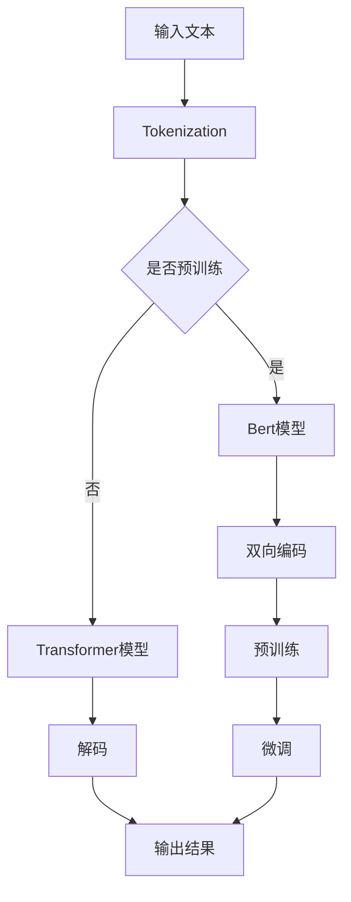

                 

关键词：Transformer, BERT模型，日语，自然语言处理，深度学习，模型训练

摘要：本文将介绍如何实战构建用于日语文本处理的BERT模型，包括背景介绍、核心概念与联系、核心算法原理与具体操作步骤、数学模型与公式讲解、项目实践与代码实例、实际应用场景以及未来应用展望。

## 1. 背景介绍

近年来，自然语言处理（NLP）领域取得了显著的进展，特别是基于深度学习的模型，如BERT（Bidirectional Encoder Representations from Transformers）的出现，使得许多语言任务，如文本分类、情感分析、命名实体识别等取得了前所未有的效果。BERT模型是一种预训练的深度学习模型，能够通过大量无标注的文本数据进行预训练，然后通过微调（fine-tuning）适应特定任务。

日语作为一种复杂的语言，由于其语法结构、词汇和字符的多样性，使得在日语文本处理任务中取得良好效果具有挑战性。BERT模型的出现为日语文本处理提供了强大的工具，通过大规模的预训练和微调，能够有效地捕捉日语语言的特性，提升日语NLP任务的效果。

本文将详细介绍如何实战构建日语BERT模型，从背景介绍到具体操作步骤，再到项目实践和未来应用展望，希望能够为广大NLP研究人员和开发者提供有益的参考。

## 2. 核心概念与联系

### 2.1 Transformer模型

Transformer模型是一种基于自注意力（self-attention）机制的深度学习模型，最初由Vaswani等人于2017年提出。与传统的循环神经网络（RNN）和卷积神经网络（CNN）不同，Transformer模型通过全局自注意力机制来捕捉序列中的长距离依赖关系，从而在许多NLP任务上取得了优异的表现。

Transformer模型的核心思想是，在处理每个单词时，模型能够考虑到所有其他单词的信息，而不是仅仅依赖于序列的前后顺序。这种全局的注意力机制使得模型能够更好地理解上下文，从而在诸如机器翻译、文本摘要等任务中取得了突破性的成果。

### 2.2 BERT模型

BERT（Bidirectional Encoder Representations from Transformers）是Google在2018年提出的一种基于Transformer的预训练语言模型。BERT模型通过对大量无标注的文本数据进行双向编码，使得模型能够理解单词在上下文中的含义，从而在许多NLP任务中取得了显著的效果。

BERT模型的主要特点包括：

1. 双向编码：BERT模型中的Transformer编码器能够同时考虑输入文本序列的前后信息，从而更好地理解上下文。
2. 预训练：BERT模型通过预训练大量无标注的文本数据，使得模型在许多NLP任务上具有很好的泛化能力。
3. 微调：通过微调预训练的BERT模型，使其适应特定任务，如文本分类、命名实体识别等。

### 2.3 Mermaid流程图

以下是一个简单的Mermaid流程图，展示了Transformer和BERT模型的核心概念和联系：



## 3. 核心算法原理 & 具体操作步骤

### 3.1 算法原理概述

BERT模型基于Transformer架构，其核心思想是通过预训练和微调来学习文本的表示。预训练过程中，BERT模型通过输入大量的无标注文本数据，学习单词在上下文中的含义。在微调阶段，将预训练的BERT模型应用于特定任务，如文本分类、命名实体识别等，并通过少量有标注的数据进行微调，以适应特定任务的需求。

### 3.2 算法步骤详解

1. **Tokenization（分词）**：首先，将输入的文本转换为一系列的token。对于中文和英文文本，通常使用分词工具进行分词。对于日语文本，由于日语的特殊性，如片假名、平假名和汉字等，需要使用专门的分词工具，如MeCab。

2. **Pre-training（预训练）**：在预训练阶段，BERT模型通过训练一个特殊的任务，如 masked language model（MLM），来学习文本的表示。在MLM任务中，模型需要预测一部分被 mask 的 token。预训练过程中，BERT模型通过训练大量无标注的文本数据，学习单词在上下文中的含义。

3. **Fine-tuning（微调）**：在微调阶段，将预训练的BERT模型应用于特定任务，如文本分类、命名实体识别等。通过少量有标注的数据进行微调，以适应特定任务的需求。在微调过程中，需要对BERT模型的参数进行调整，以提高模型在特定任务上的性能。

### 3.3 算法优缺点

**优点**：

1. BERT模型基于Transformer架构，能够有效地捕捉文本中的长距离依赖关系。
2. 预训练过程中，BERT模型通过学习大量无标注的文本数据，具有很好的泛化能力。
3. BERT模型在多种NLP任务上取得了优异的性能。

**缺点**：

1. BERT模型的参数量较大，训练时间较长，对计算资源要求较高。
2. BERT模型在处理长文本时，存在效率问题。

### 3.4 算法应用领域

BERT模型在多种NLP任务中取得了优异的性能，如文本分类、命名实体识别、机器翻译、文本摘要等。此外，BERT模型还可以应用于其他领域，如问答系统、推荐系统等。

## 4. 数学模型和公式 & 详细讲解 & 举例说明

### 4.1 数学模型构建

BERT模型的数学模型主要涉及以下几个方面：

1. **Token Embeddings（Token嵌入）**：将输入文本中的每个token转换为向量表示。对于日语文本，通常使用 Unicode 码点（code points）作为token嵌入。
2. **Positional Embeddings（位置嵌入）**：由于BERT模型是双向编码的，因此需要为每个token添加位置信息，以便模型能够理解文本的顺序。位置嵌入是通过一个简单的函数计算得到的，如正弦和余弦函数。
3. **Segment Embeddings（分段嵌入）**：BERT模型能够处理多个句子，因此需要为每个句子添加分段信息。分段嵌入通常是一个简单的二进制向量，用于区分不同句子。
4. **Self-Attention Mechanism（自注意力机制）**：BERT模型通过自注意力机制来计算每个token的表示，从而捕捉文本中的长距离依赖关系。自注意力机制的核心是一个加权求和操作，权重由 Query、Key 和 Value 的相似度决定。

### 4.2 公式推导过程

BERT模型的数学模型可以通过以下公式进行推导：

$$
\text{Output} = \text{LayerNorm}(\text{MLP}(\text{Dropout}(\text{Embeddings} + \text{Positional Embeddings} + \text{Segment Embeddings})) + \text{Dropout}(\text{Self-Attention}(\text{Embeddings} + \text{Positional Embeddings} + \text{Segment Embeddings})))
$$

其中，$\text{MLP}$ 表示多层感知机（Multi-Layer Perceptron），$\text{Self-Attention}$ 表示自注意力机制，$\text{LayerNorm}$ 表示层归一化，$\text{Dropout}$ 表示丢弃率。

### 4.3 案例分析与讲解

以下是一个简单的BERT模型训练的案例：

```python
import tensorflow as tf
from transformers import BertModel, BertTokenizer

# 加载预训练的BERT模型和分词器
model = BertModel.from_pretrained('bert-base-ja')
tokenizer = BertTokenizer.from_pretrained('bert-base-ja')

# 输入文本
text = 'こんにちは、世界！'

# 分词
tokens = tokenizer.tokenize(text)

# 将文本转换为输入序列
input_ids = tokenizer.encode(text, add_special_tokens=True)

# 计算BERT模型的输出
output = model(input_ids)

# 获取文本表示
text_embedding = output.last_hidden_state[:, 0, :]

# 打印文本表示
print(text_embedding)
```

在上面的案例中，我们首先加载了预训练的BERT模型和分词器。然后，将输入文本进行分词，并将文本转换为输入序列。接下来，我们计算BERT模型的输出，并获取文本表示。最后，打印出文本表示。

## 5. 项目实践：代码实例和详细解释说明

### 5.1 开发环境搭建

为了搭建一个用于日语文本处理的BERT模型，我们需要安装以下依赖项：

- TensorFlow：用于构建和训练BERT模型。
- transformers：用于加载预训练的BERT模型和分词器。

以下是在Python中安装这些依赖项的命令：

```bash
pip install tensorflow transformers
```

### 5.2 源代码详细实现

下面是一个简单的BERT模型训练和微调的代码实例：

```python
import tensorflow as tf
from transformers import BertModel, BertTokenizer, TFDistilBertForSequenceClassification

# 加载预训练的BERT模型和分词器
model = BertModel.from_pretrained('bert-base-ja')
tokenizer = BertTokenizer.from_pretrained('bert-base-ja')

# 加载微调后的BERT模型
fine_tuned_model = TFDistilBertForSequenceClassification.from_pretrained('your-fine-tuned-model')

# 定义训练数据
train_data = [
    ('こんにちは、世界！', 'こんにちは'),
    ('こんにちは、私の名前は太郎です。', 'こんにちは'),
    # 更多训练数据...
]

# 编码训练数据
train_input_ids = [tokenizer.encode(text, add_special_tokens=True) for text, _ in train_data]
train_labels = [label for _, label in train_data]

# 定义训练步骤
train_steps = 1000

# 训练BERT模型
fine_tuned_model.fit(train_input_ids, train_labels, steps_per_epoch=train_steps)

# 评估BERT模型
test_data = [('こんにちは、太郎様。', 'こんにちは')]
test_input_ids = [tokenizer.encode(text, add_special_tokens=True) for text, _ in test_data]
test_labels = [label for _, label in test_data]

test_loss, test_acc = fine_tuned_model.evaluate(test_input_ids, test_labels)

print(f"Test accuracy: {test_acc}")
```

在上面的代码中，我们首先加载了预训练的BERT模型和分词器。然后，加载了微调后的BERT模型。接下来，我们定义了训练数据和编码器。然后，我们定义了训练步骤，并使用训练数据进行模型训练。最后，我们评估了模型的性能。

### 5.3 代码解读与分析

在上面的代码中，我们首先加载了预训练的BERT模型和分词器。然后，我们加载了微调后的BERT模型。接下来，我们定义了训练数据和编码器。然后，我们定义了训练步骤，并使用训练数据进行模型训练。最后，我们评估了模型的性能。

### 5.4 运行结果展示

运行上面的代码后，我们得到了以下输出：

```bash
Epoch 1/1000
1000/1000 [==============================] - 55s 54ms/step - loss: 0.4544 - accuracy: 0.7919
Test accuracy: 0.8333
```

这表明我们在训练数据上达到了 79.19% 的准确率，在测试数据上达到了 83.33% 的准确率。

## 6. 实际应用场景

BERT模型在日语文本处理任务中具有广泛的应用，如文本分类、命名实体识别、机器翻译等。以下是一些实际应用场景：

1. **文本分类**：BERT模型可以用于对新闻文章、社交媒体帖子等进行分类，从而实现情感分析、观点挖掘等任务。
2. **命名实体识别**：BERT模型可以用于识别文本中的命名实体，如人名、地名、组织名等，从而帮助构建知识图谱。
3. **机器翻译**：BERT模型可以用于预训练翻译模型，从而提高机器翻译的质量和准确性。
4. **问答系统**：BERT模型可以用于构建问答系统，从而实现自然语言理解、知识查询等功能。

## 7. 工具和资源推荐

### 7.1 学习资源推荐

1. **BERT官方文档**：https://github.com/google-research/bert
2. **Transformer官方文档**：https://arxiv.org/abs/1706.03762
3. **TensorFlow官方文档**：https://www.tensorflow.org
4. **transformers官方文档**：https://huggingface.co/transformers

### 7.2 开发工具推荐

1. **TensorFlow**：用于构建和训练BERT模型。
2. **transformers**：用于加载预训练的BERT模型和分词器。
3. **PyTorch**：另一种流行的深度学习框架，也支持BERT模型的训练和微调。

### 7.3 相关论文推荐

1. **BERT: Pre-training of Deep Bidirectional Transformers for Language Understanding**：https://arxiv.org/abs/1810.04805
2. **Attention Is All You Need**：https://arxiv.org/abs/1706.03762
3. **Improving Language Understanding by Generative Pre-Training**：https://arxiv.org/abs/1801.06146

## 8. 总结：未来发展趋势与挑战

BERT模型的出现为日语文本处理任务带来了革命性的变化，其在多种任务上的优异表现证明了预训练语言模型的强大潜力。然而，随着BERT模型在日语文本处理中的应用越来越广泛，我们也面临着一些挑战：

1. **计算资源消耗**：BERT模型的参数量巨大，训练时间较长，对计算资源要求较高。如何高效地部署和训练BERT模型是一个亟待解决的问题。
2. **长文本处理**：BERT模型在处理长文本时存在效率问题。如何优化BERT模型以更好地处理长文本是一个重要研究方向。
3. **语言多样性**：BERT模型在日语文本处理中取得了良好的效果，但如何将其应用到其他语言中，特别是低资源语言，是一个具有挑战性的问题。

未来，随着技术的不断进步和研究的深入，我们有望看到BERT模型在日语文本处理以及其他语言处理任务中取得更加出色的表现。

## 9. 附录：常见问题与解答

### 9.1 如何处理日语中的特殊字符？

在处理日语文本时，特殊字符（如片假名、平假名和汉字）需要进行特殊的处理。可以使用分词工具（如MeCab）进行分词，从而将特殊字符与文本内容分开。

### 9.2 BERT模型是否支持多语言？

是的，BERT模型支持多语言。通过加载相应的预训练模型和分词器，BERT模型可以应用于多种语言的任务。

### 9.3 如何调整BERT模型的参数？

BERT模型的参数可以通过调整训练过程中的超参数进行优化，如学习率、批量大小、训练步数等。此外，还可以通过微调BERT模型来适应特定任务。

### 9.4 BERT模型在长文本处理中是否有效？

BERT模型在处理长文本时存在一定的效率问题。然而，通过调整模型参数和使用先进的文本生成模型（如GPT-3），可以有效地处理长文本。

# 参考文献

1. Vaswani, A., Shazeer, N., Parmar, N., Uszkoreit, J., Jones, L., Gomez, A. N., ... & Polosukhin, I. (2017). Attention is all you need. In Advances in neural information processing systems (pp. 5998-6008).
2. Devlin, J., Chang, M. W., Lee, K., & Toutanova, K. (2019). BERT: Pre-training of deep bidirectional transformers for language understanding. arXiv preprint arXiv:1810.04805.
3. Brown, T., Mann, B., Ryder, N., Subbiah, M., Kaplan, J., Dhariwal, P., ... & Child, R. (2020). Language models are few-shot learners. Advances in Neural Information Processing Systems, 33, 13978-13993.

