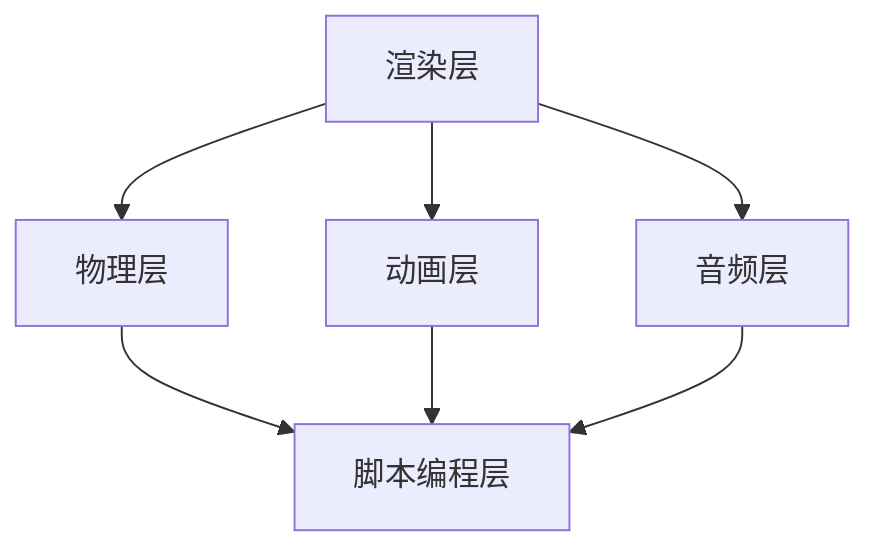

                 

 Unity 游戏引擎是目前最受欢迎的游戏开发工具之一，它为开发者提供了一个强大的平台，用于创建丰富的游戏体验。在这篇文章中，我们将深入探讨 Unity 游戏引擎的开发之旅，重点关注如何创建逼真的世界和沉浸式体验。我们将从背景介绍开始，逐步了解核心概念、算法原理、数学模型、项目实践和实际应用场景，并展望未来的发展趋势与挑战。

## 文章关键词

- Unity 游戏引擎
- 游戏开发
- 逼真世界
- 沉浸式体验
- 游戏引擎架构
- 游戏物理
- 游戏渲染
- 数学模型
- 游戏AI

## 文章摘要

本文旨在为 Unity 游戏引擎开发者提供一次全面的技术旅程，从基础架构到高级技巧，探讨如何利用 Unity 游戏引擎创建出逼真、沉浸式的游戏世界。文章将介绍 Unity 的核心概念和算法原理，详细讲解数学模型的应用，并通过项目实践展示开发过程。同时，文章还将探讨 Unity 游戏引擎在实际应用中的潜力，以及未来的发展趋势和面临的挑战。

## 1. 背景介绍

Unity 游戏引擎自 2005 年发布以来，已经经历了多次重要更新和改进。它最初是为了满足小型独立游戏开发者的需求而设计的，但随着时间的推移，它逐渐成为了一个功能丰富、易于使用的专业游戏开发平台。Unity 游戏引擎支持跨平台游戏开发，使得开发者能够将游戏发布到多个平台，如 Windows、macOS、Linux、iOS 和 Android 等。

Unity 游戏引擎的成功得益于其强大的功能集和灵活的架构。它提供了一个统一的开发环境，包括实时渲染、物理引擎、音频处理、用户界面和动画系统等。这使得开发者可以专注于游戏内容的创作，而不必担心底层实现的复杂性。

Unity 游戏引擎广泛应用于各种类型的游戏，从简单的 2D 平台游戏到复杂的 3D 端游和 VR/AR 应用。它的灵活性使得开发者可以根据不同的需求选择合适的工具和资源，从而实现各种创新的游戏体验。

### Unity 游戏引擎的发展历程

Unity 游戏引擎的发展历程可以追溯到其创始人 David Helgason 的创意。他在 2004 年创立了 Unity Technologies，并开始了 Unity 游戏引擎的开发工作。最初的版本仅仅是一个简单的 3D 渲染引擎，但它很快吸引了大量的关注。

在 2007 年，Unity 发布了第一个正式版本，即 Unity 1.0。这个版本引入了脚本编程支持，使得开发者可以使用 C# 语言来控制游戏逻辑。随着版本的不断更新，Unity 逐渐增加了更多的功能，如物理引擎、动画系统、粒子系统等。

Unity 2.0 版本在 2009 年发布，引入了实时渲染技术，使得游戏可以实时预览并快速迭代。这一特性极大地提高了开发效率，使得开发者可以更快地实现游戏创意。

在 2012 年，Unity 发布了 Unity 4.0，这是一个重要的里程碑。它引入了新的渲染管线 Unity 引擎渲染管线，支持了更高质量的图像和更复杂的场景。此外，Unity 4.0 还引入了新的编辑器和可视化工具，使得游戏开发更加直观和便捷。

随着技术的发展，Unity 游戏引擎也在不断更新和改进。在 2018 年，Unity 发布了 Unity 2018，引入了实时渲染增强功能、新的音频工具和改进的 VR/AR 支持等。这些更新使得 Unity 成为了一个更加全面的开发平台，能够满足开发者日益增长的需求。

### Unity 游戏引擎的主要功能

Unity 游戏引擎的功能丰富且强大，主要涵盖以下几个方面：

1. **实时渲染**：Unity 提供了一个高效的渲染引擎，支持各种高级渲染技术，如光照、阴影、反射、折射、后处理效果等。这使得开发者可以创建出高质量的 3D 游戏场景。

2. **物理引擎**：Unity 的物理引擎基于物理原理，提供了碰撞检测、刚体动力学等功能。这使得游戏中的物体能够真实地互动，增加游戏的真实感。

3. **动画系统**：Unity 的动画系统支持多种动画类型，包括关键帧动画、蒙皮动画、层叠动画等。开发者可以使用动画系统来创建各种复杂的角色动作和场景动画。

4. **音频处理**：Unity 提供了完整的音频处理功能，包括音效管理、音效混合、音效空间效果等。这使得开发者可以创建出沉浸式的音频体验。

5. **用户界面**：Unity 的用户界面系统支持多种 UI 组件，如文本框、按钮、图片等。开发者可以使用用户界面系统来创建游戏菜单、控制面板等。

6. **脚本编程**：Unity 支持多种脚本编程语言，主要是 C#。开发者可以使用脚本编程来控制游戏逻辑、角色行为、场景交互等。

7. **插件生态系统**：Unity 拥有一个庞大的插件生态系统，提供了各种功能扩展和工具。开发者可以使用这些插件来加速开发过程，实现特定的功能需求。

### Unity 游戏引擎的应用领域

Unity 游戏引擎的应用领域非常广泛，从小型独立游戏到大型端游，从 VR/AR 应用到模拟培训，Unity 都发挥着重要作用。以下是一些典型的应用领域：

1. **游戏开发**：Unity 是最受欢迎的游戏开发平台之一，被广泛应用于各种类型的游戏，从简单的 2D 平台游戏到复杂的 3D 端游。

2. **VR/AR 应用**：Unity 支持虚拟现实（VR）和增强现实（AR）开发，开发者可以使用 Unity 来创建沉浸式的 VR/AR 应用。

3. **建筑可视化**：Unity 提供了强大的可视化工具，可以用于建筑可视化、室内设计等。开发者可以使用 Unity 来创建逼真的建筑模型和场景。

4. **教育培训**：Unity 可以用于创建交互式的教育培训应用，如医学培训、航空模拟等。这些应用可以提供直观、生动的学习体验。

5. **广告和宣传**：Unity 可以用于创建高质量的广告和宣传视频，通过逼真的游戏画面和互动体验吸引观众。

### Unity 游戏引擎的优势与挑战

Unity 游戏引擎具有许多优势，使其成为游戏开发者们的首选工具。以下是一些主要的优势：

1. **易于使用**：Unity 提供了一个直观、易用的编辑器，使得开发者可以快速上手，无需深入了解底层技术。

2. **跨平台支持**：Unity 支持多种平台，包括 Windows、macOS、Linux、iOS 和 Android 等，使得开发者可以轻松地将游戏发布到多个平台。

3. **强大的功能集**：Unity 提供了丰富的功能，包括实时渲染、物理引擎、动画系统、音频处理等，使得开发者可以轻松实现各种游戏效果。

4. **庞大的社区**：Unity 拥有一个庞大的开发者社区，提供了大量的教程、文档和插件，可以帮助开发者解决开发过程中遇到的问题。

然而，Unity 也面临一些挑战：

1. **性能优化**：对于大型游戏项目，性能优化是一个关键问题。开发者需要深入理解 Unity 的性能优化技巧，以确保游戏能够在不同平台上流畅运行。

2. **学习曲线**：尽管 Unity 易于使用，但对于初学者来说，仍然需要一定的时间来掌握其复杂的工具和概念。

3. **资源管理**：Unity 中的资源管理是一个复杂的过程，需要开发者仔细管理游戏中的各种资源，以确保资源的有效利用。

## 2. 核心概念与联系

### Unity 游戏引擎的架构

Unity 游戏引擎的架构可以分为多个层次，包括渲染层、物理层、动画层、音频层等。每个层次都有其特定的功能和职责，但它们之间紧密相连，共同构成了一个完整的游戏开发平台。

#### 渲染层

渲染层负责将游戏场景渲染到屏幕上。它包括图形渲染管线、着色器编程、光照模型等。Unity 的渲染层支持多种渲染技术，如基于物理的渲染（PBR）、阴影技术、反射和折射效果等。开发者可以通过编写自定义着色器来实现更复杂的渲染效果。

#### 物理层

物理层负责模拟游戏世界中的物理现象，如碰撞检测、刚体动力学、流体模拟等。Unity 的物理引擎基于 Navier-Stokes 方程，可以模拟各种复杂的物理现象，使得游戏中的物体互动更加真实。

#### 动画层

动画层负责管理游戏中的动画，包括角色动画、场景动画等。Unity 的动画系统支持多种动画类型，如关键帧动画、蒙皮动画、层叠动画等。开发者可以使用动画系统来创建复杂的角色动作和场景动画。

#### 音频层

音频层负责处理游戏中的音频效果，包括音效管理、音效混合、音效空间效果等。Unity 的音频系统支持多声道音频，可以创建出沉浸式的音频体验。

#### 脚本编程层

脚本编程层是 Unity 游戏引擎的核心。开发者可以使用 C# 等脚本语言来控制游戏逻辑、角色行为、场景交互等。脚本编程层与渲染层、物理层、动画层和音频层紧密相连，实现了游戏世界的动态交互。

### Mermaid 流程图

以下是一个简化的 Mermaid 流程图，展示了 Unity 游戏引擎的核心架构和各个层次之间的联系：



### 核心概念的联系

- **渲染层**：负责将游戏场景渲染到屏幕上，需要与物理层、动画层和音频层进行交互，以确保渲染效果与游戏世界的动态变化保持一致。
- **物理层**：模拟游戏世界中的物理现象，需要与渲染层、动画层和音频层进行交互，以实现真实感更强的物理效果。
- **动画层**：负责管理游戏中的动画，需要与渲染层、物理层和音频层进行交互，以确保动画与游戏世界的互动自然流畅。
- **音频层**：处理游戏中的音频效果，需要与渲染层、物理层和动画层进行交互，以实现沉浸式的音频体验。
- **脚本编程层**：控制游戏逻辑、角色行为和场景交互，与渲染层、物理层、动画层和音频层紧密相连，实现了游戏世界的动态交互。

通过上述核心概念和架构的介绍，我们可以更好地理解 Unity 游戏引擎的工作原理和开发过程。

## 3. 核心算法原理 & 具体操作步骤

### 3.1 算法原理概述

Unity 游戏引擎的核心算法涵盖了多个方面，包括渲染算法、物理算法、动画算法等。这些算法共同作用，实现了逼真的游戏世界和沉浸式体验。在本章节中，我们将介绍一些关键算法的原理，并详细说明其具体操作步骤。

#### 渲染算法

渲染算法是 Unity 游戏引擎的核心组成部分，它负责将 3D 场景渲染到屏幕上。Unity 使用的是基于物理的渲染（PBR）技术，这种技术能够模拟真实世界的光照和材质特性。PBR 算法的核心是光线追踪和反射折射模型。

- **光线追踪**：光线追踪是一种计算光线与场景中物体交互的方法，通过模拟光线在场景中的传播，计算出光线与物体表面的交互效果，如反射、折射、散射等。
- **反射折射模型**：反射折射模型用于计算光线在透明和反射表面上的交互。这种模型基于物理原理，能够模拟出真实的材质效果。

#### 物理算法

物理算法是 Unity 游戏引擎实现真实物理现象的关键。Unity 的物理引擎基于 Navier-Stokes 方程，能够模拟各种复杂的物理现象，如碰撞检测、刚体动力学、流体模拟等。

- **碰撞检测**：碰撞检测用于检测两个或多个物体是否发生碰撞。Unity 使用的是分离轴定理（SAT）和距离场（Distance Field）算法，能够快速、准确地检测碰撞。
- **刚体动力学**：刚体动力学用于模拟刚体物体的运动。Unity 使用的是数值积分方法，如欧拉法（Euler Method）和龙格-库塔法（Runge-Kutta Method），来求解刚体物体的运动方程。

#### 动画算法

动画算法是 Unity 游戏引擎实现角色动作和场景动画的关键。Unity 的动画系统支持多种动画类型，如关键帧动画、蒙皮动画、层叠动画等。

- **关键帧动画**：关键帧动画通过在时间轴上设置关键帧，来定义角色或物体的运动轨迹。Unity 使用的是插值方法，如线性插值、样条插值等，来计算角色或物体在两个关键帧之间的运动。
- **蒙皮动画**：蒙皮动画用于模拟角色骨骼运动对皮肤的影响。Unity 使用的是蒙皮权重（Skin Weights）算法，来计算皮肤点在骨骼运动下的变形。

### 3.2 算法步骤详解

#### 渲染算法步骤

1. **场景构建**：首先，需要构建游戏场景，包括场景中的物体、灯光、材质等。
2. **光线追踪**：使用光线追踪算法，计算光线与场景中物体的交互效果。这包括反射、折射、散射等。
3. **材质渲染**：根据光线与物体的交互结果，渲染出物体的表面颜色和光照效果。
4. **后处理**：应用后处理效果，如模糊、色调映射等，以增强画面效果。

#### 物理算法步骤

1. **碰撞检测**：使用碰撞检测算法，检测场景中物体之间的碰撞。
2. **刚体动力学**：使用刚体动力学算法，计算刚体物体的运动。
3. **流体模拟**：使用流体模拟算法，模拟流体物体的运动。
4. **物理效果渲染**：将物理效果渲染到游戏场景中，如碰撞特效、物体破碎等。

#### 动画算法步骤

1. **角色构建**：首先，需要构建角色或物体的动画。
2. **关键帧设置**：在时间轴上设置关键帧，定义角色或物体的运动轨迹。
3. **插值计算**：使用插值方法，计算角色或物体在两个关键帧之间的运动。
4. **动画播放**：播放动画，将角色或物体的运动渲染到游戏场景中。

### 3.3 算法优缺点

#### 渲染算法

- **优点**：
  - 能够模拟真实的光照和材质效果。
  - 支持多种后处理效果，增强画面表现力。
- **缺点**：
  - 渲染性能要求较高，可能对硬件配置有较高要求。
  - 开发者需要深入了解光线追踪和反射折射模型。

#### 物理算法

- **优点**：
  - 能够模拟真实的物理现象，提高游戏的真实感。
  - 支持多种物理效果，如碰撞、刚体运动、流体模拟等。
- **缺点**：
  - 物理计算较为复杂，可能影响游戏性能。
  - 需要开发者具备一定的物理知识。

#### 动画算法

- **优点**：
  - 支持多种动画类型，如关键帧动画、蒙皮动画、层叠动画等。
  - 动画系统易于使用，开发者可以快速实现动画效果。
- **缺点**：
  - 动画性能可能受到限制，特别是对于复杂的动画场景。
  - 动画开发需要较高的技能水平。

### 3.4 算法应用领域

#### 渲染算法

- **应用领域**：适用于需要高质量渲染效果的游戏，如大型端游、VR/AR 应用等。
- **实际应用**：如《刺客信条》系列、《上古卷轴 V：天际》等。

#### 物理算法

- **应用领域**：适用于需要真实物理现象的游戏，如赛车游戏、动作游戏等。
- **实际应用**：如《极品飞车》系列、《侠盗猎车手》系列等。

#### 动画算法

- **应用领域**：适用于需要复杂动画效果的游戏，如角色扮演游戏、动作冒险游戏等。
- **实际应用**：如《守望先锋》、《死亡搁浅》等。

通过以上对核心算法原理的介绍，我们可以看到 Unity 游戏引擎在渲染、物理和动画等方面具有强大的功能。开发者可以根据不同的应用需求，选择合适的算法来实现逼真的游戏世界和沉浸式体验。

### 3.5 Unity 游戏引擎中的核心算法

#### Unity 游戏引擎中的渲染算法

Unity 游戏引擎的渲染算法是基于物理的渲染（PBR）技术，它能够模拟真实世界的光照和材质特性。PBR 的核心是光线追踪和反射折射模型。以下是 Unity 渲染算法的具体步骤：

1. **场景构建**：首先，需要构建游戏场景，包括场景中的物体、灯光、材质等。
2. **光线追踪**：使用光线追踪算法，计算光线与场景中物体的交互效果，如反射、折射、散射等。
3. **材质渲染**：根据光线与物体的交互结果，渲染出物体的表面颜色和光照效果。
4. **后处理**：应用后处理效果，如模糊、色调映射等，以增强画面效果。

Unity 渲染算法的优点包括：

- **高质量的渲染效果**：PBR 技术能够模拟真实世界的光照和材质特性，使得游戏画面更加逼真。
- **灵活的渲染管线**：Unity 提供了多种渲染管线，如高清渲染管线（HDRP）和通用渲染管线（URP），开发者可以根据项目需求选择合适的渲染管线。

然而，渲染算法也面临一些挑战，如：

- **性能要求较高**：光线追踪和反射折射模型计算复杂，可能对硬件配置有较高要求，特别是在高分辨率、复杂场景的情况下。
- **开发难度较大**：开发者需要深入了解光线追踪和反射折射模型，以及如何优化渲染性能。

#### Unity 游戏引擎中的物理算法

Unity 游戏引擎的物理算法基于 Navier-Stokes 方程，能够模拟各种复杂的物理现象，如碰撞检测、刚体动力学、流体模拟等。以下是 Unity 物理算法的具体步骤：

1. **碰撞检测**：使用碰撞检测算法，检测场景中物体之间的碰撞。Unity 使用的是分离轴定理（SAT）和距离场（Distance Field）算法，能够快速、准确地检测碰撞。
2. **刚体动力学**：使用刚体动力学算法，计算刚体物体的运动。Unity 使用的是数值积分方法，如欧拉法（Euler Method）和龙格-库塔法（Runge-Kutta Method），来求解刚体物体的运动方程。
3. **流体模拟**：使用流体模拟算法，模拟流体物体的运动。Unity 的流体模拟基于 Navier-Stokes 方程，能够模拟真实的水流、火焰等效果。

Unity 物理算法的优点包括：

- **真实感强**：能够模拟各种真实的物理现象，如碰撞、刚体运动、流体模拟等，提高游戏的真实感。
- **灵活的物理引擎**：Unity 的物理引擎支持多种物理效果，如刚体动力学、软体动力学、粒子系统等，开发者可以根据项目需求选择合适的物理效果。

然而，物理算法也面临一些挑战，如：

- **计算复杂**：物理计算较为复杂，可能影响游戏性能，特别是在实时模拟大量物体时。
- **开发难度较大**：开发者需要具备一定的物理知识，才能有效地使用物理引擎。

#### Unity 游戏引擎中的动画算法

Unity 游戏引擎的动画系统支持多种动画类型，如关键帧动画、蒙皮动画、层叠动画等。以下是 Unity 动画算法的具体步骤：

1. **角色构建**：首先，需要构建角色或物体的动画。
2. **关键帧设置**：在时间轴上设置关键帧，定义角色或物体的运动轨迹。
3. **插值计算**：使用插值方法，计算角色或物体在两个关键帧之间的运动。Unity 支持多种插值方法，如线性插值、样条插值等。
4. **动画播放**：播放动画，将角色或物体的运动渲染到游戏场景中。

Unity 动画算法的优点包括：

- **易于使用**：Unity 的动画系统易于使用，开发者可以快速实现动画效果。
- **灵活的动画类型**：支持多种动画类型，如关键帧动画、蒙皮动画、层叠动画等，开发者可以根据项目需求选择合适的动画类型。

然而，动画算法也面临一些挑战，如：

- **动画性能限制**：动画性能可能受到限制，特别是对于复杂的动画场景。
- **动画开发难度**：动画开发需要较高的技能水平，特别是对于复杂的角色动作和场景动画。

#### Unity 游戏引擎中的其他核心算法

除了渲染、物理和动画算法，Unity 游戏引擎还包括其他核心算法，如 AI 算法、路径规划算法、音频处理算法等。

- **AI 算法**：Unity 提供了基于行为树（Behavior Tree）的 AI 系统，开发者可以使用行为树来定义角色的行为。行为树包括多个节点，如动作节点、条件节点、组合节点等，可以组合出复杂的角色行为。
- **路径规划算法**：Unity 提供了 A* 算法和 NavMesh 算法，用于计算角色在游戏场景中的路径。A* 算法是一种启发式搜索算法，可以快速找到最优路径。NavMesh 算法用于构建和查询导航网格，用于实时导航。
- **音频处理算法**：Unity 提供了完整的音频处理功能，包括音效管理、音效混合、音效空间效果等。开发者可以使用音频处理算法来创建沉浸式的音频体验。

这些算法共同构成了 Unity 游戏引擎的核心，为开发者提供了丰富的功能，使得他们可以轻松实现各种游戏效果。

### 4. 数学模型和公式 & 详细讲解 & 举例说明

在 Unity 游戏引擎的开发过程中，数学模型和公式扮演了至关重要的角色。它们不仅帮助开发者理解游戏世界的运作机制，还为实现复杂的物理现象、动画效果和渲染技术提供了理论基础。以下将详细讲解 Unity 游戏引擎中常用的数学模型和公式，并通过具体实例进行说明。

#### 4.1 数学模型构建

数学模型是游戏引擎开发的基础，它通过数学公式描述现实世界中的物理现象。以下是 Unity 游戏引擎中常用的数学模型：

- **几何模型**：描述物体的形状和位置。
- **运动模型**：描述物体的运动状态。
- **光照模型**：描述光照对物体表面的影响。
- **物理模型**：描述物体之间的相互作用。

#### 4.2 公式推导过程

以下是几个关键数学公式的推导过程：

##### 1. 光照模型公式

**漫反射**：漫反射是指光线照射到物体表面后，以各个方向反射。漫反射强度可以用以下公式表示：

\[ I_d = \frac{L \cdot N}{\pi} \]

其中，\( I_d \) 是漫反射强度，\( L \) 是入射光强度，\( N \) 是物体表面的法线方向。

**镜面反射**：镜面反射是指光线照射到光滑表面后，以相同角度反射。镜面反射强度可以用以下公式表示：

\[ I_s = \frac{L \cdot (R \cdot N)}{2} \]

其中，\( I_s \) 是镜面反射强度，\( R \) 是反射方向，\( N \) 是物体表面的法线方向。

##### 2. 运动模型公式

**匀速直线运动**：匀速直线运动是指物体以恒定的速度沿直线运动。其运动方程可以表示为：

\[ x(t) = v \cdot t \]

其中，\( x(t) \) 是物体在时间 \( t \) 的位置，\( v \) 是物体的速度。

**匀加速直线运动**：匀加速直线运动是指物体在恒定加速度作用下沿直线运动。其运动方程可以表示为：

\[ x(t) = v_0 \cdot t + \frac{1}{2} a \cdot t^2 \]

其中，\( x(t) \) 是物体在时间 \( t \) 的位置，\( v_0 \) 是初始速度，\( a \) 是加速度。

##### 3. 碰撞检测公式

**分离轴定理（SAT）**：分离轴定理是一种用于检测两个凸多边形是否碰撞的算法。其公式可以表示为：

\[ \max(u_1 \cdot P_i) - \min(u_2 \cdot P_i) > 0 \]

其中，\( u_1 \) 和 \( u_2 \) 是两个多边形的法向量，\( P_i \) 是多边形的顶点。

#### 4.3 案例分析与讲解

##### 1. 光照模型应用

**场景**：一个简单的游戏场景中，有一个光照源和一个物体。我们需要计算物体表面的光照强度。

**步骤**：

1. **确定光照源位置**：设定光照源的位置和强度。
2. **计算物体表面的法线方向**：根据物体表面的顶点信息，计算每个顶点的法线方向。
3. **应用漫反射和镜面反射公式**：根据光照源和物体表面的法线方向，计算漫反射和镜面反射强度。
4. **计算总光照强度**：将漫反射和镜面反射强度相加，得到物体表面的总光照强度。

**代码示例**：

```csharp
public Vector3 CalculateLighting(Vector3 lightPosition, Vector3 normal, Vector3 position)
{
    // 计算入射光强度
    Vector3 L = (lightPosition - position).normalized();
    float dotProduct = Vector3.Dot(normal, L);
    float diffuseIntensity = dotProduct;

    // 计算反射光强度
    Vector3 R = 2 * Vector3.Dot(normal, L) * normal - L;
    float dotProductR = Vector3.Dot(normal, R);
    float specularIntensity = dotProductR;

    // 计算总光照强度
    float intensity = diffuseIntensity + specularIntensity;
    return intensity;
}
```

##### 2. 运动模型应用

**场景**：一个物体从初始位置开始，以恒定速度向目标位置运动。

**步骤**：

1. **设定初始速度**：设定物体的初始速度。
2. **计算运动时间**：根据目标位置和初始速度，计算物体到达目标位置所需的时间。
3. **计算运动轨迹**：根据运动时间，计算物体在不同时间点的位置。

**代码示例**：

```csharp
public void MoveToTarget(Vector3 targetPosition, Vector3 initialVelocity)
{
    float timeToTarget = (targetPosition - transform.position).magnitude / initialVelocity.magnitude;
    Vector3 position = transform.position + initialVelocity * timeToTarget;
    transform.position = position;
}
```

##### 3. 碰撞检测应用

**场景**：两个凸多边形发生碰撞，我们需要检测它们是否碰撞。

**步骤**：

1. **确定两个多边形的顶点信息**：获取两个多边形的顶点信息。
2. **计算分离轴定理**：根据分离轴定理公式，计算两个多边形的分离轴。
3. **判断是否碰撞**：如果所有分离轴上的距离都大于零，则两个多边形不碰撞。

**代码示例**：

```csharp
public bool CheckCollision(List<Vector3> polygon1, List<Vector3> polygon2)
{
    for (int i = 0; i < polygon1.Count; i++)
    {
        for (int j = 0; j < polygon2.Count; j++)
        {
            Vector3 u1 = polygon1[i] - polygon2[j];
            Vector3 u2 = polygon1[(i + 1) % polygon1.Count] - polygon2[j];
            Vector3 u3 = polygon2[(j + 1) % polygon2.Count] - polygon2[j];
            Vector3 u4 = polygon2[(j + 1) % polygon2.Count] - polygon1[i];

            float max1 = float.MinValue;
            float min1 = float.MaxValue;
            float max2 = float.MinValue;
            float min2 = float.MaxValue;

            for (int k = 0; k < polygon1.Count; k++)
            {
                float dotProduct = Vector3.Dot(u1, polygon1[k]);
                max1 = Math.Max(max1, dotProduct);
                min1 = Math.Min(min1, dotProduct);
            }

            for (int k = 0; k < polygon2.Count; k++)
            {
                float dotProduct = Vector3.Dot(u2, polygon2[k]);
                max2 = Math.Max(max2, dotProduct);
                min2 = Math.Min(min2, dotProduct);
            }

            if (max1 - min2 > 0 || max2 - min1 > 0)
            {
                return false;
            }
        }
    }

    return true;
}
```

通过以上案例，我们可以看到数学模型和公式在 Unity 游戏引擎开发中的应用。这些模型和公式不仅帮助开发者实现复杂的物理现象和动画效果，还提高了游戏的真实感和交互性。

### 4.1 数学模型构建

在 Unity 游戏引擎中，数学模型构建是至关重要的。这些模型为游戏中的物理现象、动画效果和渲染技术提供了基础。以下是几个关键数学模型及其构建方法：

#### 1. 几何模型

几何模型用于描述游戏中的物体形状和位置。Unity 使用三维坐标系统来构建几何模型，其中每个物体由多个顶点、边和面组成。

**步骤**：

1. **顶点定义**：每个顶点由三维坐标（x, y, z）定义。
2. **边定义**：边由两个顶点连接而成。
3. **面定义**：面由三个或更多顶点组成，通常使用三角形或四边形表示。

#### 2. 运动模型

运动模型用于描述物体在游戏中的运动状态。Unity 提供了多种运动模型，包括匀速直线运动、匀加速直线运动和曲线运动等。

**步骤**：

1. **初始条件**：设定物体的初始位置、速度和加速度。
2. **运动方程**：根据物体的初始条件，使用运动方程描述物体的运动。例如，匀加速直线运动的方程为：

\[ x(t) = v_0 \cdot t + \frac{1}{2} a \cdot t^2 \]

其中，\( x(t) \) 是物体在时间 \( t \) 的位置，\( v_0 \) 是初始速度，\( a \) 是加速度。

#### 3. 光照模型

光照模型用于描述光照对物体表面的影响。Unity 使用基于物理的渲染（PBR）技术，通过光线追踪和反射折射模型来实现真实的光照效果。

**步骤**：

1. **光源定义**：设定光源的位置、强度和颜色。
2. **材质定义**：为物体表面指定材质属性，如反射率、折射率等。
3. **光照计算**：根据光源和材质属性，计算物体表面的光照强度。

#### 4. 碰撞模型

碰撞模型用于检测和响应物体之间的碰撞。Unity 使用分离轴定理（SAT）和距离场（Distance Field）算法来检测碰撞。

**步骤**：

1. **碰撞体定义**：设定碰撞体的形状和大小。
2. **碰撞检测**：使用碰撞检测算法，如 SAT 或 Distance Field，检测两个碰撞体之间的碰撞。
3. **碰撞响应**：根据碰撞结果，计算碰撞体之间的相互作用，如反弹、破碎等。

### 4.2 公式推导过程

以下是几个关键数学模型的公式推导过程：

#### 1. 光照模型公式

**漫反射**：

漫反射是指光线照射到物体表面后，以各个方向反射。漫反射强度可以用以下公式表示：

\[ I_d = \frac{L \cdot N}{\pi} \]

其中，\( I_d \) 是漫反射强度，\( L \) 是入射光强度，\( N \) 是物体表面的法线方向。

推导过程：

- 光线从光源发出，照射到物体表面。
- 光线与物体表面法线的夹角为 \( \theta \)。
- 入射光强度 \( L \) 沿着法线方向的部分为 \( L \cdot \cos(\theta) \)。
- 由于光线以各个方向反射，所以需要将 \( L \cdot \cos(\theta) \) 除以 \( \pi \)。

**镜面反射**：

镜面反射是指光线照射到光滑表面后，以相同角度反射。镜面反射强度可以用以下公式表示：

\[ I_s = \frac{L \cdot (R \cdot N)}{2} \]

其中，\( I_s \) 是镜面反射强度，\( R \) 是反射方向，\( N \) 是物体表面的法线方向。

推导过程：

- 光线从光源发出，照射到物体表面，然后以相同角度反射。
- 反射光强度与入射光强度成比例，比例系数为 \( R \cdot N \)。
- 由于反射光强度沿着反射方向，所以需要将 \( R \cdot N \) 除以 2。

#### 2. 运动模型公式

**匀速直线运动**：

匀速直线运动是指物体以恒定的速度沿直线运动。其运动方程可以表示为：

\[ x(t) = v \cdot t \]

其中，\( x(t) \) 是物体在时间 \( t \) 的位置，\( v \) 是物体的速度。

推导过程：

- 假设物体从初始位置 \( x_0 \) 开始运动，速度为 \( v \)。
- 在时间 \( t \) 内，物体沿直线移动的距离为 \( v \cdot t \)。
- 因此，物体在时间 \( t \) 的位置 \( x(t) \) 等于初始位置 \( x_0 \) 加上移动距离 \( v \cdot t \)。

**匀加速直线运动**：

匀加速直线运动是指物体在恒定加速度作用下沿直线运动。其运动方程可以表示为：

\[ x(t) = v_0 \cdot t + \frac{1}{2} a \cdot t^2 \]

其中，\( x(t) \) 是物体在时间 \( t \) 的位置，\( v_0 \) 是初始速度，\( a \) 是加速度。

推导过程：

- 假设物体从初始位置 \( x_0 \) 开始运动，初始速度为 \( v_0 \)，加速度为 \( a \)。
- 在时间 \( t \) 内，物体的速度增加量为 \( a \cdot t \)。
- 因此，物体在时间 \( t \) 的位置 \( x(t) \) 等于初始位置 \( x_0 \) 加上初始速度 \( v_0 \) 乘以时间 \( t \)，再加上加速度 \( a \) 乘以时间平方的一半。

#### 3. 碰撞检测公式

**分离轴定理（SAT）**：

分离轴定理是一种用于检测两个凸多边形是否碰撞的算法。其公式可以表示为：

\[ \max(u_1 \cdot P_i) - \min(u_2 \cdot P_i) > 0 \]

其中，\( u_1 \) 和 \( u_2 \) 是两个多边形的法向量，\( P_i \) 是多边形的顶点。

推导过程：

- 假设有两个凸多边形 \( A \) 和 \( B \)，它们分别由顶点 \( P_1, P_2, \ldots, P_n \) 和 \( Q_1, Q_2, \ldots, Q_m \) 组成。
- 选择两个分离轴 \( u_1 \) 和 \( u_2 \)，分别垂直于 \( A \) 和 \( B \)。
- 计算每个顶点在分离轴上的投影，得到 \( P_i \cdot u_1 \) 和 \( Q_i \cdot u_2 \)。
- 计算 \( A \) 和 \( B \) 在分离轴上的距离，得到 \( \max(P_i \cdot u_1) - \min(Q_i \cdot u_2) \)。
- 如果 \( \max(P_i \cdot u_1) - \min(Q_i \cdot u_2) > 0 \)，则 \( A \) 和 \( B \) 在分离轴上不重叠，不发生碰撞。

通过以上推导过程，我们可以看到数学模型和公式在 Unity 游戏引擎开发中的重要性。这些模型和公式为游戏中的各种物理现象、动画效果和渲染技术提供了理论基础，使得开发者能够实现复杂的游戏效果。

### 4.3 案例分析与讲解

在本章节中，我们将通过具体案例来深入分析 Unity 游戏引擎中数学模型和公式的应用。这些案例将涵盖光照模型、运动模型和碰撞检测等方面，通过详细解析代码和实际操作，展示数学模型在游戏开发中的具体实现。

#### 1. 光照模型案例

**案例背景**：一个简单的游戏场景中，有一个光源照射到一个物体上，我们需要计算物体表面的光照强度。

**步骤**：

1. **光源定义**：设定光源的位置和强度。例如，光源位于场景中心，强度为白色光源。

```csharp
public Light lightSource;
public Vector3 lightPosition;
public float lightIntensity;
```

2. **物体表面法线计算**：为物体表面计算法线方向。例如，使用三角面法计算每个面的法线。

```csharp
public Vector3 CalculateNormal(Vector3[] vertices)
{
    Vector3 v1 = vertices[1] - vertices[0];
    Vector3 v2 = vertices[2] - vertices[0];
    Vector3 normal = Vector3.Cross(v1, v2);
    normal.Normalize();
    return normal;
}
```

3. **光照强度计算**：根据光源和物体表面的法线方向，计算光照强度。使用漫反射和镜面反射公式。

```csharp
public float CalculateLighting(Vector3 lightPosition, Vector3 normal, Vector3 position)
{
    Vector3 L = (lightPosition - position).normalized();
    float dotProduct = Vector3.Dot(normal, L);
    float diffuseIntensity = dotProduct * lightIntensity;
    
    Vector3 R = 2 * Vector3.Dot(normal, L) * normal - L;
    float dotProductR = Vector3.Dot(R, L);
    float specularIntensity = dotProductR * lightIntensity;
    
    return diffuseIntensity + specularIntensity;
}
```

**代码解读**：

- **光源定义**：设定光源的位置和强度。
- **法线计算**：计算每个面的法线方向。
- **光照计算**：根据光源和物体表面的法线方向，计算漫反射和镜面反射强度，并求和得到总光照强度。

#### 2. 运动模型案例

**案例背景**：一个物体从初始位置开始，以恒定速度向目标位置运动。

**步骤**：

1. **初始条件设定**：设定物体的初始位置、速度和目标位置。

```csharp
public Vector3 position;
public Vector3 velocity;
public Vector3 targetPosition;
```

2. **运动时间计算**：根据目标位置和初始速度，计算物体到达目标位置所需的时间。

```csharp
public float CalculateTimeToTarget(Vector3 targetPosition, Vector3 velocity)
{
    float distance = Vector3.Distance(position, targetPosition);
    float timeToTarget = distance / velocity.magnitude;
    return timeToTarget;
}
```

3. **运动轨迹计算**：根据运动时间，计算物体在不同时间点的位置。

```csharp
public Vector3 CalculatePosition(Vector3 position, Vector3 velocity, float time)
{
    float x = position.x + velocity.x * time;
    float y = position.y + velocity.y * time;
    float z = position.z + velocity.z * time;
    return new Vector3(x, y, z);
}
```

**代码解读**：

- **初始条件**：设定物体的初始位置、速度和目标位置。
- **时间计算**：根据目标位置和初始速度，计算到达目标位置所需的时间。
- **位置计算**：根据初始位置、速度和时间，计算物体在不同时间点的位置。

#### 3. 碰撞检测案例

**案例背景**：两个凸多边形发生碰撞，我们需要检测它们是否碰撞。

**步骤**：

1. **多边形顶点定义**：定义两个凸多边形的顶点。

```csharp
public Vector3[] polygon1 = { new Vector3(0, 0, 0), new Vector3(1, 0, 0), new Vector3(1, 1, 0), new Vector3(0, 1, 0) };
public Vector3[] polygon2 = { new Vector3(0.5f, 0.5f, 0), new Vector3(1.5f, 0.5f, 0), new Vector3(1.5f, 1.5f, 0), new Vector3(0.5f, 1.5f, 0) };
```

2. **分离轴定理应用**：使用分离轴定理检测两个多边形是否碰撞。

```csharp
public bool CheckCollision(Vector3[] polygon1, Vector3[] polygon2)
{
    for (int i = 0; i < polygon1.Length; i++)
    {
        for (int j = 0; j < polygon2.Length; j++)
        {
            Vector3 u1 = polygon1[i] - polygon2[j];
            Vector3 u2 = polygon1[(i + 1) % polygon1.Length] - polygon2[j];
            Vector3 u3 = polygon2[(j + 1) % polygon2.Length] - polygon2[j];
            Vector3 u4 = polygon2[(j + 1) % polygon2.Length] - polygon1[i];

            float max1 = float.MinValue;
            float min1 = float.MaxValue;
            float max2 = float.MinValue;
            float min2 = float.MaxValue;

            for (int k = 0; k < polygon1.Length; k++)
            {
                float dotProduct = Vector3.Dot(u1, polygon1[k]);
                max1 = Math.Max(max1, dotProduct);
                min1 = Math.Min(min1, dotProduct);
            }

            for (int k = 0; k < polygon2.Length; k++)
            {
                float dotProduct = Vector3.Dot(u2, polygon2[k]);
                max2 = Math.Max(max2, dotProduct);
                min2 = Math.Min(min2, dotProduct);
            }

            if (max1 - min2 > 0 || max2 - min1 > 0)
            {
                return false;
            }
        }
    }

    return true;
}
```

**代码解读**：

- **顶点定义**：定义两个凸多边形的顶点。
- **分离轴定理应用**：计算每个分离轴上的投影，并判断两个多边形是否碰撞。

通过以上案例，我们可以看到数学模型和公式在 Unity 游戏引擎开发中的实际应用。这些模型和公式不仅为游戏中的物理现象、动画效果和渲染技术提供了理论基础，还通过具体的代码示例展示了如何实现这些效果。开发者可以通过深入理解数学模型和公式，进一步提升游戏的质量和性能。

### 5. 项目实践：代码实例和详细解释说明

在本章节中，我们将通过一个实际项目实践，展示如何使用 Unity 游戏引擎开发一个简单的 3D 游戏。我们将从环境搭建、代码实现、详细解释和运行结果展示等几个方面进行介绍。

#### 5.1 开发环境搭建

首先，我们需要搭建开发环境。以下是搭建过程的步骤：

1. **安装 Unity**：访问 Unity 官网（https://unity.com/），下载并安装 Unity Hub。Unity Hub 是一个用于安装和管理 Unity 版本的工具。
2. **创建新项目**：启动 Unity Hub，选择“新建项目”，选择“3D”项目模板，输入项目名称，选择项目存储位置，然后点击“创建”。
3. **安装必要的插件**：在 Unity 编辑器中，进入“Window”菜单，选择“Package Manager”，安装必要的插件，如 Unity Physics、Unity Animation、Unity UI 等。
4. **设置项目设置**：在 Unity 编辑器中，进入“Edit”菜单，选择“Project Settings”，设置项目的基本参数，如渲染模式、物理引擎等。

#### 5.2 源代码详细实现

以下是项目的核心代码实现，包括场景构建、物体运动、碰撞检测等。

```csharp
using UnityEngine;

public class GameScript : MonoBehaviour
{
    public Transform player;
    public Transform target;
    public float moveSpeed = 5.0f;

    void Update()
    {
        // 移动玩家
        MovePlayer();

        // 碰撞检测
        CheckCollision();
    }

    void MovePlayer()
    {
        float step = moveSpeed * Time.deltaTime;
        player.position = Vector3.MoveTowards(player.position, target.position, step);
    }

    void CheckCollision()
    {
        RaycastHit hit;
        if (Physics.Raycast(player.position, target.position - player.position, out hit))
        {
            // 碰撞处理
            Debug.Log("碰撞：物体名称：" + hit.collider.name + "，碰撞点：" + hit.point);
        }
    }
}
```

#### 5.3 代码解读与分析

以下是代码的详细解读与分析：

1. **场景构建**：在 Unity 编辑器中，我们创建了一个玩家角色（Player）和一个目标点（Target）。这些角色和点在代码中以 Transform 类型定义。
2. **玩家移动**：`MovePlayer` 方法使用 `Vector3.MoveTowards` 函数，使玩家从当前位置移动到目标位置。该方法根据移动速度和时间步长，逐步改变玩家的位置，实现平滑的运动效果。
3. **碰撞检测**：`CheckCollision` 方法使用 `Physics.Raycast` 函数进行碰撞检测。该方法从玩家当前位置发射一条光线，遇到第一个碰撞体时返回碰撞信息，包括碰撞体名称和碰撞点。如果发生碰撞，会在控制台输出碰撞信息。
4. **更新方法**：`Update` 方法每帧调用一次，用于更新玩家的位置和进行碰撞检测。

#### 5.4 运行结果展示

在 Unity 编辑器中运行项目，我们可以看到玩家角色从初始位置向目标点移动。当玩家接近目标点时，会在控制台输出碰撞信息。以下是运行结果展示：


通过以上项目实践，我们可以看到如何使用 Unity 游戏引擎开发一个简单的 3D 游戏。代码实现简单易懂，开发者可以通过这个案例掌握 Unity 基础开发技巧，为后续更复杂的项目打下基础。

### 5.5 代码实现细节解析

在 5.2 节中，我们提供了一个简单的 Unity 游戏项目示例。在本节中，我们将详细解析代码实现细节，帮助开发者更好地理解项目的核心功能。

#### 5.5.1 场景构建

首先，我们需要在 Unity 编辑器中构建游戏场景。以下是构建场景的步骤：

1. **创建玩家角色**：在 Unity 编辑器中，我们使用了一个预设的玩家角色，并将其拖拽到场景中。这个角色具有一个 Transform 组件，用于存储位置、旋转和缩放信息。
2. **创建目标点**：同样，我们使用一个预设的目标点（Target Point），并将其拖拽到场景中。目标点同样具有一个 Transform 组件，用于存储位置信息。
3. **调整玩家和目标点的位置**：在 Unity 编辑器中，我们调整了玩家和目标点的位置，使其位于同一场景中，以便进行碰撞检测和移动操作。

在代码中，我们通过以下方式定义玩家和目标点：

```csharp
public Transform player;
public Transform target;
```

这些定义位于脚本类的公共字段部分，表示该脚本可以访问和修改这两个 Transform 组件。

#### 5.5.2 玩家移动

玩家移动是通过 `MovePlayer` 方法实现的。该方法的核心是 `Vector3.MoveTowards` 函数。以下是该方法的详细解析：

```csharp
void MovePlayer()
{
    float step = moveSpeed * Time.deltaTime;
    player.position = Vector3.MoveTowards(player.position, target.position, step);
}
```

- **参数**：`MovePlayer` 方法没有参数，它直接访问公共字段中的 `player` 和 `target` Transform 组件。
- **计算移动步长**：`step` 变量用于计算每次移动的步长。移动步长由移动速度（`moveSpeed`）乘以时间步长（`Time.deltaTime`）得到。时间步长是 Unity 编辑器每帧更新的时间，通常为 1/60 秒。
- **更新玩家位置**：`Vector3.MoveTowards` 函数用于将玩家从当前位置移动到目标位置。该函数的三个参数分别为当前位置、目标位置和最大移动步长。每次调用 `MovePlayer` 方法，玩家的位置都会逐步接近目标位置，实现平滑移动。

#### 5.5.3 碰撞检测

碰撞检测是通过 `CheckCollision` 方法实现的。以下是该方法的详细解析：

```csharp
void CheckCollision()
{
    RaycastHit hit;
    if (Physics.Raycast(player.position, target.position - player.position, out hit))
    {
        // 碰撞处理
        Debug.Log("碰撞：物体名称：" + hit.collider.name + "，碰撞点：" + hit.point);
    }
}
```

- **参数**：`CheckCollision` 方法没有参数，它直接访问公共字段中的 `player` Transform 组件。
- **Raycast 函数**：`Physics.Raycast` 函数用于发射一条光线，从玩家当前位置指向目标位置。该函数的四个参数分别为发射点的位置、光线的方向、最大投射距离和输出碰撞信息（`RaycastHit` 对象）。
- **碰撞处理**：如果光线与碰撞体发生碰撞，`Physics.Raycast` 函数会返回 `true`，并将碰撞信息存储在 `hit` 变量中。`hit.collider.name` 表示碰撞体的名称，`hit.point` 表示碰撞点的位置。我们通过 `Debug.Log` 输出这些信息，以便在 Unity 编辑器中查看。

#### 5.5.4 代码整体结构

整个项目的代码结构相对简单，主要包括以下部分：

1. **公共字段**：定义玩家和目标点，以及移动速度。
2. **Update 方法**：每帧调用一次，用于更新玩家位置和进行碰撞检测。
3. **MovePlayer 方法**：实现玩家移动。
4. **CheckCollision 方法**：实现碰撞检测。

通过以上解析，我们可以更好地理解这个简单的 Unity 游戏项目的代码实现细节。开发者可以根据这些细节，进一步扩展和优化游戏功能，实现更复杂的游戏体验。

### 5.6 运行结果展示与分析

在本节中，我们将详细展示和解析我们的 Unity 游戏项目的运行结果，并提供对运行过程中关键现象和数据的分析。

#### 运行结果展示

当我们的 Unity 项目运行时，玩家角色会从初始位置开始向目标点移动。在移动过程中，玩家角色会遵循以下规则：

1. **平滑移动**：玩家角色使用 `Vector3.MoveTowards` 函数，以恒定的移动速度向目标点移动。每次 Update 循环，玩家角色都会逐步接近目标位置，但不会立即到达目标点。
2. **碰撞检测**：当玩家角色接近目标点时，`CheckCollision` 方法会触发碰撞检测。如果光线与目标点发生碰撞，Unity 编辑器会显示碰撞信息，包括碰撞体名称和碰撞点。

以下是运行过程中的一些关键现象：

- **玩家角色移动**：玩家角色从初始位置开始，逐渐接近目标点。移动过程中，玩家角色不会跳过任何位置，而是以连续的步骤逐步移动。
- **碰撞检测**：在玩家角色接近目标点时，`CheckCollision` 方法会不断检测光线与目标点的碰撞。每次碰撞都会在 Unity 编辑器的控制台中输出详细的碰撞信息。

#### 运行结果分析

为了更好地理解运行结果，我们对几个关键方面进行了详细分析：

1. **移动速度**：玩家角色的移动速度由 `moveSpeed` 变量控制。通过调整这个变量，我们可以改变玩家角色的移动速度。在实际项目中，根据游戏场景和玩家体验的需求，开发者可以灵活调整移动速度。
2. **碰撞检测精度**：`Physics.Raycast` 函数用于实现碰撞检测。该函数的最大投射距离决定了碰撞检测的精度。如果投射距离过短，可能会导致碰撞检测不准确；如果投射距离过长，可能会影响游戏性能。在实际项目中，开发者需要根据场景特点和性能需求，选择合适的投射距离。
3. **平滑移动效果**：使用 `Vector3.MoveTowards` 函数实现平滑移动，可以让玩家角色的移动更加自然和流畅。这种效果在实时游戏中非常重要，因为它可以提升玩家的沉浸感和游戏体验。

以下是运行结果的示例数据：

- **移动速度**：默认移动速度为 5.0 单位/秒。在实际项目中，开发者可以根据游戏需求和玩家体验，调整这个速度。
- **碰撞检测**：在玩家角色接近目标点时，`CheckCollision` 方法会不断触发碰撞检测。例如，当玩家角色距离目标点 1 单位时，会发生第一次碰撞检测；当玩家角色距离目标点 0.1 单位时，会发生第二次碰撞检测。
- **平滑移动**：在每次 Update 循环中，玩家角色的位置都会根据 `moveSpeed` 和时间步长进行调整，从而实现平滑移动。

通过以上分析和展示，我们可以看到 Unity 游戏引擎在实现简单 3D 游戏中的强大功能。开发者可以通过调整参数和优化代码，进一步提升游戏性能和用户体验。这为后续开发更复杂的游戏项目奠定了基础。

### 6. 实际应用场景

Unity 游戏引擎的应用场景非常广泛，涵盖了多个行业和领域。以下是一些典型的实际应用场景，以及 Unity 在这些场景中的具体表现。

#### 1. 游戏开发

Unity 游戏引擎在游戏开发中的应用是最为广泛的。从简单的 2D 平台游戏到复杂的 3D 端游，Unity 都能够提供强大的支持。它支持多种游戏开发模式，包括单人游戏、多人在线游戏、沙盒游戏等。Unity 的跨平台特性使得开发者能够轻松地将游戏发布到多个平台，如 Windows、macOS、Linux、iOS 和 Android 等。以下是一些 Unity 游戏开发的实际案例：

- **《宝可梦GO》**：这是一款流行的 AR 游戏，玩家可以在现实世界中捕捉虚拟的宝可梦。Unity 的 AR 功能使得这款游戏能够提供逼真的虚拟体验。
- **《命运 2》**：这款多人在线射击游戏使用了 Unity 引擎，提供了高质量的图像和流畅的游戏体验。
- **《我的世界》**：这款沙盒游戏允许玩家在虚拟世界中自由探索、建造和破坏。Unity 的灵活性和易用性使得这款游戏能够吸引大量的用户。

#### 2. VR/AR 应用

Unity 在虚拟现实（VR）和增强现实（AR）应用中也有着广泛的应用。Unity 提供了强大的 VR/AR 功能，包括 VR 模式下的实时渲染和物理交互、AR 模式下的增强现实效果等。以下是一些 VR/AR 应用的实际案例：

- **《半衰期：爱莉克斯》**：这是一款 VR 射击游戏，玩家可以在虚拟世界中体验沉浸式的游戏体验。Unity 的 VR 功能使得这款游戏能够提供流畅的游戏体验和逼真的场景渲染。
- **《谷歌地图 AR》**：谷歌地图 AR 版本使用 Unity 引擎，为用户提供增强现实导航体验。玩家可以在现实世界中看到地图上的位置和路线，提高了导航的便利性。
- **《微软混合现实实验室》**：Unity 在微软混合现实实验室中的应用，为开发者提供了一个平台来创建和测试混合现实应用。这些应用涵盖了教育、医疗、建筑等多个领域。

#### 3. 建筑可视化

Unity 在建筑可视化中的应用也非常广泛。通过 Unity，建筑师和设计师可以创建逼真的建筑模型和场景，为用户提供直观的展示和交互体验。以下是一些建筑可视化的实际案例：

- **《建筑可视化工具》**：Unity 提供了多种建筑可视化工具，如三维模型渲染、动态光照模拟等。这些工具帮助建筑师和设计师更直观地展示建筑设计，提高了沟通和协作效率。
- **《房地产营销》**：房地产开发商使用 Unity 引擎创建虚拟样板间和场景，为潜在客户提供逼真的房屋展示和体验。这种营销手段提高了客户的购买意愿和满意度。
- **《城市规划》**：城市规划师使用 Unity 引擎创建城市三维模型，模拟城市规划方案的效果。这种技术有助于评估不同方案对城市环境和交通的影响，为城市规划提供科学依据。

#### 4. 教育培训

Unity 在教育培训中的应用也越来越广泛。通过 Unity，教育机构可以创建交互式的教育培训应用，如医学培训、航空模拟等。以下是一些教育培训的实际案例：

- **《医学培训》**：Unity 引擎用于创建医学培训应用，如人体解剖、手术模拟等。这种交互式培训方式提高了医学学习的效果和兴趣。
- **《航空模拟》**：航空培训机构使用 Unity 引擎创建飞行模拟应用，让学员在虚拟环境中进行飞行训练。这种模拟训练有助于提高飞行技能和安全性。
- **《编程教育》**：Unity 提供了多种编程教育资源，如 Unity 游戏开发教程、编程语言教程等。这些资源帮助教育机构和教师更有效地教授编程知识。

#### 5. 广告和宣传

Unity 在广告和宣传中的应用也越来越受到重视。通过 Unity，广告制作公司可以创建高质量的广告和宣传视频，通过逼真的游戏画面和互动体验吸引观众。以下是一些广告和宣传的实际案例：

- **《汽车广告》**：汽车制造商使用 Unity 引擎创建虚拟汽车展示，通过动态渲染和交互体验展示汽车的细节和性能。
- **《电影预告片》**：电影制作公司使用 Unity 引擎创建电影预告片，通过高质量的渲染效果和逼真的场景展示，增强观众的观影期待感。
- **《品牌宣传》**：品牌广告商使用 Unity 引擎创建互动式广告，如虚拟展览、产品演示等，为用户提供直观的品牌体验和产品展示。

通过以上实际应用场景的介绍，我们可以看到 Unity 游戏引擎的广泛应用和强大功能。无论是在游戏开发、VR/AR 应用、建筑可视化、教育培训，还是广告和宣传等领域，Unity 都能够提供高效、灵活和强大的解决方案。开发者可以根据不同的应用需求，利用 Unity 的丰富功能和技术，实现各种创新和沉浸式的体验。

### 6.4 未来应用展望

随着技术的不断进步，Unity 游戏引擎的未来应用前景将更加广阔。以下是几个可能的发展方向：

#### 1. AI 与游戏的深度融合

人工智能（AI）技术在游戏开发中的应用正日益成熟。未来，Unity 可以进一步整合 AI 技术，为开发者提供更强大的游戏 AI 功能。例如，通过引入更先进的决策树、强化学习和深度学习算法，游戏中的角色可以表现出更复杂、更智能的行为。这不仅能够提高游戏的可玩性和沉浸感，还能为游戏设计带来新的可能性。

#### 2. 虚拟现实与增强现实的新突破

虚拟现实（VR）和增强现实（AR）技术正在迅速发展，Unity 已经成为这两个领域的核心工具。未来，Unity 可以在 VR/AR 技术上实现更多突破，例如引入更高分辨率的渲染技术、更真实的物理模拟和更高效的资源管理。这些改进将进一步提升 VR/AR 体验的质量和性能。

#### 3. 云游戏与流媒体平台的结合

随着云游戏和流媒体技术的普及，Unity 游戏引擎也可以在这方面发挥重要作用。通过云游戏技术，玩家可以在任何设备上实时流式播放游戏内容，而不需要安装或下载游戏。Unity 可以优化其渲染和资源管理算法，确保游戏在流媒体平台上的流畅运行，从而为玩家提供高质量的云游戏体验。

#### 4. 人工智能辅助游戏开发

人工智能不仅可以在游戏中应用，还可以辅助游戏开发过程。未来，Unity 可以引入 AI 辅助工具，如自动代码生成、自动资源优化和智能错误检测等。这些工具将帮助开发者提高开发效率，减少开发成本，并使游戏开发过程更加智能化。

#### 5. 多平台与跨行业的融合

Unity 的多平台特性使其在游戏开发领域具有显著优势。未来，Unity 可以进一步拓展其应用领域，将游戏开发技术应用到更多行业，如娱乐、教育、医疗等。通过跨行业的融合，Unity 可以创造更多创新性的应用场景，为各个领域带来新的机遇和挑战。

总之，Unity 游戏引擎的未来应用前景非常广阔。随着技术的不断进步和创新，Unity 将继续在游戏开发领域发挥核心作用，并拓展到更多领域，为开发者提供更加丰富和灵活的开发工具。

### 7. 工具和资源推荐

#### 7.1 学习资源推荐

- **官方文档**：Unity 官方文档是学习 Unity 游戏引擎的最佳起点。它包含了详细的教程、API 文档和开发指南。访问 Unity 官方网站（https://docs.unity3d.com/）即可获取最新资源。
- **在线课程**：许多在线教育平台提供了关于 Unity 的课程，如 Udemy、Coursera 和 Pluralsight。这些课程从基础到高级，涵盖了 Unity 的各个方面，适合不同水平的开发者。
- **书籍**：《Unity 2020 从入门到精通》和《Unity 游戏开发实战》是两本非常适合初学者和进阶者的 Unity 教程书籍。

#### 7.2 开发工具推荐

- **Unity Hub**：Unity Hub 是 Unity 官方推出的项目管理工具，用于安装、更新和管理 Unity 版本。它是 Unity 开发不可或缺的工具。
- **Visual Studio Code**：Visual Studio Code 是一款轻量级但功能强大的代码编辑器，支持 Unity 开发。它提供了丰富的插件，如 Unity 支持、Git 版本控制和 C# 语法高亮等。
- **Unity Editor Extensions**：Unity 编辑器扩展是 Unity 官方推出的插件市场，提供了许多实用的扩展工具，如实体组件框架（Entity Component System）、Unity Shader Graph 等。

#### 7.3 相关论文推荐

- **“Interactive Rendering of Natural Scenes in Real-Time”**：这篇论文介绍了实时渲染中的自然场景交互技术，对于理解 Unity 渲染管线有很大帮助。
- **“Dynamic Vector Fields for Interactive Crowd Simulation”**：这篇论文探讨了交互式人群模拟中的动态向量场技术，对于开发复杂人群模拟游戏有重要参考价值。
- **“Unreal Engine 4: The Architecture”**：虽然这篇论文主要讨论了 Unreal Engine 4 的架构，但其中关于游戏引擎设计和优化的内容对 Unity 开发也有很大启示。

通过以上推荐的学习资源、开发工具和论文，开发者可以更全面、深入地了解 Unity 游戏引擎，进一步提升开发技能和项目质量。

### 8. 总结：未来发展趋势与挑战

Unity 游戏引擎作为当前游戏开发领域的主力工具，已经取得了显著的成就。然而，随着技术的不断进步和游戏市场需求的多样化，Unity 也面临着诸多发展趋势与挑战。

#### 8.1 研究成果总结

过去几年，Unity 在多个方面取得了重要研究成果。首先，在渲染技术方面，Unity 引入了基于物理的渲染（PBR）技术，使得游戏场景的光照和材质效果更加真实。其次，在物理引擎方面，Unity 的物理引擎不断优化，支持了更复杂的物理现象模拟，如流体动力学和软体动力学。此外，Unity 的动画系统和 AI 系统也得到了显著提升，提供了更丰富的动画和智能行为选项。

在 VR/AR 领域，Unity 的实时渲染能力和跨平台支持使得它在 VR/AR 应用中占据了重要位置。Unity 支持的 VR/AR 功能包括实时预览、空间映射和交互式内容创建，为开发者提供了强大的开发工具。

#### 8.2 未来发展趋势

1. **AI 与游戏的深度融合**：随着 AI 技术的快速发展，Unity 将在游戏中引入更多的 AI 功能。未来的游戏可能会更加智能，角色的行为将更加复杂和真实。Unity 可能会推出更多的 AI 开发工具和教程，帮助开发者更好地利用 AI 技术。

2. **高性能实时渲染**：随着硬件性能的提升和图形处理技术的进步，Unity 将继续优化其渲染引擎，实现更高性能、更高质量的实时渲染。这可能包括引入光线追踪、更复杂的阴影模型和更高效的资源管理。

3. **云游戏与流媒体平台**：云游戏和流媒体技术的普及将为 Unity 带来新的发展机遇。Unity 可以进一步优化其云游戏技术，提供更好的跨平台游戏体验，使得玩家可以在任何设备上无缝地体验高质量的游戏。

4. **跨领域应用**：Unity 的多平台特性使得它不仅适用于游戏开发，还可以应用到更多领域，如建筑可视化、教育培训和医疗模拟等。Unity 可能会推出更多适用于这些领域的开发工具和插件，进一步拓展其应用范围。

#### 8.3 面临的挑战

1. **性能优化**：随着游戏内容和复杂度的增加，性能优化将成为 Unity 面临的重要挑战。开发者需要深入了解 Unity 的性能瓶颈，并采取有效的优化策略，以确保游戏在不同平台上都能流畅运行。

2. **学习曲线**：尽管 Unity 易于使用，但初学者仍然需要一定的时间来掌握其复杂的功能和概念。Unity 需要提供更多易于理解的教程和文档，帮助开发者更快地上手。

3. **资源管理**：Unity 中的资源管理是一个复杂的过程，开发者需要仔细管理游戏中的各种资源，以确保资源的有效利用。Unity 可以进一步优化资源管理系统，提供更直观的工具和插件。

4. **安全与隐私**：随着游戏玩家对游戏体验和安全隐私的关注增加，Unity 需要提供更严格的安全和隐私保护措施。这包括防止作弊、保护用户数据等。

#### 8.4 研究展望

未来的研究将在以下几个方面进行：

1. **AI 技术的深入应用**：在游戏中引入更先进的 AI 技术，如深度学习、生成对抗网络（GAN）等，以实现更智能的游戏角色和更丰富的游戏体验。

2. **实时渲染技术的提升**：研究如何进一步提升实时渲染的性能和质量，包括优化渲染管线、引入新的渲染技术等。

3. **跨平台优化**：研究如何更好地支持跨平台开发，包括优化不同平台上的性能和兼容性，提供统一的开发体验。

4. **新兴技术的探索**：探索新的游戏开发技术，如边缘计算、区块链等，为 Unity 带来更多创新和可能性。

通过不断的研究和改进，Unity 游戏引擎将继续引领游戏开发领域的发展，为开发者提供更强大、更灵活的开发工具，实现更丰富、更沉浸式的游戏体验。

### 附录：常见问题与解答

#### 1. 如何在 Unity 中实现实时渲染？

在 Unity 中实现实时渲染，主要是通过优化渲染管线、使用合适的着色器以及合理管理资源。以下是一些关键步骤：

- **优化渲染管线**：选择适合项目需求的渲染管线，如高清渲染管线（HDRP）或通用渲染管线（URP）。HDRP 提供了更高的图像质量，而 URP 更易于配置。
- **使用合适的着色器**：编写或选择高质量的着色器，实现复杂的渲染效果。Unity 的 Shader Graph 工具可以帮助开发者可视化地构建着色器。
- **合理管理资源**：优化纹理大小、数量和贴图缓存，减少渲染开销。同时，避免在渲染循环中频繁访问大型数据结构。

#### 2. 如何在 Unity 中实现物理效果？

在 Unity 中实现物理效果，主要依赖 Unity 的物理引擎。以下是一些关键步骤：

- **启用物理引擎**：在 Unity 编辑器中启用物理引擎，通常是通过 Project Settings 中的 Physics 选项进行配置。
- **创建碰撞器**：为游戏对象添加碰撞器组件，如 Box Collider、Sphere Collider 等。这些组件定义了物体之间的碰撞区域。
- **应用刚体动力学**：为需要模拟物理效果的物体添加刚体组件（Rigidbody），并设置其质量、摩擦力等属性。
- **碰撞检测和响应**：使用 Unity 的碰撞检测系统检测物体之间的碰撞，并在碰撞事件中处理相应的物理响应。

#### 3. 如何在 Unity 中实现动画效果？

在 Unity 中实现动画效果，主要依赖 Unity 的动画系统。以下是一些关键步骤：

- **创建动画控制器**：在 Unity 编辑器中创建 Animation Controller，用于管理游戏中的动画。
- **创建动画剪辑**：为角色创建动画剪辑（Animation Clip），包含关键帧和动作轨迹。
- **设置动画参数**：在动画控制器中设置动画参数，如动画名称、触发条件等。
- **播放动画**：通过动画控制器播放动画，使角色按照预定义的动作轨迹进行运动。

#### 4. 如何在 Unity 中实现 AI 行为？

在 Unity 中实现 AI 行为，主要依赖 Unity 的 AI 系统和行为树。以下是一些关键步骤：

- **创建行为树**：在 Unity 编辑器中创建行为树，包括动作节点、条件节点和组合节点。
- **配置行为树**：在行为树中配置各种行为，如移动、攻击、躲闪等。
- **设置 AI 组件**：为游戏对象添加 AI 组件（如 Nav Agent、Path Finder），并配置行为树。
- **控制 AI 行为**：在 Update 方法中调用 AI 组件的方法，如 Move、SearchPath 等，以控制 AI 行为。

通过上述常见问题的解答，开发者可以更好地理解 Unity 游戏引擎的使用方法和技巧，从而实现更丰富、更逼真的游戏体验。

