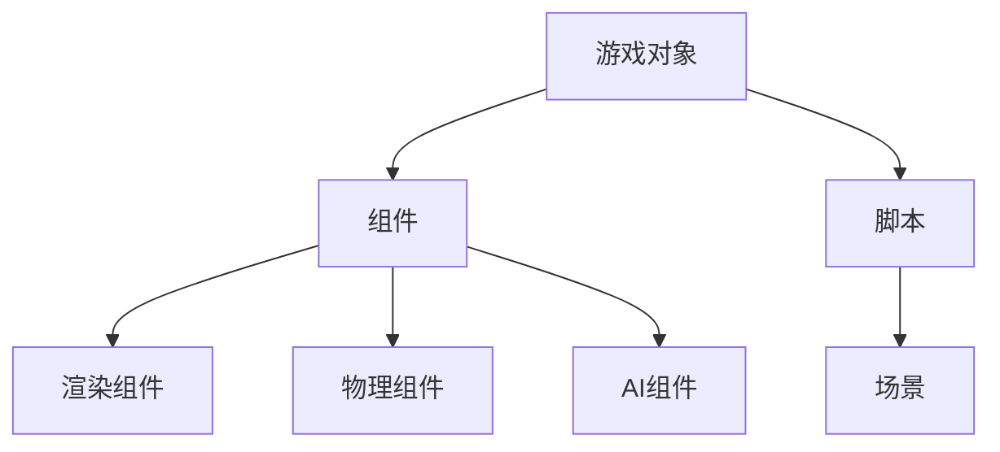

                 

Unity 游戏引擎作为当今最受欢迎的游戏开发平台之一，凭借其强大的功能和易于使用的界面，受到了全球游戏开发者的青睐。在本文中，我们将深入探讨Unity游戏引擎在创建逼真世界方面的应用，包括核心概念、算法原理、数学模型、项目实践以及实际应用场景等。

## 关键词

- Unity游戏引擎
- 游戏开发
- 真实感渲染
- 游戏物理
- 人工智能

## 摘要

本文将探讨Unity游戏引擎在创建逼真世界方面的应用，包括其核心概念和架构、核心算法原理和操作步骤、数学模型和公式以及项目实践和实际应用场景。通过本文的阅读，读者将能够全面了解Unity游戏引擎在游戏开发中的强大能力，并能够将其应用于实际项目中。

## 1. 背景介绍

Unity游戏引擎自2005年首次发布以来，已经成为了游戏开发领域的事实标准。它以其易于使用的界面和强大的功能，吸引了无数开发者使用它来创建各种类型的游戏，从简单的2D游戏到复杂的3D游戏。Unity的游戏引擎提供了完整的开发环境，包括编辑器、脚本语言（C#），以及广泛的插件和资源库。

Unity的游戏引擎在创建逼真的世界方面具有以下优点：

1. **图形渲染能力**：Unity拥有强大的图形渲染引擎，可以创建高质量的3D图形和视觉效果。
2. **物理引擎**：Unity内置了强大的物理引擎，可以模拟真实的物理现象，如重力、碰撞等。
3. **人工智能**：Unity提供了丰富的AI工具和API，可以创建智能的NPC和游戏机制。
4. **跨平台支持**：Unity支持多个平台，包括PC、移动设备、虚拟现实和增强现实设备，使得开发者可以轻松地将游戏部署到各种设备上。

## 2. 核心概念与联系

Unity游戏引擎的核心概念包括游戏对象（Game Objects）、组件（Components）、脚本（Scripts）和场景（Scenes）。这些概念相互联系，共同构建了Unity的游戏世界。

### 2.1 游戏对象（Game Objects）

游戏对象是Unity中的基本实体，可以是3D模型、2D精灵、相机、灯光等。每个游戏对象都包含一个或多个组件。

### 2.2 组件（Components）

组件是附加到游戏对象上的功能模块，如渲染组件、物理组件、AI组件等。组件实现了游戏对象的具体功能。

### 2.3 脚本（Scripts）

脚本是用C#编写的代码，用于实现游戏对象的特定行为。脚本可以附加到游戏对象上，或者作为独立的组件使用。

### 2.4 场景（Scenes）

场景是Unity中的编辑空间，用于组织和管理游戏对象、组件和脚本。场景可以保存并加载，以实现游戏的分场景加载。

以下是Unity核心概念的Mermaid流程图：



## 3. 核心算法原理 & 具体操作步骤

### 3.1 算法原理概述

Unity游戏引擎的核心算法包括渲染算法、物理算法和AI算法。

### 3.2 算法步骤详解

1. **渲染算法**：Unity使用的是基于光线的渲染算法，可以创建高质量的图像。渲染过程主要包括场景的加载、光照计算、阴影生成和贴图渲染等。
2. **物理算法**：Unity的物理引擎使用的是刚体动力学算法，可以模拟物体的运动和碰撞。物理算法包括碰撞检测、运动计算和力计算等。
3. **AI算法**：Unity的AI工具集包括决策树、状态机和行为树等。这些算法用于创建智能的NPC和游戏机制。

### 3.3 算法优缺点

1. **渲染算法**：优点是能够创建高质量的图像，缺点是计算复杂度高，对硬件要求较高。
2. **物理算法**：优点是能够模拟真实的物理现象，缺点是计算量大，可能会影响游戏性能。
3. **AI算法**：优点是能够创建智能的NPC和游戏机制，缺点是算法复杂，需要大量的测试和调整。

### 3.4 算法应用领域

1. **渲染算法**：广泛应用于3D游戏和虚拟现实应用中。
2. **物理算法**：广泛应用于物理模拟和游戏物理中。
3. **AI算法**：广泛应用于游戏AI、模拟和交互中。

## 4. 数学模型和公式

### 4.1 数学模型构建

Unity游戏引擎中的数学模型主要包括向量、矩阵和几何图形等。

### 4.2 公式推导过程

1. **向量计算**：包括向量的加法、减法、数乘和点积等。
2. **矩阵计算**：包括矩阵的乘法、逆矩阵和特征值等。
3. **几何图形**：包括点、线、面和体等。

### 4.3 案例分析与讲解

以3D渲染为例，我们使用以下公式来计算光照：

$$
L = I \cdot (N \cdot L)
$$

其中，$L$ 是光照向量，$I$ 是光源强度，$N$ 是法线向量。

## 5. 项目实践：代码实例和详细解释说明

### 5.1 开发环境搭建

在开始项目实践之前，我们需要搭建Unity的开发环境。首先，下载并安装Unity Hub，然后使用Unity Hub下载并安装Unity编辑器。接下来，我们需要安装一些必要的插件，如Unity Render Pipeline和Unity Physics。

### 5.2 源代码详细实现

以下是创建一个简单3D场景的Unity脚本代码：

```csharp
using UnityEngine;

public class SceneLoader : MonoBehaviour
{
    public GameObject player;
    public GameObject enemy;

    void Start()
    {
        // 创建玩家和敌人
        Instantiate(player);
        Instantiate(enemy);

        // 设置玩家的位置
        player.transform.position = new Vector3(0, 1, 0);

        // 设置敌人的位置
        enemy.transform.position = new Vector3(5, 1, 0);
    }
}
```

### 5.3 代码解读与分析

该脚本创建了一个玩家和一个敌人，并将它们放置在场景中。`Start` 方法在场景加载完成后立即执行，用于初始化场景。

### 5.4 运行结果展示

运行该脚本后，我们将在Unity编辑器中看到玩家和敌人出现在场景中，玩家位于坐标$(0, 1, 0)$，敌人位于坐标$(5, 1, 0)$。

## 6. 实际应用场景

Unity游戏引擎在创建逼真的世界方面有着广泛的应用场景，包括：

1. **游戏开发**：Unity是许多游戏开发者的首选平台，可以创建各种类型的游戏，从简单的2D游戏到复杂的3D游戏。
2. **虚拟现实**：Unity支持虚拟现实应用开发，可以创建沉浸式的虚拟环境。
3. **增强现实**：Unity支持增强现实应用开发，可以将虚拟对象叠加到现实世界中。
4. **模拟与培训**：Unity可以用于创建模拟和培训应用，如飞行模拟器、手术模拟器等。

## 7. 工具和资源推荐

### 7.1 学习资源推荐

- **Unity官方文档**：Unity的官方文档包含了丰富的教程和参考，是学习Unity的好资源。
- **Unity教程网站**：如Unity社区和Unity教程网，提供了大量的教程和项目实例。

### 7.2 开发工具推荐

- **Visual Studio Code**：一款轻量级的代码编辑器，支持Unity开发。
- **Unity Hub**：Unity的官方工具，用于下载和安装Unity编辑器和插件。

### 7.3 相关论文推荐

- **“Real-Time Rendering”**：由Tomoyuki Nishita撰写，是一本关于实时渲染的经典著作。
- **“Computer Graphics: Principles and Practice”**：由James D. Foley等人撰写，是一本关于计算机图形学的经典教材。

## 8. 总结：未来发展趋势与挑战

### 8.1 研究成果总结

Unity游戏引擎在创建逼真的世界方面取得了显著的研究成果，包括高质量的渲染、物理模拟和人工智能等。

### 8.2 未来发展趋势

未来，Unity游戏引擎将继续在实时渲染、物理模拟和人工智能等方面进行深入研究，以满足日益增长的游戏开发和虚拟现实应用的需求。

### 8.3 面临的挑战

尽管Unity游戏引擎在创建逼真的世界方面取得了显著成果，但仍然面临一些挑战，如计算复杂度高、硬件要求高等。

### 8.4 研究展望

随着硬件性能的提升和人工智能技术的发展，Unity游戏引擎在创建逼真的世界方面有着广阔的研究前景。

## 9. 附录：常见问题与解答

### 9.1 如何优化Unity游戏性能？

**回答**：优化Unity游戏性能的方法包括：
- 减少渲染物体数量
- 使用LOD（细节层次）技术
- 使用高效的数据结构和算法
- 关闭不必要的物理碰撞检测

### 9.2 Unity中的AI如何实现？

**回答**：Unity中的AI主要通过以下方式实现：
- 使用内置的AI工具，如决策树、状态机和行为树
- 编写自定义的AI脚本，使用C#语言实现复杂的AI逻辑
- 使用第三方AI插件，如Behavior Trees和NavMesh

# 作者署名

作者：禅与计算机程序设计艺术 / Zen and the Art of Computer Programming

本文基于Unity游戏引擎在创建逼真的世界方面的应用，深入探讨了其核心概念、算法原理、数学模型、项目实践以及实际应用场景。通过本文的阅读，读者将能够全面了解Unity游戏引擎在游戏开发中的强大能力，并能够将其应用于实际项目中。未来，随着硬件性能的提升和人工智能技术的发展，Unity游戏引擎在创建逼真的世界方面有着广阔的研究前景。

