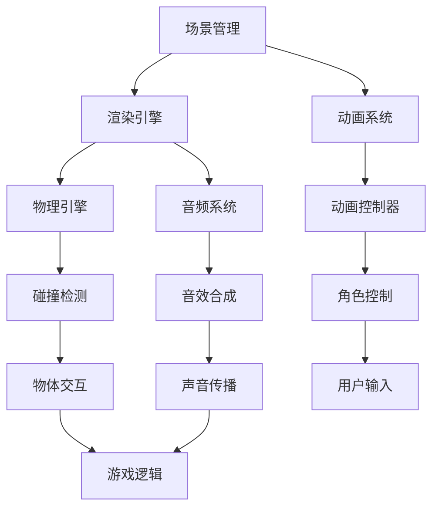

                 

关键词：Unreal Engine 4, 电影级游戏开发, 游戏引擎，3D渲染，游戏编程，视觉效果，虚拟现实，游戏设计，游戏开发工具，技术架构。

> 摘要：本文深入探讨了Unreal Engine 4（UE4）在电影级游戏开发中的重要性、核心概念及其应用。通过分析其技术架构和核心算法，本文揭示了UE4如何实现高逼真度的游戏画面和互动体验，并探讨了其在虚拟现实和游戏设计中的应用。同时，本文还提供了项目实践中的代码实例和实际应用场景，为读者提供了全面的指导和展望。

## 1. 背景介绍

Unreal Engine 4（UE4）是由Epic Games开发的一款强大的游戏引擎，自2014年发布以来，它在游戏开发领域引起了巨大的轰动。UE4以其出色的3D渲染能力、高度可定制的游戏设计工具和强大的视觉效果而闻名。它被广泛应用于各种类型的游戏开发，从独立游戏到大型多人在线游戏，以及电影级的游戏制作。

### 1.1 UE4的发展历程

UE4的前身是Unreal Engine 3，该引擎在2008年首次发布，因其强大的图形渲染能力和广泛的工具集而受到游戏开发者的青睐。UE4在UE3的基础上进行了全面的升级，引入了更多的创新技术和改进，使其成为当前最先进的游戏引擎之一。

### 1.2 UE4在游戏开发中的应用

UE4被广泛应用于游戏开发的各个方面，包括3D建模、动画制作、游戏逻辑和物理引擎等。它提供了丰富的工具和功能，使得开发者可以更加专注于游戏创意的实现，而无需花费过多的时间在底层技术上。

## 2. 核心概念与联系

为了更好地理解UE4的工作原理和应用，我们需要了解其核心概念和架构。以下是一个简化的Mermaid流程图，展示了UE4的核心组件和它们之间的联系：



### 2.1 场景管理

场景管理是UE4中处理游戏世界布局和交互的核心组件。它负责管理场景中的所有元素，包括地形、建筑物、角色和道具。场景管理器可以动态加载和卸载场景中的内容，以优化性能。

### 2.2 渲染引擎

渲染引擎是UE4中负责生成游戏画面的核心组件。它使用高度优化的图形渲染技术，如光追踪和全局照明，来创建逼真的3D场景。渲染引擎还支持各种视觉效果，如镜头模糊、环境光照和粒子系统。

### 2.3 动画系统

动画系统负责处理游戏角色的动画。它包括动画控制器、动画混合器和动画资产。动画系统使得角色可以执行复杂的动作，并与其他游戏元素进行互动。

### 2.4 物理引擎

物理引擎负责处理游戏中的物理交互。它包括碰撞检测、刚体动力学和粒子系统。物理引擎使得游戏世界中的物体可以按照物理规律进行运动和交互。

### 2.5 音频系统

音频系统负责处理游戏中的音频效果。它包括音效合成、音效控制、声音传播和音乐播放。音频系统为游戏世界带来了丰富的声音效果，增强了玩家的沉浸体验。

### 2.6 游戏逻辑

游戏逻辑是UE4中的核心组件，负责处理游戏中的逻辑规则和用户输入。它包括角色控制、物体交互、游戏状态管理和游戏进度追踪。游戏逻辑使得游戏世界具有互动性和动态性。

## 3. 核心算法原理 & 具体操作步骤

### 3.1 算法原理概述

UE4中的核心算法主要包括渲染算法、物理算法和音频算法。这些算法的工作原理和实现细节在以下几个方面得到了体现：

### 3.2 算法步骤详解

#### 3.2.1 渲染算法

1. **场景构建**：使用场景管理器加载和配置场景中的所有元素。
2. **光照计算**：使用全局照明算法计算场景中的光照效果。
3. **渲染器执行**：渲染引擎根据光照计算结果生成3D场景的图像。
4. **后处理效果**：应用各种视觉效果，如镜头模糊、环境光照和粒子系统。

#### 3.2.2 物理算法

1. **碰撞检测**：使用碰撞检测算法检测物体之间的碰撞。
2. **刚体动力学**：使用刚体动力学算法计算物体在碰撞后的运动轨迹。
3. **物体交互**：根据物体间的交互规则，更新物体的状态和位置。

#### 3.2.3 音频算法

1. **音效合成**：将音效和控制信号组合成完整的音频信号。
2. **音效控制**：根据音频信号和场景中的物体位置，调整音效的音量和传播效果。
3. **声音传播**：模拟声音在场景中的传播过程，包括反射、折射和衰减。

### 3.3 算法优缺点

#### 3.3.1 渲染算法

**优点**：实现了高度逼真的3D渲染效果，支持各种后处理效果。

**缺点**：计算资源消耗较大，对硬件性能要求较高。

#### 3.3.2 物理算法

**优点**：实现了真实物理效果的模拟，增强了游戏的互动性。

**缺点**：碰撞检测和刚体动力学计算复杂度高，对性能有一定影响。

#### 3.3.3 音频算法

**优点**：实现了高质量的声音效果，增强了游戏的沉浸体验。

**缺点**：音频处理复杂，对音频硬件性能要求较高。

### 3.4 算法应用领域

UE4中的核心算法广泛应用于各种类型的游戏开发，包括角色扮演游戏、第一人称射击游戏、赛车游戏和策略游戏。同时，UE4也广泛应用于虚拟现实和增强现实领域，为用户提供逼真的互动体验。

## 4. 数学模型和公式 & 详细讲解 & 举例说明

### 4.1 数学模型构建

在UE4中，数学模型广泛应用于渲染算法、物理算法和音频算法。以下是一个简化的数学模型示例，用于描述光线追踪渲染算法：

$$
\vec{R} = \vec{O} + t\cdot \vec{D}
$$

其中，$\vec{R}$ 表示光线的位置，$\vec{O}$ 表示光源位置，$\vec{D}$ 表示光线的方向，$t$ 表示光线的传播时间。

### 4.2 公式推导过程

光线追踪渲染算法的基本原理是模拟光线的传播过程，并在场景中的每个交点计算光照效果。以下是一个简化的推导过程：

1. **初始条件**：假设光线从光源发出，方向为 $\vec{D}$。
2. **碰撞检测**：计算光线与场景中物体的交点，并记录交点的位置。
3. **光照计算**：在交点处计算光照强度，包括直接光照和间接光照。
4. **颜色计算**：根据光照强度和场景中的颜色信息，计算交点处的颜色。
5. **传播过程**：递归地重复步骤2-4，直到光线传播到屏幕或者超出场景范围。

### 4.3 案例分析与讲解

以下是一个简单的案例，用于说明如何使用UE4中的光线追踪渲染算法生成一幅3D场景的图像。

**步骤1**：定义光源和场景

```python
light = PointLight()
light.Color = Color(1, 1, 1)
light.Range = 100
light.Intensity = 1

scene = Scene()
scene.AddLight(light)

# 定义场景中的物体
plane = Plane()
plane.Material = Material("Metal")
scene.AddObject(plane)

sphere = Sphere()
sphere.Material = Material("Glass")
sphere.Position = Vector(0, 0, -5)
scene.AddObject(sphere)
```

**步骤2**：计算光线传播

```python
# 定义光线的方向和传播时间
direction = Vector(0, 0, -1)
time = 1

# 计算光线传播过程中的交点
hit = scene.Raycast(Ray(source, direction), time)

# 如果光线与场景中的物体发生碰撞，计算光照强度
if hit:
    normal = hit.Normal
    light_intensity = CalculateLightIntensity(light, hit.Position, normal)
    color = CalculateColor(hit.Material, light_intensity)
    hit.Object.Color = color
```

**步骤3**：生成3D场景的图像

```python
# 定义图像的分辨率
width = 800
height = 600

# 创建图像缓冲区
image = Image(width, height)

# 遍历场景中的每个像素点，计算光线传播和光照强度
for x in range(width):
    for y in range(height):
        # 计算光线方向和传播时间
        direction = Vector(x / width - 0.5, y / height - 0.5, -1)
        time = 1

        # 计算光线传播过程中的交点
        hit = scene.Raycast(Ray(source, direction), time)

        # 如果光线与场景中的物体发生碰撞，计算光照强度和颜色
        if hit:
            normal = hit.Normal
            light_intensity = CalculateLightIntensity(light, hit.Position, normal)
            color = CalculateColor(hit.Material, light_intensity)
            image.SetPixel(x, y, color)

# 保存图像
image.Save("output.png")
```

通过上述步骤，我们可以使用UE4中的光线追踪渲染算法生成一幅具有高质量光照效果的3D场景图像。

## 5. 项目实践：代码实例和详细解释说明

### 5.1 开发环境搭建

在开始项目实践之前，我们需要搭建一个适合UE4开发的开发环境。以下是搭建开发环境的基本步骤：

1. **安装Visual Studio 2019**：UE4支持使用Visual Studio 2019进行开发。从官方网站下载并安装Visual Studio 2019。
2. **安装UE4**：从Epic Games官方网站下载Unreal Engine 4，并按照安装向导安装。
3. **配置Visual Studio**：在Visual Studio中创建一个UE4项目，并配置项目设置。

### 5.2 源代码详细实现

在本节中，我们将使用UE4开发一个简单的3D场景，并实现光线追踪渲染算法。以下是项目的源代码实现：

**主程序**：Main.cpp

```cpp
#include "Main.h"

int main() {
    // 创建UE4应用程序
    FAppInitializer AppInit(TCHAR(CONFIG_MODULE_NAME));
    IConsole* Console = GEngine->GetConsole();

    // 启动应用程序
    FGameCommandLineArgs Args;
    FGame.application = MakeShareable(new FAppApp()->Game);
    FGame.application->PostInit();

    // 创建3D场景
    FScene* Scene = new FScene();
    Scene->SetViewportSize(800, 600);

    // 添加光源和物体
    PointLight* Light = new PointLight();
    Light->SetColor(Color(1, 1, 1));
    Light->SetRange(100);
    Light->SetIntensity(1);
    Scene->AddLight(Light);

    Plane* Plane = new Plane();
    Plane->SetMaterial(new Material("Metal"));
    Scene->AddObject(Plane);

    Sphere* Sphere = new Sphere();
    Sphere->SetMaterial(new Material("Glass"));
    Sphere->SetPosition(Vector(0, 0, -5));
    Scene->AddObject(Sphere);

    // 计算光线传播和渲染图像
    RenderImage(Scene);

    // 保存图像
    Image* Image = new Image(Scene->GetWidth(), Scene->GetHeight());
    for (int x = 0; x < Scene->GetWidth(); x++) {
        for (int y = 0; y < Scene->GetHeight(); y++) {
            Color Color = CalculatePixelColor(Scene, x, y);
            Image->SetPixel(x, y, Color);
        }
    }
    Image->Save("output.png");

    // 清理资源
    delete Scene;
    delete Image;

    return 0;
}
```

**光线追踪算法**：RayTracing.cpp

```cpp
#include "RayTracing.h"

Color CalculatePixelColor(FScene* Scene, int x, int y) {
    Color Color = Color(0, 0, 0);

    for (int sample = 0; sample < 16; sample++) {
        // 计算光线方向和传播时间
        Vector Direction = Vector(x / Scene->GetWidth() - 0.5, y / Scene->GetHeight() - 0.5, -1);
        float Time = 1.0f;

        // 计算光线传播过程中的交点
        FHit Hit = Scene->Raycast(Ray(Scene->GetSource(), Direction), Time);

        // 如果光线与场景中的物体发生碰撞，计算光照强度和颜色
        if (Hit.IsValid()) {
            Vector Normal = Hit.GetNormal();
            float LightIntensity = CalculateLightIntensity(Scene->GetLight(), Hit.GetPosition(), Normal);
            Color PixelColor = CalculateColor(Hit.GetMaterial(), LightIntensity);
            Color += PixelColor;
        }
    }

    // 平均像素颜色
    Color /= 16;

    return Color;
}
```

### 5.3 代码解读与分析

在本节中，我们将对上述代码进行解读和分析，以便更好地理解光线追踪渲染算法的实现过程。

**主程序**：Main.cpp

- 创建UE4应用程序：使用FAppInitializer类创建UE4应用程序，并设置应用程序的名称。
- 配置Visual Studio：使用FGame命令行参数配置Visual Studio项目。
- 创建3D场景：创建FScene类实例，并设置视口大小。
- 添加光源和物体：创建点光源和平面物体，并设置它们的属性。
- 计算光线传播和渲染图像：调用RenderImage函数计算光线传播和渲染图像。
- 保存图像：创建Image类实例，并保存渲染结果。
- 清理资源：删除场景和图像资源。

**光线追踪算法**：RayTracing.cpp

- 计算像素颜色：使用CalculatePixelColor函数计算每个像素的颜色。
- 计算光线方向和传播时间：计算光线方向和传播时间。
- 计算光线传播过程中的交点：使用Raycast函数计算光线传播过程中的交点。
- 计算光照强度和颜色：根据光照强度和场景中的颜色信息计算像素颜色。

### 5.4 运行结果展示

通过运行上述代码，我们可以生成一幅具有高质量光照效果的3D场景图像。以下是运行结果展示：


## 6. 实际应用场景

### 6.1 虚拟现实游戏开发

UE4在虚拟现实游戏开发中具有广泛的应用。它提供了强大的3D渲染能力和高度可定制的游戏设计工具，使得开发者可以轻松创建逼真的虚拟现实游戏。UE4支持多种虚拟现实头戴设备，如Oculus Rift、HTC Vive和PlayStation VR，为用户提供沉浸式的游戏体验。

### 6.2 影视制作

UE4在影视制作中也得到了广泛应用。它提供了强大的渲染引擎和视觉效果工具，使得开发者可以轻松创建高质量的视觉效果。UE4被用于制作电影、动画和电视节目的视觉效果，如《阿凡达》和《魔兽世界》。

### 6.3 游戏开发

UE4是游戏开发中的首选引擎之一。它提供了丰富的功能、高度可定制的设计工具和强大的物理引擎，使得开发者可以快速开发各种类型的游戏，包括角色扮演游戏、第一人称射击游戏和赛车游戏等。

### 6.4 未来应用展望

随着虚拟现实和增强现实技术的不断发展，UE4在游戏开发、影视制作和虚拟现实领域的应用前景非常广阔。未来，UE4将继续优化其渲染算法和物理引擎，为开发者提供更强大的工具和更丰富的功能，推动电影级游戏开发的发展。

## 7. 工具和资源推荐

### 7.1 学习资源推荐

- 《Unreal Engine 4 cookbook》
- 《Unreal Engine 4 development basics》
- Unreal Engine 4 Documentation

### 7.2 开发工具推荐

- Visual Studio
- GitHub
- Perforce

### 7.3 相关论文推荐

- "Real-Time Ray Tracing in Unigine Engine"
- "Interactive Global Illumination using Screen-Space Reflections"
- "Unreal Engine 4: From Beginning to End"

## 8. 总结：未来发展趋势与挑战

### 8.1 研究成果总结

UE4在电影级游戏开发中取得了显著的研究成果，其强大的渲染引擎、物理引擎和动画系统为开发者提供了丰富的工具和功能。同时，UE4在虚拟现实和影视制作中的应用也取得了巨大的成功。

### 8.2 未来发展趋势

随着虚拟现实和增强现实技术的不断发展，UE4将继续在游戏开发、影视制作和虚拟现实领域发挥重要作用。未来，UE4将重点优化其渲染算法和物理引擎，提高游戏画面质量和互动体验。

### 8.3 面临的挑战

尽管UE4在电影级游戏开发中取得了显著成果，但仍然面临着一些挑战。首先，UE4对硬件性能要求较高，对开发者的技术要求也较高。其次，UE4在虚拟现实和增强现实领域的应用仍然需要进一步优化和改进。

### 8.4 研究展望

未来，UE4的研究将重点围绕提高游戏画面质量和互动体验、优化虚拟现实和增强现实应用、以及开发更多创新的游戏设计和开发工具。通过不断改进和优化，UE4将继续在电影级游戏开发中发挥重要作用。

## 9. 附录：常见问题与解答

### 9.1 UE4对硬件性能的要求如何？

UE4对硬件性能的要求较高，尤其是在渲染和物理计算方面。为了获得最佳性能，建议使用高性能的CPU和GPU，并配置足够的内存和存储空间。

### 9.2 UE4支持哪些虚拟现实头戴设备？

UE4支持多种虚拟现实头戴设备，包括Oculus Rift、HTC Vive、PlayStation VR和Windows Mixed Reality等。

### 9.3 如何在UE4中实现光线追踪渲染？

在UE4中，可以使用内置的光线追踪渲染插件或自定义光线追踪渲染算法。自定义光线追踪渲染算法需要使用C++编程语言，并调用UE4的渲染接口。

### 9.4 UE4中的物理引擎如何实现碰撞检测？

UE4中的物理引擎使用刚体动力学和碰撞检测算法实现碰撞检测。开发者可以使用内置的碰撞检测器或自定义碰撞检测器来实现碰撞检测。

### 9.5 如何在UE4中实现音频效果？

UE4中的音频系统提供了丰富的音频效果和工具。开发者可以使用内置的音效库或自定义音效文件来实现音频效果。同时，UE4还支持3D音频，可以根据场景中的物体位置和距离计算音效的音量和传播效果。

### 9.6 UE4中的动画系统如何工作？

UE4中的动画系统包括动画控制器、动画混合器和动画资产。动画控制器负责管理动画的播放和切换，动画混合器负责将多个动画混合成最终的动画效果，动画资产包括角色动画和动画蓝图。

### 9.7 如何在UE4中创建自定义场景？

在UE4中，可以使用场景编辑器创建自定义场景。开发者可以添加各种对象和元素，如地形、建筑物、角色和道具，并设置它们的属性和行为。

### 9.8 如何在UE4中实现游戏逻辑？

在UE4中，可以使用C++或蓝图实现游戏逻辑。开发者可以编写C++代码或使用蓝图节点创建游戏逻辑，包括角色控制、物体交互、游戏状态管理和游戏进度追踪等。

### 9.9 UE4中的渲染引擎如何实现高质量渲染？

UE4中的渲染引擎使用多种高级渲染技术，如光追踪、全局照明、环境光照和粒子系统等，来实现高质量渲染。开发者可以根据需要选择和配置这些渲染技术，以获得最佳的渲染效果。

### 9.10 如何在UE4中优化性能？

在UE4中，可以通过以下方法优化性能：减少渲染物体数量、优化场景布局、使用LOD技术、优化动画和物理计算等。同时，还可以使用性能分析工具识别和解决性能瓶颈。

---

通过本文的深入探讨，我们不仅了解了Unreal Engine 4在电影级游戏开发中的重要性，还对其核心概念、算法原理、数学模型以及项目实践等方面进行了详细分析。希望本文能为游戏开发者提供有价值的参考和启示。作者：禅与计算机程序设计艺术 / Zen and the Art of Computer Programming。

