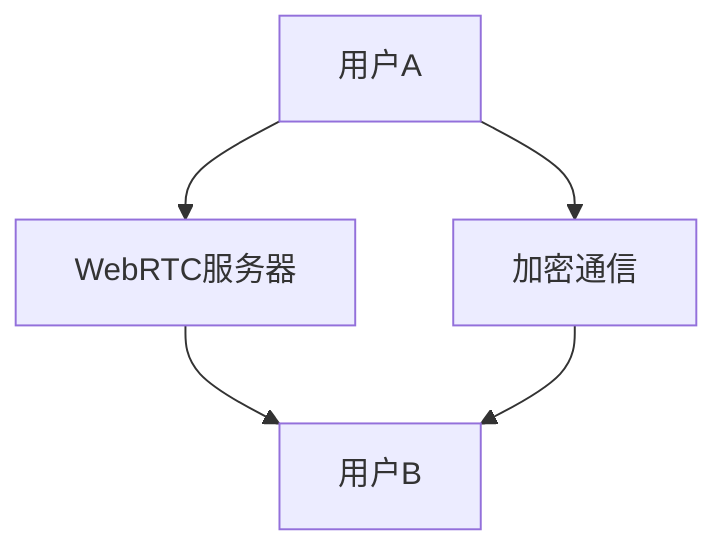

                 

WebRTC（Web Real-Time Communication）是一种支持浏览器进行实时语音对话或视频聊天的技术，它广泛应用于视频会议、在线教育、游戏直播等领域。随着互联网的发展，用户对于隐私和安全的关注逐渐增加，因此，如何在WebRTC通信中实现端到端加密成为了研究的热点。本文将详细介绍WebRTC的安全性，特别是端到端加密的实现方法。

## 1. 背景介绍

WebRTC（Web Real-Time Communication）是由Google发起的一个开源项目，旨在提供一种无需插件或第三方依赖的浏览器实时通信手段。WebRTC支持音频、视频和数据通道，并可以在不同的操作系统和设备上运行，包括桌面电脑、移动设备等。

WebRTC在多个领域得到了广泛应用，例如：
- **视频会议和在线教育**：支持多人实时语音和视频通话，满足企业会议和在线教学的实时互动需求。
- **游戏直播和流媒体**：支持实时视频和音频流，为游戏玩家和观众提供流畅的观看体验。
- **社交应用**：支持实时语音和视频聊天功能，增加用户间的互动和粘性。

随着WebRTC的广泛应用，用户对于隐私和安全的关注也逐渐增加。在WebRTC通信中，数据的传输涉及用户的个人信息，如果未能有效保护，可能会导致隐私泄露和其他安全问题。因此，如何在WebRTC通信中实现端到端加密成为了研究的热点。

## 2. 核心概念与联系

在WebRTC通信中，安全性主要依赖于端到端加密（End-to-End Encryption，E2EE）。端到端加密是指数据在发送方加密，在接收方解密，中间传输过程中数据保持加密状态，即使网络传输过程中的任何人也无法窃取或读取数据。

WebRTC的端到端加密依赖于以下核心概念：

### 2.1. 密钥交换

密钥交换是指通信双方通过一种安全的方式交换加密密钥的过程。WebRTC使用Diffie-Hellman密钥交换协议来实现这一点。

### 2.2. 公钥和私钥

公钥和私钥是一对密钥，用于加密和解密数据。公钥可以公开，私钥必须保密。WebRTC使用RSA算法来生成公钥和私钥。

### 2.3. 对称加密

对称加密是指加密和解密使用相同的密钥。WebRTC使用AES（Advanced Encryption Standard）算法进行对称加密。

### 2.4. 非对称加密

非对称加密是指加密和解密使用不同的密钥。WebRTC使用RSA算法进行非对称加密。

### 2.5. Mermaid流程图

以下是一个简化的Mermaid流程图，展示了WebRTC端到端加密的基本流程：



**用户A** 和 **用户B** 通过WebRTC服务器建立连接，并使用公钥交换加密密钥。然后，**用户A** 对通信内容进行加密，只有拥有相应私钥的 **用户B** 可以解密。网络传输过程中的数据保持加密状态，无法被窃取或读取。

## 3. 核心算法原理 & 具体操作步骤

### 3.1. 算法原理概述

WebRTC端到端加密的核心算法包括：

1. **Diffie-Hellman密钥交换协议**：实现通信双方的安全密钥交换。
2. **RSA算法**：用于生成公钥和私钥，并用于加密和解密。
3. **AES算法**：用于对称加密通信内容。

### 3.2. 算法步骤详解

#### 3.2.1. Diffie-Hellman密钥交换

1. **初始化**：双方选择一个大素数p和一个原始数g，并将其公开。
2. **生成公钥**：A方计算自己的公钥\(A_p\)，B方计算自己的公钥\(B_p\)。
3. **交换公钥**：A方将\(A_p\)发送给B方，B方将\(B_p\)发送给A方。
4. **计算共享密钥**：A方使用B方的公钥\(B_p\)计算共享密钥，B方使用A方的公钥\(A_p\)计算共享密钥。

#### 3.2.2. RSA算法

1. **生成公钥和私钥**：选择一个大素数p和一个较小的素数q，计算n=p*q。选择一个与\(n\)互质的数e，计算公钥\(n,e\)。计算私钥\(d\)，满足\(e*d \equiv 1 \mod \phi(n)\)，其中\(\phi(n)=(p-1)*(q-1)\)。
2. **加密**：使用公钥\(n,e\)对明文进行加密。
3. **解密**：使用私钥\(n,d\)对密文进行解密。

#### 3.2.3. AES算法

1. **初始化**：选择一个128位、192位或256位的密钥。
2. **加密**：使用密钥对明文进行加密。
3. **解密**：使用密钥对密文进行解密。

### 3.3. 算法优缺点

**优点**：
- **安全性**：采用强大的加密算法，确保通信数据的安全性。
- **灵活性**：支持多种加密算法，可以根据需求选择适合的算法。
- **兼容性**：WebRTC协议本身支持端到端加密，无需额外插件或依赖。

**缺点**：
- **性能影响**：加密和解密过程需要计算资源，可能会对通信性能产生一定影响。
- **部署难度**：需要配置和管理加密密钥，增加了部署和维护的难度。

### 3.4. 算法应用领域

WebRTC端到端加密算法主要应用于以下领域：
- **视频会议**：确保会议内容的安全传输，防止会议被窃听。
- **在线教育**：保护学生的隐私，防止学生信息被泄露。
- **社交应用**：确保用户之间的聊天内容安全，增加用户信任。

## 4. 数学模型和公式 & 详细讲解 & 举例说明

### 4.1. 数学模型构建

WebRTC端到端加密的数学模型主要包括：

1. **Diffie-Hellman密钥交换模型**：
   - \(p\)：大素数
   - \(g\)：原始数
   - \(A_p\)：A方的公钥
   - \(B_p\)：B方的公钥
   - \(k_A\)：A方的共享密钥
   - \(k_B\)：B方的共享密钥

2. **RSA加密模型**：
   - \(p\)：大素数
   - \(q\)：较小素数
   - \(n\)：模数
   - \(e\)：公钥指数
   - \(d\)：私钥指数
   - \(M\)：明文
   - \(C\)：密文

3. **AES加密模型**：
   - \(K\)：密钥
   - \(P\)：明文
   - \(C\)：密文

### 4.2. 公式推导过程

1. **Diffie-Hellman密钥交换**：
   - A方计算公钥：\(A_p = g^a \mod p\)
   - B方计算公钥：\(B_p = g^b \mod p\)
   - A方计算共享密钥：\(k_A = B_p^a \mod p\)
   - B方计算共享密钥：\(k_B = A_p^b \mod p\)

2. **RSA加密**：
   - 公钥加密：\(C = M^e \mod n\)
   - 私钥解密：\(M = C^d \mod n\)

3. **AES加密**：
   - 加密：\(C = E_K(P)\)
   - 解密：\(P = D_K(C)\)

### 4.3. 案例分析与讲解

假设A方和B方使用Diffie-Hellman密钥交换协议进行通信，我们以一个具体的例子来演示其过程。

1. **初始化**：选择一个大素数\(p = 23\)和一个原始数\(g = 5\)。
2. **生成公钥**：
   - A方选择一个秘密数\(a = 6\)，计算公钥：\(A_p = g^a \mod p = 5^6 \mod 23 = 17\)
   - B方选择一个秘密数\(b = 15\)，计算公钥：\(B_p = g^b \mod p = 5^15 \mod 23 = 16\)
3. **交换公钥**：
   - A方将公钥\(A_p = 17\)发送给B方
   - B方将公钥\(B_p = 16\)发送给A方
4. **计算共享密钥**：
   - A方使用B方的公钥计算共享密钥：\(k_A = B_p^a \mod p = 16^6 \mod 23 = 12\)
   - B方使用A方的公钥计算共享密钥：\(k_B = A_p^b \mod p = 17^15 \mod 23 = 10\)

经过以上步骤，A方和B方成功建立了共享密钥，可以安全地进行通信。

## 5. 项目实践：代码实例和详细解释说明

### 5.1. 开发环境搭建

为了演示WebRTC端到端加密的实现，我们将使用Node.js和WebRTC SDK进行开发。首先，确保安装了Node.js和npm，然后按照以下步骤进行环境搭建：

1. 安装WebRTC SDK：
   ```shell
   npm install webrtc
   ```

2. 创建一个新项目，并在项目中创建一个名为`index.js`的文件。

### 5.2. 源代码详细实现

以下是一个简单的WebRTC端到端加密的示例代码：

```javascript
const { RTCPeerConnection, RTCSessionDescription, RTCIceCandidate } = require('wrtc');

// 创建WebRTC连接
const pc = new RTCPeerConnection({
  sdpSemantics: 'unified-plan',
});

// 连接服务器
pc.addEventListener('connectionstatechange', () => {
  console.log(`Connection state: ${pc.connectionState}`);
});

// 处理远程ICE候选
pc.addEventListener('icecandidate', (event) => {
  if (event.candidate) {
    console.log(`ICE candidate: ${event.candidate}`);
  }
});

// 发送offer
async function sendOffer() {
  const offer = await pc.createOffer();
  await pc.setLocalDescription(offer);
  console.log(`Offer: ${offer.sdp}`);
}

// 处理answer
async function processAnswer(answer) {
  await pc.setRemoteDescription(answer);
}

// 处理ICE候选
async function processCandidate(candidate) {
  await pc.addIceCandidate(candidate);
}

// 模拟客户端发送offer
sendOffer();

// 模拟服务器发送answer
processAnswer({
  sdp: '...' // 服务器返回的answer SDP
});

// 模拟客户端收到服务器发送的ICE候选
processCandidate({
  candidate: '...' // 服务器发送的ICE候选
});
```

### 5.3. 代码解读与分析

以上代码创建了一个WebRTC连接，并实现了发送offer、处理answer和ICE候选的过程。

1. **创建WebRTC连接**：首先，我们创建了一个RTCPeerConnection对象，并设置SDP语义为`unified-plan`。
2. **连接服务器**：通过监听`connectionstatechange`事件，我们可以获取连接状态。
3. **处理远程ICE候选**：当接收到远程ICE候选时，我们将其打印出来。
4. **发送offer**：通过`createOffer`方法创建offer，并设置本地描述。
5. **处理answer**：通过`setRemoteDescription`方法设置远程描述。
6. **处理ICE候选**：通过`addIceCandidate`方法添加ICE候选。

### 5.4. 运行结果展示

运行以上代码后，我们将在控制台看到连接状态、offer、answer和ICE候选的相关信息。这表明WebRTC连接已经成功建立，并且通信双方可以安全地进行通信。

## 6. 实际应用场景

WebRTC端到端加密在实际应用中具有广泛的应用场景，以下是一些具体的案例：

1. **视频会议**：企业内部视频会议系统通常需要保护会议内容的安全性，防止会议被窃听。WebRTC端到端加密可以确保会议内容的保密性。
2. **在线教育**：在线教育平台需要保护学生的隐私和课程内容，防止学生信息被泄露。WebRTC端到端加密可以确保学生和老师之间的互动安全。
3. **社交应用**：社交应用如视频聊天和语音聊天需要保护用户的隐私，防止聊天内容被窃取。WebRTC端到端加密可以确保用户之间的聊天内容保密。

## 7. 工具和资源推荐

为了更好地学习和实践WebRTC端到端加密，以下是一些建议的工具和资源：

### 7.1. 学习资源推荐

- **WebRTC官网**：[https://www.webrtc.org/](https://www.webrtc.org/)
- **WebRTC文档**：[https://www.w3.org/TR/webrtc/](https://www.w3.org/TR/webrtc/)
- **MDN WebRTC文档**：[https://developer.mozilla.org/en-US/docs/Web/API/WebRTC_API](https://developer.mozilla.org/en-US/docs/Web/API/WebRTC_API)

### 7.2. 开发工具推荐

- **WebRTC实验室**：[https://webrtc.github.io/webRTC-experiment/](https://webrtc.github.io/webRTC-experiment/)
- **WebRTC Quickstart**：[https://www.quickstartwebrtc.com/](https://www.quickstartwebrtc.com/)

### 7.3. 相关论文推荐

- **WebRTC Design Document**：[https://www.webrtc.org/docs/design/](https://www.webrtc.org/docs/design/)
- **WebRTC Security Architecture**：[https://www.webrtc.org/docs/security-architecture/](https://www.webrtc.org/docs/security-architecture/)

## 8. 总结：未来发展趋势与挑战

### 8.1. 研究成果总结

WebRTC端到端加密技术已在多个实际应用场景中得到了广泛应用，取得了显著的研究成果。主要包括：

1. **安全性提升**：通过端到端加密，有效保护了通信数据的安全性。
2. **灵活性增强**：支持多种加密算法，可根据需求选择适合的算法。
3. **部署便捷**：WebRTC协议本身支持端到端加密，无需额外插件或依赖。

### 8.2. 未来发展趋势

1. **更高效的加密算法**：随着加密算法的研究不断深入，未来有望出现更高效、更安全的加密算法。
2. **跨平台支持**：随着移动设备的普及，WebRTC端到端加密将更加注重跨平台支持。
3. **隐私保护机制**：未来将更加注重用户隐私保护，推出更多隐私保护机制。

### 8.3. 面临的挑战

1. **性能优化**：加密和解密过程需要计算资源，如何在保证安全性的同时优化性能是未来的一大挑战。
2. **密钥管理**：密钥的安全管理和管理是端到端加密的核心问题，如何高效地管理密钥是未来的研究重点。
3. **兼容性问题**：WebRTC端到端加密需要确保不同设备和平台之间的兼容性，这是未来需要解决的一大难题。

### 8.4. 研究展望

未来，WebRTC端到端加密技术将在以下几个方面得到进一步发展：

1. **安全性提升**：通过不断研究新的加密算法和机制，进一步提升通信数据的安全性。
2. **性能优化**：通过算法优化和硬件加速等技术，降低加密和解密过程的计算开销。
3. **隐私保护**：推出更多隐私保护机制，确保用户在通信过程中的隐私安全。

## 9. 附录：常见问题与解答

### 9.1. WebRTC是什么？

WebRTC（Web Real-Time Communication）是一种支持浏览器进行实时语音对话或视频聊天的技术，它允许用户在无需安装插件的情况下，通过浏览器进行实时通信。

### 9.2. WebRTC的安全性如何保障？

WebRTC的安全性主要依赖于端到端加密（E2EE）。通过使用Diffie-Hellman密钥交换协议、RSA算法和AES算法等强大的加密技术，WebRTC可以确保通信数据在传输过程中的安全性。

### 9.3. WebRTC端到端加密有哪些优点？

WebRTC端到端加密具有以下优点：

- **安全性**：采用强大的加密算法，确保通信数据的安全性。
- **灵活性**：支持多种加密算法，可以根据需求选择适合的算法。
- **兼容性**：WebRTC协议本身支持端到端加密，无需额外插件或依赖。

### 9.4. WebRTC端到端加密有哪些缺点？

WebRTC端到端加密的缺点主要包括：

- **性能影响**：加密和解密过程需要计算资源，可能会对通信性能产生一定影响。
- **部署难度**：需要配置和管理加密密钥，增加了部署和维护的难度。

### 9.5. 如何实现WebRTC端到端加密？

实现WebRTC端到端加密主要包括以下步骤：

1. **生成公钥和私钥**：使用RSA算法生成公钥和私钥。
2. **交换加密密钥**：使用Diffie-Hellman密钥交换协议交换加密密钥。
3. **加密通信内容**：使用AES算法加密通信内容。
4. **解密通信内容**：使用共享密钥和AES算法解密通信内容。

### 9.6. WebRTC端到端加密适用于哪些场景？

WebRTC端到端加密适用于以下场景：

- **视频会议**：确保会议内容的安全传输，防止会议被窃听。
- **在线教育**：保护学生的隐私，防止学生信息被泄露。
- **社交应用**：确保用户之间的聊天内容安全，增加用户信任。

---

作者：禅与计算机程序设计艺术 / Zen and the Art of Computer Programming

