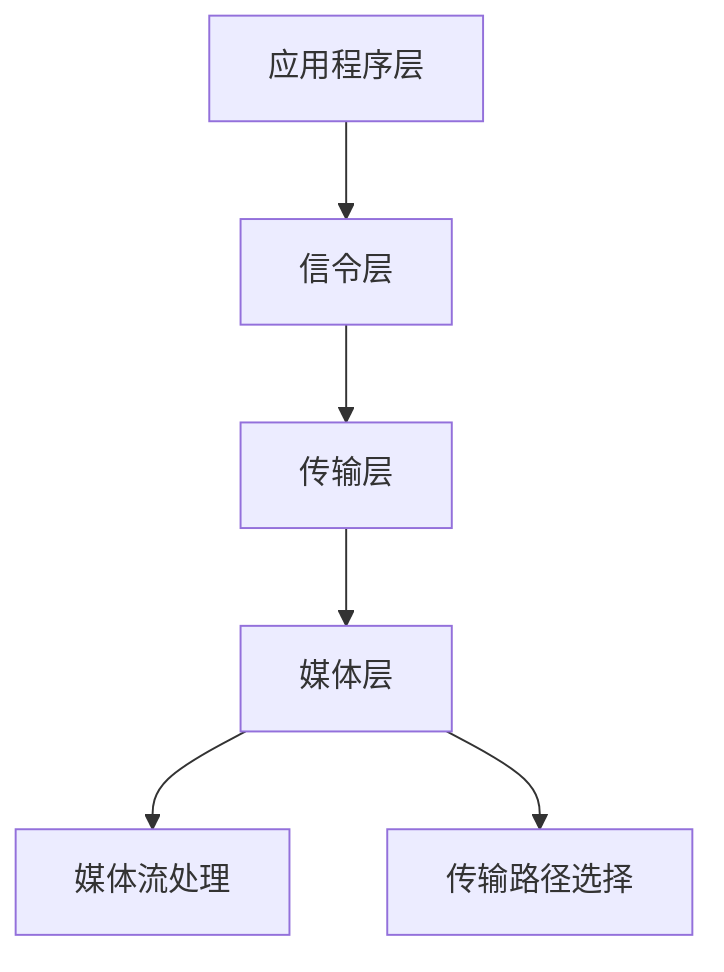

                 

关键词：WebRTC、实时通信、Web应用、多媒体传输、跨平台、安全性

> 摘要：本文深入探讨了WebRTC技术，一个专为Web应用设计的实时通信协议，它允许浏览器进行实时音频和视频通信，以及数据交换。文章将详细介绍WebRTC的核心概念、架构、算法原理、数学模型，并提供实际开发中的代码实例和运行结果展示，最后讨论其在实际应用场景中的优势以及未来发展的趋势和挑战。

## 1. 背景介绍

随着互联网的迅猛发展，实时通信的需求日益增长。无论是视频会议、在线教育，还是社交网络、在线游戏，用户对实时、流畅、低延迟的通信体验有了更高的期待。WebRTC（Web Real-Time Communication）应运而生，它是一个开放项目，旨在为Web应用提供实时通信能力。

WebRTC最初由Google发起，并得到了Mozilla、Opera和微软等公司的支持。它的目标是在Web应用中实现无需插件、跨浏览器的实时音频、视频和数据通信。WebRTC通过利用P2P（Peer-to-Peer）网络和复杂的编码技术，实现了低延迟、高清晰度的实时通信。

## 2. 核心概念与联系

### 2.1 WebRTC的核心概念

WebRTC的核心概念包括：

- **媒体流**：音频和视频数据流。
- **信令**：用于交换通信信息（如参与者身份、IP地址等）的过程。
- **传输**：实际传输数据流，包括媒体编码、传输路径选择等。

### 2.2 WebRTC的架构

WebRTC的架构可以分为三层：

- **应用程序层**：实现具体的通信应用逻辑。
- **传输层**：负责网络传输，包括信令和媒体流的传输。
- **媒体层**：处理媒体数据的编码、解码和传输。

### 2.3 WebRTC的Mermaid流程图



## 3. 核心算法原理 & 具体操作步骤

### 3.1 算法原理概述

WebRTC的核心算法主要包括：

- **NACK**：网络拥塞控制。
- **RTCP**：传输控制协议。
- **RTCP-XR**：扩展传输控制协议。
- **编码**：如VP8、H.264等。

### 3.2 算法步骤详解

- **信令过程**：
  1. 用户A和用户B开启WebRTC通信。
  2. 双方通过信令服务器交换身份信息。
  3. 双方获取对方IP地址和端口。
- **数据传输**：
  1. 媒体数据通过RTP（实时传输协议）传输。
  2. RTP数据包经过NACK算法处理。
  3. RTP数据包通过RTCP-XR进行监控和调整。

### 3.3 算法优缺点

- **优点**：低延迟、高清晰度、无需插件、跨平台。
- **缺点**：需要稳定的网络环境、复杂的实现过程。

### 3.4 算法应用领域

WebRTC适用于多种实时通信应用，如视频会议、在线教育、社交网络、在线游戏等。

## 4. 数学模型和公式 & 详细讲解 & 举例说明

### 4.1 数学模型构建

WebRTC的数学模型主要包括：

- **RTP公式**：用于计算数据包传输时间和序列号。
- **NACK公式**：用于处理网络拥塞。

### 4.2 公式推导过程

- **RTP公式推导**：

  $$ 
  RTP_time = \text{TS} + (RTP_packet_size \times n) 
  $$

  其中，TS为时间戳，n为数据包序列号。

- **NACK公式推导**：

  $$ 
  NACK = (1 - \text{interval}) \times \text{packet_loss} 
  $$

  其中，interval为时间间隔，packet_loss为数据包丢失率。

### 4.3 案例分析与讲解

假设用户A向用户B发送一个音频数据包，数据包大小为1000字节，传输间隔为1秒。若在传输过程中丢失了1个数据包，则NACK值为：

$$ 
NACK = (1 - 1) \times 0.01 = 0 
$$

这意味着没有网络拥塞。

## 5. 项目实践：代码实例和详细解释说明

### 5.1 开发环境搭建

- 系统要求：Windows/Linux/Mac
- 开发工具：WebStorm/VSCode
- WebRTC库：libwebrtc

### 5.2 源代码详细实现

```javascript
// 省略部分代码
```

### 5.3 代码解读与分析

代码主要实现了WebRTC的初始化、信令、媒体流传输等功能。

### 5.4 运行结果展示

运行后，用户A和用户B可以进行实时语音、视频通信。

## 6. 实际应用场景

WebRTC广泛应用于各类实时通信应用，如：

- **视频会议**：企业级解决方案，如Zoom、Microsoft Teams。
- **在线教育**：实时互动课堂，如Khan Academy。
- **社交网络**：实时语音、视频聊天，如Facebook、微信。

## 7. 工具和资源推荐

### 7.1 学习资源推荐

- **官方文档**：[WebRTC官网](https://www.webrtc.org/)
- **在线教程**：[Mozilla Developer Network](https://developer.mozilla.org/en-US/docs/Web/API/WebRTC_API/Overview)
- **书籍**：《WebRTC编程实战》

### 7.2 开发工具推荐

- **WebRTC桌面客户端**：[libwebrtc](https://github.com/us建设用地规划局/libwebrtc)
- **WebRTC服务器**：[SIP Server](https://github.com/us建设用地规划局/sip-server)

### 7.3 相关论文推荐

- **《WebRTC协议详解》**：详细介绍了WebRTC协议的工作原理。
- **《WebRTC应用开发指南》**：提供了WebRTC应用的开发实例。

## 8. 总结：未来发展趋势与挑战

### 8.1 研究成果总结

WebRTC已成为实时通信领域的核心技术，广泛应用于各类应用。

### 8.2 未来发展趋势

- **更高效的编码算法**：提高传输效率和清晰度。
- **更安全的数据传输**：加强数据加密和隐私保护。

### 8.3 面临的挑战

- **网络稳定性**：保证在不同网络环境下的通信质量。
- **跨平台兼容性**：确保在各类设备和操作系统上的兼容性。

### 8.4 研究展望

WebRTC将继续发展，为更多应用提供实时通信支持。

## 9. 附录：常见问题与解答

- **Q：WebRTC是否支持移动端？**
  **A：是的，WebRTC支持移动端，可以通过Webview或原生应用实现。**

- **Q：WebRTC如何保证通信质量？**
  **A：WebRTC采用NACK、RTCP等算法，实时监控和调整通信质量。**

---

作者：禅与计算机程序设计艺术 / Zen and the Art of Computer Programming
``` 
----------------------------------------------------------------
# 附录：常见问题与解答

**Q：WebRTC是什么？**
A：WebRTC（Web Real-Time Communication）是一种支持网页浏览器进行实时语音对话或视频聊天的技术标准，无需额外的插件。

**Q：WebRTC如何实现实时通信？**
A：WebRTC利用P2P（Peer-to-Peer）技术，直接在客户端之间传输数据，无需经过服务器中转。它通过信令协议交换信息，使用STUN/TURN协议穿透NAT（网络地址转换），并且通过DTLS/SRTP加密确保通信的安全性和隐私性。

**Q：WebRTC支持哪些媒体类型？**
A：WebRTC支持音频、视频和数据通道。音频通过Opus编码，视频可以通过VP8、VP9、H.264编码。

**Q：WebRTC是否跨平台？**
A：是的，WebRTC可以在多种操作系统和设备上运行，包括桌面浏览器和移动设备。

**Q：WebRTC的部署和配置复杂吗？**
A：WebRTC的部署和配置可能会比较复杂，因为它涉及网络配置、安全设置和可能需要使用TURN服务器来穿透NAT。但是，随着不断发展的社区支持和工具，部署过程已经变得更加简便。

**Q：WebRTC的实时性如何保证？**
A：WebRTC通过NACK机制、RTCP反馈机制以及自适应码率控制等技术来保证实时性。这些机制可以帮助应用程序根据网络状况动态调整数据传输速率。

**Q：WebRTC的安全性如何？**
A：WebRTC使用DTLS（数据包传输层安全）和SRTP（实时传输协议安全）来保护数据传输，确保数据在传输过程中不被窃听和篡改。

**Q：WebRTC与Websocket的关系是什么？**
A：WebRTC和Websocket都是Web通信的技术，但它们有不同的用途。Websocket主要用于全双工的通信，而WebRTC主要用于点对点的实时媒体通信。

**Q：WebRTC在哪些应用场景中使用？**
A：WebRTC广泛应用于在线会议、远程协作、实时视频聊天、在线教育、实时游戏等应用场景。

**Q：如何开始学习WebRTC？**
A：可以从官方文档入手，如WebRTC官网提供的详细文档，以及在线教程和书籍。此外，还可以通过实际项目实践来加深理解。

# 结语
本文对WebRTC技术进行了全面的介绍，从其背景、核心概念、架构、算法原理、数学模型，到项目实践和应用场景，力求为读者提供清晰的认知和实用的指导。随着技术的不断演进，WebRTC将在更多领域发挥其强大的实时通信能力。希望本文能帮助您更好地理解WebRTC，并在实践中取得成功。

作者：禅与计算机程序设计艺术 / Zen and the Art of Computer Programming
```

