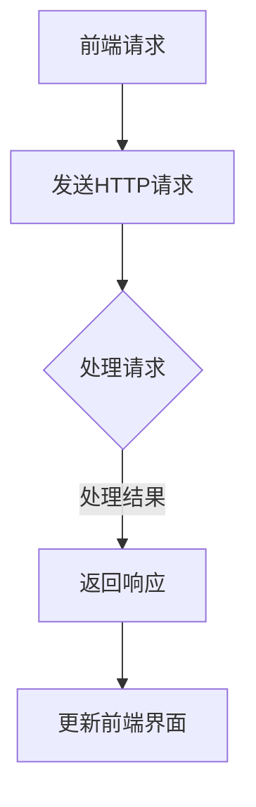

                 

 在当今的互联网时代，Web 应用程序的构建已经发生了翻天覆地的变化。随着前端技术的发展，用户界面变得更加丰富和动态，而后端则面临着日益复杂的业务逻辑和数据管理需求。为了应对这些挑战，Web 前后端分离架构应运而生。本文将深入探讨 Web 前后端分离架构的设计与实现，旨在为开发者提供一套完整的技术解决方案。

## 文章关键词
Web应用开发、前后端分离、架构设计、开发实践、性能优化

## 文章摘要
本文将首先介绍 Web 前后端分离架构的背景和核心概念。接着，我们将详细讲解核心算法原理和具体实现步骤，同时探讨其优缺点和适用领域。随后，我们将通过一个实际项目实践，展示如何搭建开发环境，详细解释源代码的实现和运行结果。最后，我们将讨论 Web 前后端分离架构在实际应用场景中的表现，并展望其未来的发展趋势和面临的挑战。

## 1. 背景介绍
### 1.1 Web应用的发展历程
Web 应用程序的发展历程可以追溯到1990年代初，当时万维网（WWW）的兴起带来了信息传播方式的革命。最早的Web应用通常是由服务器端脚本语言（如Perl、PHP）处理HTML页面，并通过CGI程序与用户交互。这种模式被称为“原始模式”，其主要特点是服务器端处理所有逻辑，前端仅负责展示。

### 1.2 前后端分离的必要性
随着时间的推移，Web应用的需求变得越来越复杂，用户体验变得至关重要。为了提高开发效率和灵活性，前后端分离逐渐成为主流。前后端分离的必要性主要体现在以下几个方面：

- **开发效率**：前后端分离使得开发人员可以并行工作，前端工程师专注于用户界面和交互，后端工程师专注于数据处理和业务逻辑。
- **可维护性**：前后端分离降低了系统的复杂性，使得代码更加模块化，便于维护和升级。
- **技术栈的多样性**：前后端分离允许前端和后端采用不同的技术栈，更好地满足项目需求。

### 1.3 前后端分离的基本概念
在前后端分离架构中，前端负责构建用户界面和与用户交互，通常使用HTML、CSS和JavaScript等技术。后端则负责处理业务逻辑和数据存储，通常使用服务器端编程语言（如Java、Python、Node.js）和数据库（如MySQL、MongoDB）。

## 2. 核心概念与联系
### 2.1 前端技术栈
- **HTML**：用于创建网页的结构。
- **CSS**：用于定义网页的样式。
- **JavaScript**：用于实现网页的交互性和动态效果。

### 2.2 后端技术栈
- **服务器端编程语言**：如Java、Python、Node.js。
- **数据库**：如MySQL、MongoDB。
- **API接口**：用于前后端的通信。

### 2.3 Mermaid 流程图


## 3. 核心算法原理 & 具体操作步骤
### 3.1 算法原理概述
Web前后端分离架构的核心在于通过API接口进行数据交换。前端通过HTTP请求向后端发送请求，后端处理请求并返回响应。这个过程可以概括为以下几个步骤：

1. **前端发起请求**：用户在前端界面执行操作，前端生成HTTP请求。
2. **请求发送到后端**：HTTP请求通过网络发送到后端服务器。
3. **后端处理请求**：后端服务器接收请求，执行相应的业务逻辑，处理请求并返回结果。
4. **前端接收响应**：前端接收到后端的响应后，根据响应结果更新界面。

### 3.2 算法步骤详解
1. **创建HTTP请求**：
   ```javascript
   const request = new XMLHttpRequest();
   request.open("GET", "/api/data", true);
   request.onload = function() {
       if (request.status >= 200 && request.status < 400) {
           // 处理成功的情况
           const data = JSON.parse(request.responseText);
           // 更新界面
       } else {
           // 处理错误的情况
       }
   };
   request.onerror = function() {
       // 处理网络错误的情况
   };
   request.send();
   ```

2. **后端处理请求**：
   ```python
   from flask import Flask, jsonify, request
   
   app = Flask(__name__)
   
   @app.route('/api/data', methods=['GET'])
   def get_data():
       # 执行业务逻辑
       data = {"result": "success"}
       return jsonify(data)
   
   if __name__ == '__main__':
       app.run()
   ```

3. **前端接收响应**：
   ```javascript
   // 使用AJAX请求后端API
   const xhr = new XMLHttpRequest();
   xhr.onreadystatechange = function() {
       if (xhr.readyState === XMLHttpRequest.DONE) {
           if (xhr.status === 200) {
               // 成功获取数据，更新界面
               const data = JSON.parse(xhr.responseText);
               updateUI(data);
           } else {
               // 处理错误
           }
       }
   };
   xhr.open("GET", "/api/data", true);
   xhr.send();
   ```

### 3.3 算法优缺点
**优点**：
- **高可维护性**：前后端分离降低了系统的复杂性，使得代码更加模块化。
- **开发效率**：前后端可以并行工作，提高了开发效率。
- **技术栈多样性**：前后端可以采用不同的技术栈，更好地满足项目需求。

**缺点**：
- **网络延迟**：前后端分离可能导致一定的网络延迟，影响用户体验。
- **安全性问题**：前后端分离可能引入安全性问题，需要加强API安全防护。

### 3.4 算法应用领域
Web前后端分离架构广泛应用于各种类型的Web应用，如电子商务平台、社交媒体、在线教育平台等。该架构的优势使得它成为现代Web应用开发的主流选择。

## 4. 数学模型和公式 & 详细讲解 & 举例说明
### 4.1 数学模型构建
在Web前后端分离架构中，我们可以使用以下数学模型来描述请求和响应的过程：

$$
\text{请求} \rightarrow \text{响应} = \text{请求时间} + \text{响应时间}
$$

其中，请求时间和响应时间分别是前端发送请求和后端处理请求的时间。

### 4.2 公式推导过程
假设：
- 请求时间 $T_{\text{request}}$ 为前端生成HTTP请求所需的时间。
- 响应时间 $T_{\text{response}}$ 为后端处理请求并返回响应所需的时间。

那么，整个请求-响应过程的耗时可以表示为：

$$
T_{\text{total}} = T_{\text{request}} + T_{\text{response}}
$$

### 4.3 案例分析与讲解
假设一个简单的Web应用，用户在前端界面提交一个表单，后端接收表单数据并验证。根据我们的数学模型，我们可以计算出整个请求-响应过程的时间。

- **请求时间**：假设生成HTTP请求需要0.5秒。
- **响应时间**：假设后端处理请求并返回响应需要1秒。

那么，整个请求-响应过程的总时间为：

$$
T_{\text{total}} = 0.5\text{s} + 1\text{s} = 1.5\text{s}
$$

这个时间取决于具体的网络环境和硬件性能，但在一般情况下，这个时间是可接受的。

## 5. 项目实践：代码实例和详细解释说明
### 5.1 开发环境搭建
为了实践Web前后端分离架构，我们需要搭建一个简单的开发环境。以下是所需的环境和工具：

- **前端**：HTML、CSS、JavaScript
- **后端**：Node.js、Express框架
- **数据库**：MongoDB

### 5.2 源代码详细实现
**前端**：一个简单的HTML页面，包含一个表单和JavaScript代码，用于发送请求和处理响应。

```html
<!DOCTYPE html>
<html lang="en">
<head>
    <meta charset="UTF-8">
    <title>前后端分离示例</title>
</head>
<body>
    <h1>用户注册</h1>
    <form id="registerForm">
        <label for="username">用户名：</label>
        <input type="text" id="username" name="username" required>
        <label for="password">密码：</label>
        <input type="password" id="password" name="password" required>
        <button type="submit">注册</button>
    </form>
    <div id="result"></div>
    <script src="app.js"></script>
</body>
</html>
```

```javascript
// app.js
document.getElementById('registerForm').onsubmit = function(event) {
    event.preventDefault();
    const username = document.getElementById('username').value;
    const password = document.getElementById('password').value;
    fetch('/api/register', {
        method: 'POST',
        headers: {
            'Content-Type': 'application/json'
        },
        body: JSON.stringify({ username, password })
    })
    .then(response => response.json())
    .then(data => {
        if (data.success) {
            document.getElementById('result').textContent = '注册成功！';
        } else {
            document.getElementById('result').textContent = '注册失败：' + data.error;
        }
    });
};
```

**后端**：使用Node.js和Express框架搭建一个简单的后端服务器，用于处理前端的请求。

```javascript
// app.js
const express = require('express');
const bodyParser = require('body-parser');
const MongoClient = require('mongodb').MongoClient;

const app = express();
app.use(bodyParser.json());

const url = 'mongodb://localhost:27017';
const dbName = 'mydb';

app.post('/api/register', async (req, res) => {
    const { username, password } = req.body;
    // 数据库连接和操作
    const client = await MongoClient.connect(url, { useUnifiedTopology: true });
    const db = client.db(dbName);
    const users = db.collection('users');
    // 检查用户名是否已存在
    const userExists = await users.findOne({ username });
    if (userExists) {
        res.json({ success: false, error: '用户名已存在' });
    } else {
        // 插入新用户
        await users.insertOne({ username, password });
        res.json({ success: true });
    }
    client.close();
});

const port = 3000;
app.listen(port, () => {
    console.log(`Server listening on port ${port}`);
});
```

### 5.3 代码解读与分析
在这个示例中，前端负责用户界面和与用户的交互，后端负责业务逻辑和数据存储。通过使用API接口，前端向后端发送请求，后端处理请求并返回响应。这个过程实现了前后端分离，提高了系统的可维护性和开发效率。

### 5.4 运行结果展示
- **前端**：用户打开HTML页面，填写表单并提交。
- **后端**：后端服务器接收到请求，执行业务逻辑，并将结果返回给前端。
- **前端**：前端接收到后端的响应，根据响应结果更新界面。

## 6. 实际应用场景
### 6.1 社交媒体平台
社交媒体平台通常具有大量的用户和复杂的业务逻辑。通过前后端分离架构，前端可以专注于用户界面和交互，后端可以处理用户数据和安全。例如，用户发布帖子、点赞和评论等功能都可以通过前后端分离来实现。

### 6.2 电子商务平台
电子商务平台需要对商品库存、订单处理、支付等业务进行高效处理。前后端分离架构可以使得前端专注于用户购物体验，后端专注于业务逻辑和数据管理。例如，用户浏览商品、添加购物车、下单支付等功能都可以通过前后端分离来实现。

### 6.3 在线教育平台
在线教育平台需要对课程内容、学习进度、用户行为进行分析和优化。前后端分离架构可以使得前端专注于用户学习体验，后端专注于数据分析和业务处理。例如，用户注册、登录、学习课程、参加考试等功能都可以通过前后端分离来实现。

## 6.4 未来应用展望
### 6.4.1 人工智能与前后端分离
随着人工智能技术的发展，前后端分离架构将更好地与人工智能技术相结合。前端可以利用人工智能技术实现更智能的用户交互，后端可以利用人工智能技术进行更高效的业务处理。例如，通过人脸识别技术实现用户身份验证，通过自然语言处理技术实现智能客服。

### 6.4.2 容器化与微服务
随着容器化和微服务架构的普及，前后端分离架构将更加灵活和可扩展。通过使用容器化和微服务架构，前后端分离的应用可以更容易地部署和管理。例如，前端可以使用容器化技术实现多环境部署，后端可以使用微服务架构实现分布式计算。

### 6.4.3 云原生技术
随着云原生技术的不断发展，前后端分离架构将更好地与云计算和大数据技术相结合。通过使用云原生技术，前后端分离的应用可以实现更高的性能和可扩展性。例如，通过Kubernetes进行容器编排，通过大数据平台进行数据分析和处理。

## 7. 工具和资源推荐
### 7.1 学习资源推荐
- 《JavaScript高级程序设计》
- 《Node.js实战》
- 《MongoDB权威指南》

### 7.2 开发工具推荐
- Visual Studio Code
- Git
- Postman

### 7.3 相关论文推荐
- "Microservices: A Definition of a new Approach to Building Software and the Problems It Solves"
- "The Design of the UNIX Operating System"
- "Docker: containerize everything"

## 8. 总结：未来发展趋势与挑战
### 8.1 研究成果总结
本文详细探讨了Web前后端分离架构的设计与实现，介绍了其核心算法原理、具体操作步骤和数学模型。通过实际项目实践，展示了如何搭建开发环境，详细解释了源代码的实现和运行结果。

### 8.2 未来发展趋势
随着互联网技术的不断发展，Web前后端分离架构将继续成为Web应用开发的主流选择。未来，该架构将更好地与人工智能、容器化、微服务、云原生技术相结合，实现更高的性能和可扩展性。

### 8.3 面临的挑战
尽管Web前后端分离架构具有诸多优势，但也面临着一些挑战，如网络延迟、安全性问题和系统复杂性等。未来，需要不断优化和改进该架构，以应对这些挑战。

### 8.4 研究展望
未来的研究可以集中在以下几个方面：优化网络通信效率、提高系统安全性、实现更智能的前端交互和更高效的业务处理。通过这些研究，Web前后端分离架构将更好地满足现代Web应用的需求。

## 9. 附录：常见问题与解答
### 9.1 前后端分离与单体架构的区别是什么？
前后端分离架构将前端和后端分离成独立的模块，各自开发和部署。而单体架构是将整个应用部署在一个服务器上，前端和后端代码混合在一起。

### 9.2 前后端分离架构如何处理安全性问题？
前后端分离架构可以通过API接口的权限验证、数据加密和安全性检查等措施来处理安全性问题。

### 9.3 前后端分离架构如何提高系统性能？
可以通过优化API接口、使用缓存技术、采用异步处理等方式来提高系统性能。

----------------------------------------------------------------

以上就是本文的完整内容，希望对您在Web前后端分离架构设计与实现方面有所启发。如果您有任何问题或建议，欢迎在评论区留言。感谢您的阅读！

作者：禅与计算机程序设计艺术 / Zen and the Art of Computer Programming

本文内容仅供参考，具体实现请根据实际情况进行调整。

