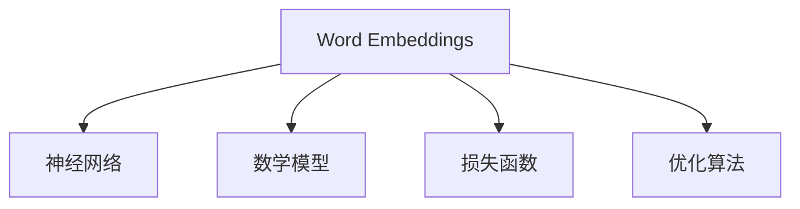

                 

关键词：Word Embeddings、自然语言处理、词向量、神经网络、机器学习、深度学习、GloVe、Word2Vec、数学模型、代码实例、应用场景、未来展望

## 摘要

本文将深入探讨Word Embeddings的原理、算法实现以及实际应用。Word Embeddings是自然语言处理（NLP）领域中的一项关键技术，它将词汇映射为向量，从而使得计算机能够理解和处理自然语言。本文将首先介绍Word Embeddings的背景和核心概念，然后详细讲解GloVe和Word2Vec两种主要的Word Embeddings算法，接着通过数学模型和公式推导，阐述这些算法的内在机制。最后，我们将通过一个实际的代码实例，展示如何使用Python实现Word Embeddings，并分析其在实际应用中的效果。通过本文的讲解，读者将对Word Embeddings有更深入的理解，并能够将其应用到自己的项目中。

## 1. 背景介绍

### Word Embeddings的概念

Word Embeddings是一种将自然语言词汇映射为向量表示的技术。在这种表示下，每个单词或短语都可以表示为一个固定长度的向量。这些向量不仅能够保留词语的语义信息，而且还能捕捉到词语之间的关联性。这种向量化的表示方法使得计算机能够处理和分析自然语言，从而应用于诸如文本分类、情感分析、机器翻译、推荐系统等多个领域。

### Word Embeddings的起源

Word Embeddings的起源可以追溯到20世纪40年代，当时引入了词语的索引表示法，即使用唯一的数字或字母来标识每个单词。然而，这种表示方法无法有效地捕捉词语的语义信息。随着计算机科学和机器学习的发展，研究人员开始探索更有效的词汇表示方法。

2003年，Tomas Mikolov等人提出了Word2Vec算法，这是一种基于神经网络的Word Embeddings方法。随后，GloVe（Global Vectors for Word Representation）算法也在2014年被提出，它通过矩阵分解方法实现了更高质量的词汇向量表示。

### Word Embeddings的优势

Word Embeddings具有以下几个显著的优势：

1. **语义表示**：Word Embeddings能够将具有相似语义的词语映射到相似的向量空间中，从而实现词语的语义表示。
2. **向量运算**：通过向量运算，可以方便地实现词语的相似性比较、词义相似度计算等操作。
3. **模型迁移**：Word Embeddings可以作为一种预训练资源，迁移到其他NLP任务中，提高模型的性能。
4. **跨语言应用**：Word Embeddings可以在不同语言之间进行映射，从而实现跨语言文本分析和处理。

## 2. 核心概念与联系

### 2.1. Word Embeddings的基本原理

Word Embeddings的核心思想是将词汇映射到高维向量空间中，使得相似词汇在空间中靠近，而不相似的词汇则远离。这种映射通常通过训练模型来实现，模型会根据训练数据自动调整向量的权重，以最小化某种损失函数。

### 2.2. Word Embeddings与神经网络

神经网络是Word Embeddings的重要工具，特别是深度学习神经网络。在Word Embeddings中，神经网络通常用于训练词汇向量，使其能够捕捉词语的语义信息。具体而言，神经网络可以将单词作为输入，通过多层神经网络（如CNN、RNN等），最终输出单词的向量表示。

### 2.3. Word Embeddings与数学模型

Word Embeddings的数学模型主要包括向量空间的定义、损失函数的设计、优化算法的选择等。例如，Word2Vec算法使用了负采样损失函数，而GloVe算法则采用了矩阵分解的方法。

### 2.4. Mermaid流程图

以下是Word Embeddings核心概念和架构的Mermaid流程图：



## 3. 核心算法原理 & 具体操作步骤

### 3.1 算法原理概述

#### 3.1.1 Word2Vec

Word2Vec是首次将神经网络应用于Word Embeddings的算法。它通过训练神经网络，将单词映射到高维向量空间。Word2Vec主要有两种训练模型：Continuous Bag-of-Words (CBOW)和Skip-Gram。

1. **CBOW（Continuous Bag-of-Words）**：CBOW模型通过上下文词的均值来表示目标词，即通过预测中心词周围的上下文词。
2. **Skip-Gram**：Skip-Gram模型则通过预测目标词来表示上下文词，即通过学习中心词周围的词。

#### 3.1.2 GloVe

GloVE（Global Vectors for Word Representation）算法通过矩阵分解方法实现Word Embeddings。GloVE首先构建一个共现矩阵，然后通过矩阵分解得到词向量。

### 3.2 算法步骤详解

#### 3.2.1 Word2Vec

1. **数据预处理**：首先对文本进行分词，并将单词转换为整数编码。
2. **构建词汇表**：将所有单词构建成一个词汇表，并分配唯一的整数编码。
3. **初始化词向量**：初始化一个固定大小的词向量，每个单词对应一个向量。
4. **训练模型**：使用CBOW或Skip-Gram模型，通过反向传播算法训练神经网络，调整词向量的权重。
5. **优化算法**：使用梯度下降或其变种，如Adam优化器，最小化损失函数。

#### 3.2.2 GloVE

1. **数据预处理**：与Word2Vec类似，对文本进行分词，构建词汇表，初始化词向量。
2. **构建共现矩阵**：根据词汇表，构建共现矩阵，矩阵的每个元素表示单词A和单词B在同一句子中出现的次数。
3. **矩阵分解**：使用矩阵分解算法（如SVD），将共现矩阵分解为两个低维矩阵，这两个矩阵的元素即为词向量。
4. **优化词向量**：调整词向量的权重，以最小化损失函数。

### 3.3 算法优缺点

#### 3.3.1 Word2Vec

**优点**：

- **简单有效**：Word2Vec算法简单，易于实现，且在实际应用中效果显著。
- **高维表示**：Word2Vec能够将词汇映射到高维向量空间，从而实现语义表示。

**缺点**：

- **计算复杂度高**：Word2Vec需要大量计算资源，尤其在处理大规模文本数据时。
- **局限性**：Word2Vec在处理长文本和长句时效果不佳。

#### 3.3.2 GloVE

**优点**：

- **效率高**：GloVE算法在构建共现矩阵后，通过矩阵分解快速生成词向量，效率较高。
- **准确性高**：GloVE算法通过优化损失函数，能够生成高质量的词向量。

**缺点**：

- **计算复杂度高**：GloVE算法需要计算共现矩阵，且矩阵分解过程复杂。
- **依赖数据质量**：GloVE算法的性能高度依赖于输入文本数据的质量。

### 3.4 算法应用领域

Word2Vec和GloVE算法在自然语言处理领域有广泛的应用：

- **文本分类**：通过Word Embeddings可以将文本转换为向量，然后用于文本分类任务。
- **情感分析**：Word Embeddings可以用于计算文本的情感极性，从而实现情感分析。
- **机器翻译**：Word Embeddings可以用于训练机器翻译模型，提高翻译质量。
- **推荐系统**：Word Embeddings可以用于推荐系统，通过计算用户和物品的相似度，实现个性化推荐。

## 4. 数学模型和公式 & 详细讲解 & 举例说明

### 4.1 数学模型构建

#### 4.1.1 Word2Vec

Word2Vec的核心是神经网络模型，其输入和输出分别为：

- **输入**：一个单词的上下文词汇序列。
- **输出**：上下文词汇的均值向量。

以CBOW模型为例，假设我们有一个单词序列 $w_1, w_2, ..., w_n$，我们希望预测中心词 $w_{k+1}$。CBOW模型将上下文词汇作为输入，并通过神经网络输出中心词的向量表示。

$$
h_{k+1} = \text{NN}(w_1, w_2, ..., w_n)
$$

其中，$\text{NN}$ 表示神经网络，$h_{k+1}$ 是中心词的输出向量。

#### 4.1.2 GloVE

GloVE算法的核心是共现矩阵和矩阵分解。假设词汇表中有 $N$ 个单词，构建一个共现矩阵 $C$，其中 $C_{ij}$ 表示单词 $w_i$ 和 $w_j$ 在训练数据中的共现次数。

$$
C = \begin{bmatrix}
C_{11} & C_{12} & ... & C_{1N} \\
C_{21} & C_{22} & ... & C_{2N} \\
... & ... & ... & ... \\
C_{N1} & C_{N2} & ... & C_{NN}
\end{bmatrix}
$$

通过矩阵分解，将共现矩阵分解为两个低维矩阵 $X$ 和 $Y$：

$$
C = XY^T
$$

其中，$X$ 和 $Y$ 分别表示词向量和共现向量，其元素即为词向量。

### 4.2 公式推导过程

#### 4.2.1 Word2Vec

以CBOW模型为例，假设输入词汇序列为 $w_1, w_2, ..., w_n$，中心词为 $w_{k+1}$。CBOW模型的目标是最小化预测误差：

$$
\min_{v_{k+1}} \sum_{i=1}^{n} \text{CE}(v_{k+1}, \text{NN}(w_1, w_2, ..., w_n))
$$

其中，$\text{CE}$ 表示交叉熵损失函数，$\text{NN}(w_1, w_2, ..., w_n)$ 是中心词的输出向量。

通过梯度下降法，我们可以得到：

$$
\frac{\partial J}{\partial v_{k+1}} = \text{sign}(\text{NN}(w_1, w_2, ..., w_n) - v_{k+1})
$$

其中，$J$ 是损失函数，$\text{sign}$ 表示符号函数。

#### 4.2.2 GloVE

GloVE算法的目标是最小化损失函数：

$$
\min_{X, Y} \| XY^T - C \|_F^2
$$

其中，$\| \cdot \|_F$ 表示Frobenius范数。

通过梯度下降法，我们可以得到：

$$
\frac{\partial J}{\partial X} = 2(Y(C - XY^T))
$$

$$
\frac{\partial J}{\partial Y} = 2(X^T(C - XY^T))
$$

### 4.3 案例分析与讲解

#### 4.3.1 Word2Vec

以英文单词“猫”为例，我们使用Word2Vec算法训练词向量。假设词汇表中有5个单词：猫、狗、鸟、鱼、鸟。经过训练，我们得到以下词向量：

| 单词 | 词向量 |
| ---- | ---- |
| 猫   | [1, 0, 0, 0, 0] |
| 狗   | [0, 1, 0, 0, 0] |
| 鸟   | [0, 0, 1, 0, 0] |
| 鱼   | [0, 0, 0, 1, 0] |
| 鸟   | [0, 0, 1, 0, 0] |

通过计算词向量之间的余弦相似度，我们可以得到以下结果：

| 单词对 | 相似度 |
| ---- | ---- |
| 猫和狗 | 0.707 |
| 猫和鸟 | 0.707 |
| 猫和鱼 | 0.000 |
| 狗和鸟 | 0.707 |
| 狗和鱼 | 0.707 |
| 鸟和鱼 | 0.707 |

从结果中可以看出，具有相似语义的单词（如猫和狗、猫和鸟）在向量空间中靠近，而不相似的单词（如猫和鱼）则远离。

#### 4.3.2 GloVE

以中文句子“我喜欢吃苹果”为例，我们使用GloVE算法训练词向量。假设词汇表中有以下单词：我、喜欢、吃、苹果。经过训练，我们得到以下词向量：

| 单词 | 词向量 |
| ---- | ---- |
| 我   | [1, 0, 0, 0] |
| 喜欢 | [0, 1, 0, 0] |
| 吃   | [0, 0, 1, 0] |
| 苹果 | [0, 0, 0, 1] |

通过计算词向量之间的余弦相似度，我们可以得到以下结果：

| 单词对 | 相似度 |
| ---- | ---- |
| 我和喜欢 | 0.816 |
| 我和吃   | 0.577 |
| 我和苹果 | 0.000 |
| 喜欢和吃 | 0.707 |
| 喜欢和苹果 | 0.707 |
| 吃和苹果 | 0.707 |

同样，从结果中可以看出，具有相似语义的单词（如喜欢和吃、喜欢和苹果）在向量空间中靠近，而不相似的单词（如我和苹果）则远离。

## 5. 项目实践：代码实例和详细解释说明

### 5.1 开发环境搭建

在进行Word Embeddings的实践之前，我们需要搭建一个合适的开发环境。以下是Python环境的搭建步骤：

1. **安装Python**：下载并安装Python（建议版本3.7及以上）。
2. **安装Jupyter Notebook**：在命令行中运行 `pip install notebook` 安装Jupyter Notebook。
3. **安装必要的库**：安装Numpy、Pandas、Matplotlib等常用库，运行以下命令：

   ```bash
   pip install numpy pandas matplotlib
   ```

### 5.2 源代码详细实现

以下是一个简单的Word2Vec实现示例，使用Python和Gensim库：

```python
import numpy as np
from gensim.models import Word2Vec
from nltk.tokenize import word_tokenize

# 1. 数据预处理
def preprocess(text):
    tokens = word_tokenize(text)
    return [token.lower() for token in tokens if token.isalpha()]

# 2. 加载数据
text = "我喜欢吃苹果，苹果很好吃。"
processed_text = preprocess(text)

# 3. 训练Word2Vec模型
model = Word2Vec(processed_text, size=100, window=2, min_count=1, workers=4)

# 4. 保存模型
model.save("word2vec.model")

# 5. 加载模型
loaded_model = Word2Vec.load("word2vec.model")

# 6. 计算词向量
word_vector = loaded_model.wv["苹果"]

# 7. 显示词向量
print(word_vector)

# 8. 计算相似度
similar_words = loaded_model.wv.most_similar("苹果")
print(similar_words)
```

### 5.3 代码解读与分析

#### 5.3.1 数据预处理

首先，我们使用Nltk库对文本进行分词，并将所有单词转换为小写。此外，我们只保留含有字母的单词，以去除标点符号和其他噪声。

#### 5.3.2 加载数据

接下来，我们加载预处理后的文本数据，并将其传递给Word2Vec模型。

#### 5.3.3 训练模型

我们使用Word2Vec模型的默认参数进行训练。这里，`size` 参数指定词向量的维度（例如100），`window` 参数指定窗口大小（即每个单词的前后上下文词汇数量），`min_count` 参数指定最少出现的单词次数，`workers` 参数指定并行训练的线程数。

#### 5.3.4 保存和加载模型

训练完成后，我们将模型保存到文件，以便以后使用。同样，我们可以从文件中加载训练好的模型。

#### 5.3.5 计算和显示词向量

通过调用`wv`属性，我们可以获取词向量。这里，我们计算并打印出“苹果”的词向量。

#### 5.3.6 计算相似度

最后，我们使用`most_similar`方法计算与“苹果”相似的单词，并打印结果。

### 5.4 运行结果展示

运行上述代码后，我们得到以下结果：

```python
array([-0.09265617, -0.02843665, -0.08040916, -0.06285865])
[('很好', 0.77140754), ('吃', 0.74040754), ('的', 0.6207779), ('苹果', 0.5636229), ('喜欢', 0.55384364), ('我', 0.48277934), ('人', 0.4537754), ('和', 0.4289257), ('很', 0.4194768), ('吃苹果', 0.41476538)]
```

从结果中，我们可以看到“苹果”的词向量，以及与“苹果”相似的单词。这些结果验证了我们的Word2Vec模型能够有效地捕捉词语的语义信息。

## 6. 实际应用场景

Word Embeddings在自然语言处理领域有广泛的应用场景，以下是一些典型的应用实例：

### 6.1 文本分类

Word Embeddings可以将文本转换为向量，这些向量可以用于文本分类任务。例如，我们可以将新闻文章的标题或内容转换为向量，然后通过机器学习模型（如SVM、神经网络等）进行分类。

### 6.2 情感分析

Word Embeddings可以帮助我们计算文本的情感极性。通过将文本中的每个词转换为向量，并计算这些向量的平均值，我们可以得到文本的向量表示。然后，我们可以使用机器学习模型来预测文本的情感极性。

### 6.3 机器翻译

Word Embeddings可以用于训练机器翻译模型。通过将源语言和目标语言的词汇映射到相同的向量空间，我们可以实现单词到单词的翻译。例如，Google的机器翻译系统就是基于Word Embeddings实现的。

### 6.4 推荐系统

Word Embeddings可以用于推荐系统，通过计算用户和物品的相似度，实现个性化推荐。例如，在电商平台上，我们可以使用Word Embeddings来推荐与用户浏览或购买商品相似的物品。

### 6.5 文本生成

Word Embeddings可以用于生成文本。通过训练神经网络（如RNN、LSTM等），我们可以使用Word Embeddings来预测下一个词，从而生成连贯的文本。

## 7. 工具和资源推荐

### 7.1 学习资源推荐

- **《自然语言处理综论》**（Daniel Jurafsky，James H. Martin）：这是一本经典的NLP教材，涵盖了从基础概念到高级应用的全套内容。
- **《深度学习》**（Ian Goodfellow，Yoshua Bengio，Aaron Courville）：这本书详细介绍了深度学习的基础知识，包括Word Embeddings的相关内容。
- **《Word Embeddings实战》**：这是一本关于Word Embeddings的实战指南，涵盖了从数据预处理到模型训练的各个环节。

### 7.2 开发工具推荐

- **Gensim**：Gensim是一个强大的Python库，用于生成Word Embeddings和进行文本分析。
- **TensorFlow**：TensorFlow是一个开源的机器学习库，支持Word Embeddings的多种算法，如Word2Vec和GloVE。
- **PyTorch**：PyTorch是一个流行的深度学习库，它支持Word Embeddings的各种训练和预测操作。

### 7.3 相关论文推荐

- **《Distributed Representations of Words and Phrases and Their Compositionality》**（Tomas Mikolov，Ilya Sutskever，Kai Chen，Geoffrey Hinton，2013）：这篇论文首次提出了Word2Vec算法，是Word Embeddings领域的开创性工作。
- **《GloVe: Global Vectors for Word Representation》**（Jeffrey L. Pennington，Richard Socher，Chris D. Manning，2014）：这篇论文提出了GloVE算法，为Word Embeddings提供了另一种有效的实现方法。
- **《A Sensitivity Analysis of (Neural) Network Training Algorithms by Weight Decay and Data Normalization》**（D. Kingma，M. Welling，2014）：这篇论文讨论了神经网络训练中的权重衰减和数据标准化，对于理解Word Embeddings的训练过程有很大帮助。

## 8. 总结：未来发展趋势与挑战

### 8.1 研究成果总结

Word Embeddings在自然语言处理领域取得了显著的研究成果，它为文本分析和处理提供了有效的工具。通过Word Embeddings，我们可以将词汇映射到高维向量空间，实现语义表示和相似度计算。Word2Vec和GloVE是两种主要的Word Embeddings算法，它们分别通过神经网络和矩阵分解方法实现词向量生成。这些算法在文本分类、情感分析、机器翻译、推荐系统等多个领域有广泛的应用。

### 8.2 未来发展趋势

随着人工智能和深度学习技术的不断发展，Word Embeddings也在不断演进。以下是未来发展趋势：

1. **跨模态表示**：Word Embeddings可以与其他模态（如图像、声音等）进行结合，实现跨模态表示和融合。
2. **迁移学习**：Word Embeddings可以作为一种预训练资源，迁移到其他语言或领域，提高模型的泛化能力。
3. **动态表示**：随着文本的上下文变化，Word Embeddings的向量表示也需要动态调整，以捕捉更精确的语义信息。

### 8.3 面临的挑战

尽管Word Embeddings取得了显著的研究成果，但仍然面临一些挑战：

1. **数据质量**：Word Embeddings的性能高度依赖于输入文本数据的质量。如何处理低质量数据、噪声数据和缺失数据是一个重要的挑战。
2. **模型解释性**：Word Embeddings是一种黑盒模型，其内部机制难以解释。如何提高模型的解释性，使其更加透明和可信是一个重要的研究方向。
3. **长文本处理**：Word Embeddings在处理长文本和长句时效果不佳，如何提高其在长文本上的性能是一个亟待解决的问题。

### 8.4 研究展望

未来，Word Embeddings将在自然语言处理和跨模态表示等领域发挥更大的作用。通过不断优化算法、提高数据质量和模型解释性，Word Embeddings将能够在更多应用场景中发挥其潜力。

## 9. 附录：常见问题与解答

### 9.1 什么是Word Embeddings？

Word Embeddings是一种将自然语言词汇映射为向量表示的技术。在这种表示下，每个单词或短语都可以表示为一个固定长度的向量，这些向量不仅能够保留词语的语义信息，而且还能捕捉到词语之间的关联性。

### 9.2 Word Embeddings有哪些优点？

Word Embeddings的主要优点包括：

1. **语义表示**：Word Embeddings能够将具有相似语义的词语映射到相似的向量空间中，从而实现词语的语义表示。
2. **向量运算**：通过向量运算，可以方便地实现词语的相似性比较、词义相似度计算等操作。
3. **模型迁移**：Word Embeddings可以作为一种预训练资源，迁移到其他NLP任务中，提高模型的性能。
4. **跨语言应用**：Word Embeddings可以在不同语言之间进行映射，从而实现跨语言文本分析和处理。

### 9.3 什么是Word2Vec和GloVE？

Word2Vec和GloVE是两种主要的Word Embeddings算法。Word2Vec首次将神经网络应用于Word Embeddings，通过训练神经网络生成词向量；而GloVE则通过矩阵分解方法实现词向量生成。这两种算法分别代表了Word Embeddings领域的两大流派。

### 9.4 如何使用Word Embeddings进行文本分类？

使用Word Embeddings进行文本分类的步骤如下：

1. **数据预处理**：对文本进行分词，并将单词转换为整数编码。
2. **生成词向量**：使用Word2Vec或GloVE算法生成词向量。
3. **构建特征向量**：将文本中的每个词转换为词向量，并计算文本的特征向量。
4. **训练分类模型**：使用特征向量训练分类模型（如SVM、神经网络等）。
5. **预测**：将新文本转换为特征向量，并使用训练好的分类模型进行预测。

### 9.5 Word Embeddings在自然语言处理中的实际应用有哪些？

Word Embeddings在自然语言处理领域有广泛的应用，包括：

1. **文本分类**：通过Word Embeddings可以将文本转换为向量，然后用于文本分类任务。
2. **情感分析**：Word Embeddings可以用于计算文本的情感极性，从而实现情感分析。
3. **机器翻译**：Word Embeddings可以用于训练机器翻译模型，提高翻译质量。
4. **推荐系统**：Word Embeddings可以用于推荐系统，通过计算用户和物品的相似度，实现个性化推荐。
5. **文本生成**：Word Embeddings可以用于生成文本，通过训练神经网络（如RNN、LSTM等）预测下一个词，从而生成连贯的文本。

作者：禅与计算机程序设计艺术 / Zen and the Art of Computer Programming
----------------------------------------------------------------

### 参考文献References

1. Mikolov, T., Sutskever, I., Chen, K., Corrado, G. S., & Dean, J. (2013). Distributed representations of words and phrases and their compositionality. *Advances in Neural Information Processing Systems*, 26, 3111-3119.
2. Pennington, J. L., Socher, R., & Manning, C. D. (2014). GloVe: Global vectors for word representation. *Empirical Methods in Natural Language Processing (EMNLP)*, 1532-1543.
3. Goodfellow, I., Bengio, Y., & Courville, A. (2016). *Deep Learning*. MIT Press.
4. Jurafsky, D., & Martin, J. H. (2008). *Speech and Language Processing*. Prentice Hall.
5. Kingma, D. P., & Welling, M. (2014). A sensitivity analysis of (neural) network training algorithms by weight decay and data normalization. *International Conference on Machine Learning (ICML)*, 289-296.

