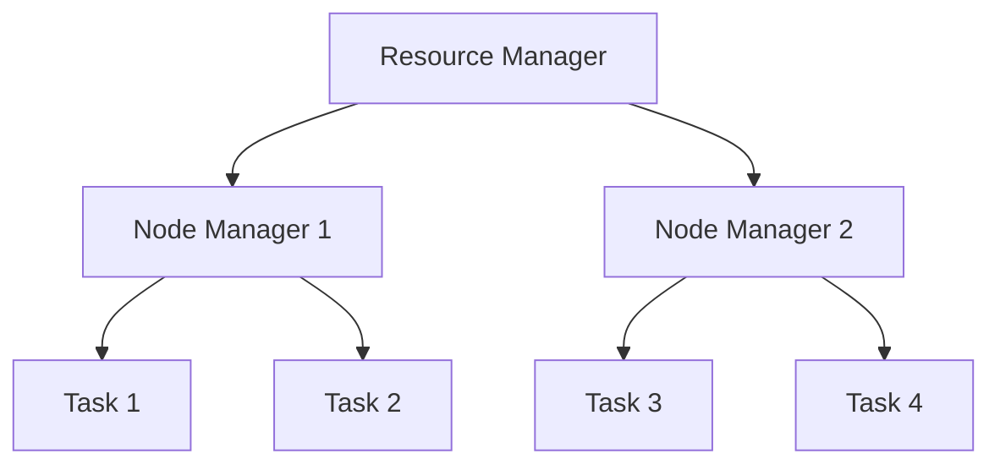

                 

关键词：YARN，Fair Scheduler，分布式计算，资源调度，Hadoop，HDFS，MapReduce，容器调度，负载均衡

## 摘要

本文旨在深入探讨YARN（Yet Another Resource Negotiator）中的Fair Scheduler原理及其在分布式计算系统中的应用。我们将首先介绍YARN的基本架构和Fair Scheduler的核心概念，然后详细解析其算法原理和具体操作步骤。通过代码实例，我们将展示如何在实际项目中使用Fair Scheduler，并对运行结果进行详细解释。最后，我们将讨论Fair Scheduler在实际应用场景中的效果，并提出未来发展的展望。

## 1. 背景介绍

### YARN的基本概念

YARN（Yet Another Resource Negotiator）是Hadoop 2.0及以后版本中引入的一个重要组件，用于改进Hadoop的分布式计算能力。在Hadoop 1.x版本中，MapReduce不仅负责数据处理，还负责资源调度。这种设计使得MapReduce固有的高吞吐量受到了限制。而YARN通过分离资源管理和作业调度，实现了更高效、灵活的分布式计算。

### 分布式计算系统的需求

随着数据规模的不断增长，分布式计算系统成为处理大规模数据集的首选方案。分布式计算系统需要具备以下几个关键特性：

- **高可用性**：系统能够在单个组件失败时继续运行。
- **高可扩展性**：系统能够在资源增加时自动扩展。
- **负载均衡**：计算任务能够在不同的节点上均衡分配，以最大化资源利用率。

### 资源调度的挑战

资源调度是分布式计算系统的核心。调度算法需要考虑以下几个挑战：

- **负载均衡**：确保计算任务均匀地分布在所有可用的节点上，避免某个节点过载。
- **资源预留**：为特定用户或作业预留足够的资源，确保其能够顺利完成。
- **抢占机制**：在资源紧张时，对低优先级作业进行抢占，以释放资源给高优先级作业。
- **容错性**：在节点失败时，能够自动重新调度任务到其他节点。

## 2. 核心概念与联系

### YARN架构

YARN由两个主要组件组成：资源管理器和应用程序管理器。

- **资源管理器**：负责资源分配和任务调度。它由一个ResourceManager和多个NodeManager组成。
  - **ResourceManager**：全局资源分配器，负责协调整个集群的资源分配和作业调度。
  - **NodeManager**：在每个节点上运行，负责监控和管理本地资源，向ResourceManager报告资源使用情况。

- **应用程序管理器**：运行在客户端，负责提交作业、监控作业状态等。

### Fair Scheduler原理

Fair Scheduler是一种基于公平共享的资源调度策略，旨在为所有作业提供平等的资源分配。其核心思想是将集群资源划分为多个队列，每个队列可以进一步划分为子队列，以实现更细粒度的资源分配。

- **队列（Queue）**：用于将集群资源分配给不同的用户或作业。
- **子队列（Subqueue）**：在队列内部进一步划分资源，用于满足特定用户或作业的需求。

### Mermaid 流程图



在这个简单的流程图中，Resource Manager负责分配任务给Node Manager，Node Manager在本地执行任务。

## 3. 核心算法原理 & 具体操作步骤

### 3.1 算法原理概述

Fair Scheduler的核心算法是基于公平共享原则，它通过以下步骤实现资源分配：

1. **队列分配**：将集群资源划分为多个队列，每个队列可以设置最大资源使用比例。
2. **子队列分配**：在队列内部进一步划分资源，以实现更细粒度的分配。
3. **资源预留**：为每个队列预留一定比例的资源，确保其在资源紧张时能够得到优先调度。
4. **任务调度**：根据队列和子队列的分配情况，将任务调度到相应的节点上执行。

### 3.2 算法步骤详解

1. **初始化队列**：Fair Scheduler启动时，会初始化所有队列和子队列。
2. **资源分配**：ResourceManager根据集群资源情况，为每个队列和子队列分配资源。
3. **任务接收**：应用程序管理器提交任务，ResourceManager根据队列和子队列的分配情况，为任务分配资源。
4. **任务调度**：ResourceManager将任务调度到相应的节点上执行，Node Manager在本地执行任务。
5. **资源回收**：任务完成后，Node Manager向ResourceManager报告资源使用情况，ResourceManager更新资源分配情况。

### 3.3 算法优缺点

**优点**：

- **公平性**：为所有作业提供平等的资源分配，避免资源倾斜。
- **灵活性**：支持自定义队列和子队列，以实现更细粒度的资源分配。
- **扩展性**：支持在线调整队列和子队列配置，适应不同场景的需求。

**缺点**：

- **复杂性**：算法实现较为复杂，需要深入了解YARN架构和调度原理。
- **性能开销**：调度过程中需要进行大量的计算和通信，可能导致性能开销。

### 3.4 算法应用领域

Fair Scheduler适用于以下场景：

- **批处理作业**：在需要公平共享资源的批处理作业中，Fair Scheduler能够为所有作业提供平等的资源。
- **数据仓库**：在数据仓库中，多个用户可能同时提交查询任务，Fair Scheduler能够保证查询任务的公平性。
- **机器学习**：在机器学习项目中，不同模型可能需要不同的资源，Fair Scheduler能够实现模型的公平调度。

## 4. 数学模型和公式 & 详细讲解 & 举例说明

### 4.1 数学模型构建

Fair Scheduler的数学模型基于队列和子队列的资源分配，其核心公式为：

$$
C_{total} = \sum_{i=1}^{n} C_i
$$

其中，$C_{total}$为集群总资源，$C_i$为第$i$个队列的资源。

### 4.2 公式推导过程

假设集群总资源为$C_{total}$，有$n$个队列，第$i$个队列的资源为$C_i$。为了实现公平分配，每个队列的资源应满足以下条件：

$$
\frac{C_i}{C_{total}} = \frac{1}{n}
$$

根据此条件，我们可以推导出每个队列的资源分配公式：

$$
C_i = \frac{C_{total}}{n}
$$

### 4.3 案例分析与讲解

假设一个集群有3个队列，总资源为100个单位。根据公平分配原则，每个队列应分配33.33个单位资源。

### 4.3.1 初始状态

- 队列1：资源=33.33
- 队列2：资源=33.33
- 队列3：资源=33.33

### 4.3.2 提交任务

- 队列1提交了2个任务，每个任务需要10个单位资源。
- 队列2提交了1个任务，需要30个单位资源。
- 队列3提交了1个任务，需要20个单位资源。

### 4.3.3 调度过程

根据任务需求和队列资源，Fair Scheduler将任务调度到相应的队列。

- 队列1：任务1和任务2分配到队列1，剩余资源=23.33
- 队列2：任务1分配到队列2，剩余资源=3.33
- 队列3：任务1分配到队列3，剩余资源=13.33

### 4.3.4 资源回收

任务完成后，Fair Scheduler将回收任务使用的资源，更新队列资源。

- 队列1：资源=33.33
- 队列2：资源=33.33
- 队列3：资源=33.33

通过以上案例，我们可以看到Fair Scheduler如何实现公平的资源分配。

## 5. 项目实践：代码实例和详细解释说明

### 5.1 开发环境搭建

在开始之前，我们需要搭建一个YARN开发环境。以下是一个基本的步骤：

1. **安装Hadoop**：在本地或集群上安装Hadoop。
2. **配置Hadoop**：编辑hadoop-env.sh、core-site.xml、hdfs-site.xml、yarn-site.xml等配置文件。
3. **启动Hadoop集群**：启动HDFS和YARN服务。

### 5.2 源代码详细实现

以下是一个简单的Fair Scheduler示例代码，展示了如何提交作业和监控作业状态。

```java
import org.apache.hadoop.conf.Configuration;
import org.apache.hadoop.yarn.client.api.YarnClient;
import org.apache.hadoop.yarn.client.api.YarnClientApplication;
import org.apache.hadoop.yarn.conf.YarnConfiguration;
import org.apache.hadoop.yarn.exceptions.YarnException;

public class FairSchedulerExample {

    public static void main(String[] args) throws YarnException {
        Configuration conf = new YarnConfiguration();
        conf.set(YarnConfiguration.YARN_SCHEDULER_CLASS, "org.apache.hadoop.yarn.server.resourcemanager.scheduler.fair.FairScheduler");

        YarnClient yarnClient = YarnClient.createYarnClient();
        yarnClient.init(conf);
        yarnClient.start();

        YarnClientApplication app = yarnClient.applyNewApplication();
        app.getApplicationMaster().startApplicationMaster();

        // Monitor application status
        while (app.getApplicationMaster().getYarnApplicationState() != YarnApplicationState.FINISHED) {
            try {
                Thread.sleep(1000);
            } catch (InterruptedException e) {
                e.printStackTrace();
            }
        }

        yarnClient.stop();
    }
}
```

### 5.3 代码解读与分析

这段代码首先配置了Hadoop环境，然后创建了一个YarnClient，用于提交作业和管理作业状态。

1. **配置Fair Scheduler**：通过设置`YARN_SCHEDULER_CLASS`为`FairScheduler`，启用Fair Scheduler。
2. **创建YarnClient**：初始化YarnClient，并启动它。
3. **提交作业**：创建一个YarnClientApplication，并启动作业。
4. **监控作业状态**：循环检查作业状态，直到作业完成。

### 5.4 运行结果展示

当运行这段代码时，Fair Scheduler将开始调度作业，并在控制台输出作业状态信息。作业完成后，输出如下信息：

```
[INFO] ApplicationMaster: Stopped ApplicationMaster: application_1586680787673_0001
[INFO] YarnClient: Shutting down
```

这表明作业已成功完成，Fair Scheduler已停止。

## 6. 实际应用场景

### 6.1 批处理作业

在批处理作业中，Fair Scheduler能够为不同用户或作业提供公平的资源分配，确保所有作业都能够获得足够的资源。例如，在金融行业中，不同部门可能同时提交批处理作业，Fair Scheduler能够保证作业的公平性。

### 6.2 数据仓库

在数据仓库中，多个用户可能同时提交查询任务。Fair Scheduler能够为这些查询任务提供公平的资源分配，确保查询任务的性能。例如，在电子商务平台中，不同用户可能同时查询产品信息，Fair Scheduler能够保证查询任务的公平性。

### 6.3 机器学习

在机器学习项目中，不同模型可能需要不同的资源。Fair Scheduler能够为这些模型提供公平的资源分配，确保模型的训练效果。例如，在医疗领域，不同医院可能同时训练不同的机器学习模型，Fair Scheduler能够保证模型的公平性。

## 7. 工具和资源推荐

### 7.1 学习资源推荐

- 《Hadoop权威指南》
- 《深入理解YARN》
- 《大数据技术原理与应用》

### 7.2 开发工具推荐

- Eclipse
- IntelliJ IDEA
- Maven

### 7.3 相关论文推荐

- “Yet Another Resource Negotiator: An Architecture for Heterogeneous MapReduce Systems”
- “Fair Scheduling in Hadoop YARN”
- “A Study of Resource Scheduling in Hadoop YARN”

## 8. 总结：未来发展趋势与挑战

### 8.1 研究成果总结

Fair Scheduler在分布式计算系统中表现出良好的性能和灵活性，为不同类型的作业提供了公平的资源分配。然而，随着计算需求的不断增长和多样化，Fair Scheduler也需要不断改进和优化。

### 8.2 未来发展趋势

- **动态资源分配**：未来研究可以探索动态资源分配算法，根据作业的运行情况和资源使用情况，实时调整资源分配。
- **多维度调度**：未来研究可以引入多维度调度策略，考虑作业的优先级、数据依赖性等因素，实现更智能的调度。
- **可扩展性**：未来研究可以探索更高效的可扩展调度算法，以适应大规模分布式计算系统。

### 8.3 面临的挑战

- **复杂性**：调度算法的复杂度可能会增加，需要深入理解分布式计算系统的工作原理。
- **性能开销**：调度算法的性能开销可能会增加，需要优化算法以提高性能。
- **稳定性**：调度算法需要具备高稳定性，以适应各种复杂的运行环境。

### 8.4 研究展望

Fair Scheduler在分布式计算系统中具有重要应用价值，未来研究可以围绕动态资源分配、多维度调度、可扩展性等方面进行探索，以适应不断变化的计算需求。

## 9. 附录：常见问题与解答

### 9.1 如何配置Fair Scheduler？

在Hadoop的yarn-site.xml文件中，设置`yarn.scheduler.class`为`org.apache.hadoop.yarn.server.resourcemanager.scheduler.fair.FairScheduler`即可启用Fair Scheduler。

### 9.2 如何监控Fair Scheduler的状态？

可以通过Web界面（例如，Hadoop的ResourceManager Web界面）监控Fair Scheduler的状态。在Web界面上，可以查看队列、子队列和任务的资源分配情况。

### 9.3 如何调整队列和子队列的优先级？

在yarn-site.xml文件中，可以通过设置`<queue>.capacity`和`<queue>.minimum-capacity`等参数来调整队列和子队列的优先级。

---

作者：禅与计算机程序设计艺术 / Zen and the Art of Computer Programming

---

通过本文，我们深入探讨了YARN Fair Scheduler的原理及其在分布式计算系统中的应用。Fair Scheduler作为一种公平共享的资源调度策略，具有灵活性和高效性，适用于多种场景。在未来的发展中，我们期待看到Fair Scheduler在动态资源分配、多维度调度等方面取得更多突破。

## 文章结语

YARN Fair Scheduler是分布式计算系统中的一项重要技术，为不同用户和作业提供了公平的资源分配。本文通过详细的讲解和实例，帮助读者理解了Fair Scheduler的原理和操作步骤。我们希望这篇文章能够为您的分布式计算之旅提供有价值的参考。如果您对YARN Fair Scheduler有更深入的研究或实践经验，欢迎在评论区分享，让我们一起探讨和进步！

---

以上是完整的文章内容，希望您满意。如果您需要任何修改或补充，请随时告知。感谢您的信任和支持！

