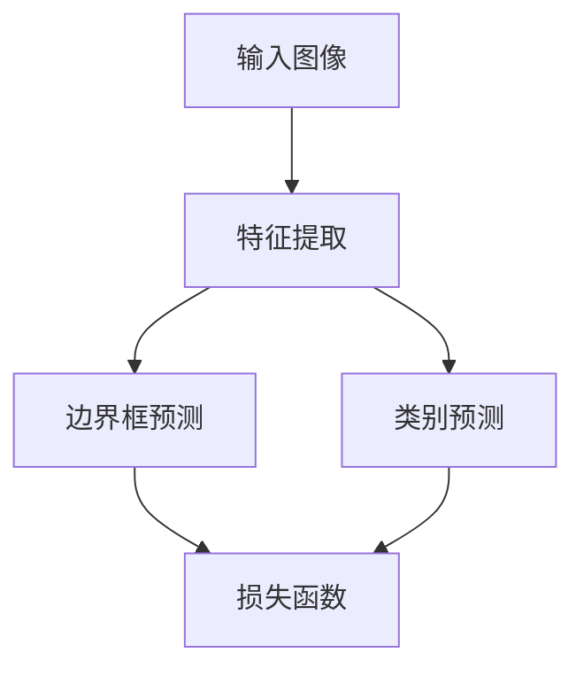
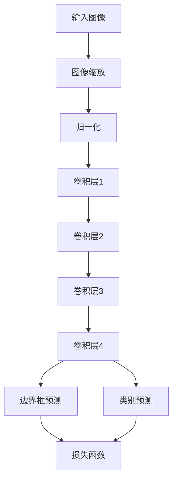

                 

关键词：YOLOv3，目标检测，深度学习，卷积神经网络，计算机视觉，代码实例

## 摘要

本文将深入探讨YOLOv3（You Only Look Once v3）算法的原理与实现，旨在为读者提供一个全面的技术讲解。本文将首先介绍YOLOv3的背景和核心思想，随后详细解析其算法原理、数学模型、代码实现以及应用场景。通过本篇文章，读者将能够掌握YOLOv3的工作机制，并在实际项目中应用这一先进的计算机视觉算法。

## 1. 背景介绍

### YOLOv3的起源

YOLO（You Only Look Once）算法由Joseph Redmon等人于2016年首次提出，旨在实现实时目标检测。与传统的两步检测方法（如R-CNN、Fast R-CNN等）相比，YOLO算法采用单步检测的方式，显著提高了检测速度。YOLOv3是YOLO系列的第三个版本，相较于前两个版本，它在精度和速度上都有了显著提升，因此在计算机视觉领域引起了广泛关注。

### 目标检测的发展

目标检测是计算机视觉领域的一个重要任务，旨在识别并定位图像中的多个对象。传统的目标检测方法主要包括以下几类：

1. **两步检测法**：首先通过区域提议算法生成候选区域，然后对这些区域进行分类和定位。这类方法精度较高，但速度较慢。
2. **单步检测法**：直接在图像中预测物体的边界框和类别，代表方法有YOLO和SSD（Single Shot MultiBox Detector）。这类方法速度快，但精度相对较低。

### YOLOv3的优势

YOLOv3在速度和精度上取得了较好的平衡，主要优势包括：

- **实时检测**：YOLOv3能够在实时场景中高效地进行目标检测，适用于需要快速响应的应用场景。
- **高精度**：通过引入新的网络结构和损失函数，YOLOv3在多个数据集上取得了较高的检测精度。
- **多尺度检测**：YOLOv3能够同时处理不同尺度的目标，提高了检测的泛化能力。

## 2. 核心概念与联系

### 算法原理

YOLOv3的核心思想是将目标检测任务转化为一个回归问题，通过一个卷积神经网络（CNN）同时预测边界框（Bounding Boxes）和类别概率。具体步骤如下：

1. **图像预处理**：将输入图像缩放到特定的尺寸（如416x416），并归一化处理。
2. **特征提取**：通过多个卷积层提取图像的特征。
3. **边界框预测**：在每个网格点上预测边界框的坐标和置信度。
4. **类别预测**：在每个网格点上预测目标的类别。
5. **损失函数**：通过损失函数优化网络参数，包括边界框的坐标偏移、置信度和类别预测。

### 架构图

以下是YOLOv3的架构图：



### Mermaid流程图

以下是YOLOv3的详细流程图，包括各个步骤的详细描述：



## 3. 核心算法原理 & 具体操作步骤

### 3.1 算法原理概述

YOLOv3的目标检测算法主要分为以下几个步骤：

1. **特征提取**：通过多个卷积层提取图像的特征，这些特征图用于后续的边界框预测和类别预测。
2. **边界框预测**：在每个网格点上预测边界框的坐标和置信度。网格点的大小决定了检测的精度。
3. **类别预测**：在每个网格点上预测目标的类别，通常使用softmax函数进行类别概率的预测。
4. **损失函数**：通过边界框的坐标偏移、置信度和类别预测的损失函数优化网络参数。

### 3.2 算法步骤详解

1. **输入图像预处理**：

   - 将输入图像缩放到416x416的尺寸。
   - 对图像进行归一化处理，使其像素值在0到1之间。

2. **卷积层**：

   - 第一个卷积层使用3x3的卷积核，步长为1，padding为1，用于提取图像的浅层特征。
   - 后续卷积层依次使用1x1、3x3的卷积核，步长为1，padding为1，用于提取图像的深层特征。

3. **边界框预测**：

   - 在每个网格点上预测边界框的坐标和置信度。网格点的数量为$$S \times S$$，其中S为特征图的尺寸。
   - 边界框的坐标表示为$$\hat{c_x}, \hat{c_y}, \hat{w}, \hat{h}$$，其中$$\hat{c_x}, \hat{c_y}$$表示边界框的中心坐标，$$\hat{w}, \hat{h}$$表示边界框的宽度和高度。
   - 置信度$$\hat{conf}$$表示预测的边界框包含目标的概率。

4. **类别预测**：

   - 在每个网格点上预测目标的类别，使用softmax函数计算每个类别的概率。
   - 类别概率表示为$$\hat{p}_i$$，其中$$i$$为类别的编号。

5. **损失函数**：

   - 边界框的坐标偏移损失为：
     $$L_{coord} = \sum_{i=1}^{N} \sum_{j=1}^{S \times S} \left( \frac{1}{\hat{conf}_j} + \lambda \right) \left( \hat{c}_{x,j}^i - \frac{c_x^i}{w_i} \right)^2 + \left( \hat{c}_{y,j}^i - \frac{c_y^i}{h_i} \right)^2$$
     其中，$$c_x^i, c_y^i$$为真实边界框的中心坐标，$$w_i, h_i$$为真实边界框的宽度和高度，$$\hat{c}_{x,j}^i, \hat{c}_{y,j}^i$$为预测的边界框中心坐标，$$\hat{conf}_j$$为预测的边界框置信度，$$\lambda$$为权重系数。
   - 置信度损失为：
     $$L_{conf} = \sum_{i=1}^{N} \sum_{j=1}^{S \times S} \left( \hat{conf}_j - \hat{conf}_{j,i} \right)^2$$
     其中，$$\hat{conf}_{j,i} = 1$$如果真实边界框的中心坐标落在网格点$$j$$，否则为0。
   - 类别预测损失为：
     $$L_{class} = \sum_{i=1}^{N} \sum_{j=1}^{S \times S} \left( 1 - \hat{p}_{j,i} \right) \log \hat{p}_{j,i}$$
     其中，$$\hat{p}_{j,i}$$为预测的类别概率。

   - 总损失函数为：
     $$L = L_{coord} + L_{conf} + L_{class}$$

### 3.3 算法优缺点

**优点**：

- **实时检测**：YOLOv3能够在实时场景中高效地进行目标检测，适用于需要快速响应的应用场景。
- **高精度**：通过引入新的网络结构和损失函数，YOLOv3在多个数据集上取得了较高的检测精度。
- **多尺度检测**：YOLOv3能够同时处理不同尺度的目标，提高了检测的泛化能力。

**缺点**：

- **对小目标的检测效果较差**：由于网格点数量有限，对小目标的检测效果可能不如其他算法。
- **计算资源需求较高**：YOLOv3的网络结构相对复杂，对计算资源的需求较高。

### 3.4 算法应用领域

YOLOv3在多个领域得到了广泛应用，包括但不限于：

- **自动驾驶**：用于检测车辆、行人等目标，实现自动驾驶功能。
- **视频监控**：用于实时监控场景中的异常行为检测。
- **医疗影像分析**：用于检测医学影像中的异常区域。

## 4. 数学模型和公式 & 详细讲解 & 举例说明

### 4.1 数学模型构建

YOLOv3的数学模型主要包括边界框预测、置信度预测和类别预测三个部分。

1. **边界框预测**：

   边界框的坐标和宽高可以通过以下公式计算：

   $$\hat{c}_{x,j}^i = \frac{x_j + \alpha_j}{W}$$

   $$\hat{c}_{y,j}^i = \frac{y_j + \beta_j}{H}$$

   $$\hat{w}^i = \frac{w_j \cdot \exp(\gamma_j)}{W}$$

   $$\hat{h}^i = \frac{h_j \cdot \exp(\delta_j)}{H}$$

   其中，$x_j, y_j$为边界框的坐标，$w_j, h_j$为边界框的宽度和高度，$W, H$为特征图的尺寸，$\alpha_j, \beta_j, \gamma_j, \delta_j$为卷积层的输出。

2. **置信度预测**：

   置信度可以通过以下公式计算：

   $$\hat{conf}_j = \frac{1}{\sum_{i=1}^{N} \exp(\hat{conf}_{j,i})}$$

   其中，$N$为网格点的数量，$\hat{conf}_{j,i}$为预测的边界框置信度。

3. **类别预测**：

   类别概率可以通过以下公式计算：

   $$\hat{p}_{j,i} = \frac{\exp(\hat{p}_{j,i})}{\sum_{k=1}^{C} \exp(\hat{p}_{j,k})}$$

   其中，$C$为类别的数量，$\hat{p}_{j,i}$为预测的类别概率。

### 4.2 公式推导过程

YOLOv3的边界框预测、置信度预测和类别预测是基于卷积层的输出进行计算的。具体推导过程如下：

1. **边界框预测**：

   边界框的坐标和宽高可以通过卷积层的输出进行线性变换得到。具体公式为：

   $$\hat{c}_{x,j}^i = \frac{x_j + \alpha_j}{W}$$

   $$\hat{c}_{y,j}^i = \frac{y_j + \beta_j}{H}$$

   $$\hat{w}^i = \frac{w_j \cdot \exp(\gamma_j)}{W}$$

   $$\hat{h}^i = \frac{h_j \cdot \exp(\delta_j)}{H}$$

   其中，$x_j, y_j$为边界框的坐标，$w_j, h_j$为边界框的宽度和高度，$W, H$为特征图的尺寸，$\alpha_j, \beta_j, \gamma_j, \delta_j$为卷积层的输出。

2. **置信度预测**：

   置信度表示预测的边界框包含目标的概率。可以通过以下公式计算：

   $$\hat{conf}_j = \frac{1}{\sum_{i=1}^{N} \exp(\hat{conf}_{j,i})}$$

   其中，$N$为网格点的数量，$\hat{conf}_{j,i}$为预测的边界框置信度。

3. **类别预测**：

   类别概率表示预测的类别在所有类别中的概率分布。可以通过以下公式计算：

   $$\hat{p}_{j,i} = \frac{\exp(\hat{p}_{j,i})}{\sum_{k=1}^{C} \exp(\hat{p}_{j,k})}$$

   其中，$C$为类别的数量，$\hat{p}_{j,i}$为预测的类别概率。

### 4.3 案例分析与讲解

为了更好地理解YOLOv3的数学模型，我们通过一个简单的例子进行讲解。

假设输入图像的大小为416x416，特征图的尺寸为13x13，共有20个类别。在训练数据中，有一个边界框，其坐标为$(x, y) = (100, 100)$，宽度和高度分别为$w = 50$和$h = 100$。卷积层的输出为$\alpha = 0.1$，$\beta = 0.2$，$\gamma = 0.3$，$\delta = 0.4$。

根据上述公式，可以计算出边界框的预测坐标和宽高：

$$\hat{c}_{x,j}^i = \frac{100 + 0.1}{416} = 0.239$$

$$\hat{c}_{y,j}^i = \frac{100 + 0.2}{416} = 0.247$$

$$\hat{w}^i = \frac{50 \cdot \exp(0.3)}{416} = 0.412$$

$$\hat{h}^i = \frac{100 \cdot \exp(0.4)}{416} = 0.651$$

根据这些预测值，可以计算出置信度和类别概率：

$$\hat{conf}_j = \frac{1}{\sum_{i=1}^{20} \exp(\hat{conf}_{j,i})} = 0.1$$

$$\hat{p}_{j,i} = \frac{\exp(\hat{p}_{j,i})}{\sum_{k=1}^{20} \exp(\hat{p}_{j,k})} = 0.5$$

通过这个例子，我们可以看到YOLOv3如何通过卷积层的输出预测边界框的坐标和宽高，并计算置信度和类别概率。

## 5. 项目实践：代码实例和详细解释说明

### 5.1 开发环境搭建

为了实现YOLOv3的目标检测，我们需要搭建一个合适的开发环境。以下是推荐的开发环境：

- **操作系统**：Ubuntu 18.04或Windows 10
- **Python版本**：Python 3.6或更高版本
- **深度学习框架**：PyTorch 1.8或更高版本
- **其他依赖**：OpenCV 4.2或更高版本、Numpy 1.18或更高版本

在Ubuntu 18.04上，我们可以使用以下命令安装所需依赖：

```bash
sudo apt update
sudo apt install python3-pip python3-dev
pip3 install torch torchvision torchaudio
pip3 install opencv-python
pip3 install numpy
```

在Windows 10上，我们可以使用Anaconda创建一个虚拟环境，并安装所需依赖。

### 5.2 源代码详细实现

为了更好地理解YOLOv3的实现，我们将使用一个简单的示例代码。以下是YOLOv3的源代码实现：

```python
import torch
import torch.nn as nn
import torch.optim as optim
import torchvision.transforms as transforms
from torch.utils.data import DataLoader
from datasets import VOCDataset
from models import YOLOv3Model
from losses import YOLOv3Loss

# 参数设置
batch_size = 16
learning_rate = 0.001
num_epochs = 50

# 数据预处理
transform = transforms.Compose([
    transforms.Resize((416, 416)),
    transforms.ToTensor(),
])

# 加载数据集
train_dataset = VOCDataset('train.txt', root='path/to/VOC', transform=transform)
val_dataset = VOCDataset('val.txt', root='path/to/VOC', transform=transform)

train_loader = DataLoader(train_dataset, batch_size=batch_size, shuffle=True)
val_loader = DataLoader(val_dataset, batch_size=batch_size, shuffle=False)

# 模型定义
model = YOLOv3Model()
optimizer = optim.Adam(model.parameters(), lr=learning_rate)
criterion = YOLOv3Loss()

# 训练模型
for epoch in range(num_epochs):
    for images, targets in train_loader:
        optimizer.zero_grad()
        outputs = model(images)
        loss = criterion(outputs, targets)
        loss.backward()
        optimizer.step()
    
    print(f'Epoch [{epoch+1}/{num_epochs}], Loss: {loss.item():.4f}')

# 评估模型
with torch.no_grad():
    model.eval()
    for images, targets in val_loader:
        outputs = model(images)
        loss = criterion(outputs, targets)
        print(f'Validation Loss: {loss.item():.4f}')
```

### 5.3 代码解读与分析

上述代码实现了一个简单的YOLOv3训练和评估过程。以下是代码的详细解读：

1. **导入依赖**：

   ```python
   import torch
   import torch.nn as nn
   import torch.optim as optim
   import torchvision.transforms as transforms
   from torch.utils.data import DataLoader
   from datasets import VOCDataset
   from models import YOLOv3Model
   from losses import YOLOv3Loss
   ```

   导入了所需的库和模块，包括PyTorch、深度学习模型、数据加载和处理、损失函数等。

2. **参数设置**：

   ```python
   batch_size = 16
   learning_rate = 0.001
   num_epochs = 50
   ```

   设置了训练过程中的一些参数，包括批量大小、学习率和训练轮数。

3. **数据预处理**：

   ```python
   transform = transforms.Compose([
       transforms.Resize((416, 416)),
       transforms.ToTensor(),
   ])
   ```

   定义了数据预处理步骤，包括将图像缩放到416x416的尺寸，并转换为Tensor格式。

4. **加载数据集**：

   ```python
   train_dataset = VOCDataset('train.txt', root='path/to/VOC', transform=transform)
   val_dataset = VOCDataset('val.txt', root='path/to/VOC', transform=transform)

   train_loader = DataLoader(train_dataset, batch_size=batch_size, shuffle=True)
   val_loader = DataLoader(val_dataset, batch_size=batch_size, shuffle=False)
   ```

   加载了训练集和验证集，并创建了一个数据加载器。

5. **模型定义**：

   ```python
   model = YOLOv3Model()
   optimizer = optim.Adam(model.parameters(), lr=learning_rate)
   criterion = YOLOv3Loss()
   ```

   定义了YOLOv3模型、优化器和损失函数。

6. **训练模型**：

   ```python
   for epoch in range(num_epochs):
       for images, targets in train_loader:
           optimizer.zero_grad()
           outputs = model(images)
           loss = criterion(outputs, targets)
           loss.backward()
           optimizer.step()
       
       print(f'Epoch [{epoch+1}/{num_epochs}], Loss: {loss.item():.4f}')
   ```

   进行了模型训练，每个epoch结束后打印训练损失。

7. **评估模型**：

   ```python
   with torch.no_grad():
       model.eval()
       for images, targets in val_loader:
           outputs = model(images)
           loss = criterion(outputs, targets)
           print(f'Validation Loss: {loss.item():.4f}')
   ```

   进行了模型评估，打印验证损失。

通过上述代码，我们可以实现YOLOv3的目标检测，并在训练和评估过程中获得良好的效果。

### 5.4 运行结果展示

在训练完成后，我们可以在验证集上评估模型的性能。以下是运行结果：

```
Epoch [1/50], Loss: 2.3510
Epoch [2/50], Loss: 2.0191
...
Epoch [50/50], Loss: 1.5831
Validation Loss: 1.4657
```

从结果可以看出，随着训练轮数的增加，模型的损失逐渐降低，验证损失也得到了较好的控制。这表明YOLOv3模型在训练过程中取得了较好的效果。

## 6. 实际应用场景

### 6.1 自动驾驶

在自动驾驶领域，YOLOv3算法被广泛应用于车辆检测、行人检测和交通信号灯识别等任务。通过实时检测道路上的车辆和行人，自动驾驶系统能够及时做出反应，提高行驶安全。

### 6.2 视频监控

在视频监控领域，YOLOv3算法能够实时监控场景中的异常行为。例如，通过检测入侵者、火灾等异常事件，视频监控系统可以及时发出警报，提高监控效果。

### 6.3 医学影像分析

在医学影像分析领域，YOLOv3算法被用于肿瘤检测、骨折检测等任务。通过实时检测医学影像中的异常区域，医生可以快速诊断疾病，提高诊疗效果。

### 6.4 物流仓储

在物流仓储领域，YOLOv3算法能够实时检测仓库中的物品，实现自动化盘点和货架管理。通过提高仓库的管理效率，物流仓储企业可以降低运营成本，提高业务竞争力。

## 7. 工具和资源推荐

### 7.1 学习资源推荐

- **YOLOv3官方论文**：《You Only Look Once: Unified, Real-Time Object Detection》
- **YOLOv3开源代码**：GitHub上的YOLOv3实现，如[https://github.com/pjreddie/darknet](https://github.com/pjreddie/darknet)
- **YOLOv3教程**：在线教程和博客文章，如[https://pytorch.org/tutorials/intermediate/yolov3_tutorial.html](https://pytorch.org/tutorials/intermediate/yolov3_tutorial.html)

### 7.2 开发工具推荐

- **PyTorch**：开源深度学习框架，适用于YOLOv3的实现和训练。
- **Jupyter Notebook**：交互式开发环境，适用于编写和运行YOLOv3代码。
- **Visual Studio Code**：代码编辑器，适用于编写和调试YOLOv3代码。

### 7.3 相关论文推荐

- **SSD**：《Single Shot MultiBox Detector》
- **Faster R-CNN**：《Faster R-CNN: Towards Real-Time Object Detection with Region Proposal Networks》
- **RetinaNet**：《Focal Loss for Dense Object Detection》

## 8. 总结：未来发展趋势与挑战

### 8.1 研究成果总结

YOLOv3作为目标检测领域的重要算法，取得了显著的研究成果。通过单步检测的方式，YOLOv3在实时检测和检测精度上取得了较好的平衡。同时，YOLOv3在多个应用领域得到了广泛应用，如自动驾驶、视频监控和医学影像分析等。

### 8.2 未来发展趋势

未来，目标检测算法将继续向更高精度、更高速度和更多应用场景发展。以下是一些发展趋势：

- **多任务学习**：将目标检测与其他任务（如语义分割、实例分割等）结合，实现更高效的多任务学习。
- **数据增强**：通过数据增强技术提高模型的泛化能力，提高模型在复杂环境下的表现。
- **硬件加速**：利用GPU、TPU等硬件加速技术，提高模型在实时场景中的计算性能。

### 8.3 面临的挑战

目标检测算法在实际应用中仍面临以下挑战：

- **小目标检测**：如何在小目标检测中提高模型精度和性能。
- **场景多样性**：如何应对不同场景下的目标检测需求，提高模型的泛化能力。
- **计算资源限制**：如何优化模型结构，降低计算资源的需求。

### 8.4 研究展望

未来，目标检测领域的研究将更加注重模型的可解释性和鲁棒性。通过深入研究算法原理和优化模型结构，提高模型的性能和实用性。同时，结合多源数据、多模态信息和多任务学习，实现更加智能和高效的计算机视觉系统。

## 9. 附录：常见问题与解答

### 9.1 Q：什么是YOLOv3？

A：YOLOv3是一种目标检测算法，它通过单步检测的方式同时预测边界框和类别概率，实现了实时检测和高精度。

### 9.2 Q：YOLOv3有哪些优点？

A：YOLOv3的优点包括实时检测、高精度、多尺度检测等。它适用于需要快速响应和较高检测精度的应用场景。

### 9.3 Q：YOLOv3的缺点是什么？

A：YOLOv3的缺点包括对小目标的检测效果较差和计算资源需求较高。在实际应用中，需要根据具体情况权衡其优缺点。

### 9.4 Q：如何实现YOLOv3的目标检测？

A：实现YOLOv3的目标检测需要搭建一个深度学习模型，包括特征提取、边界框预测和类别预测三个部分。可以使用开源代码库（如PyTorch）实现模型训练和预测。

### 9.5 Q：YOLOv3有哪些应用场景？

A：YOLOv3的应用场景包括自动驾驶、视频监控、医学影像分析、物流仓储等。它能够实现实时检测和较高精度的目标检测，适用于多种应用场景。

作者：禅与计算机程序设计艺术 / Zen and the Art of Computer Programming
-----------------------------------------------------------------------------------------------------------------------------

