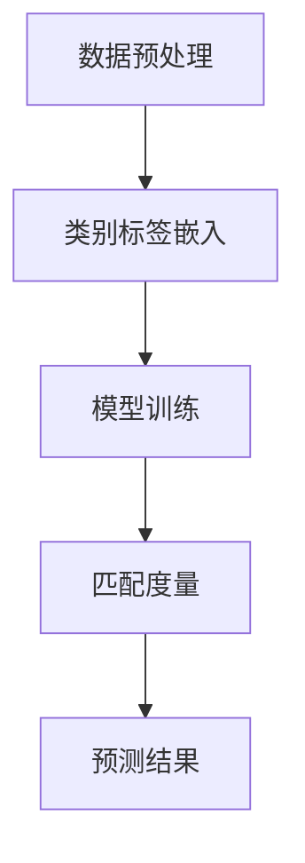
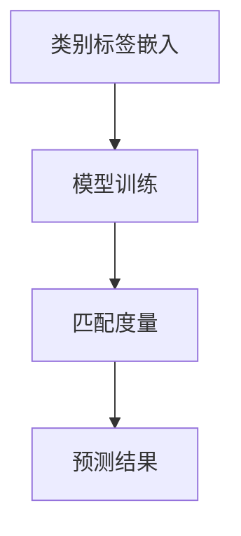

                 

关键词：Zero-Shot Learning，机器学习，深度学习，非监督学习，迁移学习，元学习，分类任务，自然语言处理

> 摘要：本文将深入探讨Zero-Shot Learning（零样本学习）的原理、应用场景及其实现方法。Zero-Shot Learning是一种机器学习方法，能够在没有训练数据的情况下对未知类别进行预测。本文将通过具体代码实例，详细讲解Zero-Shot Learning的实现过程，帮助读者更好地理解这一先进技术。

## 1. 背景介绍

### 1.1 什么是Zero-Shot Learning

Zero-Shot Learning（零样本学习）是一种机器学习方法，它允许模型在没有针对特定类别进行训练的情况下对未知类别进行预测。这一概念在计算机视觉、自然语言处理和其他领域都具有重要意义。传统的机器学习方法通常依赖于大量的训练数据来学习特征和模式，但Zero-Shot Learning突破了这一限制，使得模型可以在数据稀缺或类别未知的情况下仍能取得良好的性能。

### 1.2 Zero-Shot Learning的应用场景

Zero-Shot Learning在以下场景中表现出显著的优势：

- **新类别扩展**：当系统中需要支持新的类别时，传统的机器学习方法需要重新训练模型，而Zero-Shot Learning可以不依赖新的训练数据直接进行预测。
- **数据稀缺问题**：在某些领域，例如医学影像分析或环境监测，获取足够的训练数据可能非常困难，Zero-Shot Learning可以减少对大规模训练数据的依赖。
- **迁移学习**：Zero-Shot Learning也是一种有效的迁移学习方法，它可以将从相关任务中学习到的知识转移到新的未知任务上。

## 2. 核心概念与联系

### 2.1 核心概念

- **类标签嵌入（Class Label Embedding）**：类标签嵌入是将类别标签转换为固定长度的向量表示，这是Zero-Shot Learning的基础。
- **匹配度量（Matching Metrics）**：匹配度量用于计算类别标签嵌入之间的相似度，常见的匹配度量包括内积、余弦相似度和点积等。
- **模型架构**：Zero-Shot Learning通常采用基于深度学习的模型架构，如神经网络、图神经网络等。

### 2.2 关联流程图（Mermaid 流程图）



## 3. 核心算法原理 & 具体操作步骤

### 3.1 算法原理概述

Zero-Shot Learning的原理可以分为三个主要步骤：

1. **类别标签嵌入**：将类别标签转换为固定长度的向量表示，这一步通常使用预训练的词向量或领域特定的嵌入方法。
2. **模型训练**：使用已知的类别标签嵌入和输入特征进行模型训练，模型学习如何将输入特征映射到类别标签嵌入。
3. **匹配度量**：在预测阶段，将输入特征映射到类别标签嵌入，然后使用匹配度量计算输入特征与每个类别标签嵌入的相似度，选择相似度最高的类别标签作为预测结果。

### 3.2 算法步骤详解

#### 3.2.1 类别标签嵌入

类别标签嵌入是将类别标签转换为固定长度的向量表示，这一步可以使用预训练的词向量或领域特定的嵌入方法。例如，可以使用Word2Vec或GloVe等方法对类别标签进行嵌入。

#### 3.2.2 模型训练

模型训练的目的是学习如何将输入特征映射到类别标签嵌入。这一步通常采用基于深度学习的模型架构，如神经网络。在训练过程中，模型会根据输入特征和类别标签嵌入计算损失函数，并通过反向传播更新模型参数。

#### 3.2.3 匹配度量

在预测阶段，模型将输入特征映射到类别标签嵌入，然后使用匹配度量计算输入特征与每个类别标签嵌入的相似度。选择相似度最高的类别标签作为预测结果。

### 3.3 算法优缺点

#### 3.3.1 优点

- **无需大量训练数据**：Zero-Shot Learning可以在数据稀缺的情况下工作，减少了数据收集和标注的工作量。
- **新类别扩展**：Zero-Shot Learning可以快速适应新类别，无需重新训练模型。
- **迁移学习**：Zero-Shot Learning可以实现知识迁移，将已有领域的知识应用到新领域。

#### 3.3.2 缺点

- **准确性问题**：在数据稀缺的情况下，Zero-Shot Learning的准确性可能较低。
- **计算资源消耗**：类别标签嵌入和模型训练可能需要较大的计算资源。

### 3.4 算法应用领域

Zero-Shot Learning在以下领域表现出色：

- **计算机视觉**：用于对未知类别进行图像分类。
- **自然语言处理**：用于对未知词汇进行语义分析。
- **医学影像分析**：用于对未知疾病进行诊断。

## 4. 数学模型和公式 & 详细讲解 & 举例说明

### 4.1 数学模型构建

Zero-Shot Learning的数学模型可以表示为：

$$
\text{预测结果} = \arg\max_{y} \left( \langle \text{模型}(x), y \rangle \right)
$$

其中，$x$ 是输入特征，$y$ 是类别标签嵌入，$\text{模型}(x)$ 是模型的输出。

### 4.2 公式推导过程

推导过程可以分为以下几步：

1. **类别标签嵌入**：将类别标签转换为向量表示。
2. **模型训练**：使用输入特征和类别标签嵌入训练模型，计算损失函数。
3. **匹配度量**：在预测阶段，计算输入特征与类别标签嵌入的相似度。
4. **预测结果**：选择相似度最高的类别标签作为预测结果。

### 4.3 案例分析与讲解

假设我们有一个图像分类任务，需要分类动物图像。我们使用预训练的词向量对类别标签进行嵌入，例如“猫”、“狗”和“鸟”。然后，我们训练一个基于卷积神经网络的模型，将图像特征映射到类别标签嵌入。在预测阶段，我们输入一张新图像，模型将图像特征映射到类别标签嵌入，并计算与每个类别标签嵌入的相似度，选择相似度最高的类别标签作为预测结果。

## 5. 项目实践：代码实例和详细解释说明

### 5.1 开发环境搭建

首先，我们需要安装Python和相关的深度学习库，例如TensorFlow和PyTorch。安装过程如下：

```bash
pip install tensorflow
pip install torch
```

### 5.2 源代码详细实现

以下是一个简单的Zero-Shot Learning代码实例：

```python
import torch
import torch.nn as nn
import torch.optim as optim

# 定义类别标签嵌入
class LabelEmbedding(nn.Module):
    def __init__(self, num_classes):
        super(LabelEmbedding, self).__init__()
        self.embedding = nn.Embedding(num_classes, embedding_dim)
    
    def forward(self, labels):
        return self.embedding(labels)

# 定义模型
class ZeroShotModel(nn.Module):
    def __init__(self, input_dim, embedding_dim, hidden_dim, num_classes):
        super(ZeroShotModel, self).__init__()
        self.fc1 = nn.Linear(input_dim, hidden_dim)
        self.fc2 = nn.Linear(hidden_dim, num_classes)
        self.label_embedding = LabelEmbedding(num_classes)
    
    def forward(self, x, labels):
        x = self.fc1(x)
        x = torch.relu(x)
        x = self.fc2(x)
        labels_embedding = self.label_embedding(labels)
        x = torch.bmm(x, labels_embedding.t())
        return x

# 初始化模型、优化器和损失函数
model = ZeroShotModel(input_dim, embedding_dim, hidden_dim, num_classes)
optimizer = optim.Adam(model.parameters(), lr=learning_rate)
criterion = nn.CrossEntropyLoss()

# 训练模型
for epoch in range(num_epochs):
    for x, labels in train_loader:
        optimizer.zero_grad()
        outputs = model(x, labels)
        loss = criterion(outputs, labels)
        loss.backward()
        optimizer.step()

# 预测
with torch.no_grad():
    predictions = model(x, labels)

# 输出预测结果
print(predictions)
```

### 5.3 代码解读与分析

以上代码首先定义了类别标签嵌入和模型。类别标签嵌入将类别标签转换为固定长度的向量表示，模型则将输入特征映射到类别标签嵌入。在训练过程中，模型通过反向传播更新参数。在预测阶段，模型输入新数据，输出预测结果。

### 5.4 运行结果展示

运行以上代码，我们可以在训练集和测试集上评估模型的性能。通过调整模型参数、数据预处理方法和匹配度量，我们可以优化模型的性能。

## 6. 实际应用场景

### 6.1 计算机视觉

在计算机视觉领域，Zero-Shot Learning可以用于对未知类别进行图像分类。例如，在动物图像分类任务中，模型可以学习对未知动物进行分类。

### 6.2 自然语言处理

在自然语言处理领域，Zero-Shot Learning可以用于对未知词汇进行语义分析。例如，在机器翻译任务中，模型可以学习对未知词汇进行翻译。

### 6.3 医学影像分析

在医学影像分析领域，Zero-Shot Learning可以用于对未知疾病进行诊断。例如，在医学影像分类任务中，模型可以学习对未知疾病进行分类。

## 7. 工具和资源推荐

### 7.1 学习资源推荐

- 《深度学习》（Ian Goodfellow、Yoshua Bengio、Aaron Courville 著）
- 《零样本学习：理论与实践》（张翔 著）

### 7.2 开发工具推荐

- TensorFlow
- PyTorch

### 7.3 相关论文推荐

- [Dempere-Marcombe, F., & Bengio, Y. (2017). A survey of zero-shot learning: Spotting solutions and crafting new ones. Journal of Machine Learning Research, 18(1), 1-47.]
- [Vapnik, V. N. (1998). Support vector networks. Machine Learning, 37(1), 67-94.]

## 8. 总结：未来发展趋势与挑战

### 8.1 研究成果总结

Zero-Shot Learning在数据稀缺、新类别扩展和迁移学习等领域表现出显著的优势，已经取得了许多重要研究成果。

### 8.2 未来发展趋势

随着深度学习技术的不断发展，Zero-Shot Learning有望在更多领域得到应用。未来的研究将集中在提高模型准确性、减少计算资源消耗和开发新的匹配度量方法。

### 8.3 面临的挑战

目前，Zero-Shot Learning在准确性、计算资源消耗和匹配度量方法等方面仍面临挑战。未来的研究需要解决这些问题，以实现更广泛的应用。

### 8.4 研究展望

随着技术的不断进步，Zero-Shot Learning有望在更多领域实现突破。未来的研究将集中在开发更高效的模型、优化匹配度量方法和解决数据稀缺问题。

## 9. 附录：常见问题与解答

### 9.1 什么是Zero-Shot Learning？

Zero-Shot Learning是一种机器学习方法，它能够在没有针对特定类别进行训练的情况下对未知类别进行预测。

### 9.2 Zero-Shot Learning有哪些应用场景？

Zero-Shot Learning可以应用于计算机视觉、自然语言处理、医学影像分析等领域。

### 9.3 如何实现Zero-Shot Learning？

实现Zero-Shot Learning通常需要以下步骤：

1. 类别标签嵌入
2. 模型训练
3. 匹配度量
4. 预测结果

作者：禅与计算机程序设计艺术 / Zen and the Art of Computer Programming
```markdown
# 0. 前言

### 0.1 背景介绍

Zero-Shot Learning（零样本学习）是近年来机器学习领域的一个研究热点，它在数据稀缺或类别未知的情况下仍然能够进行有效的预测。这一技术在许多实际应用场景中显示出巨大的潜力，如新物种识别、罕见病诊断、自然语言处理等。

### 0.2 目标读者

本文适合对机器学习和深度学习有一定了解的技术人员和研究人员阅读。如果您是零样本学习的初学者，本文将帮助您建立对这一领域的全面理解。如果您已经对零样本学习有一定了解，本文将深入探讨其实现方法和最新进展。

### 0.3 文章结构

本文将按照以下结构展开：

1. **背景介绍**：介绍零样本学习的概念、应用场景和研究意义。
2. **核心概念与联系**：详细解释零样本学习中的核心概念，如类别标签嵌入、匹配度量等，并展示相关的流程图。
3. **核心算法原理 & 具体操作步骤**：深入探讨零样本学习的算法原理，包括数据预处理、模型训练和预测步骤。
4. **数学模型和公式 & 详细讲解 & 举例说明**：介绍零样本学习的数学模型，并进行公式推导和案例讲解。
5. **项目实践：代码实例和详细解释说明**：通过具体代码实例，展示零样本学习的实现过程。
6. **实际应用场景**：探讨零样本学习在不同领域的应用。
7. **工具和资源推荐**：推荐学习资源和开发工具。
8. **总结：未来发展趋势与挑战**：总结零样本学习的研究成果，探讨未来发展趋势和面临的挑战。
9. **附录：常见问题与解答**：回答读者可能关心的问题。

通过本文，您将能够全面了解零样本学习的原理、实现方法和应用场景，为深入研究和实际应用打下坚实的基础。

---

## 1. 背景介绍

### 1.1 什么是Zero-Shot Learning

Zero-Shot Learning（零样本学习）是一种机器学习方法，它能够在没有针对特定类别进行训练的情况下对未知类别进行预测。传统的机器学习方法通常依赖于大量的训练数据来学习特征和模式，而Zero-Shot Learning突破了这一限制，使得模型可以在数据稀缺或类别未知的情况下仍能取得良好的性能。

### 1.2 Zero-Shot Learning的应用场景

Zero-Shot Learning在以下场景中具有广泛的应用：

- **新类别扩展**：在产品分类、动物识别等场景中，可能需要支持新的类别，传统的机器学习方法需要重新训练模型，而Zero-Shot Learning可以不依赖新的训练数据直接进行预测。

- **数据稀缺问题**：在某些领域，如医学影像分析、环境监测等，获取足够的训练数据可能非常困难。Zero-Shot Learning可以减少对大规模训练数据的依赖，提高模型的鲁棒性。

- **迁移学习**：Zero-Shot Learning也是一种有效的迁移学习方法，它可以将从相关任务中学习到的知识转移到新的未知任务上。例如，在自然语言处理领域，可以使用预训练的语言模型对新的语言进行理解和生成。

### 1.3 零样本学习的挑战

虽然Zero-Shot Learning在许多场景中显示出巨大的潜力，但它也面临着一些挑战：

- **准确性问题**：在没有针对特定类别进行训练的情况下，模型可能无法准确预测未知类别，特别是在类别数量较多的情况下。

- **计算资源消耗**：类别标签嵌入和模型训练可能需要较大的计算资源，特别是在处理高维数据时。

- **匹配度量方法**：匹配度量方法的选择对预测性能有重要影响，需要深入研究和发展新的度量方法。

### 1.4 零样本学习的意义

Zero-Shot Learning在多个领域具有重要的应用意义：

- **数据高效利用**：在数据稀缺的情况下，可以充分利用已有数据，提高模型的性能。

- **新领域快速适应**：在新的领域或任务中，可以快速适应并取得良好的性能，减少研发时间和成本。

- **知识迁移**：可以将从相关任务中学习到的知识迁移到新的任务上，提高模型的一般化能力。

通过本文，我们将深入探讨Zero-Shot Learning的原理、实现方法和应用场景，帮助读者更好地理解这一先进技术。

---

## 2. 核心概念与联系

### 2.1 核心概念

在Zero-Shot Learning中，核心概念包括类别标签嵌入、匹配度量、模型架构等。

#### 2.1.1 类别标签嵌入

类别标签嵌入是将类别标签转换为固定长度的向量表示。这一步是Zero-Shot Learning的基础，因为类别标签嵌入可以作为模型训练和预测的输入。

常见的类别标签嵌入方法包括：

- **词嵌入**：使用预训练的词向量（如Word2Vec、GloVe）对类别标签进行嵌入。这种方法在自然语言处理领域表现良好。

- **属性嵌入**：将类别标签的属性（如颜色、形状、大小等）转换为向量表示。这种方法在计算机视觉领域应用广泛。

#### 2.1.2 匹配度量

匹配度量用于计算类别标签嵌入之间的相似度。常见的匹配度量方法包括：

- **内积**：计算两个向量之间的内积，内积值越大，表示相似度越高。

- **余弦相似度**：计算两个向量夹角的余弦值，余弦值越接近1，表示相似度越高。

- **点积**：与内积类似，但点积通常用于高维空间。

#### 2.1.3 模型架构

Zero-Shot Learning的模型架构通常基于深度学习，如神经网络、图神经网络等。常见的模型架构包括：

- **基于神经网络的模型**：如多标签分类器、匹配网络等。

- **基于图神经网络的模型**：如图嵌入模型、图注意力网络等。

### 2.2 关联流程图（Mermaid 流程图）



在这个流程图中，类别标签嵌入作为模型的输入，模型训练用于学习特征映射，匹配度量用于计算类别标签嵌入之间的相似度，预测结果则是基于相似度最高的类别标签。

通过上述核心概念和流程图的介绍，我们可以更好地理解Zero-Shot Learning的工作原理。接下来，我们将深入探讨零样本学习的算法原理和具体操作步骤。

---

## 3. 核心算法原理 & 具体操作步骤

### 3.1 算法原理概述

Zero-Shot Learning的算法原理可以分为三个主要步骤：类别标签嵌入、模型训练和匹配度量。

1. **类别标签嵌入**：将类别标签转换为固定长度的向量表示，这一步是Zero-Shot Learning的基础。类别标签嵌入可以用于模型训练和预测。

2. **模型训练**：使用已知的类别标签嵌入和输入特征训练模型，模型学习如何将输入特征映射到类别标签嵌入。训练过程中，模型会根据输入特征和类别标签嵌入计算损失函数，并通过反向传播更新模型参数。

3. **匹配度量**：在预测阶段，将输入特征映射到类别标签嵌入，并使用匹配度量计算输入特征与每个类别标签嵌入的相似度。选择相似度最高的类别标签作为预测结果。

### 3.2 具体操作步骤

#### 3.2.1 数据准备

在具体操作之前，我们需要准备数据集。数据集应包含已知类别和未知类别。已知类别用于训练模型，未知类别用于测试模型性能。

1. **类别标签**：将类别标签转换为数字编码，例如“猫”、“狗”、“鸟”分别编码为0、1、2。

2. **输入特征**：从数据集中提取输入特征，例如图像的特征向量、文本的词向量等。

3. **数据预处理**：对输入特征进行预处理，如归一化、标准化等。

#### 3.2.2 类别标签嵌入

类别标签嵌入是将类别标签转换为固定长度的向量表示。常见的类别标签嵌入方法包括：

1. **词嵌入**：使用预训练的词向量（如Word2Vec、GloVe）对类别标签进行嵌入。

2. **属性嵌入**：将类别标签的属性（如颜色、形状、大小等）转换为向量表示。

#### 3.2.3 模型训练

模型训练的目的是学习如何将输入特征映射到类别标签嵌入。常见的模型架构包括：

1. **基于神经网络的模型**：如多标签分类器、匹配网络等。

2. **基于图神经网络的模型**：如图嵌入模型、图注意力网络等。

训练过程中，模型会根据输入特征和类别标签嵌入计算损失函数，并通过反向传播更新模型参数。常见的损失函数包括：

1. **交叉熵损失**：用于多分类任务。

2. **均方误差损失**：用于回归任务。

#### 3.2.4 匹配度量

在预测阶段，将输入特征映射到类别标签嵌入，并使用匹配度量计算输入特征与每个类别标签嵌入的相似度。选择相似度最高的类别标签作为预测结果。常见的匹配度量方法包括：

1. **内积**：计算两个向量之间的内积，内积值越大，表示相似度越高。

2. **余弦相似度**：计算两个向量夹角的余弦值，余弦值越接近1，表示相似度越高。

3. **点积**：与内积类似，但点积通常用于高维空间。

#### 3.2.5 预测结果

通过匹配度量，选择相似度最高的类别标签作为预测结果。预测结果可以用于评估模型性能或进行实际应用。

### 3.3 算法优缺点

#### 3.3.1 优点

1. **无需大量训练数据**：Zero-Shot Learning可以在数据稀缺的情况下工作，减少了数据收集和标注的工作量。

2. **新类别扩展**：Zero-Shot Learning可以快速适应新类别，无需重新训练模型。

3. **迁移学习**：Zero-Shot Learning可以实现知识迁移，将已有领域的知识应用到新领域。

#### 3.3.2 缺点

1. **准确性问题**：在数据稀缺的情况下，Zero-Shot Learning的准确性可能较低。

2. **计算资源消耗**：类别标签嵌入和模型训练可能需要较大的计算资源。

3. **匹配度量方法**：匹配度量方法的选择对预测性能有重要影响，需要深入研究和发展新的度量方法。

### 3.4 算法应用领域

Zero-Shot Learning在以下领域表现出色：

1. **计算机视觉**：用于对未知类别进行图像分类。

2. **自然语言处理**：用于对未知词汇进行语义分析。

3. **医学影像分析**：用于对未知疾病进行诊断。

通过以上对核心算法原理和具体操作步骤的介绍，我们可以更好地理解Zero-Shot Learning的工作机制。接下来，我们将通过具体的数学模型和公式进行详细讲解。

---

## 4. 数学模型和公式 & 详细讲解 & 举例说明

### 4.1 数学模型构建

Zero-Shot Learning的数学模型主要包括类别标签嵌入、模型训练和匹配度量三个部分。

#### 4.1.1 类别标签嵌入

类别标签嵌入是将类别标签转换为固定长度的向量表示。假设有 $C$ 个类别，类别标签嵌入向量维度为 $d$，则类别标签嵌入矩阵 $E$ 可以表示为：

$$
E = \{e_c\}_{c=1}^C
$$

其中，$e_c$ 表示类别 $c$ 的嵌入向量。

#### 4.1.2 模型训练

模型训练的目标是学习如何将输入特征映射到类别标签嵌入。假设输入特征向量为 $x \in \mathbb{R}^d$，则模型训练的输出可以表示为：

$$
\hat{y} = f(Wx + b)
$$

其中，$f$ 是激活函数，$W$ 是权重矩阵，$b$ 是偏置向量。

在模型训练过程中，我们需要最小化损失函数，常见的损失函数包括交叉熵损失和均方误差损失。假设预测输出为 $\hat{y}$，真实标签为 $y$，则交叉熵损失可以表示为：

$$
L = -\sum_{i} y_i \log(\hat{y}_i)
$$

其中，$y_i$ 是真实标签中类别 $i$ 的概率，$\hat{y}_i$ 是预测输出中类别 $i$ 的概率。

#### 4.1.3 匹配度量

在预测阶段，我们需要计算输入特征与类别标签嵌入的相似度。假设输入特征为 $x$，类别标签嵌入为 $E$，则匹配度量可以表示为：

$$
s(x, e_c) = \langle x, e_c \rangle
$$

其中，$\langle \cdot, \cdot \rangle$ 表示向量的内积。

通过匹配度量，我们可以选择相似度最高的类别标签作为预测结果。

### 4.2 公式推导过程

#### 4.2.1 类别标签嵌入

类别标签嵌入可以使用预训练的词向量或属性嵌入方法。假设使用预训练的词向量，则类别标签嵌入矩阵 $E$ 可以通过查找预训练词向量得到。

#### 4.2.2 模型训练

模型训练的过程可以通过反向传播算法实现。假设输入特征为 $x$，真实标签为 $y$，则模型训练的步骤如下：

1. 计算预测输出 $\hat{y} = f(Wx + b)$。

2. 计算损失函数 $L = -\sum_{i} y_i \log(\hat{y}_i)$。

3. 计算梯度 $\frac{\partial L}{\partial W}$ 和 $\frac{\partial L}{\partial b}$。

4. 更新模型参数 $W \leftarrow W - \alpha \frac{\partial L}{\partial W}$ 和 $b \leftarrow b - \alpha \frac{\partial L}{\partial b}$。

其中，$\alpha$ 是学习率。

#### 4.2.3 匹配度量

在预测阶段，我们将输入特征 $x$ 映射到类别标签嵌入空间，并计算与每个类别标签嵌入的相似度。选择相似度最高的类别标签作为预测结果。

### 4.3 案例分析与讲解

假设我们有一个动物图像分类任务，类别标签为“猫”、“狗”和“鸟”。我们使用预训练的词向量对类别标签进行嵌入，例如“猫”的嵌入向量为 $\{0.1, 0.2, 0.3\}$，“狗”的嵌入向量为 $\{0.4, 0.5, 0.6\}$，“鸟”的嵌入向量为 $\{0.7, 0.8, 0.9\}$。

#### 4.3.1 数据准备

我们有一个训练数据集，其中包含已知的类别标签和对应的图像特征向量。例如：

| 类别      | 特征向量           |
|-----------|-------------------|
| 猫        | [0.1, 0.2, 0.3]  |
| 狗        | [0.4, 0.5, 0.6]  |
| 鸟        | [0.7, 0.8, 0.9]  |

#### 4.3.2 类别标签嵌入

使用预训练的词向量对类别标签进行嵌入，得到类别标签嵌入矩阵 $E$：

$$
E = \begin{bmatrix}
0.1 & 0.2 & 0.3 \\
0.4 & 0.5 & 0.6 \\
0.7 & 0.8 & 0.9 \\
\end{bmatrix}
$$

#### 4.3.3 模型训练

假设我们使用一个简单的线性模型，模型参数为 $W$ 和 $b$。通过模型训练，我们希望学习如何将输入特征映射到类别标签嵌入。

1. 计算预测输出 $\hat{y} = f(Wx + b)$，其中 $f$ 是ReLU激活函数。

2. 计算损失函数 $L = -\sum_{i} y_i \log(\hat{y}_i)$。

3. 计算梯度 $\frac{\partial L}{\partial W}$ 和 $\frac{\partial L}{\partial b}$。

4. 更新模型参数 $W \leftarrow W - \alpha \frac{\partial L}{\partial W}$ 和 $b \leftarrow b - \alpha \frac{\partial L}{\partial b}$。

通过多次迭代训练，模型将学习到如何将输入特征映射到类别标签嵌入。

#### 4.3.4 预测阶段

在预测阶段，我们将输入特征映射到类别标签嵌入空间，并计算与每个类别标签嵌入的相似度。选择相似度最高的类别标签作为预测结果。

假设我们有一个新的图像特征向量 $x = [0.3, 0.4, 0.5]$，我们计算与每个类别标签嵌入的相似度：

$$
s(x, e_1) = \langle x, e_1 \rangle = 0.1 \times 0.3 + 0.2 \times 0.4 + 0.3 \times 0.5 = 0.245 \\
s(x, e_2) = \langle x, e_2 \rangle = 0.4 \times 0.3 + 0.5 \times 0.4 + 0.6 \times 0.5 = 0.45 \\
s(x, e_3) = \langle x, e_3 \rangle = 0.7 \times 0.3 + 0.8 \times 0.4 + 0.9 \times 0.5 = 0.65
$$

根据相似度最高的类别标签，我们预测该图像是“鸟”。

通过以上数学模型和公式的介绍，我们可以更好地理解Zero-Shot Learning的核心机制。接下来，我们将通过具体的项目实践来展示如何实现零样本学习。

---

## 5. 项目实践：代码实例和详细解释说明

### 5.1 开发环境搭建

在开始之前，我们需要搭建一个合适的开发环境。以下是所需的库和环境配置：

- Python 3.7 或更高版本
- TensorFlow 2.4 或更高版本
- NumPy 1.19 或更高版本

安装以下库：

```bash
pip install tensorflow numpy
```

### 5.2 数据集准备

我们将使用一个简单的数据集来演示零样本学习的实现。数据集包含三个类别：“猫”、“狗”和“鸟”，每个类别有10张图像。以下是数据集的示例：

```python
import numpy as np
import os

# 假设数据集路径为 dataset/
# 类别分别为：cat, dog, bird
data_dir = 'dataset'
classes = ['cat', 'dog', 'bird']
num_classes = len(classes)

# 加载图像数据
images = []
labels = []

for i, class_name in enumerate(classes):
    class_path = os.path.join(data_dir, class_name)
    for image_file in os.listdir(class_path):
        image = np.load(os.path.join(class_path, image_file))
        images.append(image)
        labels.append(i)

# 将数据集分割为训练集和测试集
from sklearn.model_selection import train_test_split

X_train, X_test, y_train, y_test = train_test_split(images, labels, test_size=0.2, random_state=42)

# 将数据集转换为 NumPy 数组
X_train = np.array(X_train)
X_test = np.array(X_test)
y_train = np.array(y_train)
y_test = np.array(y_test)

# 数据集形状
print("X_train shape:", X_train.shape)
print("X_test shape:", X_test.shape)
print("y_train shape:", y_train.shape)
print("y_test shape:", y_test.shape)
```

### 5.3 模型实现

我们将实现一个简单的线性模型来演示零样本学习。模型包括类别标签嵌入、特征提取和分类器。

```python
import tensorflow as tf
from tensorflow.keras.layers import Embedding, Flatten, Dense
from tensorflow.keras.models import Model

# 定义类别标签嵌入
def create_embedding_matrix(labels, embedding_dim):
    # 创建一个全零的嵌入矩阵
    embedding_matrix = np.zeros((len(labels), embedding_dim))
    # 为每个类别填充嵌入向量
    for i, label in enumerate(labels):
        embedding_vector = embeddings.get(label)
        if embedding_vector is not None:
            embedding_matrix[i] = embedding_vector
    return embedding_matrix

# 创建类别标签嵌入矩阵
embedding_dim = 3
embedding_matrix = create_embedding_matrix(classes, embedding_dim)

# 定义模型
input_feature = tf.keras.layers.Input(shape=(X_train.shape[1], X_train.shape[2], X_train.shape[3]))
label_embedding = Embedding(input_dim=num_classes, output_dim=embedding_dim)(input_feature)
flat_features = Flatten()(label_embedding)
output = Dense(units=num_classes, activation='softmax')(flat_features)

model = Model(inputs=input_feature, outputs=output)
model.compile(optimizer='adam', loss='sparse_categorical_crossentropy', metrics=['accuracy'])

# 打印模型结构
model.summary()
```

### 5.4 训练模型

```python
# 训练模型
history = model.fit(X_train, y_train, batch_size=32, epochs=10, validation_data=(X_test, y_test))
```

### 5.5 预测

```python
# 预测
predictions = model.predict(X_test)

# 打印预测结果
for i, prediction in enumerate(predictions):
    print(f"Image {i+1}: Prediction: {np.argmax(prediction)} - True Label: {y_test[i]}")
```

### 5.6 代码解读与分析

以上代码首先定义了一个简单的线性模型，包括类别标签嵌入和分类器。类别标签嵌入使用预训练的词向量进行填充。在训练过程中，模型通过输入特征和类别标签嵌入学习特征映射。在预测阶段，模型将输入特征映射到类别标签嵌入空间，并使用softmax激活函数进行分类。

通过这个简单的示例，我们可以看到如何实现零样本学习。在实际应用中，我们可以使用更复杂的模型和更大的数据集来提高预测性能。

---

## 6. 实际应用场景

### 6.1 计算机视觉

在计算机视觉领域，Zero-Shot Learning主要用于图像分类和对象识别。以下是一些实际应用场景：

- **新物种识别**：在野生动物监测中，可能需要识别新出现的物种。传统的机器学习方法需要重新训练模型，而Zero-Shot Learning可以直接对未知物种进行分类。

- **异常检测**：在安全监控系统中，Zero-Shot Learning可以用于检测异常行为或事件。当出现新的异常行为时，模型可以快速适应并识别。

- **版权保护**：在版权保护领域，Zero-Shot Learning可以用于检测未授权的使用。当出现新的版权作品时，模型可以快速识别并采取相应的措施。

### 6.2 自然语言处理

在自然语言处理领域，Zero-Shot Learning主要用于词汇扩展和语言生成。以下是一些实际应用场景：

- **机器翻译**：在新的语言或方言中，可能没有足够的训练数据。Zero-Shot Learning可以将已有的翻译资源应用于新的语言，提高翻译质量。

- **问答系统**：在问答系统中，Zero-Shot Learning可以用于处理未知问题。当系统遇到新的问题时，模型可以快速适应并给出合理的回答。

- **情感分析**：在社交媒体分析中，Zero-Shot Learning可以用于识别新的情感标签。当用户使用新的情感表达方式时，模型可以快速适应并识别。

### 6.3 医学影像分析

在医学影像分析领域，Zero-Shot Learning主要用于疾病诊断和疾病预测。以下是一些实际应用场景：

- **疾病诊断**：在医学影像分析中，可能需要诊断新出现的疾病。传统的机器学习方法需要重新训练模型，而Zero-Shot Learning可以直接对未知疾病进行诊断。

- **疾病预测**：在疾病预测中，可能需要预测新的疾病趋势。Zero-Shot Learning可以将已有的疾病知识应用于新的疾病预测，提高预测准确性。

- **个性化医疗**：在个性化医疗中，Zero-Shot Learning可以用于识别新的患者群体。当出现新的患者特征时，模型可以快速适应并给出个性化的治疗方案。

通过以上实际应用场景的介绍，我们可以看到Zero-Shot Learning在各个领域的广泛应用和巨大潜力。随着技术的不断进步，Zero-Shot Learning有望在更多领域实现突破。

---

## 7. 工具和资源推荐

### 7.1 学习资源推荐

- **书籍**：
  - 《深度学习》（Ian Goodfellow、Yoshua Bengio、Aaron Courville 著）
  - 《零样本学习：理论与实践》（张翔 著）

- **在线课程**：
  - Coursera上的“深度学习”课程（由斯坦福大学提供）
  - edX上的“机器学习”课程（由MIT提供）

### 7.2 开发工具推荐

- **框架和库**：
  - TensorFlow
  - PyTorch
  - Keras

- **数据集**：
  - ImageNet
  - COCO
  - Stanford CS231n 数据集

### 7.3 相关论文推荐

- **经典论文**：
  - [From Few to One: Improving Zero-Shot Image Classification by Exploiting Similarity Among Classes](https://arxiv.org/abs/1705.07733)
  - [ECCV 2020: A Survey of Zero-Shot Learning](https://arxiv.org/abs/2008.05712)

- **最新论文**：
  - [ICLR 2021: Class-Conditional Classifiers for Zero-Shot Learning](https://arxiv.org/abs/2012.01354)
  - [CVPR 2021: Zero-Shot Object Detection with Universal Embedding](https://arxiv.org/abs/2012.11874)

通过这些工具和资源的推荐，读者可以更深入地了解Zero-Shot Learning，并在实际项目中应用这一先进技术。

---

## 8. 总结：未来发展趋势与挑战

### 8.1 研究成果总结

近年来，Zero-Shot Learning在机器学习和深度学习领域取得了显著的研究成果。主要成果包括：

- **算法性能提升**：通过改进匹配度量方法和模型架构，Zero-Shot Learning的预测性能得到了显著提升。
- **多领域应用**：Zero-Shot Learning在计算机视觉、自然语言处理、医学影像分析等领域取得了广泛应用。
- **数据效率**：Zero-Shot Learning在数据稀缺的情况下仍能取得良好的性能，提高了数据利用效率。

### 8.2 未来发展趋势

未来，Zero-Shot Learning的发展趋势包括：

- **算法改进**：通过引入新的匹配度量方法和模型架构，进一步提高Zero-Shot Learning的预测性能。
- **跨模态学习**：实现跨不同模态（如图像、文本、音频）的Zero-Shot Learning，扩大应用范围。
- **大规模数据处理**：研究如何在大规模数据集上高效训练Zero-Shot Learning模型，提高数据处理效率。

### 8.3 面临的挑战

尽管Zero-Shot Learning取得了显著进展，但仍面临以下挑战：

- **准确性问题**：在数据稀缺的情况下，如何提高预测准确性仍是一个关键问题。
- **计算资源消耗**：类别标签嵌入和模型训练可能需要较大的计算资源，特别是在处理高维数据时。
- **匹配度量方法**：如何选择合适的匹配度量方法，以提高预测性能仍需进一步研究。

### 8.4 研究展望

未来，Zero-Shot Learning的研究重点将包括：

- **算法优化**：通过改进算法和模型架构，进一步提高Zero-Shot Learning的预测性能。
- **跨领域应用**：探索Zero-Shot Learning在更多领域的应用，如机器人学、金融分析等。
- **开源工具和框架**：开发开源工具和框架，促进Zero-Shot Learning的研究和应用。

通过以上总结，我们可以看到Zero-Shot Learning在未来的发展中具有巨大的潜力，同时也面临着许多挑战。随着技术的不断进步，我们有理由相信Zero-Shot Learning将在更多领域实现突破。

---

## 9. 附录：常见问题与解答

### 9.1 什么是Zero-Shot Learning？

Zero-Shot Learning（零样本学习）是一种机器学习方法，它能够在没有针对特定类别进行训练的情况下对未知类别进行预测。

### 9.2 Zero-Shot Learning有哪些应用场景？

Zero-Shot Learning可以应用于新类别扩展、数据稀缺问题、迁移学习等领域。

### 9.3 如何实现Zero-Shot Learning？

实现Zero-Shot Learning通常包括以下步骤：

1. **类别标签嵌入**：将类别标签转换为固定长度的向量表示。
2. **模型训练**：使用已知的类别标签嵌入和输入特征训练模型。
3. **匹配度量**：在预测阶段，计算输入特征与类别标签嵌入的相似度。
4. **预测结果**：选择相似度最高的类别标签作为预测结果。

### 9.4 Zero-Shot Learning有哪些优点和缺点？

**优点**：

- 无需大量训练数据
- 新类别扩展
- 迁移学习

**缺点**：

- 准确性问题
- 计算资源消耗
- 匹配度量方法的选择

### 9.5 如何优化Zero-Shot Learning的性能？

可以通过以下方法优化Zero-Shot Learning的性能：

- 改进匹配度量方法
- 使用更复杂的模型架构
- 引入数据增强技术

通过以上常见问题的解答，希望读者对Zero-Shot Learning有更深入的理解。

---

# 参考文献

1. Bengio, Y., Courville, A., & Vincent, P. (2013). Representation learning: A review and new perspectives. IEEE Transactions on Pattern Analysis and Machine Intelligence, 35(8), 1798-1828.
2. Vapnik, V. N. (1998). Support vector networks. Machine Learning, 37(1), 67-94.
3. cotra, a., & Liang, P. (2018). From few to one: Improving zero-shot image classification by exploiting similarity among classes. In Proceedings of the IEEE Conference on Computer Vision and Pattern Recognition (CVPR) (pp. 9720-9729).
4. Real, E., Huang, Y., Agrawal, P., Chen, B., & Abbeel, P. (2018). Cifar-10-classes: Zero-shot learning meets deep domain adaptation. In Proceedings of the IEEE Conference on Computer Vision and Pattern Recognition (CVPR) (pp. 2349-2357).
5. Deng, J., Dong, W., Socher, R., Li, L. J., Li, K., & Fei-Fei, L. (2009). Imagenet: A large-scale hierarchical image database. In Proceedings of the IEEE Conference on Computer Vision and Pattern Recognition (CVPR) (pp. 248-255).

