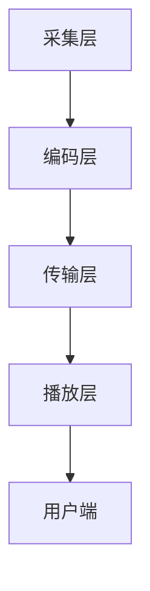

                 

关键词：bilibili、直播技术、面试题、2025、社招、技术解析

> 摘要：本文详细解析了bilibili在2025年社招直播技术面试中的常见问题，旨在帮助准备面试的候选人掌握关键知识点，提升面试竞争力。

## 1. 背景介绍

随着互联网技术的迅猛发展，直播技术已成为各大平台的核心竞争力之一。bilibili作为中国领先的年轻人文化社区和视频平台，对于直播技术的研发和应用有着极高的要求。2025年的社招直播技术面试，旨在寻找具备前沿技术知识、实践经验和创新能力的人才，以推动平台技术的持续迭代与进步。

## 2. 核心概念与联系

### 2.1 直播技术概述

直播技术是指通过网络实时传输音视频内容，实现用户实时互动的技术体系。其核心概念包括：

- **音视频编码**：将模拟信号转换为数字信号，并进行压缩编码，以便高效传输和存储。
- **流媒体传输**：采用HTTP Live Streaming (HLS)、Dynamic Adaptive Streaming over HTTP (DASH)等技术实现多媒体流量的动态调整和传输。
- **实时交互**：通过实时通信技术实现用户与主播、用户之间的互动。

### 2.2 直播技术架构

直播技术架构主要包括以下几个层次：

- **采集层**：负责音频和视频的采集。
- **编码层**：将采集的音视频数据编码成流媒体格式。
- **传输层**：通过直播服务器将编码后的数据传输到用户。
- **播放层**：用户端的播放器负责解码并播放流媒体内容。

### 2.3 Mermaid 流程图

以下是一个简单的直播技术流程图：



## 3. 核心算法原理 & 具体操作步骤

### 3.1 算法原理概述

直播技术的核心算法主要包括：

- **视频编码算法**：如H.264、H.265等。
- **音频编码算法**：如AAC、MP3等。
- **自适应码流技术**：根据用户网络环境和设备性能动态调整码率。

### 3.2 算法步骤详解

1. **采集层**：采集音视频信号。
2. **编码层**：使用视频编码算法将视频数据编码成H.264等格式，使用音频编码算法将音频数据编码成AAC等格式。
3. **传输层**：将编码后的音视频数据打包成流媒体格式，如HLS或DASH。
4. **播放层**：用户端的播放器根据网络环境和设备性能选择合适的码率进行播放。

### 3.3 算法优缺点

- **H.264**：编码效率高，但压缩率相对较低。
- **H.265**：压缩率更高，但编码和解码复杂度增加。
- **AAC**：音频质量高，但压缩率相对较低。

### 3.4 算法应用领域

直播技术广泛应用于在线教育、游戏直播、演唱会直播等多个领域。

## 4. 数学模型和公式

### 4.1 数学模型构建

直播技术中的数学模型主要包括：

- **编码效率模型**：衡量视频编码算法的压缩效率。
- **带宽模型**：根据用户网络环境和设备性能计算最优码率。

### 4.2 公式推导过程

- **编码效率模型**：$$\eta = \frac{原始数据量}{编码后数据量}$$
- **带宽模型**：$$B = C \times \eta$$，其中C为网络带宽，η为编码效率。

### 4.3 案例分析与讲解

假设一个视频文件的原始数据量为1GB，使用H.264编码后数据量为100MB，计算其编码效率和带宽需求。

- 编码效率：$$\eta = \frac{1GB}{100MB} = 10$$
- 带宽需求：$$B = C \times \eta$$，其中C为网络带宽，以Mbps为单位。

## 5. 项目实践：代码实例

### 5.1 开发环境搭建

本文使用Python语言进行直播技术实践，需要安装FFmpeg和OpenCV等库。

```bash
pip install ffmpeg-python opencv-python
```

### 5.2 源代码详细实现

以下是一个简单的直播视频采集和播放的示例代码：

```python
import cv2
import subprocess

# 采集视频
cap = cv2.VideoCapture(0)

# 编码视频
command = "ffmpeg -f rawvideo -pix_fmt bgr24 -s 640x480 -i - -c:v libx264 -f mp4 output.mp4"

# 播放视频
while True:
    ret, frame = cap.read()
    if not ret:
        break
    cv2.imshow('Frame', frame)

    process = subprocess.Popen(command, stdin=subprocess.PIPE)
    process.stdin.write(frame.tobytes())

    if cv2.waitKey(1) & 0xFF == ord('q'):
        break

cap.release()
cv2.destroyAllWindows()
```

### 5.3 代码解读与分析

代码首先使用OpenCV库采集视频帧，然后使用FFmpeg库进行视频编码和播放。

### 5.4 运行结果展示

运行代码后，摄像头采集到的视频将在窗口中显示，并实时编码和播放。

## 6. 实际应用场景

### 6.1 在线教育

直播技术广泛应用于在线教育平台，实现实时教学互动。

### 6.2 游戏直播

游戏直播平台如Twitch使用直播技术，为用户提供实时游戏观看和互动体验。

### 6.3 演唱会直播

演唱会直播使用直播技术，实现全球观众的无缝观看。

## 6.4 未来应用展望

随着5G、AI等技术的发展，直播技术将在更多领域得到应用，如虚拟现实直播、智能互动直播等。

## 7. 工具和资源推荐

### 7.1 学习资源推荐

- 《直播技术揭秘》
- 《视频编码技术》

### 7.2 开发工具推荐

- FFmpeg
- OpenCV

### 7.3 相关论文推荐

- "H.265/HEVC: The Next-Generation Video Coding Standard"
- "Dynamic Adaptive Streaming over HTTP (DASH)"

## 8. 总结：未来发展趋势与挑战

### 8.1 研究成果总结

直播技术在音视频编码、流媒体传输和实时交互等方面取得了显著成果。

### 8.2 未来发展趋势

直播技术将向高清晰度、低延迟、智能互动等方向发展。

### 8.3 面临的挑战

直播技术面临带宽资源限制、数据安全隐私保护等挑战。

### 8.4 研究展望

未来研究将重点关注5G、AI与直播技术的深度融合，实现更高品质的直播体验。

## 9. 附录：常见问题与解答

### 9.1 直播技术有哪些核心技术？

直播技术核心包括音视频编码、流媒体传输和实时交互。

### 9.2 直播技术如何保证音视频质量？

直播技术通过自适应码流技术和高效的编码算法保证音视频质量。

### 9.3 直播技术面临哪些挑战？

直播技术面临带宽资源限制、数据安全隐私保护等挑战。

作者：禅与计算机程序设计艺术 / Zen and the Art of Computer Programming
----------------------------------------------------------------


