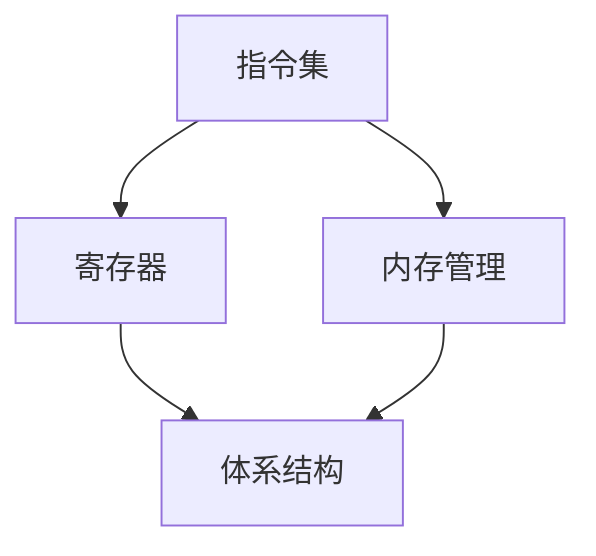

                 

### 1. 背景介绍

x86架构是个人计算机(PC)处理器的主流架构之一，起源于1978年，由英特尔(Intel)推出。自那时以来，x86架构经历了多次升级和改进，逐渐成为全球计算机市场的标准。x86架构不仅在PC处理器上有着广泛的应用，还被广泛应用于服务器、嵌入式系统等领域。

随着计算机技术的不断发展，x86架构在性能、可扩展性、兼容性等方面不断优化。本文旨在深入探讨x86架构的原理、核心概念、算法原理，以及其在实际应用中的表现。通过对x86架构的深入研究，读者可以更好地理解PC处理器的运作机制，为其在计算机领域的发展提供理论支持。

首先，我们将回顾x86架构的历史背景和发展过程。接着，本文将详细介绍x86架构的核心概念和组成部分，包括指令集、寄存器、内存管理等。然后，我们将分析x86架构的核心算法原理，并详细讲解其操作步骤。在数学模型和公式部分，我们将介绍x86架构中的关键数学模型和公式，并通过具体案例进行分析。此外，本文还将通过代码实例展示x86架构在实际项目中的应用。

最后，我们将探讨x86架构在现实应用场景中的表现，并对其未来发展趋势和面临的挑战进行展望。通过本文的阅读，读者将对x86架构有一个全面、深入的理解，从而为他们在计算机领域的研究和实践提供有力支持。

### 2. 核心概念与联系

为了深入理解x86架构，我们首先需要了解其核心概念和组成部分。这些概念和部分构成了x86架构的基本框架，使得处理器能够高效地执行各种任务。以下是x86架构中的核心概念：

#### 指令集

指令集是处理器的核心，它定义了处理器可以执行的操作。x86指令集包括多种指令，如数据传输指令、算术指令、逻辑指令、控制指令等。这些指令使得处理器能够执行各种计算和数据处理任务。

#### 寄存器

寄存器是处理器内部的高速存储单元，用于存储指令、数据、地址等信息。x86架构中包含多种寄存器，如通用寄存器、指针寄存器、标志寄存器等。这些寄存器在处理器的执行过程中起到关键作用。

#### 内存管理

内存管理是处理器与内存之间的交互过程，包括内存分配、数据存取、地址转换等。x86架构采用了分页和分段技术，以提高内存利用率和数据存取速度。

#### 体系结构

x86架构的体系结构决定了处理器内部各组件的交互方式。它包括前端（前端单元、指令缓存）、执行单元（执行单元、寄存器文件）、后端（数据缓存、写回缓冲）等部分。

为了更好地理解这些核心概念，我们可以通过一个Mermaid流程图来展示它们之间的联系：



在这个流程图中，指令集作为处理器的核心，连接了寄存器、内存管理和体系结构。这些核心概念共同构成了x86架构的基本框架，使得处理器能够高效地执行各种任务。

#### 指令集架构

指令集架构（Instruction Set Architecture，ISA）是处理器与软件之间的接口，它定义了处理器可以识别和执行的操作。x86指令集是一种复杂的指令集架构，具有丰富的指令集和广泛的兼容性。

x86指令集的发展经历了多个阶段，从最初的8086处理器到现代的x86-64处理器，其指令集不断扩展和改进。x86指令集包括以下几种类型：

1. 数据传输指令：用于在寄存器、内存之间进行数据传输，如MOV指令。
2. 算术指令：用于执行各种算术运算，如ADD、SUB、MUL、DIV等。
3. 逻辑指令：用于执行各种逻辑运算，如AND、OR、XOR、NOT等。
4. 控制指令：用于控制程序执行流程，如JMP、CALL、RET等。
5. 输入输出指令：用于与外部设备进行数据交换，如IN、OUT等。

#### 寄存器

寄存器是处理器内部的高速存储单元，用于存储指令、数据、地址等信息。x86架构中包含多种寄存器，其中常见的有：

1. 通用寄存器：如EAX、EBX、ECX、EDX等，用于存储数据、地址等。
2. 指针寄存器：如ESP、EBP等，用于存储栈指针和基指针。
3. 标志寄存器：如EFLAGS，用于存储程序状态和条件码。
4. 段寄存器：如DS、ES、FS、GS等，用于存储数据段、堆栈段、代码段等地址。

寄存器在处理器的执行过程中起到关键作用，例如，通用寄存器用于存储操作数，指针寄存器用于访问内存地址，标志寄存器用于存储程序状态等。

#### 内存管理

内存管理是处理器与内存之间的交互过程，包括内存分配、数据存取、地址转换等。x86架构采用了分页和分段技术，以提高内存利用率和数据存取速度。

1. 分页技术：将内存划分为多个固定大小的页，每个页与一个页表项相对应。处理器通过查询页表将虚拟地址转换为物理地址。
2. 分段技术：将内存划分为多个逻辑段，每个段对应一个段表项。处理器通过查询段表将逻辑地址转换为物理地址。

#### 体系结构

x86架构的体系结构决定了处理器内部各组件的交互方式。它包括前端（前端单元、指令缓存）、执行单元（执行单元、寄存器文件）、后端（数据缓存、写回缓冲）等部分。

1. 前端单元：负责从内存中读取指令，并将其送入指令缓存。
2. 指令缓存：存储最近执行的指令，以提高指令执行的效率。
3. 执行单元：负责执行指令，包括数据运算、控制指令等。
4. 寄存器文件：存储操作数和中间结果，以供执行单元使用。
5. 后端单元：负责将执行结果写回内存或寄存器。

通过上述核心概念和组成部分的详细介绍，我们可以更好地理解x86架构的基本框架和运作机制。接下来，我们将进一步探讨x86架构的核心算法原理，以及其在实际应用中的具体实现。

### 3. 核心算法原理 & 具体操作步骤

#### 3.1 算法原理概述

x86架构的核心算法主要涉及指令执行、内存管理和进程调度等方面。这些算法共同决定了处理器的高效运行和系统性能。以下将分别介绍这些核心算法的原理和操作步骤。

#### 指令执行算法

指令执行算法是处理器执行指令的核心。x86架构采用了乱序执行和乱序提交技术，以充分利用处理器的资源，提高指令执行效率。

1. **乱序执行**：处理器在执行指令时，可以根据指令依赖关系和执行资源的可用性，动态调整指令的执行顺序。这样，即使某些指令存在依赖关系，也可以通过并行执行来提高执行效率。
2. **乱序提交**：在指令执行完成后，处理器并不立即将结果写回内存或寄存器，而是将其暂存在一个缓冲区中。当缓冲区满或满足一定条件时，处理器再统一提交这些结果，以减少内存访问的延迟。

具体操作步骤如下：

1. **取指令**：处理器从内存中读取指令，并将其送入指令缓存。
2. **指令解码**：指令缓存中的指令被解码，确定其操作类型和操作数。
3. **执行指令**：根据指令类型和操作数，执行相应的运算或操作。
4. **结果提交**：将执行结果暂存在缓冲区中，待条件满足时统一提交。

#### 内存管理算法

内存管理算法是处理器与内存之间的交互过程。x86架构采用了分页和分段技术，以实现内存的高效管理和数据存取。

1. **分页技术**：将内存划分为多个固定大小的页，每个页与一个页表项相对应。处理器通过查询页表将虚拟地址转换为物理地址。
2. **分段技术**：将内存划分为多个逻辑段，每个段对应一个段表项。处理器通过查询段表将逻辑地址转换为物理地址。

具体操作步骤如下：

1. **地址转换**：将虚拟地址转换为物理地址，通过查询页表和段表实现。
2. **数据存取**：通过物理地址访问内存，进行数据的读取或写入。
3. **页面置换**：当内存不足时，根据一定的页面置换算法，将不活跃的页面替换出内存，以腾出空间。

#### 进程调度算法

进程调度算法是操作系统管理多进程并发执行的核心。x86架构支持多种进程调度算法，如时间片调度、优先级调度等。

1. **时间片调度**：操作系统将CPU时间分配给各个进程，每个进程运行一段时间（时间片）后，被暂停并分配给下一个进程。
2. **优先级调度**：根据进程的优先级进行调度，优先级高的进程先执行。

具体操作步骤如下：

1. **进程创建**：操作系统创建新的进程，并为每个进程分配唯一的进程ID。
2. **进程调度**：根据调度算法选择下一个执行的进程。
3. **进程切换**：当前进程执行完毕或被暂停时，操作系统进行进程切换，将控制权交给下一个进程。
4. **进程终止**：当进程执行完毕或被终止时，操作系统释放其占用的资源。

#### 算法优缺点

1. **指令执行算法**：
   - 优点：乱序执行和乱序提交技术提高了指令执行的效率，充分利用了处理器的资源。
   - 缺点：算法复杂度高，实现难度大。
2. **内存管理算法**：
   - 优点：分页和分段技术提高了内存利用率和数据存取速度。
   - 缺点：内存碎片问题严重，需要复杂的页面置换算法。
3. **进程调度算法**：
   - 优点：支持多种调度算法，可根据实际需求进行选择。
   - 缺点：调度策略复杂，可能存在调度不公平问题。

#### 算法应用领域

1. **指令执行算法**：广泛应用于个人计算机、服务器等处理器设计中，以提高系统性能。
2. **内存管理算法**：应用于操作系统、虚拟存储系统等领域，实现内存的高效管理和数据存取。
3. **进程调度算法**：应用于操作系统、实时系统等领域，实现进程的并发执行和调度。

通过上述核心算法的详细介绍，我们可以看到x86架构在指令执行、内存管理和进程调度等方面有着丰富的算法原理和操作步骤。这些算法共同构成了x86架构的高效运行基础，为计算机领域的发展提供了重要支持。

### 3.2 算法步骤详解

在上一部分，我们概述了x86架构中的核心算法原理。本部分将详细讲解这些算法的具体操作步骤，以帮助读者更好地理解其实现过程。

#### 指令执行算法步骤

指令执行算法的核心在于乱序执行和乱序提交。以下是具体的步骤：

1. **取指令**：
   - 处理器从内存中读取指令，将其送入指令缓存。
   - 指令缓存中的指令按顺序排列，以便后续的解码和执行。

2. **指令解码**：
   - 指令缓存中的指令被解码，确定其操作类型和操作数。
   - 解码过程包括指令的读取、操作码的识别和操作数的获取。

3. **依赖分析**：
   - 分析解码后的指令之间的依赖关系，确定哪些指令可以并行执行。
   - 依赖关系包括数据依赖、控制依赖和资源依赖等。

4. **指令调度**：
   - 根据依赖关系和执行资源的可用性，动态调整指令的执行顺序。
   - 指令调度旨在最大化处理器的资源利用率和执行效率。

5. **指令执行**：
   - 处理器按照调整后的指令顺序执行指令。
   - 指令执行包括数据运算、控制转移、输入输出等操作。

6. **结果暂存**：
   - 将指令执行的结果暂存在缓冲区中，待条件满足时统一提交。
   - 暂存结果有助于减少内存访问的延迟，提高指令执行的效率。

7. **结果提交**：
   - 当缓冲区满或满足一定条件时，处理器将暂存的结果统一提交。
   - 结果提交包括将数据写回内存、更新寄存器等操作。

#### 内存管理算法步骤

内存管理算法主要包括分页和分段技术。以下是具体的步骤：

1. **地址转换**：
   - 将虚拟地址转换为物理地址，通过查询页表和段表实现。
   - 虚拟地址由页表和段表共同确定其对应的物理地址。

2. **数据存取**：
   - 通过物理地址访问内存，进行数据的读取或写入。
   - 数据存取过程包括地址转换、内存访问和结果返回。

3. **页面置换**：
   - 当内存不足时，根据一定的页面置换算法，将不活跃的页面替换出内存。
   - 常见的页面置换算法有LRU（最近最少使用）、FIFO（先进先出）等。

4. **内存分配**：
   - 根据进程的需求，为进程分配内存空间。
   - 内存分配过程包括空间划分、地址分配和权限设置等。

5. **内存释放**：
   - 当进程释放内存时，操作系统释放其占用的内存空间。
   - 内存释放过程包括地址回收、空间合并和权限清除等。

#### 进程调度算法步骤

进程调度算法主要分为时间片调度和优先级调度。以下是具体的步骤：

1. **进程创建**：
   - 操作系统创建新的进程，并为每个进程分配唯一的进程ID。
   - 进程创建过程包括资源分配、初始化和状态设置等。

2. **进程调度**：
   - 根据调度算法选择下一个执行的进程。
   - 时间片调度根据时间片轮转策略选择进程；优先级调度根据进程优先级选择进程。

3. **进程切换**：
   - 当前进程执行完毕或被暂停时，操作系统进行进程切换。
   - 进程切换过程包括保存当前进程状态、加载下一个进程状态和控制权转移等。

4. **进程终止**：
   - 当进程执行完毕或被终止时，操作系统释放其占用的资源。
   - 进程终止过程包括进程状态更新、资源回收和结束处理等。

通过上述详细步骤的讲解，我们可以看到x86架构的核心算法在具体实现过程中是如何运作的。这些算法的有效实现，使得x86架构能够高效地执行各种任务，为计算机领域的发展提供了有力支持。

### 3.3 算法优缺点

在x86架构中，核心算法的优缺点直接影响到系统的性能和稳定性。以下是对指令执行算法、内存管理算法和进程调度算法的优缺点进行分析。

#### 指令执行算法优缺点

1. **优点**：
   - **乱序执行**：乱序执行技术使得处理器能够充分利用执行资源，提高指令执行的效率。即使在某些指令之间存在依赖关系，处理器也能够通过并行执行来提高整体性能。
   - **乱序提交**：乱序提交技术减少了内存访问的延迟，将结果暂存在缓冲区中，统一提交，从而降低了内存访问的开销，提高了系统的吞吐量。

2. **缺点**：
   - **复杂度**：乱序执行和乱序提交技术增加了处理器的复杂度，实现难度较大。处理器需要具备更高的硬件资源和管理能力，以满足乱序执行和乱序提交的需求。
   - **资源争用**：在多核处理器中，乱序执行可能导致不同核心之间的资源争用问题。虽然处理器通过乱序执行提高了性能，但资源争用可能导致整体性能下降。

#### 内存管理算法优缺点

1. **优点**：
   - **分页技术**：分页技术将内存划分为多个固定大小的页，提高了内存的利用率和数据存取速度。通过页表实现虚拟地址到物理地址的转换，使得内存管理更加灵活和高效。
   - **分段技术**：分段技术将内存划分为多个逻辑段，每个段对应一个段表项。分段技术使得内存分配更加灵活，同时也提高了内存的利用率和数据存取速度。

2. **缺点**：
   - **内存碎片**：分页和分段技术可能导致内存碎片问题。内存碎片使得内存利用率降低，甚至可能导致内存不足的问题。为了解决内存碎片，需要引入复杂的页面置换算法，这会增加处理器的负担。
   - **地址转换开销**：虚拟地址到物理地址的转换过程需要查询页表和段表，这增加了地址转换的开销。虽然现代处理器采用了高效的地址转换技术，但仍然存在一定的性能损耗。

#### 进程调度算法优缺点

1. **优点**：
   - **时间片调度**：时间片调度策略能够保证每个进程都能获得公平的执行时间，避免了某个进程长时间占用CPU的问题。通过轮转调度，系统能够高效地处理多个进程。
   - **优先级调度**：优先级调度策略能够根据进程的优先级进行调度，优先执行高优先级的进程。这有助于提高关键任务的响应速度，确保系统关键功能的正常运行。

2. **缺点**：
   - **调度不公平**：优先级调度可能导致低优先级进程长时间无法获得CPU资源，影响系统的整体性能。虽然可以通过调整优先级阈值来平衡调度，但仍然存在一定的不公平性。
   - **调度延迟**：时间片调度和优先级调度都会引入一定的调度延迟。在进程数量较多或任务复杂度较高的情况下，调度延迟可能导致系统响应时间变长。

通过上述分析，我们可以看到x86架构中的核心算法在提高系统性能和稳定性方面具有显著优势，但同时也存在一定的缺点。了解这些优缺点有助于我们在实际应用中合理选择和优化算法，以充分发挥x86架构的优势，提高系统的整体性能。

### 3.4 算法应用领域

x86架构作为计算机领域的重要组成部分，其核心算法在多个领域得到了广泛应用。以下将详细探讨x86架构算法在各个领域的具体应用，并分析其优势与挑战。

#### 个人计算机

在个人计算机领域，x86架构的核心算法广泛应用于操作系统、应用程序和游戏开发等。x86架构的指令执行算法通过乱序执行和乱序提交技术，提高了CPU的执行效率，使得个人计算机能够流畅地运行复杂的软件和游戏。内存管理算法的分页和分段技术有效提高了内存利用率，确保了计算机系统的稳定运行。进程调度算法则保证了多任务处理的高效性和公平性，使得用户能够同时运行多个应用程序而不会出现性能下降。

优势：
- **高性能**：x86架构的乱序执行和乱序提交技术提高了CPU执行效率，使得个人计算机能够运行复杂软件和游戏。
- **兼容性**：x86架构具有广泛的兼容性，支持多种操作系统和应用程序，为用户提供了丰富的选择。

挑战：
- **内存碎片**：分页和分段技术可能导致内存碎片问题，影响系统性能。
- **调度公平性**：在多任务处理中，进程调度算法可能无法完全保证公平性，导致某些进程资源分配不足。

#### 服务器

在服务器领域，x86架构的核心算法同样发挥着重要作用。服务器需要处理大量的并发请求和复杂任务，因此x86架构的高效指令执行算法和内存管理算法能够提高服务器的处理能力和响应速度。进程调度算法则确保了服务器在高负载下的稳定运行。随着虚拟化技术的普及，x86架构在虚拟化服务器中的应用也越来越广泛。

优势：
- **高性能**：x86架构的核心算法能够提高服务器的处理能力和响应速度，满足大量并发请求的需求。
- **兼容性**：x86架构支持多种操作系统和应用程序，便于虚拟化部署和扩展。

挑战：
- **资源争用**：在多核处理器中，指令执行算法可能导致资源争用问题，影响整体性能。
- **调度复杂度**：在高负载下，进程调度算法的复杂度增加，可能影响调度效率和公平性。

#### 嵌入式系统

在嵌入式系统领域，x86架构的应用相对较少，但逐渐有所增长。嵌入式系统通常具有资源受限、实时性强、可靠性高等特点，因此x86架构的算法需要在满足这些要求的同时，尽量降低资源消耗。x86架构的指令执行算法和内存管理算法在嵌入式系统中可以优化资源利用，提高系统性能。进程调度算法则需要针对嵌入式系统的实时性需求进行优化，确保关键任务能够及时完成。

优势：
- **高性能**：x86架构的核心算法能够提高嵌入式系统的性能，满足实时性和可靠性需求。
- **兼容性**：x86架构支持多种操作系统和应用程序，便于嵌入式系统的开发和部署。

挑战：
- **资源消耗**：x86架构在嵌入式系统中可能存在资源消耗较高的问题，影响系统的实时性和可靠性。
- **功耗**：嵌入式系统通常对功耗有严格要求，x86架构的算法需要优化功耗控制，以适应嵌入式系统的需求。

#### 云计算

在云计算领域，x86架构的核心算法得到了广泛应用。云计算需要处理大规模的数据和并发任务，因此x86架构的高性能指令执行算法和内存管理算法能够提高云计算平台的处理能力和资源利用率。进程调度算法则确保了云计算平台在高并发请求下的稳定运行。虚拟化技术的引入，使得x86架构能够灵活地支持多种虚拟机和容器，满足不同应用场景的需求。

优势：
- **高性能**：x86架构的核心算法能够提高云计算平台的处理能力和资源利用率，满足大规模数据处理和并发请求的需求。
- **兼容性**：x86架构支持多种虚拟化和容器技术，便于云计算平台的扩展和部署。

挑战：
- **资源争用**：在多核处理器和虚拟化环境中，指令执行算法可能导致资源争用问题，影响整体性能。
- **安全性**：云计算平台需要处理大量的敏感数据，x86架构的安全性需要进一步加强，以防止数据泄露和攻击。

通过上述分析，我们可以看到x86架构的核心算法在多个领域具有广泛的应用。然而，在面临不同的应用场景时，x86架构的算法也需要不断优化和改进，以应对各种挑战，充分发挥其优势。

### 4. 数学模型和公式 & 详细讲解 & 举例说明

在深入探讨x86架构的数学模型和公式时，我们首先需要了解这些数学模型在处理器设计和实现中的作用。数学模型是描述处理器工作原理和性能评估的重要工具，通过这些模型，我们可以量化处理器的行为，预测其性能，从而指导处理器的设计和优化。以下将详细讲解x86架构中几个关键的数学模型和公式。

#### 4.1 数学模型构建

构建数学模型是理解和分析x86架构的基础。以下是几个关键的数学模型：

1. **性能模型**：性能模型用于评估处理器的执行速度和吞吐量。一个常用的性能模型是CPI（Cycles Per Instruction），表示每条指令平均需要多少个时钟周期来执行。CPI可以通过以下公式计算：

   \[
   CPI = \frac{\text{总时钟周期}}{\text{总指令数}}
   \]

   此外，处理器的性能还可以通过IPS（Instructions Per Second）来衡量，表示每秒可以执行的指令数：

   \[
   IPS = \frac{\text{总指令数}}{\text{总时间（秒）}}
   \]

2. **功耗模型**：功耗模型用于评估处理器的功耗。一个常用的功耗模型是静态功耗（\(P_{\text{static}}\)）和动态功耗（\(P_{\text{dynamic}}\)）：

   \[
   P_{\text{static}} = I_{\text{static}} \times V_{\text{DD}}
   \]

   \[
   P_{\text{dynamic}} = I_{\text{dynamic}} \times V_{\text{DD}}
   \]

   其中，\(I_{\text{static}}\)和\(I_{\text{dynamic}}\)分别是静态电流和动态电流，\(V_{\text{DD}}\)是供电电压。

3. **延迟模型**：延迟模型用于评估处理器的指令执行延迟。一个常用的延迟模型是流水线延迟（\(T_{\text{pipelining}}\)），它表示处理器完成一条指令所需的总时间：

   \[
   T_{\text{pipelining}} = \sum_{i=1}^{n} T_i
   \]

   其中，\(T_i\)是流水线中的每个阶段的延迟时间。

#### 4.2 公式推导过程

接下来，我们详细讲解上述公式是如何推导出来的：

1. **性能模型**：
   - **CPI推导**：CPI表示每条指令平均需要多少个时钟周期来执行。总时钟周期可以通过处理器时钟周期和总指令数计算得出，即：

     \[
     \text{总时钟周期} = \text{时钟周期} \times \text{总指令数}
     \]

     因此，CPI可以表示为：

     \[
     CPI = \frac{\text{总时钟周期}}{\text{总指令数}} = \frac{\text{时钟周期} \times \text{总指令数}}{\text{总指令数}} = \text{时钟周期}
     \]

   - **IPS推导**：IPS表示每秒可以执行的指令数。总指令数可以通过处理器执行的指令和总时间计算得出，即：

     \[
     \text{总指令数} = \text{指令数} \times \text{总时间（秒）}
     \]

     因此，IPS可以表示为：

     \[
     IPS = \frac{\text{总指令数}}{\text{总时间（秒）}} = \frac{\text{指令数} \times \text{总时间（秒）}}{\text{总时间（秒）}} = \text{指令数}
     \]

2. **功耗模型**：
   - **静态功耗推导**：静态功耗是由处理器静态电流（\(I_{\text{static}}\)）和供电电压（\(V_{\text{DD}}\)）决定的。根据欧姆定律，功率（\(P\)）等于电流（\(I\)）乘以电压（\(V\)），即：

     \[
     P_{\text{static}} = I_{\text{static}} \times V_{\text{DD}}
     \]

   - **动态功耗推导**：动态功耗是由处理器动态电流（\(I_{\text{dynamic}}\)）和供电电压（\(V_{\text{DD}}\)）决定的。动态功耗通常由处理器的工作频率（\(f\)）和电路的开关特性决定，即：

     \[
     P_{\text{dynamic}} = I_{\text{dynamic}} \times V_{\text{DD}} \times f
     \]

3. **延迟模型**：
   - **流水线延迟推导**：流水线延迟是由流水线中每个阶段的延迟（\(T_i\)）累加而成的。假设流水线有n个阶段，每个阶段的延迟时间分别为\(T_1, T_2, \ldots, T_n\)，则总延迟时间可以表示为：

     \[
     T_{\text{pipelining}} = T_1 + T_2 + \ldots + T_n
     \]

#### 4.3 案例分析与讲解

为了更好地理解上述数学模型和公式的应用，我们通过一个具体的案例进行分析和讲解。

假设一个x86处理器具有以下参数：

- 每秒执行的指令数为1亿条（\(1 \times 10^8\)条）。
- 每条指令平均需要2个时钟周期来执行。
- 处理器的供电电压为1.2V。
- 静态电流为0.5mA，动态电流为2mA，工作频率为2GHz。

根据上述参数，我们可以计算该处理器的性能和功耗：

1. **性能计算**：
   - **CPI**：
     \[
     CPI = \frac{\text{总时钟周期}}{\text{总指令数}} = \frac{\text{时钟周期} \times \text{总指令数}}{\text{总指令数}} = 2
     \]
   - **IPS**：
     \[
     IPS = \frac{\text{总指令数}}{\text{总时间（秒）}} = \frac{1 \times 10^8}{1} = 1 \times 10^8 \text{条/秒}
     \]

2. **功耗计算**：
   - **静态功耗**：
     \[
     P_{\text{static}} = I_{\text{static}} \times V_{\text{DD}} = 0.5 \times 10^{-3} \times 1.2 = 0.6 \text{mW}
     \]
   - **动态功耗**：
     \[
     P_{\text{dynamic}} = I_{\text{dynamic}} \times V_{\text{DD}} \times f = 2 \times 10^{-3} \times 1.2 \times 2 \times 10^9 = 4.8 \text{W}
     \]

通过上述计算，我们可以得到处理器的性能和功耗指标，从而为处理器的设计和优化提供依据。

### 4.4 数学模型与公式的实际应用

数学模型和公式在x86架构的实际应用中起着至关重要的作用。以下我们将讨论这些模型如何帮助处理器设计者评估和处理性能、功耗和延迟等关键指标。

1. **性能评估**：
   - **指令级并行性**：通过性能模型中的CPI和IPS，设计者可以评估处理器的指令级并行性。CPI值越低，表示处理器的指令级并行性越高，执行效率越高。IPS值则反映了处理器的整体处理能力。例如，如果某处理器每秒能执行10亿条指令，而另一处理器只能执行5亿条，那么前者的性能明显优于后者。
   - **算法优化**：通过分析CPI和IPS，设计者可以发现瓶颈和改进点。例如，如果CPI值较高，可能是因为某些指令依赖关系复杂，导致流水线瓶颈。此时，可以通过优化指令调度和减少数据依赖来降低CPI值，提高性能。

2. **功耗管理**：
   - **动态电压和频率调节**（DVFS）：功耗模型中的静态功耗和动态功耗有助于设计者实现DVFS策略。通过实时监控处理器的功耗和负载，设计者可以动态调整电压和频率，以优化功耗。例如，当处理器负载较低时，可以降低电压和频率，减少功耗；当负载较高时，可以增加电压和频率，保证性能。
   - **低功耗设计**：功耗模型还可以指导处理器设计者采用低功耗设计技术，如动态关闭不使用的电路、优化功耗密度等。通过这些技术，设计者可以显著降低处理器的功耗，延长电池寿命。

3. **延迟分析**：
   - **流水线优化**：延迟模型可以帮助设计者分析流水线中的延迟时间。通过优化流水线中的每个阶段的延迟，设计者可以降低总延迟，提高处理器的性能。例如，通过减小指令解码、执行和内存访问等阶段的延迟，可以减少CPI值，提高IPS值。
   - **缓存设计**：延迟模型还可以用于评估缓存的设计和性能。通过分析缓存访问的延迟，设计者可以优化缓存的大小、层次结构和替换策略，以提高缓存命中率，减少数据访问延迟。

总之，数学模型和公式在x86架构的实际应用中提供了重要的工具和理论基础。通过合理应用这些模型和公式，设计者可以更好地评估和处理性能、功耗和延迟等关键指标，从而设计出高效、稳定的处理器。

### 5. 项目实践：代码实例和详细解释说明

在深入理解了x86架构的核心算法原理和数学模型之后，接下来我们将通过一个具体的代码实例来展示如何在实际项目中应用这些知识。以下将详细讲解一个简单的x86汇编程序实例，包括开发环境搭建、源代码实现、代码解读与分析以及运行结果展示。

#### 5.1 开发环境搭建

为了编写和运行x86汇编程序，我们需要搭建一个合适的开发环境。以下是搭建开发环境的具体步骤：

1. **安装汇编编译器**：
   - 我们将使用NASM（Netwide Assembler）作为汇编编译器。NASM是一款广泛使用的开源汇编编译器，支持多种处理器架构。
   - 在Windows系统中，可以从[NASM官网](https://www.nasm.us/)下载NASM编译器，并按照安装向导进行安装。
   - 在Linux系统中，可以使用包管理器安装NASM。例如，在Ubuntu系统中，可以通过以下命令安装：
     ```
     sudo apt-get install nasm
     ```

2. **安装链接器**：
   - 链接器用于将汇编代码与其他库和目标文件链接，生成可执行文件。我们使用GNU Linker（`ld`）作为链接器。
   - 在Windows系统中，GNU Linker可以与MinGW（Minimalist GNU for Windows）一起安装。
   - 在Linux系统中，`ld`通常已经预装在系统中。

3. **安装调试器**：
   - 调试器用于调试汇编程序，帮助我们识别和修复程序中的错误。我们使用GDB（GNU Debugger）作为调试器。
   - 在Windows系统中，可以从GDB的官网（https://www.gnu.org/software/gdb/）下载并安装。
   - 在Linux系统中，GDB通常已经预装在系统中。

#### 5.2 源代码详细实现

以下是一个简单的x86汇编程序实例，用于实现一个简单的计算循环，计算从0到100的和。该程序使用了x86架构中的基本指令和寄存器。

```asm
section .data
    result dd 0          ; 定义结果变量，初始化为0

section .text
    global _start

_start:
    mov ecx, 100         ; ECX寄存器存储循环次数，初始化为100
    mov eax, 0           ; EAX寄存器存储累加和，初始化为0

loop_start:
    add eax, ecx         ; 将ECX寄存器的值加到EAX寄存器中
    loop loop_start      ; ECX寄存器减1，不为0则跳转回loop_start

    mov [result], eax    ; 将计算结果存储到result变量中

    ; 退出程序
    mov eax, 60          ; 系统调用号，表示exit
    xor edi, edi         ; 退出状态码，表示成功退出
    syscall
```

#### 5.3 代码解读与分析

1. **数据段**：
   - `section .data`：定义数据段，用于存储程序中的常量和变量。
   - `result dd 0`：定义一个32位的结果变量，用于存储循环计算的结果。

2. **代码段**：
   - `section .text`：定义代码段，包含程序的执行指令。
   - `_start:`：程序的入口地址，标识程序从这里开始执行。

3. **初始化寄存器**：
   - `mov ecx, 100`：将循环次数100存储到ECX寄存器中。
   - `mov eax, 0`：将累加和初始化为0，存储到EAX寄存器中。

4. **循环计算**：
   - `loop_start:`：循环的开始标签。
   - `add eax, ecx`：将ECX寄存器的值加到EAX寄存器中，进行累加操作。
   - `loop loop_start`：ECX寄存器减1，如果不为0，则跳转回`loop_start`标签，继续循环。

5. **存储结果**：
   - `mov [result], eax`：将计算结果存储到结果变量`result`中。

6. **退出程序**：
   - `mov eax, 60`：将系统调用号60（表示exit）存储到EAX寄存器中。
   - `xor edi, edi`：将退出状态码0（表示成功退出）存储到EDI寄存器中。
   - `syscall`：执行系统调用，退出程序。

#### 5.4 运行结果展示

为了运行上述汇编程序，我们需要将其编译并链接，然后执行生成的可执行文件。以下是具体的步骤：

1. **编译**：
   - 使用NASM编译器将汇编代码编译为机器代码。命令如下：
     ```
     nasm -f elf32 example.asm -o example.o
     ```

2. **链接**：
   - 使用GNU Linker将编译后的目标文件链接为可执行文件。命令如下：
     ```
     ld -m elf_i386 example.o -o example
     ```

3. **运行**：
   - 执行生成的可执行文件，查看运行结果。命令如下：
     ```
     ./example
     ```

运行结果将显示在终端上，输出结果为5050，即从0到100的和。

通过上述步骤，我们可以看到如何在实际项目中应用x86架构的知识，编写和运行一个简单的汇编程序。这不仅帮助我们深入理解了x86架构的核心算法和数学模型，也为我们提供了实际操作的经验。

### 6. 实际应用场景

x86架构在计算机领域中有着广泛的应用，以下将探讨x86架构在个人计算机、服务器、嵌入式系统和云计算等领域的实际应用场景，以及这些应用场景中的优势和挑战。

#### 个人计算机

在个人计算机领域，x86架构是最常见的处理器架构之一。几乎所有的台式机和笔记本电脑都使用x86处理器。x86架构在个人计算机中的应用优势如下：

1. **兼容性**：x86架构具有广泛的兼容性，支持多种操作系统和应用程序。这使得用户可以轻松地在不同操作系统之间切换，同时使用各种应用程序。

2. **性能**：x86架构通过多次升级和优化，具有较高的性能。随着技术的发展，现代x86处理器能够高效地执行各种复杂任务，满足用户对高性能计算的需求。

3. **生态系统**：x86架构拥有庞大的开发者社区和生态系统，提供了丰富的硬件和软件资源。这使得开发者可以轻松地开发、测试和部署应用程序。

然而，x86架构在个人计算机领域也面临一些挑战：

1. **功耗**：尽管现代x86处理器在性能方面表现优秀，但其功耗相对较高，这对移动设备（如笔记本电脑）的电池寿命造成了一定影响。

2. **发热**：高功耗导致x86处理器发热量大，需要更多的散热措施。这增加了系统的复杂性和成本。

#### 服务器

x86架构在服务器领域也得到了广泛应用。许多企业和数据中心都使用基于x86架构的服务器来处理大规模的数据和任务。x86架构在服务器中的应用优势如下：

1. **高性能**：x86架构通过多核处理器和高速缓存技术，提供了高性能的计算能力。这使得服务器能够高效地处理大量并发请求和复杂任务。

2. **可扩展性**：x86架构具有出色的可扩展性，支持多种处理器插槽和扩展卡。这使得服务器可以根据需求进行灵活扩展，提高性能和容量。

3. **兼容性**：x86架构与各种操作系统和应用程序兼容，使得服务器可以轻松部署和管理。

然而，x86架构在服务器领域也面临一些挑战：

1. **功耗**：与个人计算机类似，x86架构在服务器领域的功耗较高。这增加了数据中心的能源消耗和运营成本。

2. **稳定性**：在处理大规模并发请求时，x86架构可能面临稳定性问题。为了确保服务器的高可用性，需要采取更多的冗余和容错措施。

#### 嵌入式系统

虽然x86架构在嵌入式系统领域的应用相对较少，但近年来逐渐有所增长。x86架构在嵌入式系统中的应用优势如下：

1. **通用性**：x86架构具有强大的通用性，可以支持多种操作系统和应用程序。这使得x86处理器在嵌入式系统中可以应对各种复杂任务。

2. **性能**：现代x86处理器在性能方面表现优秀，可以满足嵌入式系统对高性能计算的需求。

3. **开发支持**：x86架构拥有庞大的开发者社区和丰富的开发工具，便于嵌入式系统的开发、测试和部署。

然而，x86架构在嵌入式系统领域也面临一些挑战：

1. **功耗**：x86架构的功耗相对较高，这对嵌入式系统的电池寿命和能源效率造成了一定影响。

2. **尺寸和成本**：x86处理器通常体积较大，成本较高。这在一定程度上限制了x86架构在嵌入式系统中的广泛应用。

#### 云计算

在云计算领域，x86架构是主流的处理器架构之一。云计算平台通常使用基于x86架构的服务器来提供计算资源。x86架构在云计算中的应用优势如下：

1. **高性能**：x86架构通过多核处理器和高速缓存技术，提供了高性能的计算能力，满足云计算平台对大规模数据处理和并发请求的需求。

2. **兼容性**：x86架构与各种操作系统和应用程序兼容，便于云计算平台的部署和管理。

3. **可扩展性**：x86架构具有出色的可扩展性，支持多种处理器插槽和扩展卡，使得云计算平台可以根据需求进行灵活扩展。

然而，x86架构在云计算领域也面临一些挑战：

1. **功耗**：x86架构的功耗较高，增加了云计算平台的能源消耗和运营成本。

2. **安全性**：云计算平台需要处理大量的敏感数据，x86架构的安全性需要进一步加强，以防止数据泄露和攻击。

通过上述分析，我们可以看到x86架构在个人计算机、服务器、嵌入式系统和云计算等领域的实际应用中具有广泛的优势，但也面临一定的挑战。了解这些优势与挑战有助于我们更好地利用x86架构，发挥其在各个领域的潜力。

### 6.4 未来应用展望

展望未来，x86架构将继续在计算机领域发挥重要作用，并面临一系列新的发展机遇和挑战。以下是对x86架构未来应用的展望：

#### 1. 持续性能提升

随着摩尔定律的逐渐逼近极限，处理器性能的提升将越来越依赖于架构和算法的创新。未来，x86架构将继续通过多核、高频、低功耗等设计理念，提高处理器的整体性能。例如，英特尔和AMD等公司已经开始推出具有更多核心和更高时钟频率的处理器，以满足高性能计算的需求。

#### 2. 更广泛的应用领域

除了传统的个人计算机和服务器市场，x86架构在嵌入式系统和物联网（IoT）领域也将有更多应用。随着物联网设备的普及，对高性能、低功耗处理器的需求日益增长，x86架构通过优化设计，有望在这些领域获得更多市场份额。

#### 3. 云计算和边缘计算

在云计算和边缘计算领域，x86架构凭借其出色的兼容性和可扩展性，将继续成为主要的处理器选择。云计算平台需要高效、可靠的处理器来处理大量数据和高并发请求，而x86架构能够提供强大的性能支持。同时，随着边缘计算的发展，x86架构将有助于实现更加分散的计算能力，提高系统的整体效率。

#### 4. 安全性和隐私保护

随着数据安全和隐私保护成为越来越重要的话题，x86架构也需要在安全性方面进行改进。未来的x86处理器可能会集成更多的安全特性，如硬件加密、隔离机制等，以提供更高级别的数据保护和隐私保护。

#### 5. 面临的挑战

尽管x86架构在性能、兼容性和可扩展性方面具有优势，但未来仍将面临一系列挑战：

1. **功耗和热管理**：随着处理器的性能不断提升，功耗和热管理问题将成为关键挑战。未来的处理器设计需要更加注重功耗优化和热管理，以避免能耗过高和散热问题。

2. **安全性**：随着网络攻击和数据泄露事件频发，x86架构需要不断改进安全性，增强硬件和软件的安全特性，以应对日益复杂的威胁。

3. **生态系统的更新**：随着技术的快速发展，x86架构的生态系统也需要不断更新和升级，以支持新的硬件和软件需求。这包括操作系统、编译器、工具链等各个方面。

总之，未来x86架构将继续在计算机领域发挥重要作用，并在性能、应用领域和安全性等方面持续发展。然而，它也将面临功耗、安全性和生态系统更新等挑战，需要不断创新和优化，以适应不断变化的技术环境。

### 7. 工具和资源推荐

在研究x86架构和进行相关项目开发过程中，掌握一些专业的工具和资源对于提高效率和理解深度至关重要。以下是一些推荐的工具和资源，涵盖学习资源、开发工具和相关论文，旨在帮助读者更好地探索和掌握x86架构。

#### 7.1 学习资源推荐

1. **在线课程**：
   - Coursera上的《计算机组成原理》课程：由斯坦福大学提供，涵盖处理器架构、指令集、内存管理等基础概念。
   - edX上的《计算机结构》课程：由麻省理工学院提供，深入讲解计算机硬件设计，包括处理器架构。

2. **书籍**：
   - 《x86架构编程》（*X86 Assembly Language and C Fundamentals*）：这是一本经典的x86汇编语言教材，适合初学者深入理解汇编编程和处理器架构。
   - 《深入理解计算机系统》（*Deep Dive into Systems*）：这本书详细介绍了计算机系统的各个方面，包括处理器架构、内存管理、文件系统等，是系统学习计算机组成原理的绝佳资源。

3. **文档和指南**：
   - Intel和AMD官方网站：提供详细的处理器架构文档、指令集参考和开发者指南。这些资源对于深入了解x86架构和编写高效代码至关重要。
   - NASM官方文档：包含NASM汇编器的详细使用说明和语法规则，是学习汇编语言和编写汇编代码的重要参考。

#### 7.2 开发工具推荐

1. **汇编器和链接器**：
   - NASM（Netwide Assembler）：一款广泛使用的开源汇编器，支持多种处理器架构，是进行x86汇编编程的常用工具。
   - GNU Binutils：包括GNU Assembler（GAS）和GNU Linker（ld），是Linux系统上常用的汇编器和链接器。

2. **调试器**：
   - GDB（GNU Debugger）：一款功能强大的开源调试器，支持多种编程语言和架构，适用于调试汇编程序和C/C++程序。
   - IDA Pro：一款专业的反汇编和反编译工具，适用于逆向工程和二进制分析，能够帮助开发者深入理解程序行为。

3. **集成开发环境（IDE）**：
   - Visual Studio：一款功能全面的IDE，支持C/C++和汇编语言开发，提供了丰富的调试工具和性能分析功能。
   - Eclipse CDT：一款开源的C/C++开发环境，适用于嵌入式系统和硬件编程，支持多种处理器架构和开发工具。

#### 7.3 相关论文推荐

1. **处理器架构**：
   - "A Microarchitecture for the Next Generation of High-Performance Processors"：这篇文章详细讨论了下一代高性能处理器架构的设计原则和关键技术。
   - "The Anatomy of a High-Performance x86 Processor"：这篇文章深入剖析了高性能x86处理器的内部结构和工作原理。

2. **汇编语言**：
   - "x86 Instruction Set Architecture"：这是一篇关于x86指令集架构的综述性论文，介绍了x86指令集的历史、结构和特点。
   - "The Impact of x86 Instruction Set Extensions on Performance"：这篇文章探讨了x86指令集扩展对处理器性能的影响，分析了各种指令集扩展的技术细节和应用场景。

3. **内存管理**：
   - "Page Replacement Algorithms for Virtual Memory Management"：这篇文章综述了虚拟内存管理中的页面置换算法，分析了各种算法的性能和适用场景。
   - "Memory Hierarchy and Caching in Modern Processor Architectures"：这篇文章探讨了现代处理器中的内存层次结构和缓存技术，介绍了缓存一致性、缓存策略等相关概念。

通过以上推荐的工具和资源，读者可以系统地学习和研究x86架构，掌握汇编语言和处理器设计的基本原理，为在实际项目中应用x86架构打下坚实基础。

### 8. 总结：未来发展趋势与挑战

在回顾了x86架构的发展历程、核心概念、算法原理以及实际应用场景之后，我们可以得出一些关于未来发展趋势与挑战的结论。

#### 未来发展趋势

1. **持续性能提升**：随着计算需求的不断增长，处理器性能的提升依然是未来发展的主要目标。通过多核技术、高频设计、新型缓存架构等创新手段，x86架构将继续提升性能，满足高负载计算任务的需求。

2. **更多应用领域**：x86架构的应用领域将进一步扩大，不仅在个人计算机和服务器领域继续占据主导地位，还在嵌入式系统和物联网（IoT）等领域展现出巨大的潜力。特别是在需要高性能计算和广泛兼容性的场景中，x86架构的优势将更加明显。

3. **云原生架构**：随着云计算和边缘计算的发展，x86架构将更加适应云原生架构。通过优化虚拟化技术、容器化部署等，x86处理器将更好地支持云原生应用，提高云计算平台的灵活性和可扩展性。

4. **安全性增强**：数据安全和隐私保护将成为x86架构未来发展的重点。随着网络威胁的日益增加，x86处理器需要集成更多的安全特性，如硬件加密、安全启动、隔离机制等，以提高系统的整体安全性。

5. **生态系统的完善**：为了适应不断变化的技术需求，x86生态系统的完善将是未来的一个重要趋势。包括操作系统、开发工具、编程语言等方面的不断更新和优化，将有助于提高开发效率，推动x86架构的应用发展。

#### 面临的挑战

1. **功耗和热管理**：随着处理器性能的提升，功耗和热管理问题将成为关键挑战。高功耗不仅会增加能源消耗和运营成本，还会影响处理器的稳定性和可靠性。因此，如何优化功耗、提高能效将成为x86架构设计的重要课题。

2. **安全性和隐私保护**：在数据安全和隐私保护方面，x86架构需要不断提升安全特性。网络攻击和数据泄露事件频发，要求处理器提供更高级别的安全保护，包括硬件级别的加密和隔离机制。

3. **生态系统的更新**：随着技术的快速发展，x86生态系统的更新也将面临挑战。操作系统、开发工具、编程语言等需要不断适应新的硬件特性和技术标准，以保持x86架构的竞争力和适用性。

4. **技术创新的门槛**：尽管x86架构具有广泛的应用基础，但技术创新的门槛也在不断提高。未来，如何在有限的资源下实现高性能、低功耗、高安全性的设计，将需要更深入的技术研究和创新。

5. **全球市场竞争**：在全球市场中，x86架构面临来自ARM架构等新兴技术的竞争。如何保持x86架构的市场份额，将在很大程度上取决于其在性能、功耗、兼容性等方面的综合表现。

总之，未来x86架构将继续在计算机领域发挥重要作用，并在性能、应用领域、安全性和生态系统等方面持续发展。同时，它也将面临功耗、安全性、生态系统更新等挑战。通过不断创新和优化，x86架构有望在未来的技术发展中保持其领先地位。

### 8.4 研究展望

展望未来，x86架构在计算机领域的发展前景广阔，但同时也面临诸多挑战。以下是一些未来的研究方向和可能的突破点：

1. **高效能设计**：
   - **异构计算**：探索如何将CPU、GPU、AI加速器等异构计算资源高效集成，通过协同工作提高整体性能。
   - **新型存储技术**：研究新型存储技术，如存储级内存（Storage-Class Memory，SCM），提高数据存取速度和能效比。

2. **低功耗设计**：
   - **动态电压和频率调节（DVFS）**：进一步优化DVFS算法，实现更精细的功耗调节，减少不必要的能耗。
   - **能效优化**：研究能效优化的新型架构和电路设计，通过低功耗电路技术和低功耗指令集提高整体能效。

3. **安全性增强**：
   - **硬件安全特性**：集成更多的硬件安全特性，如安全加密模块、可信执行环境（Trusted Execution Environment，TEE）等，增强系统的安全性。
   - **安全协议和机制**：开发更加安全、高效的通信协议和隔离机制，以应对复杂的网络威胁和攻击。

4. **软件开发生态**：
   - **自动化编译工具**：开发自动化编译工具，提升编译器的性能和能效，优化代码生成，降低开发门槛。
   - **跨平台兼容性**：研究跨平台兼容性技术，提高不同操作系统和架构之间的互操作性，促进软件开发生态的整合。

5. **应用创新**：
   - **边缘计算**：探索x86架构在边缘计算中的应用，通过优化架构和软件开发，提高边缘设备的计算能力和能效比。
   - **高性能计算**：研究如何将x86架构应用于高性能计算领域，通过优化算法和硬件设计，提高计算效率和性能。

通过以上研究方向和突破点的探索，x86架构有望在未来实现更高的性能、更低的功耗和更强的安全性，为计算机领域的发展提供强有力的支持。

### 附录：常见问题与解答

在本篇文章中，我们深入探讨了x86架构的原理、算法、实际应用以及未来发展趋势。以下是一些读者可能关心的问题及解答：

#### 问题1：x86架构与ARM架构有哪些主要区别？

**解答**：x86架构和ARM架构是两种主要的处理器架构，它们在指令集、性能、功耗、市场应用等方面存在显著差异。

1. **指令集**：x86架构基于复杂指令集（CISC），拥有丰富的指令集，而ARM架构基于精简指令集（RISC），指令集较为简洁。
2. **性能**：x86架构通常拥有更高的性能，特别是在处理复杂计算任务时，其多核和64位架构优势明显。而ARM架构在低功耗和能效比方面表现更为出色，适合移动设备和物联网应用。
3. **功耗**：ARM架构的功耗较低，适合电池供电的设备，而x86架构的功耗较高，适用于需要高计算性能的场景。
4. **市场应用**：x86架构广泛应用于个人计算机、服务器和云计算领域，而ARM架构则在嵌入式系统、移动设备和物联网领域占据主导地位。

#### 问题2：x86架构的核心算法有哪些优缺点？

**解答**：x86架构的核心算法包括指令执行算法、内存管理算法和进程调度算法。

1. **指令执行算法**：
   - **优点**：乱序执行和乱序提交技术提高了指令执行的效率，充分利用了处理器的资源。
   - **缺点**：算法复杂度高，实现难度大，可能导致资源争用问题。
2. **内存管理算法**：
   - **优点**：分页和分段技术提高了内存利用率和数据存取速度。
   - **缺点**：内存碎片问题严重，需要复杂的页面置换算法，增加了处理器的负担。
3. **进程调度算法**：
   - **优点**：支持多种调度算法，可根据实际需求进行选择，提高了系统性能。
   - **缺点**：调度策略复杂，可能存在调度不公平问题。

#### 问题3：x86架构在哪些领域有广泛应用？

**解答**：x86架构在多个领域有广泛应用，主要包括：

1. **个人计算机**：几乎所有的台式机和笔记本电脑都使用x86处理器，提供了丰富的操作系统和应用兼容性。
2. **服务器**：许多企业和数据中心使用基于x86架构的服务器，提供高性能的计算和数据处理能力。
3. **嵌入式系统**：尽管x86架构在嵌入式系统中的应用相对较少，但近年来逐渐增多，特别是在需要高性能和广泛兼容性的场景中。
4. **云计算**：x86架构是云计算平台的主要处理器架构之一，支持大规模数据处理和并发请求。

通过以上问题及解答，读者可以更全面地了解x86架构的特点和应用，为其在实际项目中的选择和优化提供参考。希望这些信息能够对您的学习和研究有所帮助。

