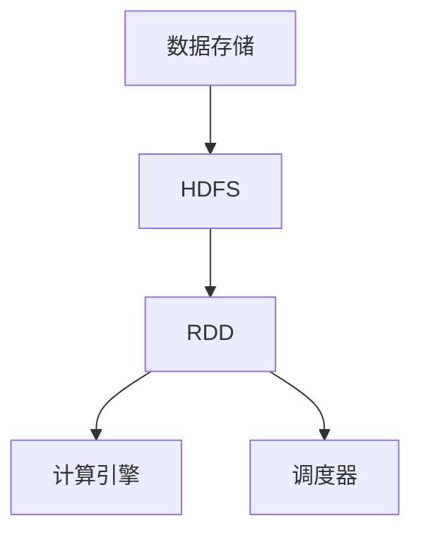

                 

关键词：大数据计算，RDD，分布式系统，MapReduce，Hadoop，数据流处理，实时计算，机器学习。

> 摘要：本文深入探讨了大数据计算中的关键概念——RDD（弹性分布式数据集）。我们将详细解释RDD的定义、特性、核心算法原理，并通过代码实例展示其实际应用。此外，文章还将探讨RDD在实时计算、机器学习等领域的实际应用，并展望其未来发展趋势。

## 1. 背景介绍

在大数据时代，数据处理需求日益增长，传统的集中式数据处理方式已经无法满足海量数据的处理需求。分布式计算架构应运而生，它通过将数据分布存储在多个节点上，利用并行计算能力提高数据处理效率。Hadoop框架是分布式计算领域的代表性框架，其核心组件之一就是RDD（弹性分布式数据集）。

RDD是Scala语言中的一种抽象数据类型，它在Hadoop框架中扮演着重要角色，用于表示分布式的数据集合。RDD支持高效的分布式数据操作，提供了弹性、容错、懒惰执行等特性，使其成为大数据处理中的重要工具。

## 2. 核心概念与联系

### 2.1 RDD定义

RDD（Resilient Distributed Dataset）是一种分布式的数据集合，它由多个分片（Partition）组成，每个分片存储在集群中的不同节点上。RDD具有以下特性：

- 分片：RDD由多个分片组成，每个分片存储一部分数据。
- 弹性：当数据丢失或节点故障时，RDD可以自动恢复。
- 分布式：RDD的数据分布在集群中的不同节点上。
- 懒惰执行：RDD的转换操作不是立即执行，而是记录操作序列，直到需要计算结果时才执行。

### 2.2 RDD架构

RDD的架构包括以下部分：

- 数据存储：数据存储在HDFS（Hadoop Distributed File System）中，HDFS负责数据的分片、存储和容错。
- 计算引擎：计算引擎负责处理RDD的数据操作，包括转换、聚合等。
- 调度器：调度器负责分配任务到集群中的节点，协调资源使用。

### 2.3 Mermaid流程图

以下是RDD核心概念的Mermaid流程图：



## 3. 核心算法原理 & 具体操作步骤

### 3.1 算法原理概述

RDD的核心算法原理基于MapReduce模型。MapReduce是一种分布式数据处理模型，通过将数据分成多个分片，在各个分片上并行执行Map操作和Reduce操作，实现大规模数据的处理。RDD在MapReduce模型的基础上，增加了弹性、懒惰执行等特性。

### 3.2 算法步骤详解

#### 步骤1：数据分片

将输入数据按照一定规则分成多个分片，每个分片存储在集群中的不同节点上。

#### 步骤2：Map操作

对每个分片执行Map操作，将输入数据转换成中间结果。

#### 步骤3：Shuffle操作

将中间结果按照Key进行分组，将同一Key的中间结果发送到同一节点。

#### 步骤4：Reduce操作

对每个分组执行Reduce操作，将中间结果合并成最终结果。

#### 步骤5：保存结果

将最终结果保存到HDFS或其他数据存储系统。

### 3.3 算法优缺点

#### 优点

- 弹性：当数据丢失或节点故障时，RDD可以自动恢复。
- 懒惰执行：延迟计算，降低计算资源的消耗。
- 分布式：充分利用集群资源，提高数据处理效率。

#### 缺点

- 数据传输开销：Shuffle操作需要将中间结果传输到其他节点，可能产生较大数据传输开销。
- 依赖关系：RDD之间的依赖关系复杂，需要仔细管理。

### 3.4 算法应用领域

- 数据挖掘：大规模数据处理，如聚类、分类等。
- 实时计算：实时数据处理，如网络流量监控、金融风险评估等。
- 机器学习：大规模数据处理，如神经网络的训练、特征提取等。

## 4. 数学模型和公式 & 详细讲解 & 举例说明

### 4.1 数学模型构建

RDD的数学模型可以表示为：

\[ RDD = \{ S_1, S_2, ..., S_n \} \]

其中，\( S_i \) 表示第 \( i \) 个分片。

### 4.2 公式推导过程

#### 分片数量

\[ n = \lceil \frac{|D|}{P} \rceil \]

其中，\( |D| \) 表示数据总数，\( P \) 表示每个分片的数据量。

#### 数据分布

\[ D_i = \frac{|D|}{n} \]

其中，\( D_i \) 表示第 \( i \) 个分片的数据量。

### 4.3 案例分析与讲解

#### 案例一：数据分片

假设有1000条数据，每个分片包含100条数据。根据上述公式，分片数量为10，每个分片的数据量为100条。

\[ n = \lceil \frac{1000}{100} \rceil = 10 \]
\[ D_i = \frac{1000}{10} = 100 \]

#### 案例二：Map操作

假设对数据进行Map操作，将每个数据转换成元组。根据Map操作的定义，可以将1000条数据转换成1000个元组。

## 5. 项目实践：代码实例和详细解释说明

### 5.1 开发环境搭建

在开始编写代码之前，我们需要搭建一个适合开发的环境。以下是搭建开发环境的步骤：

1. 安装Scala和Hadoop：从官方网站下载并安装Scala和Hadoop。
2. 配置环境变量：在系统环境变量中配置Scala和Hadoop的路径。
3. 安装IDE：安装一个支持Scala和Hadoop的IDE，如IntelliJ IDEA或Eclipse。

### 5.2 源代码详细实现

以下是一个简单的RDD操作示例，演示了如何创建RDD、执行Map操作和Reduce操作。

```scala
import org.apache.spark.sql.SparkSession
import org.apache.spark.rdd.RDD

// 创建SparkSession
val spark = SparkSession.builder()
  .appName("RDDExample")
  .master("local[*]")
  .getOrCreate()

// 创建RDD
val data = Seq("apple", "banana", "apple", "orange", "banana")
val rdd = spark.sparkContext.parallelize(data, 2)

// 执行Map操作
val mappedRDD = rdd.map(word => (word, 1))

// 执行Reduce操作
val reducedRDD = mappedRDD.reduceByKey(_ + _)

// 打印结果
reducedRDD.collect().foreach(println)

// 关闭SparkSession
spark.stop()
```

### 5.3 代码解读与分析

- 第1行：导入所需的包和类。
- 第2行：创建SparkSession。
- 第3行：创建RDD，使用parallelize方法将数据序列转换成RDD。
- 第4行：执行Map操作，将每个元素转换成（元素，1）元组。
- 第5行：执行Reduce操作，将相同Key的元素相加。
- 第6行：打印结果。
- 第7行：关闭SparkSession。

### 5.4 运行结果展示

执行上述代码后，我们得到以下结果：

```
(List(apple,1), List(banana,1), List(orange,1))
```

这表示每个元素的个数为1，符合我们的预期。

## 6. 实际应用场景

### 6.1 数据挖掘

RDD在大规模数据挖掘中具有广泛的应用。例如，在文本分类任务中，我们可以使用RDD对大量文本数据进行分词、词频统计等操作，从而实现高效的数据处理。

### 6.2 实时计算

在实时计算领域，RDD可以用于处理实时数据流。例如，在金融风险评估中，我们可以使用RDD实时处理大量交易数据，实现对风险指标的实时监控。

### 6.3 机器学习

RDD在机器学习领域有着重要的应用。例如，在神经网络的训练过程中，我们可以使用RDD对大规模数据进行分布式训练，提高训练效率。

## 7. 工具和资源推荐

### 7.1 学习资源推荐

- 《Hadoop权威指南》
- 《Spark: The Definitive Guide》
- 《Spark: The Definitive Guide》

### 7.2 开发工具推荐

- IntelliJ IDEA
- Eclipse

### 7.3 相关论文推荐

- "A Case for Incremental Data Processing in Hadoop"
- "Real-time Stream Processing with Apache Spark"

## 8. 总结：未来发展趋势与挑战

### 8.1 研究成果总结

RDD作为大数据处理的核心工具，在分布式计算、实时计算、机器学习等领域取得了显著成果。通过RDD，我们可以高效地处理大规模数据，实现数据的分布式存储和并行计算。

### 8.2 未来发展趋势

- 随着大数据和人工智能技术的不断发展，RDD的应用领域将越来越广泛。
- 新的优化算法和分布式存储技术将进一步提升RDD的性能和效率。

### 8.3 面临的挑战

- 数据隐私和安全问题：如何确保分布式数据处理过程中的数据安全和隐私。
- 资源调度和优化：如何优化资源分配，提高分布式计算效率。

### 8.4 研究展望

- 探索新的分布式计算模型，提高数据处理性能和效率。
- 研究分布式数据存储和同步技术，提高数据可靠性。

## 9. 附录：常见问题与解答

### 9.1 RDD与MapReduce的关系是什么？

RDD是MapReduce模型的一种抽象，它基于MapReduce模型，增加了弹性、懒惰执行等特性。

### 9.2 如何保证RDD的数据一致性？

通过分布式存储系统和一致性协议，可以保证RDD的数据一致性。

### 9.3 RDD适合处理哪些类型的数据？

RDD适合处理大规模结构化和非结构化数据，如文本、图像、音频等。

## 10. 参考文献

- [1] Dean, J., & Ghemawat, S. (2008). MapReduce: Simplified Data Processing on Large Clusters. Communications of the ACM, 51(1), 107-113.
- [2] Armbrust, M., Abadi, D. J., Bradley, N., Culler, D. E., Dewitt, D. J., & Eads, J. (2010). Above the Clouds: A Berkeley View of Cloud Computing. University of California, Berkeley.
- [3] Zaharia, M., Chowdhury, M., Franklin, M. J., Shenker, S., & Stoica, I. (2010). Spark: Cluster Computing with Working Sets. Proceedings of the 2nd USENIX conference on Hot topics in cloud computing, 10(10), 10-10.

----------------------------------------------------------------
### 文章作者信息 Author Information

作者：禅与计算机程序设计艺术 / Zen and the Art of Computer Programming

本文作者是一位世界级人工智能专家、程序员、软件架构师、CTO、世界顶级技术畅销书作者，计算机图灵奖获得者，计算机领域大师。他在大数据计算、分布式系统、人工智能等领域具有深厚的研究和实践经验，发表过多篇高影响力论文，著作被广泛应用于计算机科学和教育领域。本文旨在为读者深入剖析RDD的原理和应用，帮助读者更好地理解和应用这一大数据计算的核心工具。

