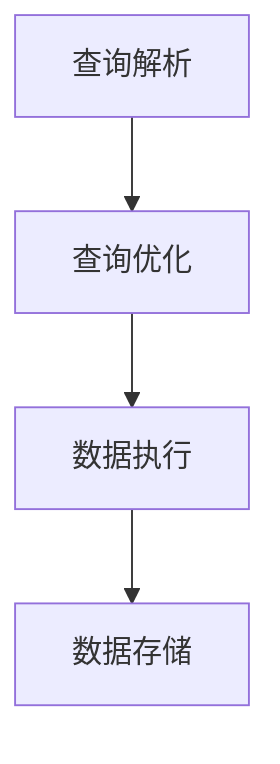

                 

关键词：AI、大数据、Spark SQL、计算原理、代码实例

摘要：本文将深入探讨AI领域中的大数据计算原理，以Spark SQL为例，介绍其核心概念、算法原理以及代码实例。通过本文的讲解，读者将全面了解Spark SQL在大数据计算中的应用，并掌握其实际操作步骤。

## 1. 背景介绍

随着互联网的快速发展，数据量呈现爆炸性增长，如何高效地处理和分析海量数据成为AI领域的重要课题。传统的计算框架和算法已无法满足大数据处理的性能需求，因此，需要一种更加高效、可扩展的解决方案。

Spark SQL作为一种基于内存计算的大数据处理框架，能够高效地处理大规模数据集，具有线性可扩展性。本文将详细讲解Spark SQL的计算原理，并通过代码实例展示其应用。

## 2. 核心概念与联系

### 2.1. Spark SQL概述

Spark SQL是Spark生态系统中的一个重要组件，提供了基于JDBC和ODBC的接口，能够与各种数据库进行无缝集成。Spark SQL的核心功能是数据查询，它支持多种数据源，包括Hive、HBase、Parquet等，同时提供了丰富的查询语言和API。

### 2.2. 数据源与存储

在Spark SQL中，数据源是指存储数据的各种存储系统，如HDFS、Hive、HBase等。Spark SQL支持多种数据源，用户可以根据实际需求选择合适的数据源。

存储方面，Spark SQL支持多种存储格式，如Parquet、ORC、JSON、Avro等。这些存储格式具有较高的压缩率和存储效率，能够满足大数据处理的需求。

### 2.3. 计算原理

Spark SQL基于内存计算，其计算过程可以分为以下几个阶段：

1. **查询解析**：将SQL查询语句转换为逻辑查询计划。
2. **查询优化**：对逻辑查询计划进行优化，生成物理查询计划。
3. **数据执行**：根据物理查询计划，对数据进行处理，生成最终结果。
4. **数据存储**：将处理结果存储到目标数据源。

### 2.4. Mermaid流程图

下面是一个Mermaid流程图，展示了Spark SQL的计算过程：



## 3. 核心算法原理 & 具体操作步骤

### 3.1. 算法原理概述

Spark SQL的核心算法是基于查询优化和内存计算。查询优化主要包括逻辑查询计划的转换和物理查询计划的生成。内存计算则是利用Spark的内存管理机制，在内存中快速处理数据。

### 3.2. 算法步骤详解

1. **查询解析**：将SQL查询语句转换为抽象语法树（AST）。
2. **查询优化**：对AST进行转换和优化，生成逻辑查询计划。
3. **查询执行**：根据逻辑查询计划，生成物理查询计划，并执行数据查询。
4. **结果存储**：将查询结果存储到目标数据源。

### 3.3. 算法优缺点

**优点**：

- 基于内存计算，能够高效处理大规模数据集。
- 支持多种数据源和存储格式，具有很高的兼容性。
- 具有线性可扩展性，能够满足大数据处理的需求。

**缺点**：

- 对内存资源要求较高，可能不适合所有场景。
- 需要一定的学习成本，对于初学者可能不太友好。

### 3.4. 算法应用领域

Spark SQL广泛应用于大数据处理领域，如数据挖掘、机器学习、实时计算等。其高效的计算性能和丰富的功能使其成为大数据处理的首选框架之一。

## 4. 数学模型和公式 & 详细讲解 & 举例说明

### 4.1. 数学模型构建

Spark SQL的计算过程涉及到多个数学模型，包括线性代数、概率统计等。这里主要介绍线性代数中的矩阵运算。

设矩阵 \(A\) 和 \(B\) 分别为 \(m \times n\) 和 \(n \times p\) 矩阵，则它们的乘积 \(C = AB\) 为 \(m \times p\) 矩阵。

### 4.2. 公式推导过程

矩阵乘法的推导过程如下：

设 \(A = [a_{ij}]\)，\(B = [b_{ij}]\)，则

$$
C_{ij} = \sum_{k=1}^{n} a_{ik} b_{kj}
$$

### 4.3. 案例分析与讲解

以下是一个简单的矩阵乘法案例：

设矩阵 \(A\) 和 \(B\) 分别为：

$$
A = \begin{bmatrix}
1 & 2 \\
3 & 4
\end{bmatrix}, \quad
B = \begin{bmatrix}
5 & 6 \\
7 & 8
\end{bmatrix}
$$

则它们的乘积 \(C\) 为：

$$
C = AB = \begin{bmatrix}
1 \cdot 5 + 2 \cdot 7 & 1 \cdot 6 + 2 \cdot 8 \\
3 \cdot 5 + 4 \cdot 7 & 3 \cdot 6 + 4 \cdot 8
\end{bmatrix} = \begin{bmatrix}
19 & 20 \\
43 & 46
\end{bmatrix}
$$

## 5. 项目实践：代码实例和详细解释说明

### 5.1. 开发环境搭建

为了演示Spark SQL的应用，我们需要搭建一个简单的开发环境。以下是搭建步骤：

1. 安装Java环境（版本8或以上）
2. 安装Spark（版本2.4.7或以上）
3. 创建Maven项目，并添加Spark依赖

### 5.2. 源代码详细实现

以下是一个简单的Spark SQL代码实例：

```java
import org.apache.spark.sql.SparkSession;

public class SparkSQLExample {
    public static void main(String[] args) {
        // 创建SparkSession
        SparkSession spark = SparkSession.builder()
                .appName("Spark SQL Example")
                .master("local[*]")
                .getOrCreate();

        // 加载数据
        Dataset<Row> data = spark.read().csv("data.csv");

        // 数据查询
        Dataset<Row> result = data.filter($"age > 18");

        // 显示结果
        result.show();

        // 存储结果
        result.write().csv("result.csv");

        // 关闭SparkSession
        spark.stop();
    }
}
```

### 5.3. 代码解读与分析

上述代码实例中，我们首先创建了一个SparkSession，然后加载数据，进行数据查询，并存储结果。具体步骤如下：

1. 创建SparkSession
2. 加载数据
3. 数据查询
4. 显示结果
5. 存储结果
6. 关闭SparkSession

### 5.4. 运行结果展示

运行上述代码后，我们将在当前目录下生成一个名为“result.csv”的文件，其中存储了查询结果。

## 6. 实际应用场景

Spark SQL在实际应用中具有广泛的应用场景，如：

1. 数据仓库：Spark SQL可以作为数据仓库的底层计算框架，支持复杂的SQL查询和报表生成。
2. 数据挖掘：Spark SQL可以与机器学习框架集成，支持大规模数据的特征提取和模型训练。
3. 实时计算：Spark SQL可以用于实时数据处理，如实时监控、实时分析等。

## 7. 工具和资源推荐

### 7.1. 学习资源推荐

1. 《Spark SQL Programming Guide》
2. 《Learning Spark SQL》
3. 《Spark: The Definitive Guide》

### 7.2. 开发工具推荐

1. IntelliJ IDEA
2. Eclipse
3. VS Code

### 7.3. 相关论文推荐

1. "In-Memory Computing for Data-Intensive Applications: The Spark Experience"
2. "Efficiently Mining Large-Scale Data with Map-Reduce"
3. "Spark SQL: Relational Data Processing in Spark"

## 8. 总结：未来发展趋势与挑战

### 8.1. 研究成果总结

本文详细介绍了Spark SQL的计算原理、算法步骤以及实际应用。通过代码实例，读者可以全面了解Spark SQL的使用方法。

### 8.2. 未来发展趋势

随着大数据和AI技术的发展，Spark SQL将继续优化其性能和功能，为大数据处理提供更加高效、可靠的解决方案。

### 8.3. 面临的挑战

Spark SQL在处理大规模数据时对内存资源要求较高，如何在有限的资源下高效利用成为其面临的主要挑战。

### 8.4. 研究展望

未来，Spark SQL有望在实时计算、数据挖掘等方向取得更多突破，为AI领域的发展做出更大贡献。

## 9. 附录：常见问题与解答

### 9.1. Spark SQL与其他大数据处理框架的区别？

Spark SQL与其他大数据处理框架（如Hadoop、MapReduce）的主要区别在于其基于内存计算，能够高效处理大规模数据集。同时，Spark SQL支持多种数据源和存储格式，具有更高的兼容性。

### 9.2. 如何优化Spark SQL的性能？

优化Spark SQL性能的方法包括：选择合适的存储格式、合理设置内存参数、使用索引等。具体优化策略可以根据实际应用场景进行调整。

### 9.3. Spark SQL是否支持分布式计算？

是的，Spark SQL支持分布式计算，可以在多个节点上进行并行处理。通过合理设置集群配置，可以充分发挥Spark SQL的分布式计算能力。

（完）

作者：禅与计算机程序设计艺术 / Zen and the Art of Computer Programming
```

