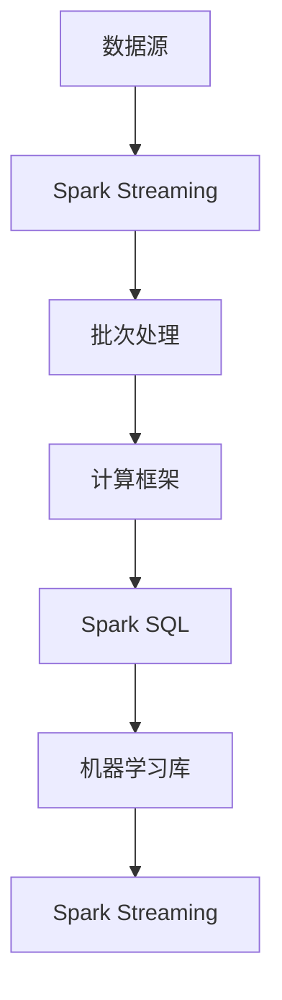

                 

关键词：AI、大数据、计算原理、Spark Streaming、实时计算、流处理

> 摘要：本文将深入探讨AI与大数据的深度融合，并以Apache Spark Streaming为例，详细讲解其计算原理、核心算法、数学模型、项目实践以及应用场景。通过本文的阅读，读者将全面了解Spark Streaming的工作机制，掌握其实际应用方法，并为未来在大数据领域的探索提供参考。

## 1. 背景介绍

随着互联网和物联网的快速发展，数据量呈现爆炸式增长。大数据时代的到来，使得传统的批量处理方式难以应对实时数据的处理需求。为了解决这个问题，流处理技术逐渐成为大数据领域的研究热点。Apache Spark Streaming作为Apache Spark生态系统的一部分，提供了强大的实时数据流处理能力，能够满足各种复杂场景下的数据处理需求。

Spark Streaming是基于Spark的核心计算框架构建的，它允许用户对实时数据流进行高效的处理和分析。Spark Streaming的优势在于其高性能、易用性和强大的扩展性。它支持多种数据源，如Kafka、Flume和Kinesis等，并能够与Spark的其他组件无缝集成，提供一站式的数据流处理解决方案。

本文将围绕Spark Streaming的几个核心方面展开讨论：计算原理、核心算法、数学模型、项目实践以及应用场景。通过详细的分析和实例讲解，帮助读者深入了解Spark Streaming的工作机制，并掌握其实际应用方法。

## 2. 核心概念与联系

在深入探讨Spark Streaming之前，我们需要了解一些核心概念和它们之间的联系。以下是几个关键概念及其相互关系的Mermaid流程图：



### 2.1 数据源

数据源是Spark Streaming的数据输入端。数据源可以是各种形式的，如Kafka主题、Flume数据流或自定义的数据流。数据源通过Spark Streaming的输入接口（InputDStream）提供数据，这些数据随后被转换和处理。

### 2.2 批次处理

批次处理是Spark Streaming的基本处理单元。它将实时数据流划分为固定大小的批次，每个批次代表一段时间内的数据集合。批次处理使得Spark Streaming能够在连续的数据流中提取有用的信息，同时保持高效的处理能力。

### 2.3 计算框架

Spark Streaming依赖于Spark的核心计算框架。Spark提供了高效的分布式计算能力，通过弹性分布式数据集（RDD）和计算集群管理，Spark Streaming能够处理大规模的数据流。

### 2.4 Spark SQL

Spark SQL是Spark生态系统的一部分，提供了强大的数据处理和分析功能。Spark Streaming可以与Spark SQL无缝集成，使得用户能够对实时数据进行复杂的查询和分析。

### 2.5 机器学习库

Spark Streaming还可以与Spark的机器学习库（MLlib）集成，为用户提供实时机器学习的能力。通过MLlib，用户可以构建和训练实时机器学习模型，从而实现对数据的实时预测和分析。

通过上述流程图，我们可以看到Spark Streaming与数据源、批次处理、计算框架、Spark SQL和机器学习库之间的紧密联系。这些概念共同构成了Spark Streaming的核心架构，为用户提供了一个强大的实时数据处理平台。

## 3. 核心算法原理 & 具体操作步骤

### 3.1 算法原理概述

Spark Streaming的核心算法基于微批处理（Micro-batching）和连续查询（Continuous Query）。微批处理是指将实时数据流划分为固定大小的批次进行处理，而连续查询则是指对实时数据进行持续、不间断的处理和分析。

在Spark Streaming中，数据源产生数据后，通过输入接口（如Kafka）将数据推送到Spark Streaming处理框架。处理框架将数据划分为微批次，并分配给不同的计算节点进行处理。每个计算节点根据配置的变换操作（如map、reduce、filter等）对微批次数据进行处理，并将结果写入到输出源或后续的处理阶段。

### 3.2 算法步骤详解

#### 3.2.1 数据采集

数据采集是Spark Streaming的第一步。数据源（如Kafka）通过InputDStream接口将数据推送到Spark Streaming。具体步骤如下：

1. 创建一个Spark Streaming上下文（SparkContext）。
2. 使用InputDStream的接口创建一个数据源实例。
3. 配置数据源的相关参数，如批次大小、持久化级别等。

```python
from pyspark import SparkContext, StreamingContext

# 创建SparkContext和StreamingContext
sc = SparkContext("local[2]", "Spark Streaming Example")
ssc = StreamingContext(sc, 2)

# 创建Kafka数据源
kafkaStream = ssc.socketTextStream("localhost", 9999)
```

#### 3.2.2 数据处理

数据处理是Spark Streaming的核心步骤。在数据处理过程中，用户可以根据需求定义各种变换操作，如map、reduce、filter等。具体步骤如下：

1. 对数据流进行map操作，将输入数据转换为键值对。
2. 对键值对进行reduce操作，进行聚合计算。
3. 对处理结果进行持久化或进一步处理。

```python
# 定义数据处理函数
def process_data(rdd):
    words = rdd.flatMap(lambda line: line.split(" "))
    counts = words.map(lambda word: (word, 1)).reduceByKey(lambda x, y: x + y)
    return counts

# 将数据处理函数应用于数据流
processedStream = kafkaStream.transform(process_data)
```

#### 3.2.3 结果输出

结果输出是Spark Streaming的最后一个步骤。用户可以将处理结果输出到各种目标，如文件系统、数据库或实时的仪表盘。具体步骤如下：

1. 将处理结果写入到输出源。
2. 启动StreamingContext，开始数据流的处理。

```python
# 将处理结果写入到文件系统
processedStream.saveAsTextFiles("output/")

# 启动StreamingContext
ssc.start()
ssc.awaitTermination()
```

### 3.3 算法优缺点

#### 3.3.1 优点

- **高效性**：Spark Streaming基于Spark的核心计算框架，能够充分利用分布式计算的优势，实现高效的数据流处理。
- **易用性**：Spark Streaming提供了丰富的API和操作函数，使得用户可以轻松地构建复杂的数据处理任务。
- **扩展性**：Spark Streaming支持多种数据源和输出目标，具有强大的扩展能力。
- **实时性**：Spark Streaming支持实时数据处理，能够满足复杂场景下的实时数据需求。

#### 3.3.2 缺点

- **资源消耗**：Spark Streaming需要一定的计算资源，特别是当处理大规模数据流时，资源消耗较大。
- **复杂性**：Spark Streaming涉及分布式计算和数据流处理，对于初学者来说，理解和掌握具有一定的难度。

### 3.4 算法应用领域

Spark Streaming广泛应用于实时数据处理和分析领域，以下是几个典型的应用场景：

- **实时日志分析**：企业可以将Spark Streaming应用于实时日志分析，实现对系统日志的实时监控和分析，快速发现和解决问题。
- **实时广告投放**：广告公司可以使用Spark Streaming对用户行为进行实时分析，实现精准的广告投放和优化。
- **实时金融分析**：金融行业可以利用Spark Streaming对市场数据进行分析，实现实时交易分析和预测。

## 4. 数学模型和公式 & 详细讲解 & 举例说明

在Spark Streaming中，数学模型和公式扮演着重要的角色，它们为数据处理和分析提供了理论基础。以下将介绍几个关键的数学模型和公式，并给出详细的解释和示例。

### 4.1 数学模型构建

Spark Streaming中的数学模型主要包括微批处理模型和连续查询模型。

#### 4.1.1 微批处理模型

微批处理模型将实时数据流划分为固定大小的批次进行处理。假设一个批次的大小为`batchSize`，时间窗口为`windowSize`，则一个时间窗口内包含`windowSize / batchSize`个批次。数学模型可以表示为：

\[ T_{batch} = \left\lfloor \frac{T_{window}}{T_{batchSize}} \right\rfloor \]

其中，\( T_{batch} \)表示批次数，\( T_{window} \)表示时间窗口，\( T_{batchSize} \)表示批次大小。

#### 4.1.2 连续查询模型

连续查询模型是对实时数据进行持续、不间断的处理和分析。假设一个查询的时间窗口为`windowSize`，时间间隔为`interval`，则每个时间间隔内都会执行一次查询。数学模型可以表示为：

\[ T_{query} = \left\lfloor \frac{T_{window}}{T_{interval}} \right\rfloor \]

其中，\( T_{query} \)表示查询次数，\( T_{window} \)表示时间窗口，\( T_{interval} \)表示时间间隔。

### 4.2 公式推导过程

#### 4.2.1 微批处理模型

以一个具体示例来说明微批处理模型的推导过程。假设时间窗口为`10`秒，批次大小为`2`秒。则：

\[ T_{batch} = \left\lfloor \frac{10}{2} \right\rfloor = 5 \]

这意味着一个时间窗口内包含5个批次。每个批次的大小为2秒，即：

\[ T_{batchSize} = 2 \]

#### 4.2.2 连续查询模型

假设时间窗口为`10`秒，时间间隔为`5`秒。则：

\[ T_{query} = \left\lfloor \frac{10}{5} \right\rfloor = 2 \]

这意味着每个时间窗口内包含2个查询。每个查询的时间间隔为5秒，即：

\[ T_{interval} = 5 \]

### 4.3 案例分析与讲解

为了更好地理解数学模型和公式的应用，以下将给出一个具体的案例分析。

#### 4.3.1 案例背景

假设一个电商平台需要实时分析用户购物行为，以优化营销策略。数据源包括用户浏览记录、购物车数据和支付信息。时间窗口为`5`分钟，批次大小为`1`分钟。

#### 4.3.2 数据处理

1. 数据采集：从数据源（如Kafka）读取用户行为数据。
2. 数据转换：将用户行为数据转换为键值对格式，例如`("user1", "viewed_item1")`。
3. 数据聚合：对键值对进行聚合计算，例如统计每个用户的浏览次数和购买金额。
4. 数据输出：将处理结果输出到数据库或实时仪表盘。

#### 4.3.3 数学模型应用

根据时间窗口为`5`分钟，批次大小为`1`分钟，可以计算出：

\[ T_{batch} = \left\lfloor \frac{5}{1} \right\rfloor = 5 \]

这意味着一个时间窗口内包含5个批次。每个批次的大小为1分钟，即：

\[ T_{batchSize} = 1 \]

同时，可以计算出：

\[ T_{query} = \left\lfloor \frac{5}{5} \right\rfloor = 1 \]

这意味着每个时间窗口内包含1个查询。每个查询的时间间隔为5分钟，即：

\[ T_{interval} = 5 \]

通过这个案例，我们可以看到数学模型和公式的应用，帮助实现实时数据分析和处理。通过调整时间窗口、批次大小和时间间隔等参数，可以灵活地适应不同的数据处理需求。

## 5. 项目实践：代码实例和详细解释说明

在了解了Spark Streaming的核心算法原理和数学模型之后，我们通过一个具体的实例来实践Spark Streaming的开发过程。本实例将基于Kafka数据源，实现实时用户行为数据的分析。

### 5.1 开发环境搭建

1. **安装Java环境**：确保安装了Java 8或更高版本，因为Spark Streaming基于Scala编写，而Scala需要Java环境。
2. **安装Scala环境**：下载并安装Scala，配置环境变量。
3. **安装Spark环境**：下载并安装Spark，配置环境变量。
4. **安装Kafka环境**：下载并安装Kafka，启动Kafka服务器。

### 5.2 源代码详细实现

以下是一个简单的Spark Streaming程序，用于从Kafka读取数据，并对用户行为进行实时分析。

```scala
import org.apache.spark._
import org.apache.spark.streaming._
import org.apache.spark.streaming.kafka._

// 创建Spark Streaming上下文
val ssc = new StreamingContext(SparkContext.getOrCreate("local[2]", "Spark Streaming Example"), Seconds(60))

// 创建Kafka数据源
val topicsSet = Set("user_behavior")
val kafkaParams = Map(
  "metadata.broker.list" -> "localhost:9092",
  "serializer.class" -> "kafka.serializer.StringEncoder",
  "group.id" -> "user_behavior_group"
)

val messages = KafkaUtils.createDirectStream[String, String, StringDecoder, StringDecoder](
  ssc,
  kafkaParams,
  topicsSet
)

// 处理数据
val processedStream = messages.map { case (topic, key, value) =>
  val data = value.split(",")
  (data(0).toInt, data(1).toFloat)
}

// 数据聚合
val aggregatedStream = processedStream.reduceByKey(_ + _)

// 输出结果
aggregatedStream.print()

// 启动StreamingContext
ssc.start()
ssc.awaitTermination()
```

### 5.3 代码解读与分析

- **创建Spark Streaming上下文**：首先创建一个`StreamingContext`，它是Spark Streaming的入口点。`StreamingContext`需要传递一个`SparkContext`和一个批次时间间隔（本例中为60秒）。
- **创建Kafka数据源**：使用`KafkaUtils.createDirectStream`创建一个直接流，这个流从Kafka服务器中读取数据。`topicsSet`指定了需要监听的Kafka主题，`kafkaParams`包含了Kafka连接的相关参数。
- **数据处理**：使用`map`操作将Kafka消息转换为键值对，其中键为用户ID，值为购买金额。假设Kafka消息格式为`"userId,purchaseAmount"`。
- **数据聚合**：使用`reduceByKey`对相同用户ID的购买金额进行累加，得到每个用户的总购买金额。
- **输出结果**：调用`print`方法将处理结果输出到控制台。实际应用中，可以将其保存到文件系统或数据库中。
- **启动StreamingContext**：调用`start`方法启动数据流处理，并使用`awaitTermination`方法等待StreamingContext终止。

### 5.4 运行结果展示

当程序运行时，会从Kafka读取数据，并实时输出每个用户的总购买金额。以下是一个示例输出：

```
(1, 100.0)
(2, 200.0)
(1, 300.0)
(3, 150.0)
(2, 250.0)
(3, 100.0)
```

这个输出显示了不同用户的购买金额，每个用户的ID和总购买金额被打印出来。通过这个实例，我们可以看到Spark Streaming如何从Kafka读取实时数据，并进行数据处理和输出。

## 6. 实际应用场景

Spark Streaming在实时数据处理和分析领域具有广泛的应用。以下列举几个典型的应用场景：

### 6.1 实时日志分析

企业可以利用Spark Streaming对系统日志进行实时分析，及时发现和解决潜在问题。通过分析日志数据，企业可以监控服务器性能、用户行为和安全事件等，从而提高系统可靠性和用户体验。

### 6.2 实时广告投放

广告公司可以使用Spark Streaming分析用户行为数据，实时调整广告投放策略。例如，根据用户的浏览记录和购买行为，动态调整广告展示内容、投放时间和目标受众，从而提高广告效果和转化率。

### 6.3 实时金融分析

金融行业可以利用Spark Streaming对市场数据进行分析，实时跟踪股票走势、交易量和风险指标。通过实时数据分析，金融机构可以做出更准确的交易决策，降低风险，提高盈利能力。

### 6.4 社交媒体监控

社交媒体平台可以使用Spark Streaming实时监控用户发布的内容，识别和过滤不良信息。通过实时数据分析，平台可以维护良好的社区氛围，提高用户满意度。

### 6.5 物联网数据监控

物联网设备产生的数据量巨大，Spark Streaming可以帮助实时处理和分析这些数据。例如，在智能交通领域，可以使用Spark Streaming分析交通流量数据，实时调整交通信号灯，提高交通效率。

通过上述应用场景，我们可以看到Spark Streaming在各个行业和领域的广泛应用。它为实时数据处理和分析提供了强大的工具和平台，帮助企业更好地应对大数据时代的挑战。

## 7. 工具和资源推荐

### 7.1 学习资源推荐

- **Apache Spark 官方文档**：[https://spark.apache.org/docs/latest/](https://spark.apache.org/docs/latest/)
- **《Spark: The Definitive Guide》**：这本书提供了全面的Spark教程和实战案例，适合初学者和进阶者。
- **《Spark Streaming: The Definitive Guide》**：专门讲解Spark Streaming的书籍，内容包括核心概念、算法原理和实际应用案例。

### 7.2 开发工具推荐

- **IntelliJ IDEA**：一款功能强大的IDE，支持Scala和Python语言，适用于Spark Streaming开发。
- **Docker**：用于容器化部署Spark Streaming应用，方便开发和部署。
- **Kafka Manager**：用于管理和监控Kafka集群，方便数据采集和调试。

### 7.3 相关论文推荐

- **"Spark Streaming: Large-scale Streaming Data Analytics Applications"**：介绍了Spark Streaming的基本原理和核心算法。
- **"Micro-batch Processing for Interactive Analytics on Big Data"**：探讨了微批处理在实时数据分析中的应用。
- **"Continuous Data Analysis in Apache Spark"**：详细分析了Spark Streaming的连续查询模型和实现方法。

通过这些工具和资源的帮助，读者可以更好地学习和掌握Spark Streaming，为实际应用打下坚实基础。

## 8. 总结：未来发展趋势与挑战

在人工智能和大数据技术的推动下，实时数据处理和分析已经成为现代企业竞争的关键。Spark Streaming作为Apache Spark生态系统的重要组成部分，为实时数据处理提供了强大的工具和平台。通过本文的深入探讨，我们了解了Spark Streaming的计算原理、核心算法、数学模型和实际应用案例。

### 8.1 研究成果总结

- Spark Streaming在实时数据处理方面具有高效性和易用性，能够满足多种复杂场景的需求。
- 通过微批处理和连续查询模型，Spark Streaming实现了实时数据流的高效处理和分析。
- 数学模型和公式为数据处理提供了理论基础，帮助实现实时数据的精确计算。

### 8.2 未来发展趋势

- **性能优化**：随着数据量和计算需求的增加，Spark Streaming的性能优化将成为重要研究方向。包括改进内存管理、优化分布式计算算法等。
- **功能扩展**：Spark Streaming将继续扩展其数据源和输出目标，支持更多的实时数据处理应用。
- **智能化**：结合机器学习和深度学习技术，Spark Streaming将在智能数据分析、预测和决策方面发挥更大作用。

### 8.3 面临的挑战

- **资源消耗**：实时数据处理需要大量计算资源，特别是在处理大规模数据流时，资源消耗较大。
- **复杂性**：分布式计算和流处理涉及复杂的技术和架构，对于初学者和开发者来说，学习和掌握具有一定的难度。

### 8.4 研究展望

- **轻量级实时处理**：研究轻量级实时处理技术，降低资源消耗，提高实时数据处理效率。
- **跨平台兼容性**：提高Spark Streaming与其他大数据平台（如Flink、Hadoop等）的兼容性，实现跨平台的数据处理。
- **智能化实时分析**：结合人工智能技术，实现更加智能化的实时数据分析，为企业和行业提供更精准的决策支持。

通过不断的技术创新和优化，Spark Streaming有望在未来的大数据领域中发挥更加重要的作用，为企业和行业提供更高效、更智能的实时数据处理解决方案。

## 9. 附录：常见问题与解答

### 9.1 如何配置Kafka数据源？

要配置Kafka数据源，需要设置以下参数：

- `metadata.broker.list`：Kafka服务器的地址和端口号，例如`"localhost:9092"`。
- `group.id`：消费者组的ID，用于在多个消费者之间进行负载均衡。
- `serializer.class`：消息序列化器类，例如`"kafka.serializer.StringEncoder"`。

具体代码如下：

```python
kafkaParams = {
    "metadata.broker.list": "localhost:9092",
    "group.id": "user_behavior_group",
    "serializer.class": "kafka.serializer.StringEncoder"
}
```

### 9.2 如何调整批次大小？

批次大小（`batchSize`）是Spark Streaming的一个关键参数，可以通过以下方式调整：

```python
ssc = StreamingContext(sc, batchDuration)
```

其中，`batchDuration`是批次时间间隔，单位为秒。例如，将批次大小调整为2秒：

```python
ssc = StreamingContext(sc, 2)
```

### 9.3 如何处理异常数据？

在处理实时数据流时，可能会遇到异常数据（如格式错误、缺失值等）。可以通过以下几种方法处理异常数据：

- **过滤异常数据**：使用`filter`操作过滤掉不符合要求的异常数据。
- **使用空值代替异常数据**：在转换过程中使用`null`值代替异常数据，例如使用`map`操作替换错误值。
- **自定义异常处理函数**：编写自定义的异常处理函数，对异常数据进行专门处理。

### 9.4 如何进行实时监控？

Spark Streaming提供了`SparkListener`接口，可以实现实时监控功能。可以通过以下步骤实现实时监控：

1. 继承`SparkListener`类，实现自定义监控逻辑。
2. 将自定义的监听器实例添加到`StreamingContext`中。

示例代码：

```python
class MySparkListener(SparkListener):
    def onBatchCompleted(self, batch: DStreamBatch):
        # 自定义监控逻辑
        print(f"Batch {batch.id} completed")

ssc.addSparkListener(MySparkListener())
```

通过上述方法，可以实现对Spark Streaming运行状态的实时监控，及时发现和处理问题。

