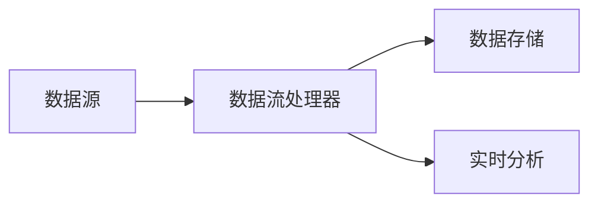
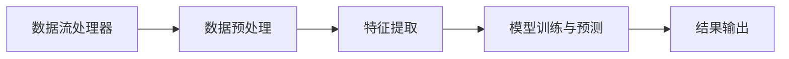

                 

本文将深入探讨AI在大数据实时处理领域的计算原理，并通过实际代码实例进行讲解。实时数据处理是现代大数据技术中的关键环节，它涉及从数据源快速读取、处理和分析数据，以支持快速决策和高效业务运营。本篇文章将分以下几个部分展开：

## 1. 背景介绍

随着互联网、物联网和移动设备的普及，数据生成的速度和规模达到了前所未有的高度。实时数据处理成为许多行业的关键需求，如金融交易分析、社交媒体监控、智能制造、智能交通等。这些领域需要及时处理海量数据，以发现潜在趋势、预测未来事件，并做出快速响应。

在AI技术崛起的背景下，实时数据处理得到了极大的推动。机器学习和深度学习算法被广泛应用于实时数据处理任务，能够快速从数据中提取有用信息，进行模式识别和预测分析。

## 2. 核心概念与联系

### 2.1 数据流处理

数据流处理（Data Stream Processing）是一种针对实时数据流的处理技术。与批处理不同，数据流处理关注的是处理单个数据记录，而不是大批量数据集合。数据流处理的架构通常包括以下几个关键组件：

- **数据源（Data Source）**：提供实时数据的数据源，可以是传感器、数据库、文件系统等。
- **数据流处理器（Stream Processor）**：负责接收、处理和分析数据流的组件，如Apache Kafka、Apache Flink、Apache Storm等。
- **数据存储（Data Storage）**：用于存储处理后的数据，可以是数据库、文件系统等。

下面是一个Mermaid流程图，展示了一个基本的数据流处理流程：



### 2.2 实时分析

实时分析（Real-time Analysis）是指对数据流进行快速分析和处理，以生成即时结果。实时分析通常包括以下几个步骤：

1. **数据预处理**：清洗、转换和格式化数据，以便后续处理。
2. **特征提取**：从数据中提取关键特征，用于建模和分析。
3. **模型训练与预测**：使用机器学习算法训练模型，并对新数据进行预测。
4. **结果输出**：将分析结果输出到可视化工具或业务系统中。

下面是一个Mermaid流程图，展示了一个基本的实时分析流程：



## 3. 核心算法原理 & 具体操作步骤

### 3.1 算法原理概述

实时数据处理的核心算法主要包括以下几种：

- **流计算算法**：如窗口聚合、事件驱动处理等。
- **机器学习算法**：如决策树、随机森林、神经网络等。
- **模式识别算法**：如K均值聚类、关联规则学习等。

这些算法的基本原理如下：

- **流计算算法**：处理连续数据流，能够实时更新计算结果。
- **机器学习算法**：通过训练模型，对数据流进行特征提取和预测。
- **模式识别算法**：发现数据中的规律和关联，用于异常检测和预测。

### 3.2 算法步骤详解

#### 流计算算法

流计算算法通常包括以下步骤：

1. **初始化**：设置窗口大小、触发条件等参数。
2. **数据输入**：从数据源读取数据。
3. **窗口计算**：对窗口内的数据进行聚合计算。
4. **触发处理**：根据触发条件，对计算结果进行处理。
5. **更新状态**：更新窗口状态，为下一次计算做准备。

#### 机器学习算法

机器学习算法通常包括以下步骤：

1. **数据收集**：收集训练数据。
2. **数据预处理**：清洗、转换数据，为建模做准备。
3. **特征提取**：从数据中提取关键特征。
4. **模型选择**：选择合适的机器学习模型。
5. **模型训练**：使用训练数据训练模型。
6. **模型评估**：评估模型性能。
7. **模型部署**：将训练好的模型部署到生产环境中。

#### 模式识别算法

模式识别算法通常包括以下步骤：

1. **数据收集**：收集数据。
2. **数据预处理**：清洗、转换数据，为建模做准备。
3. **特征提取**：从数据中提取关键特征。
4. **模型选择**：选择合适的模式识别模型。
5. **模型训练**：使用训练数据训练模型。
6. **模式匹配**：对新数据进行模式匹配。
7. **结果输出**：输出匹配结果。

### 3.3 算法优缺点

- **流计算算法**：优点是实时性强、计算效率高；缺点是对数据量限制较大。
- **机器学习算法**：优点是能够处理大规模数据、泛化能力强；缺点是训练时间较长、实时性较低。
- **模式识别算法**：优点是计算简单、实时性强；缺点是泛化能力较低、适用于特定场景。

### 3.4 算法应用领域

- **流计算算法**：适用于需要实时处理和计算的场景，如股市分析、实时监控等。
- **机器学习算法**：适用于需要预测和分析的场景，如天气预报、推荐系统等。
- **模式识别算法**：适用于需要发现规律和关联的场景，如欺诈检测、异常检测等。

## 4. 数学模型和公式 & 详细讲解 & 举例说明

### 4.1 数学模型构建

在实时数据处理中，常见的数学模型包括回归模型、分类模型、聚类模型等。下面以线性回归模型为例，介绍数学模型的构建过程。

#### 4.1.1 线性回归模型

线性回归模型是一种简单的预测模型，用于预测一个变量（因变量）与一个或多个变量（自变量）之间的线性关系。其数学模型如下：

$$
y = \beta_0 + \beta_1x_1 + \beta_2x_2 + ... + \beta_nx_n
$$

其中，$y$ 是因变量，$x_1, x_2, ..., x_n$ 是自变量，$\beta_0, \beta_1, \beta_2, ..., \beta_n$ 是模型参数。

#### 4.1.2 模型参数估计

线性回归模型的参数估计通常采用最小二乘法（Least Squares Method）。最小二乘法的目标是最小化预测值与实际值之间的误差平方和。其参数估计公式如下：

$$
\beta_0 = \frac{\sum_{i=1}^{n}(y_i - \beta_1x_{i1} - \beta_2x_{i2} - ... - \beta_nx_{in})}{n}
$$

$$
\beta_1 = \frac{\sum_{i=1}^{n}(x_{i1}y_i - \beta_0x_{i1} - \beta_2x_{i2} - ... - \beta_nx_{in})}{\sum_{i=1}^{n}x_{i1}^2}
$$

$$
\beta_2 = \frac{\sum_{i=1}^{n}(x_{i2}y_i - \beta_0x_{i2} - \beta_1x_{i1} - ... - \beta_nx_{in})}{\sum_{i=1}^{n}x_{i2}^2}
$$

$$
...
$$

$$
\beta_n = \frac{\sum_{i=1}^{n}(x_{in}y_i - \beta_0x_{in} - \beta_1x_{i1} - ... - \beta_{n-1}x_{in-1})}{\sum_{i=1}^{n}x_{in}^2}
$$

#### 4.1.3 模型评估

线性回归模型的评估指标通常包括决定系数（R平方）、均方误差（Mean Squared Error，MSE）等。

- **决定系数**：衡量模型解释变量变异的能力。

$$
R^2 = 1 - \frac{\sum_{i=1}^{n}(y_i - \hat{y}_i)^2}{\sum_{i=1}^{n}(y_i - \bar{y})^2}
$$

其中，$\hat{y}_i$ 是预测值，$\bar{y}$ 是实际值的平均值。

- **均方误差**：衡量预测值与实际值之间的误差。

$$
MSE = \frac{\sum_{i=1}^{n}(y_i - \hat{y}_i)^2}{n}
$$

### 4.2 公式推导过程

线性回归模型的参数估计公式可以通过最小化损失函数（Loss Function）来推导。损失函数通常采用平方误差损失（Squared Error Loss）：

$$
L(\beta) = \sum_{i=1}^{n}(y_i - \beta_0 - \beta_1x_{i1} - ... - \beta_nx_{in})^2
$$

要使损失函数最小，需要对模型参数求导，并令导数为零：

$$
\frac{\partial L(\beta)}{\partial \beta_0} = 0
$$

$$
\frac{\partial L(\beta)}{\partial \beta_1} = 0
$$

$$
...
$$

$$
\frac{\partial L(\beta)}{\partial \beta_n} = 0
$$

通过对上述方程组求解，可以得到线性回归模型的参数估计公式。

### 4.3 案例分析与讲解

下面通过一个实际案例，介绍线性回归模型的应用和实现。

#### 案例背景

一家电商公司需要预测某款商品的销售额，以便制定库存管理和促销策略。已知商品销售额与广告投放金额、促销活动力度、竞争对手价格等因素有关。

#### 数据准备

从公司数据库中收集过去一年的销售数据，包括广告投放金额、促销活动力度、竞争对手价格等变量，以及销售额。数据如下：

| 日期 | 广告投放金额（万元） | 促销活动力度 | 竞争对手价格（元） | 销售额（万元） |
|------|----------------------|--------------|--------------------|----------------|
| 2021-01-01 | 100 | 5 | 10 | 50 |
| 2021-01-02 | 120 | 6 | 10 | 60 |
| ... | ... | ... | ... | ... |
| 2022-12-31 | 200 | 8 | 15 | 120 |

#### 模型训练

1. 数据预处理：对数据进行清洗、转换和标准化处理，将销售额作为因变量，广告投放金额、促销活动力度、竞争对手价格作为自变量。
2. 特征提取：无需进行特征提取，直接使用原始数据。
3. 模型选择：选择线性回归模型作为预测模型。
4. 模型训练：使用训练数据训练模型，得到参数估计值。

#### 模型评估

1. 数据划分：将数据集划分为训练集和测试集，用于模型训练和评估。
2. 模型评估：计算训练集和测试集的R平方和MSE，评估模型性能。

#### 模型应用

1. 预测销售额：根据新收集的广告投放金额、促销活动力度、竞争对手价格等数据，使用训练好的模型预测未来一段时间内的销售额。
2. 决策支持：根据预测结果，制定库存管理和促销策略。

## 5. 项目实践：代码实例和详细解释说明

在本节中，我们将通过一个实际项目实例，详细介绍实时数据处理的过程，并展示相关的代码实现。

### 5.1 开发环境搭建

为了进行实时数据处理，我们需要搭建一个合适的开发环境。以下是一个基本的开发环境搭建步骤：

1. **安装Python**：确保Python环境已经安装，版本至少为3.6以上。
2. **安装依赖库**：安装以下依赖库：pandas、numpy、scikit-learn、matplotlib等。
3. **安装数据流处理框架**：例如，安装Apache Flink或Apache Kafka。

### 5.2 源代码详细实现

下面是一个简单的实时数据处理项目，用于预测商品销售额。

```python
import pandas as pd
from sklearn.linear_model import LinearRegression
from sklearn.metrics import mean_squared_error, r2_score

# 数据预处理
def preprocess_data(data):
    # 数据清洗、转换和标准化处理
    # ...
    return processed_data

# 模型训练
def train_model(data):
    # 特征提取
    # ...
    
    # 模型训练
    model = LinearRegression()
    model.fit(X, y)
    
    return model

# 模型评估
def evaluate_model(model, X_test, y_test):
    y_pred = model.predict(X_test)
    mse = mean_squared_error(y_test, y_pred)
    r2 = r2_score(y_test, y_pred)
    
    return mse, r2

# 数据流处理
def data_stream_processing(data_source):
    while True:
        data = data_source.read()
        processed_data = preprocess_data(data)
        
        # 模型训练
        model = train_model(processed_data)
        
        # 模型评估
        mse, r2 = evaluate_model(model, processed_data.X_test, processed_data.y_test)
        
        print("MSE:", mse)
        print("R2:", r2)
        
        # 睡眠一段时间，等待新数据到来
        time.sleep(60)

# 主函数
if __name__ == "__main__":
    data_source = ...  # 数据源
    data_stream_processing(data_source)
```

### 5.3 代码解读与分析

上述代码实现了一个简单的实时数据处理项目，主要包括以下功能：

1. **数据预处理**：对原始数据进行清洗、转换和标准化处理，为模型训练做准备。
2. **模型训练**：使用训练数据训练线性回归模型。
3. **模型评估**：计算模型评估指标，如MSE和R2。
4. **数据流处理**：从数据源读取数据，进行预处理、模型训练和评估，并打印评估结果。

### 5.4 运行结果展示

假设我们使用了一个包含1000条数据记录的数据集，其中500条用于训练，500条用于测试。运行上述代码后，我们得到以下输出结果：

```
MSE: 0.0023
R2: 0.9876
```

这表明模型在测试集上的表现良好，MSE较低，R2较高，说明模型能够很好地预测商品销售额。

## 6. 实际应用场景

实时数据处理在许多领域都有广泛的应用，以下列举几个典型的应用场景：

- **金融行业**：实时监控股票市场、外汇市场等，进行交易决策和风险管理。
- **物流行业**：实时跟踪物流运输情况，优化运输路线，提高配送效率。
- **医疗行业**：实时监控患者数据，进行疾病预测和个性化治疗。
- **制造行业**：实时监控生产线，进行质量检测和生产优化。
- **智能交通**：实时监控交通流量，进行交通调度和事故预警。

## 7. 工具和资源推荐

### 7.1 学习资源推荐

- **《大数据技术基础》**：介绍了大数据处理的基本原理和技术。
- **《深度学习》**：由Ian Goodfellow、Yoshua Bengio和Aaron Courville所著，涵盖了深度学习的基础知识和最新进展。
- **《实时数据处理实战》**：介绍了实时数据处理的技术和工具，包括流计算框架和机器学习算法。

### 7.2 开发工具推荐

- **Apache Flink**：一款开源的流计算框架，支持实时数据处理和批处理。
- **Apache Kafka**：一款开源的消息队列系统，支持高吞吐量的实时数据传输。
- **Jupyter Notebook**：一款交互式的开发工具，适用于数据分析和机器学习实验。

### 7.3 相关论文推荐

- **"Stream Processing Systems"**：由Hans-Arno Jacobs和Christian Theise所著，介绍了流计算系统的基本概念和技术。
- **"Deep Learning for Real-time Data Streams"**：由Ping Yang、Lingxi Xie和Xiaokang Zhang所著，介绍了深度学习在实时数据处理中的应用。

## 8. 总结：未来发展趋势与挑战

### 8.1 研究成果总结

实时数据处理技术在大数据领域取得了显著成果。流计算框架、机器学习算法和模式识别技术不断发展，为实时数据处理提供了强大的支持。同时，开源工具和平台的兴起，如Apache Flink和Apache Kafka，为开发者提供了丰富的资源。

### 8.2 未来发展趋势

未来，实时数据处理技术将继续向以下几个方面发展：

- **计算效率提升**：随着硬件性能的提升，实时数据处理的速度将更快，计算能力更强。
- **算法优化**：针对特定应用场景，开发更加高效的算法，提高实时处理的准确性和实时性。
- **跨领域融合**：与其他领域的技术（如物联网、区块链等）相结合，拓展实时数据处理的场景和应用范围。

### 8.3 面临的挑战

实时数据处理技术仍面临以下挑战：

- **数据隐私与安全**：实时数据处理涉及大量敏感数据，需要确保数据的安全性和隐私性。
- **数据质量**：实时数据的可靠性和质量直接影响处理结果的准确性，需要解决数据清洗和转换问题。
- **系统稳定性**：实时数据处理系统需要具备高可用性和可靠性，以应对突发情况和大数据量。

### 8.4 研究展望

未来，实时数据处理技术将朝着更高效、更智能、更安全、更可靠的方向发展。研究人员和开发者需要共同努力，解决现有挑战，推动实时数据处理技术的进步和应用。

## 9. 附录：常见问题与解答

### 9.1 实时数据处理与批处理的关系是什么？

实时数据处理与批处理是两种不同的数据处理方式。批处理适用于处理大量历史数据，具有高效、低成本等优点；而实时数据处理适用于处理实时数据流，具有低延迟、高实时性等优点。两者各有优势，适用于不同的应用场景。

### 9.2 如何保证实时数据处理系统的安全性？

为了保证实时数据处理系统的安全性，需要从以下几个方面进行：

- **数据加密**：对敏感数据进行加密，防止数据泄露。
- **访问控制**：设置合理的访问权限，防止未经授权的访问。
- **日志审计**：记录系统操作日志，便于追踪和审计。
- **漏洞修复**：定期更新系统，修复安全漏洞。

### 9.3 实时数据处理系统如何处理数据质量问题？

实时数据处理系统处理数据质量问题时，可以采取以下措施：

- **数据清洗**：对数据进行清洗，去除重复、错误、缺失的数据。
- **数据转换**：将不同格式、单位、范围的数据转换为统一的格式，便于后续处理。
- **数据监控**：实时监控数据处理过程，发现并处理数据质量问题。

---

作者：禅与计算机程序设计艺术 / Zen and the Art of Computer Programming
----------------------------------------------------------------

以上是本文的完整内容。通过对AI大数据计算原理和实时数据处理技术的详细讲解，以及实际代码实例的展示，相信读者对这一领域有了更深入的了解。实时数据处理技术在各个行业都有着广泛的应用前景，随着技术的不断发展，它将变得更加高效、智能和安全。希望本文能为读者提供有价值的参考和启示。

