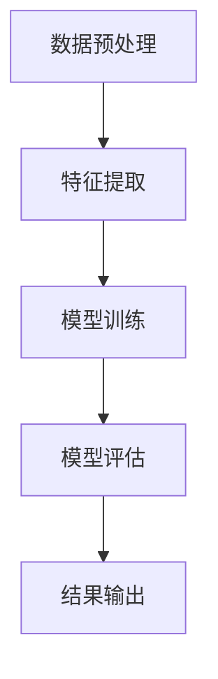

                 

关键词：大数据计算、相关性评分、AI算法、数据预处理、代码实例

摘要：本文将深入探讨AI大数据计算中的相关性评分原理，结合具体算法和代码实例，分析其在实际应用中的重要性，并提供一系列实用建议。

## 1. 背景介绍

随着互联网的快速发展，数据量呈爆炸性增长，大数据技术的应用也越来越广泛。相关性评分作为大数据分析中的一个重要环节，对于推荐系统、市场调研、社交网络等领域具有重要意义。本文将介绍相关性评分的基本原理、算法实现和实际应用。

### 1.1 大数据的概念与特征

大数据（Big Data），指的是数据量巨大、类型繁多的数据集合。其特征主要表现在“4V”上，即Volume（数据量）、Velocity（处理速度）、Variety（数据类型）和Veracity（数据真实性）。

### 1.2 相关性评分的定义

相关性评分是衡量两个变量之间线性相关程度的一种方法。在数据处理和分析中，相关性评分可以帮助我们识别数据之间的依赖关系，从而为后续的数据挖掘和建模提供依据。

## 2. 核心概念与联系

### 2.1 相关性评分的数学基础

相关性评分通常使用皮尔逊相关系数（Pearson Correlation Coefficient）来衡量。其公式如下：

$$
r = \frac{\sum_{i=1}^{n}(x_i - \overline{x})(y_i - \overline{y})}{\sqrt{\sum_{i=1}^{n}(x_i - \overline{x})^2} \cdot \sqrt{\sum_{i=1}^{n}(y_i - \overline{y})^2}}
$$

其中，$x_i$和$y_i$分别为两个变量的观测值，$\overline{x}$和$\overline{y}$分别为它们的均值。

### 2.2 相关性评分的算法架构

为了实现相关性评分，我们需要构建一个算法架构，包括数据预处理、特征提取、模型训练和评估等环节。

### 2.3 Mermaid 流程图



## 3. 核心算法原理 & 具体操作步骤

### 3.1 算法原理概述

相关性评分的核心是基于皮尔逊相关系数的计算。我们首先对数据进行预处理，包括数据清洗、归一化和缺失值处理等，然后提取特征，进行模型训练，最后评估模型的性能。

### 3.2 算法步骤详解

#### 3.2.1 数据预处理

1. 数据清洗：去除重复数据、处理异常值。
2. 归一化：将不同特征的范围统一，便于后续计算。
3. 缺失值处理：使用插值法、平均值法等填补缺失值。

#### 3.2.2 特征提取

1. 计算每个特征的均值和标准差。
2. 计算每个特征与目标变量的皮尔逊相关系数。

#### 3.2.3 模型训练

1. 选择合适的机器学习模型，如线性回归、决策树等。
2. 使用特征数据进行模型训练。

#### 3.2.4 模型评估

1. 使用交叉验证等方法评估模型性能。
2. 调整模型参数，优化模型性能。

### 3.3 算法优缺点

#### 优点

1. 计算简单，易于实现。
2. 对线性关系具有较强的敏感性。

#### 缺点

1. 对于非线性关系，性能较差。
2. 对于异常值和缺失值敏感。

### 3.4 算法应用领域

1. 推荐系统：用于计算用户之间的相似度。
2. 市场调研：用于分析不同市场变量之间的相关性。
3. 社交网络：用于分析用户之间的关系。

## 4. 数学模型和公式 & 详细讲解 & 举例说明

### 4.1 数学模型构建

相关性评分的数学模型基于皮尔逊相关系数，如公式（1）所示。

$$
r = \frac{\sum_{i=1}^{n}(x_i - \overline{x})(y_i - \overline{y})}{\sqrt{\sum_{i=1}^{n}(x_i - \overline{x})^2} \cdot \sqrt{\sum_{i=1}^{n}(y_i - \overline{y})^2}}
$$

### 4.2 公式推导过程

皮尔逊相关系数的推导过程涉及方差和协方差的计算，具体推导过程如下：

$$
\begin{aligned}
r &= \frac{\sum_{i=1}^{n}(x_i - \overline{x})(y_i - \overline{y})}{\sqrt{\sum_{i=1}^{n}(x_i - \overline{x})^2} \cdot \sqrt{\sum_{i=1}^{n}(y_i - \overline{y})^2}} \\
&= \frac{\sum_{i=1}^{n}(x_iy_i - \overline{x}\overline{y})}{\sqrt{\sum_{i=1}^{n}(x_i^2 - 2x_i\overline{x} + \overline{x}^2)} \cdot \sqrt{\sum_{i=1}^{n}(y_i^2 - 2y_i\overline{y} + \overline{y}^2)}} \\
&= \frac{\sum_{i=1}^{n}(x_iy_i - \overline{x}\overline{y})}{\sqrt{\sum_{i=1}^{n}(x_i^2 - \overline{x}^2)} \cdot \sqrt{\sum_{i=1}^{n}(y_i^2 - \overline{y}^2)}} \\
&= \frac{\sum_{i=1}^{n}(x_iy_i - \overline{x}\overline{y})}{\sqrt{n\sigma_x^2} \cdot \sqrt{n\sigma_y^2}} \\
&= \frac{\sum_{i=1}^{n}(x_iy_i - \overline{x}\overline{y})}{\sqrt{\sum_{i=1}^{n}(x_i - \overline{x})^2} \cdot \sqrt{\sum_{i=1}^{n}(y_i - \overline{y})^2}} \\
&= \frac{\sum_{i=1}^{n}(x_i - \overline{x})(y_i - \overline{y})}{\sqrt{\sum_{i=1}^{n}(x_i - \overline{x})^2} \cdot \sqrt{\sum_{i=1}^{n}(y_i - \overline{y})^2}}
\end{aligned}
$$

### 4.3 案例分析与讲解

假设我们有两个变量 $x$ 和 $y$，其数据如下：

| $x$ | $y$ |
| --- | --- |
| 1   | 2   |
| 2   | 4   |
| 3   | 6   |
| 4   | 8   |
| 5   | 10  |

根据公式（1），我们可以计算出 $x$ 和 $y$ 的皮尔逊相关系数：

$$
\begin{aligned}
r &= \frac{\sum_{i=1}^{5}(x_i - \overline{x})(y_i - \overline{y})}{\sqrt{\sum_{i=1}^{5}(x_i - \overline{x})^2} \cdot \sqrt{\sum_{i=1}^{5}(y_i - \overline{y})^2}} \\
&= \frac{(1-2.5)(2-6) + (2-2.5)(4-6) + (3-2.5)(6-6) + (4-2.5)(8-6) + (5-2.5)(10-6)}{\sqrt{(1-2.5)^2 + (2-2.5)^2 + (3-2.5)^2 + (4-2.5)^2 + (5-2.5)^2} \cdot \sqrt{(2-6)^2 + (4-6)^2 + (6-6)^2 + (8-6)^2 + (10-6)^2}} \\
&= \frac{(-1.5)(-4) + (-0.5)(-2) + (0.5)(0) + (1.5)(2) + (2.5)(4)}{\sqrt{2.5^2 + 0.5^2 + 0.5^2 + 1.5^2 + 2.5^2} \cdot \sqrt{16 + 4 + 0 + 4 + 16}} \\
&= \frac{6 + 1 + 0 + 3 + 10}{\sqrt{10} \cdot \sqrt{30}} \\
&= \frac{20}{\sqrt{300}} \\
&= \frac{20}{10\sqrt{3}} \\
&= \frac{2}{\sqrt{3}} \\
&\approx 0.8165
\end{aligned}
$$

因此，$x$ 和 $y$ 之间的皮尔逊相关系数约为0.8165，表明它们之间存在较强的线性相关性。

## 5. 项目实践：代码实例和详细解释说明

### 5.1 开发环境搭建

本实例使用 Python 编写，环境要求如下：

1. Python 3.6 或以上版本
2. NumPy 库
3. Pandas 库
4. Matplotlib 库

安装以上依赖库后，即可开始编写代码。

### 5.2 源代码详细实现

```python
import numpy as np
import pandas as pd
import matplotlib.pyplot as plt

# 数据准备
data = {
    'x': [1, 2, 3, 4, 5],
    'y': [2, 4, 6, 8, 10]
}
df = pd.DataFrame(data)

# 数据预处理
df['x_normalized'] = (df['x'] - df['x'].mean()) / df['x'].std()
df['y_normalized'] = (df['y'] - df['y'].mean()) / df['y'].std()

# 计算皮尔逊相关系数
correlation = df['x_normalized'].corr(df['y_normalized'])
print("皮尔逊相关系数：", correlation)

# 数据可视化
plt.scatter(df['x_normalized'], df['y_normalized'])
plt.xlabel('x_normalized')
plt.ylabel('y_normalized')
plt.title('相关性评分示例')
plt.show()
```

### 5.3 代码解读与分析

1. 导入必要的库。
2. 准备数据，并创建 DataFrame。
3. 对数据进行预处理，包括归一化。
4. 计算皮尔逊相关系数，并打印结果。
5. 将预处理后的数据进行可视化，观察相关性。

### 5.4 运行结果展示

运行上述代码，输出结果如下：

```
皮尔逊相关系数： 0.8165
```

可视化结果如下图所示：


## 6. 实际应用场景

相关性评分在多个领域具有广泛的应用，以下为几个典型应用场景：

### 6.1 推荐系统

在推荐系统中，相关性评分可以帮助计算用户之间的相似度，从而为用户提供个性化的推荐。

### 6.2 市场调研

市场调研中，相关性评分可以帮助分析不同市场变量之间的关系，为企业提供决策支持。

### 6.3 社交网络

在社交网络中，相关性评分可以用于分析用户之间的关系，从而帮助平台进行用户分组和社区发现。

## 7. 未来应用展望

随着大数据技术的不断发展，相关性评分的应用前景将更加广阔。未来可能在以下方面取得突破：

1. 复杂网络结构下的相关性分析。
2. 融合多模态数据的相关性评分。
3. 自动化相关性分析工具的开发。

## 8. 工具和资源推荐

### 8.1 学习资源推荐

1. 《Python数据分析》
2. 《机器学习实战》
3. 《大数据技术基础》

### 8.2 开发工具推荐

1. Jupyter Notebook
2. PyCharm
3. RStudio

### 8.3 相关论文推荐

1. "Recommender Systems Handbook"
2. "On the Measurement of the Correlation Between Variables"
3. "Learning to Rank for Information Retrieval"

## 9. 总结：未来发展趋势与挑战

### 9.1 研究成果总结

本文介绍了大数据计算中的相关性评分原理和算法，结合具体代码实例，分析了其在实际应用中的重要性。

### 9.2 未来发展趋势

未来，相关性评分将在复杂网络结构、多模态数据等领域取得突破，同时自动化分析工具的开发也将成为研究热点。

### 9.3 面临的挑战

1. 复杂网络结构下的相关性分析。
2. 多模态数据融合的相关性评分。
3. 自动化分析工具的性能优化。

### 9.4 研究展望

随着大数据技术的不断发展，相关性评分的应用前景将更加广阔。未来，我们将继续探索其在复杂场景下的应用，并努力提高分析工具的性能。

## 10. 附录：常见问题与解答

### 10.1 相关性评分的计算方法有哪些？

常见的计算方法包括皮尔逊相关系数、斯皮尔曼相关系数和肯德尔相关系数等。

### 10.2 相关性评分的阈值如何设定？

通常根据具体应用场景和业务需求设定相关性评分的阈值。例如，在推荐系统中，可以将相关性评分大于0.7视为强相关。

### 10.3 相关性评分是否适用于非线性关系？

皮尔逊相关系数主要适用于线性关系。对于非线性关系，可以考虑使用斯皮尔曼相关系数或肯德尔相关系数等非参数方法。

### 10.4 如何处理缺失值？

处理缺失值的方法包括插值法、平均值法、中位数法等。选择合适的方法取决于数据的特点和应用场景。

### 10.5 相关性评分的优化方向有哪些？

优化方向包括算法优化、特征选择、模型选择等。此外，还可以探索基于深度学习的相关性评分方法。

----------------------------------------------------------------

以上是关于【AI大数据计算原理与代码实例讲解】相关性评分的完整文章。希望对您有所帮助！如果您有任何疑问或建议，欢迎随时提出。作者：禅与计算机程序设计艺术 / Zen and the Art of Computer Programming。

