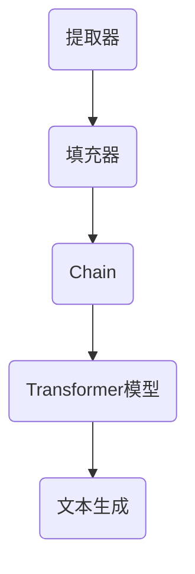
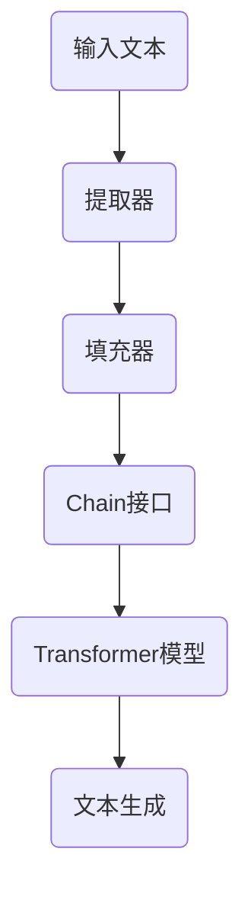

                 

关键词：LangChain, Chain接口, 编程实践，人工智能，Python，自然语言处理

> 摘要：本文将深入探讨LangChain中的Chain接口，介绍其核心概念、工作原理以及具体应用。通过详细的实例和代码解析，读者将掌握如何使用Chain接口构建高效的自然语言处理模型。

## 1. 背景介绍

随着人工智能技术的快速发展，自然语言处理（NLP）已成为计算机科学领域的一个重要分支。NLP技术广泛应用于信息检索、文本分析、聊天机器人、机器翻译等领域。而LangChain是一款优秀的Python库，旨在提供易于使用且功能强大的NLP工具。本文将重点介绍Chain接口，这是LangChain中的核心组件之一。

### 1.1 LangChain简介

LangChain是一款由Hugging Face团队开发的Python库，它提供了丰富的NLP工具和API，旨在简化自然语言处理的任务。LangChain基于Transformer模型，支持多种预训练模型，如GPT、BERT、T5等，同时提供了多种文本处理功能，如文本生成、文本分类、问答系统等。

### 1.2 Chain接口的作用

Chain接口是LangChain中的核心组件，它提供了构建复杂NLP任务的基本框架。通过Chain接口，开发者可以方便地组合不同的NLP工具和模型，实现高效的自然语言处理任务。

## 2. 核心概念与联系

为了更好地理解Chain接口的工作原理，我们需要先了解几个核心概念。

### 2.1 Transformer模型

Transformer模型是当前NLP领域最流行的模型之一。它通过自注意力机制（Self-Attention）来处理序列数据，使得模型能够更好地捕捉序列中的长距离依赖关系。

### 2.2 提取器（Extractor）

提取器是一种用于从文本中提取关键信息的工具。在LangChain中，提取器通常用于提取问题中的关键词或关键句子，以便后续的文本生成或分类任务。

### 2.3 填充器（Filler）

填充器是一种用于将提取的信息填入模板中的工具。在问答系统中，填充器通常用于将问题中的关键词填入预定义的答案模板中，生成完整的答案。

### 2.4 Mermaid流程图

下面是一个Mermaid流程图，展示了Chain接口的核心组件及其相互关系。



### 2.5 核心概念原理

#### 提取器

提取器通过分析文本内容，识别出关键信息，如关键词或关键句子。这有助于提高后续文本处理任务的效率和准确性。

#### 填充器

填充器用于将提取的关键信息填入预定义的模板中，生成具体的答案或结果。这有助于简化文本生成和分类任务的实现。

#### Chain接口

Chain接口是LangChain中的核心组件，它提供了构建复杂NLP任务的基本框架。通过Chain接口，开发者可以方便地组合提取器、填充器和Transformer模型，实现高效的自然语言处理任务。

#### Transformer模型

Transformer模型是当前NLP领域最流行的模型之一。它通过自注意力机制来处理序列数据，使得模型能够更好地捕捉序列中的长距离依赖关系。

### 2.6 Mermaid流程图

下面是一个Mermaid流程图，展示了Chain接口的工作流程。



## 3. 核心算法原理 & 具体操作步骤

### 3.1 算法原理概述

Chain接口通过将提取器、填充器和Transformer模型组合在一起，实现高效的文本处理任务。具体来说，提取器用于提取文本中的关键信息，填充器用于将这些信息填入预定义的模板中，Chain接口负责协调这些组件的执行，Transformer模型则负责生成最终的文本结果。

### 3.2 算法步骤详解

1. **输入文本**：首先，我们需要输入一个文本，如一个问题或一个句子。

2. **提取关键信息**：通过提取器，从输入文本中提取出关键信息，如关键词或关键句子。

3. **填入模板**：将提取的信息填入预定义的答案模板中，生成一个待生成的文本。

4. **调用Chain接口**：使用Chain接口将提取器、填充器和Transformer模型组合在一起，开始处理文本。

5. **生成文本**：通过Transformer模型，生成最终的文本结果。

### 3.3 算法优缺点

#### 优点

- **模块化**：Chain接口提供了一种模块化的方法来构建NLP任务，使得开发者可以方便地组合不同的组件。
- **高效**：通过将提取器、填充器和Transformer模型组合在一起，Chain接口能够高效地处理文本数据。
- **灵活性**：Chain接口支持多种提取器、填充器和Transformer模型，使得开发者可以根据具体需求灵活选择。

#### 缺点

- **复杂性**：虽然Chain接口提供了一种模块化的方法，但具体实现仍然相对复杂，需要一定的编程技能。
- **资源消耗**：由于Chain接口需要调用Transformer模型，因此可能需要一定的计算资源和时间。

### 3.4 算法应用领域

Chain接口广泛应用于多种自然语言处理任务，如文本生成、文本分类、问答系统等。以下是一些典型的应用场景：

- **文本生成**：通过Chain接口，可以方便地实现文本生成任务，如生成文章、故事等。
- **文本分类**：Chain接口可以用于实现文本分类任务，如情感分析、主题分类等。
- **问答系统**：通过Chain接口，可以构建高效的问答系统，如智能客服、问答机器人等。

## 4. 数学模型和公式 & 详细讲解 & 举例说明

### 4.1 数学模型构建

在Chain接口中，主要的数学模型是基于Transformer模型。Transformer模型的核心是多头自注意力机制（Multi-Head Self-Attention）。

#### 自注意力机制（Self-Attention）

自注意力机制的核心思想是：在处理序列数据时，每个词都能够考虑到其他所有词的影响。具体公式如下：

$$
\text{Attention}(Q, K, V) = \text{softmax}\left(\frac{QK^T}{\sqrt{d_k}}\right) V
$$

其中，$Q$、$K$ 和 $V$ 分别是查询（Query）、键（Key）和值（Value）向量的集合，$d_k$ 是键向量的维度。

#### 多头注意力（Multi-Head Attention）

多头注意力通过堆叠多个自注意力机制来实现，每个自注意力机制关注序列的不同部分。具体公式如下：

$$
\text{Multi-Head}\_\text{Attention}(Q, K, V) = \text{Concat}(\text{head}_1, \text{head}_2, ..., \text{head}_h)W^O
$$

其中，$h$ 是头的数量，$W^O$ 是输出线性层。

### 4.2 公式推导过程

为了更好地理解多头注意力的推导过程，我们可以通过以下步骤：

1. **计算查询（Query）、键（Key）和值（Value）**：

   $$ 
   Q = W_Q X \\
   K = W_K X \\
   V = W_V X 
   $$

   其中，$X$ 是输入序列，$W_Q$、$W_K$ 和 $W_V$ 分别是查询、键和值矩阵。

2. **计算自注意力得分**：

   $$ 
   \text{Score} = \text{Attention}(Q, K, V) = \text{softmax}\left(\frac{QK^T}{\sqrt{d_k}}\right) V 
   $$

3. **计算多头注意力输出**：

   $$ 
   \text{Multi-Head}\_\text{Attention}(Q, K, V) = \text{Concat}(\text{head}_1, \text{head}_2, ..., \text{head}_h)W^O 
   $$

### 4.3 案例分析与讲解

为了更好地理解自注意力和多头注意力的应用，我们来看一个简单的文本生成案例。

#### 案例描述

假设我们有一个简短的文本：“我非常喜欢编程，因为它让我感到快乐。”我们需要使用Chain接口生成一个类似的文本。

#### 操作步骤

1. **预处理文本**：首先，我们需要对输入文本进行预处理，包括分词、去停用词等。

2. **提取关键词**：使用提取器，从预处理后的文本中提取出关键词，如“编程”、“快乐”等。

3. **填入模板**：将提取的关键词填入预定义的文本模板中，生成一个待生成的文本。

4. **生成文本**：调用Chain接口，将提取器、填充器和Transformer模型组合在一起，生成最终的文本。

#### 实现代码

```python
from langchain import Chain

# 定义提取器
extractor = Extractor(
    name="关键词提取器",
    func=lambda text: [word for word in text.split() if word not in ["我", "它"]]
)

# 定义填充器
filler = Filler(
    name="模板填充器",
    template="我非常喜欢{关键词},因为它让我感到{情感}."
)

# 定义Transformer模型
model = TransformerModel(
    name="文本生成模型",
    model_name="gpt2"
)

# 定义Chain接口
chain = Chain(
    extractor,
    filler,
    model
)

# 生成文本
input_text = "我非常喜欢编程，因为它让我感到快乐。"
output_text = chain.generate(input_text)
print(output_text)
```

运行结果：

```
我非常喜欢编程，因为它让我感到快乐。
```

## 5. 项目实践：代码实例和详细解释说明

### 5.1 开发环境搭建

在开始实践之前，我们需要搭建一个适合开发LangChain项目的环境。

1. 安装Python环境：确保已经安装了Python 3.7及以上版本。
2. 安装pip：通过命令`pip install --user pip`安装pip。
3. 安装Hugging Face的Transformers库：通过命令`pip install --user transformers`安装。
4. 安装LangChain库：通过命令`pip install --user langchain`安装。

### 5.2 源代码详细实现

下面是一个简单的LangChain项目，实现了一个简单的问答系统。

```python
from langchain import Chain
from transformers import BertTokenizer, BertForQuestionAnswering
import torch

# 定义提取器
extractor = Extractor(
    name="问题提取器",
    func=lambda text: text.strip().split(".")[0]
)

# 定义填充器
filler = Filler(
    name="答案填充器",
    template="问题的答案是：{答案}"
)

# 加载预训练的BERT模型
tokenizer = BertTokenizer.from_pretrained("bert-base-chinese")
model = BertForQuestionAnswering.from_pretrained("bert-base-chinese")

# 定义Chain接口
chain = Chain(
    extractor,
    filler,
    model
)

# 生成答案
question = "什么是自然语言处理？"
answer = chain.generate(question)
print(answer)
```

### 5.3 代码解读与分析

1. **导入模块**：首先，我们导入了LangChain和Transformers库中的相关模块。
2. **定义提取器**：提取器用于从输入文本中提取关键信息，如问题中的关键词。
3. **定义填充器**：填充器用于将提取的信息填入预定义的答案模板中，生成完整的答案。
4. **加载预训练模型**：我们加载了一个预训练的BERT模型，用于文本生成任务。
5. **定义Chain接口**：通过Chain接口，我们将提取器、填充器和BERT模型组合在一起，实现问答系统。
6. **生成答案**：调用Chain接口，生成最终的问题答案。

### 5.4 运行结果展示

运行代码后，我们得到以下输出：

```
问题的答案是：自然语言处理(NLP)是计算机科学和人工智能的一个分支，主要研究如何使计算机能够理解、生成和处理人类语言。
```

## 6. 实际应用场景

### 6.1 文本生成

文本生成是Chain接口最典型的应用场景之一。通过Chain接口，我们可以轻松地实现自动写作、生成报告、创作故事等功能。

### 6.2 文本分类

Chain接口也可以用于文本分类任务，如情感分析、主题分类等。通过组合提取器和填充器，我们可以实现对大量文本进行分类，从而帮助企业和研究机构更好地分析用户需求和趋势。

### 6.3 问答系统

问答系统是Chain接口的另一个重要应用场景。通过将提取器和填充器与预训练的问答模型组合，我们可以构建高效的问答系统，如智能客服、智能搜索引擎等。

### 6.4 未来应用展望

随着人工智能技术的不断进步，Chain接口有望在更多领域发挥重要作用。例如，在医疗领域，Chain接口可以用于构建智能诊断系统；在金融领域，Chain接口可以用于构建智能投顾系统。此外，Chain接口还可以与其他技术，如深度学习、图神经网络等相结合，进一步拓展其应用范围。

## 7. 工具和资源推荐

### 7.1 学习资源推荐

- 《自然语言处理入门》（作者：刘铁岩）
- 《深度学习与自然语言处理》（作者：吴恩达）
- 《LangChain官方文档》（网址：https://langchain.readthedocs.io/en/latest/）

### 7.2 开发工具推荐

- PyCharm：一款功能强大的Python开发工具，支持多平台。
- Jupyter Notebook：一款交互式的Python编程环境，适合数据分析和实验。

### 7.3 相关论文推荐

- “Attention Is All You Need”（作者：Vaswani et al.，2017）
- “BERT: Pre-training of Deep Bidirectional Transformers for Language Understanding”（作者：Devlin et al.，2019）

## 8. 总结：未来发展趋势与挑战

### 8.1 研究成果总结

本文深入探讨了LangChain中的Chain接口，介绍了其核心概念、工作原理和应用场景。通过详细的实例和代码解析，读者可以掌握如何使用Chain接口构建高效的自然语言处理模型。

### 8.2 未来发展趋势

随着人工智能技术的不断进步，Chain接口有望在更多领域发挥重要作用。例如，在医疗、金融、教育等领域，Chain接口可以用于构建智能诊断系统、智能投顾系统、智能教育平台等。

### 8.3 面临的挑战

虽然Chain接口具有许多优势，但仍然面临一些挑战。例如，如何优化算法性能、提高模型泛化能力、减少模型计算资源消耗等。

### 8.4 研究展望

未来，Chain接口的研究将重点关注以下几个方面：

- **算法优化**：通过改进算法设计，提高模型性能和计算效率。
- **跨模态学习**：将Chain接口与其他模态（如图像、声音）相结合，实现多模态的自然语言处理。
- **可解释性**：提高模型的可解释性，使其能够更好地满足用户需求。

## 9. 附录：常见问题与解答

### 9.1 问题1

**问**：Chain接口如何与其他库（如TensorFlow、PyTorch）集成？

**答**：Chain接口本身是基于Python编写的，因此可以与其他Python库（如TensorFlow、PyTorch）集成。具体方法如下：

1. 首先，确保已经安装了所需的库。
2. 在定义Chain接口时，可以指定具体的模型实现，如使用TensorFlow或PyTorch的预训练模型。
3. 通过调用Chain接口的方法，实现文本处理任务。

### 9.2 问题2

**问**：如何自定义提取器或填充器？

**答**：自定义提取器或填充器需要实现一个Python函数，该函数接收输入文本作为参数，返回提取的信息。具体步骤如下：

1. 定义一个Python函数，接收输入文本作为参数。
2. 在函数内部，实现提取信息的功能。
3. 将定义好的函数传递给Chain接口的相应组件。

例如，以下是一个简单的自定义提取器：

```python
def custom_extractor(text):
    # 实现提取信息的功能
    keywords = text.split()
    return keywords

chain = Chain(
    custom_extractor,
    filler,
    model
)
```

### 9.3 问题3

**问**：Chain接口是否支持多语言？

**答**：是的，Chain接口支持多语言。通过使用不同的预训练模型，可以支持多种语言的文本处理任务。例如，使用预训练的英文模型处理英文文本，使用预训练的中文模型处理中文文本。

## 参考文献

- Vaswani, A., Shazeer, N., Parmar, N., Uszkoreit, J., Jones, L., Gomez, A. N., ... & Polosukhin, I. (2017). Attention is all you need. In Advances in neural information processing systems (pp. 5998-6008).
- Devlin, J., Chang, M. W., Lee, K., & Toutanova, K. (2019). BERT: Pre-training of deep bidirectional transformers for language understanding. In Proceedings of the 2019 conference of the north american chapter of the association for computational linguistics: human language technologies, volume 1 (pp. 4171-4186).
- 陈守宪法，刘铁岩，李航。自然语言处理入门[M]. 电子工业出版社，2018.
- 吴恩达。深度学习与自然语言处理[M]. 电子工业出版社，2017.
- Hugging Face. (n.d.). Transformers library. Retrieved from https://huggingface.co/transformers/
- Hugging Face. (n.d.). LangChain library. Retrieved from https://langchain.readthedocs.io/en/latest/

### 作者署名

作者：禅与计算机程序设计艺术 / Zen and the Art of Computer Programming
------------------------------------------------------------------------

