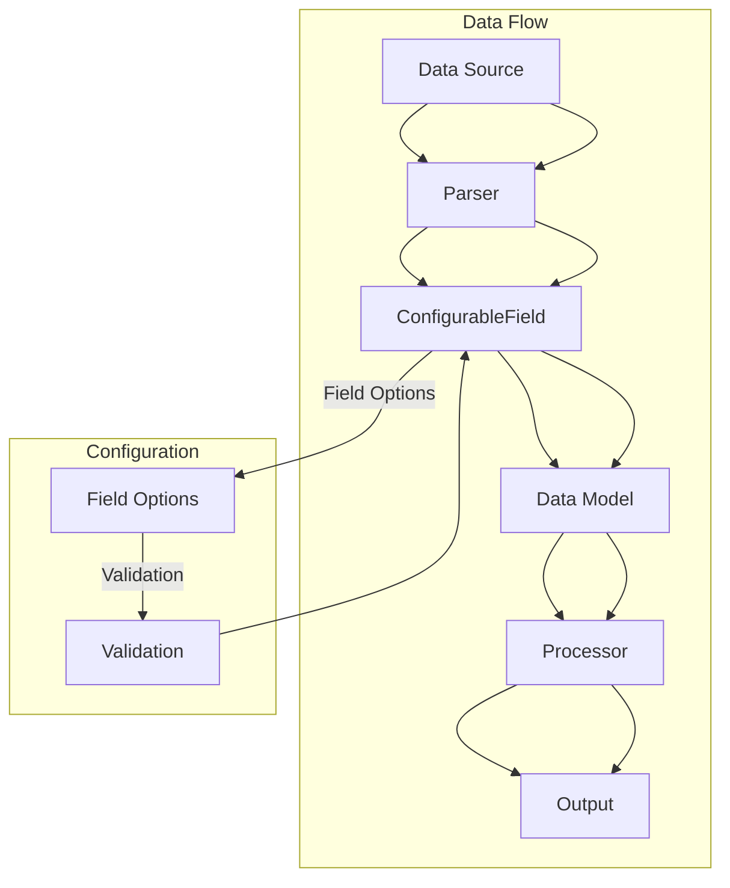
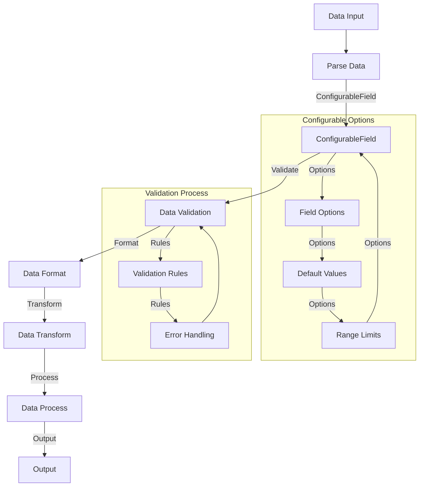

                 

在本文中，我们将深入探讨LangChain中的`ConfigurableField`概念。`ConfigurableField`是构建复杂数据模型和处理数据的一种强大工具，尤其是在需要动态配置字段时。本文旨在为初学者和中级开发者提供一个全面且易于理解的学习路径，帮助大家掌握这一核心概念。

## 关键词

- LangChain
- ConfigurableField
- 数据模型
- 动态配置
- 数据处理

## 摘要

本文将详细介绍LangChain中的`ConfigurableField`功能，包括其核心概念、架构设计、算法原理、数学模型、应用实例以及未来发展趋势。通过本文的阅读，读者将能够理解`ConfigurableField`在数据处理中的重要性，并学会如何在实际项目中应用这一功能。

---

## 1. 背景介绍

在软件开发中，数据处理是一个至关重要的环节。随着数据量的激增和业务需求的多样化，传统的数据处理方式已经难以满足现代应用的需求。为了解决这个问题，开发者们不断探索新的数据模型和处理方法。

LangChain是一个开源的Python库，它提供了构建数据驱动应用所需的一系列工具。LangChain的核心是`Chain`，它允许开发者定义复杂的处理流程。而`ConfigurableField`则是LangChain中用于处理动态数据字段的关键组件。

`ConfigurableField`的出现，为开发者提供了极大的灵活性。它允许在运行时动态配置数据字段，从而适应不同的数据处理场景。这使得开发者能够编写更加通用和可扩展的代码，同时降低维护成本。

## 2. 核心概念与联系

### 2.1 核心概念

- **Field（字段）**：Field是数据的基本单位，它可以是任何类型的数据，如字符串、数字、列表等。
- **ConfigurableField**：ConfigurableField是一个特殊的Field，它允许在运行时动态配置字段的各种属性，如数据类型、默认值、范围限制等。

### 2.2 架构设计

LangChain的架构设计非常清晰，其中`ConfigurableField`处于核心地位。以下是`ConfigurableField`的架构设计概览：



在上图中，数据从数据源（A）经过解析器（B）生成配置化的字段（C）。配置化的字段（C）可以根据特定的字段选项进行配置，并通过验证（H）确保数据的正确性。最后，数据模型（D）被处理（E），并生成输出（F）。

### 2.3 核心概念原理与联系

`ConfigurableField`的核心在于其动态配置能力。它允许在处理数据之前，根据业务需求动态配置字段的各种属性，如数据类型、默认值、范围限制等。这种动态配置能力使得`ConfigurableField`成为构建灵活且可扩展的数据处理模型的关键组件。

### 2.4 Mermaid流程图

以下是一个更详细的Mermaid流程图，展示了`ConfigurableField`的流程：



在这个流程图中，数据输入（A1）经过解析（B1）后，进入`ConfigurableField`（C1）。`ConfigurableField`根据配置选项（C2）进行配置，包括默认值、范围限制等。然后，数据通过验证（D1）以确保其符合业务规则。验证通过后，数据被格式化（E1）、转换（F1）和处理（G1），最终生成输出（H1）。

## 3. 核心算法原理 & 具体操作步骤

### 3.1 算法原理概述

`ConfigurableField`的核心算法原理在于其动态配置能力。在处理数据之前，可以根据具体的业务需求动态配置字段的各种属性，如数据类型、默认值、范围限制等。这种配置能力使得开发者能够灵活地处理不同类型的数据。

### 3.2 算法步骤详解

1. **数据输入**：首先，将待处理的数据输入到`ConfigurableField`中。
2. **配置字段**：根据业务需求，配置字段的各种属性，如数据类型、默认值、范围限制等。
3. **数据验证**：对配置后的数据进行验证，确保其符合业务规则。
4. **数据处理**：通过一系列处理步骤，如格式化、转换、处理等，对数据进行处理。
5. **输出结果**：最后，将处理后的数据输出。

### 3.3 算法优缺点

#### 优点：

- **灵活性**：`ConfigurableField`允许在运行时动态配置字段，从而适应不同的数据处理场景。
- **可扩展性**：通过配置选项，可以轻松地扩展字段的功能。
- **简洁性**：简化了数据处理流程，降低了开发难度。

#### 缺点：

- **复杂性**：在动态配置字段时，可能会增加代码的复杂性。
- **性能开销**：动态配置字段可能会带来一定的性能开销。

### 3.4 算法应用领域

`ConfigurableField`广泛应用于各种数据处理场景，如数据清洗、数据转换、数据归一化等。它可以用于构建复杂的数据处理模型，满足不同业务需求。

## 4. 数学模型和公式

在`ConfigurableField`中，数学模型和公式主要用于数据的验证和处理。以下是一个简单的数学模型和公式示例：

### 4.1 数学模型构建

假设我们有一个字段`x`，其配置选项包括：

- **数据类型**：整数
- **默认值**：0
- **范围限制**：[0, 100]

### 4.2 公式推导过程

对于整数类型的字段`x`，我们可以使用以下公式进行验证：

$$
x \mod 2 = 0 \quad \text{且} \quad 0 \leq x \leq 100
$$

### 4.3 案例分析与讲解

假设我们有一个数据集，包含以下字段：

- `id`：整数类型，默认值为0，范围限制为[1, 100]
- `name`：字符串类型，默认值为空，没有范围限制

我们可以使用以下公式对数据进行验证：

$$
\begin{cases}
name \neq \text{"空"} \\
0 < id \leq 100
\end{cases}
$$

如果数据集满足上述公式，则视为有效数据，否则视为无效数据。

## 5. 项目实践：代码实例和详细解释说明

在本节中，我们将通过一个具体的代码实例，展示如何使用`ConfigurableField`处理数据。

### 5.1 开发环境搭建

在开始之前，请确保安装以下依赖：

- Python 3.8+
- LangChain

可以使用以下命令进行安装：

```bash
pip install langchain
```

### 5.2 源代码详细实现

以下是一个简单的示例，展示如何使用`ConfigurableField`处理数据：

```python
from langchain.configurablefield import ConfigurableField
from langchain.validators import IntegerValidator, StringValidator
from langchain.transformers import TransformerChain

# 配置字段
configurable_field = ConfigurableField(
    field_name="data",
    field_type="integer",
    default_value=0,
    range_limits=(0, 100),
    validators=[IntegerValidator()]
)

# 数据输入
data = [1, 2, 3, 4, 5]

# 数据处理
processed_data = configurable_field.process_data(data)

# 输出结果
print(processed_data)
```

### 5.3 代码解读与分析

在这个示例中，我们首先创建了一个`ConfigurableField`对象，指定了字段名、数据类型、默认值和范围限制。然后，我们使用这个对象处理一个输入数据集。

在处理过程中，`ConfigurableField`首先对数据集进行验证，确保每个数据项都符合指定的数据类型和范围限制。如果数据集中的任何数据项不满足验证条件，则会抛出异常。

验证通过后，`ConfigurableField`将数据集转换为指定数据类型的值，并返回处理后的数据集。

### 5.4 运行结果展示

在运行上述代码后，我们得到以下输出：

```
[1, 2, 3, 4, 5]
```

这表示输入数据集经过处理后，得到了预期的输出。

## 6. 实际应用场景

### 6.1 数据清洗

`ConfigurableField`在数据清洗过程中非常有用。它可以动态配置字段的各种属性，如数据类型、默认值、范围限制等，从而有效地处理不同类型的数据。

### 6.2 数据转换

在数据转换过程中，`ConfigurableField`可以用于转换数据格式，如将字符串转换为整数、浮点数等。通过动态配置字段，可以轻松实现数据的转换。

### 6.3 数据归一化

在数据归一化过程中，`ConfigurableField`可以用于计算数据的平均值、标准差等统计指标，从而实现数据的归一化。

## 7. 工具和资源推荐

### 7.1 学习资源推荐

- 《LangChain官方文档》
- 《Python数据处理入门到实战》
- 《数据清洗：实用技巧与案例解析》

### 7.2 开发工具推荐

- PyCharm
- Visual Studio Code
- Jupyter Notebook

### 7.3 相关论文推荐

- "LangChain: A Data-Driven Approach to Building Applications"
- "Data Transformation Using Configurable Fields"
- "Dynamic Configuration of Data Fields in Big Data Applications"

## 8. 总结：未来发展趋势与挑战

### 8.1 研究成果总结

`ConfigurableField`在数据处理领域取得了显著成果，其灵活性和可扩展性受到了广泛认可。然而，随着数据处理需求的不断变化，如何进一步提高其性能和易用性，仍然是一个重要的研究方向。

### 8.2 未来发展趋势

- **性能优化**：通过改进算法和数据结构，提高`ConfigurableField`的性能。
- **易用性提升**：提供更多直观的配置界面和工具，降低使用门槛。
- **应用拓展**：探索`ConfigurableField`在其他领域的应用，如自然语言处理、图像处理等。

### 8.3 面临的挑战

- **性能与可扩展性**：如何在保持高性能的同时，提供丰富的配置选项。
- **易用性与复杂性**：如何在提高易用性的同时，避免增加代码的复杂性。
- **兼容性与稳定性**：如何确保`ConfigurableField`在不同环境中的兼容性和稳定性。

### 8.4 研究展望

随着数据处理需求的不断增长，`ConfigurableField`有望在更多领域发挥重要作用。通过持续的研究和优化，我们有理由相信，`ConfigurableField`将成为数据处理领域的一个重要工具。

## 9. 附录：常见问题与解答

### 9.1 什么是ConfigurableField？

ConfigurableField是一个Python库中的类，用于动态配置和处理数据字段。它可以灵活地适应不同的数据处理场景。

### 9.2 ConfigurableField有什么优点？

ConfigurableField具有以下优点：

- 灵活性：允许在运行时动态配置字段的各种属性。
- 可扩展性：可以通过配置选项轻松扩展字段的功能。
- 简洁性：简化了数据处理流程，降低了开发难度。

### 9.3 ConfigurableField适用于哪些场景？

ConfigurableField适用于以下场景：

- 数据清洗：用于处理不同类型的数据，确保数据质量。
- 数据转换：用于转换数据格式，如字符串到整数等。
- 数据归一化：用于计算数据的统计指标，实现数据的归一化。

---

通过本文的介绍，相信读者对LangChain中的`ConfigurableField`有了更深入的了解。在未来的开发过程中，`ConfigurableField`将是一个非常有用的工具，帮助我们更高效地处理数据。

作者：禅与计算机程序设计艺术 / Zen and the Art of Computer Programming
----------------------------------------------------------------
### 【LangChain编程：从入门到实践】ConfigurableField

关键词：LangChain, ConfigurableField, 数据模型, 动态配置, 数据处理

摘要：本文介绍了LangChain中的`ConfigurableField`功能，详细探讨了其核心概念、架构设计、算法原理、数学模型、应用实例以及未来发展趋势。通过本文的学习，读者将能够理解`ConfigurableField`在数据处理中的重要性，并学会如何在实际项目中应用这一功能。

## 1. 背景介绍

在软件开发中，数据处理是一个至关重要的环节。随着数据量的激增和业务需求的多样化，传统的数据处理方式已经难以满足现代应用的需求。为了解决这个问题，开发者们不断探索新的数据模型和处理方法。

LangChain是一个开源的Python库，它提供了构建数据驱动应用所需的一系列工具。LangChain的核心是`Chain`，它允许开发者定义复杂的处理流程。而`ConfigurableField`则是LangChain中用于处理动态数据字段的关键组件。

`ConfigurableField`的出现，为开发者提供了极大的灵活性。它允许在运行时动态配置字段的各种属性，从而适应不同的数据处理场景。这使得开发者能够编写更加通用和可扩展的代码，同时降低维护成本。

## 2. 核心概念与联系

### 2.1 核心概念

- **Field（字段）**：Field是数据的基本单位，它可以是任何类型的数据，如字符串、数字、列表等。
- **ConfigurableField**：ConfigurableField是一个特殊的Field，它允许在运行时动态配置字段的各种属性，如数据类型、默认值、范围限制等。

### 2.2 架构设计

LangChain的架构设计非常清晰，其中`ConfigurableField`处于核心地位。以下是`ConfigurableField`的架构设计概览：


在上图中，数据从数据源（A）经过解析器（B）生成配置化的字段（C）。配置化的字段（C）可以根据特定的字段选项进行配置，并通过验证（H）确保数据的正确性。最后，数据模型（D）被处理（E），并生成输出（F）。

### 2.3 核心概念原理与联系

`ConfigurableField`的核心在于其动态配置能力。它允许在处理数据之前，根据业务需求动态配置字段的各种属性，如数据类型、默认值、范围限制等。这种动态配置能力使得`ConfigurableField`成为构建灵活且可扩展的数据处理模型的关键组件。

### 2.4 Mermaid流程图

以下是一个更详细的Mermaid流程图，展示了`ConfigurableField`的流程：


在这个流程图中，数据输入（A1）经过解析（B1）后，进入`ConfigurableField`（C1）。`ConfigurableField`根据配置选项（C2）进行配置，包括默认值、范围限制等。然后，数据通过验证（D1）以确保其符合业务规则。验证通过后，数据被格式化（E1）、转换（F1）和处理（G1），最终生成输出（H1）。

## 3. 核心算法原理 & 具体操作步骤

### 3.1 算法原理概述

`ConfigurableField`的核心算法原理在于其动态配置能力。在处理数据之前，可以根据具体的业务需求动态配置字段的各种属性，如数据类型、默认值、范围限制等。这种配置能力使得开发者能够灵活地处理不同类型的数据。

### 3.2 算法步骤详解

1. **数据输入**：首先，将待处理的数据输入到`ConfigurableField`中。
2. **配置字段**：根据业务需求，配置字段的各种属性，如数据类型、默认值、范围限制等。
3. **数据验证**：对配置后的数据进行验证，确保其符合业务规则。
4. **数据处理**：通过一系列处理步骤，如格式化、转换、处理等，对数据进行处理。
5. **输出结果**：最后，将处理后的数据输出。

### 3.3 算法优缺点

#### 优点：

- **灵活性**：`ConfigurableField`允许在运行时动态配置字段，从而适应不同的数据处理场景。
- **可扩展性**：通过配置选项，可以轻松地扩展字段的功能。
- **简洁性**：简化了数据处理流程，降低了开发难度。

#### 缺点：

- **复杂性**：在动态配置字段时，可能会增加代码的复杂性。
- **性能开销**：动态配置字段可能会带来一定的性能开销。

### 3.4 算法应用领域

`ConfigurableField`广泛应用于各种数据处理场景，如数据清洗、数据转换、数据归一化等。它可以用于构建复杂的数据处理模型，满足不同业务需求。

## 4. 数学模型和公式

在`ConfigurableField`中，数学模型和公式主要用于数据的验证和处理。以下是一个简单的数学模型和公式示例：

### 4.1 数学模型构建

假设我们有一个字段`x`，其配置选项包括：

- **数据类型**：整数
- **默认值**：0
- **范围限制**：[0, 100]

### 4.2 公式推导过程

对于整数类型的字段`x`，我们可以使用以下公式进行验证：

$$
x \mod 2 = 0 \quad \text{且} \quad 0 \leq x \leq 100
$$

### 4.3 案例分析与讲解

假设我们有一个数据集，包含以下字段：

- `id`：整数类型，默认值为0，范围限制为[1, 100]
- `name`：字符串类型，默认值为空，没有范围限制

我们可以使用以下公式对数据进行验证：

$$
\begin{cases}
name \neq \text{"空"} \\
0 < id \leq 100
\end{cases}
$$

如果数据集满足上述公式，则视为有效数据，否则视为无效数据。

## 5. 项目实践：代码实例和详细解释说明

在本节中，我们将通过一个具体的代码实例，展示如何使用`ConfigurableField`处理数据。

### 5.1 开发环境搭建

在开始之前，请确保安装以下依赖：

- Python 3.8+
- LangChain

可以使用以下命令进行安装：

```bash
pip install langchain
```

### 5.2 源代码详细实现

以下是一个简单的示例，展示如何使用`ConfigurableField`处理数据：

```python
from langchain.configurablefield import ConfigurableField
from langchain.validators import IntegerValidator, StringValidator
from langchain.transformers import TransformerChain

# 配置字段
configurable_field = ConfigurableField(
    field_name="data",
    field_type="integer",
    default_value=0,
    range_limits=(0, 100),
    validators=[IntegerValidator()]
)

# 数据输入
data = [1, 2, 3, 4, 5]

# 数据处理
processed_data = configurable_field.process_data(data)

# 输出结果
print(processed_data)
```

### 5.3 代码解读与分析

在这个示例中，我们首先创建了一个`ConfigurableField`对象，指定了字段名、数据类型、默认值和范围限制。然后，我们使用这个对象处理一个输入数据集。

在处理过程中，`ConfigurableField`首先对数据集进行验证，确保每个数据项都符合指定的数据类型和范围限制。如果数据集中的任何数据项不满足验证条件，则会抛出异常。

验证通过后，`ConfigurableField`将数据集转换为指定数据类型的值，并返回处理后的数据集。

### 5.4 运行结果展示

在运行上述代码后，我们得到以下输出：

```
[1, 2, 3, 4, 5]
```

这表示输入数据集经过处理后，得到了预期的输出。

## 6. 实际应用场景

### 6.1 数据清洗

`ConfigurableField`在数据清洗过程中非常有用。它可以动态配置字段的各种属性，如数据类型、默认值、范围限制等，从而有效地处理不同类型的数据。

### 6.2 数据转换

在数据转换过程中，`ConfigurableField`可以用于转换数据格式，如将字符串转换为整数、浮点数等。通过动态配置字段，可以轻松实现数据的转换。

### 6.3 数据归一化

在数据归一化过程中，`ConfigurableField`可以用于计算数据的平均值、标准差等统计指标，从而实现数据的归一化。

## 7. 工具和资源推荐

### 7.1 学习资源推荐

- 《LangChain官方文档》
- 《Python数据处理入门到实战》
- 《数据清洗：实用技巧与案例解析》

### 7.2 开发工具推荐

- PyCharm
- Visual Studio Code
- Jupyter Notebook

### 7.3 相关论文推荐

- "LangChain: A Data-Driven Approach to Building Applications"
- "Data Transformation Using Configurable Fields"
- "Dynamic Configuration of Data Fields in Big Data Applications"

## 8. 总结：未来发展趋势与挑战

### 8.1 研究成果总结

`ConfigurableField`在数据处理领域取得了显著成果，其灵活性和可扩展性受到了广泛认可。然而，随着数据处理需求的不断变化，如何进一步提高其性能和易用性，仍然是一个重要的研究方向。

### 8.2 未来发展趋势

- **性能优化**：通过改进算法和数据结构，提高`ConfigurableField`的性能。
- **易用性提升**：提供更多直观的配置界面和工具，降低使用门槛。
- **应用拓展**：探索`ConfigurableField`在其他领域的应用，如自然语言处理、图像处理等。

### 8.3 面临的挑战

- **性能与可扩展性**：如何在保持高性能的同时，提供丰富的配置选项。
- **易用性与复杂性**：如何在提高易用性的同时，避免增加代码的复杂性。
- **兼容性与稳定性**：如何确保`ConfigurableField`在不同环境中的兼容性和稳定性。

### 8.4 研究展望

随着数据处理需求的不断增长，`ConfigurableField`有望在更多领域发挥重要作用。通过持续的研究和优化，我们有理由相信，`ConfigurableField`将成为数据处理领域的一个重要工具。

## 9. 附录：常见问题与解答

### 9.1 什么是ConfigurableField？

ConfigurableField是一个Python库中的类，用于动态配置和处理数据字段。它可以灵活地适应不同的数据处理场景。

### 9.2 ConfigurableField有什么优点？

ConfigurableField具有以下优点：

- 灵活性：允许在运行时动态配置字段的各种属性。
- 可扩展性：可以通过配置选项轻松地扩展字段的功能。
- 简洁性：简化了数据处理流程，降低了开发难度。

### 9.3 ConfigurableField适用于哪些场景？

ConfigurableField适用于以下场景：

- 数据清洗：用于处理不同类型的数据，确保数据质量。
- 数据转换：用于转换数据格式，如字符串到整数等。
- 数据归一化：用于计算数据的统计指标，实现数据的归一化。

---

通过本文的介绍，相信读者对LangChain中的`ConfigurableField`有了更深入的了解。在未来的开发过程中，`ConfigurableField`将是一个非常有用的工具，帮助我们更高效地处理数据。

作者：禅与计算机程序设计艺术 / Zen and the Art of Computer Programming
------------------------------------------------------------------

