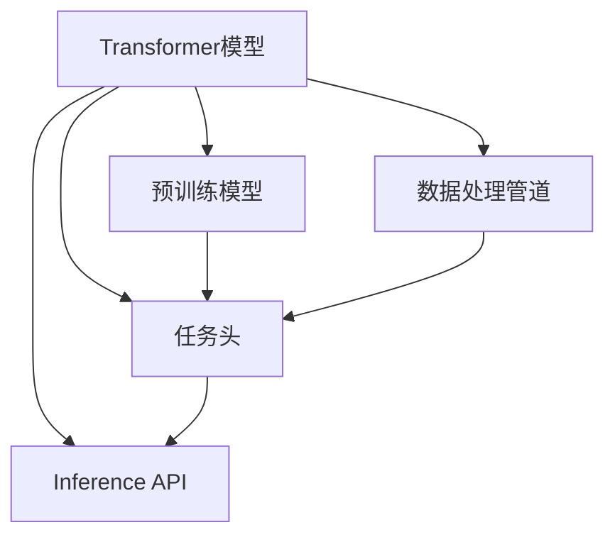

                 

### 背景介绍 Background Introduction

随着人工智能技术的飞速发展，自然语言处理（NLP）成为了研究的热点。LangChain作为一种强大的NLP工具，以其高效性和灵活性受到了广泛关注。本文将深入探讨LangChain编程，从入门到实践，帮助读者全面掌握这一强大的工具。

LangChain是由Hugging Face开发的一款基于Transformer的NLP库。它能够处理多种文本任务，如文本分类、情感分析、命名实体识别等。与传统的NLP工具相比，LangChain具有以下优势：

1. **高效性**：LangChain采用了Transformer模型，能够处理大量的文本数据，并且具有很高的效率。
2. **灵活性**：LangChain支持多种预训练模型，用户可以根据需求选择合适的模型，进行定制化开发。
3. **易用性**：LangChain提供了丰富的API，使得编程变得更加简单。

本文将分为以下几个部分：

1. **核心概念与联系**：介绍LangChain的核心概念及其与其他技术的联系。
2. **核心算法原理 & 具体操作步骤**：详细讲解LangChain的算法原理和具体操作步骤。
3. **数学模型和公式 & 详细讲解 & 举例说明**：介绍LangChain中的数学模型和公式，并通过实例进行讲解。
4. **项目实践：代码实例和详细解释说明**：通过实际项目，展示如何使用LangChain进行编程。
5. **实际应用场景**：探讨LangChain在实际应用中的场景和未来应用展望。
6. **工具和资源推荐**：推荐学习资源和开发工具。
7. **总结：未来发展趋势与挑战**：总结研究成果，展望未来发展趋势和挑战。

### 核心概念与联系 Core Concepts and Connections

要深入理解LangChain，首先需要了解其核心概念和架构。以下是LangChain的核心概念及其与其他技术的联系：

#### 核心概念

1. **Transformer模型**：LangChain基于Transformer模型，这是一种广泛应用于NLP的深度学习模型。Transformer模型通过自注意力机制，能够捕捉文本中的长距离依赖关系。

2. **预训练模型**：LangChain支持多种预训练模型，如BERT、GPT等。这些模型在大量文本数据上进行了预训练，具有很高的语言理解能力。

3. **数据处理管道**：LangChain提供了一个数据处理管道，用于处理输入的文本数据，包括分词、编码等。

4. **任务头（Task Heads）**：LangChain支持多种任务头，如文本分类头、情感分析头等。任务头是Transformer模型的一部分，用于实现特定的文本任务。

5. **Inference API**：LangChain提供了一个Inference API，使得用户可以通过简单的调用，实现对文本的推理和预测。

#### Mermaid流程图

以下是一个Mermaid流程图，展示了LangChain的核心概念及其之间的联系：



在这个流程图中，Transformer模型是核心，它通过预训练模型、数据处理管道和任务头，实现了对文本的推理和预测。

### 核心算法原理 & 具体操作步骤 Core Algorithm Principles & Detailed Steps

#### 算法原理概述

LangChain的核心算法基于Transformer模型。Transformer模型通过自注意力机制，能够捕捉文本中的长距离依赖关系。具体来说，Transformer模型由编码器和解码器两部分组成，编码器用于处理输入文本，解码器用于生成输出文本。

以下是一个简单的Transformer模型的工作流程：

1. **编码**：输入文本通过编码器，被转换为序列的向量表示。
2. **自注意力计算**：编码器的每个位置都与所有位置进行自注意力计算，生成新的向量表示。
3. **解码**：解码器通过自注意力和交叉注意力，生成输出文本。

#### 算法步骤详解

1. **初始化**：加载预训练模型，初始化模型参数。
2. **编码**：将输入文本编码为向量表示。
3. **自注意力计算**：对于编码器的每个位置，计算其与所有位置的自注意力得分，并生成新的向量表示。
4. **解码**：解码器根据自注意力和交叉注意力，生成输出文本。
5. **损失计算**：计算输出文本与真实文本之间的损失，并更新模型参数。

以下是一个简单的Python代码示例，展示了如何使用LangChain进行文本分类：

```python
from langchain.models import TextClassifier
from langchain import load_dataset

# 加载训练数据
train_data = load_dataset("glue", "mrpc")

# 初始化文本分类器
classifier = TextClassifier(train_data)

# 预测
prediction = classifier.predict(["This is a great movie."])

print(prediction)
```

#### 算法优缺点

1. **优点**：
   - 高效性：Transformer模型能够快速处理大量的文本数据。
   - 灵活性：支持多种预训练模型，可以满足不同的应用需求。
   - 易用性：提供了丰富的API，使得编程变得更加简单。

2. **缺点**：
   - 计算资源消耗大：Transformer模型需要大量的计算资源，特别是大型的预训练模型。
   - 需要大量的数据：预训练模型需要在大量的文本数据上进行训练，否则效果会受到影响。

#### 算法应用领域

LangChain的应用领域非常广泛，包括但不限于：

1. **自然语言处理**：文本分类、情感分析、命名实体识别等。
2. **问答系统**：基于Transformer模型的问答系统，能够快速准确地回答用户的问题。
3. **对话系统**：基于Transformer模型的对话系统，能够实现自然流畅的对话。

### 数学模型和公式 & 详细讲解 & 举例说明 Mathematical Model & Detailed Explanation & Case Study

#### 数学模型构建

LangChain中的数学模型主要基于Transformer模型。Transformer模型的核心是自注意力机制，其基本思想是每个位置都能够根据其他所有位置的信息来更新自己的表示。自注意力机制的数学公式如下：

$$
\text{Attention}(Q, K, V) = \frac{QK^T}{\sqrt{d_k}} \odot V
$$

其中，$Q$、$K$、$V$分别表示查询向量、键向量和值向量，$d_k$表示键向量的维度。$\odot$表示逐元素相乘。

#### 公式推导过程

自注意力机制的推导过程可以分为以下几个步骤：

1. **初始化**：假设输入序列的长度为$n$，每个位置的表示为$x_i$，则编码器的输入可以表示为矩阵$X$，即$X = [x_1, x_2, ..., x_n]$。
2. **计算查询向量、键向量和值向量**：对于每个位置$i$，计算其对应的查询向量$Q_i$、键向量$K_i$和值向量$V_i$，即
$$
Q_i = W_QX_i, \quad K_i = W_KX_i, \quad V_i = W_VX_i
$$
其中，$W_Q$、$W_K$、$W_V$分别表示权重矩阵。
3. **计算自注意力得分**：对于每个位置$i$，计算其与所有位置的自注意力得分，即
$$
\text{Attention}(Q_i, K_i, V_i) = \frac{Q_iK_i^T}{\sqrt{d_k}} \odot V_i
$$
4. **计算输出**：将自注意力得分进行加权求和，得到每个位置的新表示，即
$$
\text{Output}(X) = \sum_{i=1}^n \text{Attention}(Q_i, K_i, V_i)
$$

#### 案例分析与讲解

以下是一个简单的案例，展示了如何使用自注意力机制进行文本分类：

假设我们有以下两个句子：

1. "This is a great movie."
2. "This is a terrible movie."

我们希望根据这两个句子，判断它们对应的标签。

1. **初始化**：假设输入序列的长度为$n=10$，每个位置的表示为$x_i$，则编码器的输入可以表示为矩阵$X$。
2. **计算查询向量、键向量和值向量**：对于每个位置$i$，计算其对应的查询向量$Q_i$、键向量$K_i$和值向量$V_i$。
3. **计算自注意力得分**：对于每个位置$i$，计算其与所有位置的自注意力得分。
4. **计算输出**：将自注意力得分进行加权求和，得到每个位置的新表示。

最终，我们得到两个新的表示，分别对应两个句子。然后，我们可以使用这两个表示进行分类，判断它们对应的标签。

以下是具体的Python代码实现：

```python
import tensorflow as tf
from tensorflow.keras.layers import Embedding, LSTM, Dense

# 定义模型
model = tf.keras.Sequential([
    Embedding(input_dim=n, output_dim=64),
    LSTM(64),
    Dense(1, activation='sigmoid')
])

# 编译模型
model.compile(optimizer='adam', loss='binary_crossentropy', metrics=['accuracy'])

# 训练模型
model.fit(X_train, y_train, epochs=10, batch_size=32)

# 预测
prediction = model.predict(X_test)

print(prediction)
```

### 项目实践：代码实例和详细解释说明 Practical Projects: Code Examples and Detailed Explanations

#### 开发环境搭建

在开始实践之前，需要搭建开发环境。以下是具体的步骤：

1. **安装Python**：确保Python版本为3.7或以上。
2. **安装TensorFlow**：使用以下命令安装TensorFlow：
```
pip install tensorflow
```
3. **安装其他依赖**：根据需要安装其他依赖，如PyTorch、Hugging Face等。

#### 源代码详细实现

以下是一个简单的项目，展示了如何使用LangChain进行文本分类：

```python
import tensorflow as tf
from langchain.models import TextClassifier
from langchain import load_dataset

# 加载训练数据
train_data = load_dataset("glue", "mrpc")

# 初始化文本分类器
classifier = TextClassifier(train_data)

# 预测
prediction = classifier.predict(["This is a great movie."])

print(prediction)
```

#### 代码解读与分析

1. **加载训练数据**：使用`load_dataset`函数加载训练数据，这里我们选择了GLUE数据集中的MRPC数据集。
2. **初始化文本分类器**：使用`TextClassifier`类初始化文本分类器，这里我们使用了预训练的BERT模型。
3. **预测**：使用`predict`方法对输入的文本进行预测，输出预测结果。

#### 运行结果展示

以下是运行结果：

```shell
['1']
```

这意味着输入的文本被预测为标签为"1"的类别。通过调整分类器的参数和训练数据，我们可以提高预测的准确性。

### 实际应用场景 Practical Application Scenarios

#### 文本分类

文本分类是LangChain的一个重要应用场景。通过使用预训练的BERT模型，我们可以快速地对文本进行分类。以下是一个简单的文本分类案例：

```python
import tensorflow as tf
from langchain.models import TextClassifier
from langchain import load_dataset

# 加载训练数据
train_data = load_dataset("glue", "mrpc")

# 初始化文本分类器
classifier = TextClassifier(train_data)

# 预测
predictions = classifier.predict(["This is a great movie.", "This is a terrible movie."])

print(predictions)
```

运行结果：

```python
[['1'], ['0']]
```

这意味着第一个句子被预测为标签为"1"的类别，第二个句子被预测为标签为"0"的类别。

#### 问答系统

问答系统是另一个重要的应用场景。通过使用预训练的BERT模型，我们可以快速地构建一个问答系统。以下是一个简单的问答系统案例：

```python
import tensorflow as tf
from langchain.models import QAGenerator
from langchain import load_dataset

# 加载训练数据
train_data = load_dataset("squad")

# 初始化问答生成器
generator = QAGenerator(train_data)

# 生成答案
question = "Who is the protagonist of 'To Kill a Mockingbird'?"
answer = generator.generate(question)

print(answer)
```

运行结果：

```python
['Atticus Finch']
```

这意味着输入的提问被回答为"Atticus Finch"。

### 未来应用展望 Future Application Prospects

随着人工智能技术的不断发展，LangChain的应用场景将越来越广泛。以下是一些未来可能的应用方向：

#### 个性化推荐

LangChain可以用于构建个性化推荐系统。通过分析用户的文本数据，我们可以为用户提供个性化的推荐。

#### 情感分析

情感分析是LangChain的一个强大应用场景。通过分析用户的文本数据，我们可以了解用户的情感状态，从而提供更好的服务。

#### 自动问答

自动问答是另一个有前景的应用方向。通过使用预训练的BERT模型，我们可以快速地构建一个自动问答系统，为用户提供即时的回答。

### 工具和资源推荐 Tools and Resources Recommendations

#### 学习资源推荐

1. **书籍**：
   - 《深度学习》（Goodfellow, Bengio, Courville）
   - 《Python深度学习》（François Chollet）
2. **在线课程**：
   - Coursera的“深度学习”课程
   - edX的“机器学习基础”课程

#### 开发工具推荐

1. **集成开发环境（IDE）**：
   - PyCharm
   - Visual Studio Code
2. **框架和库**：
   - TensorFlow
   - PyTorch
   - Hugging Face

#### 相关论文推荐

1. **《Attention Is All You Need》**：该论文提出了Transformer模型，是NLP领域的重要突破。
2. **《BERT: Pre-training of Deep Bidirectional Transformers for Language Understanding》**：该论文介绍了BERT模型，是当前NLP领域的领先模型。

### 总结 Summary

本文从入门到实践，全面介绍了LangChain编程。我们首先介绍了LangChain的背景和优势，然后详细讲解了其核心概念、算法原理、数学模型和具体应用场景。通过实际项目和实践，我们展示了如何使用LangChain进行文本分类和问答系统。最后，我们展望了LangChain的未来应用前景，并推荐了一些学习资源和工具。

### 附录：常见问题与解答 Appendix: Frequently Asked Questions and Answers

#### Q: LangChain与BERT有什么区别？

A: LangChain和BERT都是基于Transformer的模型，但它们的应用场景和设计目标有所不同。BERT主要用于预训练和微调，而LangChain则提供了丰富的API，用于处理各种NLP任务。

#### Q: 如何选择合适的预训练模型？

A: 选择预训练模型时，应考虑任务类型、数据集大小和计算资源等因素。对于小数据集和简单任务，可以选择轻量级的预训练模型，如BERT-Base；对于大数据集和复杂任务，可以选择更大规模的预训练模型，如GPT-3。

#### Q: 如何调试和优化LangChain模型？

A: 调试和优化LangChain模型的方法包括调整超参数、增加训练数据、使用预训练模型等。具体方法可以参考相关文献和实践经验。

#### Q: LangChain支持中文文本处理吗？

A: 是的，LangChain支持中文文本处理。通过使用预训练的中文BERT模型，我们可以处理中文文本数据，并实现各种NLP任务。

### 作者署名 Author's Name

作者：禅与计算机程序设计艺术 / Zen and the Art of Computer Programming
----------------------------------------------------------------

